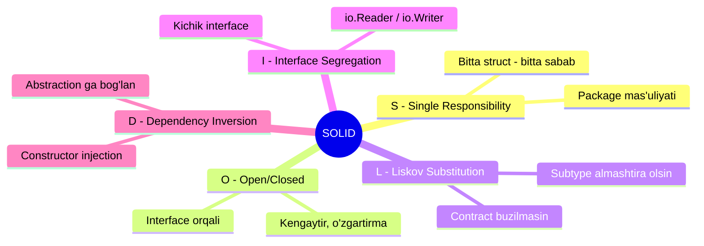
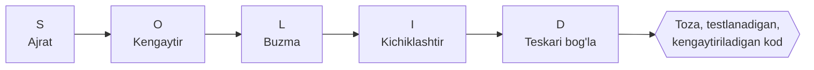

# S.O.L.I.D — beshta dizayn prinsipi

**SOLID** — obyektga yo'naltirilgan dizaynning beshta asosiy prinsipi. Ularni Robert C. Martin ("Uncle Bob") 2000-yillarda tizimlashtirgan. Maqsad bitta: kodni **o'zgarishga chidamli**, **oson testlanadigan** va **kengaytiriladigan** qilish.

> **Oltin qoida:** yaxshi dizayn — bu talab o'zgarganda kodning kichik, aniq bir joyi o'zgaradigan dizayn. SOLID aynan shu "o'zgarish og'rig'ini" kamaytirish uchun.

---

## Nega bu prinsiplar kerak?

Kod yozilgandan keyin o'lib qolmaydi — u **doim o'zgaradi**. Yangi talab keladi, bug tuzatiladi, integratsiya qo'shiladi. Yomon dizaynda har bir o'zgarish:

- boshqa, aloqasi yo'q joyni **sindiradi** (regression);
- katta faylni qayta o'qishga majbur qiladi;
- test yozishni imkonsiz qiladi (hamma narsa bir-biriga yopishgan).

SOLID bu muammolarni **oldini oladi**. Har bir harf bitta og'riqni davolaydi:

---

## Beshta prinsip — bir qarashda

| Harf | Nomi | Bir jumlada mohiyat | Fayl |
|------|------|---------------------|------|
| **S** | Single Responsibility | Bitta struct/package faqat **bitta sabab** bilan o'zgarishi kerak | [1. S.md](1.%20S.md) |
| **O** | Open/Closed | Kod **kengaytirish uchun ochiq**, o'zgartirish uchun yopiq bo'lsin | [2. O.md](2.%20O.md) |
| **L** | Liskov Substitution | Subtype o'z abstraction'ini **contract'ni buzmasdan** almashtira olsin | [3. L.md](3.%20L.md) |
| **I** | Interface Segregation | Katta interface o'rniga **kichik, maxsus** interface'lar ishlat | [4. I.md](4.%20I.md) |
| **D** | Dependency Inversion | Konkret tipga emas, **abstraction'ga (interface)** bog'lan | [5. D.md](5.%20D.md) |

> Eslatma: yuqoridagi jadvalda ataylab "abstraction", "interface", "contract", "subtype" kabi atamalar inglizcha qoldirilgan — bular kasbiy jargon, tarjima qilinmaydi.

---

## SOLID Go tilida — nega alohida yondashuv kerak?

Klassik SOLID Java/C++ kabi **class va inheritance** bor tillar uchun yozilgan. Go'da esa:

- **class yo'q** — o'rniga `struct`;
- **inheritance yo'q** — o'rniga `composition` (embedding) va `interface`;
- **interface implicit** — `implements` yozilmaydi, tip kerakli metodlarga ega bo'lsa avtomatik qondiradi.

Shuning uchun har bir prinsipni Go idiomalariga moslab ko'ramiz:

| Prinsip | Go'dagi asosiy idioma |
|---------|------------------------|
| **S** | package va struct mas'uliyatlarini ajratish (handler / service / repository) |
| **O** | `type switch` o'rniga `interface` + polymorphism |
| **L** | interface **contract**'ini buzmaslik; `io.Reader` semantikasi |
| **I** | kichik interface'lar — `io.Reader`, `io.Writer`; "accept interfaces, return structs" |
| **D** | constructor injection; interface'ni **iste'molchi (consumer) tomonida** e'lon qilish |

---

## O'qish tartibi

Prinsiplar bir-biriga tayanadi, shuning uchun **tartib bilan** o'qing:

1. [S — Single Responsibility](1.%20S.md) — poydevor: har narsa o'z joyida
2. [O — Open/Closed](2.%20O.md) — S ustiga quriladi: ajratilgan qismlarni interface bilan kengaytirish
3. [L — Liskov Substitution](3.%20L.md) — O ishlashi uchun interface contract to'g'ri bo'lishi shart
4. [I — Interface Segregation](4.%20I.md) — interface'larni to'g'ri (kichik) loyihalash
5. [D — Dependency Inversion](5.%20D.md) — hammasini bog'lab, bog'liqlik yo'nalishini teskari aylantirish

---

## Boshqa prinsiplar bilan bog'liqlik

SOLID yakka o'zi emas. Uning yonida boshqa muhim dizayn qoidalari ham bor. Ular qo'shni **`1.1 Principles/`** papkasida batafsil ko'riladi:

| Prinsip | Qisqa mohiyat |
|---------|----------------|
| **KISS** (Keep It Simple, Stupid) | Sodda yechim — eng yaxshi yechim |
| **DRY** (Don't Repeat Yourself) | Bilimni takrorlama, bitta manbada saqla |
| **YAGNI** (You Aren't Gonna Need It) | Hozir kerak bo'lmagan narsani yozma |
| **Law of Demeter** | "Faqat qo'shningga gapir" — chuqur zanjirli chaqiruvlardan qoch |
| **High Cohesion / Low Coupling** | Ichida zich bog'langan, tashqi bog'liqligi kam modullar |
| **Separation of Concerns** | Har xil vazifani har xil qismga ajrat |
| **GRASP** | Mas'uliyatni obyektlarga to'g'ri taqsimlash naqshlari |

> SOLID va bu prinsiplar bir-birini to'ldiradi: masalan **S** (Single Responsibility) — bu aslida **Separation of Concerns** va **High Cohesion**'ning konkret ko'rinishi. Har bir prinsip faylining STEP 4 bo'limida bu bog'liqliklarni batafsil ko'rasiz.

---

## Xato tushunchalarga qarshi ogohlantirish

- SOLID — **qonun emas, yo'l-yo'riq**. Uni ko'r-ko'rona qo'llash zararli (masalan har bitta narsaga interface yasash — keraksiz abstraction). Har prinsip faylida STEP 3 aynan shu chegaralarni ko'rsatadi.
- SOLID **kod hajmini kamaytirmaydi** — u kodni **o'zgarishga tayyor** qiladi. Ba'zan qatorlar ko'payadi, lekin har biri o'z joyida bo'ladi.
- Go'da SOLID Java'dagidan **soddaroq** chiqadi, chunki implicit interface va composition ko'p ishni o'zi hal qiladi.

Keyingi qadam: [S — Single Responsibility Principle](1.%20S.md) dan boshlang.
