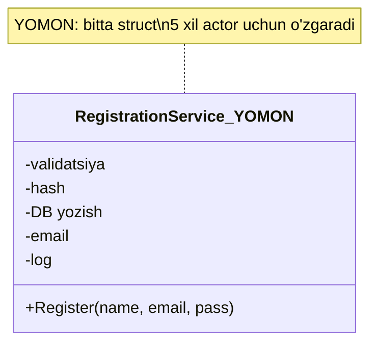
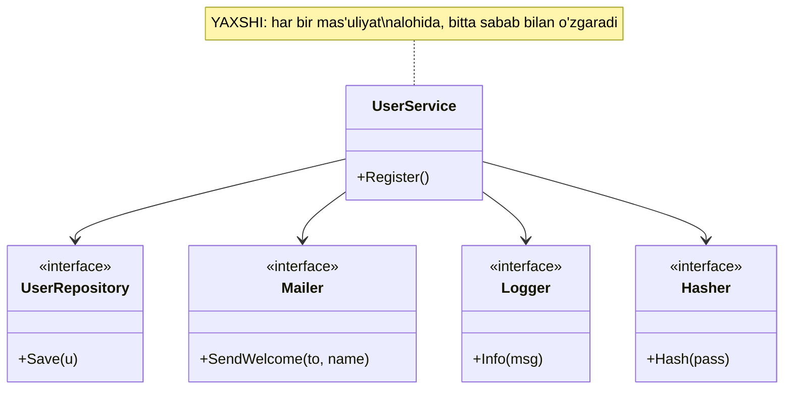

# S — Single Responsibility Principle

> Har bir struct, funksiya yoki package **faqat bitta sabab** bilan o'zgarishi kerak — ya'ni faqat bitta "xo'jayin" (actor) uchun javobgar bo'lsin.

---

## STEP 1 — Umumiy tushuncha

### Muammo nima edi?

Real backend stsenariy: **foydalanuvchini ro'yxatdan o'tkazish** (user registration). Boshida hammasi bitta joyda yozilgan bo'ladi — bitta `UserService` (yoki hatto bitta HTTP handler) quyidagilarning **hammasini** qiladi:

1. HTTP so'rovdan JSON'ni o'qiydi va **validatsiya** qiladi;
2. parolni **hash** qiladi;
3. foydalanuvchini **ma'lumotlar bazasiga (database)** yozadi;
4. unga **welcome email** yuboradi;
5. **audit log** yozadi.

Bir qarashda qulay — "hammasi bitta funksiyada, ochib o'qiysan-qo'yasan". Lekin bu tuzoq. Bunday kod **bir nechta turli sabab** bilan o'zgaradi:

| Kim o'zgartiradi (actor) | Nimani o'zgartiradi |
|--------------------------|----------------------|
| Xavfsizlik jamoasi | parol hash algoritmini (bcrypt -> argon2) |
| DBA | jadval sxemasini, SQL so'rovni |
| Marketing | welcome email matnini |
| DevOps | log formatini (JSON, tracing) |
| Product | validatsiya qoidalarini |

Beshta har xil odam **bitta faylni** tahrirlaydi. Natija:

- **Coupling:** email kutubxonasini almashtirsang, tasodifan saqlash mantig'ini buzasan.
- **Test qiyin:** faqat validatsiyani test qilmoqchisan, lekin funksiya SMTP server va DB ulanishini talab qiladi.
- **Merge konflikt:** ikki dasturchi bir vaqtda bir faylni o'zgartiradi.
- **O'qib bo'lmaydi:** 300 qatorli funksiyada "aslida nima qilinyapti?" degan savol tug'iladi.

### Yechim nima?

Robert Martin ta'rifi: **"Gather together the things that change for the same reason. Separate those that change for different reasons."** Ya'ni bir sabab bilan o'zgaradigan narsalarni birga, har xil sabab bilan o'zgaradiganlarni alohida qo'y.

Ro'yxatdan o'tkazishni **qatlamlarga (layers)** ajratamiz:

- `Handler` — faqat HTTP bilan ishlaydi (so'rovni o'qish, javob yozish);
- `UserService` — faqat biznes-mantiq (validatsiya, ro'yxatga olish tartibi);
- `UserRepository` — faqat saqlash (database);
- `Mailer` — faqat email;
- `Logger` — faqat log.

Endi email matnini o'zgartirish **faqat** Mailer'ga tegadi. Qolgani qimirlamaydi.

### Asosiy qoida

> **Bir struct — bitta sabab uchun o'zgaradi (one struct, one reason to change).**
>
> Agar tipni tasvirlashda "va" so'zini ishlatsang — "saqlaydi **va** email yuboradi **va** log yozadi" — bu SRP buzilganining birinchi belgisi.

### Kundalik hayotdan analogiya

Tasavvur qil: kichik oshxona, u yerda **bitta odam** ham oshpaz, ham ofitsiant, ham kassir. Mijoz kam bo'lsa ishlaydi. Lekin:

- oshpaz kasal bo'lsa — **butun** restoran to'xtaydi;
- menyu o'zgarsa — o'sha bitta odam hamma narsani qayta o'rganadi;
- ikki mijoz bir vaqtda kelsa — biri kutadi.

Katta restoranda esa **har kim bitta ish** qiladi: oshpaz pishiradi, ofitsiant kutadi, kassir pul oladi. Biri almashtirilsa (yangi ofitsiant), qolganlari sezmaydi ham. Aynan shu — SRP.

> Analogiya chegarasi: bu "bir odam — bir vazifa" degani "bir struct — bir metod" degani EMAS. Struct'da o'nlab metod bo'lishi mumkin, muhimi — ularning hammasi **bitta sabab** bilan o'zgarsin.

---

## STEP 2 — Yomon va yaxshi misol (Go)

### YOMON misol — bitta struct hamma narsani qiladi

```go
package main

import (
	"database/sql"
	"fmt"
	"net/smtp"
)

// YOMON: RegistrationService bitta o'zi 5 xil sabab bilan o'zgaradi.
// HTTP, validatsiya, hash, DB, email, log -> hammasi aralashgan.
type RegistrationService struct {
	db   *sql.DB
	smtp string
}

func (s *RegistrationService) Register(name, email, password string) error {
	// --- 1-sabab: validatsiya (Product jamoasi o'zgartiradi) ---
	if len(password) < 8 {
		return fmt.Errorf("parol juda qisqa")
	}

	// --- 2-sabab: parolni hash qilish (Xavfsizlik jamoasi) ---
	hash := fmt.Sprintf("hashed(%s)", password) // soddalashtirilgan

	// --- 3-sabab: DB ga yozish (DBA) ---
	_, err := s.db.Exec("INSERT INTO users(name, email, pass) VALUES(?,?,?)",
		name, email, hash)
	if err != nil {
		return err
	}

	// --- 4-sabab: welcome email (Marketing) ---
	msg := []byte("Subject: Xush kelibsiz!\r\n\r\nSalom, " + name)
	_ = smtp.SendMail(s.smtp, nil, "noreply@app.uz", []string{email}, msg)

	// --- 5-sabab: audit log (DevOps) ---
	fmt.Printf("[AUDIT] yangi user: %s\n", email)

	return nil
}
```

**Muammo:** bitta `Register` metodi ichida beshta turli qaror. Parol hash'ini `argon2`'ga o'zgartirmoqchi bo'lsang — SMTP va SQL kodlari yonida "aralashib" turibdi, xato qilish oson. Bu metodni test qilish uchun esa **haqiqiy** `*sql.DB` va SMTP server kerak.

### YAXSHI misol — qatlamlarga ajratilgan

Avval har bir mas'uliyat uchun **kichik interface** e'lon qilamiz, keyin `UserService` ularni **birlashtiradi**, lekin o'zi ichini bilmaydi.

```go
package main

import (
	"errors"
	"fmt"
)

// User — sof ma'lumot (data), hech qanday mantiqsiz
type User struct {
	Name     string
	Email    string
	PassHash string
}

// --- Har bir mas'uliyat -> alohida interface (contract) ---

type UserRepository interface {
	Save(u User) error // faqat saqlash
}

type Mailer interface {
	SendWelcome(to, name string) error // faqat email
}

type Logger interface {
	Info(msg string) // faqat log
}

type Hasher interface {
	Hash(password string) string // faqat parol hash
}
```

Endi **biznes-mantiq** — u faqat interface'larni biladi, konkret DB yoki SMTP'ni emas:

```go
// UserService — faqat bitta sabab bilan o'zgaradi: "ro'yxatga olish TARTIBI".
// U qaysi DB, qaysi email ekanini bilmaydi -> bog'liqliklar tashqaridan keladi.
type UserService struct {
	repo   UserRepository
	mailer Mailer
	log    Logger
	hasher Hasher
}

func NewUserService(r UserRepository, m Mailer, l Logger, h Hasher) *UserService {
	return &UserService{repo: r, mailer: m, log: l, hasher: h}
}

func (s *UserService) Register(name, email, password string) error {
	// Faqat TARTIBNI boshqaradi, har bir qadam detalini boshqa struct biladi.
	if len(password) < 8 {
		return errors.New("parol juda qisqa")
	}
	u := User{Name: name, Email: email, PassHash: s.hasher.Hash(password)}

	if err := s.repo.Save(u); err != nil { // saqlash -> repository ishi
		return err
	}
	if err := s.mailer.SendWelcome(email, name); err != nil { // email -> mailer ishi
		s.log.Info("email yuborilmadi: " + email) // faqat ogohlantirish
	}
	s.log.Info("yangi user ro'yxatdan o'tdi: " + email)
	return nil
}
```

Konkret implementatsiyalar — har biri **o'zining** sababi bilan yashaydi:

```go
// Har bir struct BITTA ishni qiladi va BITTA sabab bilan o'zgaradi.
type PostgresUserRepo struct{ /* *sql.DB */ }

func (r PostgresUserRepo) Save(u User) error {
	fmt.Printf("[DB] saqlandi: %s\n", u.Email) // faqat DBA teginadi
	return nil
}

type SMTPMailer struct{ /* host */ }

func (m SMTPMailer) SendWelcome(to, name string) error {
	fmt.Printf("[MAIL] welcome -> %s (%s)\n", to, name) // faqat Marketing teginadi
	return nil
}

type ConsoleLogger struct{}

func (l ConsoleLogger) Info(msg string) { fmt.Println("[LOG]", msg) }

type SHA256Hasher struct{}

func (h SHA256Hasher) Hash(password string) string { return "hash:" + password }

func main() {
	// Barcha qismlarni bir joyda ulaymiz (composition root)
	svc := NewUserService(PostgresUserRepo{}, SMTPMailer{}, ConsoleLogger{}, SHA256Hasher{})
	_ = svc.Register("Ali", "ali@mail.uz", "parol123")
}
```

**Output:**

```
[DB] saqlandi: ali@mail.uz
[MAIL] welcome -> ali@mail.uz (Ali)
[LOG] yangi user ro'yxatdan o'tdi: ali@mail.uz
```

Endi:

- parol hash'ini o'zgartirish -> faqat `SHA256Hasher`'ga tegasan;
- email matnini o'zgartirish -> faqat `SMTPMailer`;
- test yozish oson -> `UserRepository` o'rniga soxta (fake) struct berasan, DB kerak emas.

### Vizualizatsiya — YOMON vs YAXSHI





### Package darajasidagi SRP

SRP faqat struct'larga emas, **package**'larga ham tegishli. Go'da odatda shunday ajratiladi:

```
/user
  /handler    -> faqat HTTP (transport)
  /service    -> faqat biznes-mantiq
  /repository -> faqat DB
```

Har package **bitta sabab** bilan o'zgaradi. Bu — Separation of Concerns'ning to'g'ridan-to'g'ri qo'llanilishi.

---

## STEP 3 — Chegaralar va trade-offlar

SRP juda foydali, lekin **haddan oshirilsa** o'zi muammoga aylanadi.

### 1. Anemic, mayda-mayda struct'lar

Agar har bir metodni alohida struct qilib yuborsang, o'nlab **bir metodli** tiplar paydo bo'ladi. Kodni o'qish uchun 15 ta faylni ochishga to'g'ri keladi. Bu **fragmentatsiya** — SRP nomi bilan qilingan over-engineering.

> **Belgi:** agar struct'ingda faqat bitta metod bor va u hech qachon alohida o'zgarmaydi/almashtirilmaydi — uni ajratish shart emas edi.

### 2. Ortiqcha indirection

Har bir qadam interface bo'lsa, kodni "ta'qib qilish" qiyinlashadi: `Register` -> `repo.Save` -> qaysi implementatsiya? Bir necha sakrash. Kichik loyihada bu KISS'ni buzadi.

### 3. "Reason to change" ni qanday o'lchash?

Eng qiyin savol — "bu bitta mas'uliyatmi yoki ikkitami?". Amaliy mezon:

- **Actor mezoni:** bu kodni **kim** (qaysi jamoa/rol) o'zgartirish uchun ochadi? Ikki xil actor bo'lsa — ikki struct.
- **Cohesion mezoni:** metodlar bir xil ma'lumot ustida ishlaydimi? Ha bo'lsa — birga qolsin.

### Balans jadvali

| Kam SRP (God object) | Optimal | Ortiqcha SRP (fragmentatsiya) |
|----------------------|---------|-------------------------------|
| Bitta 500 qatorli struct | Qatlamlar bo'yicha ajratilgan | 30 ta bir metodli struct |
| O'zgartirish qo'rqinchli | O'zgartirish lokal | Kod bo'ylab sakrash charchatadi |
| Test imkonsiz | Test oson | Test'da ko'p mock kerak |

> **Muvozanat:** SRP — bu "hamma narsani ajrat" emas. Bu "bir sabab bilan o'zgaradiganlarni **birga** ushla, har xil sababdagilarni ajrat". YAGNI bilan birga qo'lla: hozir bitta implementatsiya bo'lsa, interface qo'shishni kechiktir.

---

## STEP 4 — Boshqa prinsiplar bilan bog'liqlik

### SOLID ichida

- **O (Open/Closed):** avval SRP bilan mas'uliyatni ajratasan, keyin O bilan har bir ajratilgan qismni interface orqali kengaytirasan. SRP — O uchun poydevor.
- **I (Interface Segregation):** SRP struct darajasida, ISP interface darajasida bir xil g'oya — "kichik, fokuslangan bo'lak".
- **D (Dependency Inversion):** SRP'da ajratilgan qismlarni D bilan interface orqali bir-biriga ulaysan (yuqoridagi `NewUserService`).

### Klassik prinsiplar bilan

- **Separation of Concerns:** SRP — SoC'ning konkret shakli. SoC "vazifalarni ajrat" desa, SRP "har bir bo'lak bitta sabab bilan o'zgarsin" deb aniqlashtiradi.
- **High Cohesion:** SRP yuqori cohesion'ga olib keladi — struct ichidagi hamma narsa bitta maqsad uchun.
- **DRY:** ehtiyot bo'l — SRP va DRY ba'zan **ziddiyatga** tushadi. Ikki struct'da o'xshash kod ko'rsang, uni birlashtirishdan oldin so'ra: "bular bir xil sabab bilan o'zgaradimi?". Yo'q bo'lsa — takrorlanish **tasodifiy** (accidental), birlashtirma.
- **KISS / YAGNI:** SRP'ni ular bilan cheklab tur — har narsani ajratma, faqat **haqiqatan** har xil sabab bilan o'zgaradiganlarni ajrat.

---

## O'zingni tekshir

<details>
<summary>1. "Bir struct — bitta metod" — bu SRP'ning to'g'ri ta'rifimi?</summary>

Yo'q. SRP metod sonini cheklamaydi. Struct'da o'nlab metod bo'lishi mumkin — muhimi, ularning hammasi **bitta sabab (actor)** bilan o'zgarsin. To'g'ri savol: "bu metodlar bir xil odam/jamoa uchun o'zgaradimi?".
</details>

<details>
<summary>2. Yuqoridagi YOMON misolda nechta "reason to change" bor va ular kimlarga tegishli?</summary>

Kamida beshta: validatsiya (Product), parol hash (Xavfsizlik), SQL (DBA), email matni (Marketing), log formati (DevOps). Beshta har xil actor bitta faylni tahrirlaydi — bu SRP buzilishi.
</details>

<details>
<summary>3. Nega YAXSHI misolda UserService konkret PostgresUserRepo emas, UserRepository interface'ini oladi?</summary>

Ikki sabab: (1) UserService saqlash **detalini** bilmasligi kerak — bu boshqa mas'uliyat; (2) test'da haqiqiy DB o'rniga soxta struct berish mumkin bo'ladi. Bu SRP'ni D (Dependency Inversion) bilan bog'laydi.
</details>

<details>
<summary>4. Ikki struct'da bir xil 3 qator kod bor. DRY bo'yicha birlashtirish kerakmi?</summary>

Shoshilma. Avval so'ra: "bu ikki joy **bir xil sabab** bilan o'zgaradimi?". Ha bo'lsa — birlashtir (haqiqiy takrorlanish). Yo'q bo'lsa — bu tasodifiy o'xshashlik; birlashtirsang, kelajakda bir joyni o'zgartirmoqchi bo'lganingda ikkinchisi ham buziladi. SRP DRY'dan ustun turadi.
</details>

<details>
<summary>5. SRP'ni haddan oshirsang qanday muammo chiqadi?</summary>

Fragmentatsiya: o'nlab mayda, bir metodli anemic struct. Kodni tushunish uchun ko'p faylni ochish, ko'p indirection kerak bo'ladi. Bu KISS va YAGNI'ni buzadi. Yechim: faqat **haqiqatan** har xil sabab bilan o'zgaradiganlarni ajrat.
</details>
