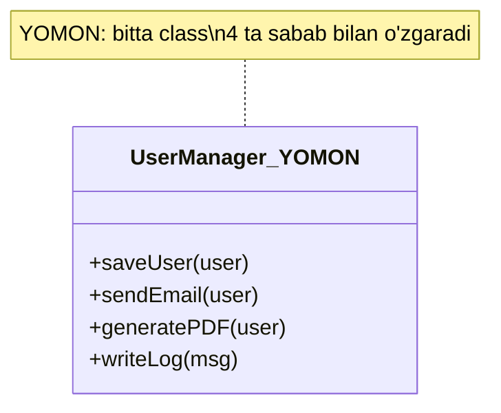
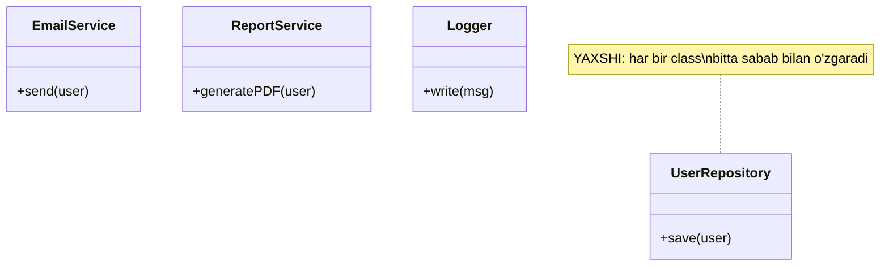
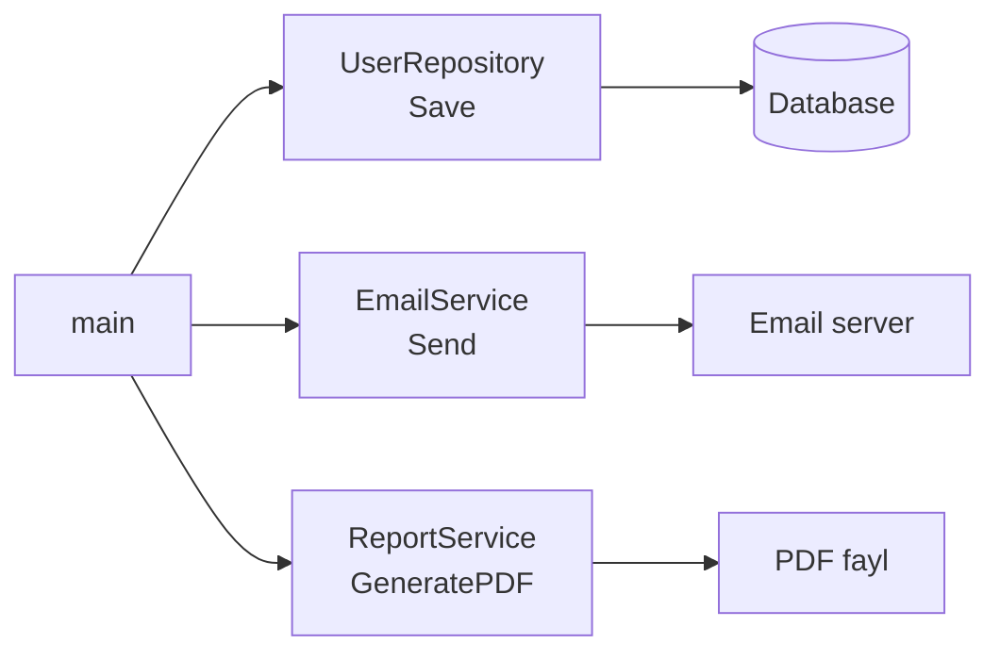

# S — Single Responsibility Principle

> **S**. Bu prinsip kodni toza, o'qiladigan va oson o'zgartiriladigan qilishning poydevoridir.

---

## STEP 1 — Umumiy tushuncha

### Muammo nima edi?

Tasavvur qiling, sizda bitta `UserManager` degan class bor va u quyidagi vazifalarning **hammasini** bajaradi:

1. Foydalanuvchini ma'lumotlar bazasiga (database) saqlaydi
2. Foydalanuvchiga email yuboradi
3. Foydalanuvchi haqida PDF hisobot (report) chiqaradi
4. Log yozadi

Bir qarashda bu qulay ko'rinadi — hammasi bitta joyda. Lekin amalda bu **katta muammo** keltirib chiqaradi:

**1. O'zgartirish bir-biriga ta'sir qiladi (coupling).**
Email yuborish kutubxonasini (masalan, SMTP'dan SendGrid'ga) almashtirsangiz, foydalanuvchini saqlash kodi ham xavf ostida qoladi. Chunki ular bitta classda. Bitta narsani tuzatib, butunlay boshqa narsani buzib qo'yishingiz mumkin.

**2. Test qilish qiyinlashadi.**
Faqat "saqlash" mantig'ini test qilmoqchisiz, lekin class email va PDF kutubxonalarini ham talab qiladi. Test uchun keraksiz bog'liqliklarni (dependency) ko'tarishga majbur bo'lasiz.

**3. Kod o'qilmaydigan bo'lib ketadi.**
1000 qatorlik class — uni tushunish uchun soatlar ketadi. Yangi dasturchi "bu yerda nima qilinyapti?" deb adashadi.

**4. Bir nechta sabab bilan o'zgaradi.**
Dizayner PDF ko'rinishini o'zgartirmoqchi — classni ochasiz. Marketing email matnini o'zgartirmoqchi — yana shu classni ochasiz. DBA database sxemasini o'zgartiradi — yana shu class. Bitta class **bir nechta bo'lim** uchun javobgar bo'lib qoladi.

### Yechim nima?

Har bir class **faqat bitta sabab uchun** o'zgarishi kerak. Ya'ni har bir classning bitta aniq vazifasi (responsibility) bo'lishi lozim:

- `UserRepository` — faqat saqlash bilan shug'ullanadi
- `EmailService` — faqat email bilan shug'ullanadi
- `ReportService` — faqat hisobot bilan shug'ullanadi

Agar email mantig'i o'zgarsa — faqat `EmailService` o'zgaradi, qolganlariga teginilmaydi.

### Asosiy qoida

> **Bir class — bitta sabab uchun o'zgarishi kerak (one class, one reason to change).**

### Vizualizatsiya — DO vs AFTER





---

## STEP 2 — Python tilida

### YOMON misol — bitta class hamma narsani qiladi

```python
# YOMON: UserManager bitta o'zi 3 xil vazifani bajaradi
# Bu SRP'ni buzadi, chunki class 3 xil sabab bilan o'zgaradi

class UserManager:
    def __init__(self, name, email):
        self.name = name
        self.email = email

    # 1-vazifa: foydalanuvchini bazaga saqlash
    def save_user(self):
        # Bu yer database mantig'i (data layer)
        print(f"[DB] {self.name} foydalanuvchi bazaga saqlandi")

    # 2-vazifa: email yuborish
    def send_email(self):
        # Bu yer email mantig'i (infrastructure layer)
        print(f"[EMAIL] {self.email} manziliga xabar yuborildi")

    # 3-vazifa: PDF hisobot chiqarish
    def generate_pdf_report(self):
        # Bu yer hisobot mantig'i (presentation layer)
        print(f"[PDF] {self.name} uchun PDF hisobot tayyorlandi")


# Ishlatish
user = UserManager("Ali", "ali@mail.uz")
user.save_user()
user.send_email()
user.generate_pdf_report()
```

**Output:**
```
[DB] Ali foydalanuvchi bazaga saqlandi
[EMAIL] ali@mail.uz manziliga xabar yuborildi
[PDF] Ali uchun PDF hisobot tayyorlandi
```

Muammo: agar PDF kutubxonasi o'zgarsa yoki email provayder almashsa — shu classni qayta-qayta ochishga to'g'ri keladi. Har bir teginish boshqa funksiyalarni buzish xavfini tug'diradi.

### YAXSHI misol — har bir class alohida javobgarlik

```python
# YAXSHI: har bir class faqat bitta vazifa bilan shug'ullanadi

# Oddiy ma'lumot saqlovchi class (data class)
class User:
    def __init__(self, name, email):
        self.name = name
        self.email = email


# 1-javobgarlik: faqat bazaga saqlash
class UserRepository:
    def save(self, user):
        # Faqat database mantig'i shu yerda
        print(f"[DB] {user.name} foydalanuvchi bazaga saqlandi")


# 2-javobgarlik: faqat email yuborish
class EmailService:
    def send(self, user):
        # Faqat email mantig'i shu yerda
        print(f"[EMAIL] {user.email} manziliga xabar yuborildi")


# 3-javobgarlik: faqat hisobot chiqarish
class ReportService:
    def generate_pdf(self, user):
        # Faqat hisobot mantig'i shu yerda
        print(f"[PDF] {user.name} uchun PDF hisobot tayyorlandi")


# Ishlatish — har bir service o'z ishini qiladi
user = User("Ali", "ali@mail.uz")

UserRepository().save(user)       # saqlash
EmailService().send(user)         # email
ReportService().generate_pdf(user)  # hisobot
```

**Output:**
```
[DB] Ali foydalanuvchi bazaga saqlandi
[EMAIL] ali@mail.uz manziliga xabar yuborildi
[PDF] Ali uchun PDF hisobot tayyorlandi
```

Endi email mantig'i o'zgarsa — faqat `EmailService`ga tegamiz. `UserRepository` va `ReportService` umuman ta'sirlanmaydi. Har birini alohida test qilish ham oson.

---

## STEP 3 — Go tilida

Go'da class yo'q, lekin uning o'rnida **struct** va **interface** bor. Aynan shu misolni Go'da ko'ramiz.

### YOMON misol — bitta struct hamma narsani qiladi

```go
package main

import "fmt"

// YOMON: bitta struct uchta vazifani bajaradi
// UserManager 3 xil sabab bilan o'zgaradi -> SRP buziladi
type UserManager struct {
	Name  string
	Email string
}

// 1-vazifa: bazaga saqlash
func (u *UserManager) SaveUser() {
	// database mantig'i
	fmt.Printf("[DB] %s foydalanuvchi bazaga saqlandi\n", u.Name)
}

// 2-vazifa: email yuborish
func (u *UserManager) SendEmail() {
	// email mantig'i
	fmt.Printf("[EMAIL] %s manziliga xabar yuborildi\n", u.Email)
}

// 3-vazifa: PDF hisobot chiqarish
func (u *UserManager) GeneratePDF() {
	// hisobot mantig'i
	fmt.Printf("[PDF] %s uchun PDF hisobot tayyorlandi\n", u.Name)
}

func main() {
	user := &UserManager{Name: "Ali", Email: "ali@mail.uz"}
	user.SaveUser()
	user.SendEmail()
	user.GeneratePDF()
}
```

**Output:**
```
[DB] Ali foydalanuvchi bazaga saqlandi
[EMAIL] ali@mail.uz manziliga xabar yuborildi
[PDF] Ali uchun PDF hisobot tayyorlandi
```

### YAXSHI misol — struct'lar ajratilgan, interface ishlatilgan

```go
package main

import "fmt"

// Oddiy ma'lumot saqlovchi struct
type User struct {
	Name  string
	Email string
}

// --- Interface'lar: har bir javobgarlikning shartnomasi (contract) ---

// Saqlash uchun interface
type Repository interface {
	Save(user User)
}

// Email yuborish uchun interface
type Mailer interface {
	Send(user User)
}

// Hisobot chiqarish uchun interface
type Reporter interface {
	GeneratePDF(user User)
}

// --- Har bir struct bitta javobgarlikni bajaradi ---

// 1-javobgarlik: faqat saqlash
type UserRepository struct{}

func (r UserRepository) Save(user User) {
	// faqat database mantig'i
	fmt.Printf("[DB] %s foydalanuvchi bazaga saqlandi\n", user.Name)
}

// 2-javobgarlik: faqat email
type EmailService struct{}

func (e EmailService) Send(user User) {
	// faqat email mantig'i
	fmt.Printf("[EMAIL] %s manziliga xabar yuborildi\n", user.Email)
}

// 3-javobgarlik: faqat hisobot
type ReportService struct{}

func (rs ReportService) GeneratePDF(user User) {
	// faqat hisobot mantig'i
	fmt.Printf("[PDF] %s uchun PDF hisobot tayyorlandi\n", user.Name)
}

func main() {
	user := User{Name: "Ali", Email: "ali@mail.uz"}

	// Interface orqali ishlatamiz -> kod moslashuvchan (flexible) bo'ladi
	var repo Repository = UserRepository{}
	var mailer Mailer = EmailService{}
	var reporter Reporter = ReportService{}

	repo.Save(user)          // saqlash
	mailer.Send(user)        // email
	reporter.GeneratePDF(user) // hisobot
}
```

**Output:**
```
[DB] Ali foydalanuvchi bazaga saqlandi
[EMAIL] ali@mail.uz manziliga xabar yuborildi
[PDF] Ali uchun PDF hisobot tayyorlandi
```

Bu yerda interface qo'shganimizning sababi: ertaga `EmailService` o'rniga `SMSService` yoki soxta (mock) test versiyasini qo'ysangiz ham, `main` kodi o'zgarmaydi — chunki u faqat `Mailer` interface'iga bog'liq. Bu SRP'ni Open/Closed prinsipi (keyingi harf — **O**) bilan bog'laydi.

### Oqim diagrammasi (YAXSHI yondashuv)



---

## Xulosa

### Asosiy fikrlar

- **Single Responsibility Principle** — har bir class/struct **faqat bitta vazifa** uchun javobgar bo'lishi kerak.
- Agar classni o'zgartirish uchun **bir nechta sabab** topsangiz — demak SRP buzilgan, uni bo'laklarga ajratish kerak.
- Vazifalarni ajratish kodni: oson **test qilinadigan**, oson **o'qiladigan** va oson **o'zgartiriladigan** qiladi.
- Go'da bu **struct** va **interface** orqali amalga oshiriladi: har bir struct bitta ishni qiladi, interface esa ularni bog'laydi.

### Eslab qol

> **"Bir class — bitta sabab uchun o'zgaradi."**
>
> Agar siz classni tasvirlashda "va" so'zini ishlatsangiz (saqlaydi **va** email yuboradi **va** PDF chiqaradi) — bu SRP buzilganining belgisidir.

### Amaliyot topshiriqlari

1. **Topish:** O'zingizning eski kodingizdan bitta katta class/struct toping va uning nechta "sabab"i borligini sanang. Har bir sababni alohida class/structga ajrating.

2. **Python:** `OrderManager` degan class yozing — u buyurtmani hisoblaydi, to'lovni amalga oshiradi va chek (receipt) chop etadi. Keyin uni SRP'ga mos ravishda `OrderCalculator`, `PaymentService`, `ReceiptPrinter`ga ajrating.

3. **Go:** Yuqoridagi YAXSHI misolga `Logger` interface va `ConsoleLogger` struct qo'shing — u har bir amaldan keyin log yozsin. SRP'ni buzmasligiga e'tibor bering.

4. **Fikrlash:** "Bitta struct'da nechta metod bo'lishi mumkin?" degan savol noto'g'ri. To'g'ri savol — "bu metodlarning hammasi **bitta sabab** bilan o'zgaradimi?". Shu savol bilan o'z kodingizni tahlil qiling.

---
