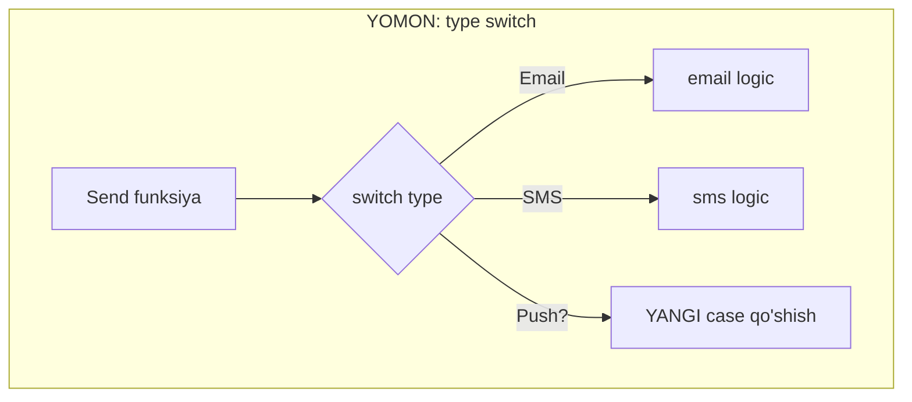
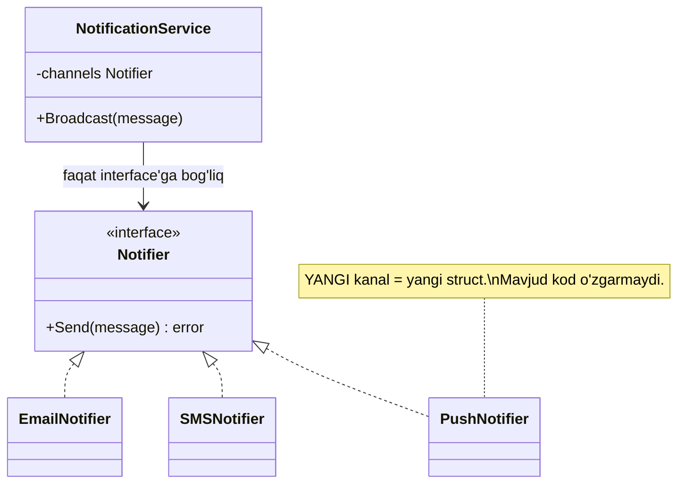

# O — Open/Closed Principle

> Kod **kengaytirish uchun ochiq** (open for extension), **o'zgartirish uchun yopiq** (closed for modification) bo'lishi kerak — yangi xatti-harakat qo'shish uchun eski, ishlab turgan kodni ochma.

---

## STEP 1 — Umumiy tushuncha

### Muammo nima edi?

Real backend stsenariy: **bildirishnoma (notification) xizmati**. Boshida faqat **email** bor edi. Keyin biznes o'sadi:

- "SMS ham qo'shaylik!"
- Bir oydan keyin: "Push notification kerak!"
- Yana keyin: "Telegram, Slack ham qo'shamiz!"

Agar sen hammasini **bitta funksiya** ichida `switch` (yoki `if-else`) bilan yozgan bo'lsang, har yangi kanal qo'shilganda **mavjud, ishlab turgan kodni ochib o'zgartirasan**:

```go
switch channel {
case "email": ...
case "sms": ...
case "push": ...   // <- har safar shu switch ichiga yangi case qo'shasan
}
```

**Nega bu yomon?**

1. **Regression xavfi.** Email jo'natish mukammal ishlardi. Push qo'shish uchun shu faylni ochding va tasodifan email'ga tegishli qatorni buzding. Avval ishlagan narsa endi ishlamaydi.
2. **Har safar qayta test.** Bitta funksiya kattalashib boradi, uni to'liq qayta test qilishga to'g'ri keladi.
3. **`switch` cheksiz uzayadi.** 10 ta kanal — 10 shoxli zanjir, o'qib bo'lmaydi.
4. **Parallel ishlash qiyin.** Hamma bitta faylni o'zgartirgani uchun merge konflikt chiqadi.

### Yechim nima?

**Open/Closed** aynan shuni hal qiladi: yangi kanal qo'shish = **yangi struct qo'shish**, eski kodni ochmaslik.

Buning kaliti — **abstraction (interface)**. Umumiy shartnoma — `Notifier` interface. Har bir kanal shu interface'ni qondiradigan **alohida struct**. Yuqori darajali kod faqat `Notifier`'ni biladi, konkret kanallarni emas.

> **Oltin qoida:** yangi imkoniyat qo'shish uchun doim eski faylga `case`/`if` qo'shayotgan bo'lsang — to'xta. Bu yerda interface kerak.

### Kundalik hayotdan analogiya

**Elektr rozetka.** Devordagi rozetkani (mavjud kod) hech qachon o'zgartirmaysan. Yangi qurilma kerak bo'lsa — telefon zaryadchisi, choynak, noutbuk — har birini shunchaki **ulaysan**. Rozetka faqat shtepsel **shaklini** (interface — contract) biladi, ichida nima borligini bilishi shart emas.

Ya'ni rozetka **kengaytirishga ochiq** (istalgan qurilma), lekin **o'zgartirishga yopiq** (devorni buzmaysan).

> Analogiya chegarasi: rozetka standarti (interface) o'zi ham ba'zan o'zgaradi (yangi USB-C turi). Xuddi shunday, interface ham "muzlatilgan" emas — lekin u **kamdan-kam** va **ehtiyotkorlik bilan** o'zgaradi, konkret implementatsiyalar esa tez-tez qo'shiladi.

---

## STEP 2 — Yomon va yaxshi misol (Go)

### YOMON misol — `type switch` bilan

Go'da eng ko'p uchraydigan OCP buzilishi — **`type switch`** yoki string bo'yicha `switch`. Har yangi tur uchun shu `switch`'ni ochib o'zgartirishga majbursan.

```go
package main

import "fmt"

// Har bir kanal uchun oddiy ma'lumot struct'i
type Email struct{ To, Subject string }
type SMS struct{ Phone, Text string }

// YOMON: bitta funksiya har bir turni switch bilan tekshiradi.
// Yangi kanal = shu switch'ni OCHIB o'zgartirish -> OCP buzildi.
func Send(notification any) error {
	switch n := notification.(type) {
	case Email:
		fmt.Printf("[EMAIL] %s -> %s\n", n.Subject, n.To)
	case SMS:
		fmt.Printf("[SMS] %s -> %s\n", n.Text, n.Phone)
	// Push qo'shish uchun SHU YERGA yana case yozamiz -> eski kodga tegdik
	default:
		return fmt.Errorf("noma'lum kanal")
	}
	return nil
}

func main() {
	_ = Send(Email{To: "ali@mail.uz", Subject: "Salom"})
	_ = Send(SMS{Phone: "+998901112233", Text: "Kod: 4455"})
}
```

**Output:**

```
[EMAIL] Salom -> ali@mail.uz
[SMS] Kod: 4455 -> +998901112233
```

Ishlaydi, lekin `Push`, `Telegram`, `Slack` qo'shish uchun har safar `Send` funksiyasini ochamiz. Bu — **o'zgartirishga ochiq**, ya'ni OCP teskarisi.

### YAXSHI misol — `interface` + polymorphism

Endi `type switch` o'rniga **polymorphism** ishlatamiz. Umumiy `Notifier` interface — har bir kanal o'zini o'zi biladi.

```go
package main

import "fmt"

// Umumiy shartnoma (contract). Send() metodi bo'lgan har qanday tip Notifier.
type Notifier interface {
	Send(message string) error
}

// Har bir kanal — ALOHIDA struct, o'z Send() mantig'i bilan.
type EmailNotifier struct{ To string }

func (e EmailNotifier) Send(message string) error {
	fmt.Printf("[EMAIL] %s -> %s\n", message, e.To)
	return nil
}

type SMSNotifier struct{ Phone string }

func (s SMSNotifier) Send(message string) error {
	fmt.Printf("[SMS] %s -> %s\n", message, s.Phone)
	return nil
}
```

Yuqori darajali kod (masalan `NotificationService`) faqat `Notifier`'ni biladi:

```go
// NotificationService konkret kanallarni BILMAYDI, faqat interface'ni.
// Shuning uchun u yangi kanal qo'shilganda O'ZGARMAYDI (yopiq).
type NotificationService struct {
	channels []Notifier
}

func (s *NotificationService) Broadcast(message string) {
	for _, c := range s.channels { // polymorphism: har biri o'zini biladi
		_ = c.Send(message)
	}
}

func main() {
	svc := &NotificationService{
		channels: []Notifier{
			EmailNotifier{To: "ali@mail.uz"},
			SMSNotifier{Phone: "+998901112233"},
		},
	}
	svc.Broadcast("Buyurtmangiz jo'natildi")
}
```

**Output:**

```
[EMAIL] Buyurtmangiz jo'natildi -> ali@mail.uz
[SMS] Buyurtmangiz jo'natildi -> +998901112233
```

Endi **Push** qo'shish — shunchaki yangi struct:

```go
// YANGI kanal = YANGI struct. Send() metodi borligi uchun avtomatik Notifier.
// NotificationService, EmailNotifier, SMSNotifier — HECH BIRIGA tegmadik!
type PushNotifier struct{ DeviceID string }

func (p PushNotifier) Send(message string) error {
	fmt.Printf("[PUSH] %s -> %s\n", message, p.DeviceID)
	return nil
}
```

`main` ichida shunchaki `PushNotifier{DeviceID: "abc123"}`'ni ro'yxatga qo'shasan. **Mavjud kodning bironta qatori o'zgarmaydi** — sistema kengaydi, lekin yopiq qoldi.

### Notional machine: Go'da bu qanday ishlaydi?

`c.Send(message)` chaqirilganda Go **interface value** ichidagi ikkita narsani ko'radi: (1) konkret tip (`EmailNotifier`), (2) o'sha tipning metod jadvali (itable). Chaqiruv vaqtida Go to'g'ri `Send`'ni **dinamik** tanlaydi. Sen `switch` yozmaysan — Go itable orqali o'zi topadi. Aynan shu **dynamic dispatch** OCP'ni ishlatadi: yangi tip yangi itable keltiradi, chaqiruvchi kod o'zgarmaydi.

### Yana bir bosqich — registry orqali to'liq ochiqlik

Yuqoridagi yechimda `main` hali ham qaysi kanallarni ulashni **biladi**. Ba'zan buni ham ochiq qilish kerak (masalan kanallar konfiguratsiyadan keladi). Buning uchun kanallarni **nom bo'yicha** ro'yxatga oladigan `registry` (map) ishlatamiz:

```go
// Registry — nom bo'yicha Notifier saqlaydi. Yangi kanal ro'yxatga qo'shiladi.
type Registry struct {
	notifiers map[string]Notifier
}

func NewRegistry() *Registry {
	return &Registry{notifiers: make(map[string]Notifier)}
}

// Register — yangi kanalni ochiqcha qo'shish (extension nuqtasi).
func (r *Registry) Register(name string, n Notifier) {
	r.notifiers[name] = n
}

// Dispatch — nom bo'yicha topib yuboradi; switch YO'Q.
func (r *Registry) Dispatch(channel, message string) error {
	n, ok := r.notifiers[channel]
	if !ok {
		return fmt.Errorf("noma'lum kanal: %s", channel)
	}
	return n.Send(message)
}
```

Ishlatish — yangi kanal qo'shish endi faqat bitta `Register` chaqiruvi:

```go
func main() {
	reg := NewRegistry()
	reg.Register("email", EmailNotifier{To: "ali@mail.uz"})
	reg.Register("sms", SMSNotifier{Phone: "+998901112233"})
	reg.Register("push", PushNotifier{DeviceID: "abc123"}) // yangi kanal, Dispatch tegilmaydi

	_ = reg.Dispatch("push", "Buyurtmangiz tayyor")
}
```

**Output:**

```
[PUSH] Buyurtmangiz tayyor -> abc123
```

E'tibor ber: `Dispatch` ichida **hech qanday `switch` yo'q**. Yangi kanal qo'shish = yangi `Register` qatori. Bu — OCP'ning eng kuchli ko'rinishi: hatto "ulash" bosqichi ham o'zgartirishga yopiq, kengaytirishga ochiq. Ko'p Go kutubxonasi (masalan `database/sql`'dagi `sql.Register` driver'lar uchun) aynan shu naqshni ishlatadi.

### Vizualizatsiya — YOMON vs YAXSHI





---

## STEP 3 — Chegaralar va trade-offlar

### 1. Har `switch` OCP buzilishi emas

`type switch` yoki `switch` — **o'zi yomon emas**. U faqat **kelajakda tez-tez kengaytiriladigan** o'q (axis) bo'yicha yomon. Agar variantlar to'plami **barqaror** bo'lsa (masalan haftaning 7 kuni, yoki HTTP metodlari GET/POST/PUT/DELETE), `switch` mutlaqo to'g'ri va soddaroq. Interface qo'shish bu yerda over-engineering bo'lardi.

> **Mezon:** "bu ro'yxat kelajakda o'sadimi?" Ha -> interface. Yo'q -> `switch` yaxshi (KISS).

### 2. Noto'g'ri "o'q" bo'yicha ochiqlik

OCP bir vaqtda **hamma yo'nalishda** ochiq bo'lolmaysan. Notification misolida kanal **turi** bo'yicha ochiqmiz. Lekin ertaga "har bir kanalga **retry** logikasi kerak" desa — bu boshqa o'q. Har bir imkoniyatni oldindan interface qilib qo'yish — YAGNI buzilishi. **Faqat haqiqatan o'zgaradigan o'q** bo'yicha ochiq bo'l.

### 3. Ortiqcha abstraction narxi

Har bir `switch`'ni interface'ga aylantirsang:

- fayllar soni ko'payadi;
- kodni "ta'qib qilish" qiyinlashadi (qaysi implementatsiya chaqirildi?);
- kichik dasturda bu foydadan ko'p ovoragarchilik.

### Balans jadvali

| Barqaror variantlar | Kengayadigan variantlar |
|---------------------|--------------------------|
| `switch` ishlataver (KISS) | `interface` ishlat (OCP) |
| Masalan: hafta kunlari, HTTP metodlar | Masalan: to'lov turlari, notification kanallar |
| Yangi tur kamdan-kam | Yangi tur tez-tez qo'shiladi |

> **Muvozanat:** OCP'ni oldindan (speculatively) qo'llama. **Uchinchi marta** `switch`'ga case qo'shayotganingda — o'shanda interface'ga o'tkaz ("Rule of Three"). Bu YAGNI bilan OCP'ni birga tutadi.

---

## STEP 4 — Boshqa prinsiplar bilan bog'liqlik

### SOLID ichida

- **S (Single Responsibility):** avval SRP bilan har bir kanalni alohida struct qilasan, keyin O bilan ularni umumiy interface ostiga birlashtirasan. SRP OCP uchun poydevor.
- **L (Liskov Substitution):** OCP interface orqali ishlaydi, lekin **faqat** har bir implementatsiya interface **contract'ini** buzmasa. Agar `PushNotifier.Send` kutilmagan panic qilsa — OCP "ishlaydi", lekin sistema buziladi. Shuning uchun O va L birga yuradi.
- **D (Dependency Inversion):** `NotificationService` konkret kanalga emas, `Notifier` interface'ga bog'liq — bu aynan DIP. OCP'ni amalga oshirish uchun DIP kerak.

### Klassik prinsiplar bilan

- **YAGNI:** OCP'ning eng katta dushmani — oldindan ortiqcha abstraction. YAGNI aytadi: haqiqiy ehtiyoj paydo bo'lguncha interface qo'shma. Rule of Three bu ikkalasini muvozanatlaydi.
- **KISS:** barqaror `switch` interface'dan soddaroq. KISS OCP'ni cheklab turadi.
- **Strategy pattern:** OCP ko'pincha **Strategy** design pattern orqali amalga oshiriladi — `Notifier` aslida strategiya. GoF pattern'lari SOLID'ni amalda qo'llash usullari.

---

## O'zingni tekshir

<details>
<summary>1. "Open for extension, closed for modification" — bu qanday qilib bir vaqtda mumkin?</summary>

Abstraction (interface) orqali. Yuqori kod interface'ga bog'lanadi -> u **yopiq** (o'zgarmaydi). Yangi xatti-harakat esa interface'ni qondiradigan yangi struct sifatida **qo'shiladi** -> sistema **ochiq**. Ochiqlik va yopiqlik har xil qatlamga tegishli: yopiqlik — chaqiruvchi kodda, ochiqlik — implementatsiyalar sonida.
</details>

<details>
<summary>2. Kodda uzun `type switch` ko'rsang, u har doim OCP buzilishimi?</summary>

Yo'q. Faqat variantlar to'plami **kelajakda o'sadigan** bo'lsa. Agar variantlar barqaror bo'lsa (hafta kunlari, HTTP metodlar), `switch` to'g'ri va soddaroq. To'g'ri savol: "bu ro'yxatga tez-tez yangi tur qo'shiladimi?".
</details>

<details>
<summary>3. Go'da yangi PushNotifier qo'shganda nega mavjud kod o'zgarmaydi?</summary>

Chunki `PushNotifier`'da `Send(string) error` metodi bor, shuning uchun Go uni **avtomatik** `Notifier` deb qabul qiladi (implicit interface). `NotificationService` faqat `Notifier`'ni biladi. Yangi tipni ro'yxatga qo'shasan, xolos — chaqiruvchi kodning bironta qatori o'zgarmaydi.
</details>

<details>
<summary>4. OCP va YAGNI qanday ziddiyatga tushadi? Qanday hal qilinadi?</summary>

OCP "kengayishga tayyor bo'l" desa, YAGNI "kerak bo'lmaguncha yozma" deydi. Agar har bir `switch`'ni oldindan interface qilsang — YAGNI buziladi. Yechim — "Rule of Three": uchinchi marta variant qo'shayotganingda interface'ga o'tkaz. Shunda abstraction haqiqiy ehtiyojdan tug'iladi.
</details>

<details>
<summary>5. OCP ishlashi uchun nega L (Liskov) ham kerak?</summary>

OCP yangi struct'larni interface orqali "ulaydi". Lekin agar biror implementatsiya interface **contract'ini** buzsa (masalan `Send` kutilmagan panic qilsa yoki mutlaqo boshqa ish qilsa), chaqiruvchi kod buziladi. LSP aynan shu contract'ni kafolatlaydi. Shuning uchun O interface qo'shadi, L esa uni **ishonchli** qiladi.
</details>
