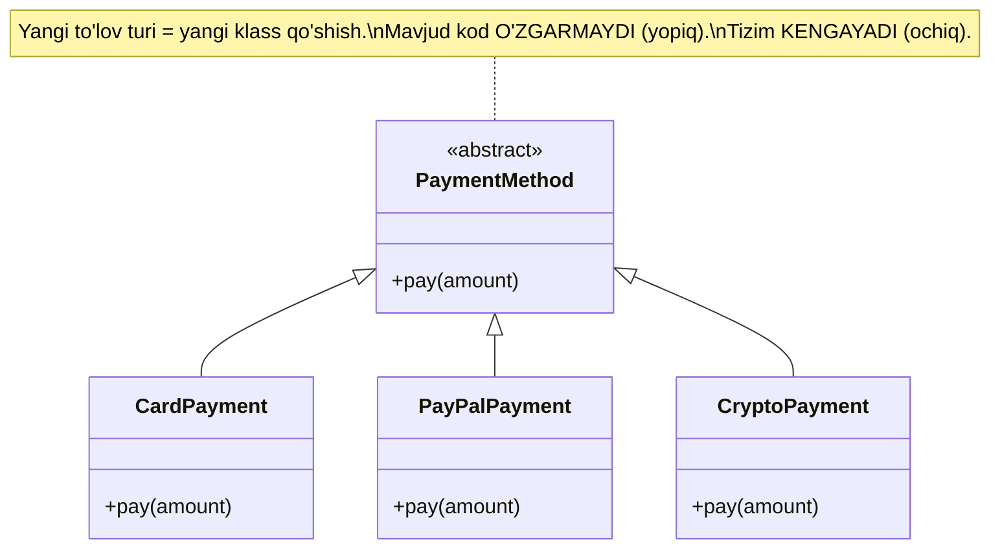
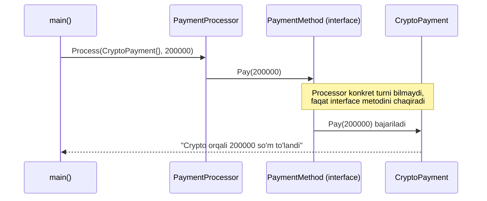

# O — Open/Closed Principle

---

## STEP 1 — Umumiy tushuncha

### Muammo nima edi?

Tasavvur qiling, siz onlayn do'kon uchun **to'lov tizimi (payment system)** yozyapsiz. Boshida faqat **plastik karta** orqali to'lov bor edi. Hammasi yaxshi ishlayapti.

Keyin biznes o'sadi va boshliq aytadi:
- "PayPal qo'shaylik!"
- Bir oydan keyin: "Stripe ham kerak!"
- Yana bir oydan keyin: "Endi Crypto (bitcoin) ham qo'shamiz!"

Agar siz hammasini **bitta katta klass** ichiga `if-else` bilan yozgan bo'lsangiz, har safar yangi to'lov turi qo'shilganda **mavjud, ishlab turgan kodni ochib o'zgartirishingiz** kerak bo'ladi:

```
if payment_type == "card":
    ...
elif payment_type == "paypal":
    ...
elif payment_type == "crypto":   # <-- har safar shu yerga yangi qator qo'shasiz
    ...
```

**Bu nima uchun yomon?**

1. **Eski xatoliklar qaytadi.** Karta to'lovi mukammal ishlab turardi. Lekin siz Crypto qo'shish uchun shu faylni ochdingiz va tasodifan kartaga tegishli bir qatorni buzib qo'ydingiz. Endi avval ishlagan narsa ishlamaydi (bunga **regression** deyiladi).

2. **Test qiyinlashadi.** Bitta klass juda katta bo'lib ketadi va uni to'liq qaytadan test qilishga to'g'ri keladi.

3. **`if-else` zanjiri cheksiz uzayadi.** 10 ta to'lov turi bo'lsa, 10 ta shoxli zanjir paydo bo'ladi va kodni o'qish azobga aylanadi.

4. **Bir nechta dasturchi bir vaqtda ishlay olmaydi.** Hamma bitta faylni o'zgartirgani uchun konflikt chiqadi.

### Yechim nima?

**Open/Closed Principle** aynan shuni hal qiladi:

> **Kengaytirish uchun OCHIQ (open for extension), o'zgartirish uchun YOPIQ (closed for modification).**

Ya'ni:
- **Ochiq** — yangi xulq-atvor (yangi to'lov turi) **qo'sha olishingiz** kerak.
- **Yopiq** — buni qilish uchun **eski kodni ochib o'zgartirmasligingiz** kerak.

Buni qanday qilamiz? **Abstraksiya (abstraction)** orqali. Umumiy bir shartnoma — `PaymentMethod` (abstract klass yoki interface) yaratamiz. Har bir yangi to'lov turi shu shartnomani bajaradigan **alohida yangi klass** bo'ladi. Yangi tur qo'shish = **yangi fayl yaratish**, eskisini ochmaslik.

### Asosiy qoida

> Yangi funksiya qo'shganda mavjud kodni o'zgartirmasdan, faqat **yangi kod qo'shish** orqali tizimni kengaytira olishing kerak.

### Vizualizatsiya



**Analogiya:** OCP — bu xuddi **elektr rozetka** kabi. Devordagi rozetkani (mavjud kod) o'zgartirmaysiz. Yangi qurilma kerak bo'lsa — telefon zaryadchisi, choynak, noutbuk — har birini shunchaki **ulaysiz**. Rozetka shtepselning shaklini biladi (shartnoma — interface), ichida nima borligini bilishi shart emas.

---

## STEP 2 — Python tilida

### YOMON misol (OCP buzilgan)

```python
# YOMON: hamma to'lov mantiqi bitta klass ichida if-else bilan.

class PaymentProcessor:
    def pay(self, payment_type: str, amount: float):
        # Har bir to'lov turi uchun alohida shox.
        if payment_type == "card":
            # Karta orqali to'lov mantiqi
            print(f"Karta orqali {amount} so'm to'landi")
        elif payment_type == "paypal":
            # PayPal orqali to'lov mantiqi
            print(f"PayPal orqali {amount} so'm to'landi")
        # MUAMMO: Crypto qo'shish uchun SHU faylni ochib,
        # quyiga yana bitta elif qo'shishga majburmiz.
        elif payment_type == "crypto":
            print(f"Crypto orqali {amount} so'm to'landi")
        else:
            # Noma'lum tur bo'lsa xatolik
            raise ValueError("Noma'lum to'lov turi")


# Ishlatish
processor = PaymentProcessor()
processor.pay("card", 100000)
processor.pay("paypal", 50000)
processor.pay("crypto", 200000)
```

**Output:**
```
Karta orqali 100000 so'm to'landi
PayPal orqali 50000 so'm to'landi
Crypto orqali 200000 so'm to'landi
```

Ishlaydi, lekin har yangi tur uchun `PaymentProcessor` ni ochib o'zgartirishga majburmiz. Bu — **yopiq emas**.

### YAXSHI misol (OCP'ga rioya qilingan)

```python
from abc import ABC, abstractmethod

# Umumiy shartnoma — abstract klass.
# Har bir to'lov turi shu klassdan meros oladi va pay() ni bajaradi.
class PaymentMethod(ABC):
    @abstractmethod
    def pay(self, amount: float):
        pass


# Har bir to'lov turi — ALOHIDA klass.
class CardPayment(PaymentMethod):
    def pay(self, amount: float):
        # Faqat kartaga tegishli mantiq shu yerda
        print(f"Karta orqali {amount} so'm to'landi")


class PayPalPayment(PaymentMethod):
    def pay(self, amount: float):
        # Faqat PayPal mantiqi shu yerda
        print(f"PayPal orqali {amount} so'm to'landi")


# YANGI tur qo'shish = YANGI klass. Eski kod TEGILMAYDI!
class CryptoPayment(PaymentMethod):
    def pay(self, amount: float):
        print(f"Crypto orqali {amount} so'm to'landi")


# Processor endi konkret turlarni BILMAYDI.
# U faqat "PaymentMethod" shartnomasini biladi.
class PaymentProcessor:
    def process(self, method: PaymentMethod, amount: float):
        method.pay(amount)


# Ishlatish
processor = PaymentProcessor()
processor.process(CardPayment(), 100000)
processor.process(PayPalPayment(), 50000)
processor.process(CryptoPayment(), 200000)
```

**Output:**
```
Karta orqali 100000 so'm to'landi
PayPal orqali 50000 so'm to'landi
Crypto orqali 200000 so'm to'landi
```

E'tibor bering: natija bir xil, lekin endi **Apple Pay** qo'shmoqchi bo'lsangiz, faqat yangi `ApplePayPayment(PaymentMethod)` klassini yozasiz. `PaymentProcessor` va boshqa to'lov klasslari **mutlaqo o'zgarmaydi**.

---

## STEP 3 — Go tilida

Go'da klasslar va meros (inheritance) yo'q. Buning o'rniga **interface** ishlatiladi. Bu OCP uchun juda qulay.

### YOMON misol (switch-case bilan type checking)

```go
package main

import "fmt"

// YOMON: bitta funksiya ichida switch orqali har bir turni tekshiramiz.
type PaymentProcessor struct{}

func (p PaymentProcessor) Pay(paymentType string, amount float64) {
	switch paymentType {
	case "card":
		// Karta mantiqi
		fmt.Printf("Karta orqali %.0f so'm to'landi\n", amount)
	case "paypal":
		// PayPal mantiqi
		fmt.Printf("PayPal orqali %.0f so'm to'landi\n", amount)
	// MUAMMO: yangi tur = shu switch'ni ochib, yangi case qo'shish.
	case "crypto":
		fmt.Printf("Crypto orqali %.0f so'm to'landi\n", amount)
	default:
		fmt.Println("Noma'lum to'lov turi")
	}
}

func main() {
	processor := PaymentProcessor{}
	processor.Pay("card", 100000)
	processor.Pay("paypal", 50000)
	processor.Pay("crypto", 200000)
}
```

**Output:**
```
Karta orqali 100000 so'm to'landi
PayPal orqali 50000 so'm to'landi
Crypto orqali 200000 so'm to'landi
```

Har yangi tur uchun `switch` ni ochib o'zgartiramiz — bu OCP buzilishi.

### YAXSHI misol (interface bilan)

```go
package main

import "fmt"

// Umumiy shartnoma — interface.
// Pay() metodiga ega bo'lgan har qanday tur PaymentMethod hisoblanadi.
type PaymentMethod interface {
	Pay(amount float64)
}

// Har bir to'lov turi — ALOHIDA struct.
type CardPayment struct{}

func (c CardPayment) Pay(amount float64) {
	// Faqat karta mantiqi
	fmt.Printf("Karta orqali %.0f so'm to'landi\n", amount)
}

type PayPalPayment struct{}

func (p PayPalPayment) Pay(amount float64) {
	// Faqat PayPal mantiqi
	fmt.Printf("PayPal orqali %.0f so'm to'landi\n", amount)
}

// YANGI tur = YANGI struct. Eski kod tegilmaydi!
type CryptoPayment struct{}

func (c CryptoPayment) Pay(amount float64) {
	fmt.Printf("Crypto orqali %.0f so'm to'landi\n", amount)
}

// Processor konkret turlarni bilmaydi, faqat interface'ni biladi.
type PaymentProcessor struct{}

func (p PaymentProcessor) Process(method PaymentMethod, amount float64) {
	method.Pay(amount)
}

func main() {
	processor := PaymentProcessor{}
	processor.Process(CardPayment{}, 100000)
	processor.Process(PayPalPayment{}, 50000)
	processor.Process(CryptoPayment{}, 200000)
}
```

**Output:**
```
Karta orqali 100000 so'm to'landi
PayPal orqali 50000 so'm to'landi
Crypto orqali 200000 so'm to'landi
```

Go'da yangi to'lov turi (masalan, `ApplePayPayment`) qo'shish uchun shunchaki yangi struct yaratib, unga `Pay(amount float64)` metodini bersangiz bo'ldi — u avtomatik ravishda `PaymentMethod` interface'ini qondiradi. **Hech qaysi mavjud kodga tegmaysiz.**

### Komponentlar muloqoti (sequence diagram)



---

## Xulosa

### Asosiy fikrlar

- **OCP** — "Kengaytirish uchun ochiq, o'zgartirish uchun yopiq".
- Yangi xulq-atvor qo'shish uchun mavjud, ishlab turgan kodni ochmaslik kerak.
- Buning kaliti — **abstraksiya**: Python'da `abstract class`, Go'da `interface`.
- `if-else` yoki `switch-case` zanjiri uzayib borayotgan bo'lsa — bu OCP buzilayotganining birinchi belgisi.
- Yangi tur qo'shish = **yangi fayl/struct/klass**, eskisini buzish emas.

### Eslab qol

> Kodingizda yangi imkoniyat qo'shish uchun doimo eski faylni ochib `if`/`case` qo'shayotgan bo'lsangiz — to'xtang. Bu yerda **interface** yoki **abstract class** kerak. Eski kodga teginish = eski xatoliklarni qaytarish (regression) xavfi.

Analogiyani eslang: **rozetka** o'zgarmaydi, qurilmalar esa cheksiz ulanaveradi.

### Amaliyot

1. **Oson:** Yuqoridagi Go misoliga `ApplePayPayment` struct'ini qo'shing. `main()` dan tashqari **hech qaysi** mavjud kodga teginmasligingiz kerak.

2. **O'rta:** Bildirishnoma (notification) tizimini yozing: `EmailNotifier`, `SMSNotifier`, `PushNotifier`. Umumiy interface — `Notifier` bo'lsin, `Send(message string)` metodi bilan. Avval YOMON (switch bilan), keyin YAXSHI (interface bilan) variantini yozing.

3. **Murakkab:** To'lov misoliga **chegirma (discount)** mantiqini OCP'ni buzmasdan qo'shing. Masalan, `Discount` interface yarating (`Apply(amount float64) float64`) va `BlackFridayDiscount`, `NewYearDiscount` kabi turlarni yozing. Maslahat: Processor ham `PaymentMethod`, ham `Discount` bilan ishlay olishi kerak.

4. **Tahlil:** O'zingiz yozgan eski loyihalaringizdan bittasini oching. Undagi eng uzun `if-else` yoki `switch` zanjirini toping. Uni qanday qilib interface bilan OCP'ga moslashtirishni qog'ozga chizib ko'ring.

---