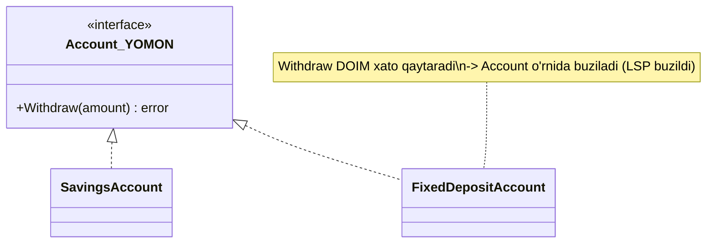
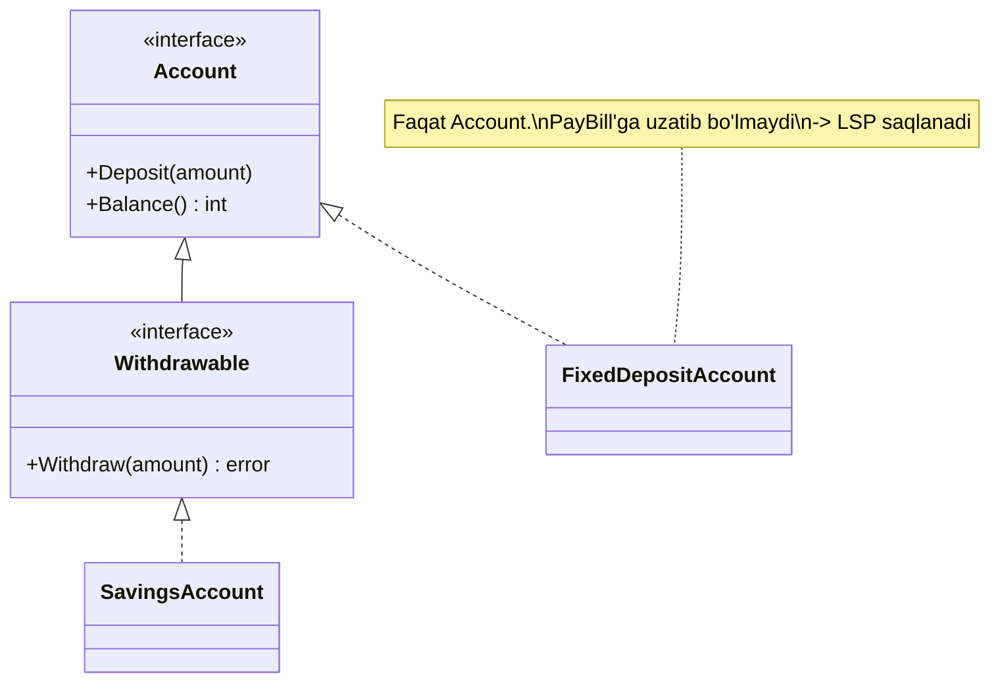

# L — Liskov Substitution Principle

> Agar kod biror interface (yoki tip) bilan ishlasa, uni **istalgan implementatsiya bilan almashtirganda** dastur to'g'ri ishlashda davom etishi kerak — subtype supertip **contract'ini** buzmasligi shart.

Bu prinsipni 1987-yilda Barbara Liskov taklif qilgan, shuning uchun uning nomi bilan ataladi.

---

## STEP 1 — Umumiy tushuncha

### Muammo nima edi?

Go'da inheritance yo'q, shuning uchun LSP bu yerda **interface contract** haqida. "Contract" — bu interface metodining faqat imzosi (signature) emas, balki **kutilgan xatti-harakati** (documented behavior): u nima qaytaradi, qachon xato beradi, qanday nojo'ya ta'sir (side effect) qiladi.

Real backend stsenariy: **bank hisoblari**. Bizda `Account` interface bor:

```go
type Account interface {
	Deposit(amount int)      // hisobga pul qo'shadi
	Withdraw(amount int) error // pul yechadi; contract: XATO faqat mablag' yetmasa
	Balance() int
}
```

Contract aniq: `Withdraw` **faqat mablag' yetmaganda** xato qaytaradi. Aks holda pulni yechadi. Butun dastur shu va'daga tayanadi:

```go
func PayBill(a Account, amount int) error {
	return a.Withdraw(amount) // "yetarli pul bo'lsa, ishlaydi" deb ishonadi
}
```

Endi **muddatli depozit** (`FixedDepositAccount`) qo'shamiz — undan muddatidan oldin pul yechib bo'lmaydi. Uni ham `Account` qilib yozamiz, `Withdraw` esa **doim** xato qaytaradi. Kompilyatsiya bo'ladi, tip mos. Lekin:

```go
PayBill(fixedDeposit, 100) // yetarli pul bor, LEKIN xato qaytadi!
```

`FixedDepositAccount` `Account` **o'rnida ishlay olmadi**. `PayBill` "yetarli pul bo'lsa ishlaydi" deb ishongandi — bu va'da buzildi. Bu **LSP buzilishi**: subtype supertip contract'ini kuchaytirib yubordi (yangi shart qo'ydi: "muddat tugashi kerak").

### Yechim nima?

Muammo — noto'g'ri abstraction. "Har qanday hisob pul yecha oladi" degan taxmin xato edi. Yechim: pul yechishni **alohida** contract'ga ajratamiz:

- `Account` — `Deposit`, `Balance` (hamma hisoblarda bor);
- `Withdrawable` — `Withdraw` (faqat pul yecha oladigan hisoblarda).

`PayBill` endi `Withdrawable` qabul qiladi. `FixedDepositAccount` uni implement qilmaydi, shuning uchun uni `PayBill`'ga uzatib **bo'lmaydi** — kompilyator xatoni ushlaydi. LSP tiklandi (va bu bizni to'g'ridan-to'g'ri I — Interface Segregation'ga olib keladi).

### Contract'ning uch qismi (deep model)

LSP'ni chuqur tushunish uchun har bir metodning uch qismini bil:

| Qism | Ma'nosi | LSP qoidasi |
|------|---------|-------------|
| **Precondition** (kirish sharti) | Metod ishlashi uchun nima rost bo'lishi kerak | Subtype uni **kuchaytira olmaydi** (qo'shimcha shart qo'ymaslik) |
| **Postcondition** (chiqish sharti) | Metod tugagach nima rost bo'ladi | Subtype uni **kuchsizlantira olmaydi** (kamroq va'da bermaslik) |
| **Invariant** (o'zgarmas) | Obyekt doim to'g'ri holatda qoladi | Subtype uni **buzmasligi** kerak |

`FixedDepositAccount` aynan **precondition'ni kuchaytirdi** ("muddat tugashi kerak" degan yangi shart) — shuning uchun LSP buzildi.

### Asosiy qoida

> **Subtype supertipni almashtira olishi kerak — precondition'ni kuchaytirmasdan, postcondition'ni kuchsizlantirmasdan, invariant'ni buzmasdan.**
>
> Sodda tili: "Agar subtype supertip o'rnida hech joyda buzilmasdan ishlay olmasa, u supertip bo'lmasligi kerak edi".

### Kundalik hayotdan analogiya

**Pult (universal remote).** Televizor pulti "quvvat tugmasi bosilsa, TV yonadi/o'chadi" degan va'da beradi. Endi ba'zi pultlarda quvvat tugmasi **faqat kod kiritilgandan keyin** ishlasa — bu "buzuq" pult. Foydalanuvchi (client) har qanday pultni bir xil ishlatishni kutadi. Aynan shu — subtype (bu pult) supertip (oddiy pult) contract'ini buzdi.

> Analogiya chegarasi: LSP kompilyator tekshiruvi emas — ko'p contract'lar faqat **hujjatda** (dokumentatsiyada) yozilgan. Go'da signature mos kelsa kompilyatsiya bo'ladi, lekin **xatti-harakat** mos kelmasa runtime'da buziladi. Shuning uchun contract'larni diqqat bilan hujjatlashtirish muhim.

---

## STEP 2 — Yomon va yaxshi misol (Go)

### YOMON misol — contract buzilishi

```go
package main

import (
	"errors"
	"fmt"
)

// Account contract: Withdraw XATO faqat mablag' yetmasa qaytaradi.
type Account interface {
	Deposit(amount int)
	Withdraw(amount int) error
	Balance() int
}

// SavingsAccount — contract'ni to'g'ri bajaradi.
type SavingsAccount struct{ balance int }

func (s *SavingsAccount) Deposit(a int)  { s.balance += a }
func (s *SavingsAccount) Balance() int   { return s.balance }
func (s *SavingsAccount) Withdraw(a int) error {
	if a > s.balance {
		return errors.New("mablag' yetarli emas") // contract'ga mos yagona xato
	}
	s.balance -= a
	return nil
}

// FixedDepositAccount — contract'ni BUZADI:
// Withdraw yetarli pul bo'lsa ham DOIM xato qaytaradi (yangi precondition qo'shdi).
type FixedDepositAccount struct{ balance int }

func (f *FixedDepositAccount) Deposit(a int) { f.balance += a }
func (f *FixedDepositAccount) Balance() int  { return f.balance }
func (f *FixedDepositAccount) Withdraw(a int) error {
	// Precondition kuchaytirildi: "muddat tugashi kerak" -> LSP buzildi
	return errors.New("muddatli hisobdan pul yechib bo'lmaydi")
}

// Client kod contract'ga ishonadi: "yetarli pul bo'lsa Withdraw ishlaydi".
func PayBill(a Account, amount int) error {
	return a.Withdraw(amount)
}

func main() {
	sav := &SavingsAccount{}
	sav.Deposit(500)
	fmt.Println("Savings to'lov:", PayBill(sav, 100)) // <nil> — ishladi

	fix := &FixedDepositAccount{}
	fix.Deposit(500)
	fmt.Println("Fixed to'lov:", PayBill(fix, 100)) // XATO — 500 pul bor bo'lsa ham!
}
```

**Output:**

```
Savings to'lov: <nil>
Fixed to'lov: muddatli hisobdan pul yechib bo'lmaydi
```

Bir xil `PayBill` funksiyasi bir hisobga ishladi, ikkinchisiga yo'q — garchi ikkalasida ham 500 pul bor. `FixedDepositAccount` `Account`'ni **almashtira olmadi**. LSP buzildi.

### YAXSHI misol — contract'ni interface bilan ajratish

Yechim: "pul yechish" hamma hisobning xususiyati emas. Uni alohida interface'ga chiqaramiz.

```go
package main

import (
	"errors"
	"fmt"
)

// Har bir hisobda BOR narsa.
type Account interface {
	Deposit(amount int)
	Balance() int
}

// FAQAT pul yecha oladigan hisoblarda bor.
type Withdrawable interface {
	Account
	Withdraw(amount int) error
}

// SavingsAccount — ham Account, ham Withdrawable.
type SavingsAccount struct{ balance int }

func (s *SavingsAccount) Deposit(a int) { s.balance += a }
func (s *SavingsAccount) Balance() int  { return s.balance }
func (s *SavingsAccount) Withdraw(a int) error {
	if a > s.balance {
		return errors.New("mablag' yetarli emas")
	}
	s.balance -= a
	return nil
}

// FixedDepositAccount — FAQAT Account. Withdraw metodi umuman yo'q.
type FixedDepositAccount struct{ balance int }

func (f *FixedDepositAccount) Deposit(a int) { f.balance += a }
func (f *FixedDepositAccount) Balance() int  { return f.balance }

// Client endi Withdrawable talab qiladi -> contract kafolatlangan.
func PayBill(w Withdrawable, amount int) error {
	return w.Withdraw(amount)
}

func main() {
	sav := &SavingsAccount{}
	sav.Deposit(500)
	fmt.Println("Savings to'lov:", PayBill(sav, 100)) // ishlaydi

	fix := &FixedDepositAccount{}
	fix.Deposit(500)
	// PayBill(fix, 100) // KOMPILYATSIYA XATOSI: FixedDeposit'da Withdraw yo'q
	fmt.Println("Fixed balans:", fix.Balance()) // faqat ruxsat etilgan amal
}
```

**Output:**

```
Savings to'lov: <nil>
Fixed balans: 500
```

Endi `FixedDepositAccount`'ni `PayBill`'ga uzatib **bo'lmaydi** — xato **kompilyatsiya vaqtida** ushlanadi, runtime'da emas. Bu ancha xavfsiz. LSP tiklandi.

### io.Reader — Go standart kutubxonasidagi contract misoli

Go'dagi eng mashhur contract — `io.Reader`. Uning hujjatida **xatti-harakati aniq yozilgan**:

```go
type Reader interface {
	// Read eng ko'pi bilan len(p) bayt o'qiydi, o'qilgan sonini (n) qaytaradi.
	// Ma'lumot tugasa io.EOF qaytaradi. n > 0 bo'lsa, uni ishlatib bo'lib,
	// keyin xatoni tekshirish kerak.
	Read(p []byte) (n int, err error)
}
```

Bu contract'ni buzadigan implementatsiya — LSP buzilishi:

```go
// YOMON Reader: len(p) dan KO'P yozadi -> contract buzildi, xotira buziladi.
type EvilReader struct{}

func (EvilReader) Read(p []byte) (int, error) {
	data := []byte("juda uzun ma'lumot ...")
	n := copy(p, data)     // TO'G'RISI: faqat len(p) gacha nusxalash
	return len(data), nil  // XATO: haqiqiy nusxalangandan KO'P son qaytaryapti
}
```

`n := copy(p, data)` faqat `len(p)` bayt nusxalaydi (to'g'ri), lekin metod `len(data)` — kattaroq son — qaytaryapti. Client "shuncha bayt o'qildi" deb ishonib, `p` ning **mavjud bo'lmagan** qismini o'qiydi va buziladi. Signature mos, lekin **xatti-harakat contract'i** buzilgan — klassik LSP xatosi. To'g'ri Reader **doim** `return n, nil` da `n = copy(...)` ni qaytaradi.

### Vizualizatsiya — YOMON vs YAXSHI





---

## STEP 3 — Chegaralar va trade-offlar

### 1. Har farq LSP buzilishi emas

Ikki implementatsiya bir xil natija bermasligi normal — `EmailNotifier` va `SMSNotifier` har xil ish qiladi, lekin ikkalasi ham `Notifier` **contract'ini** (xabar jo'natish, xato qaytarish) bajaradi. LSP buzilishi — bu **contract'ni buzish**, shunchaki "boshqacha ishlash" emas.

### 2. Interface'larni haddan ko'p ajratish

LSP'ni tuzatish uchun ko'pincha interface ajratamiz (`Account` / `Withdrawable`). Lekin har bir kichik farq uchun yangi interface yasasang — o'nlab mayda interface paydo bo'ladi (ISP over-engineering). Faqat **haqiqatan har xil contract** bo'lganda ajrat.

### 3. Contract'ni hujjatlashtirish mas'uliyati

Go kompilyator faqat **signature**'ni tekshiradi, **xatti-harakat**ni emas. Shuning uchun:

- interface contract'ini **kommentda aniq yoz** (`io.Reader` kabi);
- muhim contract'lar uchun **test** yoz (implementatsiya contract'ni bajarishini tekshiruvchi umumiy test to'plami — "contract test").

### 4. Sentinel / xato semantikasi

Go'da tez-tez uchraydigan LSP tuzoq: bir implementatsiya `sql.ErrNoRows` qaytaradi, boshqasi `nil` va bo'sh natija. Client qaysi biriga tayanishni bilmaydi. **Xato contract'i ham contract'ning bir qismi** — implementatsiyalar bir xil xato semantikasiga rioya qilishi kerak.

> **Muvozanat:** LSP'ni tuzatishga shoshilib har narsani interface'ga bo'lma. Avval **contract'ni aniq belgila**, keyin uni buzayotgan implementatsiyani top. Ko'pincha yechim — interface'ni **to'g'ri** loyihalash (ISP), ba'zan esa umuman interface ishlatmaslik (KISS).

---

## STEP 4 — Boshqa prinsiplar bilan bog'liqlik

### SOLID ichida

- **O (Open/Closed):** OCP yangi implementatsiyalarni interface orqali ulaydi. LSP **kafolatlaydi** bu implementatsiyalar contract'ni buzmasligini. LSP'siz OCP xavfli — yangi tur qo'shsang, u chaqiruvchi kodni sindirishi mumkin.
- **I (Interface Segregation):** LSP buzilishining eng ko'p yechimi — interface'ni to'g'ri **ajratish** (bizning `Withdrawable`). Ko'pincha "subtype metodni bajara olmaydi" muammosi interface juda **katta** ekanidan kelib chiqadi. L va I chambarchas bog'liq.
- **S (Single Responsibility):** contract'ni buzmaslik uchun har bir interface **bitta mas'uliyat**ka ega bo'lishi kerak — SRP bilan bir xil ildiz.

### Klassik prinsiplar bilan

- **Design by Contract:** LSP bevosita Bertrand Meyer'ning "Design by Contract" g'oyasidan kelib chiqadi — precondition/postcondition/invariant. Interface'ni contract deb qara.
- **Duck typing:** "agar g'oz kabi qaqillasa, u g'oz" — lekin LSP qo'shadi: "faqat g'ozning barcha **xatti-harakatini** bajarsa". Faqat metod nomi mos kelishi yetarli emas.
- **DRY:** contract test'lar yordamida hamma implementatsiyani bir xil test bilan tekshirsang — DRY va LSP birga ishlaydi.

---

## O'zingni tekshir

<details>
<summary>1. FixedDepositAccount kompilyatsiya bo'ladi va tip mos. Nega u baribir LSP'ni buzadi?</summary>

Chunki LSP **signature** haqida emas, **xatti-harakat contract'i** haqida. `Account` contract'i "Withdraw faqat mablag' yetmasa xato qaytaradi" deydi. FixedDeposit esa yetarli pul bo'lsa ham xato qaytaradi — ya'ni **precondition'ni kuchaytirdi** ("muddat tugashi kerak"). Kompilyator buni ko'rmaydi, lekin client kod buziladi.
</details>

<details>
<summary>2. "Precondition'ni kuchaytirish LSP'ni buzadi" — bu nima degani?</summary>

Supertip metodi biror shart bilan ishlaydi (masalan "amount <= balance"). Subtype **qo'shimcha** shart qo'ysa ("va muddat tugagan bo'lsin"), client eski shartga tayanib chaqiradi va buziladi. Subtype faqat **kamroq** talab qilishi (precondition'ni bo'shatishi) mumkin, ko'proq emas.
</details>

<details>
<summary>3. Yaxshi misolda FixedDeposit'ni PayBill'ga uzatsang nima bo'ladi?</summary>

Kod **kompilyatsiya bo'lmaydi**: `PayBill` `Withdrawable` talab qiladi, `FixedDepositAccount`'da esa `Withdraw` metodi yo'q. Xato runtime'da emas, kompilyatsiya vaqtida ushlanadi — bu ancha xavfsiz. LSP muammosini I (Interface Segregation) hal qildi.
</details>

<details>
<summary>4. EvilReader kompilyatsiya bo'ladi. io.Reader contract'ini qanday buzadi?</summary>

`io.Reader` contract'i "n eng ko'pi bilan len(p) va haqiqatan p ga yozilgan bayt soni" deydi. EvilReader esa haqiqiy nusxalangandan (copy natijasidan) **kattaroq** n qaytaradi. Client "shuncha bayt tayyor" deb ishonib, p ning yozilmagan qismini o'qiydi va buziladi. To'g'risi: `return copy(p, data), nil`.
</details>

<details>
<summary>5. Ikki Notifier implementatsiyasi har xil ish qiladi (email vs sms). Bu LSP buzilishimi?</summary>

Yo'q. Ular har xil **usul** bilan bir xil **contract'ni** bajaradi: xabar jo'natish va xato qaytarish. LSP buzilishi — contract'ni buzish (masalan `Send` xabarni jo'natmasdan `nil` qaytarsa yoki panic qilsa). Shunchaki "boshqacha ishlash" LSP buzilishi emas.
</details>
