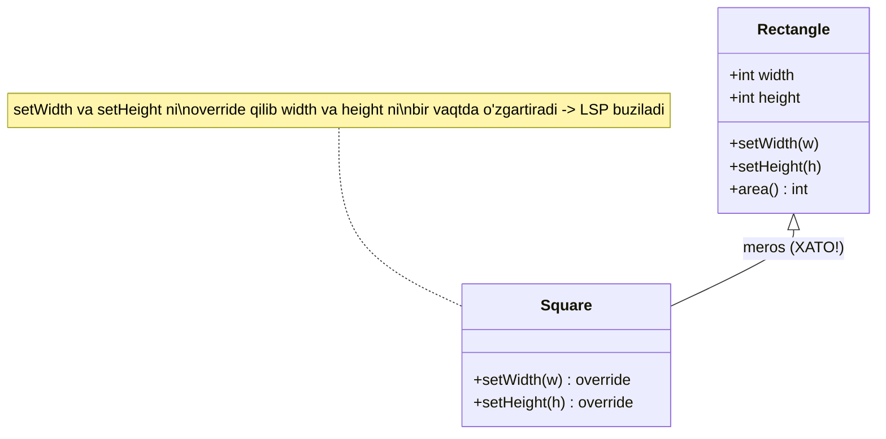
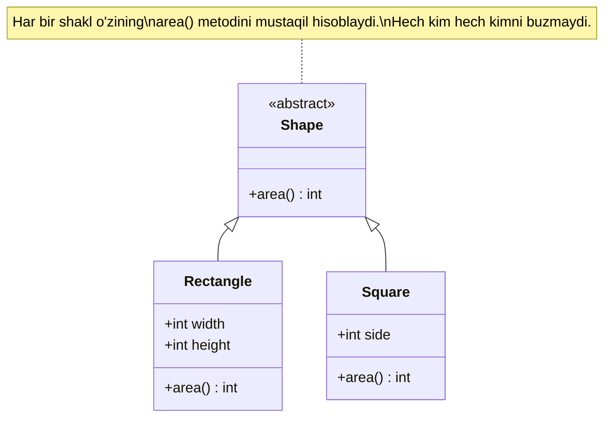

# L — Liskov Substitution Principle (Liskov Almashtiruv Prinsipi)

## STEP 1 — Umumiy tushuncha

LSP — bu SOLID prinsiplarining uchinchisi. Uni 1987-yilda Barbara Liskov ismli olima taklif qilgan, shuning uchun uning nomi bilan ataladi.

### Muammo nima edi?

Tasavvur qiling, bizda `Rectangle` (to'rtburchak) klassi bor. Unda ikkita mustaqil xususiyat bor:

- `width` (eni) — uni xohlagancha o'zgartirish mumkin
- `height` (bo'yi) — uni ham alohida o'zgartirish mumkin

To'rtburchakda eni va bo'yi **bir-biridan mustaqil**. Ya'ni enini 5 ga, bo'yini 10 ga qo'ysam — bu mutlaqo normal holat.

Endi obyektga yo'naltirilgan dasturlashda bizga shunday tuyuladi: "Kvadrat (`Square`) ham bir turdagi to'rtburchak-ku! Demak `Square` ni `Rectangle` dan meros (inheritance) qilib olaman."

Mana shu yerda muammo boshlanadi. Chunki **kvadratda eni va bo'yi har doim teng bo'lishi kerak**. Agar enini o'zgartirsangiz, bo'yi ham avtomatik o'zgarishi shart.

Demak `Square`, `setWidth` va `setHeight` metodlarini override qilib, ikkalasini ham bir vaqtda o'zgartiradigan qilib yozadi. Natijada:

```
Rectangle r = new Square();   // Square — Rectangle o'rnida ishlatilyapti
r.setWidth(5);                // eni = 5, bo'yi ham 5 bo'lib qoldi (kvadrat shunaqa)
r.setHeight(10);             // bo'yi = 10, eni ham 10 bo'lib ketdi!
// Endi maydonni hisoblaymiz: kutgan natija 5 * 10 = 50
// Lekin haqiqiy natija: 10 * 10 = 100  ❌ NOTO'G'RI!
```

Client kod (foydalanuvchi kodi) `Rectangle` bilan ishlayapti deb o'ylaydi va `5 * 10 = 50` ni kutadi. Lekin ichida `Square` yashiringani uchun `100` chiqib qoladi. **Subklass asosiy klassning xulq-atvorini buzdi** — bu LSP buzilishi.

Xulosa: matematikada "kvadrat — to'rtburchakning maxsus turi" degani **dasturlashda "Square, Rectangle dan meros olishi kerak"** degani EMAS.

### Yechim nima?

LSP shuni aytadi:

> Subklass (avlod klass) o'zining asosiy klassini (parent class) hech qanday muammosiz **to'liq almashtira olishi kerak**. Client kod buni sezmasligi va buzilmasligi kerak.

Ya'ni: agar funksiya `Rectangle` qabul qilsa, unga `Square` bersangiz ham — funksiya to'g'ri ishlashi kerak. Agar bermay qolsa, demak meros (inheritance) noto'g'ri qurilgan.

Yechim — bu Square va Rectangle ni bir-biridan **meros qilmaslik**. Ularning ikkalasini ham umumiy `Shape` (shakl) abstraksiyasidan kelib chiqtirish va har biri o'zining `area()` (maydon) metodini mustaqil hisoblashi.

### Asosiy qoida (bir jumlada)

> Agar `S` — `T` ning subtipi bo'lsa, dasturda `T` turidagi obyektlarni `S` turidagi obyektlar bilan almashtirganda dasturning to'g'riligi buzilmasligi kerak.

### Vizualizatsiya

YOMON dizayn — `Square` `Rectangle` dan meros oladi va xulq-atvorni buzadi:



YAXSHI dizayn — ikkalasi ham umumiy `Shape` abstraksiyasidan kelib chiqadi:



---

## STEP 2 — Python tilida

### YOMON misol — `Square(Rectangle)` (LSP buzilgan)

```python
# YOMON YONDASHUV: Square, Rectangle dan meros oladi
# Bu meros LSP ni buzadi, chunki Square o'zini Rectangle dek tuta olmaydi

class Rectangle:
    def __init__(self, width, height):
        self._width = width      # eni
        self._height = height    # bo'yi

    def set_width(self, width):
        self._width = width      # faqat enini o'zgartiradi

    def set_height(self, height):
        self._height = height    # faqat bo'yini o'zgartiradi

    def area(self):
        return self._width * self._height   # maydon = eni * bo'yi


class Square(Rectangle):
    # Kvadratda eni va bo'yi teng bo'lishi shart.
    # Shuning uchun set_width va set_height ni override qilamiz —
    # va mana shu yerda Rectangle ning xulqini BUZAMIZ
    def set_width(self, width):
        self._width = width
        self._height = width     # bo'yini ham majburan o'zgartiramiz!

    def set_height(self, height):
        self._width = height     # enini ham majburan o'zgartiramiz!
        self._height = height


# Client kod — u faqat Rectangle bilan ishlayapman deb o'ylaydi
def use_rectangle(rect: Rectangle):
    rect.set_width(5)    # eni = 5
    rect.set_height(10)  # bo'yi = 10
    # Client mantiqan 5 * 10 = 50 ni kutadi
    print(f"Kutilgan maydon: 50, Haqiqiy maydon: {rect.area()}")


print("=== YOMON misol ===")
use_rectangle(Rectangle(0, 0))   # to'rtburchak bilan -> to'g'ri
use_rectangle(Square(0, 0))      # kvadrat bilan -> XATO natija
```

YOMON misol OUTPUT:

```
=== YOMON misol ===
Kutilgan maydon: 50, Haqiqiy maydon: 50
Kutilgan maydon: 50, Haqiqiy maydon: 100
```

Ko'ryapsizmi: bir xil client kod `Rectangle` ga `50`, `Square` ga esa `100` qaytardi. `Square` ni `Rectangle` o'rnida ishlatib bo'lmadi — LSP buzildi.

### YAXSHI misol — `Shape` abstract klass

```python
from abc import ABC, abstractmethod

# Umumiy abstraksiya: har qanday shaklning maydoni bo'ladi
class Shape(ABC):
    @abstractmethod
    def area(self):
        # Bu metodni har bir avlod o'zi to'ldiradi
        pass


class Rectangle(Shape):
    def __init__(self, width, height):
        self.width = width      # eni
        self.height = height    # bo'yi

    def area(self):
        return self.width * self.height   # to'rtburchak maydoni


class Square(Shape):
    def __init__(self, side):
        self.side = side        # kvadratning yagona tomoni

    def area(self):
        return self.side * self.side      # kvadrat maydoni


# Client kod — u har qanday Shape bilan bemalol ishlayveradi
def print_area(shape: Shape):
    print(f"{type(shape).__name__} maydoni: {shape.area()}")


print("=== YAXSHI misol ===")
print_area(Rectangle(5, 10))   # 50
print_area(Square(5))          # 25
```

YAXSHI misol OUTPUT:

```
=== YAXSHI misol ===
Rectangle maydoni: 50
Square maydoni: 25
```

Endi `Rectangle` ham, `Square` ham `Shape` o'rnida bemalol ishlatiladi. Hech biri ikkinchisining xulqini buzmaydi — LSP saqlanadi.

---

## STEP 3 — Go tilida

Go'da klassik meros (inheritance) yo'q. Uning o'rniga **embedding** (joylashtirish) va **interface** ishlatiladi. Shuning uchun "yomon misol" da biz `Square` ichiga `Rectangle` ni embed qilamiz va xuddi shu muammoni ko'ramiz.

### YOMON misol — embedding orqali LSP buzilishi

```go
package main

import "fmt"

// Rectangle — to'rtburchak
type Rectangle struct {
	width  int // eni
	height int // bo'yi
}

func (r *Rectangle) SetWidth(w int) {
	r.width = w // faqat enini o'zgartiradi
}

func (r *Rectangle) SetHeight(h int) {
	r.height = h // faqat bo'yini o'zgartiradi
}

func (r *Rectangle) Area() int {
	return r.width * r.height // maydon = eni * bo'yi
}

// Square — Rectangle ni embed qiladi (meros taqlidi)
type Square struct {
	Rectangle // Rectangle ichkariga joylashtirildi
}

// Kvadratda eni va bo'yi teng bo'lishi kerak.
// Shuning uchun SetWidth va SetHeight ni qayta yozamiz —
// va Rectangle ning xulqini BUZAMIZ
func (s *Square) SetWidth(w int) {
	s.width = w
	s.height = w // bo'yini ham majburan o'zgartiramiz!
}

func (s *Square) SetHeight(h int) {
	s.width = h // enini ham majburan o'zgartiramiz!
	s.height = h
}

func main() {
	fmt.Println("=== YOMON misol ===")

	// To'rtburchak — to'g'ri ishlaydi
	r := &Rectangle{}
	r.SetWidth(5)
	r.SetHeight(10)
	fmt.Printf("Rectangle -> Kutilgan: 50, Haqiqiy: %d\n", r.Area())

	// Kvadrat — XATO natija
	s := &Square{}
	s.SetWidth(5)  // eni=5, bo'yi=5
	s.SetHeight(10) // eni=10, bo'yi=10
	fmt.Printf("Square    -> Kutilgan: 50, Haqiqiy: %d\n", s.Area())
}
```

YOMON misol OUTPUT:

```
=== YOMON misol ===
Rectangle -> Kutilgan: 50, Haqiqiy: 50
Square    -> Kutilgan: 50, Haqiqiy: 100
```

Yana o'sha muammo: `Square`, `Rectangle` o'rnida to'g'ri ishlay olmadi. `5 * 10 = 50` o'rniga `100` chiqdi.

> Eslatma: Go'da embedding bilan metodni "override" qilganda, ehtiyot bo'lish kerak — chunki agar siz `Square` ni `*Rectangle` sifatida uzatsangiz, Go embed qilingan `Rectangle` ning asl metodlarini chaqiradi, sizning yangi metodlaringizni emas. Bu yana bir bosh og'rig'i. Shuning uchun Go'da bunday meros taqlidini umuman qilmaslik kerak.

### YAXSHI misol — `Shape` interface

```go
package main

import "fmt"

// Shape — umumiy abstraksiya (interface).
// Har qanday shakl Area() metodiga ega bo'lishi kerak.
type Shape interface {
	Area() int
}

// Rectangle — to'rtburchak, o'z maydonini o'zi hisoblaydi
type Rectangle struct {
	width  int // eni
	height int // bo'yi
}

func (r Rectangle) Area() int {
	return r.width * r.height
}

// Square — kvadrat, o'z maydonini o'zi hisoblaydi
type Square struct {
	side int // yagona tomon
}

func (s Square) Area() int {
	return s.side * s.side
}

// Client kod — har qanday Shape bilan bemalol ishlaydi
func PrintArea(s Shape) {
	fmt.Printf("Maydon: %d\n", s.Area())
}

func main() {
	fmt.Println("=== YAXSHI misol ===")

	shapes := []Shape{
		Rectangle{width: 5, height: 10}, // 50
		Square{side: 5},                 // 25
	}

	// Har bir shaklni bir xil tarzda ishlatamiz — hech biri buzilmaydi
	for _, sh := range shapes {
		PrintArea(sh)
	}
}
```

YAXSHI misol OUTPUT:

```
=== YAXSHI misol ===
Maydon: 50
Maydon: 25
```

Endi `Rectangle` ham, `Square` ham `Shape` interface ni qondiradi va `PrintArea` funksiyasida bir-birini bemalol almashtira oladi. LSP saqlanadi.

---

## Xulosa

### Asosiy fikrlar

- **LSP** = subklass o'zining asosiy klassini hech qanday muammosiz to'liq almashtira olishi kerak.
- Klassik "Square — Rectangle" muammosi: matematikada kvadrat to'rtburchakning turi, lekin dasturlashda undan meros qilish xulq-atvorni buzadi.
- Meros (inheritance / embedding) faqat "shakl o'xshashligi" uchun emas, **xulq-atvor mosligi** uchun ishlatilishi kerak.
- Agar subklass parent metodini override qilib uning kutilgan natijasini buzsa — bu LSP buzilishi.
- Yechim: umumiy **abstraksiya** (Python'da abstract `Shape`, Go'da `Shape` interface) yaratib, har bir tipni mustaqil qilish.

### Eslab qol

> "Agar subklass parent o'rnida ishlay olmasa, demak u parentning subklassi bo'lmasligi kerak edi."

- Meros qilishdan oldin savol bering: "Avlod, ota-ona o'rnida har joyda buzilmasdan ishlay oladimi?"
- Override qilingan metod parent kelishuvini (kutilgan natijani) buzmasligi shart.
- Go'da meros yo'q — buni interface bilan to'g'ri hal qilish osonroq, lekin embedding bilan ham xato qilish mumkin.

### Amaliyot

1. **Penguin muammosi**: `Bird` (qush) klassi `fly()` (uchish) metodiga ega. `Penguin` (pingvin) `Bird` dan meros oladi, lekin ucha olmaydi. Bu LSP ni qanday buzadi? Uni qanday tuzatasiz? (Maslahat: `FlyingBird` va `NonFlyingBird` ni ajrating yoki interface'ga bo'ling.)

2. Python'da `Shape` abstraksiyasiga `Circle` (doira) qo'shing — `area()` metodi `3.14 * r * r` qaytarsin. Client kodni o'zgartirmasdan ishlashini tekshiring.

3. Go'da `Shape` interface ga `Perimeter()` (perimetr) metodini qo'shing. `Rectangle`, `Square` va yangi `Triangle` (uchburchak) struct lari uchun implement qiling.

4. O'zingiz LSP buzilgan bir misol toping (masalan, `ReadOnlyList` `List` dan meros olib `add()` da xato tashlasa) va uni qanday tuzatish kerakligini yozing.
