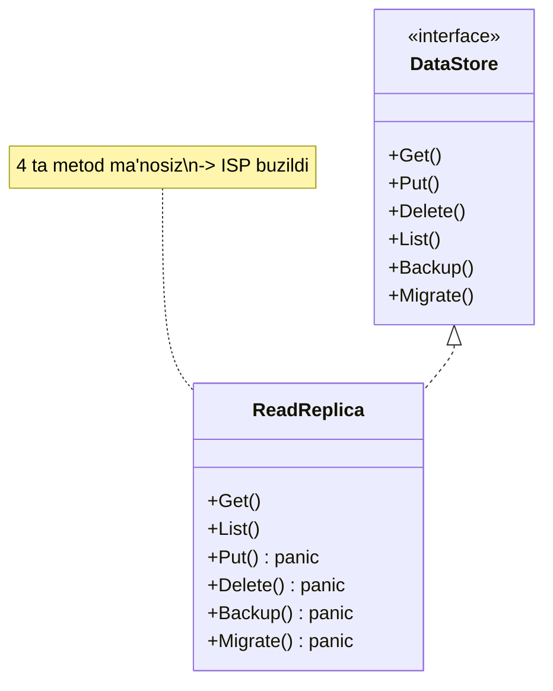
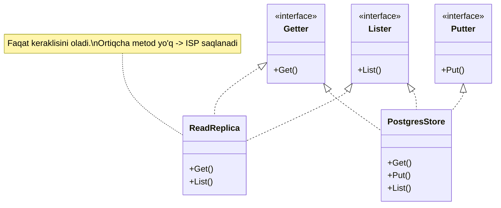

# I — Interface Segregation Principle

> Hech bir tip o'ziga **kerak bo'lmagan metodlarga bog'liq bo'lishga majbur qilinmasligi** kerak — bitta katta interface o'rniga bir nechta **kichik, maxsus** interface ishlat.

---

## STEP 1 — Umumiy tushuncha

### Muammo nima edi?

Real backend stsenariy: **ma'lumot ombori (data store)**. Boshida hammasi qulay ko'rinadi — bitta katta `DataStore` interface hamma amalni o'z ichiga oladi:

```go
type DataStore interface {
	Get(id string) ([]byte, error)
	Put(id string, data []byte) error
	Delete(id string) error
	List() ([]string, error)
	Backup(path string) error
	Migrate(version int) error
}
```

Asosiy baza (`PostgresStore`) uchun bularning hammasi mantiqan to'g'ri. Lekin keyin **read-only replika** (`ReadReplica`) qo'shiladi — undan faqat o'qish mumkin, yozib bo'lmaydi. U ham `DataStore` bo'lishi kerak, demak `Put`, `Delete`, `Backup`, `Migrate` metodlarini ham **yozishga majbur**:

```go
func (r *ReadReplica) Put(id string, d []byte) error {
	panic("replikaga yozib bo'lmaydi") // ma'nosiz, xavfli
}
```

**Nega bu yomon?**

1. **Ma'nosiz metodlar bilan to'ldirish.** `Put`, `Delete`, `Backup` replikaga umuman kerak emas, lekin baribir yozilgan.
2. **Chalg'itish va xavf.** Kimdir `replica.Put(...)` chaqirsa — runtime panic. Kompilyator ogohlantirmaydi.
3. **Mo'rtlik (fragility).** `DataStore`'ga yangi metod qo'shilsa (masalan `Compress()`), uni implement qiladigan **hamma** tip, shu jumladan replika ham, o'zgartirilishi kerak.
4. **Iste'molchi ham qamalib qoladi.** Faqat `Get`'ga muhtoj funksiya butun `DataStore`'ga bog'lanadi — test uchun 6 ta metodli soxta (mock) yozishga majbur.

Bir jumlada: **tip (va uni ishlatuvchi kod) o'ziga kerak bo'lmagan metodlarga bog'liq bo'lyapti.**

### Yechim nima?

Katta, "hamma narsani biladigan" interface'ni **kichik, fokuslangan** interface'larga ajratamiz. Har bir tip faqat **o'ziga keraklisini** implement qiladi, har bir funksiya faqat **o'ziga keraklisini** talab qiladi.

```go
type Getter interface { Get(id string) ([]byte, error) }
type Putter interface { Put(id string, data []byte) error }
type Deleter interface { Delete(id string) error }
```

Kerak bo'lganda ularni **birlashtiramiz** (interface composition):

```go
type ReadWriteStore interface { Getter; Putter; Deleter }
```

Endi `ReadReplica` faqat `Getter`'ni implement qiladi — `Put` yozish shart emas.

### Asosiy qoida

> **Ko'p mijozga xizmat qiladigan bitta katta interface o'rniga — har bir mijozga mos kichik interface'lar yasang.**
>
> Belgi: agar tip interface metodini `panic`, bo'sh tana yoki "not supported" bilan to'ldirayotgan bo'lsa — interface juda katta, uni ajratish vaqti keldi.

### Go bu prinsip uchun tug'ma mos

Go'da interface **implicit** qondiriladi — `implements` yozilmaydi. Shuning uchun Go standart kutubxonasi eng yaxshi ISP namunasi. Eng mashhur interface — bitta metodli:

```go
type Reader interface { Read(p []byte) (n int, err error) }
type Writer interface { Write(p []byte) (n int, err error) }
```

Kerak bo'lsa kompozitsiya qilinadi:

```go
type ReadWriter interface { Reader; Writer }
```

Va `io.Copy(dst Writer, src Reader)` — faqat ikkita kichik interface'ni talab qiladi. Shuning uchun `io.Copy` fayl, tarmoq soketi, buffer, hatto HTTP body — **hammasi** bilan ishlaydi. Kichik interface = keng qo'llanish.

### Kundalik hayotdan analogiya

**Universal pult vs oddiy pult.** 50 tugmali "universal" pult televizor, konditsioner, muzlatgich — hammasini boshqarishga urinadi. Lekin sen faqat TV ko'rmoqchisan — 45 ta tugma keraksiz, chalg'itadi, ba'zilari sen uchun **ishlamaydi** ("not supported"). Kichik, 5 tugmali TV pulti esa aynan kerakligini beradi.

> Analogiya chegarasi: kichik interface ko'p bo'lsa, ularni **birlashtirish** (`ReadWriter`) kerak bo'ladi. ISP "hamma narsani maydala" degani emas — "mijozga **aynan kerakli** to'plamni ber" degani.

---

## STEP 2 — Yomon va yaxshi misol (Go)

### YOMON misol — bitta katta interface

```go
package main

import "fmt"

// YOMON: 6 metodli "God interface".
type DataStore interface {
	Get(id string) ([]byte, error)
	Put(id string, data []byte) error
	Delete(id string) error
	List() ([]string, error)
	Backup(path string) error
	Migrate(version int) error
}

// Asosiy baza — hammasi mantiqan to'g'ri.
type PostgresStore struct{}

func (p PostgresStore) Get(id string) ([]byte, error) { return []byte("data"), nil }
func (p PostgresStore) Put(id string, d []byte) error { fmt.Println("[PG] yozildi"); return nil }
func (p PostgresStore) Delete(id string) error        { return nil }
func (p PostgresStore) List() ([]string, error)       { return nil, nil }
func (p PostgresStore) Backup(path string) error      { return nil }
func (p PostgresStore) Migrate(v int) error           { return nil }

// Read-only replika — Put/Delete/Backup/Migrate MA'NOSIZ, lekin yozishga majbur.
type ReadReplica struct{}

func (r ReadReplica) Get(id string) ([]byte, error) { return []byte("data"), nil }
func (r ReadReplica) List() ([]string, error)       { return nil, nil }

// Quyidagilar faqat DataStore'ni qondirish uchun — hammasi panic/ma'nosiz:
func (r ReadReplica) Put(id string, d []byte) error { panic("replikaga yozib bo'lmaydi") }
func (r ReadReplica) Delete(id string) error        { panic("replikadan o'chirib bo'lmaydi") }
func (r ReadReplica) Backup(path string) error      { panic("qo'llab-quvvatlanmaydi") }
func (r ReadReplica) Migrate(v int) error           { panic("qo'llab-quvvatlanmaydi") }

func main() {
	var s DataStore = ReadReplica{}
	fmt.Println(s.Get("1"))
	s.Put("1", []byte("x")) // runtime panic — kompilyator ogohlantirmadi
}
```

**Output:**

```
[data <nil>]
panic: replikaga yozib bo'lmaydi
```

`ReadReplica` to'rtta ma'nosiz metod yozishga majbur bo'ldi va `Put` chaqirilishi bilan dastur qulab tushdi. Bu — ISP buzilishi.

### YAXSHI misol — kichik interface'lar

Interface'ni mas'uliyat bo'yicha maydalaymiz va kerak bo'lganda kompozitsiya qilamiz.

```go
package main

import "fmt"

// Kichik, fokuslangan interface'lar.
type Getter interface {
	Get(id string) ([]byte, error)
}
type Putter interface {
	Put(id string, data []byte) error
}
type Lister interface {
	List() ([]string, error)
}

// Kerak bo'lsa kompozitsiya (interface embedding).
type ReadStore interface {
	Getter
	Lister
}
type ReadWriteStore interface {
	Getter
	Putter
	Lister
}
```

Endi har bir tip **faqat o'ziga keraklisini** implement qiladi:

```go
// PostgresStore — ham o'qiydi, ham yozadi.
type PostgresStore struct{}

func (p PostgresStore) Get(id string) ([]byte, error) { return []byte("data"), nil }
func (p PostgresStore) Put(id string, d []byte) error { fmt.Println("[PG] yozildi"); return nil }
func (p PostgresStore) List() ([]string, error)       { return []string{"1"}, nil }

// ReadReplica — FAQAT o'qiydi. Put yozishga majbur EMAS.
type ReadReplica struct{}

func (r ReadReplica) Get(id string) ([]byte, error) { return []byte("data"), nil }
func (r ReadReplica) List() ([]string, error)       { return []string{"1"}, nil }
```

Iste'molchi (consumer) funksiyalar **eng kichik** kerakli interface'ni so'raydi:

```go
// renderPage faqat o'qiydi -> faqat Getter talab qiladi.
// Shuning uchun unga replika ham, asosiy baza ham beriladi.
func renderPage(g Getter, id string) {
	data, _ := g.Get(id)
	fmt.Printf("Sahifa: %s\n", data)
}

// saveOrder yozadi -> Putter talab qiladi. Replikani BERIB BO'LMAYDI.
func saveOrder(p Putter, id string, data []byte) {
	_ = p.Put(id, data)
}

func main() {
	renderPage(ReadReplica{}, "1")   // replika o'qishga yaraydi
	renderPage(PostgresStore{}, "1") // asosiy baza ham
	saveOrder(PostgresStore{}, "2", []byte("x"))
	// saveOrder(ReadReplica{}, ...) // KOMPILYATSIYA XATOSI: replikada Put yo'q
}
```

**Output:**

```
Sahifa: data
Sahifa: data
[PG] yozildi
```

Endi replikaga yozishga urinsang — **kompilyatsiya xatosi**, runtime panic emas. Har bir funksiya faqat haqiqatan kerakli metodlarga bog'langan.

### "Accept interfaces, return structs" idiomasi

Bu — Go'ning eng muhim dizayn maslahati va ISP bilan bevosita bog'liq:

- **Accept interfaces:** funksiya **eng kichik** interface'ni qabul qilsin (masalan `Getter`, `io.Reader`). Shunda u ko'p turli tip bilan ishlaydi va test'da mock berish oson.
- **Return structs:** funksiya/konstruktor **konkret struct** (yoki `*struct`) qaytarsin. Shunda chaqiruvchi to'liq imkoniyatga ega bo'ladi va kelajakda metod qo'shsang, mavjud kod buzilmaydi.

```go
// YAXSHI: kichik interface qabul qiladi, konkret struct qaytaradi.
func NewCache(src Getter) *Cache { // src — minimal interface
	return &Cache{source: src}     // konkret *Cache qaytadi
}
```

> Xato: konstruktordan interface qaytarish (`func New() Getter`) — chaqiruvchining imkoniyatini keraksiz cheklaydi. Interface'ni **iste'molchi** e'lon qilsin, ishlab chiqaruvchi emas (bu D — Dependency Inversion faylida davom etadi).

### Vizualizatsiya — YOMON vs YAXSHI





---

## STEP 3 — Chegaralar va trade-offlar

### 1. Haddan ko'p maydalash

Har bir metodni alohida interface qilib yuborsang, o'nlab bir metodli interface paydo bo'ladi va ularni doim qayta birlashtirishga to'g'ri keladi. Bu ham chalkashlik. **Mezon:** interface'ni **mijoz ehtiyoji** bo'yicha ajrat, mavhum "chiroyli bo'lsin" deb emas.

### 2. Interface'ni oldindan yasama (YAGNI)

Go'da interface'ni **kerak bo'lganda** qo'shish oson (implicit). Shuning uchun boshida konkret struct bilan ishla; **ikkinchi implementatsiya** yoki **test uchun mock** kerak bo'lgandagina interface ajrat. Bir implementatsiya uchun interface — ko'pincha keraksiz.

### 3. Interface qayerda e'lon qilinsin?

Go idiomasi: interface'ni **iste'molchi package**da e'lon qil, u kichik va aynan o'sha iste'molchiga kerakligini o'z ichiga olsin. Katta, umumiy interface'ni "provider" package'da e'lon qilish — ko'pincha ISP buzilishiga olib keladi (hamma metod bir joyda to'planadi).

### Balans jadvali

| Katta interface (ISP buzilgan) | Optimal | Ortiqcha maydalash |
|--------------------------------|---------|--------------------|
| 6+ metodli `DataStore` | Mijoz ehtiyoji bo'yicha `Getter`, `Putter` | Har metodga alohida interface |
| Tiplar `panic` bilan to'ldiradi | Har tip keraklisini oladi | Doim qayta birlashtirish kerak |
| Test'da katta mock | Kichik mock | Mock'lar tarqoq |

> **Muvozanat:** eng yaxshi interface — **kichik** (1-3 metod). Katta contract kerak bo'lsa, kichik interface'larni **kompozitsiya** qil (`io.ReadWriter`). Bir metodli interface — Go'da idiomatik va kuchli.

---

## STEP 4 — Boshqa prinsiplar bilan bog'liqlik

### SOLID ichida

- **S (Single Responsibility):** ISP — SRP'ning interface darajasidagi ko'rinishi. Kichik interface odatda bitta mas'uliyatga ega.
- **L (Liskov Substitution):** ko'p LSP buzilishi aslida interface **juda katta** bo'lganidan kelib chiqadi (tip ba'zi metodni bajara olmaydi). Interface'ni ajratsang, tip faqat haqiqatan bajara oladigan contract'ni oladi — L avtomatik saqlanadi. L faylidagi `Withdrawable` — aynan ISP yechimi.
- **D (Dependency Inversion):** DIP kichik interface'larga bog'lanishni tavsiya qiladi. ISP shu kichik interface'larni yasab beradi. Ikkalasi birga "accept interfaces" idiomasini tashkil qiladi.

### Klassik prinsiplar bilan

- **High Cohesion:** kichik interface yuqori cohesion demak — ichidagi metodlar bir maqsad uchun.
- **Low Coupling:** iste'molchi faqat kerakli metodlarga bog'lanadi -> bog'liqlik minimal.
- **YAGNI:** interface'ni oldindan katta yasama; ehtiyoj paydo bo'lganda ajrat.

---

## O'zingni tekshir

<details>
<summary>1. Tip interface metodini panic bilan to'ldirayotgan bo'lsa — bu qaysi prinsip buzilganini bildiradi?</summary>

ISP. Tip o'ziga kerak bo'lmagan metodni implement qilishga majbur bo'lyapti (chunki interface juda katta). Yechim — interface'ni kichikroq, fokuslangan bo'laklarga ajratish, shunda tip faqat haqiqatan qo'llab-quvvatlaydigan metodlarni oladi. Bu bir vaqtda LSP'ni ham tuzatadi.
</details>

<details>
<summary>2. Nega io.Copy(dst Writer, src Reader) shunchalik ko'p tip bilan ishlaydi?</summary>

Chunki u faqat **ikkita kichik interface**ni (`Writer`, `Reader`) talab qiladi. Fayl, tarmoq soketi, `bytes.Buffer`, HTTP body — hammasi bu ikki metodga ega. Interface qanchalik kichik bo'lsa, uni qondiradigan tiplar shunchalik ko'p — ISP'ning to'g'ridan-to'g'ri foydasi.
</details>

<details>
<summary>3. "Accept interfaces, return structs" nima degani va nega ISP bilan bog'liq?</summary>

Funksiya **eng kichik** interface'ni qabul qilsin (moslashuvchan, testlanadigan), lekin **konkret struct** qaytarsin (chaqiruvchi to'liq imkoniyatga ega bo'ladi). "Accept interfaces" qismi aynan ISP — minimal, fokuslangan interface talab qilish.
</details>

<details>
<summary>4. ReadReplica'ni yaxshi misolda saveOrder'ga uzatsang nima bo'ladi?</summary>

Kompilyatsiya xatosi: `saveOrder` `Putter` talab qiladi, `ReadReplica`'da esa `Put` metodi yo'q. Xato **kompilyatsiya vaqtida** ushlanadi. YOMON misolda esa runtime panic bo'lardi — ISP xatoni kompilyatorga "ko'chirib" beradi.
</details>

<details>
<summary>5. ISP'ni haddan oshirsang qanday muammo bo'ladi?</summary>

O'nlab bir metodli interface paydo bo'ladi, ularni doim qayta birlashtirishga to'g'ri keladi, kod tarqoq bo'ladi. Interface'ni **mijoz ehtiyoji** bo'yicha ajrat, mavhum "chiroyli bo'lsin" deb emas. Va bir implementatsiya uchun umuman interface qo'shma (YAGNI).
</details>
