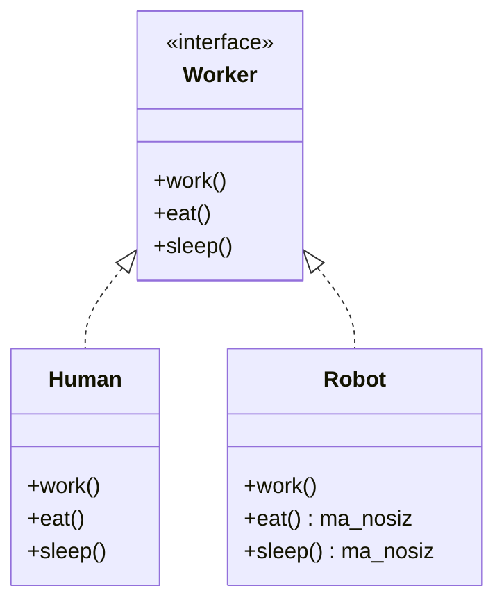
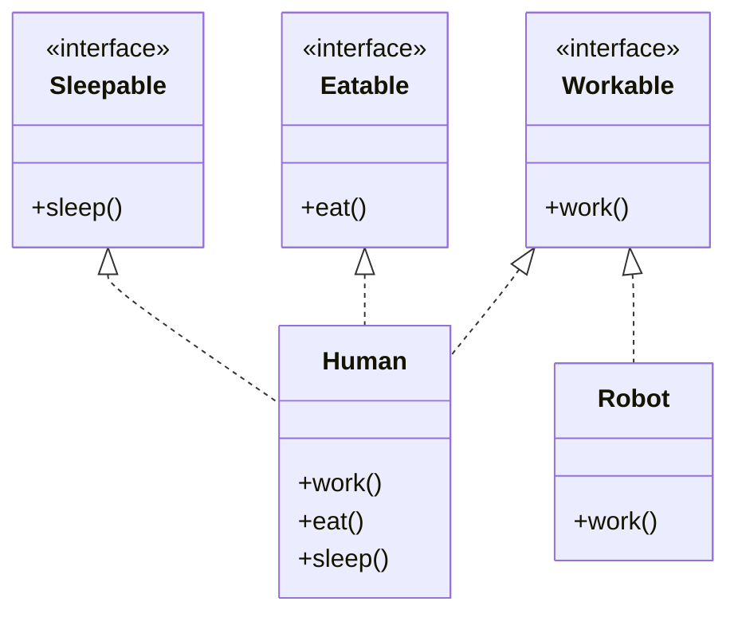

# I — Interface Segregation Principle (Interface Ajratish Prinsipi)

---

## STEP 1 — Umumiy tushuncha

### Muammo nima edi?

Tasavvur qiling, siz korxonadagi "ishchilar" tizimini yozayapsiz. Boshida hammasi
oddiy ko'rinadi: har bir ishchi **ishlaydi**, **ovqatlanadi** va **uxlaydi**. Shuning
uchun siz bitta katta `Worker` interface yaratasiz:

```
Worker:
    - work()    // ishlash
    - eat()     // ovqatlanish
    - sleep()   // uxlash
```

Avvaliga odam (`Human`) ishchilar uchun bu juda yaxshi ishlaydi — chunki odam
haqiqatan ham ishlaydi, ovqatlanadi va uxlaydi.

Lekin keyin korxonaga **robot ishchi** (`Robot`) qo'shiladi. Robot ham ishchi,
demak u ham `Worker` interface'ni implement qilishi kerak. Mana shu yerda muammo
boshlanadi:

- Robot **ishlaydi** — `work()` mantiqan to'g'ri.
- Robot **ovqatlanmaydi** — lekin `eat()` metodini baribir yozishga majbur.
- Robot **uxlamaydi** — lekin `sleep()` metodini baribir yozishga majbur.

Natijada robot quyidagicha "soxta" metodlar yozishga majbur bo'ladi:

```
Robot:
    work()  -> ishlaydi (haqiqiy)
    eat()   -> pass yoki Exception ("Robot ovqatlanmaydi!")
    sleep() -> pass yoki Exception ("Robot uxlamaydi!")
```

Bu yomon, chunki:

1. **Klassni ma'nosiz metodlar bilan to'ldiramiz** — `eat()` va `sleep()` robotga
   umuman kerak emas, lekin baribir yozilgan.
2. **Foydalanuvchini chalg'itamiz** — kimdir `robot.eat()` ni chaqirsa, kutilmagan
   `Exception` oladi yoki hech narsa bo'lmaydi.
3. **Mo'rtlik (fragility)** paydo bo'ladi — `Worker` interface'ga yangi metod
   qo'shilsa (masalan `take_vacation()`), uni implement qiladigan HAMMA klass,
   shu jumladan robot ham, o'zgartirilishi kerak bo'ladi.

Bir jumlada: **klass o'ziga kerak bo'lmagan metodlarni implement qilishga majbur
bo'lyapti.**

### Yechim nima?

Katta, "hamma narsani biladigan" interface'ni — **kichik, maxsus (specific)
interface'larga ajratish** kerak. Har bir klass faqat o'ziga **kerak bo'lgan**
interface'larni implement qiladi.

Ya'ni bitta `Worker` o'rniga:

- `Workable` — faqat `work()`
- `Eatable` — faqat `eat()`
- `Sleepable` — faqat `sleep()`

Endi:

- `Human` — har uchchalasini implement qiladi (chunki odam ishlaydi, ovqatlanadi,
  uxlaydi).
- `Robot` — faqat `Workable` ni implement qiladi (chunki robot faqat ishlaydi).

### Asosiy qoida

> Hech bir klass o'ziga kerak bo'lmagan metodlarga **bog'liq bo'lishga majbur
> qilinmasligi kerak** — katta interface'larni kichik va maxsus interface'larga
> ajrating.

### Vizualizatsiya

**YOMON dizayn** — bitta katta interface, robot ortiqcha metodlarga majbur:



**YAXSHI dizayn** — kichik interface'lar, har kim faqat keragini oladi:



---

## STEP 2 — Python tilida

### YOMON misol — bitta katta `Worker`

```python
from abc import ABC, abstractmethod


# Bitta katta "hamma narsani biladigan" abstract klass.
# Bu HAMMA ishchini work, eat, sleep metodlarini yozishga majbur qiladi.
class Worker(ABC):
    @abstractmethod
    def work(self):
        ...

    @abstractmethod
    def eat(self):
        ...

    @abstractmethod
    def sleep(self):
        ...


# Odam uchun hammasi mantiqan to'g'ri.
class Human(Worker):
    def work(self):
        print("Odam ishlayapti")

    def eat(self):
        print("Odam ovqatlanyapti")

    def sleep(self):
        print("Odam uxlayapti")


# Robot uchun muammo: u eat() va sleep() ni implement qilishga MAJBUR,
# lekin robotga bu metodlarning ma'nosi yo'q.
class Robot(Worker):
    def work(self):
        print("Robot ishlayapti")

    def eat(self):
        # Robot ovqatlanmaydi — bo'sh yoki exception qoldirishga majburmiz.
        raise NotImplementedError("Robot ovqatlanmaydi!")

    def sleep(self):
        # Robot uxlamaydi — bu ham ma'nosiz.
        raise NotImplementedError("Robot uxlamaydi!")


# Sinab ko'ramiz
human = Human()
human.work()
human.eat()
human.sleep()

robot = Robot()
robot.work()
robot.eat()   # bu yerda dastur xato (Exception) beradi
```

**Output:**

```
Odam ishlayapti
Odam ovqatlanyapti
Odam uxlayapti
Robot ishlayapti
Traceback (most recent call last):
    ...
NotImplementedError: Robot ovqatlanmaydi!
```

Ko'ryapsizmi — `robot.eat()` chaqirilishi bilanoq dastur qulab tushdi. Bu
ISP buzilganligining belgisi.

### YAXSHI misol — kichik interface'lar

```python
from abc import ABC, abstractmethod


# Har bir interface FAQAT bitta mas'uliyatga ega — kichik va maxsus.
class Workable(ABC):
    @abstractmethod
    def work(self):
        ...


class Eatable(ABC):
    @abstractmethod
    def eat(self):
        ...


class Sleepable(ABC):
    @abstractmethod
    def sleep(self):
        ...


# Odam UCHALA interface'ni ham implement qiladi — chunki odamga hammasi tegishli.
class Human(Workable, Eatable, Sleepable):
    def work(self):
        print("Odam ishlayapti")

    def eat(self):
        print("Odam ovqatlanyapti")

    def sleep(self):
        print("Odam uxlayapti")


# Robot FAQAT Workable ni implement qiladi.
# Endi u eat() va sleep() ni yozishga MAJBUR EMAS.
class Robot(Workable):
    def work(self):
        print("Robot ishlayapti")


# Sinab ko'ramiz
human = Human()
human.work()
human.eat()
human.sleep()

robot = Robot()
robot.work()
# robot.eat() endi umuman mavjud emas — chalg'ituvchi metod yo'q.
```

**Output:**

```
Odam ishlayapti
Odam ovqatlanyapti
Odam uxlayapti
Robot ishlayapti
```

Endi robotda ortiqcha metodlar yo'q, hech qanday `Exception` ham yo'q. Har bir
klass faqat o'ziga keraklisiga bog'langan.

---

## STEP 3 — Go tilida

Go'da `interface` **implicit** (yashirin) tarzda implement qilinadi. Ya'ni
`implements` kalit so'zini yozish shart emas — agar tip interface'dagi barcha
metodlarga ega bo'lsa, u avtomatik ravishda shu interface'ni qondiradi. Bu Go'ni
ISP uchun juda qulay qiladi.

### YOMON misol — bitta katta `Worker` interface

```go
package main

import "fmt"

// Bitta katta interface — work, eat, sleep hammasi birga.
type Worker interface {
	Work()
	Eat()
	Sleep()
}

// Odam — hamma metod mantiqan to'g'ri.
type Human struct{}

func (h Human) Work()  { fmt.Println("Odam ishlayapti") }
func (h Human) Eat()   { fmt.Println("Odam ovqatlanyapti") }
func (h Human) Sleep() { fmt.Println("Odam uxlayapti") }

// Robot — Worker interface'ni qondirish UCHUN Eat va Sleep ni
// yozishga majbur, lekin ular ma'nosiz.
type Robot struct{}

func (r Robot) Work() { fmt.Println("Robot ishlayapti") }

// Robot ovqatlanmaydi — lekin baribir yozishga majburmiz (bo'sh / panic).
func (r Robot) Eat() {
	panic("Robot ovqatlanmaydi!")
}

// Robot uxlamaydi — bu ham ma'nosiz.
func (r Robot) Sleep() {
	panic("Robot uxlamaydi!")
}

func main() {
	var w Worker

	w = Human{}
	w.Work()
	w.Eat()
	w.Sleep()

	w = Robot{}
	w.Work()
	w.Eat() // bu yerda panic bo'ladi
}
```

**Output:**

```
Odam ishlayapti
Odam ovqatlanyapti
Odam uxlayapti
Robot ishlayapti
panic: Robot ovqatlanmaydi!
```

Agar `Robot` `Eat()` va `Sleep()` metodlarini yozmasak, u `Worker` interface'ni
qondirmaydi va kod kompilyatsiya bo'lmaydi. Demak Go bizni ma'nosiz metodlar
yozishga majbur qilyapti — bu ISP buzilishi.

### YAXSHI misol — kichik interface'lar

```go
package main

import "fmt"

// Har bir interface kichik va maxsus — faqat bitta metod.
type Workable interface {
	Work()
}

type Eatable interface {
	Eat()
}

type Sleepable interface {
	Sleep()
}

// Odam — barcha metodlarga ega, shuning uchun u uchala interface'ni ham
// AVTOMATIK qondiradi (implicit implementation).
type Human struct{}

func (h Human) Work()  { fmt.Println("Odam ishlayapti") }
func (h Human) Eat()   { fmt.Println("Odam ovqatlanyapti") }
func (h Human) Sleep() { fmt.Println("Odam uxlayapti") }

// Robot — faqat Work() metodiga ega.
// Demak u faqat Workable interface'ni qondiradi. Eat/Sleep yozish SHART EMAS.
type Robot struct{}

func (r Robot) Work() { fmt.Println("Robot ishlayapti") }

func main() {
	// Workable sifatida ham odam, ham robot ishlatilaveradi.
	workers := []Workable{Human{}, Robot{}}
	for _, w := range workers {
		w.Work()
	}

	// Eatable va Sleepable sifatida faqat odamni ishlatamiz.
	var e Eatable = Human{}
	e.Eat()

	var s Sleepable = Human{}
	s.Sleep()

	// var e2 Eatable = Robot{} // KOMPILYATSIYA XATOSI:
	// Robot da Eat() metodi yo'q. Bu — yaxshi! Kompilyator bizni xatodan saqlaydi.
}
```

**Output:**

```
Odam ishlayapti
Robot ishlayapti
Odam ovqatlanyapti
Odam uxlayapti
```

E'tibor bering: endi `Robot{}` ni `Eatable` ga berishga urinsak, kod **umuman
kompilyatsiya bo'lmaydi**. Ya'ni xato ish vaqtida (runtime panic) emas, balki
kompilyatsiya vaqtida ushlanadi — bu ancha xavfsiz.

---

## Xulosa

### Asosiy fikrlar

- **Interface Segregation Principle (ISP)** — SOLID'ning "I" harfi.
- Katta, ko'p metodli interface'lar yomon, chunki ularni implement qiladigan
  klasslar o'ziga kerak bo'lmagan metodlarni ham yozishga majbur bo'ladi.
- Yechim: bitta katta interface'ni bir nechta **kichik, maxsus** interface'larga
  ajratish.
- Har bir klass faqat o'ziga **kerakli** interface'larni implement qiladi.
- Python'da bir nechta abstract klassni birga meros qilib olamiz; Go'da esa
  interface'lar **implicit** qondiriladi, bu ISP uchun tabiiy mos keladi.

### Eslab qol

> "Bir nechta maxsus interface — bitta umumiy interface'dan yaxshiroq."
>
> Agar klass interface'ning ba'zi metodlarini `pass`, bo'sh tana yoki
> `Exception`/`panic` bilan to'ldirayotgan bo'lsa — bu ISP buzilganligining
> aniq belgisi. Interface'ni ajratish vaqti keldi.

ISP boshqa SOLID prinsiplari bilan bog'liq:

- **SRP (S)** bilan — kichik interface odatda bitta mas'uliyatga ega bo'ladi.
- **LSP (L)** bilan — klass kerakmas metodlarni implement qilmasa, uni xavfsiz
  almashtirish (substitution) osonlashadi.

### Amaliyot

1. **Printer misoli:** `Machine` interface'ni yarating — `print()`, `scan()`,
   `fax()`. So'ng `OldPrinter` klassi faqat `print()` qila olishini tasavvur
   qiling. ISP'ni buzgan yomon variantni yozing, keyin uni `Printable`,
   `Scannable`, `Faxable` interface'larga ajratib tuzating.

2. **Go'da:** yuqoridagi `Workable`, `Eatable`, `Sleepable` ga yana `Chargeable`
   (`Charge()` — zaryadlanish) interface'ini qo'shing. `Robot` ni `Workable` va
   `Chargeable` qiladigan qilib o'zgartiring. `main` da `[]Chargeable` slice
   yarating va faqat zaryadlanadigan tiplarni unga qo'shing.

3. **Tahlil:** o'zingiz yozgan eski loyihalardan birida 5+ metodli interface
   bormi? Uni qaysi kichik interface'larga ajratish mumkinligini qog'ozga chizing
   (mermaid class diagram ko'rinishida).
