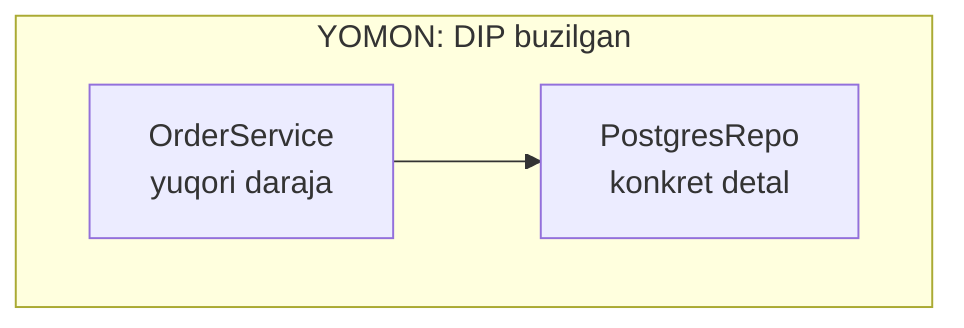
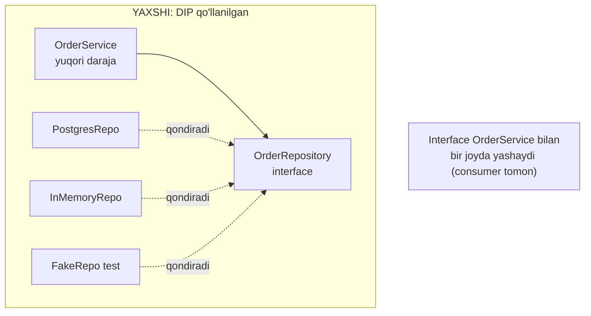

# D — Dependency Inversion Principle

> Yuqori darajali modullar quyi darajali modullarga emas, **ikkalasi ham abstraction'ga (interface)** bog'liq bo'lishi kerak — va Go'da bu interface'ni **iste'molchi (consumer)** e'lon qiladi.

---

## STEP 1 — Umumiy tushuncha

### Muammo nima edi?

Real backend stsenariy: **buyurtma xizmati** (`OrderService`). U buyurtmani ma'lumotlar bazasiga saqlashi kerak. Boshida `PostgresRepo`'ni to'g'ridan-to'g'ri ishlatasan:

```
OrderService  --->  PostgresRepo
(yuqori daraja)      (quyi daraja, konkret detal)
```

`OrderService` o'z ichida `PostgresRepo{}`'ni **o'zi yaratadi** va uning metodlarini bevosita chaqiradi. Muammolar:

1. **Bazani almashtirib bo'lmaydi.** Ertaga in-memory cache yoki boshqa store kerak bo'lsa — `OrderService` **kodini o'zgartirasan**, chunki `PostgresRepo` unda "qotirib" (hardcoded) yozilgan.
2. **Test yozib bo'lmaydi.** `OrderService`'ni test qilish uchun har safar **haqiqiy Postgres** kerak. Soxta (mock) baza ulanmaydi — chunki `OrderService` faqat konkret `PostgresRepo`'ni biladi.
3. **Bog'liqlik yo'nalishi noto'g'ri.** Muhim biznes-mantiq (`OrderService`) arzon detalga (`PostgresRepo`) bog'lanib qolgan. Detal o'zgarsa, biznes-mantiq buziladi.

> Bu — telefon zaryadchisini devorga sement bilan biriktirib qo'yganga o'xshaydi. Zaryadchini almashtirmoqchi bo'lsang, devorni buzasan. Rozetka (interface) bo'lganda — istalganini ulab-uzasan.

### Yechim nima?

**Dependency Inversion Principle** ikki qoidadan iborat:

1. Yuqori darajali modullar quyi darajali modullarga bog'liq bo'lmasin. **Ikkalasi ham abstraction'ga bog'lansin.**
2. Abstraction detallarga bog'liq bo'lmasin. **Detallar abstraction'ga bog'lansin.**

Amalda: `OrderService` konkret `PostgresRepo`'ni emas, `OrderRepository` degan **interface**'ni bilsin. Qaysi baza ishlashini esa **tashqaridan beramiz** — bu **Dependency Injection** (odatda konstruktor orqali).

```
OrderService  --->  OrderRepository (interface)  <---  PostgresRepo
(yuqori daraja)        (abstraction)              <---  InMemoryRepo
```

O'qlar (bog'liqlik yo'nalishi) endi **abstraction'ga** qaragan. Aynan shu — "inversiya": bog'liqlik yo'nalishi teskari burildi.

### Go'ning o'ziga xosligi — interface'ni KIM e'lon qiladi?

Bu D faylining eng muhim qismi. Java'da interface odatda **implementatsiya yonida** (provider tomonda) yashaydi. Go'da esa idioma **teskari**:

> **Interface'ni iste'molchi (consumer) e'lon qiladi — u aynan o'ziga kerakli metodlarni o'z ichiga oladi.**

Ya'ni `OrderRepository` interface'i `order` package'ida (undan foydalanadigan joyda) e'lon qilinadi, `postgres` package'ida emas. Natijada:

- `postgres` package `order` package'ni **import qilmaydi** — u interface haqida bilmasligi ham mumkin (implicit qondiradi);
- `order` package o'ziga **aynan kerakligini** talab qiladi (bu bir vaqtda ISP);
- bog'liqlik yo'nalishi to'liq **yuqori modul foydasiga** buriladi — u nima kerakligini o'zi belgilaydi.

### Asosiy qoida

> **Konkret struct'ga emas, interface'ga bog'lan. Kerakli narsani tashqaridan ber (inject qil). Interface'ni iste'molchi e'lon qilsin.**
>
> Belgi: agar biror servisning ICHIDA `PostgresRepo{}` ni (yoki boshqa konkret bog'liqlikni) yaratayotgan bo'lsang — ehtimol DIP'ni buzayapsan. Uni tashqariga chiqar.

### Kundalik hayotdan analogiya

**Rozetka.** Devor (yuqori modul) "menga 220V kerak" degan **standartni** (interface) belgilaydi. Zaryadchi, choynak, noutbuk (quyi modullar) shu standartga moslashadi. Devor qaysi qurilma ulanishini bilmaydi — u faqat interface'ni biladi. Muhimi: standartni **devor** (iste'molchi) belgilaydi, har bir qurilma ishlab chiqaruvchisi emas. Aynan shu — Go'dagi "interface consumer tomonda".

> Analogiya chegarasi: DIP "hamma narsani interface qil" degani emas. Faqat **almashishi mumkin** yoki **test'da mock kerak** bo'lgan bog'liqliklarni invert qil (STEP 3'da batafsil).

---

## STEP 2 — Yomon va yaxshi misol (Go)

### YOMON misol — DIP buzilgan

```go
package main

import "fmt"

// Konkret quyi darajali modul.
type PostgresRepo struct{}

func (r *PostgresRepo) SaveOrder(order string) error {
	fmt.Println("[Postgres] buyurtma saqlandi:", order)
	return nil
}

// YOMON: OrderService konkret *PostgresRepo ga "qotirib" bog'langan.
type OrderService struct {
	repo *PostgresRepo // konkret tip — almashtirib bo'lmaydi
}

// Konstruktor bog'liqlikni O'Z ICHIDA yaratyapti -> qattiq bog'lanish.
func NewOrderService() *OrderService {
	return &OrderService{
		repo: &PostgresRepo{}, // MUAMMO: bu yerda konkret baza yaratildi
	}
}

func (s *OrderService) Place(order string) error {
	return s.repo.SaveOrder(order) // to'g'ridan-to'g'ri Postgres
}

func main() {
	svc := NewOrderService()
	_ = svc.Place("Olma - 5 kg")
	// Boshqa store yoki test uchun mock kerak bo'lsa -> OrderService kodini o'zgartirasan
}
```

**Output:**

```
[Postgres] buyurtma saqlandi: Olma - 5 kg
```

`OrderService` `PostgresRepo`'ga "yopishib" qolgan. Test uchun soxta baza ulanmaydi, bazani almashtirish kodni o'zgartirishni talab qiladi.

### YAXSHI misol — DIP qo'llanilgan, interface iste'molchida

Iste'molchi (`OrderService`) o'ziga **aynan kerakli** interface'ni e'lon qiladi:

```go
package main

import "fmt"

// 1-qadam: ABSTRACTION — iste'molchi (OrderService) o'zi e'lon qiladi.
// U faqat "buyurtma saqlay oladigan biror narsa" kerakligini bildiradi.
type OrderRepository interface {
	SaveOrder(order string) error
}

// 2-qadam: OrderService faqat interface'ga bog'liq, konkret tipga emas.
type OrderService struct {
	repo OrderRepository // interface!
}

// Konstruktor bog'liqlikni TASHQARIDAN qabul qiladi (constructor injection).
func NewOrderService(repo OrderRepository) *OrderService {
	return &OrderService{repo: repo}
}

func (s *OrderService) Place(order string) error {
	return s.repo.SaveOrder(order) // abstraction orqali
}
```

Konkret implementatsiyalar — ular `OrderRepository` haqida **bilmasa ham bo'ladi** (implicit qondiradi):

```go
// PostgresRepo — SaveOrder metodi bor, shuning uchun avtomatik OrderRepository.
type PostgresRepo struct{}

func (r *PostgresRepo) SaveOrder(order string) error {
	fmt.Println("[Postgres] saqlandi:", order)
	return nil
}

// InMemoryRepo — u ham OrderRepository (masalan test yoki cache uchun).
type InMemoryRepo struct{ data []string }

func (r *InMemoryRepo) SaveOrder(order string) error {
	r.data = append(r.data, order)
	fmt.Println("[Memory] saqlandi:", order)
	return nil
}

func main() {
	// Bog'liqlikni tashqarida tanlaymiz (composition root).
	pg := NewOrderService(&PostgresRepo{})
	_ = pg.Place("Olma - 5 kg")

	// Boshqa store'ga o'tish uchun OrderService kodiga TEGMAYMIZ:
	mem := NewOrderService(&InMemoryRepo{})
	_ = mem.Place("Nok - 3 kg")
}
```

**Output:**

```
[Postgres] saqlandi: Olma - 5 kg
[Memory] saqlandi: Nok - 3 kg
```

`OrderService` kodining bironta qatori o'zgarmadi — faqat unga qaysi repo berishni o'zgartirdik. Bu — Dependency Inversion + Dependency Injection.

### Test yozish naqadar osonlashadi

DIP'ning eng katta amaliy foydasi — **testlanuvchanlik**. Endi haqiqiy DB'siz test yozamiz:

```go
// Soxta repo — faqat test uchun. Haqiqiy Postgres kerak emas.
type FakeRepo struct{ saved []string }

func (f *FakeRepo) SaveOrder(order string) error {
	f.saved = append(f.saved, order)
	return nil
}

// Test ichida:
func TestPlace() {
	fake := &FakeRepo{}
	svc := NewOrderService(fake) // soxta bog'liqlik in'ektsiya qilindi
	_ = svc.Place("Test buyurtma")

	if len(fake.saved) != 1 {
		fmt.Println("XATO: buyurtma saqlanmadi")
	} else {
		fmt.Println("OK: buyurtma saqlandi") // haqiqiy DB'siz tekshirildi
	}
}
```

### Vizualizatsiya — bog'liqlik yo'nalishi inversiyasi





Diqqat: YAXSHI holatda ham `OrderService`, ham `PostgresRepo` **abstraction'ga** qarab strelka otadi. Bog'liqlik yo'nalishi teskari burildi — "inversiya".

---

## STEP 3 — Chegaralar va trade-offlar

### 1. Har bog'liqlik uchun interface — over-engineering

DIP'ning eng ko'p suiiste'moli — **hamma narsaga interface**. Agar bog'liqlik:

- hech qachon almashmaydigan bo'lsa (masalan `time.Now`, oddiy util),
- test'da mock qilish shart bo'lmasa,

unda interface qo'shish faqat **keraksiz indirection** va fayllar sonini oshiradi. Go'da `bufio.Writer`, `strings.Builder` kabi ko'p tiplar to'g'ridan-to'g'ri, interface'siz ishlatiladi — va bu to'g'ri.

> **Mezon:** interface qo'sh, agar (1) ikkinchi implementatsiya kutilsa, YOKI (2) test uchun mock kerak bo'lsa. Aks holda — konkret tip (KISS + YAGNI).

### 2. Interface'ni noto'g'ri joyda e'lon qilish

Umumiy xato — katta interface'ni **provider** package'da e'lon qilish (Java uslubi). Bu ISP'ni buzadi (interface shishadi) va bog'liqlikni noto'g'ri yo'naltiradi. Go idiomasi: **kichik interface, iste'molchi tomonda**.

### 3. DI framework kerak emas

Boshqa tillardan kelganlar Go'ga "DI konteyner" izlab keladi. Ko'p holatda kerak emas: bog'liqliklarni `main` (yoki "composition root")'da qo'lda ulash — soddaroq va aniqroq. Go'da `NewXxx(dep)` konstruktori ko'p loyihaga yetadi.

### Balans jadvali

| Konkretga bog'lanish (DIP buzilgan) | Optimal DIP | Ortiqcha DIP |
|-------------------------------------|-------------|--------------|
| Servis ichida `PostgresRepo{}` | Almashadigan bog'liqliklarga interface | Har bir util'ga interface |
| Test imkonsiz | Mock oson ulanadi | Cheksiz indirection |
| Bazani almashtirish = kod o'zgarishi | Faqat `main`'da almashtirish | DI konteyner murakkabligi |

> **Muvozanat:** DIP — "muhim va almashadigan chegaralarni" invert qilish haqida (DB, tashqi API, notification). Ichki, barqaror detallarni interface bilan o'rab, kodni "abstraction sho'rvasi"ga aylantirma.

---

## STEP 4 — Boshqa prinsiplar bilan bog'liqlik

### SOLID ichida

- **O (Open/Closed):** DIP OCP'ni **amalga oshirish mexanizmi**. `OrderService` interface'ga bog'lanadi -> yangi repo qo'shish uchun uni o'zgartirmaysan (O). DIP'siz OCP amalda ishlamaydi.
- **I (Interface Segregation):** DIP kichik interface'larga bog'lanishni tavsiya qiladi, ISP shu kichik interface'larni yasaydi. Iste'molchi tomonda e'lon qilingan interface tabiiy ravishda kichik va fokuslangan bo'ladi — ISP + DIP birga.
- **L (Liskov Substitution):** DIP orqali ulangan implementatsiyalar interface **contract'ini** buzmasligi shart (L). Aks holda mock ishlaydi-yu, haqiqiy repo boshqacha xatti-harakat qiladi.
- **S (Single Responsibility):** SRP bilan ajratilgan qismlarni DIP interface orqali qayta bog'laydi (S faylidagi `NewUserService(repo, mailer, ...)`).

### Klassik prinsiplar bilan

- **Low Coupling:** DIP bog'liqlikni interface orqali "yumshatadi" — modullar bir-birining detalini bilmaydi. Bu to'g'ridan-to'g'ri Low Coupling.
- **Dependency Injection:** DIP — **prinsip** (nimaga bog'lanish), DI — **texnika** (bog'liqlikni qanday berish: konstruktor orqali). Ular ko'pincha aralashtiriladi, lekin bittasi maqsad, ikkinchisi vosita.
- **KISS / YAGNI:** DIP'ni ular cheklaydi — faqat haqiqatan almashadigan chegaralarni invert qil, qolganini sodda qoldir.

---

## O'zingni tekshir

<details>
<summary>1. Servis konstruktori ichida yangi PostgresRepo{} yaratayotgan bo'lsa — nima muammo?</summary>

Bu DIP buzilishi: yuqori modul konkret quyi modulga "qotirib" bog'langan. Natijada bazani almashtirib bo'lmaydi va test uchun mock ulanmaydi. Yechim — bog'liqlikni tashqaridan konstruktorga interface sifatida berish (constructor injection).
</details>

<details>
<summary>2. "Inversiya" so'zi nimani anglatadi — aynan nima teskari buriladi?</summary>

**Bog'liqlik yo'nalishi**. Odatda yuqori modul (biznes-mantiq) quyi modulga (DB) qarab bog'lanadi. DIP'dan keyin ikkalasi ham **abstraction'ga** qarab bog'lanadi — ya'ni quyi modulning strelkasi ham yuqoriga (abstraction'ga) buriladi. Muhimlik va bog'liqlik yo'nalishi mos keladi.
</details>

<details>
<summary>3. Go'da OrderRepository interface'ini qaysi package'da e'lon qilgan ma'qul va nega?</summary>

Iste'molchi (`order`) package'ida — u yerda undan foydalaniladi. Bu Go idiomasi: interface consumer tomonda, aynan kerakli metodlar bilan. Natijada `postgres` package `order`'ni import qilmaydi, interface kichik bo'ladi (ISP) va bog'liqlik yo'nalishi yuqori modul foydasiga buriladi.
</details>

<details>
<summary>4. DIP va Dependency Injection — bir xil narsami?</summary>

Yo'q. **DIP** — prinsip: "konkretga emas, abstraction'ga bog'lan". **DI** — texnika: "bog'liqlikni tashqaridan ber (masalan konstruktorga uzatib)". DI — DIP'ni amalga oshirish yo'llaridan biri. DIP maqsad, DI vosita.
</details>

<details>
<summary>5. Har bir bog'liqlikka interface qo'shish kerakmi?</summary>

Yo'q — bu over-engineering. Interface faqat (1) almashishi mumkin bo'lgan yoki (2) test'da mock kerak bo'lgan bog'liqliklar uchun. Barqaror util'lar (masalan `time`, `strings.Builder`) uchun konkret tip yetarli. DIP'ni KISS va YAGNI bilan cheklab tur.
</details>

---

> **SOLID yakuni:** Beshala prinsipni ko'rib chiqding — **S** (ajrat), **O** (kengaytir), **L** (contract'ni buzma), **I** (kichiklashtir), **D** (teskari bog'la). Ular birgalikda Go'da toza, testlanadigan va kengaytiriladigan backend kod yozish poydevorini beradi. Keyingi qadam — qo'shni [`1.1 Principles/`](../) papkasidagi KISS, DRY, YAGNI va Law of Demeter bilan bu bilimni mustahkamlash.
