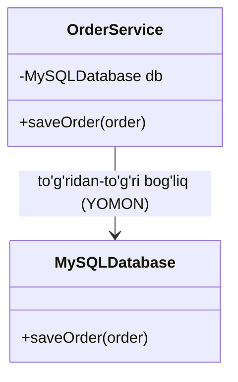
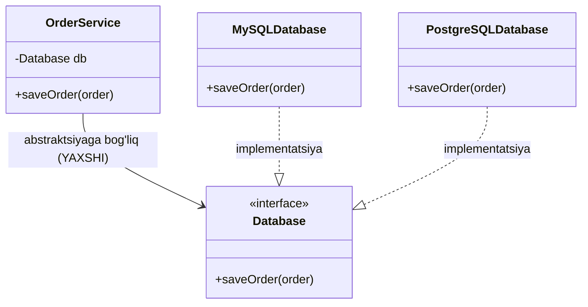

# D — Dependency Inversion Principle (Bog'liqlikni Inversiya Prinsipi)

> SOLID prinsiplarining beshinchi va oxirgi harfi — **D**.

---

## STEP 1 — Umumiy tushuncha

### Muammo nima edi?

Tasavvur qiling, sizda `OrderService` (buyurtmalar xizmati) bor. U buyurtmalarni
ma'lumotlar bazasiga (database) saqlashi kerak. Boshida siz `MySQLDatabase` dan
foydalanasiz va kodni shunday yozasiz:

```
OrderService  --->  MySQLDatabase
(yuqori daraja)      (quyi daraja)
```

Bu yerda `OrderService` **to'g'ridan-to'g'ri** `MySQLDatabase` ga bog'lanib qoldi.
Ya'ni `OrderService` o'z ichida `MySQLDatabase()` obyektini o'zi yaratadi va uning
metodlarini (`mysql.save_order()`) bevosita chaqiradi.

Endi quyidagi vaziyatlarni tasavvur qiling:

1. **PostgreSQL ga o'tmoqchisiz.** Loyiha o'sib ketdi va siz MySQL o'rniga
   PostgreSQL ishlatmoqchisiz. Lekin `OrderService` ichida hamma joyda
   `MySQLDatabase` "qotirib" yozilgan (hardcoded). Demak `OrderService` ning
   **kodini o'zgartirishingizga** to'g'ri keladi.

2. **Test yozish qiyin.** `OrderService` ni test qilmoqchi bo'lsangiz, har safar
   haqiqiy MySQL bazasi kerak bo'ladi. Soxta (mock) baza ulab bo'lmaydi, chunki
   `OrderService` faqat `MySQLDatabase` ni biladi.

3. **Kengaytirish noqulay.** Ertaga MongoDB, SQLite yoki oddiy faylga saqlash
   kerak bo'lsa — yana `OrderService` ni qayta yozasiz.

Asosiy muammo: **yuqori darajali modul (OrderService) quyi darajali modulga
(MySQLDatabase) qaram bo'lib qolgan.** Bu ikkalasi bir-biriga "yopishib" qolgan —
biri o'zgarса, ikkinchisi ham buziladi.

> Bu xuddi telefoningiz zaryadlovchisini devorga sement bilan biriktirib
> qo'yganga o'xshaydi. Zaryadlovchini almashtirmoqchi bo'lsangiz, devorni buzishga
> to'g'ri keladi. Holbuki rozetka (interface) bo'lganida — istalgan zaryadlovchini
> ulab-uzib qo'ya olardingiz.

### Yechim nima?

**Dependency Inversion Principle** ikkita qoidani aytadi:

1. Yuqori darajali modullar (high-level modules) quyi darajali modullarga
   (low-level modules) bog'liq bo'lmasligi kerak. **Ikkalasi ham abstraktsiyaga
   (abstraction / interface) bog'liq bo'lishi kerak.**
2. Abstraktsiya tafsilotlarga (details) bog'liq bo'lmasligi kerak. **Tafsilotlar
   abstraktsiyaga bog'liq bo'lishi kerak.**

Oddiy qilib aytganda: `OrderService` to'g'ridan-to'g'ri `MySQLDatabase` ni
bilmasligi kerak. U faqat `Database` degan **interface** ni bilishi kerak. Qaysi
baza (MySQL yoki PostgreSQL) ishlatilishini esa tashqaridan beramiz — bu usul
**Dependency Injection** deyiladi.

```
OrderService  --->  Database (interface)  <---  MySQLDatabase
(yuqori daraja)       (abstraktsiya)        <---  PostgreSQLDatabase
```

Diqqat qiling: endi o'qlar (bog'liqlik yo'nalishi) **abstraktsiyaga qarab**
boryapti. MySQLDatabase ham, OrderService ham `Database` interfeysiga bog'liq.
Mana shuning uchun bu "inversiya" (teskari aylantirish) deb ataladi —
bog'liqlik yo'nalishi teskari burilди.

### Asosiy qoida

> **Konkret klassga emas, abstraktsiyaga (interface) bog'lan.**

### Vizualizatsiya — Mermaid class diagram

**OLDIN — DIP buzilgan (to'g'ridan-to'g'ri bog'liqlik):**



Bu yerda `OrderService` konkret `MySQLDatabase` ga bog'langan. Bazani
almashtirish uchun `OrderService` kodi o'zgaradi.

**KEYIN — DIP qo'llanilgan (inversiya):**



Endi `OrderService` faqat `Database` interfeysini biladi. MySQL, PostgreSQL yoki
boshqa istalgan baza — `Database` ni implementatsiya qilsa, ishlaydi. OrderService
kodiga umuman tegmaymiz.

---

## STEP 2 — Python tilida

Misol: Ma'lumotlar bazasiga buyurtma saqlash (`OrderService`).

### YOMON misol — DIP buzilgan

```python
# YOMON: OrderService to'g'ridan-to'g'ri MySQLDatabase ga bog'liq

class MySQLDatabase:
    def save_order(self, order):
        # MySQL ga saqlash logikasi
        print(f"[MySQL] Buyurtma saqlandi: {order}")


class OrderService:
    def __init__(self):
        # MUAMMO: bu yerda MySQLDatabase obyektini OrderService ning O'ZI yaratyapti.
        # Demak OrderService konkret MySQL ga "qotirib" bog'lanib qoldi.
        self.db = MySQLDatabase()

    def place_order(self, order):
        # MUAMMO: to'g'ridan-to'g'ri mysql.save_order() chaqirilyapti
        self.db.save_order(order)


# Ishlatish
service = OrderService()
service.place_order("Olma - 5 kg")

# Endi PostgreSQL ga o'tmoqchi bo'lsak, OrderService ICHINI o'zgartirishimiz kerak.
# Bu DIP ning buzilishi.
```

**Output:**

```
[MySQL] Buyurtma saqlandi: Olma - 5 kg
```

Muammo: PostgreSQL kerak bo'lsa, `OrderService.__init__` ichidagi
`MySQLDatabase()` ni qo'lda almashtirish kerak. Test uchun soxta baza ulab
bo'lmaydi.

### YAXSHI misol — DIP qo'llanilgan

```python
from abc import ABC, abstractmethod


# 1-qadam: ABSTRAKTSIYA (interface vazifasini bajaradigan abstract klass)
class Database(ABC):
    @abstractmethod
    def save_order(self, order):
        pass


# 2-qadam: IMPLEMENTATSIYALAR — har biri Database dan meros oladi
class MySQLDatabase(Database):
    def save_order(self, order):
        print(f"[MySQL] Buyurtma saqlandi: {order}")


class PostgreSQLDatabase(Database):
    def save_order(self, order):
        print(f"[PostgreSQL] Buyurtma saqlandi: {order}")


# 3-qadam: OrderService faqat Database abstraktsiyasini biladi
class OrderService:
    def __init__(self, db: Database):
        # YAXSHI: bazani tashqaridan qabul qilyapmiz (Dependency Injection).
        # OrderService qaysi baza ekanini bilmaydi — faqat Database ekanini biladi.
        self.db = db

    def place_order(self, order):
        # YAXSHI: abstraktsiya orqali chaqirilyapti
        self.db.save_order(order)


# Ishlatish — bazani tashqaridan beramiz
mysql_service = OrderService(MySQLDatabase())
mysql_service.place_order("Olma - 5 kg")

# PostgreSQL ga o'tish uchun OrderService kodiga TEGMAYMIZ,
# faqat boshqa bazani uzatamiz:
postgres_service = OrderService(PostgreSQLDatabase())
postgres_service.place_order("Nok - 3 kg")
```

**Output:**

```
[MySQL] Buyurtma saqlandi: Olma - 5 kg
[PostgreSQL] Buyurtma saqlandi: Nok - 3 kg
```

E'tibor bering: `OrderService` ning kodi umuman o'zgarmadi. Faqat unga qaysi
bazani uzatishni o'zgartirdik. Mana shu — Dependency Inversion.

---

## STEP 3 — Go tilida

Xuddi shu misolni Go'da yozamiz. Go'da `interface` tabiiy ravishda mavjud va DIP
uchun juda qulay.

### YOMON misol — DIP buzilgan

```go
package main

import "fmt"

// Konkret MySQL bazasi
type MySQLDB struct{}

func (m *MySQLDB) SaveOrder(order string) {
	fmt.Println("[MySQL] Buyurtma saqlandi:", order)
}

// MUAMMO: OrderService to'g'ridan-to'g'ri MySQLDB struct'iga bog'liq
type OrderService struct {
	db *MySQLDB // konkret tipga "qotirib" bog'langan
}

// Konstruktor — ichida MySQLDB ni o'zi yaratyapti
func NewOrderService() *OrderService {
	return &OrderService{
		db: &MySQLDB{}, // MUAMMO: bu yerda konkret baza yaratilyapti
	}
}

func (s *OrderService) PlaceOrder(order string) {
	s.db.SaveOrder(order) // to'g'ridan-to'g'ri MySQL chaqirilyapti
}

func main() {
	service := NewOrderService()
	service.PlaceOrder("Olma - 5 kg")
	// PostgreSQL kerak bo'lsa — OrderService kodini o'zgartirishga to'g'ri keladi
}
```

**Output:**

```
[MySQL] Buyurtma saqlandi: Olma - 5 kg
```

Muammo Python'dagi bilan bir xil: `OrderService` konkret `*MySQLDB` ga
bog'langan. Bazani almashtirish — kodni o'zgartirishni talab qiladi.

### YAXSHI misol — DIP qo'llanilgan

```go
package main

import "fmt"

// 1-qadam: ABSTRAKTSIYA — Database interface
// OrderService faqat shu interfeysni biladi.
type Database interface {
	SaveOrder(order string)
}

// 2-qadam: IMPLEMENTATSIYALAR
// MySQLDB — Database interfeysini implementatsiya qiladi
type MySQLDB struct{}

func (m *MySQLDB) SaveOrder(order string) {
	fmt.Println("[MySQL] Buyurtma saqlandi:", order)
}

// PostgresDB — u ham Database interfeysini implementatsiya qiladi
type PostgresDB struct{}

func (p *PostgresDB) SaveOrder(order string) {
	fmt.Println("[PostgreSQL] Buyurtma saqlandi:", order)
}

// 3-qadam: OrderService faqat Database interfeysiga bog'liq
type OrderService struct {
	db Database // konkret tip emas, interface!
}

// Konstruktor bazani TASHQARIDAN qabul qiladi (Dependency Injection)
func NewOrderService(db Database) *OrderService {
	return &OrderService{db: db}
}

func (s *OrderService) PlaceOrder(order string) {
	s.db.SaveOrder(order) // abstraktsiya orqali chaqirilyapti
}

func main() {
	// MySQL bilan ishlatish
	mysqlService := NewOrderService(&MySQLDB{})
	mysqlService.PlaceOrder("Olma - 5 kg")

	// PostgreSQL ga o'tish uchun OrderService kodiga TEGMAYMIZ,
	// faqat boshqa bazani uzatamiz:
	postgresService := NewOrderService(&PostgresDB{})
	postgresService.PlaceOrder("Nok - 3 kg")
}
```

**Output:**

```
[MySQL] Buyurtma saqlandi: Olma - 5 kg
[PostgreSQL] Buyurtma saqlandi: Nok - 3 kg
```

Go'da DIP ayniqsa nafis chiqadi: `OrderService` faqat `Database` interfeysini
talab qiladi. Istalgan struct shu interfeysni implementatsiya qilsa
(`SaveOrder` metodi bo'lsa), uni uzatish mumkin — hatto test uchun soxta
(mock) baza ham:

```go
// Test uchun soxta baza — haqiqiy DB shart emas
type FakeDB struct{}

func (f *FakeDB) SaveOrder(order string) {
	fmt.Println("[Fake] Test uchun saqlandi:", order)
}

// Test ichida:
// testService := NewOrderService(&FakeDB{})
```

---

## Xulosa

### Asosiy fikrlar

- **Dependency Inversion Principle** — yuqori darajali modullar quyi darajali
  modullarga emas, **abstraktsiyaga (interface)** bog'liq bo'lishi kerak.
- Konkret klass/struct ga emas, **interface** ga bog'lan.
- Bog'liqlikni tashqaridan uzatish usuli — **Dependency Injection** deyiladi.
- DIP test yozishni osonlashtiradi (mock obyektlar ulash mumkin) va kodni
  kengaytirishni qulaylashtiradi (yangi baza qo'shish uchun eski kod o'zgarmaydi).
- "Inversiya" so'zi bog'liqlik yo'nalishi **teskari** burilishini bildiradi:
  konkret modul ham, yuqori modul ham endi abstraktsiyaga qaratiladi.

### Eslab qol

> **DIP** = "Konkret narsaga emas, interfeysga bog'lan, kerakli narsani
> tashqaridan ber (inject qil)."
>
> Agar `new MySQLDatabase()` ni biror servisning ICHIDA yaratayotgan bo'lsang —
> ehtimol DIP ni buzayapsan. Uni tashqariga chiqar.

### Amaliyot topshiriqlari

1. **Notifier misoli.** `Notifier` interfeysini yarating (`Send(message string)`
   metodi bilan). `EmailNotifier` va `SMSNotifier` struct'larini yozing.
   `UserService` konstruktori `Notifier` qabul qilsin va xabar yuborsin.
   Go'da ham, Python'da ham yozing.

2. **Mock yozish.** Yuqoridagi Go misoliga `FakeDB` ni to'liq qo'shib, undan
   foydalanib `OrderService` ni test qiling (haqiqiy baza ishlatmasdan).

3. **Logger almashtirish.** `Logger` interfeysi (`Log(text string)`) yarating.
   `ConsoleLogger` (ekranga chiqaradi) va `FileLogger` (faylga yozadi)
   implementatsiyalarini yozing. Bitta `App` struct ikkalasi bilan ham
   o'zgartirishsiz ishlay olishini ko'rsating.

4. **O'ylab ko'ring.** Quyidagi kodda DIP qayerda buzilgan va uni qanday
   tuzatasiz?
   ```go
   type ReportGenerator struct {
       printer *ConsolePrinter
   }
   func NewReportGenerator() *ReportGenerator {
       return &ReportGenerator{printer: &ConsolePrinter{}}
   }
   ```

---

> **SOLID yakuni:** Endi siz SOLID prinsiplarining barchasini ko'rib chiqdingiz —
> **S** (Single Responsibility), **O** (Open/Closed), **L** (Liskov Substitution),
> **I** (Interface Segregation) va **D** (Dependency Inversion). Bu beshtasi
> birgalikda toza, kengaytiriladigan va oson testlanadigan kod yozishga yordam
> beradi.
