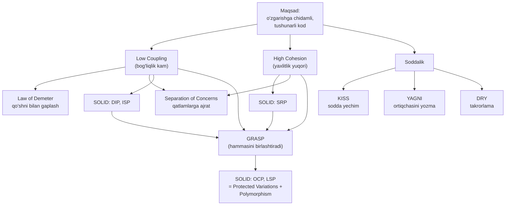

# 1.1 Principles — Dasturlash prinsiplari

Bu papka **dizayn prinsiplari** haqida. Bular pattern emas — bular har qanday kod yozganda amal qiladigan **umumiy qoidalar** va **fikrlash mezonlari**. Ular yaxshi kod bilan yomon kodni ajratadigan poydevor.

> Prinsiplar — bu "nega shunday qilamiz" degan savolga javob. Patternlar esa "qanday qilamiz" degan savolga javob. Avval prinsiplarni, keyin patternlarni o'rganish tavsiya etiladi.

## Prinsiplar ro'yxati

| # | Prinsip | Bir jumlada mohiyati |
|---|---------|----------------------|
| 1 | [KISS](1.%20KISS.md) | Keep It Simple — eng sodda ishlaydigan yechimni tanla, keraksiz murakkablikdan qoch |
| 2 | [DRY](2.%20DRY.md) | Don't Repeat Yourself — bir xil bilim/mantiqni takrorlama, bitta joyda sakla |
| 3 | [YAGNI](3.%20YAGNI.md) | You Aren't Gonna Need It — hozir kerak bo'lmagan funksiyani oldindan yozma |
| 4 | [Law of Demeter](4.%20Law%20of%20Demeter.md) | "Faqat eng yaqin qo'shni bilan gaplash" — obyektning ichki tuzilishiga chuqur kirma |
| 5 | [High Cohesion - Low Coupling](5.%20High%20Cohesion%20-%20Low%20Coupling.md) | Class ichi yaxlit (cohesion), class'lar orasi bo'sh bog'langan (coupling) bo'lsin |
| 6 | [Separation of Concerns](6.%20Separation%20of%20Concerns.md) | Turli mas'uliyatlarni (UI, biznes mantiq, data) alohida qatlamlarga ajrat |
| 7 | [GRASP](7.%20GRASP.md) | Responsibility'ni qaysi class'ga berishni hal qiluvchi 9 ta fikrlash mezoni |

Qo'shni papkada [`1. S.O.L.I.D/`](../1.%20S.O.L.I.D/) ham bor — u 5 ta prinsipni (SRP, OCP, LSP, ISP, DIP) alohida yoritadi.

## O'qish tartibi

Tavsiya etilgan yo'l — sodda umumiy qoidalardan murakkab tizimli mezonlarga:

1. **KISS → DRY → YAGNI** — kundalik kod yozishning uchta oltin qoidasi. Eng sodda, eng ko'p ishlatiladi.
2. **Law of Demeter** — obyektlararo aloqani sog'lom tutishning aniq qoidasi.
3. **High Cohesion - Low Coupling** — barcha keyingi prinsiplarning o'lchov birligi.
4. **Separation of Concerns** — kattaroq miqyosda (qatlamlar, modullar) ajratish.
5. **S.O.L.I.D** — OOP dizaynining 5 ta ustuni.
6. **GRASP** — hammasini birlashtiruvchi: "javobgarlikni kimga beraman?" degan savolga tizimli javob.

## Prinsiplar bir-biri bilan qanday bog'lanadi?

Barcha prinsiplar aslida **ikki markaziy maqsadga** xizmat qiladi: **Low Coupling** (bog'liqlikni kamaytirish) va **High Cohesion** (yaxlitlikni oshirish). Qolganlari shu ikkisiga erishishning turli yo'llari.

## Asosiy g'oya

Bu prinsiplarning barchasi bitta so'z bilan aytilsa — **"o'zgarish"**. Yaxshi kod — hech qachon o'zgarmaydigan kod emas, balki **o'zgartirish oson** bo'lgan kod. Har bir prinsip aynan shu maqsadga, ya'ni ertangi o'zgarishni bugun arzon qilishga xizmat qiladi.
