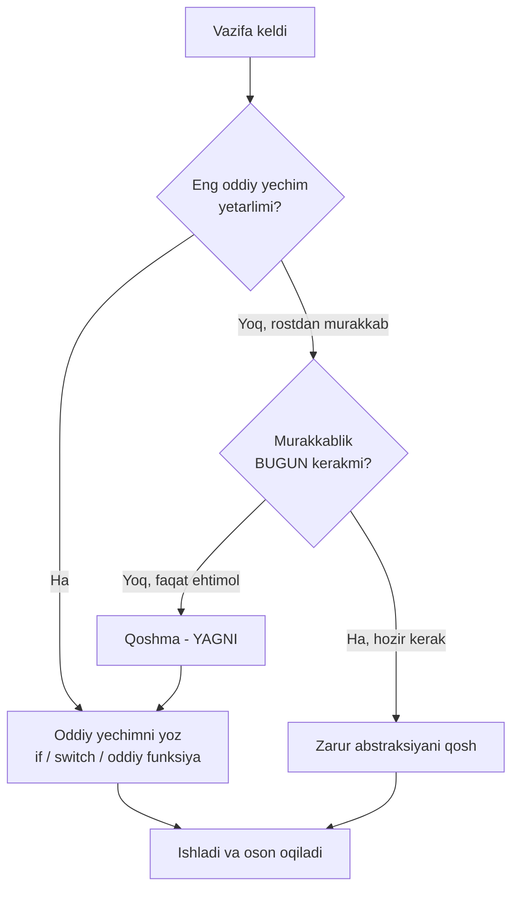
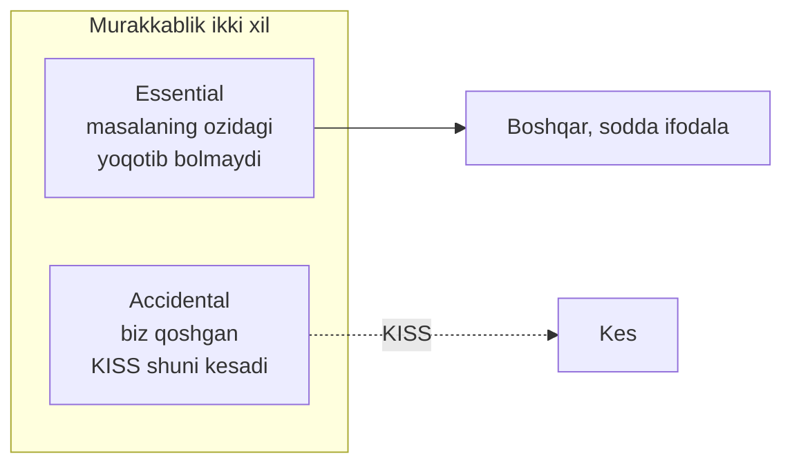
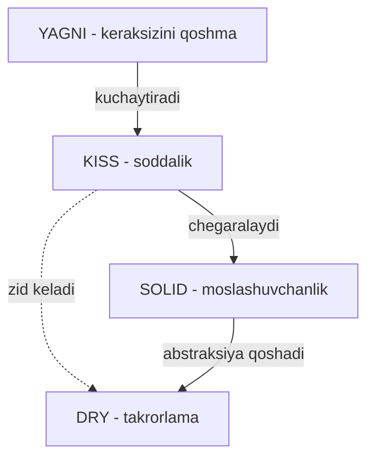

# KISS — Keep It Simple, Stupid

> **KISS**. Eng yaxshi kod — eng aqlli kod emas, balki eng oson tushuniladigan kod. Murakkablikni imkon qadar kamaytiring.

---

## STEP 1 — Umumiy tushuncha

### Muammo nima edi?

Dasturchilar ikki xil kuchli vasvasaga tushadi:

1. **"Aqlli" ko'rinishga intilish (clever code).** Bitta qatorga imkon qadar ko'p mantiq siqib solish, kam ma'lum til imkoniyatlarini ishlatish, "qara, men buni bir qatorda yechdim" deyish.
2. **Kelajakni ortiqcha o'ylash (over-engineering).** Bugun bitta oddiy qoida kerak bo'lsa ham, "ertaga o'nta bo'lsa-chi?" deb butun bir konfiguratsiyalanadigan tizim quriladi.

Ikkalasi ham bir muammoga olib keladi: **kodni o'qib tushunish qiyinlashadi.**

Real backend stsenariysi. Tasavvur qiling, sizga oddiy vazifa berildi:

> "Buyurtma summasi 200 000 so'mdan oshsa, yetkazib berish bepul bo'lsin."

Bu bitta `if` bilan yechiladigan ish. Lekin over-engineering'ga moyil dasturchi buni "kelajakka tayyor" qilib, `RuleEngine`, `Ruleset`, `Condition`, `Evaluator` interface'lari bilan, `reflect` orqali maydonlarni o'qiydigan qilib yozadi. Natijada:

| Muammo | Oqibat |
|--------|--------|
| 5 qatorlik ish 150 qatorga aylandi | Kodni o'qish uchun soatlar ketadi |
| Yangi dasturchi "bu yerda aslida nima bo'lyapti?" deydi | Onboarding sekinlashadi |
| Bitta `if` o'rniga `reflect` ishlatildi | Debug qilish do'zaxga aylanadi, compile-time xatolar runtime'ga suriladi |
| Test yozish uchun butun engine'ni sozlash kerak | Oddiy narsani tekshirish murakkab bo'ladi |

### Yechim nima?

**KISS** aytadi: masalani hal qiladigan **eng oddiy** yechimni tanlang. "Oddiy" degani "ibtidoiy" emas — oddiy degani **ortiqcha qism yo'q**, har bir qatorning aniq sababi bor va kodni birinchi ko'rgan odam ham tushuna oladi.

Oddiy yechim: bepul yetkazishni bitta funksiya va bitta `if` bilan yozing. Qachonki qoidalar rostdan ham murakkablashsa (masalan 5-6 xil shart paydo bo'lsa) — o'shanda abstraksiya qo'shasiz. Bugun emas.

### Hayotiy analogiya

**Devorga mix qoqish.** Sizga bitta rasmni ilish uchun bitta mix kerak. Buni ikki xil qilish mumkin:

- **KISS:** bolg'ani olasiz, mixni qoqasiz. Tamom.
- **Over-engineering:** "ertaga yana mix qoqishim mumkin" deb, avval avtomatik mix-qoqadigan robot quryapsiz, unga sensor, batareya va mobil ilova qo'shyapsiz. Bir mix uchun.

Ikkinchi yo'l aqlli ko'rinadi, lekin aslida vaqtingizni yeydi, buziladi va ta'mirlash kerak bo'ladi. Devorga bitta rasm ilish uchun robot kerak emas.

### Asosiy qoida

> **Har qanday yechim ishga tushishi mumkin bo'lgan darajada oddiy bo'lsin — undan ortiq murakkab emas.**
>
> Kod "aqlli"ligi bilan emas, "ravshan"ligi bilan o'lchanadi. Boshqa odam (yoki 6 oydan keyingi siz) uni bir o'qishda tushunsa — bu yaxshi kod.

### Vizualizatsiya — qaror daraxti



Diagramma bir fikrni takrorlaydi: har doim eng oddiy yo'ldan boshlang, murakkablikni faqat **hozir** kerak bo'lgandagina qo'shing.

---

## STEP 2 — Yomon va yaxshi misol

Bitta vazifa: HTTP handler buyurtmani qabul qiladi va **bepul yetkazishga loyiqmi** yoki yo'qligini qaytaradi. Qoida bitta: summa 200 000 so'mdan oshsa — bepul.

### YOMON misol — "clever" va over-engineered

```go
package main

import (
	"encoding/json"
	"net/http"
	"reflect"
)

// YOMON: bitta oddiy shart uchun butun "rules engine" qurildi.
// Har bir qoida interface, har bir maydon reflect orqali oqiladi.

type Order struct {
	Total float64
}

// Har bir qoida uchun umumiy shartnoma (aslida bittagina qoida bor!)
type Condition interface {
	Evaluate(o Order) bool
}

// reflect orqali istalgan maydonni istalgan qiymat bilan solishtiruvchi qoida
type FieldGreaterThan struct {
	Field string
	Value float64
}

func (c FieldGreaterThan) Evaluate(o Order) bool {
	// reflect: maydon nomini string orqali topib, qiymatini oqiymiz
	v := reflect.ValueOf(o).FieldByName(c.Field)
	return v.Float() > c.Value
}

// Qoidalar to'plamini birma-bir tekshiruvchi "engine"
type RuleEngine struct {
	Conditions []Condition
}

func (e RuleEngine) AllPass(o Order) bool {
	for _, c := range e.Conditions {
		if !c.Evaluate(o) {
			return false
		}
	}
	return true
}

func freeShippingHandler(w http.ResponseWriter, r *http.Request) {
	var o Order
	json.NewDecoder(r.Body).Decode(&o)

	// Bitta shart uchun butun engine sozlanadi
	engine := RuleEngine{
		Conditions: []Condition{
			FieldGreaterThan{Field: "Total", Value: 200000},
		},
	}

	json.NewEncoder(w).Encode(map[string]bool{"free_shipping": engine.AllPass(o)})
}
```

Bu kod nima uchun yomon (qatorlab):

- **`Condition` interface** — bitta qoida uchun umuman kerak emas. Abstraksiya faqat bir necha xil implementatsiya bo'lganda ma'noga ega.
- **`FieldGreaterThan` + `reflect`** — maydon nomi endi `"Total"` degan **string**. Agar maydon nomini `TotalAmount`ga o'zgartirsangiz, compiler hech narsa demaydi — kod **runtime'da** buziladi. Bu KISS'ning teskarisi: siz tekshiruvni compile-time'dan olib runtime'ga surdingiz.
- **`RuleEngine.AllPass`** — bitta `if` o'rniga sikl, interface va slice.
- Test yozish uchun engine'ni sozlashingiz kerak. Debug qilganda `reflect` ichida adashib qolasiz.

### YAXSHI misol — KISS

```go
package main

import (
	"encoding/json"
	"net/http"
)

// YAXSHI: vazifa nima desa - shuni qiladi. Ortiqcha qism yoq.

type Order struct {
	Total float64
}

const freeShippingThreshold = 200000 // sehrli son emas, nomlangan konstanta

// Butun mantiq - bitta ravshan funksiya
func isFreeShipping(o Order) bool {
	return o.Total > freeShippingThreshold
}

func freeShippingHandler(w http.ResponseWriter, r *http.Request) {
	var o Order
	if err := json.NewDecoder(r.Body).Decode(&o); err != nil {
		http.Error(w, "notogri sorov", http.StatusBadRequest)
		return
	}

	json.NewEncoder(w).Encode(map[string]bool{
		"free_shipping": isFreeShipping(o),
	})
}
```

Bu kod nima uchun yaxshi (qatorlab):

- **`isFreeShipping`** — funksiya nomi o'zi hujjat. Ochib o'qish kerak emas, nomidan tushunasiz.
- **`freeShippingThreshold` konstanta** — "sehrli son" (magic number) yo'q; qiymatni bitta joyda o'zgartirasiz.
- **Bitta `return`** — maydon nomi compiler tomonidan tekshiriladi. `Total`ni `TotalAmount`ga o'zgartirsangiz — compiler darhol xato beradi. Xatolar ishga tushmasdan **oldin** ushlanadi.
- **`reflect` yo'q, interface yo'q, engine yo'q** — chunki bugun ular kerak emas. Ertaga 5 xil qoida paydo bo'lsa — o'shanda refactor qilasiz.

### "Clever code" — alohida tuzoq

Over-engineering'dan tashqari KISS'ni buzadigan ikkinchi narsa — **aqlli ko'rinishga urinish**. Quyidagi ikki funksiya bir xil ishni qiladi:

```go
// YOMON: "aqlli" - lekin oqib boldan toyguncha tushunmaysiz
func status(code int) string {
	return map[bool]string{true: "ok", false: "xato"}[code/200 == 1 && code%200 < 100]
}

// YAXSHI: zerikarli - lekin bir oqishda tushuniladi
func status(code int) string {
	if code >= 200 && code < 300 {
		return "ok"
	}
	return "xato"
}
```

Birinchi versiya "men mapni, bool kalitni va arifmetik hiylani bilaman" deyish uchun yozilgan. Uni o'qigan odam kalkulyator ochadi. Ikkinchi versiya **zerikarli**, va aynan shu — uning fazilati. Kod adabiyot emas; uni har kuni boshqa odamlar o'qiydi.

> Qoida: agar kod bo'lagini tushunish uchun uni "yechishga" to'g'ri kelsa — u juda aqlli, demak juda yomon.

---

## STEP 3 — Chegaralar va trade-offlar

KISS foydali, lekin uni **noto'g'ri** tushunish ham zarar keltiradi. Bu qismni diqqat bilan o'qing.

### 1. "Oddiy" — "ibtidoiy" degani emas

KISS "har doim eng qisqa kodni yoz" degani emas. Ba'zan **to'g'ri** yechim biroz uzunroq bo'ladi, lekin ravshanroq. Masalan xatolarni to'g'ri qayta ishlash (error handling) kodni uzaytiradi — bu KISS'ni buzish emas. Xatoni "soddalik uchun" e'tiborsiz qoldirish esa **soxta soddalik** — bu keyin sizni portlatadi.

> Soddalik = ortiqcha qismning yo'qligi. Zarur qismni tashlab yuborish soddalik emas, **to'liqsizlik**.

### 2. Soddalik vs performance

Ba'zida eng oddiy kod eng tez kod emas. Masalan:

- Oddiy: har so'rovda ma'lumotni database'dan o'qiysiz.
- Tez, lekin murakkabroq: cache qo'shasiz, invalidation mantig'ini boshqarasiz.

Bu yerda **o'lchash** kerak. Agar oddiy versiya talab qilingan tezlikni bersa — cache qo'shmang (bu YAGNI bilan bog'lanadi). Agar profiling **haqiqiy** muammoni ko'rsatsa — o'shanda, faqat o'sha joyga murakkablik qo'shasiz. Qoida:

> Avval to'g'ri va oddiy qiling. Keyin **o'lchang**. Faqat o'lchov ko'rsatgan joyda tezlik uchun murakkablik qo'shing. "Balki sekin bo'lar" degan taxmin asosida optimallashtirish — bu premature optimization, KISS'ning dushmani.

### 3. Murakkablik yo'qolmaydi — u ko'chadi

Muhim haqiqat: **essential complexity** (masalaning o'zidagi tabiiy murakkablik) yo'qolmaydi. To'lov tizimi murakkab bo'lsa, uni "oddiy" qilib bo'lmaydi — faqat murakkablikni **boshqariladigan** qilishingiz mumkin. KISS **accidental complexity** (biz o'zimiz qo'shgan, keraksiz murakkablik) bilan kurashadi.



Demak KISS'ni "murakkab masalani soddalashtir" deb tushunmang. To'g'risi: "**oddiy masalaga** murakkablik qo'shma, murakkab masalani esa **imkon qadar ravshan** ifodala".

### 4. Qachon KISS'dan chekinish kerak

Ba'zi sohalarda "eng oddiy" yo'l xavfli:

- **Xavfsizlik:** parolni "oddiylik uchun" ochiq saqlash — bu KISS emas, xato. Bu yerda to'g'ri (murakkabroq) yo'l majburiy.
- **Concurrency:** goroutine'lar bilan ishlashda "oddiy" ko'ringan kod race condition'ga olib kelishi mumkin. Bu yerda `sync.Mutex` yoki channel qo'shish murakkablik emas — **to'g'rilik**.

Bu holatlarda "oddiy" degani "to'g'ri va zarur qism bilan" — ortiqchasiz, lekin kamsiz ham emas.

---

## STEP 4 — Boshqa prinsiplar bilan bog'liqlik

KISS yolg'iz yashamaydi. U boshqa prinsiplar bilan chambarchas bog'liq, ba'zan esa ular bilan ziddiyatga kiradi.

### KISS va YAGNI — do'stlar

**YAGNI** (You Aren't Gonna Need It) — "kerak bo'lmaguncha qo'shma". Bu KISS'ning bevosita davomi. Over-engineering'ning aksariyati YAGNI buzilishidan kelib chiqadi: "ertaga kerak bo'lar" degan taxmin bilan bugun murakkablik qo'shiladi. YAGNI'ga rioya qilsangiz — kod avtomatik ravishda oddiyroq bo'ladi.

### KISS va DRY — ba'zan ziddiyat

**DRY** (Don't Repeat Yourself) takrorlanishni kamaytirishga undaydi. Lekin takrorlanishni yo'qotish uchun ba'zan murakkab abstraksiya qo'shiladi. Ana shu yerda KISS bilan ziddiyat tug'iladi:

| Vaziyat | KISS deydi | DRY deydi |
|---------|-----------|-----------|
| Ikki joyda 3 qatorlik o'xshash kod | Qoldiraver, oddiy | Umumlashtir |
| Umumlashtirish 30 qatorlik "sehrli" abstraksiya talab qiladi | Takror afzal | Baribir umumlashtir |

To'g'ri javob odatda KISS tomonida: **"a little copying is better than a little dependency"** (Go maqoli). Kichik takror kichik bog'liqlikdan afzal. Bu haqda batafsil — DRY faylida.

### KISS va SOLID

SOLID prinsiplari (ayniqsa **Single Responsibility** va **Dependency Inversion**) abstraksiya va interface'larni rag'batlantiradi. Lekin har bir interface — bu qo'shimcha qatlam, ya'ni murakkablik. KISS bu yerda muvozanat saqlaydi:

> SOLID'ni **hozir kerak bo'lgan** joyda qo'llang. "Balki keyin kengaytiraman" deb har structga interface yopishtirish — bu SOLID emas, over-engineering. Go hamjamiyatida buni "accept interfaces, return structs" qoidasi bilan boshqaradi: interface'ni faqat **kerak bo'lganda** joriy qiling.

### Umumiy manzara



Xulosa: KISS markazda turadi. U YAGNI bilan bir yo'nalishda, DRY va SOLID esa foydali, lekin ular kod murakkablashtirsa — KISS "yetadi, to'xta" deb ogohlantiradi.

---

## O'zingni tekshir

**1. Dasturchi "men buni bir qatorda yechdim, qara qanchalik aqlli" desa — KISS nuqtai nazaridan bu yaxshimi yoki yomon? Nega?**

<details><summary>Javob</summary>

Odatda yomon. KISS kodni "aqlli"lik bilan emas, **ravshan**lik bilan o'lchaydi. Bir qatorga siqilgan mantiq ko'pincha o'qish uchun "yechish"ni talab qiladi — boshqa odam (va 6 oydan keyingi muallif ham) uni tushunish uchun vaqt sarflaydi. Kod har kuni o'qiladi, faqat bir marta yoziladi; shuning uchun o'qilishi yozilishidan muhimroq. Zerikarli, lekin ravshan kod deyarli har doim afzal.
</details>

**2. `reflect` va string maydon nomlari ishlatilgan "rules engine" nima uchun bitta oddiy `if`dan yomonroq — texnik jihatdan aniq ayting?**

<details><summary>Javob</summary>

Chunki u **compile-time tekshiruvni runtime'ga suradi**. `if o.Total > 200000` da maydon nomi compiler tomonidan tekshiriladi — noto'g'ri nom bo'lsa kod umuman compile bo'lmaydi. `reflect.FieldByName("Total")` da esa nom shunchaki string; uni `TotalAmount`ga o'zgartirsangiz compiler jim turadi, xato faqat foydalanuvchi so'rov yuborganda — production'da — chiqadi. Bu KISS'ning teskarisi: xatoni erta ushlash o'rniga uni kechiktiradi.
</details>

**3. "Soddalik" va "ibtidoiylik" o'rtasidagi farq nimada? Xatolarni e'tiborsiz qoldirish soddalikmi?**

<details><summary>Javob</summary>

Soddalik = **ortiqcha** qismning yo'qligi. Ibtidoiylik / to'liqsizlik = **zarur** qismning yo'qligi. Error handling'ni "soddalik uchun" tashlab yuborish — bu soxta soddalik: kod qisqaroq ko'rinadi, lekin u to'liqsiz va keyin buziladi. To'g'ri KISS zarur qismni saqlaydi (xato tekshiruvi, xavfsizlik, concurrency himoyasi), faqat keraksizini kesadi.
</details>

**4. Oddiy yechim sekin ishlayotgani "his qilinsa", darhol cache qo'shish KISS'ga mos keladimi?**

<details><summary>Javob</summary>

Yo'q. "His qilish" yetarli emas — bu premature optimization. To'g'ri tartib: (1) avval to'g'ri va oddiy yechimni yoz, (2) keyin **o'lcha** (profiling / benchmark), (3) faqat o'lchov haqiqiy muammoni ko'rsatgan joyda va faqat o'sha joyga murakkablik (cache) qo'sh. Taxmin asosida optimallashtirish keraksiz murakkablik (accidental complexity) qo'shadi va odatda muammo umuman boshqa joyda bo'lib chiqadi.
</details>

**5. Essential complexity va accidental complexity nima? KISS qaysi biri bilan kurashadi?**

<details><summary>Javob</summary>

**Essential complexity** — masalaning o'zidagi tabiiy murakkablik (masalan to'lov tizimining biznes qoidalari). Uni yo'qotib bo'lmaydi, faqat imkon qadar ravshan ifodalash mumkin. **Accidental complexity** — biz o'zimiz qo'shgan, masalaga aloqasi bo'lmagan murakkablik (keraksiz abstraksiya, "clever" hiyla, over-engineering). KISS aynan **accidental** murakkablik bilan kurashadi; u murakkab masalani sehrli tarzda soddalashtira olmaydi, lekin unga qo'shimcha, keraksiz murakkablik qo'shilishining oldini oladi.
</details>

---

## Keyingi qadam

→ [2. DRY.md](2.%20DRY.md) — takrorlanishni kamaytirish, lekin qachon takror abstraksiyadan afzal ekanini ham ko'ramiz.
