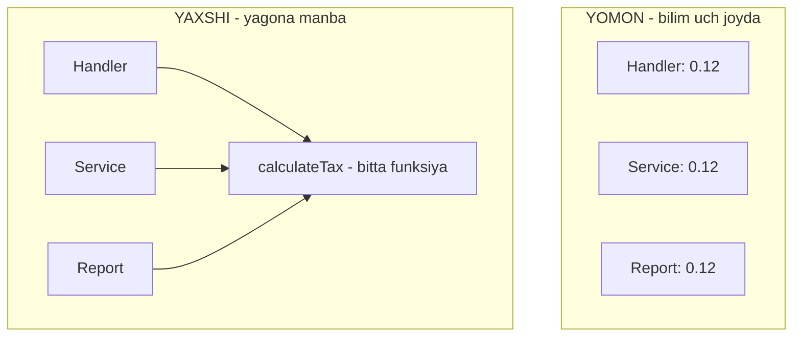
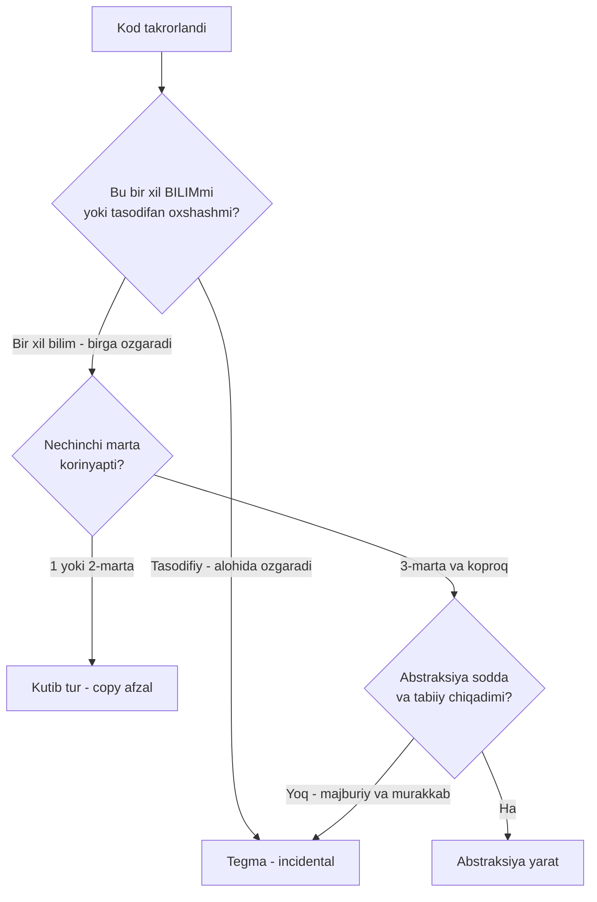
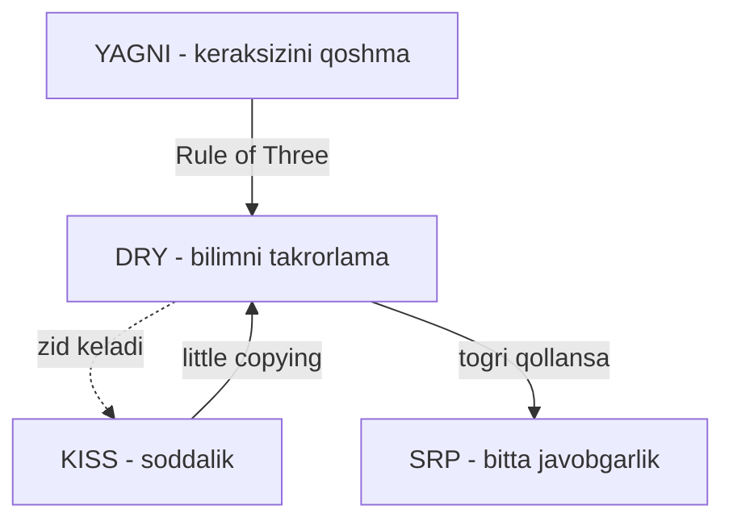

# DRY — Don't Repeat Yourself

> **DRY**. Har bir bilim (knowledge) tizimda faqat **bitta** joyda, bitta manbada yashashi kerak. Lekin diqqat: har qanday o'xshash kod "takror" emas.

---

## STEP 1 — Umumiy tushuncha

### Muammo nima edi?

Tasavvur qiling, loyihangizda soliq (masalan QQS) 12% deb hisoblanadi. Bu hisob-kitob uch joyda takrorlangan:

- HTTP handler'da — foydalanuvchiga narxni ko'rsatishda;
- Order service'da — buyurtmani saqlashda;
- Report service'da — oylik hisobot chiqarishda.

Bir kuni davlat soliqni 15%ga o'zgartiradi. Siz kodni ochib, `0.12`ni `0.15`ga o'zgartirasiz. Ikki joyda. Uchinchisini **unutdingiz**. Endi:

| Muammo | Oqibat |
|--------|--------|
| Bir bilim uch joyda yashaydi | O'zgartirishda birini unutish oson |
| Handler 15% deydi, report 12% deydi | Ma'lumotlar bir-biriga zid bo'ladi |
| Bug qayerdan kelganini topish qiyin | Uch joyni solishtirishga to'g'ri keladi |
| Har yangi hisob joyi yana bitta nusxa | Muammo o'sib boradi |

Bu **knowledge duplication** — bir xil qoida (soliq stavkasi) kodda bir necha marta yozilgan. Muammo nusxalarning o'zida emas — **ular birga o'zgarishi kerakligini** hech kim eslatib turmasligida.

### Yechim nima?

**DRY** aytadi: har bir **bilim** yagona manbaga (single source of truth) ega bo'lsin. Soliq hisobi bitta funksiyada yashaydi; hamma o'sha funksiyani chaqiradi. Stavka o'zgarsa — bitta joyni o'zgartirasiz, hamma joy avtomatik yangilanadi.

> **Muhim nuqta:** DRY kod qatorlarini emas, **bilimni** takrorlamaslik haqida. Ikki funksiya tasodifan bir xil ko'rinishi mumkin, lekin ular ikki xil bilimni ifodalasa — bu takror EMAS. Buni STEP 3'da chuqur ko'ramiz.

### Hayotiy analogiya

**Hujjatning yagona nusxasi (single source of truth).** Kompaniyada narxlar ro'yxati bor. Agar har bo'lim o'z stolida alohida nusxa saqlasa, narx o'zgarganda kimdir eski nusxadan foydalanadi va mijozga noto'g'ri narx aytadi. To'g'ri yechim: narxlar bitta markaziy joyda (masalan bitta jadval) turadi, hamma o'shani o'qiydi. O'zgartirish bitta joyda — hamma darhol yangi narxni ko'radi.

Lekin e'tibor bering: **oshxona menyusi** va **narxlar ro'yxati** ikkalasida ham "narx" degan ustun bor — bu ularni birlashtirish kerak degani emas. Ular boshqa-boshqa maqsad uchun. Bu — DRY'ning eng nozik chegarasi.

### Asosiy qoida

> **Har bir bilim tizimda yagona, aniq, ishonchli manbaga ega bo'lsin.**
>
> Kodni ko'chirish (copy-paste) o'zi jinoyat emas. Jinoyat — bitta bilimni bir necha joyda saqlab, ularni qo'lda sinxron ushlashga majbur bo'lish.

### Vizualizatsiya



Diagramma bir fikrni ko'rsatadi: chapda stavka uch joyda mustaqil yashaydi (o'zgartirishda birini unutasiz), o'ngda esa hamma bitta funksiyaga qaraydi.

---

## STEP 2 — Yomon va yaxshi misol

Vazifa: buyurtma narxiga soliq qo'shish. Uch joyda kerak — handler, service, report.

### YOMON misol — bilim uch joyda takrorlangan

```go
package main

import "fmt"

type Order struct {
	Amount float64
}

// Handler - foydalanuvchiga yakuniy narxni korsatadi
func showPrice(o Order) float64 {
	// soliq bu yerda yozilgan
	return o.Amount + o.Amount*0.12
}

// Service - buyurtmani bazaga saqlaydi
func saveOrder(o Order) float64 {
	// soliq YANA yozilgan (aynan bir xil bilim)
	total := o.Amount + o.Amount*0.12
	fmt.Printf("[DB] saqlandi: %.2f\n", total)
	return total
}

// Report - oylik hisobot
func monthlyReport(orders []Order) float64 {
	var sum float64
	for _, o := range orders {
		// soliq UCHINCHI marta yozilgan
		sum += o.Amount + o.Amount*0.12
	}
	return sum
}
```

Nima uchun yomon (qatorlab):

- **`0.12` uch joyda** — bu bitta bilim ("soliq stavkasi 12%") uch marta yozilgan. Ular birga o'zgarishi shart, lekin kod buni majburlamaydi.
- Stavka 15%ga o'zgarganda uch joyni qo'lda tuzatasiz. Birini unutsangiz — `showPrice` 15% deydi, `monthlyReport` 12% deydi. Sizda **jim turadigan bug** paydo bo'ladi.
- Bu bug'ni topish og'ir: hech qayerda xato yo'q, shunchaki ikki joy bir-biriga zid.

### YAXSHI misol — yagona manba

```go
package main

import "fmt"

type Order struct {
	Amount float64
}

const taxRate = 0.12 // yagona manba: soliq stavkasi FAQAT shu yerda

// Butun soliq bilimi - bitta funksiyada
func withTax(amount float64) float64 {
	return amount + amount*taxRate
}

func showPrice(o Order) float64 {
	return withTax(o.Amount)
}

func saveOrder(o Order) float64 {
	total := withTax(o.Amount)
	fmt.Printf("[DB] saqlandi: %.2f\n", total)
	return total
}

func monthlyReport(orders []Order) float64 {
	var sum float64
	for _, o := range orders {
		sum += withTax(o.Amount)
	}
	return sum
}
```

Nima uchun yaxshi (qatorlab):

- **`taxRate` konstanta** — soliq stavkasi butun tizimda faqat bitta joyda. O'zgartirish bitta qatorda.
- **`withTax` funksiya** — "soliq qanday hisoblanadi" degan bilim yagona joyda yashaydi. Ertaga formula murakkablashsa (masalan mahsulot turiga qarab har xil stavka) — faqat shu funksiyani o'zgartirasiz.
- Uch chaqiruvchi (`showPrice`, `saveOrder`, `monthlyReport`) endi **hech qachon** bir-biriga zid bo'lmaydi, chunki hammasi bir manbaga qaraydi.

Bu — DRY'ning to'g'ri qo'llanishi: **haqiqiy bilim takrori** yagona manbaga yig'ildi. Endi eng muhim savolga o'tamiz: **har qanday o'xshash kodni ham shunday birlashtirish kerakmi?** Javob — yo'q. Va buni tushunmaslik DRY'ni foydadan zararga aylantiradi.

---

## STEP 3 — Chegaralar va trade-offlar

Bu — butun mavzuning eng muhim qismi. Ko'p dasturchi DRY'ni "ikkita o'xshash qatorni ko'rsam — darhol birlashtiraman" deb tushunadi. Bu **xato**, va u ko'pincha takrordan ham battar kod yaratadi.

### 1. "Wrong abstraction is worse than duplication" (Sandi Metz)

Mashhur dasturchi **Sandi Metz**ning qoidasi:

> **Noto'g'ri abstraksiya takrordan ham yomonroq.**

Nega? Takrorlangan kod **ochiq** muammo — uni ko'rasiz va kerak bo'lganda tuzatasiz. Noto'g'ri abstraksiya esa **yashirin** tuzoq. U ikki narsani "bitta" deb da'vo qiladi, keyin ular bir-biridan ajralib chiqqanda sizni parametrlar botqog'iga botiradi.

Buni ko'rsatadigan misol. Ikki handler bor: oddiy foydalanuvchini ro'yxatga olish va admin yaratish. Ular **tasodifan** o'xshash ko'rinadi, va kimdir ularni "DRY" deb birlashtiradi:

```go
// YOMON DRY: ikki xil bilimni bitta funksiyaga tiqishtirdik
// Har farq uchun yangi bool/parametr qoshiladi -> funksiya shishadi
func createUser(name, email string, isAdmin, sendWelcome, skipVerify bool, role string) error {
	if isAdmin {
		if role == "" {
			return fmt.Errorf("admin uchun role majburiy")
		}
	}
	if !skipVerify && !isAdmin {
		// faqat oddiy user uchun email tasdiqlash
	}
	if sendWelcome && !isAdmin {
		// welcome email faqat oddiy userga
	}
	// ... har bir if - ikki bilim bir-biridan ajralayotganining belgisi
	return nil
}
```

Bu funksiyaning har bir `if isAdmin` / `if !isAdmin` — bu **ikki xil bilim bir-biridan ajralishga urinayotganini** ko'rsatadigan signal. Har yangi talab kelganda yana bitta bool parametr qo'shiladi (`sendWelcome`, `skipVerify`...). Funksiya "flag argument"lar botqog'iga aylanadi. Bu takrordan **ancha yomon**.

To'g'ri yechim — ularni **ajratish**, garchi kod biroz takrorlansa ham:

```go
// YAXSHI: ikki bilim - ikki funksiya. Har biri sof va oqiladi.
func registerUser(name, email string) error {
	// oddiy user mantigi: email tasdiqlash, welcome email
	return nil
}

func createAdmin(name, email, role string) error {
	// admin mantigi: role tekshirish, tasdiqlashsiz
	return nil
}
```

### 2. Incidental vs real duplication

Ikki xil "takror"ni ajratish DRY'da hal qiluvchi ko'nikma:

| | Real (knowledge) duplication | Incidental duplication |
|-|------------------------------|------------------------|
| Nima? | Bir xil **bilim** ikki joyda | Kod **tasodifan** o'xshash, bilim boshqa |
| Misol | Soliq stavkasi 3 joyda | User validatsiyasi va Product validatsiyasi ikkalasi ham "bo'sh emasmi" tekshiradi |
| Kelajakda | Har doim **birga** o'zgaradi | **Alohida** o'zgaradi |
| DRY qiladimi? | Ha, birlashtir | Yo'q, tegma |

Kalit savol: **"Bu ikki joy kelajakda bir sabab bilan birga o'zgaradimi, yoki alohida-alohida o'zgaradimi?"** Agar birga o'zgarsa — real takror, birlashtiring. Agar alohida o'zgaradigan bo'lsa — bu incidental, ularni birlashtirsangiz bir-biriga bog'lab qo'yasiz va kelajakda ajratishga majbur bo'lasiz.

### 3. Rule of Three

Amaliy qoida: **abstraksiyani uchinchi takrordan oldin yaratmang.**

- **1-marta:** yozing.
- **2-marta:** copy-paste qiling (ha, ataylab!). Hali abstraksiya yaratish uchun yetarli ma'lumot yo'q — ikki holat kelajakda qanday farq qilishini bilmaysiz.
- **3-marta:** endi uch namunangiz bor. Ularning **umumiy** qismi va **farqli** qismi ko'rinadi. Endi to'g'ri abstraksiya yaratishingiz mumkin.

Nega? Ikki namuna bilan abstraksiya yaratsangiz, u ko'pincha noto'g'ri chiqadi — chunki nima o'zgaruvchan, nima doimiy ekanini hali bilmaysiz. Uchinchi namuna haqiqiy naqshni ochib beradi.



Bu qaror daraxti butun STEP 3'ni bitta rasmda jamlaydi: takror ko'rdingizmi — avval "bilimmi yoki tasodifmi" deb so'rang, keyin "nechinchi marta" deb so'rang, keyingina abstraksiya haqida o'ylang.

### 4. Go maqoli: "a little copying is better than a little dependency"

Go hamjamiyatida mashhur qoida (Rob Pike, Go Proverbs):

> **"A little copying is better than a little dependency."**
> Kichik nusxa kichik bog'liqlikdan afzal.

Ma'nosi: bitta kichik helper funksiyani (masalan 5 qatorlik) ikki paketda ishlatish uchun butun bir umumiy paketga (shared dependency) bog'lanishdan ko'ra, o'sha 5 qatorni ikki joyda ko'chirib yozish ko'pincha yaxshiroq. Nega?

- **Bog'liqlik narxi bor.** Umumiy paketga bog'langaningizda, uning har o'zgarishi sizni ta'sirlaydi, versiyalar bir-biriga bog'lanadi, import grafi murakkablashadi.
- **Kichik nusxa mustaqil.** Har paket o'z kichik nusxasiga ega bo'lsa — ular bir-biridan mustaqil rivojlanadi.

Go standart kutubxonasi ham buni qiladi: ba'zi kichik utility funksiyalar bir necha paketda takrorlangan, chunki ularni umumlashtirish import bog'liqligini oqlamaydi. Bu KISS bilan ham bog'lanadi: kamroq bog'liqlik = kamroq murakkablik.

> Diqqat: bu "hamma narsani copy-paste qil" degani EMAS. Bu "**kichik** takror **katta** bog'liqlikni oqlamaydi" degani. Soliq stavkasini uch joyga ko'chirish hamon xato — chunki u haqiqiy, birga o'zgaradigan bilim.

---

## STEP 4 — Boshqa prinsiplar bilan bog'liqlik

### DRY va KISS — ba'zan ziddiyat

DRY takrorni kesishga undaydi. Lekin takrorni kesish uchun ba'zan murakkab, "sehrli" abstraksiya qo'shiladi — bu KISS'ni buzadi. Ziddiyat yuz berganda odatda **KISS g'olib**:

- Kichik takror + oddiy kod > murakkab abstraksiya + nol takror.
- "A little copying is better than a little dependency" aynan shu muvozanatning ifodasi.

DRY'ni ko'r-ko'rona qo'llash over-engineering'ga olib keladi — ya'ni KISS buziladi.

### DRY va SOLID (Single Responsibility)

DRY va **SRP** chuqur bog'liq. Sandi Metz'ning kuzatishi: bilim takrorlanishi ko'pincha **javobgarlik noto'g'ri joylashganini** bildiradi. Soliq hisobi uch joyda takrorlangan bo'lsa — demak "soliq hisoblash" javobgarligi hech kimga tegishli emas edi. Uni bitta joyga (`withTax`, keyinchalik `TaxService`) yig'ish — bu ham DRY, ham SRP.

> Ko'pincha to'g'ri savol "qanday takrorni kesaman?" emas, "bu bilim aslida qaysi obyektga tegishli?" — javobgarlikni to'g'ri joylashtirsangiz, takror o'z-o'zidan yo'qoladi.

### DRY va YAGNI

**YAGNI** "kerak bo'lmaguncha qo'shma" deydi. Bu Rule of Three'ni qo'llab-quvvatlaydi: abstraksiyani **hozir** kerak bo'lmasa — yaratmang. Ikki dasturchi bir xil o'xshash kodni ko'rib, biri "kelajakda kerak bo'lar" deb darhol abstraksiya yaratsa — u ham YAGNI, ham "wrong abstraction" xatosiga yo'l qo'yadi.

### Umumiy manzara



Xulosa: DRY kuchli, lekin o'tkir asbob. Uni "har o'xshash kodni birlashtir" deb tushunsangiz — o'zingizni yaralaysiz. To'g'ri tushunsangiz ("bilimni yagona manbaga yig', tasodifiy o'xshashlikka tegma") — u kodni ancha ishonchli qiladi.

---

## O'zingni tekshir

**1. DRY "kod qatorlarini takrorlama" degani emas. Unda u aynan nimani takrorlamaslikni aytadi?**

<details><summary>Javob</summary>

**Bilimni** (knowledge) takrorlamaslikni. Bir xil biznes qoidasi, formula yoki qaror (masalan "soliq stavkasi 12%") tizimda faqat bitta joyda yashashi kerak. Ikki funksiya tasodifan bir xil qatorlarga ega bo'lishi mumkin, lekin ular ikki xil bilimni ifodalasa — bu DRY buzilishi emas. Muhimi — kod qatorlari emas, ular ortidagi bilim.
</details>

**2. Nega "wrong abstraction is worse than duplication"? Takror ochiq muammo bo'lsa, noto'g'ri abstraksiya nima uchun undan yomon?**

<details><summary>Javob</summary>

Takror **ko'rinadigan** muammo — uni ko'rasiz va kerak bo'lganda alohida joylarni tuzatasiz. Noto'g'ri abstraksiya esa ikki xil bilimni "bitta" deb bog'lab qo'yadi. Keyin bu ikki bilim bir-biridan ajralib chiqa boshlaganda, siz funksiyaga bool/flag parametrlar qo'sha boshlaysiz (`isAdmin`, `skipVerify`...) va u tobora chalkash bo'ladi. Uni ortga qaytarish (ajratish) takrorni birlashtirishdan ko'ra qiyinroq. Shuning uchun shubha bo'lsa — takrorni saqlash xavfsizroq.
</details>

**3. Incidental duplication va real (knowledge) duplication'ni bir-biridan ajratish uchun qaysi bitta savolni berish kerak?**

<details><summary>Javob</summary>

**"Bu ikki joy kelajakda bir sabab bilan birga o'zgaradimi, yoki alohida-alohida o'zgaradimi?"** Agar har doim birga o'zgarsa — real (knowledge) takror, birlashtiring. Agar mustaqil o'zgaradigan bo'lsa — incidental (tasodifiy), tegmang; birlashtirsangiz ularni sun'iy bog'lab qo'yasiz.
</details>

**4. Rule of Three nima deydi va nega ikki namuna bilan abstraksiya yaratish xavfli?**

<details><summary>Javob</summary>

Rule of Three: abstraksiyani **uchinchi** takrordan oldin yaratmang. Birinchi marta yozasiz, ikkinchi marta (ataylab) copy qilasiz, uchinchi marta esa endi to'g'ri abstraksiya yaratasiz. Ikki namuna bilan hali nima **o'zgaruvchan**, nima **doimiy** ekanini bilmaysiz — shuning uchun yaratilgan abstraksiya ko'pincha noto'g'ri chiqadi. Uchinchi namuna haqiqiy naqshni (umumiy va farqli qismlarni) ochib beradi.
</details>

**5. Go maqoli "a little copying is better than a little dependency" nimani anglatadi? Bu "hamma narsani copy qil" deganimi?**

<details><summary>Javob</summary>

Yo'q. U aytadi: **kichik** miqdordagi takror (masalan 5 qatorlik helper) ko'pincha butun bir umumiy paketga (shared dependency) bog'lanishdan afzal, chunki bog'liqlikning o'z narxi bor — versiyalar bog'lanadi, import grafi murakkablashadi, umumiy paketning har o'zgarishi sizni ta'sirlaydi. Bu faqat **kichik** takrorga taalluqli. Soliq stavkasi kabi haqiqiy, birga o'zgaradigan bilimni ko'chirish hamon xato — u yagona manbaga yig'ilishi kerak.
</details>

---

## Keyingi qadam

→ [3. YAGNI.md](3.%20YAGNI.md) — kelajakni qachon o'ylash kerak, qachon esa "hozir kerak emas" deb to'xtash kerakligini ko'ramiz.
