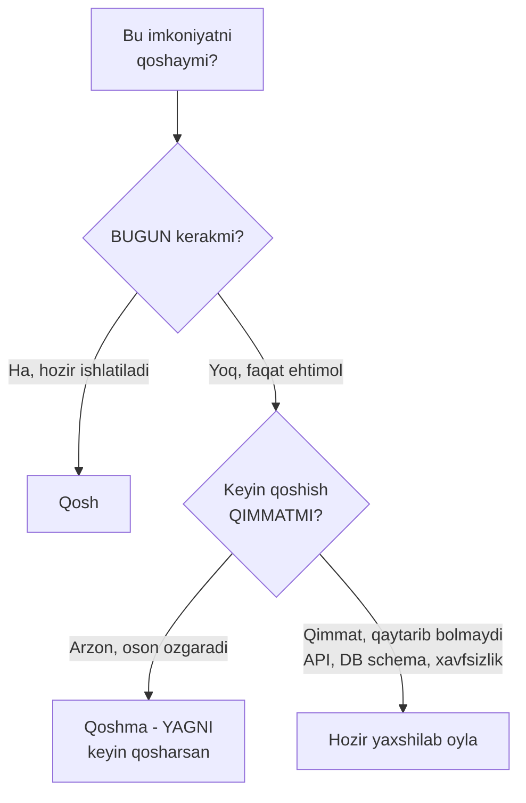
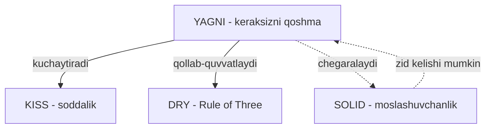

# YAGNI — You Aren't Gonna Need It

> **YAGNI**. Funksionallikni faqat **hozir** kerak bo'lganda qo'shing. "Kelajakda kerak bo'lar" degan taxmin asosida kod yozmang.

---

## STEP 1 — Umumiy tushuncha

### Muammo nima edi?

Dasturchilar kelajakni bashorat qilishni yaxshi ko'radi. "Bugun bizga faqat email yuborish kerak, lekin **ertaga** SMS, push, Slack ham kerak bo'lishi mumkin — keling, hoziroq universal tizim quraylik" degan fikr juda jozibali.

Natijada bir kunlik ish bir haftaga cho'ziladi. Va eng achinarlisi — ertaga kelgan talab siz tasavvur qilgandan **butunlay boshqacha** bo'lib chiqadi. Siz qurgan "universal" tizim yangi talabga mos kelmaydi, uni baribir qayta yozasiz.

Real backend stsenariysi. Sizga vazifa: foydalanuvchi ro'yxatdan o'tganda unga **email** yuborilsin. Xolos. Lekin over-thinking'ga moyil dasturchi quyidagilarni quradi:

| "Kelajak uchun" qo'shilgan narsa | Haqiqatda bo'lgan narsa |
|----------------------------------|-------------------------|
| `NotificationChannel` interface (SMS, push uchun) | Faqat email kerak edi |
| Kanallar registry'si va config'i | Bitta kanaldan ko'p bo'lmadi |
| Retry, priority, batching mexanizmi | Hech qachon ishlatilmadi |
| Har kanal uchun alohida paket | Ular bo'sh turibdi |

Bu — **speculative generality** (taxminiy umumiylik): hech kim so'ramagan moslashuvchanlik. Uning narxi:

- **Vaqt yo'qoladi** — ishlamaydigan narsani qurishga sarflanadi.
- **Kod og'irlashadi** — har o'quvchi ishlatilmaydigan abstraksiyalarni tushunishga majbur.
- **Bug'lar ko'payadi** — yozilmagan kodda bug bo'lmaydi; ortiqcha kod esa yangi xato manbai.
- **Noto'g'ri taxmin** — kelajak boshqacha kelib, butun mehnat behuda ketadi.

### Yechim nima?

**YAGNI** aytadi: **bugungi** talab uchun **bugungi** eng oddiy yechimni yozing. Kelajakdagi ehtimoliy talab uchun bugundan kod yozmang. Kelajak kelganda — u haqida aniq ma'lumotingiz bo'ladi va o'shanda to'g'ri yechim yozasiz.

Bu qo'rqoqlik emas — bu **iqtisod**. Yozilmagan kod: bug bermaydi, o'qishni talab qilmaydi, saqlashni talab qilmaydi. Eng arzon kod — yozilmagan kod.

### Hayotiy analogiya

**Sayohatga jomadon yig'ish.** Uch kunlik safarga ketyapsiz. YAGNI dasturchisi 3 kunlik kiyim oladi. Over-thinking dasturchisi esa "birdan qor yog'sa-chi, birdan dengizga borsam-chi, birdan rasmiy tadbir bo'lsa-chi" deb chang'i kostyumi, suzish kiyimi va smoking ham soladi. Natijada:

- Jomadon og'ir — ko'tarib yurish qiyin (kod og'irlashdi).
- Kerakli narsani topish qiyin — hamma narsa aralashib ketgan (ravshanlik yo'qoldi).
- Va safar davomida bularning hech biri **ishlatilmadi**.

Agar rostdan qor yog'sa — o'sha yerda kurtka sotib olasiz. Bu "hamma ehtimolga tayyor bo'lish"dan arzonroq.

### Asosiy qoida

> **Bugun kerak bo'lgan narsanigina qur. Kelajakni "balki" asosida emas, u kelganda "aniq" asosida hal qil.**
>
> Eng yaxshi vaqt — qaror qabul qilish uchun eng ko'p ma'lumotga ega bo'lgan vaqt. Bu vaqt — kelajakda, hozir emas.

### Vizualizatsiya — qaror daraxti



Diagramma YAGNI'ning to'liq mantig'ini ko'rsatadi: birinchi savol "hozir kerakmi?", ikkinchi savol esa "keyin qo'shish qimmatmi?". Aynan shu ikkinchi savol YAGNI'ni ko'r-ko'rona qo'llashdan saqlaydi (buni STEP 3'da ochamiz).

---

## STEP 2 — Yomon va yaxshi misol

Vazifa: foydalanuvchi ro'yxatdan o'tganda unga **email** yuborilsin. Faqat email. Hozir.

### YOMON misol — kelajak uchun qurilgan tizim

```go
package main

import "fmt"

// YOMON: faqat email kerak edi, lekin "universal" tizim qurildi.

// Hech kim soramagan abstraksiya
type NotificationChannel interface {
	Send(to, msg string) error
	Priority() int
	SupportsBatch() bool
}

// Registry - kanallarni royxatga oladi (bitta kanal uchun!)
type Registry struct {
	channels map[string]NotificationChannel
}

func (r *Registry) Register(name string, c NotificationChannel) {
	r.channels[name] = c
}

// Email - yagona real kanal
type EmailChannel struct{}

func (e EmailChannel) Send(to, msg string) error {
	fmt.Printf("[EMAIL] %s: %s\n", to, msg)
	return nil
}
func (e EmailChannel) Priority() int       { return 1 } // hech qayerda ishlatilmaydi
func (e EmailChannel) SupportsBatch() bool { return false } // ishlatilmaydi

func registerUser(email string) {
	// Faqat email yuborish uchun butun registry sozlanadi
	reg := &Registry{channels: map[string]NotificationChannel{}}
	reg.Register("email", EmailChannel{})
	reg.channels["email"].Send(email, "Xush kelibsiz!")
}
```

Nima uchun yomon (qatorlab):

- **`NotificationChannel` interface** — bitta implementatsiya (email) uchun interface keraksiz. Interface bir necha xil implementatsiya bo'lganda ma'noga ega.
- **`Priority()`, `SupportsBatch()`** — bu metodlar hech qayerda chaqirilmaydi. Ular "kelajakda kerak bo'lar" deb qo'shilgan. O'lik kod (dead code).
- **`Registry`** — bitta kanal uchun map, register mexanizmi... butun infratuzilma bitta email yuborish uchun.
- Bu kodni o'qigan yangi dasturchi "nega bu yerda registry va priority bor? Qayerda ishlatiladi?" deb butun kodni tekshiradi va hech narsa topmaydi.

### YAXSHI misol — YAGNI

```go
package main

import "fmt"

// YAXSHI: vazifa "email yubor" desa - shuni qiladi. Xolos.

func sendWelcomeEmail(to string) error {
	fmt.Printf("[EMAIL] %s: Xush kelibsiz!\n", to)
	return nil
}

func registerUser(email string) error {
	// ... foydalanuvchini saqlash mantigi ...
	return sendWelcomeEmail(email)
}
```

Nima uchun yaxshi (qatorlab):

- **`sendWelcomeEmail`** — bitta funksiya, aniq nom, aniq ish. Interface, registry, priority yo'q — chunki bugun ular kerak emas.
- Kod **kichik va ravshan**. Yangi dasturchi bir o'qishda tushunadi.
- **O'zgartirish oson.** Ertaga rostdan SMS kerak bo'lsa-chi? O'shanda `Notifier` interface joriy qilasiz — va bu **arzon** o'zgarish, chunki kod kichik. Interface'ni ikkinchi kanal **kelganda** ajratasiz, uni kutib emas.

### Kelajak kelganda nima bo'ladi?

Faraz qilaylik, oradan uch oy o'tib rostdan SMS talabi keldi. Endi sizda **aniq** ma'lumot bor (faqat taxmin emas). Endi refactor qilasiz:

```go
// Endi IKKI kanal bor - endi interface HAQIQATAN kerak
type Notifier interface {
	Send(to, msg string) error
}

type EmailNotifier struct{}
func (EmailNotifier) Send(to, msg string) error { /* email */ return nil }

type SMSNotifier struct{}
func (SMSNotifier) Send(to, msg string) error { /* sms */ return nil }
```

E'tibor bering: bu interface YOMON misoldagidan **soddaroq** — chunki u xayoliy ehtiyojlar (`Priority`, `SupportsBatch`) asosida emas, **haqiqiy** ikki kanalning umumiy qismidan tug'ildi. Aynan shu — YAGNI'ning kuchi: kutib turib, keyin **to'g'ri** abstraksiyani yaratasiz.

---

## STEP 3 — Chegaralar va trade-offlar

Bu qism eng muhim, chunki YAGNI'ni ko'r-ko'rona qo'llash ham xavfli. "Hech qachon kelajakni o'ylama" — bu YAGNI EMAS, bu beparvolik.

### YAGNI qachon TO'G'RI ishlaydi: qaytarib bo'ladigan qarorlar

YAGNI **arzon o'zgaradigan** narsalarga taalluqli. Agar biror narsani keyin qo'shish oson bo'lsa — hozir qo'shmang:

- Ichki funksiya, private helper — keyin qo'shish arzon.
- Bitta implementatsiyali interface — keyin ajratish arzon.
- Cache, optimization — keyin qo'shish arzon (avval o'lchang).
- Ichki service'lar orasidagi struktura — refactor bilan o'zgaradi.

Bu narsalarda "keyinroq" deyish to'g'ri, chunki keyin **ko'proq ma'lumot** bilan yaxshiroq qaror qabul qilasiz.

### YAGNI qachon XAVFLI: qaytarib bo'lmaydigan qarorlar

Ba'zi qarorlarni keyin o'zgartirish **juda qimmat** yoki **imkonsiz**. Bu joylarda oldindan o'ylash SHART. YAGNI bu yerga taalluqli emas:

| Soha | Nega oldindan o'ylash kerak |
|------|------------------------------|
| **Public API dizayni** | Tashqi mijozlar unga bog'langan. Buzuvchi o'zgarish (breaking change) minglab foydalanuvchini sindiradi. Versiyalash, kengaytiriladigan format kerak. |
| **Database schema** | Ma'lumot allaqachon yozilgan. Ustunni o'zgartirish million qatorli migration, downtime, ma'lumot yo'qotish xavfi. |
| **Xavfsizlik** | Autentifikatsiya, shifrlash keyin "yopishtirilmaydi". Boshidan noto'g'ri qilinsa — ma'lumot allaqachon ochiq oqib ketgan bo'ladi. |
| **Wire format / protokol** | Bir marta e'lon qilingan format (JSON kontrakti, event schema) tashqi tizimlarga tarqaladi. Uni o'zgartirish hammani sindiradi. |
| **Ma'lumotni yo'qotish** | O'chirilgan ma'lumotni qaytarib bo'lmaydi. "Keyin log qo'sharman" — o'sha vaqtdagi ma'lumot allaqachon yo'q. |

> **Hal qiluvchi mezon — "cost of change" (o'zgarish narxi).**
> Agar keyin qo'shish arzon bo'lsa — YAGNI, kutib tur. Agar keyin qo'shish qimmat yoki qaytarib bo'lmaydigan bo'lsa — hozir yaxshilab o'yla.

Bu Martin Fowler'ning mashhur fikri bilan mos: qaytarib bo'ladigan qarorlarni kechiktiring (YAGNI), qaytarib bo'lmaydigan qarorlarni esa boshidan puxta o'ylang.

### Amaliy misol: DB schema

```go
// Foydalanuvchi jadvali. Hozir faqat email login bor.
// YAGNI: OAuth, telefon login hozir YOQ - ularni qoshmaymiz.
// LEKIN: id turini oldindan togri tanlaymiz.

type User struct {
	ID    string // UUID - int emas! Keyin sharding/merge kerak bolsa muammo bolmasin
	Email string
}
```

Bu yerda ikki qaror bir-biriga zid ko'rinadi, lekin ikkalasi ham to'g'ri:

- **OAuth qo'shmaslik** — YAGNI, chunki keyin ustun qo'shish arzon (`ALTER TABLE ADD COLUMN`).
- **ID uchun UUID tanlash** — YAGNI'ga zid ko'rinadi, lekin to'g'ri: chunki `int`dan `UUID`ga o'tish million qatorli migration va tashqi bog'lanishlarni sindiradi. Bu "qaytarib bo'lmaydigan" qaror, shuning uchun oldindan o'ylanadi.

Farqni ko'ring: birinchisi arzon (kechiktir), ikkinchisi qimmat (hozir hal qil).

### Speculative generality — eng ko'p uchraydigan xato

YAGNI buzilishining eng ko'p ko'rinadigan shakli — **speculative generality**: hech kim so'ramagan moslashuvchanlik. Belgilar:

- Bitta implementatsiyali interface'lar.
- Hech qayerda ishlatilmaydigan `config` parametrlari.
- "Balki kerak bo'lar" izohli metodlar.
- Faqat bitta holat uchun ishlatiladigan "generic" tizim.

Bularni ko'rsangiz — o'chiring. Kod kichrayadi, ravshanlashadi va bug maydoni qisqaradi.

---

## STEP 4 — Boshqa prinsiplar bilan bog'liqlik

### YAGNI va KISS — bir jamoada

YAGNI va **KISS** bir yo'nalishda ishlaydi. Over-engineering'ning aksariyati YAGNI buzilishidan boshlanadi ("kelajak uchun"), natijada KISS ham buziladi (kod murakkablashadi). YAGNI'ga rioya qilsangiz — kod avtomatik ravishda oddiyroq bo'ladi. Ular bir tanganing ikki tomoni: YAGNI **nima** qo'shmaslikni aytadi, KISS **qanday** oddiy yozishni aytadi.

### YAGNI va DRY — Rule of Three orqali

YAGNI **DRY**ning "Rule of Three"sini qo'llab-quvvatlaydi. Ikki o'xshash kod bo'lsa, "kelajakda umumiy bo'lar" deb darhol abstraksiya yaratish — bu YAGNI buzilishi. YAGNI aytadi: uchinchi takror **kelguncha** kutib tur. Shunda abstraksiya haqiqiy ehtiyojdan tug'iladi, taxmindan emas.

### YAGNI va SOLID — muvozanat

SOLID (ayniqsa **Open/Closed** va **Dependency Inversion**) kelajakdagi kengayish uchun abstraksiya qo'shishga undaydi. YAGNI bu yerda muvozanat saqlaydi:

> "Open for extension" — bu "har ehtimolga qarshi hoziroq har joyga interface qo'y" degani EMAS. Bu "kengayish **kerak bo'lganda** oson bo'lsin" degani. Go maqoli buni ifodalaydi: **"accept interfaces, return structs"** — interface'ni faqat u haqiqatan kerak bo'lganda (masalan ikkinchi implementatsiya paydo bo'lganda) joriy qil.

SOLID'ni "hozir" kerak bo'lgan moslashuvchanlik uchun qo'llang, "balki keyin" uchun emas — aks holda u YAGNI'ni buzadi va over-engineering'ga aylanadi.

### Umumiy manzara



Xulosa: YAGNI KISS va DRY bilan do'st, SOLID bilan esa muvozanatda. Uchala prinsip ham (KISS, DRY, YAGNI) bitta umumiy g'oyaga xizmat qiladi: **kod imkon qadar oddiy va faqat haqiqiy ehtiyojga mos bo'lsin.**

---

## O'zingni tekshir

**1. YAGNI "hech qachon kelajakni o'ylama" deganimi? Agar yo'q bo'lsa, u aslida nima deydi?**

<details><summary>Javob</summary>

Yo'q. YAGNI "kelajakdagi **ehtimoliy** (balki kerak bo'ladigan) funksionallik uchun **hozirdan** kod yozma" deydi. U kelajakni umuman o'ylamaslikka chaqirmaydi — u faqat taxmin asosida ish qilishdan saqlaydi. Kelajak kelib, ehtiyoj **aniq** bo'lganda — o'shanda, ko'proq ma'lumot bilan, to'g'ri yechim yozasiz.
</details>

**2. YAGNI qaysi turdagi qarorlarga taalluqli, qaysilariga taalluqli emas? Mezon nima?**

<details><summary>Javob</summary>

Mezon — **"cost of change" (o'zgarish narxi)**. YAGNI **arzon/qaytarib bo'ladigan** qarorlarga taalluqli: ichki funksiya, bitta implementatsiyali interface, cache — bularni keyin qo'shish oson, shuning uchun kechiktiring. YAGNI **qimmat/qaytarib bo'lmaydigan** qarorlarga taalluqli EMAS: public API dizayni, database schema, xavfsizlik, wire format — bularni keyin o'zgartirish juda qimmat yoki imkonsiz, shuning uchun boshidan puxta o'ylanadi.
</details>

**3. Nima uchun "faqat email kerak edi, lekin biz universal notification tizimi qurdik" ko'pincha behuda mehnat bo'lib chiqadi?**

<details><summary>Javob</summary>

Ikki sabab. Birinchidan, ishlamaydigan narsani qurishga vaqt sarflanadi va kod og'irlashadi (ortiqcha abstraksiya, dead code, ko'proq bug maydoni). Ikkinchidan — eng muhimi — kelajakdagi haqiqiy talab siz tasavvur qilgandan **boshqacha** bo'lib chiqadi. Siz qurgan "universal" tizim yangi talabga mos kelmaydi va uni baribir qayta yozasiz. Ya'ni taxminingiz noto'g'ri chiqadi va butun mehnat behuda ketadi.
</details>

**4. `int` ID o'rniga UUID tanlash YAGNI'ga zid ko'rinadi. Nega bu aslida to'g'ri qaror?**

<details><summary>Javob</summary>

Chunki bu **qaytarib bo'lmaydigan / qimmat** qaror. OAuth login qo'shmaslik YAGNI'ga mos, chunki keyin ustun qo'shish arzon (`ALTER TABLE ADD COLUMN`). Lekin `int`dan `UUID`ga o'tish million qatorli ma'lumotni migration qilish, tashqi bog'lanishlarni sindirish, downtime demakdir. Cost of change juda yuqori bo'lgani uchun bu qaror YAGNI istisnosiga tushadi — uni boshidan to'g'ri tanlash kerak.
</details>

**5. Speculative generality nima va uni kodda qanday belgilardan taniysiz?**

<details><summary>Javob</summary>

Speculative generality — hech kim so'ramagan, "balki keyin kerak bo'lar" asosida qo'shilgan moslashuvchanlik. Belgilari: bitta implementatsiyali interface'lar, hech qayerda ishlatilmaydigan config parametrlari, chaqirilmaydigan metodlar (masalan `Priority()`, `SupportsBatch()`), faqat bitta holat uchun ishlatiladigan "generic" tizim. Bularni ko'rsangiz — o'chiring; kod kichrayadi, ravshanlashadi va bug maydoni qisqaradi.
</details>

---

## Keyingi qadam

→ [../1. S.O.L.I.D/1. S.md](../1.%20S.O.L.I.D/1.%20S.md) — endi SOLID prinsiplariga o'tib, moslashuvchanlikni **qachon va qanday** to'g'ri qo'shishni o'rganamiz.
