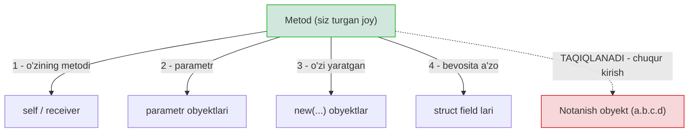
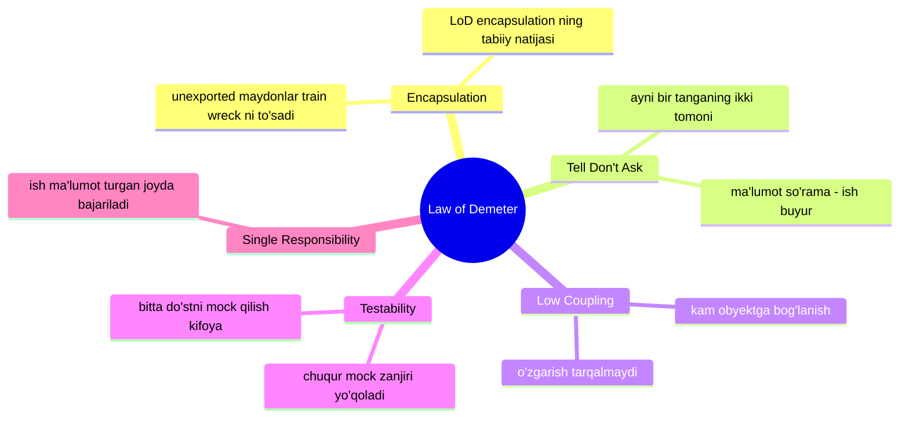

# Law of Demeter (Eng kam bilish qonuni)

> **Law of Demeter (LoD)** — obyekt faqat o'zining eng yaqin "do'stlari" bilan gaplashishi kerak, notanish obyektlarning ichki tuzilishiga chuqur kirib bormasligi lozim.

---

## STEP 1 — Umumiy tushuncha

### Muammo nima edi?

Tasavvur qiling, sizda internet-do'kon backend'i bor. Buyurtmaning yetkazib beriladigan
shahri qaysi ekanini bilmoqchisiz. Kod shunday ko'rinishda yozilgan:

```go
city := order.GetCustomer().GetAddress().GetCity().GetName()
```

Bu qatorni **"train wreck"** (poyezd halokati) deb atashadi — chunki chaqiruvlar bir-biriga
vagon kabi ulanib ketgan. Bir qarashda hammasi ishlaydi. Lekin bu qatorda **yashirin bomba** bor.

Bu bitta qator quyidagilarning **hammasini** biladi:

1. `Order`ning ichida `Customer` borligini biladi
2. `Customer`ning ichida `Address` borligini biladi
3. `Address`ning ichida `City` borligini biladi
4. `City`ning ichida `Name` (metod) borligini biladi

Ya'ni bu kod **butun obyektlar zanjirining ichki tuzilishini** yoddan biladi. Endi tasavvur qiling:

- **`Address` tuzilmasi o'zgardi.** Aytaylik, `City` alohida obyekt emas, balki oddiy string
  bo'lib qoldi (`Address.CityName`). Endi loyihaning **hamma joyida** shu train wreck qatorlarini
  qidirib topib tuzatish kerak. Bittasini unutsangiz — kompilyatsiya buziladi yoki `nil pointer`
  panika bo'ladi.
- **`nil` xavfi.** Zanjirdagi istalgan bo'g'in `nil` bo'lsa (`Customer` hali biriktirilmagan
  bo'lsa) — butun dastur panika bilan qulaydi. Va siz `nil` tekshiruvlarini ham zanjir bo'ylab
  yozishga majbur bo'lasiz: `if order != nil && order.GetCustomer() != nil && ...`.
- **Test qilib bo'lmaydi.** Bu kodni test qilish uchun `Customer`, `Address`, `City` — hammasini
  soxta (mock) qilib zanjir bo'ylab tayyorlab qo'yish kerak. Bir metodni test qilish uchun to'rtta
  obyektni qurish kerak bo'ladi.

### Analogiya — gazeta tashuvchi bola va hamyon

Tasavvur qiling, gazeta tashuvchi bola pulini olish uchun mijozning cho'ntagiga qo'lini tiqadi,
hamyonini ochadi, ichidan kerakli pulni sanab oladi:

```
customer.GetWallet().GetMoney() -= 2   // YOMON: cho'ntakka qo'l tiqish
```

Real hayotda hech kim bunday qilmaydi. Bola mijozga **"2 dollar to'lang"** deydi, mijozning
O'ZI hamyonini ochib, pulni sanab beradi:

```
payment := customer.Pay(2)             // YAXSHI: mijozga aytamiz, ichiga kirmaymiz
```

Farqi shuki: birinchi holatda bola mijozning **ichki tuzilishini** (hamyoni bor, hamyonda pul
bor) biladi. Ikkinchisida esa faqat **"to'lay olasan"** degan qobiliyatini biladi. Mijoz pulni
kartadan ham, naqddan ham to'lashi mumkin — bolaga farqi yo'q.

> **Chegara (misconception):** LoD "faqat bitta nuqta ishlat" degani EMAS. `a.b.c` har doim yomon
> degani ham emas. Gap **notanish obyektning ichki tuzilishini bilish** haqida. Agar `a.b`
> shunchaki ochiq ma'lumot maydoni (data field) bo'lsa va u obyektning "ichki siri" bo'lmasa,
> muammo yo'q. Muammo — chuqurga kirib, boshqa obyektning obyektining metodini chaqirganda.

### Formal qoida — kimlar bilan gaplashish mumkin

Metod (`M`) faqat quyidagilarning metodlarini chaqirishi mumkin:

1. **O'zining** metodlari (`self` / receiver)
2. Metodga **parametr** sifatida uzatilgan obyektlar
3. Metod **ichida yaratgan** obyektlar
4. Obyektning **bevosita a'zolari** (direct fields / components)

Boshqacha aytganda: "faqat eng yaqin do'stlaring bilan gaplash, notanishlar bilan emas"
(*only talk to your immediate friends, don't talk to strangers*).



---

## STEP 2 — Yomon va yaxshi misol

Real stsenariy: **buyurtma summasini hisoblash va yetkazib berish shahrini olish.** Backend'da
`ShippingService` buyurtma bo'yicha yetkazib berish narxini hisoblaydi.

### YOMON misol — train wreck va cho'ntakka qo'l tiqish

```go
package main

import "fmt"

// --- Chuqur ichma-ich joylashgan tuzilmalar ---
type City struct {
	Name    string
	ZipCode string
}

type Address struct {
	Street string
	City   *City // ichida yana obyekt
}

type Customer struct {
	Name    string
	Address *Address // ichida yana obyekt
	Balance int      // hamyon
}

type Order struct {
	ID       string
	Customer *Customer // ichida yana obyekt
	Total    int
}

// YOMON: ShippingService buyurtmaning BUTUN ichki tuzilishini biladi
type ShippingService struct{}

func (s *ShippingService) Process(order *Order) {
	// train wreck: 4 ta obyekt ichiga chuqur kirib boramiz
	city := order.Customer.Address.City.Name
	zip := order.Customer.Address.City.ZipCode

	// cho'ntakka qo'l tiqish: mijozning balansini o'zimiz kamaytiramiz
	order.Customer.Balance -= order.Total

	fmt.Printf("Buyurtma %s -> %s (%s) shahriga jo'natildi\n", order.ID, city, zip)
	fmt.Printf("Mijoz balansi: %d\n", order.Customer.Balance)
}

func main() {
	order := &Order{
		ID:    "A-100",
		Total: 50,
		Customer: &Customer{
			Name:    "Ali",
			Balance: 200,
			Address: &Address{
				Street: "Navoiy 15",
				City:   &City{Name: "Toshkent", ZipCode: "100000"},
			},
		},
	}
	(&ShippingService{}).Process(order)
}
```

**Output:**
```
Buyurtma A-100 -> Toshkent (100000) shahriga jo'natildi
Mijoz balansi: 150
```

**Nega bu yomon (qatorlab):**

- `order.Customer.Address.City.Name` — `ShippingService` `Order`, `Customer`, `Address`, `City` —
  **to'rtta** tuzilmaning ichki qurilishini biladi. Agar shulardan bittasi o'zgarsa, `ShippingService`
  ham buziladi. Ular orasida **qattiq bog'lanish (tight coupling)** paydo bo'ldi.
- `order.Customer.Balance -= order.Total` — bu **cho'ntakka qo'l tiqish**. `Customer` o'z balansini
  o'zi boshqarishi kerak edi. Endi balansni tekshirish qoidasi (masalan, "balans manfiy bo'lmasin")
  ikki joyda: `Customer`da ham, `ShippingService`da ham yozilishi kerak bo'ladi. Qoida tarqalib ketadi.
- `nil` xavfi: agar `order.Customer.Address` biriktirilmagan bo'lsa, dastur shu yerda panika bilan
  quladi.

### YAXSHI misol — "tell, don't ask" bilan

Endi har bir obyekt o'z ma'lumotini o'zi bersin (**tell, don't ask** — "so'rama, ayt"). Ichki
tuzilishni tashqariga chiqarmaymiz, balki **maqsadli metod** beramiz.

```go
package main

import "fmt"

type City struct {
	name    string
	zipCode string
}

type Address struct {
	street string
	city   City
}

// Address O'ZI kerakli ma'lumotni beradi -> ichki City yashirin qoladi
func (a Address) ShippingLabel() string {
	return fmt.Sprintf("%s (%s)", a.city.name, a.city.zipCode)
}

type Customer struct {
	name    string
	address Address
	balance int
}

// Customer O'ZI hamyonini boshqaradi -> tashqaridan balansga tegilmaydi
func (c *Customer) Charge(amount int) error {
	if c.balance < amount {
		return fmt.Errorf("mablag' yetarli emas: balans %d, kerak %d", c.balance, amount)
	}
	c.balance -= amount
	return nil
}

// Customer O'ZI manzil yorlig'ini beradi -> Address ichki qoladi
func (c Customer) ShippingLabel() string {
	return c.address.ShippingLabel()
}

type Order struct {
	id       string
	customer *Customer
	total    int
}

// Order O'ZI kerakli ma'lumotni beradi -> Customer ichki qoladi
func (o *Order) Ship() error {
	// faqat bevosita a'zomiz (customer) bilan gaplashamiz
	if err := o.customer.Charge(o.total); err != nil {
		return err
	}
	fmt.Printf("Buyurtma %s -> %s shahriga jo'natildi\n", o.id, o.customer.ShippingLabel())
	return nil
}

func main() {
	order := &Order{
		id:    "A-100",
		total: 50,
		customer: &Customer{
			name:    "Ali",
			balance: 200,
			address: Address{
				street: "Navoiy 15",
				city:   City{name: "Toshkent", zipCode: "100000"},
			},
		},
	}
	if err := order.Ship(); err != nil {
		fmt.Println("Xato:", err)
	}
}
```

**Output:**
```
Buyurtma A-100 -> Toshkent (100000) shahriga jo'natildi
```

**Nega bu yaxshi (qatorlab):**

- `Order.Ship()` faqat **o'zining bevosita a'zosi** `customer` bilan gaplashadi
  (`o.customer.Charge`, `o.customer.ShippingLabel`). U `Address` yoki `City` haqida **hech narsa
  bilmaydi**. Endi `Address` tuzilmasi o'zgarsa — `Order` umuman ta'sirlanmaydi.
- `customer.Charge(o.total)` — bu **"tell, don't ask"**. Biz mijozga "50 pul yech" deb **aytamiz**,
  balansni **so'rab** olib o'zimiz kamaytirmaymiz. Balans qoidasi (yetarlimi yoki yo'q) faqat
  bitta joyda — `Customer.Charge` ichida yashaydi.
- Zanjir yo'qoldi: `order.Customer.Address.City.Name` o'rniga har bir obyekt keyingi bosqichga
  **delegatsiya** qiladi (`ShippingLabel` metodi bir-birini chaqiradi). Bu **Law of Demeter'ni**
  qanoatlantiradi.

### 🤔 O'ylab ko'r

Yuqoridagi YAXSHI misolda `City` va `Address` maydonlari kichik harf bilan (`name`, `city`)
yozilgan — ya'ni package'dan tashqariga chiqmaydigan (unexported) qilingan. Nega bu LoD uchun muhim?

<details>
<summary>Javobni ko'rish</summary>

Chunki maydonlar unexported bo'lsa, tashqi package `order.customer.address.city.name` deb
**yoza olmaydi** — kompilyator ruxsat bermaydi. Ya'ni encapsulation LoD'ni **majburan** ta'minlaydi.
Agar maydonlar `Name`, `City` (bosh harf, exported) bo'lganida, kim xohlasa train wreck yozishi
mumkin edi. Demak LoD ko'p jihatdan **encapsulation'ning tabiiy natijasi**.
</details>

---

## STEP 3 — Chegaralar va trade-offlar

### 1. Fluent API va Builder pattern LoD'ni BUZMAYDI (asosiy istisno)

Yangi o'rganuvchilar ko'pincha adashadi: "Builder ham `b.SetName().SetAge().Build()` deb zanjir
yasayapti-ku, bu ham train wreck emasmi?" **Yo'q.** Farqi juda muhim:

| Xususiyat | Train wreck (LoD buzilishi) | Fluent API / Builder (LoD buzilmaydi) |
|-----------|-----------------------------|----------------------------------------|
| Zanjir nimani qaytaradi | Har chaqiruv **boshqa** obyekt (Customer, Address, City) | Har chaqiruv **o'sha** obyektni (`return b`) qaytaradi |
| Ichki tuzilish ochiladimi | Ha — boshqa obyektlar ichiga kiriladi | Yo'q — bitta obyekt bilan gaplashiladi |
| Bog'lanish | Ko'p obyektga bog'lanadi | Bitta obyektga bog'lanadi |

```go
// Bu train wreck EMAS: har chaqiruv o'SHA builder'ni qaytaradi
user := NewUserBuilder().
	Name("Ali").      // return b
	Age(30).          // return b
	Email("a@b.uz").  // return b
	Build()           // yakuniy obyekt
```

Bu yerda `Name`, `Age`, `Email` — hammasi **bitta va o'sha** `builder` obyektining metodlari
(`return b`). Siz notanish obyektning ichiga kirmayapsiz, faqat bitta do'stingiz bilan ketma-ket
gaplashyapsiz. Standart kutubxonadagi `strings.Builder` ham xuddi shunday ishlaydi. Demak
**zanjirning uzunligi emas, zanjir bo'ylab NECHTA turli obyekt ochilishi** muhim.

### 2. Haddan tashqari qo'llash — "wrapper portlashi"

Agar LoD'ni ko'r-ko'rona qo'llasangiz, teskari muammoga duch kelasiz. Har bir chuqur ma'lumotni
olib chiqish uchun **o'rab beruvchi (wrapper / delegating) metod** yozishga majbur bo'lasiz:

```go
// Har bir ichki ma'lumot uchun alohida "o'tkazgich" metod
func (o Order) CustomerName() string    { return o.customer.Name() }
func (o Order) CustomerCity() string    { return o.customer.City() }
func (o Order) CustomerZip() string     { return o.customer.Zip() }
func (o Order) CustomerEmail() string   { return o.customer.Email() }
// ... yana o'nlab shunday metodlar
```

Bu **middle man** (ortiqcha vositachi) anti-patterniga olib keladi: `Order` shunchaki
`Customer`ning metodlarini takrorlaydi, o'zi hech qanday foyda qo'shmaydi. Bu ham yomon.

> **Oltin muvozanat:** LoD sizdan ichki ma'lumotni **so'rab olishni** emas, obyektga **ish
> buyurishni** talab qiladi. Agar bir nechta ma'lumotni tashqariga chiqarayotgan bo'lsangiz —
> ehtimol o'sha ish (masalan, "shipping label yasash") noto'g'ri joyda turibdi. Ma'lumotni tashqariga
> tortish o'rniga, **ishni ma'lumot turgan joyga ko'chiring**.

### 3. Ma'lumot obyektlari (DTO, config) uchun LoD yumshoq

Agar obyekt shunchaki **ma'lumot tashuvchi** (DTO, konfiguratsiya, JSON javob) bo'lsa va uning
xulq-atvori (behavior) bo'lmasa, uning maydonlariga kirish (`config.Server.Port`) normal holat.
LoD asosan **xulq-atvorli obyektlar** (rich objects) uchun kuchli qo'llaniladi. DTO'ni har bir
maydoni uchun getter/wrapper bilan o'rash — ma'nosiz mehnat.

---

## STEP 4 — Boshqa prinsiplar bilan bog'liqlik



**Encapsulation bilan.** LoD — encapsulation'ning amaliy ko'rinishi. Encapsulation "ichki holatni
yashir" desa, LoD "yashiringan ichki holatga chuqur kirma" deydi. Go'da maydonlarni unexported
qilish LoD'ni **majburan** ta'minlaydi.

**Tell, Don't Ask bilan.** Bu ikkisi bir tanganing ikki tomoni. "Tell, don't ask" — obyektdan
holatini **so'rab** olib, keyin o'zing qaror qabul qilma; obyektga **aytib**, qarorni o'ziga qoldir.
Train wreck aslida "ask, ask, ask, then do" (so'ra, so'ra, so'ra, keyin qil) shaklidir.

**Low Coupling bilan.** Har bir train wreck — bu qo'shimcha bog'lanish (coupling). LoD zanjirni
uzib, modulni faqat bevosita qo'shnisiga bog'laydi. Bu keyingi darsdagi **Low Coupling** prinsipiga
to'g'ridan-to'g'ri xizmat qiladi.

**Testability (test qilinuvchanlik) bilan.** Train wreck'ni test qilish uchun butun mock zanjirini
qurish kerak: `mockOrder.Customer` -> `mockCustomer.Address` -> `mockAddress.City` ... LoD'ga rioya
qilingan kodda esa faqat **bitta** bevosita qo'shnini mock qilish kifoya. Agar testda "mock ichida
mock ichida mock" yozayotgan bo'lsangiz — bu LoD buzilganining eng aniq belgisi.

---

## O'zingni tekshir

**1. `order.GetCustomer().GetAddress().GetCity()` — nega bu xavfli? Kamida ikkita sabab ayting.**

<details>
<summary>Javob</summary>

Birinchidan, bu kod `Order`, `Customer`, `Address`, `City` — barcha obyektlarning ichki
tuzilishini biladi; ulardan biri o'zgarsa, bu kod ham buziladi (tight coupling). Ikkinchidan,
zanjirdagi istalgan bo'g'in `nil` bo'lsa, dastur panika bilan quladi. Uchinchidan, uni test qilish
uchun butun mock zanjirini qurish kerak.
</details>

**2. Builder pattern'da `b.SetName().SetAge().Build()` zanjiri bor. Nega bu LoD'ni buzmaydi, lekin `order.GetCustomer().GetName()` buzadi?**

<details>
<summary>Javob</summary>

Chunki Builder zanjirida har bir metod **o'sha bitta** builder obyektini qaytaradi (`return b`) —
siz doim bitta obyekt bilan gaplashyapsiz. Train wreck'da esa har bir chaqiruv **boshqa-boshqa**
obyektni qaytaradi (Customer, keyin Address, keyin City), ya'ni siz notanish obyektlarning ichiga
chuqur kirib borasiz. Muhimi zanjir uzunligi emas, zanjir bo'ylab nechta TURLI obyekt ochilishi.
</details>

**3. "Tell, don't ask" prinsipi bilan Law of Demeter qanday bog'liq?**

<details>
<summary>Javob</summary>

Ikkisi bir tanganing ikki tomoni. Train wreck aslida "so'ra, so'ra, so'ra, keyin o'zing qil"
shaklidir (`balance := customer.Balance; customer.Balance -= total`). "Tell, don't ask" esa
buni "ish buyur" ko'rinishiga aylantiradi (`customer.Charge(total)`) — natijada obyekt o'z
holatini o'zi boshqaradi va train wreck yo'qoladi.
</details>

**4. LoD'ni haddan tashqari qo'llasa qanday muammo kelib chiqadi?**

<details>
<summary>Javob</summary>

"Wrapper portlashi" yoki "middle man" muammosi: har bir ichki ma'lumotni chiqarish uchun
delegatsiya qiluvchi metod yozishga majbur bo'lasiz (`CustomerName`, `CustomerCity`, `CustomerZip`...),
va obyekt shunchaki boshqa obyektning metodlarini takrorlaydigan ortiqcha vositachiga aylanadi.
To'g'ri yechim — ma'lumotni tortib chiqarish o'rniga, ishni ma'lumot turgan joyga ko'chirish.
</details>

**5. Go'da qaysi til xususiyati Law of Demeter'ni majburan ta'minlashga yordam beradi?**

<details>
<summary>Javob</summary>

Unexported (kichik harf bilan boshlanadigan) maydonlar. Agar `Customer`ning `address` maydoni
unexported bo'lsa, boshqa package undan `customer.address.city.name` deb chuqur o'qiy olmaydi —
kompilyator taqiqlaydi. Shu tariqa encapsulation LoD'ni til darajasida kuchaytiradi.
</details>
