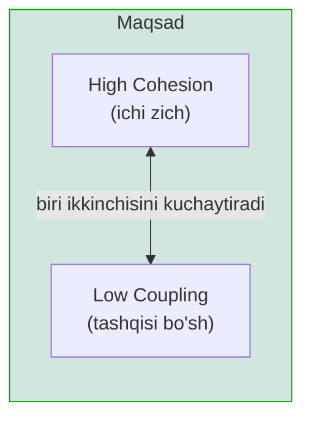
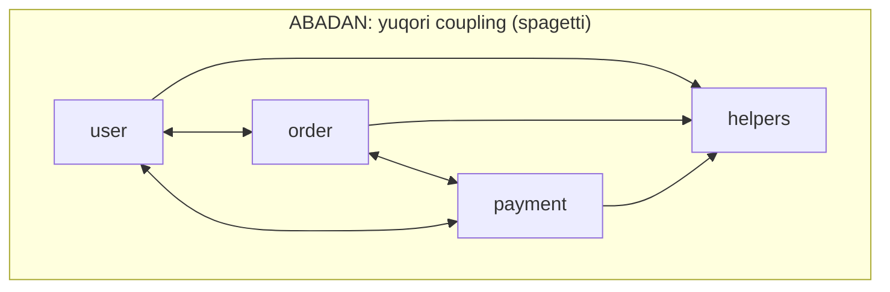
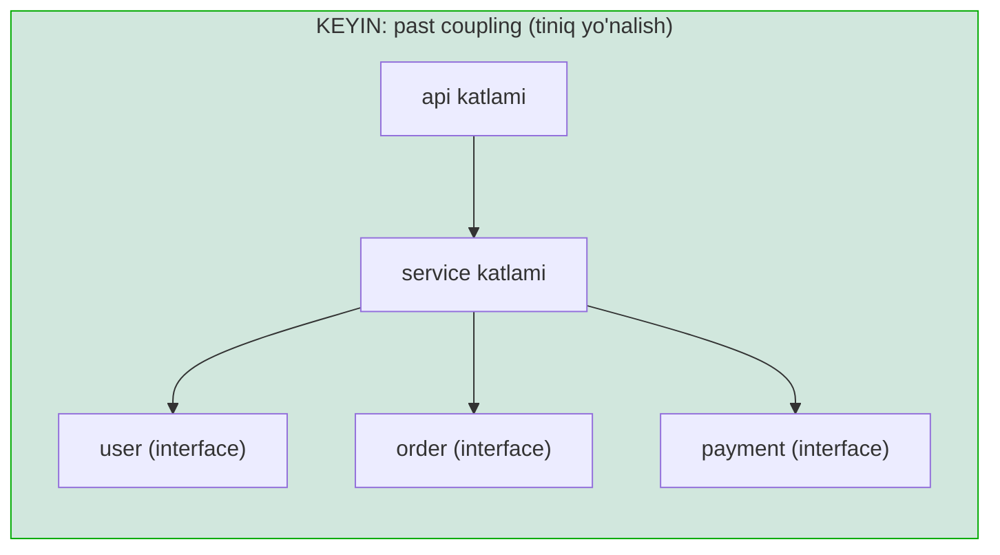
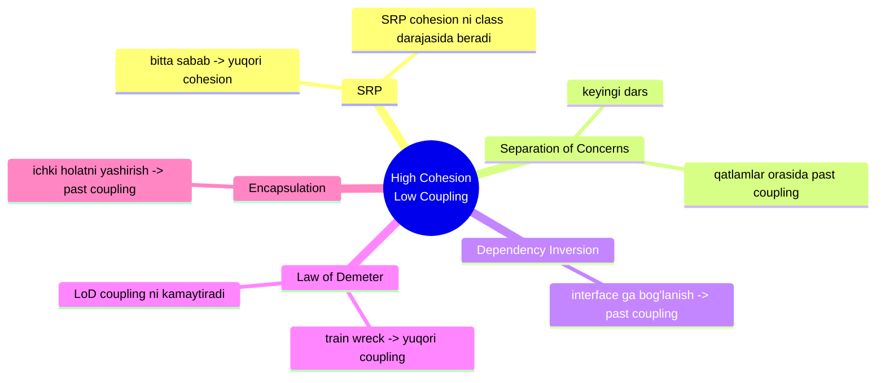

# High Cohesion - Low Coupling

> **High Cohesion & Low Coupling** — modul ichidagi qismlar bir-biriga zich bog'langan (cohesion yuqori), lekin modullar orasidagi bog'lanish minimal (coupling past) bo'lishi kerak.

---

## STEP 1 — Umumiy tushuncha

### Muammo nima edi?

Tasavvur qiling, backend loyihangizda `helpers` degan bitta package bor. U yerda: JSON parse
qilish, parolni hash qilish, sana formatlash, HTTP so'rov yuborish, SQL query yasash — hammasi
bitta package'da. Har bir dasturchi "qayerga qo'yishni bilmagan" kodni shu yerga tashlaydi.

Endi muammolar boshlanadi:

- **`helpers` package'i hamma joyga bog'langan.** Uni o'zgartirsangiz, butun loyiha qayta
  kompilyatsiya bo'ladi. Kichkina o'zgarish ham xavfli.
- **Hech kim `helpers` nima qilishini bilmaydi.** Nomi hech narsani anglatmaydi. Ichida bir-biriga
  aloqasi yo'q 40 ta funksiya bor.
- **Modullar bir-biriga chirmashib ketgan.** `order` package `user` package'ni chaqiradi, u
  `payment`ni, u yana `order`ni — aylanma bog'lanish (circular dependency). Bittasini o'zgartirsangiz,
  zanjir bo'ylab hammasi buziladi.

Bu ikki muammoning ildizi ikkita tushunchada: **cohesion** (biror modul ichidagi qismlar
bir-biriga qanchalik bog'liq) va **coupling** (modullar bir-biriga qanchalik bog'liq).

### Ikki tushuncha — tarozining ikki pallasi

**Cohesion (ichki bog'lanish)** — bitta modul ichidagi funksiyalar/tiplar bir-biriga qanchalik
**mantiqan tegishli**. Yuqori cohesion yaxshi: modul bitta aniq ishni qiladi.

**Coupling (tashqi bog'lanish)** — modullar bir-biriga qanchalik **bog'langan**. Past coupling
yaxshi: bir modulni o'zgartirsangiz, boshqalariga ta'sir qilmaydi.

Bu ikkisi **tarozining ikki pallasi** kabi bir-biriga bog'liq. Odatda ular **birga** yaxshilanadi:



Nega birga? Agar bog'liq narsalarni **bitta** modulga yig'sangiz (yuqori cohesion), ular orasidagi
bog'lanish modul **ichida** qoladi va tashqariga chiqmaydi — natijada modullar orasidagi coupling
tabiiy ravishda kamayadi. Aksincha, bog'liq narsalarni turli modullarga sochib tashlasangiz, ular
doim bir-birini chaqirishga majbur bo'ladi — coupling oshadi.

### Analogiya — oshxona javonlari

Oshxonani tasavvur qiling. **Yuqori cohesion** — har bir javonda **bir turdagi** narsa: bir javon
faqat ziravorlar, bir javon faqat idishlar, bir tortma faqat qoshiq-vilkalar. Har birini topish oson.

**Past coupling** — ziravorlar javonini ko'chirsangiz, idishlar javoniga umuman ta'sir qilmaydi.
Ular bir-biridan mustaqil.

**Yomon holat** (past cohesion + yuqori coupling): har bir javonda aralash narsa — biroz ziravor,
biroz idish, biroz qoshiq. Va bir javonni ochish uchun avval boshqa uchta javonni ochish shart.
Bu — o'sha `helpers` package'i.

### Coupling turlari — eng qattig'idan eng bo'shigacha

Coupling darajalari bor. Yuqoridagilar **eng yomon**, pastdagilar **eng yaxshi**:

| Tur | Ta'rif | Baho |
|-----|--------|------|
| **Content coupling** | Bir modul boshqasining ichki holatini to'g'ridan-to'g'ri o'zgartiradi | Eng yomon |
| **Common coupling** | Modullar umumiy global o'zgaruvchiga bog'langan | Yomon |
| **Control coupling** | Bir modul boshqasining ichki oqimini flag orqali boshqaradi (`process(true)`) | O'rtacha |
| **Stamp coupling** | Faqat bitta maydon kerak bo'lsa ham, butun struct uzatiladi | Yaxshiga yaqin |
| **Data coupling** | Faqat kerakli oddiy ma'lumot uzatiladi (`Charge(amount int)`) | Eng yaxshi |

### Cohesion turlari — eng yaxshisidan eng yomonigacha

| Tur | Ta'rif | Baho |
|-----|--------|------|
| **Functional** | Barcha qismlar bitta aniq vazifaga xizmat qiladi | Eng yaxshi |
| **Sequential** | Bir qismning natijasi keyingisiga kirish bo'ladi | Yaxshi |
| **Communicational** | Qismlar bir xil ma'lumot ustida ishlaydi | Yaxshi |
| **Procedural** | Qismlar bir ketma-ketlikda bajariladi (aloqasi kuchsiz) | O'rtacha |
| **Temporal** | Qismlar bir vaqtda ishlagani uchun birga (masalan, `init`) | Kuchsiz |
| **Logical** | Bir toifadagi ishlar flag bilan tanlanadi | Yomon |
| **Coincidental** | Qismlar tasodifan birga (`helpers`, `utils`) | Eng yomon |

> **Oltin qoida:** *High cohesion, low coupling* — bog'liq narsalarni birga tut, bog'liq bo'lmagan
> narsalarni ajrat. Modul ichi zich, modullar orasi bo'sh bo'lsin.

---

## STEP 2 — Yomon va yaxshi misol

Stsenariy: **foydalanuvchini ro'yxatdan o'tkazish** — parolni hash qilish, bazaga saqlash, xush
kelibsiz emaili yuborish.

### YOMON misol — past cohesion, yuqori coupling

```go
package main

import "fmt"

// YOMON 1: global o'zgaruvchi -> common coupling
var GlobalDB = map[string]string{}

// YOMON 2: bitta struct hamma narsani biladi -> past cohesion
type UserSystem struct {
	SMTPHost string
	DBName   string
}

// Bu metod flag orqali ichki oqimni boshqaradi -> control coupling
func (s *UserSystem) Register(name, pass string, sendEmail bool) {
	// hash mantig'i shu yerda
	hashed := "hash(" + pass + ")"

	// SQL mantig'i shu yerda (bazaga to'g'ridan-to'g'ri kirish)
	GlobalDB[name] = hashed
	fmt.Printf("[DB=%s] %s saqlandi\n", s.DBName, name)

	// email mantig'i ham shu yerda
	if sendEmail { // control coupling: flag bilan boshqarish
		fmt.Printf("[SMTP=%s] %s ga xush kelibsiz emaili\n", s.SMTPHost, name)
	}
}

func main() {
	sys := &UserSystem{SMTPHost: "smtp.uz", DBName: "prod"}
	sys.Register("Ali", "1234", true)
}
```

**Output:**
```
[DB=prod] Ali saqlandi
[SMTP=smtp.uz] Ali ga xush kelibsiz emaili
```

**Nega bu yomon:**

- `UserSystem` bitta o'zida **hash + SQL + email** mantig'ini jamlagan — bu **coincidental/logical
  cohesion** (past cohesion). Uch xil sabab bilan o'zgaradi.
- `GlobalDB` global o'zgaruvchi — bu **common coupling**. Kim xohlasa unga tegadi, kim buzganini
  topib bo'lmaydi.
- `Register(name, pass, sendEmail bool)` — `sendEmail` flag'i **control coupling**: chaqiruvchi
  metod ichki oqimni boshqarmoqda. Ertaga "SMS ham yubor" kerak bo'lsa, yana bir flag qo'shiladi.
- Bu kodni test qilib bo'lmaydi: hashni test qilmoqchi bo'lsangiz ham, u bilan birga SQL va SMTP'ni
  ham ko'tarishga majbursiz (yuqori coupling).

### YAXSHI misol — yuqori cohesion, past coupling

Har bir mas'uliyatni **alohida, ichki jihatdan zich** birlikka ajratamiz va ularni **interface**
orqali bog'laymiz (data coupling).

```go
package main

import "fmt"

// --- Har biri bitta ishga xizmat qiladi: functional cohesion ---

// Faqat parol bilan ishlaydi
type PasswordHasher interface {
	Hash(plain string) string
}

// Faqat saqlash bilan ishlaydi
type UserStore interface {
	Save(name, hash string) error
}

// Faqat xabar bilan ishlaydi
type Notifier interface {
	Welcome(name string) error
}

// --- Konkret implementatsiyalar ---

type BcryptHasher struct{}

func (BcryptHasher) Hash(plain string) string { return "hash(" + plain + ")" }

type SQLUserStore struct{ db string }

func (s SQLUserStore) Save(name, hash string) error {
	fmt.Printf("[DB=%s] %s saqlandi\n", s.db, name)
	return nil
}

type EmailNotifier struct{ host string }

func (n EmailNotifier) Welcome(name string) error {
	fmt.Printf("[SMTP=%s] %s ga xush kelibsiz emaili\n", n.host, name)
	return nil
}

// RegistrationService faqat "ro'yxatdan o'tkazish" oqimini biladi
// U interface larga bog'langan (data coupling), konkret tiplarga emas
type RegistrationService struct {
	hasher   PasswordHasher
	store    UserStore
	notifier Notifier
}

func (r RegistrationService) Register(name, pass string) error {
	hash := r.hasher.Hash(pass)      // 1-qadam: hash
	if err := r.store.Save(name, hash); err != nil { // 2-qadam: saqlash
		return err
	}
	return r.notifier.Welcome(name)  // 3-qadam: xabar
}

func main() {
	svc := RegistrationService{
		hasher:   BcryptHasher{},
		store:    SQLUserStore{db: "prod"},
		notifier: EmailNotifier{host: "smtp.uz"},
	}
	svc.Register("Ali", "1234")
}
```

**Output:**
```
[DB=prod] Ali saqlandi
[SMTP=smtp.uz] Ali ga xush kelibsiz emaili
```

**Nega bu yaxshi:**

- Har bir tip **bitta aniq ishga** xizmat qiladi (`BcryptHasher` faqat hashlaydi) — **functional
  cohesion**.
- `RegistrationService` konkret tiplarga emas, **interface**larga bog'langan — bu **data coupling**
  (eng bo'sh, eng yaxshi). Ertaga `EmailNotifier` o'rniga `SMSNotifier` qo'ysangiz, `RegistrationService`
  o'zgarmaydi.
- Global o'zgaruvchi yo'q — hamma bog'liqlik (dependency) tashqaridan uzatiladi (dependency injection).
  Bu **common coupling**'ni yo'q qiladi.
- `sendEmail bool` flag'i yo'qoldi — endi oqim `Register` ichida tiniq ko'rinadi (control coupling
  yo'q). Test uchun har bir interface'ni alohida mock qilish oson.

### 🤔 O'ylab ko'r

YAXSHI misolda `RegistrationService` uchta interface'ga bog'langan. Bu ham "bog'lanish" emasmi?
Nega bu YOMON misoldagi bog'lanishdan yaxshiroq?

<details>
<summary>Javobni ko'rish</summary>

Ha, bog'lanish bor, lekin u **interface**ga (abstraksiyaga) bog'lanish, konkret tipga emas.
Interface — bu "shartnoma" (contract), o'zgarmas va sodda. Konkret `EmailNotifier` esa har vaqt
o'zgarishi mumkin (SMTP kutubxonasi, host, retry mantig'i...). Abstraksiyaga bog'lanish
o'zgarishlardan himoyalaydi — bu Dependency Inversion prinsipining mohiyati. Coupling'ning
**miqdori** emas, **turi** muhim: interface'ga bog'lanish = past (yaxshi) coupling.
</details>

---

## STEP 3 — Go package dizaynida cohesion va coupling

Go'da **package** — cohesion va coupling namoyon bo'ladigan asosiy birlik. Bir nechta amaliy qoida:

### 1. Package'ni domen bo'yicha bo'l, texnik qatlam bo'yicha emas

```
YOMON (past cohesion - texnik bo'linish):     YAXSHI (yuqori cohesion - domen bo'linishi):
  models/                                        user/
    user.go, order.go, payment.go   ...            user.go, store.go, service.go
  controllers/                                   order/
    user.go, order.go, payment.go                  order.go, store.go, service.go
  services/                                      payment/
    user.go, order.go, payment.go                  payment.go, gateway.go
```

Chapdagi `models`/`controllers`/`services` bo'linishida bitta funksiyani o'zgartirish uchun uch
package'ni ochish kerak — bog'liq kod uch joyga sochilgan (past cohesion). O'ngda esa `user` bilan
bog'liq hamma narsa bitta package'da (yuqori cohesion), va `user` package `payment`ga faqat interface
orqali tegadi (past coupling).

### 2. `internal/` package — coupling'ni to'sish devori

Go'da `internal/` papkasidagi package'ni faqat uning **ota-papkasi ostidagi** kod import qila oladi.
Bu — coupling'ni til darajasida cheklaydigan mexanizm:

```
myapp/
  internal/
    payment/     <- faqat myapp ichidan import qilinadi, tashqi loyihalar KIRA OLMAYDI
  cmd/
    server/
```

`internal/` ichidagi kodni tashqi modullar chaqira olmagani uchun, sizning ichki tuzilmangiz
tashqi dunyoga "sizib chiqmaydi" — coupling nazorat ostida qoladi.

### 3. `utils` / `common` / `helpers` package'idan qoching

Bu nomlar **coincidental cohesion** (eng yomon tur) belgisidir. Ular "qayerga qo'yishni bilmagan"
kod uchun axlat quti bo'lib qoladi va hamma joyga bog'lanadi. Buning o'rniga funksiyani u **tegishli
bo'lgan** domen package'iga qo'ying (`user.ValidateEmail`, `money.Format`).

### Modullar bog'lanishi — before va after





"Before"da modullar bir-biriga ikki tomonlama bog'langan (`user <--> order <--> payment`) — aylanma
bog'lanish, spagetti. "After"da esa bog'lanish **bir yo'nalishli** va interface orqali: yuqori
qatlam pastga bog'langan, pastki qatlam yuqoridan bexabar.

---

## STEP 4 — Boshqa prinsiplar bilan bog'liqlik



**Single Responsibility Principle (SRP) bilan.** SRP — "bir class, bir sabab" deydi. Bu aslida
cohesion'ni **class darajasida** kafolatlaydi: agar class bitta sabab bilan o'zgarsa, uning ichidagi
hamma narsa o'sha bitta ishga tegishli (functional cohesion).

**Separation of Concerns (keyingi dars) bilan.** SoC — tizimni qatlamlarga bo'lib, qatlamlar
orasidagi coupling'ni pasaytiradi. Cohesion/coupling — bu SoC amalga oshiriladigan "o'lchov birligi".

**Dependency Inversion bilan.** Konkret tipga emas, interface'ga bog'lanish — coupling'ni past
qiladigan asosiy usul. YAXSHI misolda buni ko'rdik.

**Law of Demeter bilan.** O'tgan darsdagi train wreck (`a.b.c.d`) — bu yuqori coupling'ning
ko'rinishi. LoD zanjirni uzib, coupling'ni pasaytiradi. Ikki prinsip bir maqsadga xizmat qiladi.

**Encapsulation bilan.** Ichki holatni yashirish (unexported maydonlar) tashqi modullarni ichki
tuzilishga bog'lanishdan to'sadi — bu ham coupling'ni pasaytiradi.

---

## O'zingni tekshir

**1. Cohesion va coupling — qaysi biri yuqori, qaysi biri past bo'lishi kerak va nega?**

<details>
<summary>Javob</summary>

Cohesion **yuqori** (modul ichidagi qismlar bir-biriga zich bog'liq, bitta ishga xizmat qiladi),
coupling **past** (modullar orasidagi bog'lanish minimal) bo'lishi kerak. Yuqori cohesion modulni
tushunarli va bir joyda o'zgaradigan qiladi; past coupling esa bir modulni o'zgartirganda
boshqalari buzilmasligini ta'minlaydi.
</details>

**2. `helpers` yoki `utils` degan package nima uchun yomon g'oya? Bu qaysi cohesion turiga misol?**

<details>
<summary>Javob</summary>

Bu **coincidental cohesion** — eng yomon tur. Ichidagi funksiyalarning bir-biriga hech qanday
mantiqiy aloqasi yo'q, ular shunchaki "qayerga qo'yishni bilmaganimiz uchun" birga. Bunday package
hamma joyga bog'lanadi (yuqori coupling), nomi hech narsani anglatmaydi va u o'zgarganda butun
loyiha qayta kompilyatsiya bo'ladi.
</details>

**3. `process(data, isAdmin bool)` da `isAdmin` flag'i qaysi coupling turi? Nega undan qochish kerak?**

<details>
<summary>Javob</summary>

Bu **control coupling** — chaqiruvchi tomon flag orqali `process` funksiyasining ichki oqimini
boshqaradi. Undan qochish kerak, chunki funksiya endi ikki xil vazifani (admin va oddiy) bajaradi
(cohesion pasayadi), va har yangi holat uchun yangi flag qo'shiladi. To'g'ri yechim — ikkita alohida
funksiya yoki interface orqali polimorfizm.
</details>

**4. Go'da `internal/` package cohesion/coupling'ga qanday yordam beradi?**

<details>
<summary>Javob</summary>

`internal/` ichidagi package'ni faqat uning ota-papkasi ostidagi kod import qila oladi; tashqi
modullar undan foydalana olmaydi. Bu sizning ichki tuzilmangizni tashqi dunyodan yashiradi va
tashqi kodning ichki detallarga bog'lanishini (coupling) til darajasida to'sadi.
</details>

**5. Nega yuqori cohesion odatda past coupling'ga olib keladi?**

<details>
<summary>Javob</summary>

Agar bir-biriga bog'liq narsalarni bitta modulga yig'sangiz (yuqori cohesion), ular orasidagi
bog'lanish modul ICHIDA qoladi va tashqariga chiqmaydi — demak modullar orasidagi coupling kamayadi.
Aksincha, bog'liq narsalarni turli modullarga sochib tashlasangiz, ular doim bir-birini chaqirishga
majbur bo'ladi va coupling oshadi. Shuning uchun ular tarozining ikki pallasi kabi birga yaxshilanadi.
</details>
