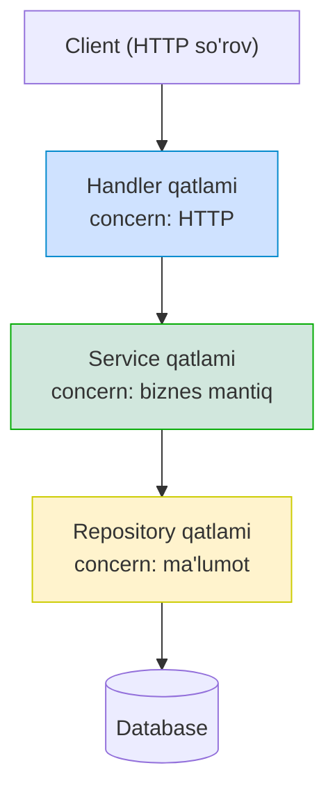
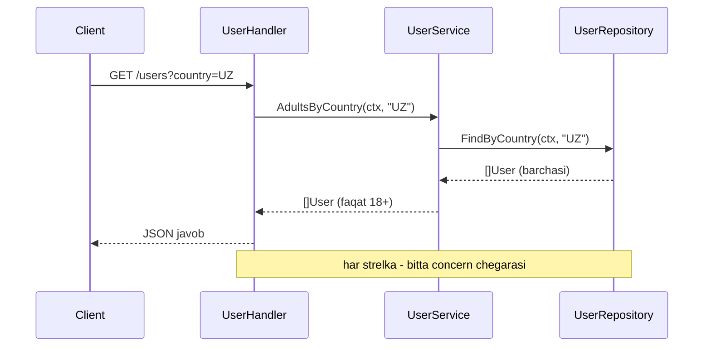
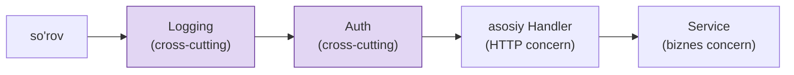

# Separation of Concerns (Vazifalarni ajratish)

> **Separation of Concerns (SoC)** — tizimni har biri alohida "concern" (aniq vazifa/jihat) uchun javobgar bo'lgan mustaqil qismlarga ajratish prinsipi.

---

## STEP 1 — Umumiy tushuncha

### Muammo nima edi?

Tasavvur qiling, siz REST API yozyapsiz. Foydalanuvchi ro'yxatini qaytaradigan HTTP handler shunday:

```go
func GetUsers(w http.ResponseWriter, r *http.Request) {
	// 1. HTTP: query parametrlarni o'qish
	minAge := r.URL.Query().Get("min_age")
	// 2. Validatsiya
	if minAge == "" { minAge = "0" }
	// 3. Ma'lumotlar bazasi: to'g'ridan-to'g'ri SQL
	rows, _ := db.Query("SELECT name, age FROM users WHERE age >= " + minAge)
	// 4. Biznes qoida: kattalarni belgilash
	// 5. JSON javob yasash
	// ... hammasi bitta funksiyada, 80 qator
}
```

Bu bitta funksiya **hamma narsani** qiladi: HTTP so'rovni o'qiydi, validatsiya qiladi, SQL yozadi,
biznes qoidalarini tekshiradi, JSON qaytaradi. Bu — **"aralashib ketgan concern'lar"**. Muammolar:

- **Bazani almashtirib bo'lmaydi.** PostgreSQL'dan boshqasiga o'tsangiz, HTTP handler'ni ochib SQL'ni
  o'zgartirasiz. HTTP mantig'i va DB mantig'i bir-biriga yopishib qolgan.
- **SQL injection xavfi.** `"... WHERE age >= " + minAge` — parametr to'g'ridan-to'g'ri so'rovga
  yopishtirilgan. Bu havfsizlik teshigi.
- **Biznes mantig'ini test qilib bo'lmaydi.** "Kattalar 18 yoshdan" qoidasini test qilmoqchisiz,
  lekin buning uchun HTTP server va real baza kerak.
- **Bir o'zgarish hamma joyga tegadi.** JSON formati o'zgarsa yoki SQL o'zgarsa — bir xil funksiyani
  ochasiz, va bir narsani tuzatib boshqasini buzib qo'yasiz.

### Yechim — concern'larni qatlamlarga ajratish

Har bir **concern**'ni alohida qatlamga (layer) ajratamiz. Klassik backend'da uchta asosiy qatlam:

| Qatlam | Concern (nima uchun javobgar) | Nimani bilmaydi |
|--------|-------------------------------|-----------------|
| **Handler (transport)** | HTTP: so'rovni o'qish, javob yozish | Biznes qoidalari, SQL |
| **Service (biznes mantiq)** | Qoidalar, hisob-kitob, oqim | HTTP, SQL sintaksisi |
| **Repository (ma'lumot)** | Ma'lumotni saqlash/olish (SQL) | HTTP, biznes qoidalari |

Har bir qatlam **faqat o'z ishini** qiladi va qo'shni qatlam bilan **interface** orqali gaplashadi.

### Analogiya — restoran

Restoranni tasavvur qiling:

- **Ofitsiant (handler)** — mijoz bilan gaplashadi, buyurtmani oladi, taomni olib keladi. U
  **oshpazlik qilmaydi** va **omborga kirmaydi**.
- **Oshpaz (service)** — taom tayyorlaydi, retseptni (biznes qoidasi) biladi. U **mijoz bilan
  gaplashmaydi** va **bozorga bormaydi**.
- **Ombor/oshxona javoni (repository)** — mahsulotlarni saqlaydi va beradi. U **retseptni bilmaydi**.

Agar ofitsiant o'zi ovqat pishira boshlasa va omborga kira boshlasa — bu bizning aralashgan
handler'imiz. Restoran ishlamay qoladi. Har kim o'z ishini qilgani uchun tizim ishlaydi.

> **Oltin qoida:** Har bir concern'ni shunday ajratki, bittasi o'zgarganda boshqasiga tegishga
> hojat qolmasin. "HTTP o'zgarsa — faqat handler, SQL o'zgarsa — faqat repository o'zgaradi."



---

## STEP 2 — Yomon va yaxshi misol

### YOMON misol — hamma concern bitta handler ichida

```go
package main

import (
	"database/sql"
	"encoding/json"
	"net/http"
)

var db *sql.DB

// YOMON: bitta funksiya HTTP + SQL + biznes mantiq + JSON — hammasini qiladi
func GetAdultUsersHandler(w http.ResponseWriter, r *http.Request) {
	// concern 1: HTTP parametrni o'qish
	country := r.URL.Query().Get("country")

	// concern 2: ma'lumot — SQL to'g'ridan-to'g'ri handler ichida (va injection xavfi!)
	rows, err := db.Query("SELECT name, age FROM users WHERE country = '" + country + "'")
	if err != nil {
		http.Error(w, "db error", 500)
		return
	}
	defer rows.Close()

	// concern 3: biznes mantiq — "kattalar 18+" qoidasi shu yerda aralashgan
	type User struct {
		Name string `json:"name"`
		Age  int    `json:"age"`
	}
	var adults []User
	for rows.Next() {
		var u User
		rows.Scan(&u.Name, &u.Age)
		if u.Age >= 18 { // biznes qoidasi handler ichida
			adults = append(adults, u)
		}
	}

	// concern 4: JSON javob yasash
	w.Header().Set("Content-Type", "application/json")
	json.NewEncoder(w).Encode(adults)
}
```

**Nega bu yomon:**

- To'rtta concern (HTTP, SQL, biznes qoida, JSON) **bitta funksiyada** aralashgan.
- `"... WHERE country = '" + country + "'"` — **SQL injection** ochiq turibdi.
- "Kattalar 18+" qoidasini test qilish uchun HTTP server + real baza kerak — ajratib bo'lmaydi.
- PostgreSQL'ni almashtirsangiz yoki JSON formatini o'zgartirsangiz — shu bitta funksiyani ochib,
  hamma narsani xavf ostiga qo'yasiz.

### YAXSHI misol — uch qatlam, har biri o'z concern'i bilan

Endi uchta qatlamga ajratamiz. Har qatlam interface orqali bog'lanadi.

**Qatlam 1 — Domain va Repository (ma'lumot concern'i):**

```go
package main

import (
	"context"
	"database/sql"
)

// Domain model — biznes tushunchasi
type User struct {
	Name string
	Age  int
}

// Repository interface — service faqat shu shartnomaga bog'lanadi
type UserRepository interface {
	FindByCountry(ctx context.Context, country string) ([]User, error)
}

// SQL implementatsiyasi — faqat ma'lumot concern'i, biznes qoidasi YO'Q
type SQLUserRepository struct{ db *sql.DB }

func (r SQLUserRepository) FindByCountry(ctx context.Context, country string) ([]User, error) {
	// parametrli so'rov -> SQL injection yo'q
	rows, err := r.db.QueryContext(ctx, "SELECT name, age FROM users WHERE country = $1", country)
	if err != nil {
		return nil, err
	}
	defer rows.Close()

	var users []User
	for rows.Next() {
		var u User
		if err := rows.Scan(&u.Name, &u.Age); err != nil {
			return nil, err
		}
		users = append(users, u)
	}
	return users, nil
}
```

**Qatlam 2 — Service (biznes mantiq concern'i):**

```go
// Service faqat biznes qoidasini biladi. HTTP ham, SQL ham bilmaydi.
type UserService struct {
	repo UserRepository // interface ga bog'lanadi, konkret SQL ga emas
}

const adultAge = 18

func (s UserService) AdultsByCountry(ctx context.Context, country string) ([]User, error) {
	all, err := s.repo.FindByCountry(ctx, country)
	if err != nil {
		return nil, err
	}
	// biznes qoidasi faqat shu yerda: "katta yosh = 18+"
	var adults []User
	for _, u := range all {
		if u.Age >= adultAge {
			adults = append(adults, u)
		}
	}
	return adults, nil
}
```

**Qatlam 3 — Handler (HTTP concern'i):**

```go
import (
	"encoding/json"
	"net/http"
)

// Handler faqat HTTP bilan ishlaydi: so'rovni o'qiydi, javob yozadi.
// SQL ham, biznes qoidasi ham bu yerda YO'Q.
type UserHandler struct {
	service UserService
}

func (h UserHandler) GetAdults(w http.ResponseWriter, r *http.Request) {
	country := r.URL.Query().Get("country") // HTTP: so'rovni o'qish

	users, err := h.service.AdultsByCountry(r.Context(), country) // service ga topshirish
	if err != nil {
		http.Error(w, "internal error", http.StatusInternalServerError)
		return
	}

	w.Header().Set("Content-Type", "application/json") // HTTP: javob yozish
	json.NewEncoder(w).Encode(users)
}
```

**Nega bu yaxshi:**

- Har bir qatlam **bitta concern**: handler faqat HTTP, service faqat biznes qoidasi, repository
  faqat SQL. Har biri alohida sabab bilan o'zgaradi.
- **Parametrli so'rov** (`$1`) SQL injection'ni yo'q qildi.
- Biznes qoidasini (`AdultsByCountry`) test qilish uchun HTTP ham, real baza ham kerak emas — faqat
  `UserRepository` interface'ini mock qilish kifoya.
- PostgreSQL o'rniga MongoDB qo'ymoqchimisiz? Faqat yangi `MongoUserRepository` yozasiz, service va
  handler'ga tegmaysiz.



### 🤔 O'ylab ko'r

YAXSHI misolda `UserService` `UserRepository` **interface**'iga bog'langan, `SQLUserRepository`
konkret tipiga emas. Agar biz service ichida to'g'ridan-to'g'ri `SQLUserRepository{}` yaratganimizda
nima yo'qolardi?

<details>
<summary>Javobni ko'rish</summary>

Ikki narsa yo'qolardi. Birinchidan, service endi konkret SQL implementatsiyasiga **bog'lanib**
qolardi — bazani almashtirish uchun service kodini o'zgartirish kerak bo'lardi (coupling oshadi).
Ikkinchidan, service'ni test qilib bo'lmasdi: har testda real SQL bazasi ishga tushishi kerak
bo'lardi. Interface orqali bog'lanish esa testda soxta (mock) repository berish imkonini beradi va
concern'lar chegarasini toza saqlaydi.
</details>

---

## STEP 3 — Chegaralar va trade-offlar

### 1. SoC ni haddan tashqari qo'llash — "qatlam portlashi"

Kichik CRUD loyihaga 5 ta qatlam (handler -> service -> usecase -> repository -> gateway -> mapper)
qo'shsangiz, oddiy "bir maydonni o'qish" uchun 6 ta faylni ochib, har birida bir xil ma'lumotni
qo'lda ko'chirib yurasiz (boilerplate). Bu **over-engineering**.

> **O'lchov:** Qatlam qo'shishning narxi bor (ko'proq kod, ko'proq fayl). Qatlamni faqat **haqiqiy
> concern chegarasi** bo'lganda qo'shing. Uch qatlam ko'pchilik backend uchun yetarli.

### 2. Anemik model xavfi

Agar biznes mantiqni to'liq service'ga chiqarib yuborsangiz, domen modeli (`User`) shunchaki
ma'lumot to'plamiga (anemic model) aylanadi — hech qanday xulq-atvorsiz. Ba'zi qoidalar (masalan
`user.CanVote()`) domen modelining o'zida turishi mantiqiyroq. SoC "hamma mantiqni service'ga ol"
degani emas.

### 3. Qatlamlar "sizib chiqmasin" (leaky abstraction)

Repository'dan `*sql.Rows` yoki `database/sql` tiplarini service'ga qaytarsangiz — DB concern'i
yuqori qatlamga **sizib chiqadi**. Repository domen modelini (`[]User`) qaytarishi kerak, SQL
detallarini emas. Aks holda ajratish faqat qog'ozda qoladi.

---

## STEP 4 — Boshqa prinsiplar bilan bog'liqlik

### SoC va SRP — farqi nima?

Bu ikkisi eng ko'p aralashtiriladigan juftlik. Farqi **ko'lam (scale)**da:

| | Separation of Concerns | Single Responsibility Principle |
|-|------------------------|--------------------------------|
| **Daraja** | Tizim / arxitektura darajasi | Class / struct / funksiya darajasi |
| **Nima ajratadi** | Katta concern'lar (HTTP, biznes, ma'lumot) | Bitta class'ning bitta "o'zgarish sababi" |
| **Misol** | Handler / Service / Repository qatlamlari | `EmailService` faqat email bilan shug'ullanadi |
| **Kim uchun** | Butun loyiha strukturasi | Bitta tip dizayni |

Boshqacha aytganda: **SoC** — bino qavatlarini ajratish (arxitektura), **SRP** — har bir xonaga
bitta vazifa berish (detal). SRP — SoC'ni kichik darajada amalga oshirishning bir usuli. Ikkisi
bir-biriga zid emas, bir-birini to'ldiradi.

### Cross-cutting concerns — middleware bilan ajratish

Ba'zi concern'lar **bitta qatlamga sig'maydi**, ular butun tizimni **ko'ndalang kesib o'tadi**
(cross-cutting concerns): logging, authentication, metrics, tracing, rate limiting. Bularni har
handler ichiga yozsangiz — kod takrorlanadi va concern'lar yana aralashadi.

Yechim — **middleware** (yoki decorator): asosiy mantiqni o'rab, cross-cutting concern'ni alohida
qatlamda bajarish.

```go
// Logging cross-cutting concern sifatida middleware da ajratilgan
func LoggingMiddleware(next http.Handler) http.Handler {
	return http.HandlerFunc(func(w http.ResponseWriter, r *http.Request) {
		start := time.Now()
		next.ServeHTTP(w, r)                 // asosiy handler ishlaydi
		log.Printf("%s %s -> %v", r.Method, r.URL.Path, time.Since(start))
	})
}

// Auth ham alohida cross-cutting concern
func AuthMiddleware(next http.Handler) http.Handler {
	return http.HandlerFunc(func(w http.ResponseWriter, r *http.Request) {
		if r.Header.Get("Authorization") == "" {
			http.Error(w, "unauthorized", http.StatusUnauthorized)
			return
		}
		next.ServeHTTP(w, r)
	})
}

// Zanjir: har concern alohida qatlamda
// handler = LoggingMiddleware(AuthMiddleware(userHandler))
```

Endi logging va auth **bir joyda** turadi va har bir handler'ga avtomatik qo'llanadi. Handler'lar
o'z concern'iga (HTTP mantig'i) e'tibor qaratadi, logging/auth esa yon qatlamda yashaydi.



### Boshqa bog'lanishlar

- **High Cohesion / Low Coupling bilan.** SoC concern'larni ajratganda, har qatlam ichi zich
  (yuqori cohesion), qatlamlar orasi bo'sh (past coupling) bo'ladi. SoC — cohesion/coupling'ni
  arxitektura darajasida qo'llash.
- **Dependency Inversion bilan.** Qatlamlar interface orqali bog'langani uchun (repository interface),
  yuqori qatlam pastki qatlamning detaliga bog'lanmaydi — bu DIP.
- **Law of Demeter bilan.** Har qatlam faqat qo'shni qatlam bilan gaplashadi (handler -> service ->
  repository), qatlam osha sakramaydi — bu LoD'ning arxitektura darajasidagi ko'rinishi.

---

## O'zingni tekshir

**1. HTTP handler ichiga to'g'ridan-to'g'ri SQL yozishning uchta zararini ayting.**

<details>
<summary>Javob</summary>

Birinchidan, HTTP va ma'lumot concern'lari aralashadi — bazani almashtirish uchun handler'ni
o'zgartirish kerak bo'ladi (yuqori coupling). Ikkinchidan, biznes mantiqni test qilish uchun HTTP
server va real baza kerak bo'ladi. Uchinchidan, ko'pincha parametr to'g'ridan-to'g'ri so'rovga
yopishtiriladi va SQL injection xavfi paydo bo'ladi.
</details>

**2. SoC va SRP orasidagi asosiy farq nima?**

<details>
<summary>Javob</summary>

Farqi ko'lamda (scale). SoC — tizim/arxitektura darajasida ishlaydi: u katta concern'larni (HTTP,
biznes mantiq, ma'lumot) qatlamlarga ajratadi. SRP esa class/struct darajasida ishlaydi: bir class
faqat bitta "o'zgarish sababi"ga ega bo'lsin deydi. SRP — SoC'ni kichik darajada amalga oshirishning
bir usuli; ikkisi bir-birini to'ldiradi.
</details>

**3. Cross-cutting concern nima va uni qanday ajratish kerak?**

<details>
<summary>Javob</summary>

Cross-cutting concern — bitta qatlamga sig'maydigan, butun tizimni ko'ndalang kesib o'tadigan
vazifa: logging, authentication, metrics, tracing, rate limiting. Ularni har handler ichiga
yozish kod takrorlanishiga olib keladi. To'g'ri yechim — middleware (yoki decorator) orqali ularni
asosiy mantiqni o'rab, alohida qatlamda bajarish.
</details>

**4. Repository'dan `*sql.Rows` qaytarish nega SoC buzilishi hisoblanadi?**

<details>
<summary>Javob</summary>

Chunki `*sql.Rows` — ma'lumot qatlamining (DB) ichki detali. Uni service'ga qaytarsangiz, DB
concern'i yuqori qatlamga "sizib chiqadi" (leaky abstraction) va service endi `database/sql`
paketiga bog'lanib qoladi. Repository domen modelini (`[]User`) qaytarishi kerak, SQL detallarini
emas — shundagina ajratish haqiqiy bo'ladi.
</details>

**5. Kichik CRUD loyihaga 6 ta qatlam qo'shish qanday muammo tug'diradi?**

<details>
<summary>Javob</summary>

Bu over-engineering ("qatlam portlashi"): oddiy amal uchun ham 6 ta faylni ochib, har birida bir
xil ma'lumotni qo'lda ko'chirish (boilerplate) kerak bo'ladi. Qatlam qo'shishning narxi bor, shuning
uchun qatlamni faqat haqiqiy concern chegarasi mavjud bo'lganda qo'shish kerak. Ko'p backend uchun
uch qatlam yetarli.
</details>
