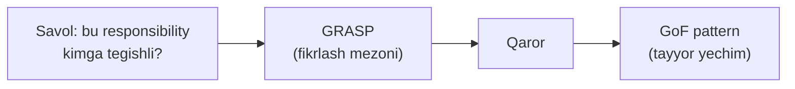
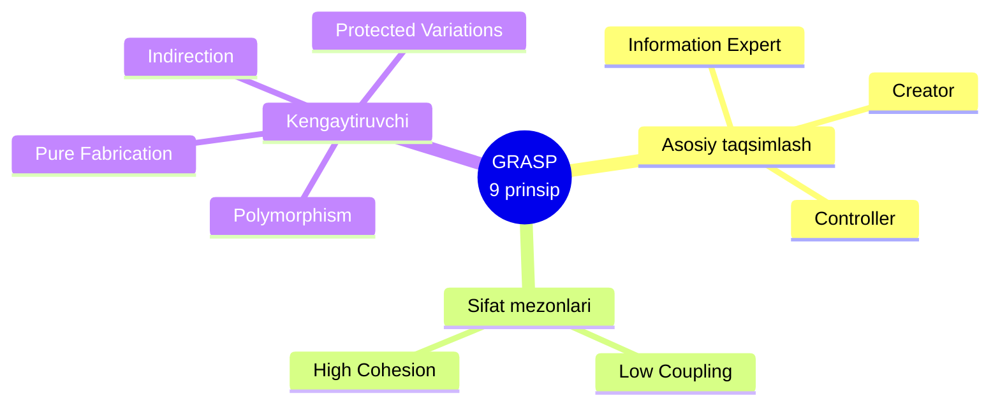
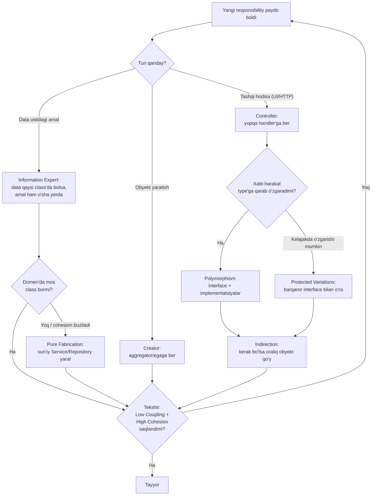

# GRASP — General Responsibility Assignment Software Patterns

> **GRASP** — bu "qaysi class yoki modulga qaysi responsibility (javobgarlik)ni beramiz?" degan savolga tizimli javob beradigan 9 ta fikrlash mezoni.

---

## STEP 1 — Umumiy tushuncha

### GRASP nima?

**GRASP** (General Responsibility Assignment Software Patterns) — bu tushunchani **Craig Larman** o'zining mashhur "Applying UML and Patterns" kitobida taklif qilgan.

GRASP javob beradigan bitta markaziy savol bor:

> **"Bu responsibility'ni QAYSI class/modulga beramiz?"**

Object-oriented dizaynda eng qiyin ish — kod yozish emas, balki **javobgarlikni to'g'ri taqsimlash**. Kim summani hisoblasin? Kim obyektni yaratsin? Kim tashqi so'rovni qabul qilsin? Kim saqlash bilan shug'ullansin? Har bir noto'g'ri qaror kelajakda **yuqori coupling** (bog'liqlik) va **past cohesion** (tarqoqlik) ko'rinishida qaytib keladi.

### GRASP — bu pattern EMAS

Bu juda muhim tushunchani darhol tuzatib olaylik:

- **GoF patternlari** (Factory, Observer, Strategy...) — bu **tayyor yechimlar**, "buni mana shunday qil" deydi.
- **GRASP** — bu **qaror qabul qilish mezonlari**, "buni mana shu mantiq bilan hal qil" deydi.

Ya'ni GRASP sizga tayyor kod bermaydi. U sizga **fikrlash usulini** beradi. GoF patternlari esa aksariyat hollarda aynan GRASP prinsiplarining natijasi bo'lib chiqadi. Masalan, **Polymorphism** GRASP prinsipini qo'llasangiz — tabiiy ravishda **Strategy** yoki **State** patterniga kelasiz.



### 9 ta prinsip — umumiy xarita

GRASP 9 ta prinsipdan iborat. Ularni 3 guruhga bo'lish qulay:



- **Asosiy taqsimlash** — "kim nima qiladi?" degan bevosita savolga javob (Expert, Creator, Controller).
- **Sifat mezonlari** — har bir qarorni tekshirib turadigan tarozi (Low Coupling, High Cohesion).
- **Kengaytiruvchi** — o'zgarishga chidamli dizayn uchun (Polymorphism, Pure Fabrication, Indirection, Protected Variations).

Endi har birini alohida ko'rib chiqamiz. Barcha misollar bitta domendan — **buyurtma (order), to'lov (payment), foydalanuvchi (user)** — olingan, shunda prinsiplar bir-biriga qanday ulanishini ko'rasiz.

---

## 1. Information Expert

### Ta'rif

Responsibility'ni **uni bajarish uchun kerakli ma'lumotga (information) ega bo'lgan** class'ga bering. Ma'lumot qayerda bo'lsa, o'sha ma'lumot ustidagi amal ham o'sha yerda bo'lsin.

### Javob beradigan savol

> "Bu vazifani bajarish uchun kerakli **data** qaysi class'da joylashgan?"

### Go misoli

Buyurtmaning umumiy summasini kim hisoblashi kerak? Summani hisoblash uchun **qatorlar (lines)** kerak. Qatorlar `Order` ichida. Demak, hisoblash `Order`ning vazifasi.

```go
package main

import "fmt"

// OrderLine — buyurtmadagi bitta qator (mahsulot, soni, narxi)
type OrderLine struct {
	Product  string
	Quantity int
	Price    float64
}

// Order — qatorlar haqidagi TO'LIQ ma'lumotga ega.
// Shuning uchun summani hisoblash aynan uning javobgarligi.
type Order struct {
	ID    string
	Lines []OrderLine
}

// Total — Order o'zi hisoblaydi, chunki Lines aynan unda.
func (o Order) Total() float64 {
	var sum float64
	for _, l := range o.Lines {
		sum += l.Price * float64(l.Quantity)
	}
	return sum
}

func main() {
	o := Order{ID: "A-1", Lines: []OrderLine{
		{"Non", 2, 3000},
		{"Sut", 1, 8000},
	}}
	fmt.Printf("Buyurtma %s summasi: %.0f som\n", o.ID, o.Total())
}
```

**Output:**
```
Buyurtma A-1 summasi: 14000 som
```

Agar summani hisoblashni tashqi bir `PriceCalculator` class'iga bersak — u `Order`ning ichki qatorlarini olishga majbur bo'lardi (getter'lar orqali), bu esa keraksiz bog'liqlik va **encapsulation** buzilishiga olib kelardi.

### GoF bog'lanishi

Information Expert to'g'ridan-to'g'ri bitta GoF patternga mos kelmaydi — u **poydevor** prinsip. Lekin **Composite** patternida (masalan, daraxt tuzilmasida har bir node o'z bola-node'lari haqidagi ma'lumotga ega bo'lib, `Total()`ni o'zi hisoblaydi) aynan shu prinsip ishlaydi.

---

## 2. Creator

### Ta'rif

`A` obyektini yaratish responsibility'sini `B` class'iga bering, agar quyidagilardan biri to'g'ri bo'lsa:
- `B` `A`ni **o'z ichida saqlaydi** (aggregates / contains),
- `B` `A`ni yaratish uchun kerakli **boshlang'ich ma'lumotga** ega,
- `B` `A`ni **yaqindan ishlatadi**.

### Javob beradigan savol

> "Bu obyektni **kim yaratishi** kerak?"

### Go misoli

`OrderLine`ni kim yaratsin? `Order` uni o'z ichida saqlaydi (aggregates), shuning uchun yangi qator yaratish `Order`ning ishi:

```go
// Order OrderLine'larni o'z ichida saqlaydi (aggregation),
// shuning uchun yangi qator yaratish javobgarligi unga beriladi.
func (o *Order) AddLine(product string, qty int, price float64) {
	// Order kerakli kontekstni biladi, qatorni o'zi quradi
	line := OrderLine{Product: product, Quantity: qty, Price: price}
	o.Lines = append(o.Lines, line)
}

func main() {
	o := &Order{ID: "A-2"}
	o.AddLine("Choy", 3, 5000) // client konkret struct nomini bilmaydi ham
	o.AddLine("Shakar", 1, 12000)
	fmt.Printf("Qatorlar soni: %d, summa: %.0f som\n", len(o.Lines), o.Total())
}
```

**Output:**
```
Qatorlar soni: 2, summa: 27000 som
```

Bu yerda `main` (client) `OrderLine`ni to'g'ridan-to'g'ri qurmadi. `Order` uni o'zi yaratdi. Bu **coupling**ni kamaytiradi: ertaga `OrderLine`ga yangi maydon qo'shilsa, faqat `AddLine` o'zgaradi.

### GoF bog'lanishi

Creator prinsipi murakkablashganda **Factory Method**, **Abstract Factory** va **Builder** patternlariga aylanadi. Yaratish mantig'i ancha murakkab bo'lganda (masalan, obyektni yaratishda validatsiya, tashqi resurslar kerak bo'lsa), oddiy `AddLine` o'rniga alohida factory class ajratiladi.

---

## 3. Controller

### Ta'rif

Tashqi tizim hodisasini (system event — UI tugmasi bosildi, HTTP so'rov keldi) **birinchi bo'lib qabul qiladigan** responsibility'ni domain obyektlaridan ajratilgan alohida class'ga bering. Bu class butun use-case ssenariysini boshqaradi.

### Javob beradigan savol

> "UI yoki HTTP'dan kelgan so'rovni **kim birinchi bo'lib** qabul qilib, domain'ga yo'naltiradi?"

### Go misoli

Controller — bu yupqa (thin) qatlam. U biznes mantig'ini **o'zi bajarmaydi**, balki uni domain obyektlariga topshiradi:

```go
// PlaceOrderController — "buyurtma ber" hodisasini qabul qiladi.
// U yupqa: faqat qabul qiladi, tekshiradi va domain'ga uzatadi.
type PlaceOrderController struct {
	repo OrderRepository
}

func (c *PlaceOrderController) Handle(id string, lines []OrderLine) error {
	// 1-qadam: domain obyektni yig'amiz
	order := Order{ID: id, Lines: lines}

	// 2-qadam: sodda tekshiruv (biznes qoidasi domain'da)
	if order.Total() <= 0 {
		return fmt.Errorf("bosh buyurtma saqlab bolmaydi")
	}

	// 3-qadam: haqiqiy ishni Repository'ga topshiramiz
	return c.repo.Save(order)
}
```

Bu yerda `Controller` **koordinator** rolini o'ynaydi: kim nima qilishini biladi, lekin o'zi hech qanday og'ir ishni bajarmaydi. Agar `Controller` ichiga summa hisoblash, email yuborish, saqlash — hammasini tiqib qo'ysak, u **God object**ga aylanadi va SRP buziladi.

### GoF bog'lanishi

Controller ko'pincha **Facade** patterni ko'rinishini oladi (murakkab quyi tizimga bitta oddiy kirish nuqtasi) va **Command** patterni bilan yaxshi ishlaydi (har bir use-case alohida command obyekti sifatida).

---

## 4. Low Coupling

### Ta'rif

Class'lar orasidagi **bog'liqlik (coupling)ni minimallashtiring**. Bir class ikkinchisining ichki tuzilishiga qancha kam bog'liq bo'lsa, tizim shuncha moslashuvchan bo'ladi.

### Javob beradigan savol

> "Bu qarorim class'lar orasidagi bog'liqlikni **oshiradimi yoki kamaytiradimi**?"

### Qisqacha (chuqurroq alohida faylda)

> Bu mavzu [`5. High Cohesion - Low Coupling.md`](5.%20High%20Cohesion%20-%20Low%20Coupling.md) faylida to'liq yoritilgan. Bu yerda faqat GRASP kontekstidagi mohiyatini eslatib o'tamiz.

Asosiy g'oya: konkret class'ga emas, **interface**ga bog'laning.

```go
// YOMON: Controller konkret PostgresOrderRepository'ga bog'langan
type BadController struct {
	repo PostgresOrderRepository // konkret tur -> yuqori coupling
}

// YAXSHI: Controller faqat interface'ga bog'langan
type OrderRepository interface {
	Save(o Order) error
}

type GoodController struct {
	repo OrderRepository // abstraksiya -> past coupling
}
```

`GoodController` `Postgres`, `Mongo` yoki test uchun `Mock` repository bilan ham ishlaydi — chunki u **nima**ga bog'liqligini emas, **qanday shartnoma (contract)**ga bog'liqligini biladi.

### GoF bog'lanishi

Low Coupling deyarli barcha patternlarning maqsadi. Ayniqsa: **Observer** (nashr etuvchi obyektlarni tinglovchilardan ajratadi), **Mediator** (obyektlar bir-birini bilmasdan muloqot qiladi), **Dependency Injection** (bog'liqlik tashqaridan uzatiladi).

---

## 5. High Cohesion

### Ta'rif

Bitta class ichidagi responsibility'lar **bir-biri bilan mantiqan bog'liq** va **bitta aniq maqsadga** yo'naltirilgan bo'lsin. Tarqoq, bir-biriga aloqasiz vazifalarni bitta class'ga tiqmang.

### Javob beradigan savol

> "Bu class ichidagi metodlar **bitta yaxlit maqsad** uchun ishlaydimi yoki turli-tuman ishlarni bajaradimi?"

### Qisqacha (chuqurroq alohida faylda)

> Bu mavzu ham [`5. High Cohesion - Low Coupling.md`](5.%20High%20Cohesion%20-%20Low%20Coupling.md) faylida batafsil. Bu yerda GRASP nuqtai nazaridan qisqa.

```go
// PAST cohesion: bitta struct order, email, log — hammasini qiladi
type MessyService struct{}

func (MessyService) CalculateTotal(o Order) float64 { return o.Total() }
func (MessyService) SendEmail(to string)            {}
func (MessyService) WriteLog(msg string)            {}
// ^ bu uchtasining bir-biriga aloqasi yo'q -> past cohesion

// YUQORI cohesion: har bir struct bitta yaxlit maqsad uchun
type PricingService struct{}   // faqat narx-hisob
type NotificationService struct{} // faqat xabar
type Logger struct{}           // faqat log
```

High Cohesion va Low Coupling **birga yuradi**: cohesion'ni oshirsangiz, ko'pincha coupling'ni ham kamaytirasiz. Ular GRASP'ning "tarozi"si — qolgan barcha qarorni shu ikkisi bilan tekshirasiz.

### GoF bog'lanishi

High Cohesion — SRP ning GRASP'dagi ko'rinishi. Deyarli barcha "bitta ish qiladigan" patternlar (Strategy, Command, kichik Service class'lar) shu prinsipga tayanadi.

---

## 6. Polymorphism

### Ta'rif

Xatti-harakat **type'ga qarab o'zgarganda**, uni `if`/`switch` bilan tekshirish o'rniga **polymorphic operatsiya** (interface va uning turli implementatsiyalari) orqali hal qiling.

### Javob beradigan savol

> "Bu xatti-harakat **turli type'lar uchun turlicha** bo'lsa, uni qanday tashkil qilaman — shart operatorlari bilanmi yoki interface bilanmi?"

### Go misoli

To'lov usuli har xil (karta, naqd, click...). Har safar yangi usul qo'shilganda `switch`ni tahrirlash — Open/Closed prinsipini buzadi. Interface bu muammoni yechadi:

```go
// PaymentMethod — barcha to'lov usullari uchun umumiy shartnoma
type PaymentMethod interface {
	Pay(amount float64) string
}

type CardPayment struct{}

func (CardPayment) Pay(a float64) string {
	return fmt.Sprintf("Karta orqali %.0f som tolandi", a)
}

type CashPayment struct{}

func (CashPayment) Pay(a float64) string {
	return fmt.Sprintf("Naqd %.0f som tolandi", a)
}

// Checkout hech qanday if/switch ishlatmaydi — polymorphism ishlaydi
func Checkout(m PaymentMethod, amount float64) {
	fmt.Println(m.Pay(amount))
}

func main() {
	Checkout(CardPayment{}, 50000)
	Checkout(CashPayment{}, 30000)
}
```

**Output:**
```
Karta orqali 50000 som tolandi
Naqd 30000 som tolandi
```

Ertaga `ClickPayment` qo'shilsa — faqat yangi struct yoziladi, `Checkout` funksiyasiga **teginilmaydi**.

### GoF bog'lanishi

Bu prinsip to'g'ridan-to'g'ri **Strategy**, **State**, **Template Method** va **Command** patternlariga olib boradi. `switch` isini interface bilan almashtirish — GoF patternlarining eng ko'p uchraydigan sababi.

---

## 7. Pure Fabrication

### Ta'rif

Agar responsibility uchun domen'da (real biznes dunyosida) **mos tushuncha topilmasa**, sun'iy (fabricated) class yarating. Bu class real narsani ifodalamaydi, lekin High Cohesion va Low Coupling'ni saqlaydi.

### Javob beradigan savol

> "Bu responsibility'ni biror domain class'iga bersam cohesion buziladi — uni **qayerga qo'yaman**?"

### Go misoli

`Order`ni ma'lumotlar bazasiga saqlash kerak. Buni `Order`ning o'ziga bersak, u domain mantig'i bilan SQL/DB mantig'ini aralashtiradi — cohesion buziladi. Domen'da esa "Repository" degan tushuncha yo'q. Shuning uchun **sun'iy** class yaratamiz:

```go
// OrderRepository — domen'da bunday "narsa" yo'q, bu SUN'IY class.
// Uni yaratdik: saqlash mantig'ini Order'dan ajratib olish uchun.
type OrderRepository interface {
	Save(o Order) error
}

type PostgresOrderRepository struct {
	// db *sql.DB
}

func (r PostgresOrderRepository) Save(o Order) error {
	// faqat saqlash mantig'i shu yerda -> yuqori cohesion
	fmt.Printf("[PG] buyurtma %s saqlandi (%.0f som)\n", o.ID, o.Total())
	return nil
}
```

**Output** (ishlatilganda):
```
[PG] buyurtma A-1 saqlandi (14000 som)
```

`Order` toza qoldi — u faqat biznes mantig'i bilan shug'ullanadi. Saqlash esa sun'iy `Repository`da. Barcha `Service`, `Repository`, `Factory`, `Mapper` class'lari — bular Pure Fabrication misollaridir.

### GoF bog'lanishi

Pure Fabrication **Adapter** (tashqi tizimni domenga moslashtiruvchi sun'iy qatlam) va aksariyat **Service** class'larida ko'rinadi. DDD'dagi Repository va Service patternlari — sof Pure Fabrication.

---

## 8. Indirection

### Ta'rif

Ikki komponentni **to'g'ridan-to'g'ri** bog'lamaslik uchun ular orasiga **oraliq (intermediate) obyekt** qo'ying. Shunda ular bir-birini bevosita bilmaydi va mustaqil o'zgara oladi.

### Javob beradigan savol

> "Ikki komponentni bir-biriga to'g'ridan-to'g'ri **bog'lamaslik** uchun orasiga nima qo'yaman?"

### Go misoli

`Controller` `Order`ni saqlashi va foydalanuvchiga xabar berishi kerak. Bularni `Controller` ichida to'g'ridan-to'g'ri chaqirsa — u DB va email tafsilotlariga bog'lanib qoladi. Orasiga **oraliq** `OrderService` qo'yamiz:

```go
// OrderService — Controller bilan Repository/Notifier orasidagi
// ORALIQ (indirection) obyekt. Controller endi tafsilotlarni bilmaydi.
type OrderService struct {
	repo     OrderRepository
	notifier Notifier
}

func (s OrderService) Place(o Order) error {
	// 1-qadam: saqlash (tafsilotni Repository biladi)
	if err := s.repo.Save(o); err != nil {
		return err
	}
	// 2-qadam: xabar berish (tafsilotni Notifier biladi)
	return s.notifier.Notify(o.ID, "Buyurtmangiz qabul qilindi")
}
```

Endi `Controller` faqat `OrderService`ni chaqiradi. Saqlash va xabar berish qanday amalga oshishini bilmaydi — bu **oraliq** obyektning ishi. Har bir tomon mustaqil o'zgaradi.

### GoF bog'lanishi

Indirection — **Adapter**, **Facade**, **Mediator** va **Proxy** patternlarining o'zagi. Bularning barchasi ikki tomon orasiga oraliq qatlam qo'yish g'oyasiga asoslangan.

---

## 9. Protected Variations

### Ta'rif

O'zgarishi **bashorat qilinadigan** (predicted) nuqtalarni aniqlang va ularni **barqaror interface** bilan o'rab qo'ying. Shunda o'zgarish sodir bo'lganda, uning ta'siri interface ichida qamalib qoladi va tizimning qolgan qismiga tarqalmaydi.

### Javob beradigan savol

> "Kelajakda **o'zgarishi kutilayotgan** qismni qanday qilib qolgan koddan himoya qilaman?"

### Go misoli

Xabar yuborish kanali — bugun email, ertaga SMS, indinga push. Bu **o'zgaruvchan nuqta**. Uni barqaror `Notifier` interface bilan "o'rab" qo'yamiz:

```go
// Notifier — o'zgaruvchan nuqta atrofidagi BARQAROR interface.
// Yangi kanal qo'shilsa ham, bu shartnoma o'zgarmaydi.
type Notifier interface {
	Notify(userID, message string) error
}

type EmailNotifier struct{}

func (EmailNotifier) Notify(u, m string) error {
	fmt.Printf("[EMAIL] %s -> %s\n", u, m)
	return nil
}

type SMSNotifier struct{}

func (SMSNotifier) Notify(u, m string) error {
	fmt.Printf("[SMS] %s -> %s\n", u, m)
	return nil
}

func main() {
	var n Notifier = EmailNotifier{}
	n.Notify("user-7", "Xush kelibsiz")

	n = SMSNotifier{} // implementatsiya almashdi, mijoz kod o'zgarmadi
	n.Notify("user-7", "Kod: 4821")
}
```

**Output:**
```
[EMAIL] user-7 -> Xush kelibsiz
[SMS] user-7 -> Kod: 4821
```

Protected Variations — GRASP'ning eng **yuqori darajadagi** prinsipi. U Polymorphism va Indirection'ni o'z ichiga oladi: ikkovi ham aslida "o'zgaruvchan nuqtani interface bilan himoya qilish"ning bir ko'rinishi.

### GoF bog'lanishi

Bu prinsip **barcha** GoF patternlarining umumiy falsafasi. "O'zgaradigan narsani inkapsulyatsiya qil" (encapsulate what varies) — GoF kitobining bosh qoidasi aynan shu. Strategy, Adapter, Bridge, Observer — hammasi Protected Variations ko'rinishlari.

---

## Responsibility berish — qaror daraxti

Amalda GRASP prinsiplari qanday tartibda ishlashini quyidagi qaror daraxti ko'rsatadi:



E'tibor bering: **Low Coupling** va **High Cohesion** oxirida turadi — ular har qanday qarorni tekshiradigan yakuniy tarozi.

---

## GRASP va SOLID solishtiruv

GRASP va SOLID — bir-biriga qarshi emas, balki **bir xil g'oyalarni turli darajada** ifodalaydi. GRASP ko'proq "javobgarlikni kimga berish" haqida, SOLID esa "class'lar orasidagi munosabat qanday bo'lishi" haqida.

| GRASP prinsipi | Mos SOLID prinsipi | Umumiy g'oya |
|---|---|---|
| **Information Expert** | SRP | Ma'lumot va u ustidagi amal bitta joyda — cohesion saqlanadi |
| **High Cohesion** | SRP | Bitta class — bitta yaxlit maqsad, bitta o'zgarish sababi |
| **Controller** | SRP | Har bir use-case uchun yupqa, alohida handler |
| **Low Coupling** | DIP, ISP | Konkret turga emas, kichik abstraksiyaga bog'lan |
| **Polymorphism** | OCP, LSP | `switch` o'rniga interface; yangi type qo'shilsa kod o'zgarmaydi |
| **Protected Variations** | OCP + DIP | O'zgaruvchan nuqtani barqaror interface bilan yop |
| **Indirection** | DIP | Oraliq abstraksiya orqali to'g'ridan-to'g'ri bog'lanishni uzish |
| **Pure Fabrication** | SRP + DIP | Sun'iy Service/Repository class'lari |
| **Creator** | (to'g'ridan mos kelmaydi) | Factory patternlar orqali DIP'ga xizmat qiladi |

**Xulosa qilib aytganda:** SOLID'ning **SRP** = GRASP'ning High Cohesion + Information Expert; SOLID'ning **OCP/DIP** = GRASP'ning Protected Variations + Polymorphism + Indirection. Ular bir tanganing ikki tomoni.

---

## Umumiy xulosa

- **GRASP** — javobgarlikni taqsimlash bo'yicha 9 ta fikrlash mezoni (Craig Larman).
- Bu **pattern emas**, balki qaror qabul qilish **mantiqi**. GoF patternlari ko'pincha uning natijasi.
- **Information Expert, Creator, Controller** — "kim nima qiladi?" degan bevosita savollarga javob.
- **Low Coupling, High Cohesion** — har bir qarorni tekshiradigan tarozi.
- **Polymorphism, Pure Fabrication, Indirection, Protected Variations** — o'zgarishga chidamli dizayn uchun.
- Amaliyotda: avval Expert/Creator/Controller bilan responsibility'ni bering, keyin Coupling/Cohesion bilan tekshiring, so'ng kerak bo'lsa kengaytiruvchi prinsiplar bilan mustahkamlang.

---

## O'zingni tekshir

**1. GRASP pattern deb ataladimi? Nega?**

<details><summary>Javob</summary>

Yo'q. GRASP — bu **pattern emas**, balki responsibility'ni qaysi class'ga berishni hal qilishda ishlatiladigan **fikrlash mezonlari** to'plami. GoF patternlari tayyor yechim beradi ("buni shunday qurish"), GRASP esa qaror mantig'ini beradi ("buni shu mezon bilan hal qil"). Aksariyat GoF patternlari aslida GRASP prinsiplarining natijasidir.

</details>

**2. `Order`ning umumiy summasini nega tashqi `Calculator` emas, `Order`ning o'zi hisoblashi kerak? Qaysi prinsip?**

<details><summary>Javob</summary>

**Information Expert** prinsipi. Summani hisoblash uchun kerakli ma'lumot (`Lines`) `Order`ning ichida. Ma'lumot qayerda bo'lsa, u ustidagi amal ham o'sha yerda bo'lishi kerak. Tashqi `Calculator` bo'lsa, u `Order`ning ichki qatorlariga getter'lar orqali kirishga majbur bo'lardi — bu encapsulation'ni buzadi va coupling'ni oshiradi.

</details>

**3. `OrderRepository` qaysi GRASP prinsipiga misol, va nega u "sun'iy" deyiladi?**

<details><summary>Javob</summary>

**Pure Fabrication**. "Repository" real biznes domenida mavjud tushuncha emas (foydalanuvchi "repository" haqida gapirmaydi), lekin uni sun'iy ravishda yaratamiz — saqlash mantig'ini `Order` domen obyektidan ajratib olish uchun. Bu High Cohesion (`Order` faqat biznes mantig'i bilan qoladi) va Low Coupling'ni saqlaydi.

</details>

**4. Polymorphism va Protected Variations orasidagi farq nima?**

<details><summary>Javob</summary>

**Polymorphism** — aniq, hozir mavjud bo'lgan type'lararo farqni interface bilan hal qiladi (karta, naqd to'lov). **Protected Variations** esa undan kengroq: u **kelajakda o'zgarishi bashorat qilinadigan** nuqtani oldindan barqaror interface bilan o'rab qo'yishni nazarda tutadi. Polymorphism — Protected Variations'ga erishishning bir vositasi. Protected Variations Indirection'ni ham o'z ichiga oladi.

</details>

**5. GRASP'ning qaysi ikki prinsipi "yakuniy tarozi" vazifasini bajaradi va nega?**

<details><summary>Javob</summary>

**Low Coupling** va **High Cohesion**. Har qanday responsibility taqsimlash qarorini qabul qilgandan so'ng, uni shu ikki mezon bilan tekshirasiz: "bu qaror bog'liqlikni oshirdimi?" va "bu class hali ham bitta yaxlit maqsadga xizmat qiladimi?". Agar javob yomon bo'lsa — qarorni qayta ko'rib chiqasiz. Shuning uchun ular qaror daraxtining oxirida turadi.

</details>

---
