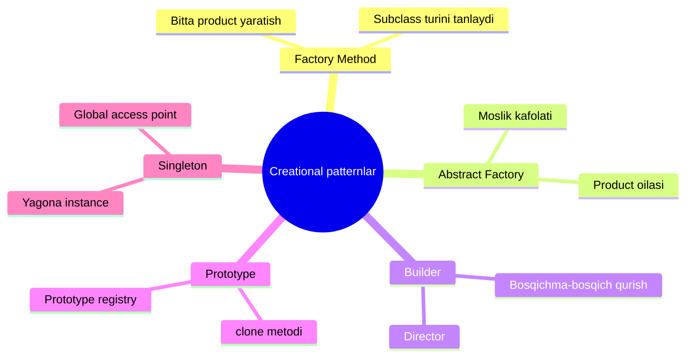
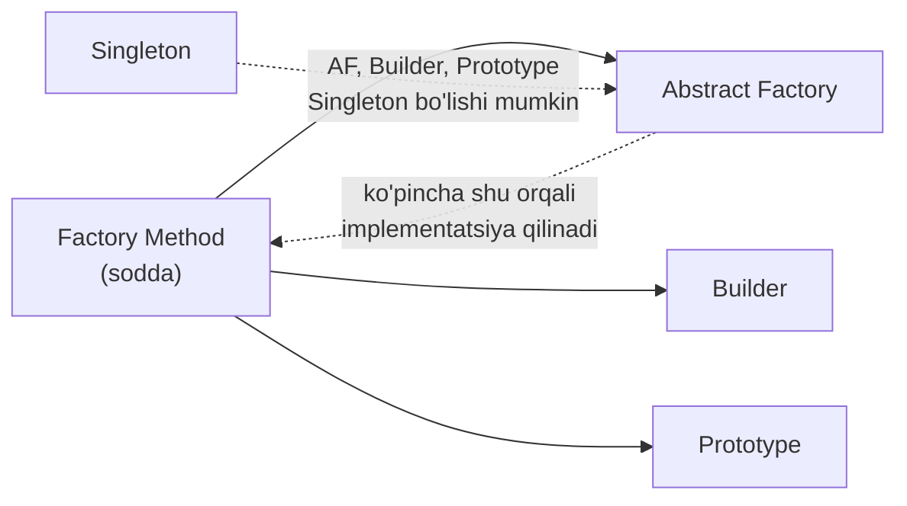

# Creational (Yaratuvchi) Patternlar

**Creational patternlar** — yangi obyektlarni yoki hatto butun obyektlar oilalarini **qulay va xavfsiz yaratish** uchun javob beradigan design patternlar guruhi.

## Nega alohida patternlar kerak?

Kichik dasturda obyektni to'g'ridan-to'g'ri yaratish (`new`, Go'da `&Struct{}`) yetarli. Lekin dastur o'sgan sari:

- obyekt yaratish kodi **butun dasturga tarqalib** ketadi;
- client kod **konkret class'larga bog'lanib** qoladi;
- yangi tur qo'shish uchun **o'nlab joyni o'zgartirish** kerak bo'ladi;
- murakkab obyektlarni yaratish kodi **ulkan constructor'larga** aylanadi.

Creational patternlar aynan shu muammolarni hal qiladi.

## 5 ta pattern

| # | Pattern | Bir jumlada |
|---|---------|-------------|
| 1 | [Factory Method](1.%20Factory%20Method.md) | Superclass'da obyekt yaratish uchun umumiy interface belgilaydi, subclass'lar esa yaratiladigan obyekt turini o'zgartira oladi |
| 2 | [Abstract Factory](2.%20Abstract%20Factory.md) | Bog'liq obyektlar **oilasini** ularning konkret class'lariga bog'lanmasdan yaratadi |
| 3 | [Builder](3.%20Builder.md) | Murakkab obyektlarni **bosqichma-bosqich** yaratadi; bitta qurilish kodi bilan turli ko'rinishdagi obyektlar olinadi |
| 4 | [Prototype](4.%20Prototype.md) | Obyektlarni implementatsiya tafsilotlariga kirmasdan **nusxalash** (clone) imkonini beradi |
| 5 | [Singleton](5.%20Singleton.md) | Class'dan **faqat bitta instance** mavjudligini kafolatlaydi va unga global kirish nuqtasini beradi |

## Patternlar orasidagi evolyutsiya

Ko'p arxitekturalar **Factory Method**'dan boshlanadi (eng sodda, subclass orqali kengayadi) va keyinchalik **Abstract Factory**, **Prototype** yoki **Builder** tomon rivojlanadi (moslashuvchanroq, lekin murakkabroq).

## O'qish tartibi

1 → 2 → 3 → 4 → 5 tartibida o'qish tavsiya qilinadi: Factory Method boshqa factory-patternlarning asosi, Singleton esa qolgan uchtasi bilan birga ishlatilishi mumkin.
