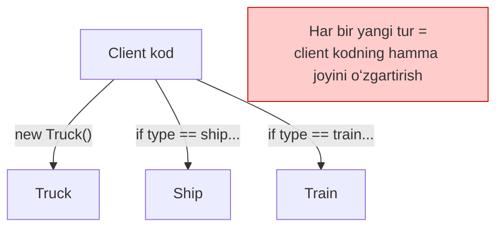
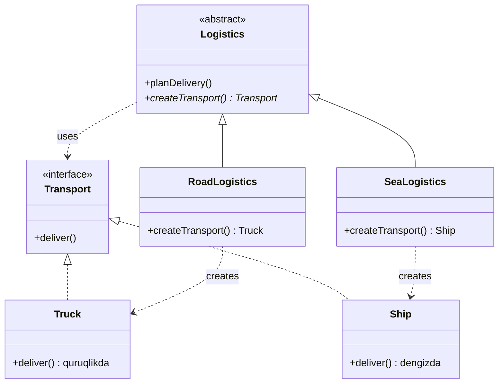
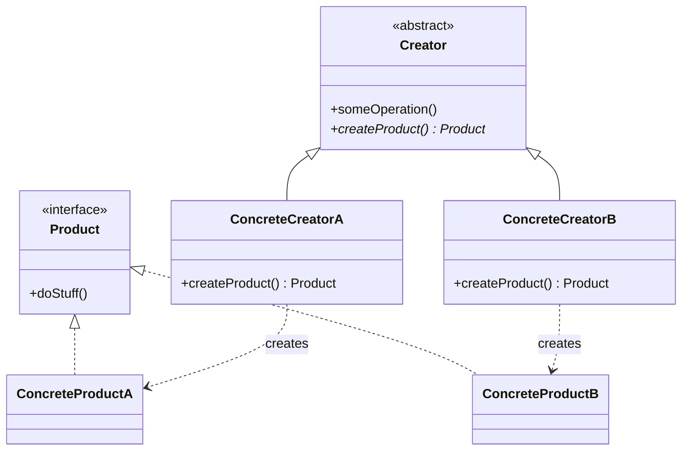

# Factory Method Pattern

> Boshqa nomlari: **Virtual Constructor**, **Фабричный метод**

**Factory Method** — creational (yaratuvchi) pattern. U superclass'da obyekt yaratish uchun umumiy interface belgilaydi va subclass'larga aynan qaysi turdagi obyekt yaratilishini o'zgartirish imkonini beradi.

---

## STEP 1 — Umumiy tushuncha

### Muammo nima edi?

Tasavvur qiling: siz yuk tashish (logistics) boshqaruvi dasturini yozyapsiz. Dastlab yuklar faqat **avtomobilda** tashiladi, shuning uchun butun kodingiz `Truck` (yuk mashinasi) class'i bilan ishlaydi.

Bir kuni dasturingiz mashhur bo'lib ketadi va dengiz tashuvchilari **dengiz logistikasi**ni ham qo'shishni so'rashadi. Zo'r yangilik! Lekin kod-chi?

Kodning katta qismi `Truck` class'iga **qattiq bog'lanib** qolgan. `Ship` (kema) class'ini qo'shish uchun butun dasturni "ag'darib" chiqish kerak. Keyinchalik uchinchi transport turi qo'shilsa — bu mashaqqat yana takrorlanadi.

### Pattern ishlatilmasa qanday muammolar bo'ladi?

| Muammo | Oqibat |
|--------|--------|
| Client kod konkret class'ga bog'langan (`new Truck()`) | Yangi tur qo'shish = butun kodni o'zgartirish |
| Har joyda `if/else` yoki `switch` bilan tur tanlash | Shartli operatorlarga to'lib ketgan, o'qib bo'lmas kod |
| Yaratish logikasi dasturga tarqalib ketgan | Bitta o'zgarish o'nlab faylga tegadi |
| Open/Closed printsipi buziladi | Kengaytirish o'rniga mavjud kod o'zgartiriladi |
| Test yozish qiyin | Konkret class'ni mock bilan almashtirib bo'lmaydi |



### Yechim nima?

Factory Method pattern'i obyektlarni to'g'ridan-to'g'ri (`new` operatori bilan) emas, maxsus **factory method**'ni chaqirish orqali yaratishni taklif qiladi. Obyektlar baribir `new` orqali yaratiladi, lekin buni factory method bajaradi.

Birinchi qarashda ma'nosiz tuyuladi: biz shunchaki constructor chaqiruvini bir joydan boshqa joyga ko'chirdik. Lekin endi **subclass'da factory method'ni override qilib**, yaratiladigan product turini o'zgartirish mumkin.

Buning ishlashi uchun bitta shart bor: barcha qaytariladigan obyektlar **umumiy interface**'ga ega bo'lishi kerak.

- `Truck` va `Ship` class'lari `Transport` interface'ini implementatsiya qiladi (`deliver` metodi bilan);
- `Truck` yukni quruqlikda, `Ship` dengizda yetkazadi;
- `RoadLogistics` class'idagi factory method `Truck` qaytaradi, `SeaLogistics` esa `Ship`.

Client uchun bu obyektlar orasida farq yo'q — u ularni abstrakt `Transport` sifatida ko'radi. Client uchun obyektda `deliver` metodi bo'lishi muhim, u qanday ishlashi esa muhim emas.



### Asosiy qoida

> **Obyektni to'g'ridan-to'g'ri yaratma — yaratishni alohida factory method'ga topshir. Client kod faqat umumiy interface bilan ishlasin, konkret class'ni subclass tanlasin.**

### Struktura



1. **Product** — creator va uning subclass'lari ishlab chiqaradigan obyektlarning umumiy interface'i.
2. **Concrete Product** — turli product'larning konkret kodi. Implementatsiyalari har xil, lekin interface'i umumiy.
3. **Creator** — factory method'ni e'lon qiladi; metod natijasi Product interface turi bilan mos kelishi shart. Ko'pincha metod abstract qilinadi (har bir subclass o'zicha implementatsiya qilishga majbur bo'lsin deb), lekin standart (default) product qaytarishi ham mumkin.

   > Muhim: nomiga qaramay, **product yaratish Creator'ning yagona vazifasi emas**. Odatda unda product bilan ishlaydigan asosiy biznes-logika ham bo'ladi. Analogiya: katta IT kompaniyada dasturchilar tayyorlash markazi bo'lishi mumkin, lekin kompaniyaning asosiy ishi — dasturchi "yaratish" emas, dasturiy mahsulot chiqarish.

4. **Concrete Creator** — factory method'ni o'zicha implementatsiya qilib, u yoki bu konkret product'ni ishlab chiqaradi.

   > Factory method har doim **yangi** obyekt yaratishi shart emas — uni mavjud obyektlarni cache yoki pool'dan qaytaradigan qilib ham yozish mumkin.

---

## STEP 2 — Python misoli

### ❌ Yomon misol (pattern'siz)

Client kod product turini o'zi tanlaydi va konkret class'larga bog'lanib qoladi:

```python
class ConcreteProduct1:
    def operation(self) -> str:
        return "{Result of the ConcreteProduct1}"


class ConcreteProduct2:
    def operation(self) -> str:
        return "{Result of the ConcreteProduct2}"


def some_operation(product_type: str) -> str:
    # ❌ Biznes-logika ichida tur tanlash — har joyda takrorlanadi
    if product_type == "product1":
        product = ConcreteProduct1()
    elif product_type == "product2":
        product = ConcreteProduct2()
    else:
        raise ValueError("Noma'lum tur")

    return f"Ishladik: {product.operation()}"


def another_operation(product_type: str) -> str:
    # ❌ Xuddi shu if/elif YANA takrorlandi!
    if product_type == "product1":
        product = ConcreteProduct1()
    elif product_type == "product2":
        product = ConcreteProduct2()
    ...
```

**Nima yomon?**
- `ConcreteProduct3` qo'shilsa — **hamma** `if/elif` bloklarini topib o'zgartirish kerak;
- yaratish logikasi biznes-logika bilan aralashib ketgan (Single Responsibility buzilgan);
- client konkret class'larni bilishi shart.

### ✅ Factory Method bilan

`t/Python/src/FactoryMethod/Conceptual` misoli (izohlar o'zbekchada):

```python
from __future__ import annotations
from abc import ABC, abstractmethod


class Creator(ABC):
    """
    Creator class'i factory method'ni e'lon qiladi — u Product obyektini
    qaytarishi kerak. Implementatsiyani odatda subclass'lar beradi.
    """

    @abstractmethod
    def factory_method(self):
        # Creator factory method'ning default implementatsiyasini
        # ham berishi mumkin edi.
        pass

    def some_operation(self) -> str:
        # Diqqat: Creator'ning asosiy vazifasi product yaratish EMAS.
        # Unda factory method qaytargan Product bilan ishlaydigan
        # biznes-logika bor. Subclass factory method'ni override qilib,
        # boshqa product qaytarsa — shu biznes-logika bilvosita o'zgaradi.

        # Factory method orqali product obyektini olamiz.
        product = self.factory_method()

        # Endi product bilan ishlaymiz.
        result = f"Creator: The same creator's code has just worked with {product.operation()}"

        return result


# Concrete Creator'lar factory method'ni override qilib,
# natijaviy product turini o'zgartiradi.

class ConcreteCreator1(Creator):
    # E'tibor bering: metod signaturasi abstrakt Product turini ishlatadi,
    # garchi undan konkret product qaytsa ham. Shu tufayli Creator
    # konkret product class'laridan mustaqil bo'lib qoladi.
    def factory_method(self) -> Product:
        return ConcreteProduct1()


class ConcreteCreator2(Creator):
    def factory_method(self) -> Product:
        return ConcreteProduct2()


class Product(ABC):
    """Barcha konkret product'lar bajarishi kerak bo'lgan operatsiyalar."""

    @abstractmethod
    def operation(self) -> str:
        pass


# Concrete Product'lar — Product interface'ining turli implementatsiyalari.

class ConcreteProduct1(Product):
    def operation(self) -> str:
        return "{Result of the ConcreteProduct1}"


class ConcreteProduct2(Product):
    def operation(self) -> str:
        return "{Result of the ConcreteProduct2}"


def client_code(creator: Creator) -> None:
    # Client kod konkret creator bilan uning BAZAVIY interface'i orqali
    # ishlaydi. Shu shart bajarilsa, unga istalgan creator subclass'ini
    # berish mumkin.
    print(f"Client: I'm not aware of the creator's class, but it still works.\n"
          f"{creator.some_operation()}", end="")


if __name__ == "__main__":
    print("App: Launched with the ConcreteCreator1.")
    client_code(ConcreteCreator1())
    print("\n")

    print("App: Launched with the ConcreteCreator2.")
    client_code(ConcreteCreator2())
```

**Output:**

```
App: Launched with the ConcreteCreator1.
Client: I'm not aware of the creator's class, but it still works.
Creator: The same creator's code has just worked with {Result of the ConcreteProduct1}

App: Launched with the ConcreteCreator2.
Client: I'm not aware of the creator's class, but it still works.
Creator: The same creator's code has just worked with {Result of the ConcreteProduct2}
```

**Nima yaxshilandi?** Yangi product qo'shish = yangi `ConcreteProduct3` + `ConcreteCreator3` yozish. **Mavjud kod umuman o'zgarmaydi** (Open/Closed printsipi).

---

## STEP 3 — Go misoli

> ⚠️ **Go xususiyati:** Go'da class va inheritance (meros) yo'q, shuning uchun "klassik" Factory Method'ni (subclass'da metodni override qilish) to'g'ridan-to'g'ri qurib bo'lmaydi. Go'da uning soddalashtirilgan varianti — **Simple Factory** ishlatiladi: alohida funksiya turga qarab umumiy interface'ga mos obyekt qaytaradi.

### ❌ Yomon misol (pattern'siz)

```go
package main

import "fmt"

func main() {
	gunType := "ak47"

	// ❌ Client kodi konkret struct'larni O'ZI yaratadi.
	// Bu if/else dasturning har bir joyida takrorlanadi.
	if gunType == "ak47" {
		gun := &Ak47{Gun: Gun{name: "AK47 gun", power: 4}}
		fmt.Println(gun.getName())
	} else if gunType == "musket" {
		gun := &musket{Gun: Gun{name: "Musket gun", power: 1}}
		fmt.Println(gun.getName())
	}
	// Yangi qurol turi (masalan "sniper") qo'shilsa —
	// dasturdagi HAMMA shunday joylarni topib o'zgartirish kerak!
}
```

### ✅ Factory bilan

`t/Go/factory` misoli (izohlar o'zbekchada):

```go
// iGun.go — Product interface:
// barcha qurollar shu interface'ga bo'ysunadi.
package main

type IGun interface {
	setName(name string)
	setPower(power int)
	getName() string
	getPower() int
}
```

```go
// gun.go — bazaviy struct: umumiy maydonlar va metodlar.
// Konkret qurollar uni embed qiladi (Go'dagi "meros" o'rnini bosadi).
package main

type Gun struct {
	name  string
	power int
}

func (g *Gun) setName(name string) {
	g.name = name
}

func (g *Gun) getName() string {
	return g.name
}

func (g *Gun) setPower(power int) {
	g.power = power
}

func (g *Gun) getPower() int {
	return g.power
}
```

```go
// ak47.go — Concrete Product 1
package main

type Ak47 struct {
	Gun // embedding: Gun'ning barcha metodlarini oladi
}

func newAk47() IGun {
	return &Ak47{
		Gun: Gun{
			name:  "AK47 gun",
			power: 4,
		},
	}
}
```

```go
// musket.go — Concrete Product 2
package main

type musket struct {
	Gun
}

func newMusket() IGun {
	return &musket{
		Gun: Gun{
			name:  "Musket gun",
			power: 1,
		},
	}
}
```

```go
// gunFactory.go — Factory: yaratish logikasi BITTA joyda.
package main

import "fmt"

func getGun(gunType string) (IGun, error) {
	if gunType == "ak47" {
		return newAk47(), nil
	}
	if gunType == "musket" {
		return newMusket(), nil
	}
	return nil, fmt.Errorf("Wrong gun type passed")
}
```

```go
// main.go — Client: faqat IGun interface'i bilan ishlaydi,
// konkret struct'larni umuman bilmaydi.
package main

import "fmt"

func main() {
	ak47, _ := getGun("ak47")
	musket, _ := getGun("musket")

	printDetails(ak47)
	printDetails(musket)
}

func printDetails(g IGun) {
	fmt.Printf("Gun: %s", g.getName())
	fmt.Println()
	fmt.Printf("Power: %d", g.getPower())
	fmt.Println()
}
```

**Output:**

```
Gun: AK47 gun
Power: 4
Gun: Musket gun
Power: 1
```

**Nima yaxshilandi?**
- Yaratish logikasi faqat `getGun()` ichida — yangi tur qo'shilsa **bitta joy** o'zgaradi;
- client (`main`, `printDetails`) faqat `IGun` interface'ini biladi;
- test'da `IGun`'ni mock bilan almashtirish oson.

---

## Qachon ishlatish kerak?

**1. Kodingiz ishlashi kerak bo'lgan obyektlarning turlari va bog'liqliklari oldindan noma'lum bo'lsa.**

Factory Method product yaratish kodini uni ishlatadigan koddan ajratadi. Yangi product qo'shish uchun yangi subclass yaratib, unda factory method'ni aniqlash kifoya — asosiy kodga tegilmaydi.

**2. Framework yoki library foydalanuvchilariga uning qismlarini kengaytirish imkonini bermoqchi bo'lsangiz.**

Masalan, tayyor UI framework'da standart to'rtburchak tugmalar bor, sizga esa dumaloq tugma kerak. Siz `RoundButton` class'ini yaratasiz. Lekin framework'ga "endi dumaloq tugma yasagin" deb qanday aytasiz? Buning uchun framework'ning bazaviy class'idan `UIWithRoundButtons` subclass'ini yaratib, unda `createButton` metodini override qilasiz va o'sha subclass'ni ishlatasiz.

**3. Tizim resurslarini tejash uchun mavjud obyektlarni qayta ishlatmoqchi bo'lsangiz (yangisini yaratish o'rniga).**

Bu odatda "og'ir" obyektlarda kerak bo'ladi: database connection, fayl tizimi va h.k. Qayta ishlatish uchun: umumiy storage kerak → so'rovda bo'sh obyekt qidiriladi → topilsa qaytariladi → bo'lmasa yangi yaratilib storage'ga qo'shiladi. Constructor buni qila olmaydi (u **har doim yangi** obyekt qaytaradi) — bunday logika uchun aynan factory method kerak.

---

## Implementatsiya qadamlari

1. Barcha yaratiladigan product'larni **umumiy interface**'ga keltiring.
2. Product ishlab chiqaradigan class'da bo'sh **factory method** yarating; qaytish turi — umumiy product interface'i.
3. Class kodидан product yaratadigan barcha joylarni topib, ularni factory method chaqiruvi bilan almashtiring, yaratish kodini metod ichiga ko'chiring. Bu bosqichda factory method vaqtincha katta `switch`'ga o'xshab qolishi mumkin — xavotir olmang, keyingi qadam buni tuzatadi.
4. Har bir product turi uchun **subclass** yarating va unda factory method'ni override qilib, tegishli product yaratish kodini ko'chiring.
5. Agar product turlari subclass'lardan ko'p bo'lsa, factory method'ga parametr kiritish mumkin. Masalan: `Mail` class'ining `AirMail` va `GroundMail` subclass'lari, product'lar esa `Plane`, `Truck`, `Train` bo'lsin. `GroundMail` ikkita product bilan ishlaydi — poezd uchun alohida subclass ochish shart emas, client parametr orqali qaysi product kerakligini bildirishi mumkin.
6. Agar ko'chirishlardan keyin bazaviy factory method **bo'sh qolsa** — uni abstract qiling. Biror narsa qolsa — u default implementatsiya bo'lib qoladi.

---

## Afzalliklar va kamchiliklar

| ✅ Afzalliklar | ❌ Kamchiliklar |
|---------------|----------------|
| Class'ni konkret product'larga bog'lanishdan xalos qiladi | Har bir product uchun creator subclass'i kerak — katta parallel class ierarxiyalari paydo bo'lishi mumkin |
| Product yaratish kodini bir joyga jamlaydi (Single Responsibility) | |
| Yangi product qo'shishni osonlashtiradi | |
| Open/Closed printsipini amalga oshiradi | |

---

## Boshqa patternlar bilan aloqasi

- Ko'p arxitekturalar **Factory Method**'dan boshlanib (sodda, subclass orqali kengayadi), **Abstract Factory**, **Prototype** yoki **Builder** tomon rivojlanadi (moslashuvchanroq, lekin murakkabroq).
- **Abstract Factory** class'lari ko'pincha Factory Method'lar asosida quriladi, lekin **Prototype** asosida ham qurilishi mumkin.
- Factory Method'ni **Iterator** bilan birga ishlatish mumkin — collection subclass'lari o'ziga mos iterator yaratishi uchun.
- **Prototype** inheritance'ga tayanmaydi, lekin unga murakkab initsializatsiya kerak. Factory Method aksincha: inheritance'ga quriladi, lekin murakkab initsializatsiya talab qilmaydi.
- Factory Method — **Template Method**'ning xususiy holati deb qarash mumkin; ko'pincha katta Template Method'li class'ning bir qismi bo'ladi.

---

## Go'da real-world misollar

### Konfiguratsiyaga qarab tanlash

```go
// config.yaml:
// notification:
//   type: email
//   smtp_host: smtp.gmail.com

type NotificationConfig struct {
    Type     string `yaml:"type"`
    SMTPHost string `yaml:"smtp_host"`
    APIKey   string `yaml:"api_key"`
    FCMKey   string `yaml:"fcm_key"`
}

func BuildNotifier(cfg NotificationConfig) (Notifier, error) {
    switch cfg.Type {
    case "email":
        return &EmailNotifier{host: cfg.SMTPHost}, nil
    case "sms":
        return &SMSNotifier{apiKey: cfg.APIKey}, nil
    case "push":
        return &PushNotifier{fcmKey: cfg.FCMKey}, nil
    default:
        return nil, fmt.Errorf("noma'lum tur: %s", cfg.Type)
    }
}
```

### HTTP Client factory

```go
type HTTPClient interface {
    Do(req *http.Request) (*http.Response, error)
}

type RetryableClient struct {
    client  HTTPClient
    retries int
}

func (r *RetryableClient) Do(req *http.Request) (*http.Response, error) {
    var last error
    for i := 0; i <= r.retries; i++ {
        resp, err := r.client.Do(req)
        if err == nil {
            return resp, nil
        }
        last = err
    }
    return nil, last
}

// Factory: parametrga qarab oddiy yoki retry'li client qaytaradi
func NewHTTPClient(retries int, timeout time.Duration) HTTPClient {
    base := &http.Client{Timeout: timeout}
    if retries > 0 {
        return &RetryableClient{client: base, retries: retries}
    }
    return base
}
```

### Qachon Factory kerak, qachon yo'q?

| ✅ Ishlatish kerak | ❌ Kerak emas |
|-------------------|--------------|
| Yaratish mantig'i murakkab | Oddiy struct literal yetarli |
| Tur runtime'da aniqlanadi | Faqat bitta tur bor |
| Yangi turlar kelajakda qo'shiladi | Talablar o'zgarmas |
| Test uchun mock kerak | — |

---

## Xulosa

### Eslab qol

- Factory Method = **yaratishni alohida metodga chiqarish**, client esa faqat **umumiy interface** bilan ishlashi.
- Barcha product'lar **bitta interface**'ni implementatsiya qilishi shart — aks holda pattern ishlamaydi.
- Creator'ning vazifasi faqat yaratish emas — unda product bilan ishlaydigan **biznes-logika** ham bo'ladi.
- Factory method **cache/pool'dan mavjud obyekt** qaytarishi ham mumkin — constructor buni qila olmaydi.
- Go'da klassik Factory Method o'rniga **Simple Factory** (funksiya + interface) ishlatiladi.

### Amaliyot

1. `t/Go/factory` misoliga uchinchi qurol turi (`sniper`, power: 8) qo'shing — nechta fayl o'zgarganini sanang.
2. Yomon misoldagi (`if/else`'li) variantga xuddi shu turni qo'shib ko'ring va farqni solishtiring.
3. Python misolida `ConcreteCreator3` yozing, u `ConcreteProduct1`'ni **cache'dan** qaytarsin (har safar yangi yaratmasin).

---

## Keyingi qadam

→ [2. Abstract Factory.md](2.%20Abstract%20Factory.md)
