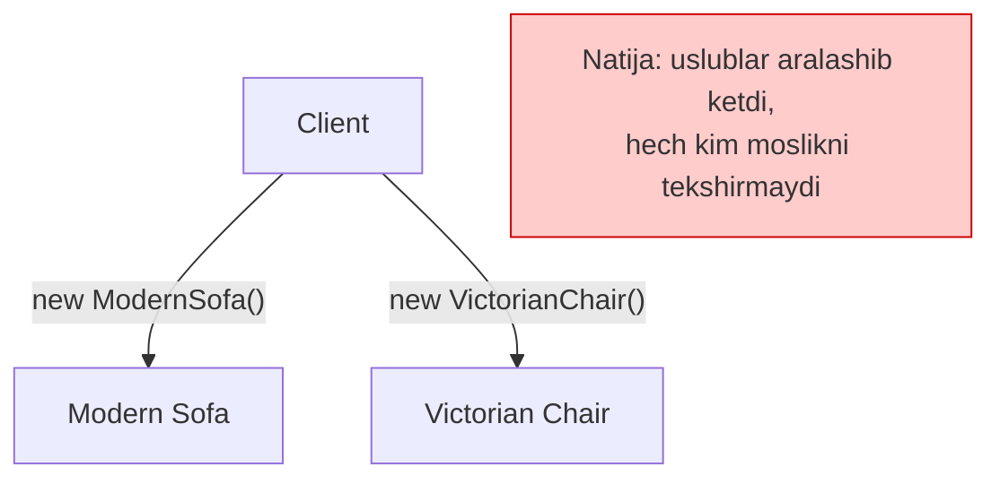
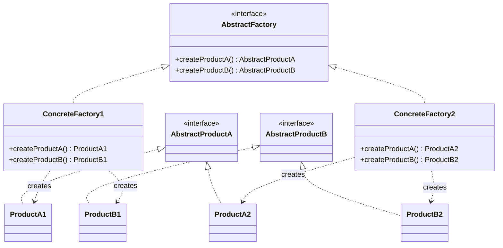

# Abstract Factory Pattern

> Boshqa nomi: **Абстрактная фабрика**

**Abstract Factory** — creational (yaratuvchi) pattern. U **bog'liq obyektlar oilasini** ularning konkret class'lariga bog'lanmasdan yaratish imkonini beradi.

Factory Method **bitta** obyekt yaratadi. Abstract Factory — bir-biriga mos keluvchi **bir nechta obyektdan iborat oilani** yaratadi.

---

## STEP 1 — Umumiy tushuncha

### Muammo nima edi?

Tasavvur qiling: siz mebel do'koni simulyatorini yozyapsiz. Kodingizda:

1. **Bog'liq product'lar oilasi** bor: `Chair` (kreslo) + `Sofa` (divan) + `CoffeeTable` (stolcha).
2. Bu oilaning **bir nechta variatsiyasi** bor: har bir mebel `ArtDeco`, `Victorian` va `Modern` uslublarida chiqariladi.

Sizga product'larni shunday yaratish usuli kerakki, ular **o'z oilasidagi boshqa product'lar bilan mos kelsin**. Chunki mijozlar bir-biriga mos kelmaydigan mebel olsa — xafa bo'ladi (Modern divan yoniga Victorian kreslo kelishmaydi!).

Bundan tashqari, dasturga yangi product yoki yangi oila qo'shilganda **mavjud kodni o'zgartirishni xohlamaysiz** — mebel yetkazib beruvchilar kataloglarini tez-tez yangilab turadi.

### Pattern ishlatilmasa qanday muammolar bo'ladi?

| Muammo | Oqibat |
|--------|--------|
| Client har bir product'ni alohida, konkret class orqali yaratadi | `ModernSofa` + `VictorianChair` kabi nomuvofiq kombinatsiyalar paydo bo'ladi |
| Uslub tanlash `if/else`'lari butun kodga tarqaladi | Yangi uslub qo'shish = hamma joyni o'zgartirish |
| Moslikni hech kim kafolatlamaydi | Xato faqat runtime'da, ba'zan faqat foydalanuvchida ko'rinadi |



### Yechim nima?

1. Avval har bir product uchun **alohida interface** ajratamiz: barcha kreslolar `Chair` interface'ini, divanlar `Sofa`'ni implementatsiya qiladi va h.k. Bitta product'ning barcha variatsiyalari bitta ierarxiyada yashaydi.

2. Keyin **abstract factory** yaratamiz — oiladagi **barcha** product'larni yaratish metodlarini o'z ichiga olgan umumiy interface: `createChair()`, `createSofa()`, `createCoffeeTable()`. Bu metodlar **abstrakt** product turlarini qaytaradi.

3. Har bir oila variatsiyasi uchun abstract factory'ni implementatsiya qiluvchi **konkret factory** yaratamiz. Masalan, `ModernFactory` faqat `ModernChair`, `ModernSofa` va `ModernCoffeeTable` qaytaradi — **moslik avtomatik kafolatlanadi**.

4. Client kod factory bilan ham, product'lar bilan ham **faqat umumiy interface orqali** ishlaydi. Client kreslo so'raganda qaysi factory ekanini, Victorian yoki Modern kreslo olishini bilmaydi — unga kresloda o'tirish mumkinligi va u shu oiladagi divan bilan chiroyli ko'rinishi muhim.

Oxirgi savol: client faqat interface'lar bilan ishlasa, konkret factory obyektini **kim yaratadi**? Odatda dastur ishga tushishida konfiguratsiya yoki muhit (environment) parametrlariga qarab bitta konkret factory yaratiladi va client kodga uzatiladi.

### Asosiy qoida

> **Bir oilaga tegishli product'larni bitta factory yaratsin — shunda ularning bir-biriga mosligi kafolatlanadi, client esa konkret class'larni umuman bilmaydi.**

### Struktura



1. **Abstract Product'lar** — ma'no jihatdan bog'liq, lekin har xil vazifa bajaruvchi product'larning interface'lari (kreslo / stolcha).
2. **Concrete Product'lar** — turli abstract product'larga tegishli, lekin bir xil variatsiyalarga ega class'larning katta to'plami (Victorian / Modern).
3. **Abstract Factory** — turli abstract product'larni yaratish metodlarini e'lon qiladi.
4. **Concrete Factory'lar** — har biri o'z variatsiyasiga tegishli bo'lib, faqat shu variatsiyadagi product'larni yaratadi.
5. Konkret factory'lar konkret product yaratsa ham, metod **signaturalari abstrakt product turini** qaytarishi kerak — shunda client factory'ga bog'lanmaydi va istalgan variatsiya bilan ishlay oladi.

---

## STEP 2 — Python misoli

### ❌ Yomon misol (pattern'siz)

```python
def build_ui(style: str):
    # ❌ Har bir product alohida tanlanadi — aralashish xavfi katta
    if style == "variant1":
        product_a = ConcreteProductA1()
    else:
        product_a = ConcreteProductA2()

    # Boshqa dasturchi bu yerda shartni ADASHIB yozdi:
    if style == "variant2":
        product_b = ConcreteProductB1()   # ❌ A2 bilan B1 aralashdi!
    else:
        product_b = ConcreteProductB2()

    # Hech narsa moslikni tekshirmaydi — bug faqat runtime'da chiqadi
    return product_a, product_b
```

**Nima yomon?** Har bir product mustaqil tanlangani uchun **oila mosligi** hech qayerda kafolatlanmaydi; tur tanlash logikasi ko'payib, xato qilish oson.

### ✅ Abstract Factory bilan

`t/Python/src/AbstractFactory/Conceptual` misoli (izohlar o'zbekchada):

```python
from __future__ import annotations
from abc import ABC, abstractmethod


class AbstractFactory(ABC):
    """
    Abstract Factory interface'i turli abstrakt product'larni qaytaruvchi
    metodlar to'plamini e'lon qiladi. Bu product'lar OILA deyiladi.
    Bir oila product'lari o'zaro hamkorlik qila oladi, lekin bir
    variatsiya product'lari boshqa variatsiyanikiga mos kelmaydi.
    """
    @abstractmethod
    def create_product_a(self) -> AbstractProductA:
        pass

    @abstractmethod
    def create_product_b(self) -> AbstractProductB:
        pass


class ConcreteFactory1(AbstractFactory):
    # Konkret Factory BITTA variatsiyadagi product'lar oilasini yaratadi
    # va ularning mosligini kafolatlaydi. Metod signaturasi abstrakt
    # product qaytaradi, ichida esa konkret product yaratiladi.
    def create_product_a(self) -> AbstractProductA:
        return ConcreteProductA1()

    def create_product_b(self) -> AbstractProductB:
        return ConcreteProductB1()


class ConcreteFactory2(AbstractFactory):
    # Har bir Konkret Factory o'z product variatsiyasiga ega.
    def create_product_a(self) -> AbstractProductA:
        return ConcreteProductA2()

    def create_product_b(self) -> AbstractProductB:
        return ConcreteProductB2()


class AbstractProductA(ABC):
    # Oiladagi har bir product'ning bazaviy interface'i bo'lishi kerak.
    @abstractmethod
    def useful_function_a(self) -> str:
        pass


class ConcreteProductA1(AbstractProductA):
    def useful_function_a(self) -> str:
        return "The result of the product A1."


class ConcreteProductA2(AbstractProductA):
    def useful_function_a(self) -> str:
        return "The result of the product A2."


class AbstractProductB(ABC):
    # Boshqa product'ning bazaviy interface'i. To'g'ri hamkorlik faqat
    # BIR XIL variatsiyadagi product'lar orasida bo'ladi.
    @abstractmethod
    def useful_function_b(self) -> None:
        # Product B mustaqil ishlay oladi...
        pass

    @abstractmethod
    def another_useful_function_b(self, collaborator: AbstractProductA) -> None:
        # ...shuningdek o'z variatsiyasidagi Product A bilan hamkorlik qiladi.
        # Abstract Factory yaratgan barcha product'lar bir variatsiyada
        # bo'lgani uchun moslik kafolatlanadi.
        pass


class ConcreteProductB1(AbstractProductB):
    def useful_function_b(self) -> str:
        return "The result of the product B1."

    # B1 faqat A1 bilan to'g'ri ishlaydi, lekin argument sifatida
    # istalgan AbstractProductA'ni qabul qiladi.
    def another_useful_function_b(self, collaborator: AbstractProductA) -> str:
        result = collaborator.useful_function_a()
        return f"The result of the B1 collaborating with the ({result})"


class ConcreteProductB2(AbstractProductB):
    def useful_function_b(self) -> str:
        return "The result of the product B2."

    def another_useful_function_b(self, collaborator: AbstractProductA):
        result = collaborator.useful_function_a()
        return f"The result of the B2 collaborating with the ({result})"


def client_code(factory: AbstractFactory) -> None:
    # Client factory va product'lar bilan FAQAT abstrakt turlar orqali
    # ishlaydi — unga istalgan factory subclass'ini berish mumkin.
    product_a = factory.create_product_a()
    product_b = factory.create_product_b()

    print(f"{product_b.useful_function_b()}")
    print(f"{product_b.another_useful_function_b(product_a)}", end="")


if __name__ == "__main__":
    print("Client: Testing client code with the first factory type:")
    client_code(ConcreteFactory1())

    print("\n")

    print("Client: Testing the same client code with the second factory type:")
    client_code(ConcreteFactory2())
```

**Output:**

```
Client: Testing client code with the first factory type:
The result of the product B1.
The result of the B1 collaborating with the (The result of the product A1.)

Client: Testing the same client code with the second factory type:
The result of the product B2.
The result of the B2 collaborating with the (The result of the product A2.)
```

**Nima yaxshilandi?** Bitta factory tanlandimi — undan chiqadigan **hamma product bir variatsiyada** bo'ladi. B1 + A2 kabi aralashish endi mumkin emas.

---

## STEP 3 — Go misoli

### ❌ Yomon misol (pattern'siz)

```go
package main

// ❌ Client har bir product'ni alohida yaratadi
func main() {
	brand := "nike"

	var shoe IShoe
	var shirt IShirt

	if brand == "nike" {
		shoe = &NikeShoe{Shoe: Shoe{logo: "nike", size: 14}}
	} else {
		shoe = &AdidasShoe{Shoe: Shoe{logo: "adidas", size: 14}}
	}

	// Boshqa joyda shart ADASHIB yozildi:
	if brand == "adidas" {
		shirt = &NikeShirt{Shirt: Shirt{logo: "nike", size: 14}}
	} else {
		shirt = &AdidasShirt{Shirt: Shirt{logo: "adidas", size: 14}} // nike'ga adidas futbolka!
	}

	_ = shoe
	_ = shirt
	// Kompilyator ham, runtime ham bu nomuvofiqlikni ushlamaydi
}
```

### ✅ Abstract Factory bilan

`t/Go/abstractFactory` misoli — sport brendlari (`nike`, `adidas`) poyabzal (`shoe`) va futbolka (`shirt`) oilasini yaratadi (izohlar o'zbekchada):

```go
// iSportsFactory.go — Abstract Factory interface + factory tanlovchi
package main

import "fmt"

type ISportsFactory interface {
	makeShoe() IShoe
	makeShirt() IShirt
}

// Brand nomiga qarab konkret factory qaytaradi.
// Dastur boshida BIR MARTA chaqiriladi.
func GetSportsFactory(brand string) (ISportsFactory, error) {
	if brand == "adidas" {
		return &Adidas{}, nil
	}

	if brand == "nike" {
		return &Nike{}, nil
	}

	return nil, fmt.Errorf("Wrong brand type passed")
}
```

```go
// iShoe.go — Abstract Product: poyabzal interface'i va bazaviy struct
package main

type IShoe interface {
	setLogo(logo string)
	setSize(size int)
	getLogo() string
	getSize() int
}

type Shoe struct {
	logo string
	size int
}

func (s *Shoe) setLogo(logo string) {
	s.logo = logo
}

func (s *Shoe) getLogo() string {
	return s.logo
}

func (s *Shoe) setSize(size int) {
	s.size = size
}

func (s *Shoe) getSize() int {
	return s.size
}
```

```go
// iShirt.go — Abstract Product: futbolka interface'i va bazaviy struct
package main

type IShirt interface {
	setLogo(logo string)
	setSize(size int)
	getLogo() string
	getSize() int
}

type Shirt struct {
	logo string
	size int
}

func (s *Shirt) setLogo(logo string) {
	s.logo = logo
}

func (s *Shirt) getLogo() string {
	return s.logo
}

func (s *Shirt) setSize(size int) {
	s.size = size
}

func (s *Shirt) getSize() int {
	return s.size
}
```

```go
// adidas.go — Concrete Factory 1: faqat adidas oilasini yaratadi
package main

type Adidas struct {
}

func (a *Adidas) makeShoe() IShoe {
	return &AdidasShoe{
		Shoe: Shoe{
			logo: "adidas",
			size: 14,
		},
	}
}

func (a *Adidas) makeShirt() IShirt {
	return &AdidasShirt{
		Shirt: Shirt{
			logo: "adidas",
			size: 14,
		},
	}
}
```

```go
// nike.go — Concrete Factory 2: faqat nike oilasini yaratadi
package main

type Nike struct {
}

func (n *Nike) makeShoe() IShoe {
	return &NikeShoe{
		Shoe: Shoe{
			logo: "nike",
			size: 14,
		},
	}
}

func (n *Nike) makeShirt() IShirt {
	return &NikeShirt{
		Shirt: Shirt{
			logo: "nike",
			size: 14,
		},
	}
}
```

```go
// Concrete Product'lar — embedding orqali bazaviy struct'ni oladi
// adidasShoe.go
type AdidasShoe struct {
	Shoe
}

// adidasShirt.go
type AdidasShirt struct {
	Shirt
}

// nikeShoe.go
type NikeShoe struct {
	Shoe
}

// nikeShirt.go
type NikeShirt struct {
	Shirt
}
```

```go
// main.go — Client: faqat interface'lar bilan ishlaydi
package main

import "fmt"

func main() {
	adidasFactory, _ := GetSportsFactory("adidas")
	nikeFactory, _ := GetSportsFactory("nike")

	// Bitta factory'dan chiqqan product'lar DOIM bir oilada bo'ladi
	nikeShoe := nikeFactory.makeShoe()
	nikeShirt := nikeFactory.makeShirt()

	adidasShoe := adidasFactory.makeShoe()
	adidasShirt := adidasFactory.makeShirt()

	printShoeDetails(nikeShoe)
	printShirtDetails(nikeShirt)

	printShoeDetails(adidasShoe)
	printShirtDetails(adidasShirt)
}

func printShoeDetails(s IShoe) {
	fmt.Printf("Logo: %s", s.getLogo())
	fmt.Println()
	fmt.Printf("Size: %d", s.getSize())
	fmt.Println()
}

func printShirtDetails(s IShirt) {
	fmt.Printf("Logo: %s", s.getLogo())
	fmt.Println()
	fmt.Printf("Size: %d", s.getSize())
	fmt.Println()
}
```

**Output:**

```
Logo: nike
Size: 14
Logo: nike
Size: 14
Logo: adidas
Size: 14
Logo: adidas
Size: 14
```

**Nima yaxshilandi?**
- `nikeFactory`'dan **hech qachon** adidas mahsuloti chiqmaydi — moslik strukturaviy kafolatlangan;
- yangi brand (masalan `puma`) qo'shish = yangi factory + product'lar yozish, client kod o'zgarmaydi;
- brand tanlash `if`'i **bitta joyda** (`GetSportsFactory`).

---

## Qachon ishlatish kerak?

**1. Biznes-logika turli xil, o'zaro bog'liq product'lar bilan ishlashi kerak, lekin ularning konkret class'lariga bog'lanmasligi kerak bo'lsa.**

Abstract Factory qaysi va qanday obyektlar yaratilishini client'dan yashiradi. Product'larning umumiy interface'lari oldindan aniqlangani uchun client barcha turlari bilan bemalol ishlay oladi.

**2. Dasturda allaqachon Factory Method ishlatilgan bo'lib, navbatdagi o'zgarishlar yangi product turlarini kiritishni talab qilsa.**

Yaxshi dasturda har bir class faqat bitta narsaga javob beradi. Class'da factory method'lar ko'payib ketsa, ular uning asosiy vazifasini "xiralashtiradi" — bunday holda butun yaratish logikasini alohida factory ierarxiyasiga chiqarish ma'qul.

---

## Implementatsiya qadamlari

1. Product turlari va oila variatsiyalari jadvalini tuzing (masalan: qatorlar — Chair/Sofa/Table, ustunlar — Modern/Victorian).
2. Barcha product variatsiyalarini **umumiy interface'larga** keltiring (har bir product turi uchun bittadan).
3. **Abstract factory interface'ini** aniqlang — har bir product turi uchun factory method bilan.
4. Har bir oila variatsiyasi uchun **konkret factory class** yarating (variatsiyalar nechta bo'lsa, factory ham shuncha).
5. Dasturning initsializatsiya kodini o'zgartiring: u konfiguratsiya/muhitga qarab konkret factory yaratib, client kodga uzatsin.
6. Client koddagi constructor orqali product yaratish joylarini factory metodlari chaqiruvi bilan almashtiring.

---

## Afzalliklar va kamchiliklar

| ✅ Afzalliklar | ❌ Kamchiliklar |
|---------------|----------------|
| Yaratiladigan product'larning **mosligini kafolatlaydi** | Ko'plab qo'shimcha class'lar hisobiga kod murakkablashadi |
| Client kodni konkret product class'laridan xalos qiladi | Har bir variatsiyada **barcha** product turlari bo'lishini talab qiladi |
| Yaratish kodini bir joyga jamlaydi (Single Responsibility) | |
| Yangi product variatsiyalarini qo'shish oson (Open/Closed) | |

---

## Boshqa patternlar bilan aloqasi

- Ko'p arxitekturalar **Factory Method**'dan boshlanib **Abstract Factory**, **Prototype** yoki **Builder** tomon rivojlanadi.
- **Builder** murakkab obyektni **bosqichma-bosqich** quradi va natijani barcha qadamlar tugagachgina qaytaradi; Abstract Factory esa bog'liq product'lar **oilasiga** ixtisoslashgan va product'ni **darhol** qaytaradi.
- Abstract Factory class'lari ko'pincha **Factory Method**'lar asosida, ba'zan **Prototype** asosida quriladi.
- Abstract Factory'ni **Facade** o'rnida ishlatish mumkin — platformaga bog'liq class'larni yashirish uchun.
- Abstract Factory **Bridge** bilan birga ishlashi mumkin: abstraksiya faqat ma'lum implementatsiyalar bilan ishlay olganda, factory qaysi juftlik yaratilishini belgilaydi.
- Abstract Factory, Builder va Prototype — barchasini **Singleton** sifatida implementatsiya qilish mumkin.

---

## Go'da real-world misol: Database Driver Factory

```go
// Abstract products
type Connection interface {
    Execute(query string, args ...any) error
    Query(query string, args ...any) (Rows, error)
    Close() error
}

type Transaction interface {
    Commit() error
    Rollback() error
}

// Abstract factory
type DBFactory interface {
    Connect(dsn string) (Connection, error)
    BeginTx(conn Connection) (Transaction, error)
}

// PostgreSQL implementatsiyasi
type PostgresFactory struct{}

func (f *PostgresFactory) Connect(dsn string) (Connection, error) {
    db, err := sql.Open("postgres", dsn)
    if err != nil {
        return nil, err
    }
    return &PostgresConnection{db: db}, nil
}

// SQLite implementatsiyasi (test uchun)
type SQLiteFactory struct{}

func (f *SQLiteFactory) Connect(dsn string) (Connection, error) {
    db, err := sql.Open("sqlite3", dsn)
    if err != nil {
        return nil, err
    }
    return &SQLiteConnection{db: db}, nil
}

// Ishlatish
func NewRepository(factory DBFactory, dsn string) (*UserRepository, error) {
    conn, err := factory.Connect(dsn)
    if err != nil {
        return nil, err
    }
    return &UserRepository{conn: conn}, nil
}

// Production:
repo, _ := NewRepository(&PostgresFactory{}, "postgres://...")

// Test:
repo, _ := NewRepository(&SQLiteFactory{}, ":memory:")
```

`Connection` va `Transaction` — bog'liq oila: PostgreSQL connection'idan faqat PostgreSQL transaction'i chiqishi kerak. Abstract Factory shu moslikni kafolatlaydi.

---

## Factory Method vs Abstract Factory

| | Factory Method | Abstract Factory |
|--|---------------|-----------------|
| **Maqsad** | Bitta obyekt yaratish | Bog'liq obyektlar oilasi |
| **Murakkablik** | Past | Yuqori |
| **Moslik kafolati** | — | ✅ (bitta factory = bitta oila) |
| **Kengaytirish** | Yangi creator subclass | Yangi factory class |
| **Ko'pincha** | Boshlang'ich nuqta | Factory Method'dan evolyutsiya |

---

## Xulosa

### Eslab qol

- Abstract Factory = **oilalar factory'si**: bitta factory'dan chiqqan product'lar **doim bir-biriga mos**.
- Har bir product turi uchun **alohida interface**, har bir oila variatsiyasi uchun **alohida factory**.
- Konkret factory metodlari **abstrakt tur** qaytarishi shart — aks holda client konkret class'larga bog'lanadi.
- Konkret factory'ni **dastur boshida bir marta** (config/environment asosida) yaratib, client'ga uzating.
- Kamchiligi: har bir yangi product turi **hamma** factory'larga qo'shilishi kerak.

### Amaliyot

1. `t/Go/abstractFactory`'ga uchinchi brand (`puma`) qo'shing — client kod (`main.go`) o'zgaradimi?
2. Endi yangi product turi (`ICap` — kepka) qo'shib ko'ring — nechta class o'zgarganini sanang va bu pattern'ning qaysi kamchiligini ko'rsatishini ayting.
3. Python misolida `client_code`'ga `ConcreteFactory1` bilan `ConcreteProductB2`'ni "aralashtirish" imkonini qidirib ko'ring — nega bu strukturaviy darajada qiyin?

---

## Keyingi qadam

→ [3. Builder.md](3.%20Builder.md)
