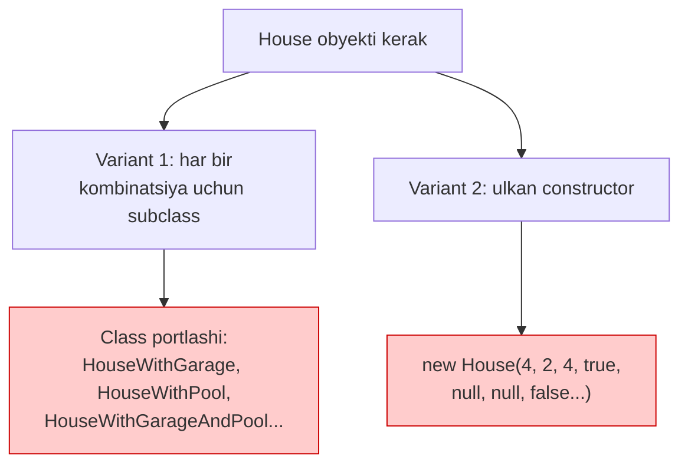
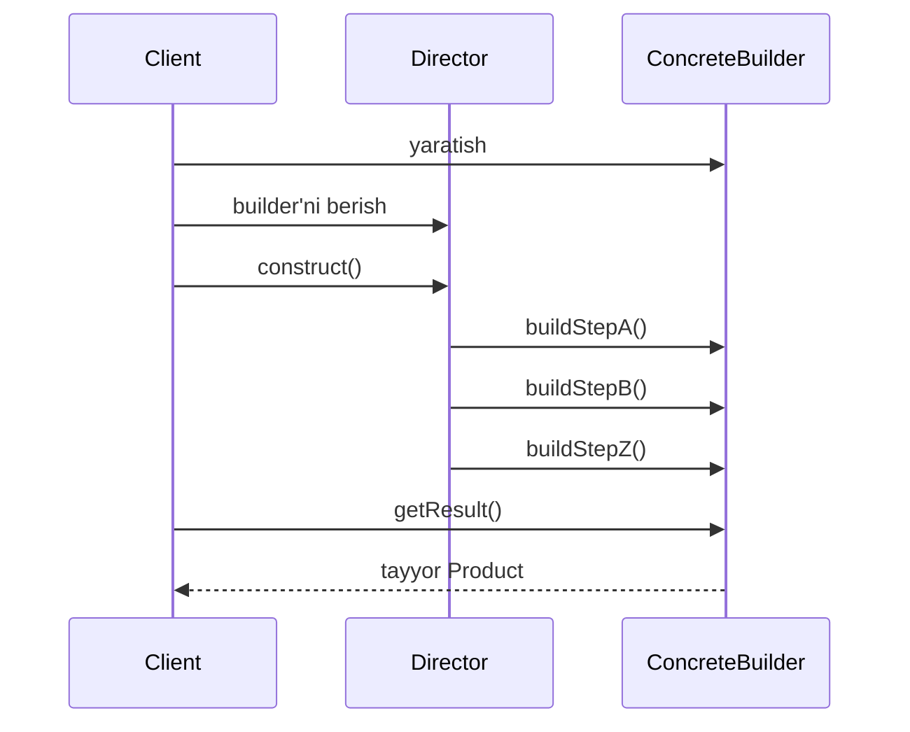
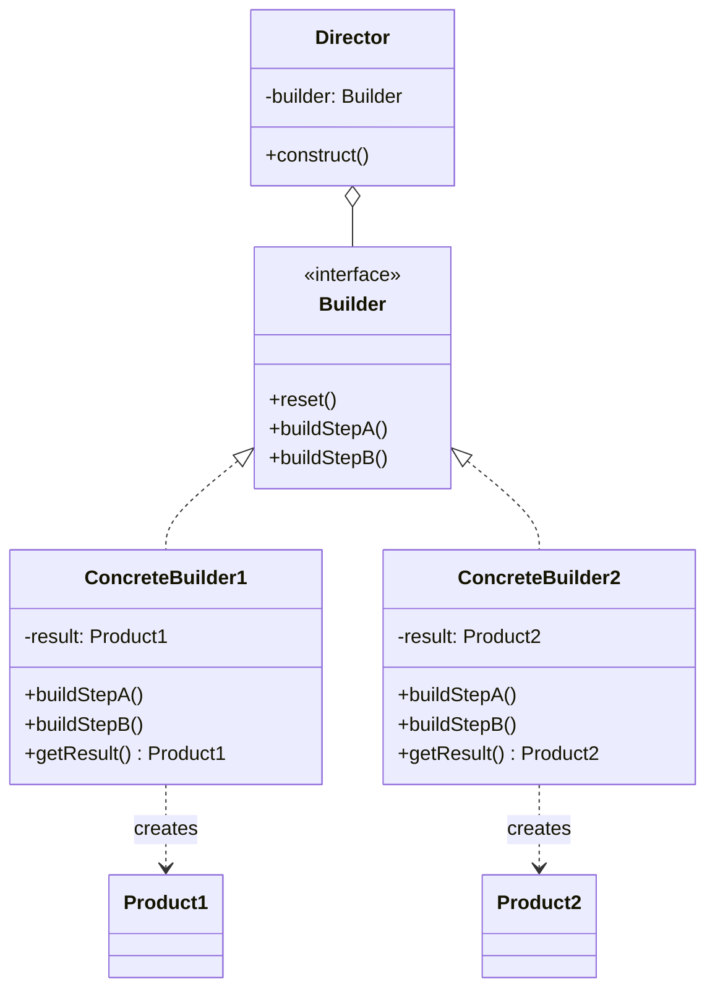

# Builder Pattern

> Boshqa nomi: **Строитель**

**Builder** — creational (yaratuvchi) pattern. U murakkab obyektlarni **bosqichma-bosqich** yaratish imkonini beradi. Builder yordamida **bitta qurilish kodi** bilan obyektlarning **turli ko'rinishlarini** olish mumkin.

---

## STEP 1 — Umumiy tushuncha

### Muammo nima edi?

Ko'p maydonli, ichma-ich obyektli, sinchkov initsializatsiya talab qiladigan murakkab obyektni tasavvur qiling. Bunday obyektni yaratish kodi odatda o'nlab parametrli **ulkan constructor** ichiga yashiringan bo'ladi. Yoki bundan ham yomoni — butun client kodga sochilib ketgan bo'ladi.

Misol: `House` (uy) obyektini yaratish. Oddiy uy uchun 4 devor, eshik, oynalar va tom kerak. Lekin kattaroq, yorug'roq, bog'i, basseyni bo'lgan uy kerak bo'lsa-chi?

**1-urinish: subclass'lar yaratish.** Har bir parametr kombinatsiyasi uchun `House` subclass'ini ochamiz. Muammo: parametrlar ko'paygani sari **class'lar soni portlab ketadi**. Har bir yangi parametr (devor rangi, tom materiali...) ierarxiyani yanada kengaytiradi.

**2-urinish: hamma narsani bitta constructor'ga tiqish.** Subclass'lar kerak emas, lekin endi boshqa muammo:

```
Pattern ishlatilmasa (telescoping constructor):
new House(4, 2, 4, true, null, null, false, null, ...)
         ↑ bu parametrlar nimani anglatadi?!
```

### Pattern ishlatilmasa qanday muammolar bo'ladi?

| Muammo | Oqibat |
|--------|--------|
| "Telescoping constructor" — o'nlab parametrli constructor | Chaqirish o'qib bo'lmas, parametrlarni adashtirish oson |
| Parametrlarning ko'pi ishlatilmaydi (uylarning 99%da basseyn yo'q) | Chaqiruvlar xunuk: `null, null, false, null...` |
| Har bir konfiguratsiya uchun subclass | Class'lar soni portlashi |
| Yaratish kodi client'ga sochilgan | Yarim tayyor ("chala") obyekt olish xavfi |



### Yechim nima?

Builder pattern'i obyektni qurishni **uning class'idan tashqariga** chiqarib, alohida **builder** obyektlariga topshirishni taklif qiladi.

- Qurish jarayoni **alohida qadamlarga** bo'linadi (`buildWalls`, `buildDoors`...).
- Obyekt yaratish uchun builder metodlari ketma-ket chaqiriladi — lekin **hammasi emas, faqat keraklilari**.
- Bir xil qadam turli obyekt variatsiyalari uchun **turlicha bajarilishi** mumkin: yog'och uy uchun devor yog'ochdan, tosh uy uchun toshdan quriladi. Buning uchun bir xil interface'ni turlicha implementatsiya qiluvchi bir nechta builder class yoziladi.

Masalan: bir builder devorlarni yog'och va oynadan, ikkinchisi tosh va temirdan, uchinchisi oltin va olmosdan quradi. Bir xil qadamlarni chaqirib: birinchisidan oddiy uy, ikkinchisidan qal'acha, uchinchisidan saroy olasiz. Muhim shart: qurish qadamlarini chaqiruvchi kod builder'lar bilan **umumiy interface orqali** ishlashi kerak — shunda ularni erkin almashtirish mumkin.

### Director

Yana bir qadam oldinga: builder metodlarini chaqiruvchi ketma-ketlikni alohida **Director** class'iga chiqarish mumkin. Director qurish qadamlarining **tartibini** belgilaydi, builder esa ularni **bajaradi**.

- Director majburiy emas — client builder'ni to'g'ridan-to'g'ri boshqarishi ham mumkin.
- Director foydali bo'ladi, agar mahsulotlarni qurishning bir nechta tayyor "retsepti" bo'lsa — barcha shu logika bitta joyda jamlanadi.
- Director client'dan qurish jarayonini **butunlay yashiradi**: client builder'ni director'ga bog'laydi, natijani esa **builder'dan** oladi.



### Asosiy qoida

> **Murakkab obyektni bitta ulkan constructor bilan emas, kerakli qadamlarni tanlab, bosqichma-bosqich qur. Natija barcha qadamlar tugagachgina qaytariladi.**

### Struktura



1. **Builder interface** — barcha builder turlariga umumiy bo'lgan qurish qadamlarini e'lon qiladi.
2. **Concrete Builder'lar** — qadamlarni har biri o'zicha implementatsiya qiladi. Ular hatto **umumiy interface'ga ega bo'lmagan, butunlay har xil product'larni** yaratishi mumkin (masalan: mashina va unga qo'llanma).
3. **Product** — yaratilayotgan obyekt. Turli builder'lar yasagan product'lar umumiy interface'ga ega bo'lishi shart emas.
4. **Director** — u yoki bu product konfiguratsiyasi uchun qurish qadamlarining chaqirilish tartibini belgilaydi.
5. **Client** odatda tayyor builder'ni director constructor'iga beradi; yoki har safar qurish metodining parametri orqali uzatadi.

   > Natijani olish metodi (`getResult`) odatda **konkret builder'da** bo'ladi, umumiy interface'da emas — chunki har xil builder'lar har xil turdagi natija qaytarishi mumkin.

---

## STEP 2 — Python misoli

### ❌ Yomon misol (pattern'siz)

```python
class Product1:
    # ❌ Telescoping constructor: hamma qism uchun parametr
    def __init__(self, part_a=None, part_b=None, part_c=None,
                 part_d=None, part_e=None, part_f=None):
        self.parts = []
        if part_a: self.parts.append(part_a)
        if part_b: self.parts.append(part_b)
        if part_c: self.parts.append(part_c)
        # ...

# Chaqirish — qaysi None nima ekanini kim biladi?
product = Product1("PartA1", None, "PartC1", None, None, None)

# Yoki client o'zi bosqichma-bosqich yig'adi — yaratish logikasi
# butun kodga sochilib ketadi va yarim tayyor obyekt sizib chiqadi:
product = Product1()
product.parts.append("PartA1")
# ... dasturchi PartB'ni unutib qo'ydi — hech kim sezmaydi
```

### ✅ Builder bilan

`t/Python/src/Builder/Conceptual` misoli (izohlar o'zbekchada):

```python
from __future__ import annotations
from abc import ABC, abstractmethod
from typing import Any


class Builder(ABC):
    """
    Builder interface'i Product qismlarini yaratuvchi
    metodlarni e'lon qiladi.
    """

    @property
    @abstractmethod
    def product(self) -> None:
        pass

    @abstractmethod
    def produce_part_a(self) -> None:
        pass

    @abstractmethod
    def produce_part_b(self) -> None:
        pass

    @abstractmethod
    def produce_part_c(self) -> None:
        pass


class ConcreteBuilder1(Builder):
    """
    Concrete Builder qurish qadamlarining konkret implementatsiyasini
    beradi. Dasturda turlicha ishlaydigan bir nechta builder bo'lishi mumkin.
    """

    def __init__(self) -> None:
        # Yangi builder ichida bo'sh product obyekti bo'lishi kerak —
        # u keyingi yig'ishda ishlatiladi.
        self.reset()

    def reset(self) -> None:
        self._product = Product1()

    @property
    def product(self) -> Product1:
        # Concrete Builder'lar natija olish metodini O'ZI berishi kerak,
        # chunki har xil builder'lar butunlay har xil product yaratishi
        # mumkin — shuning uchun bu metodni bazaviy interface'ga
        # qo'yib bo'lmaydi (hech bo'lmasa statik tipli tillarda).
        #
        # Natija qaytarilgach builder yangi product'ga tayyor bo'lishi
        # uchun odatda reset() chaqiriladi (majburiy emas).
        product = self._product
        self.reset()
        return product

    def produce_part_a(self) -> None:
        self._product.add("PartA1")

    def produce_part_b(self) -> None:
        self._product.add("PartB1")

    def produce_part_c(self) -> None:
        self._product.add("PartC1")


class Product1():
    """
    Builder'ni faqat product yetarlicha murakkab va keng konfiguratsiya
    talab qilganda ishlatish mantiqli.

    Boshqa creational patternlardan farqli: turli concrete builder'lar
    BIR-BIRIGA BOG'LIQ BO'LMAGAN product'lar yaratishi mumkin.
    """

    def __init__(self) -> None:
        self.parts = []

    def add(self, part: Any) -> None:
        self.parts.append(part)

    def list_parts(self) -> None:
        print(f"Product parts: {', '.join(self.parts)}", end="")


class Director:
    """
    Director qurish qadamlarini MA'LUM KETMA-KETLIKDA bajarishga
    javob beradi. Bu majburiy emas — client builder'ni to'g'ridan-to'g'ri
    boshqarishi ham mumkin.
    """

    def __init__(self) -> None:
        self._builder = None

    @property
    def builder(self) -> Builder:
        return self._builder

    @builder.setter
    def builder(self, builder: Builder) -> None:
        # Director client bergan ISTALGAN builder bilan ishlaydi —
        # shu orqali client yig'iladigan product turini o'zgartiradi.
        self._builder = builder

    # Director bir xil qadamlar bilan product'ning bir nechta
    # variatsiyasini qura oladi.

    def build_minimal_viable_product(self) -> None:
        self.builder.produce_part_a()

    def build_full_featured_product(self) -> None:
        self.builder.produce_part_a()
        self.builder.produce_part_b()
        self.builder.produce_part_c()


if __name__ == "__main__":
    # Client builder yaratadi, uni director'ga beradi va qurishni
    # boshlaydi. Natija BUILDER'dan olinadi.

    director = Director()
    builder = ConcreteBuilder1()
    director.builder = builder

    print("Standard basic product: ")
    director.build_minimal_viable_product()
    builder.product.list_parts()

    print("\n")

    print("Standard full featured product: ")
    director.build_full_featured_product()
    builder.product.list_parts()

    print("\n")

    # Builder pattern'ni Director'siz ham ishlatish mumkin.
    print("Custom product: ")
    builder.produce_part_a()
    builder.produce_part_b()
    builder.product.list_parts()
```

**Output:**

```
Standard basic product: 
Product parts: PartA1

Standard full featured product: 
Product parts: PartA1, PartB1, PartC1

Custom product: 
Product parts: PartA1, PartB1
```

**Nima yaxshilandi?** Bitta builder + bitta director bilan **uch xil konfiguratsiya** olindi; `None`'lar yo'q, faqat kerakli qadamlar chaqirildi; natija to'liq tayyor bo'lgachgina qaytdi.

---

## STEP 3 — Go misoli

### ❌ Yomon misol (pattern'siz)

```go
package main

// ❌ Telescoping constructor
func newHouse(windowType string, doorType string, floor int,
	hasGarage bool, hasGarden bool, hasSwimPool bool) *House {
	return &House{
		windowType: windowType,
		doorType:   doorType,
		floor:      floor,
		// ...
	}
}

func main() {
	// Qaysi true nima? Qaysi string qayeri? Adashish juda oson:
	normalHouse := newHouse("Wooden Door", "Wooden Window", 2, false, true, false)
	//                       ↑ eshik bilan oyna joyi ALMASHIB ketdi — kompilyator indamaydi!

	// Igloo uchun esa umuman boshqa constructor kerak bo'lib qoladi...
	_ = normalHouse
}
```

### ✅ Builder bilan

`t/Go/builder` misoli — oddiy uy (`normal`) va muz uy (`igloo`) bir xil qadamlar bilan quriladi (izohlar o'zbekchada):

```go
// house.go — Product: yaratilayotgan obyekt
package main

type House struct {
	windowType string
	doorType   string
	floor      int
}
```

```go
// iBuilder.go — Builder interface: umumiy qurish qadamlari
package main

type IBuilder interface {
	setWindowType()
	setDoorType()
	setNumFloor()
	getHouse() House
}

// Builder tanlovchi yordamchi funksiya
func getBuilder(builderType string) IBuilder {
	if builderType == "normal" {
		return newNormalBuilder()
	}

	if builderType == "igloo" {
		return newIglooBuilder()
	}
	return nil
}
```

```go
// normalBuilder.go — Concrete Builder 1: oddiy (yog'och) uy quradi
package main

type NormalBuilder struct {
	windowType string
	doorType   string
	floor      int
}

func newNormalBuilder() *NormalBuilder {
	return &NormalBuilder{}
}

func (b *NormalBuilder) setWindowType() {
	b.windowType = "Wooden Window"
}

func (b *NormalBuilder) setDoorType() {
	b.doorType = "Wooden Door"
}

func (b *NormalBuilder) setNumFloor() {
	b.floor = 2
}

func (b *NormalBuilder) getHouse() House {
	return House{
		doorType:   b.doorType,
		windowType: b.windowType,
		floor:      b.floor,
	}
}
```

```go
// iglooBuilder.go — Concrete Builder 2: XUDDI SHU qadamlar,
// lekin muz uy quradi
package main

type IglooBuilder struct {
	windowType string
	doorType   string
	floor      int
}

func newIglooBuilder() *IglooBuilder {
	return &IglooBuilder{}
}

func (b *IglooBuilder) setWindowType() {
	b.windowType = "Snow Window"
}

func (b *IglooBuilder) setDoorType() {
	b.doorType = "Snow Door"
}

func (b *IglooBuilder) setNumFloor() {
	b.floor = 1
}

func (b *IglooBuilder) getHouse() House {
	return House{
		doorType:   b.doorType,
		windowType: b.windowType,
		floor:      b.floor,
	}
}
```

```go
// director.go — Director: qadamlar TARTIBINI belgilaydi.
// U builder bilan interface orqali ishlaydi — qaysi uy
// qurilayotganini bilmaydi.
package main

type Director struct {
	builder IBuilder
}

func newDirector(b IBuilder) *Director {
	return &Director{
		builder: b,
	}
}

func (d *Director) setBuilder(b IBuilder) {
	d.builder = b
}

func (d *Director) buildHouse() House {
	d.builder.setDoorType()
	d.builder.setWindowType()
	d.builder.setNumFloor()
	return d.builder.getHouse()
}
```

```go
// main.go — Client
package main

import "fmt"

func main() {
	normalBuilder := getBuilder("normal")
	iglooBuilder := getBuilder("igloo")

	// Bitta director...
	director := newDirector(normalBuilder)
	normalHouse := director.buildHouse()

	fmt.Printf("Normal House Door Type: %s\n", normalHouse.doorType)
	fmt.Printf("Normal House Window Type: %s\n", normalHouse.windowType)
	fmt.Printf("Normal House Num Floor: %d\n", normalHouse.floor)

	// ...builder'ni almashtirsak — BOSHQA uy chiqadi,
	// qurish kodi esa o'sha-o'sha!
	director.setBuilder(iglooBuilder)
	iglooHouse := director.buildHouse()

	fmt.Printf("\nIgloo House Door Type: %s\n", iglooHouse.doorType)
	fmt.Printf("Igloo House Window Type: %s\n", iglooHouse.windowType)
	fmt.Printf("Igloo House Num Floor: %d\n", iglooHouse.floor)

}
```

**Output:**

```
Normal House Door Type: Wooden Door
Normal House Window Type: Wooden Window
Normal House Num Floor: 2

Igloo House Door Type: Snow Door
Igloo House Window Type: Snow Window
Igloo House Num Floor: 1
```

**Nima yaxshilandi?**
- `buildHouse()` — **bitta** qurilish kodi ikki xil uy beradi;
- parametrlar tartibini adashtirish mumkin emas — har bir qadam nomlangan metod;
- yangi uy turi (masalan, `stoneBuilder`) qo'shish uchun director'ga tegilmaydi.

---

## Qachon ishlatish kerak?

**1. "Telescoping constructor"dan qutulmoqchi bo'lsangiz.**

O'nta optional parametrli constructor noqulay — shuning uchun kamroq parametrli yana o'nta constructor yaratiladi, ular esa asosiysiga default qiymatlar berib chaqiradi (bunday "monster" faqat method overloading bor tillarda — Java, C# — tug'iladi). Builder obyektni faqat kerakli qadamlar bilan yig'adi — hamma variantni constructor'ga tiqish shart emas.

**2. Kodingiz bir obyektning turli ko'rinishlarini (representation) yaratishi kerak bo'lsa** (masalan, yog'och va temir-beton uylar).

Bu ko'rinishlarni yaratish bir xil qadamlardan iborat bo'lib, faqat detallari farq qilsa — Builder juda mos: interface qadamlarni belgilaydi, har bir ko'rinishga o'z builder'i yoziladi, tartibni director boshqaradi.

**3. Murakkab tarkibli obyektlarni (masalan, Composite daraxtlarini) yig'ish kerak bo'lsa.**

Builder qadamlarni ketma-ket, kerak bo'lsa **rekursiv** bajaradi — daraxtsimon strukturalar shunday quriladi. Muhim afzallik: Builder tayyor bo'lmagan obyektga tashqaridan kirishga yo'l qo'ymaydi — client hech qachon "chala" obyekt olmaydi.

---

## Implementatsiya qadamlari

1. Obyektning barcha ko'rinishlarini yaratishni **umumiy qadamlarga** keltirish mumkinligiga ishonch hosil qiling.
2. Bu qadamlarni **builder interface**'ida tavsiflang.
3. Har bir ko'rinish uchun **concrete builder** yozing va qadamlarini implementatsiya qiling. Natijani olish metodini (`getResult`) unutmang — u odatda konkret builder'da bo'ladi, chunki har xil product'lar umumiy interface'ga ega bo'lmasligi mumkin (agar ega bo'lsa — metodni umumiy interface'ga chiqarsa bo'ladi).
4. **Director** class'i haqida o'ylab ko'ring: uning metodlari bitta builder'ning turli qadamlar kombinatsiyasi bilan turli konfiguratsiyalar yaratadi.
5. Client kod builder'ni ham, director'ni ham yaratadi va qurishdan oldin ularni bog'laydi (constructor, setter yoki qurish metodining parametri orqali).
6. Natijani director'dan qaytarish mumkin — lekin **faqat** natija metodi umumiy builder interface'ida bo'lsa. Aks holda director konkret builder'larga qattiq bog'lanib qoladi.

---

## Afzalliklar va kamchiliklar

| ✅ Afzalliklar | ❌ Kamchiliklar |
|---------------|----------------|
| Product'ni bosqichma-bosqich yaratish imkoni | Qo'shimcha class'lar hisobiga kod murakkablashadi |
| Bitta qurish kodi bilan turli product'lar | Director interface'ida natija olish metodi bo'lmasa, client konkret builder'larga bog'lanadi |
| Murakkab yig'ish kodini biznes-logikadan ajratadi (Single Responsibility) | |

---

## Boshqa patternlar bilan aloqasi

- Ko'p arxitekturalar **Factory Method**'dan boshlanib **Abstract Factory**, **Prototype** yoki **Builder** tomon rivojlanadi.
- **Builder** murakkab obyektni bosqichma-bosqich qurishga e'tibor beradi va natijani **barcha qadamlardan keyin** qaytaradi; **Abstract Factory** bog'liq product'lar oilasini yaratadi va ularni **darhol** qaytaradi.
- Builder **Composite** daraxtini bosqichma-bosqich qurish uchun ishlatiladi.
- Builder'ni **Bridge** ko'rinishida qurish mumkin: director — abstraction, builder'lar — implementation rolini o'ynaydi.
- Abstract Factory, Builder va Prototype — barchasini **Singleton** sifatida implementatsiya qilish mumkin.

---

## Go idiomasi: Functional Options

Go'da klassik Builder o'rniga ko'pincha **Functional Options** ishlatiladi:

```go
package httpserver

import (
    "net/http"
    "time"
)

type Server struct {
    host         string
    port         int
    handler      http.Handler
    readTimeout  time.Duration
    writeTimeout time.Duration
}

type Option func(*Server)

func WithHost(host string) Option {
    return func(s *Server) {
        s.host = host
    }
}

func WithPort(port int) Option {
    return func(s *Server) {
        s.port = port
    }
}

func WithReadTimeout(d time.Duration) Option {
    return func(s *Server) {
        s.readTimeout = d
    }
}

func NewServer(opts ...Option) *Server {
    // Default qiymatlar
    s := &Server{
        host:         "localhost",
        port:         8080,
        readTimeout:  5 * time.Second,
        writeTimeout: 10 * time.Second,
    }
    // Faqat berilgan option'lar qo'llanadi
    for _, opt := range opts {
        opt(s)
    }
    return s
}

// Ishlatish:
// s := NewServer(
//     WithHost("0.0.0.0"),
//     WithPort(9090),
//     WithReadTimeout(30*time.Second),
// )
```

### Method chaining'li Builder (fluent API)

```go
s, err := NewServerBuilder().
    Host("api.example.com").
    Port(443).
    Timeout(60 * time.Second).
    WithTLS("certs/server.crt", "certs/server.key").
    Build() // validatsiya shu yerda
```

### SQL Query Builder — real hayotdagi eng mashhur misol

```go
query := From("users").
    Select("id", "name", "email").
    Where("age > 18").
    Where("active = true").
    OrderBy("name").
    Limit(10).
    Build()
// → SELECT id, name, email FROM users WHERE age > 18 AND active = true ORDER BY name LIMIT 10
```

### Builder vs Functional Options

| | Builder | Functional Options |
|--|---------|-------------------|
| **Go idiomasi** | ❌ | ✅ |
| **Validatsiya** | ✅ (`Build()`da) | ✅ (`NewX()`da) |
| **Director bilan retseptlar** | ✅ | ❌ |
| **Turli product turlari** | ✅ | ❌ (bitta struct) |

**Tavsiya:** Go'da oddiy konfiguratsiya uchun Functional Options; bir xil qadamlar bilan **har xil natija** kerak bo'lsa (klassik holat) — Builder + Director.

---

## Xulosa

### Eslab qol

- Builder = **qurishni obyektdan ajratish**: qadamlar builder'da, tartib director'da, natija builder'dan olinadi.
- Faqat **kerakli qadamlar** chaqiriladi — telescoping constructor muammosi yo'qoladi.
- Turli builder'lar bir xil qadamlar bilan **butunlay har xil product** yaratishi mumkin (shuning uchun `getResult` umumiy interface'da emas).
- Director **majburiy emas**, lekin takrorlanuvchi qurish "retseptlari"ni bir joyda saqlaydi.
- Client hech qachon **chala obyekt** olmaydi — natija faqat qurish tugagach qaytariladi.

### Amaliyot

1. `t/Go/builder`'ga `stoneBuilder` (tosh uy: "Stone Door", "Stone Window", 3 qavat) qo'shing — director o'zgaradimi?
2. `House`'ga `hasGarage bool` maydoni qo'shing: interface, ikkala builder va director'da nima o'zgarishini kuzating.
3. Python misolidagi `Director`'ga `build_custom_product(parts: list)` metodini yozing — berilgan qadamlarnigina bajarsin.
4. O'zingizning loyihangizdagi biror ko'p-parametrli funksiyani Functional Options'ga o'tkazib ko'ring.

---

## Keyingi qadam

→ [4. Prototype.md](4.%20Prototype.md)
