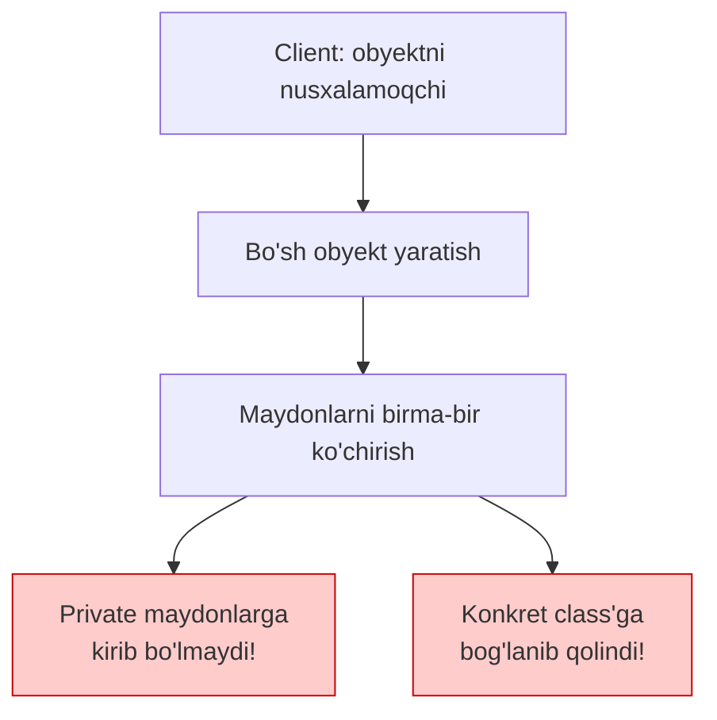
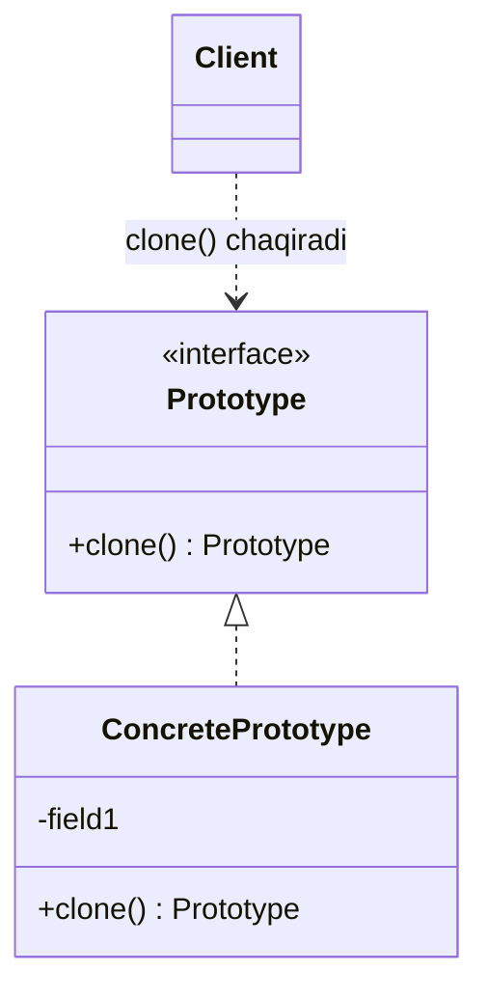

# Prototype Pattern

> Boshqa nomlari: **Clone**, **Прототип**

**Prototype** — creational (yaratuvchi) pattern. U obyektlarni ularning **implementatsiya tafsilotlariga kirmasdan nusxalash** (clone) imkonini beradi.

---

## STEP 1 — Umumiy tushuncha

### Muammo nima edi?

Sizda nusxalash kerak bo'lgan obyekt bor. Buni qanday qilasiz? Birinchi kelgan fikr: xuddi shu class'dan bo'sh obyekt yaratib, eski obyektning barcha maydonlarini birma-bir yangisiga ko'chirish.

Lekin ikkita jiddiy to'siq bor:

1. **Private maydonlar.** Obyekt holatining bir qismi private bo'lishi mumkin — tashqaridagi kod ularga kira olmaydi. Demak, "tashqaridan" nusxalash har doim ham to'liq bo'lmaydi.
2. **Konkret class'ga bog'liqlik.** Maydonlarni ko'chirish uchun obyektning class'ini bilish kerak — nusxalovchi kod o'sha class'ga bog'lanib qoladi. Agar sizda faqat obyektning **interface**'i ma'lum bo'lsa (masalan, obyekt tashqaridan parametr sifatida kelgan bo'lsa) — uni umuman nusxalay olmaysiz.

### Pattern ishlatilmasa qanday muammolar bo'ladi?

| Muammo | Oqibat |
|--------|--------|
| Tashqaridan maydonma-maydon nusxalash | Private maydonlar ko'chmaydi — "chala" nusxa |
| Nusxalovchi kod konkret class'ni bilishi shart | Interface orqali kelgan obyektni nusxalab bo'lmaydi |
| Har class uchun alohida nusxalash kodi | Takrorlanuvchi, sinuvchan kod |
| Shallow copy xatolari | Ikkala obyekt bitta ichki strukturani (slice, map) ulashib qoladi |



### Yechim nima?

Prototype pattern'i nusxa yaratishni **nusxalanadigan obyektlarning o'ziga** topshiradi. Clone qilishni qo'llab-quvvatlovchi barcha obyektlar uchun umumiy interface kiritiladi — odatda bitta `clone` metodi bilan.

`clone` metodi hamma class'da o'xshash ishlaydi: joriy class'dan yangi obyekt yaratadi va **o'z obyektining** barcha maydon qiymatlarini unga ko'chiradi. Private maydonlar ham ko'chadi — chunki ko'pchilik tillar **o'z class'i ichida** private maydonlarga kirishga ruxsat beradi.

Nusxalanadigan obyekt **prototype** deb ataladi (pattern nomi shundan). Obyektlaringiz yuzlab maydon va minglab mumkin bo'lgan konfiguratsiyaga ega bo'lsa, oldindan sozlangan prototype'lar **subclass yaratishga alternativa** bo'la oladi: barcha prototype'lar dastur boshida tayyorlab qo'yiladi, keyin kerak bo'lganda ularning nusxasi olinadi.

### Hayotiy analogiya

Sanoatda prototype asosiy partiyadan **oldin** sinovlar uchun yaratiladi va ishlab chiqarishda o'zi qatnashmaydi — passiv rol o'ynaydi. Shuning uchun pattern'ga yaqinroq misol — **hujayra bo'linishi (mitoz)**: bo'linishdan ikkita bir xil hujayra hosil bo'ladi, original hujayra (prototype) yangi nusxa yaratilishida **faol ishtirok etadi**.

### Asosiy qoida

> **Obyektni tashqaridan nusxalama — obyekt o'zini o'zi nusxalasin. Client faqat umumiy `clone` interface'ini bilsin.**

### Struktura

**Bazaviy implementatsiya:**



1. **Prototype interface** — clone operatsiyalarini tavsiflaydi; ko'pincha yagona `clone` metodi.
2. **Concrete Prototype** — o'zini nusxalash operatsiyasini implementatsiya qiladi. Oddiy maydon ko'chirishdan tashqari, bu yerda nusxalashning murakkab holatlari ham hal qilinadi: bog'langan obyektlarni clone qilish, rekursiv bog'liqliklarni yechish va h.k. — client bularni bilmasligi kerak.
3. **Client** — umumiy interface orqali istalgan obyektning nusxasini yaratadi.

**Prototype Registry (ombor) bilan implementatsiya:**

Tez-tez ishlatiladigan prototype'larni saqlash uchun markaziy **registry** qo'shiladi — eng soddasi `nom → prototype` hash-jadvali. Client so'ragan nomga mos prototype topiladi, clone qilinib qaytariladi.

---

## STEP 2 — Python misoli

> Python'da Prototype tilning o'ziga o'rnatilgan: `copy.copy` (shallow) va `copy.deepcopy` (deep). O'z class'ingiz uchun maxsus nusxalash kerak bo'lsa — `__copy__` va `__deepcopy__` metodlarini override qilasiz.

### ❌ Yomon misol (pattern'siz)

```python
component = SomeComponent(23, [1, {1, 2, 3}, [1, 2, 3]], circular_ref)

# ❌ 1-urinish: oddiy o'zlashtirish — bu umuman nusxa EMAS,
# ikkala nom bitta obyektga ishora qiladi:
fake_copy = component

# ❌ 2-urinish: tashqaridan qo'lda nusxalash:
manual_copy = SomeComponent(
    component.some_int,
    component.some_list_of_objects,   # ro'yxat ULASHILDI — nusxalanmadi!
    component.some_circular_ref,      # circular reference-chi?
)
manual_copy.some_list_of_objects.append("x")
# component.some_list_of_objects ham o'zgarib ketdi — yashirin bug!
```

### ✅ Prototype bilan (`copy` moduli)

`t/Python/src/Prototype/Conceptual` misoli (izohlar o'zbekchada):

```python
import copy


class SelfReferencingEntity:
    def __init__(self):
        self.parent = None

    def set_parent(self, parent):
        self.parent = parent


class SomeComponent:
    """
    Python Prototype'ni copy.copy va copy.deepcopy orqali beradi.
    Maxsus nusxalash kerak bo'lgan class __copy__ va __deepcopy__
    metodlarini override qiladi.
    """

    def __init__(self, some_int, some_list_of_objects, some_circular_ref):
        self.some_int = some_int
        self.some_list_of_objects = some_list_of_objects
        self.some_circular_ref = some_circular_ref

    def __copy__(self):
        # SHALLOW copy yaratadi. copy.copy(obj) chaqirilganda ishlaydi.

        # Avval ichki obyektlarning nusxalarini tayyorlaymiz.
        some_list_of_objects = copy.copy(self.some_list_of_objects)
        some_circular_ref = copy.copy(self.some_circular_ref)

        # Keyin tayyor nusxalar bilan obyektning o'zini clone qilamiz.
        new = self.__class__(
            self.some_int, some_list_of_objects, some_circular_ref
        )
        new.__dict__.update(self.__dict__)

        return new

    def __deepcopy__(self, memo=None):
        # DEEP copy yaratadi. copy.deepcopy(obj) chaqirilganda ishlaydi.
        #
        # `memo` — deepcopy kutubxonasi circular reference'larda cheksiz
        # rekursiyaning oldini olish uchun ishlatadigan lug'at. Ichki
        # deepcopy chaqiruvlarning hammasiga uni uzating.
        if memo is None:
            memo = {}

        some_list_of_objects = copy.deepcopy(self.some_list_of_objects, memo)
        some_circular_ref = copy.deepcopy(self.some_circular_ref, memo)

        new = self.__class__(
            self.some_int, some_list_of_objects, some_circular_ref
        )
        new.__dict__ = copy.deepcopy(self.__dict__, memo)

        return new


if __name__ == "__main__":

    list_of_objects = [1, {1, 2, 3}, [1, 2, 3]]
    circular_ref = SelfReferencingEntity()
    component = SomeComponent(23, list_of_objects, circular_ref)
    circular_ref.set_parent(component)

    # SHALLOW copy: ro'yxatning o'zi nusxalanadi, lekin ichidagi
    # obyektlar ULASHILADI
    shallow_copied_component = copy.copy(component)
    shallow_copied_component.some_list_of_objects.append("another object")
    # component'ga ta'sir qilmadi (ro'yxat nusxalangan)...

    component.some_list_of_objects[1].add(4)
    # ...lekin ichki set IKKALASIDA ham o'zgardi (ulashilgan)!

    # DEEP copy: hamma narsa rekursiv nusxalanadi
    deep_copied_component = copy.deepcopy(component)
    deep_copied_component.some_list_of_objects.append("one more object")
    component.some_list_of_objects[1].add(10)
    # endi hech narsa ulashilmaydi — to'liq mustaqil nusxa
```

**Output:**

```
Adding elements to `shallow_copied_component`'s some_list_of_objects adds it to `component`'s some_list_of_objects.
Changing objects in the `component`'s some_list_of_objects changes that object in `shallow_copied_component`'s some_list_of_objects.
Adding elements to `deep_copied_component`'s some_list_of_objects doesn't add it to `component`'s some_list_of_objects.
Changing objects in the `component`'s some_list_of_objects doesn't change that object in `deep_copied_component`'s some_list_of_objects.
id(deep_copied_component.some_circular_ref.parent): 4429472784
id(deep_copied_component.some_circular_ref.parent.some_circular_ref.parent): 4429472784
^^ This shows that deepcopied objects contain same reference, they are not cloned repeatedly.
```

**Muhim xulosa:** shallow copy'da **ichki obyektlar ulashiladi**, deep copy'da hamma narsa mustaqil nusxalanadi (circular reference'lar ham `memo` tufayli to'g'ri — qayta-qayta emas, bir marta — clone qilinadi).

---

## STEP 3 — Go misoli

### ❌ Yomon misol (pattern'siz)

```go
package main

func main() {
	folder2 := &Folder{
		children: []Inode{folder1, file2, file3},
		name:     "Folder2",
	}

	// ❌ Qo'lda "nusxalash":
	cloneFolder := &Folder{
		name:     folder2.name + "_clone",
		children: folder2.children, // slice ULASHILDI — nusxalanmadi!
	}

	// Endi clone'ga fayl qo'shsak — ORIGINAL ham o'zgaradi:
	cloneFolder.children = append(cloneFolder.children, &File{name: "File4"})
	// Bundan tashqari: children ichida File bormi, Folder'mi —
	// bilish uchun type switch kerak bo'lardi. Konkret turlarga
	// bog'lanib qolamiz.
}
```

### ✅ Prototype bilan

`t/Go/prototype` misoli — fayl tizimi daraxti (`File` va `Folder`) o'zini o'zi rekursiv clone qiladi (izohlar o'zbekchada):

```go
// inode.go — Prototype interface: barcha nusxalanuvchi
// obyektlar uchun umumiy
package main

type Inode interface {
	print(string)
	clone() Inode
}
```

```go
// file.go — Concrete Prototype 1
package main

import "fmt"

type File struct {
	name string
}

func (f *File) print(indentation string) {
	fmt.Println(indentation + f.name)
}

// File o'zini O'ZI nusxalaydi
func (f *File) clone() Inode {
	return &File{name: f.name + "_clone"}
}
```

```go
// folder.go — Concrete Prototype 2: murakkab holat —
// ichidagi barcha bolalarni ham REKURSIV clone qiladi
package main

import "fmt"

type Folder struct {
	children []Inode
	name     string
}

func (f *Folder) print(indentation string) {
	fmt.Println(indentation + f.name)
	for _, i := range f.children {
		i.print(indentation + indentation)
	}
}

func (f *Folder) clone() Inode {
	cloneFolder := &Folder{name: f.name + "_clone"}
	var tempChildren []Inode
	for _, i := range f.children {
		// Har bir bola O'ZINING clone metodini chaqiradi —
		// File'mi, Folder'mi — bizga baribir (polimorfizm!)
		copy := i.clone()
		tempChildren = append(tempChildren, copy)
	}
	cloneFolder.children = tempChildren
	return cloneFolder
}
```

```go
// main.go — Client: faqat Inode interface'ini biladi
package main

import "fmt"

func main() {
	file1 := &File{name: "File1"}
	file2 := &File{name: "File2"}
	file3 := &File{name: "File3"}

	folder1 := &Folder{
		children: []Inode{file1},
		name:     "Folder1",
	}

	folder2 := &Folder{
		children: []Inode{folder1, file2, file3},
		name:     "Folder2",
	}
	fmt.Println("\nPrinting hierarchy for Folder2")
	folder2.print("  ")

	// Butun daraxt bitta chaqiruv bilan chuqur nusxalanadi.
	// Client folder2 ichida nima borligini BILMAYDI!
	cloneFolder := folder2.clone()
	fmt.Println("\nPrinting hierarchy for clone Folder")
	cloneFolder.print("  ")
}
```

**Output:**

```
Printing hierarchy for Folder2
  Folder2
    Folder1
        File1
    File2
    File3

Printing hierarchy for clone Folder
  Folder2_clone
    Folder1_clone
        File1_clone
    File2_clone
    File3_clone
```

**Nima yaxshilandi?**
- Client `clone()` deb chaqiradi, xolos — daraxt ichida nima borligini bilishi shart emas;
- har bir tur **o'zini qanday nusxalashni o'zi biladi** (Folder — rekursiv, File — oddiy);
- yangi `Inode` turi (masalan, `Symlink`) qo'shilsa, client kod o'zgarmaydi.

---

## Qachon ishlatish kerak?

**1. Kodingiz nusxalanadigan obyektlarning konkret class'lariga bog'liq bo'lmasligi kerak bo'lsa.**

Bu ko'pincha kod tashqaridan umumiy interface orqali kelgan obyektlar bilan ishlaganda uchraydi — konkret class'lar noma'lum bo'lgani uchun ularga bog'lanib ham bo'lmaydi. Prototype client'ga barcha prototype'lar bilan ishlash uchun umumiy interface beradi — client faqat shu interface'ga bog'lanadi.

**2. Faqat boshlang'ich maydon qiymatlari bilan farq qiluvchi subclass'lar ko'payib ketgan bo'lsa.**

Kimdir ma'lum konfiguratsiyali obyektlarni oson yaratish uchun shunday class'larni ochib tashlagan bo'lishi mumkin. Prototype bunday subclass'lar o'rniga **tayyor sozlangan prototype'lar to'plamini** ishlatishni taklif qiladi: subclass'dan obyekt yaratish o'rniga, ichki holati sozlab qo'yilgan prototype clone qilinadi. Natijada class'lar soni keskin kamayadi.

---

## Implementatsiya qadamlari

1. Yagona `clone` metodli **prototype interface** yarating (mavjud ierarxiya bo'lsa, metodni to'g'ridan-to'g'ri uning class'lariga qo'shsa ham bo'ladi).
2. Prototype class'lariga **muqobil constructor** qo'shing — o'z class'idagi obyektni argument qilib olib, undan barcha maydon qiymatlarini ko'chirsin. Superclass'da e'lon qilingan maydonlarni ko'chirishni parent constructor'ga topshiring. (Tilda method overloading bo'lmasa — alohida "copy" metodi yozing; constructor bitta chaqiruvda clone qilgani uchun qulayroq, xolos.)
3. `clone` metodi odatda bir qatordan iborat bo'ladi: prototype constructor'ini `new` bilan chaqirish. Diqqat: **har bir** class `clone`'ni o'zi aniqlashi shart — aks holda natija parent class obyekti bo'lib qoladi.
4. Ixtiyoriy: markaziy **prototype registry** yarating. Uni yangi factory class'da yoki bazaviy prototype class'ining static metodida joylashtirish mumkin: u argumentlarga qarab mos prototype'ni topadi, clone qilib qaytaradi. Keyin client koddagi to'g'ridan-to'g'ri constructor chaqiruvlarini registry chaqiruvlari bilan almashtiring.

---

## Afzalliklar va kamchiliklar

| ✅ Afzalliklar | ❌ Kamchiliklar |
|---------------|----------------|
| Obyektlarni konkret class'lariga bog'lanmasdan clone qilish | Bir-biriga havolasi bor (circular reference) murakkab obyektlarni clone qilish qiyin |
| Takroriy initsializatsiya kodi kamayadi | |
| Obyekt yaratish tezlashadi (og'ir initsializatsiya bir marta) | |
| Murakkab obyektlar uchun subclass yaratishga alternativa | |

---

## Boshqa patternlar bilan aloqasi

- Ko'p arxitekturalar **Factory Method**'dan boshlanib **Abstract Factory**, **Prototype** yoki **Builder** tomon rivojlanadi.
- **Abstract Factory** class'lari ko'pincha Factory Method asosida, lekin **Prototype** asosida ham qurilishi mumkin.
- **Command**'ni bajarilgan buyruqlar tarixiga saqlashdan oldin nusxalash kerak bo'lsa — Prototype yordam beradi.
- **Composite** va **Decorator**'larga qurilgan arxitektura Prototype'dan yutadi: murakkab strukturani qaytadan yig'ish o'rniga clone qilinadi.
- **Prototype** inheritance'ga tayanmaydi (parallel ierarxiya yo'q), lekin murakkab initsializatsiya operatsiyasi kerak. **Factory Method** — aksincha.
- **Memento**'ni ba'zan Prototype bilan almashtirish mumkin — agar tarixda saqlanadigan obyekt sodda bo'lib, tashqi resurslarga faol havolalari bo'lmasa.
- Abstract Factory, Builder va Prototype — barchasini **Singleton** sifatida implementatsiya qilish mumkin.

---

## Go'da real-world misollar

### Config nusxalash (deep copy'ga e'tibor!)

```go
type DatabaseConfig struct {
    Host     string
    Port     int
    DBName   string
    MaxConns int
    Options  map[string]string // Deep copy kerak!
}

func (c *DatabaseConfig) Clone() *DatabaseConfig {
    // Shallow copy
    clone := *c

    // Deep copy — map'ni alohida nusxalash SHART,
    // aks holda ikkala config bitta map'ni ulashadi
    clone.Options = make(map[string]string, len(c.Options))
    for k, v := range c.Options {
        clone.Options[k] = v
    }

    return &clone
}

// Ishlatish: bitta bazaviy config → har xil variatsiyalar
baseConfig := &DatabaseConfig{Host: "db.prod.example.com", Port: 5432, ...}

replicaConfig := baseConfig.Clone()
replicaConfig.Host = "replica.prod.example.com"

analyticsConfig := baseConfig.Clone()
analyticsConfig.DBName = "analyticsdb"
```

### Prototype Registry

```go
type ShapeRegistry struct {
    shapes map[string]Shape
}

func NewShapeRegistry() *ShapeRegistry {
    r := &ShapeRegistry{shapes: make(map[string]Shape)}

    // Standart prototype'larni dastur boshida ro'yxatga olish
    r.shapes["red_circle"] = &Circle{Radius: 10, Color: "red"}
    r.shapes["blue_rect"] = &Rectangle{Width: 20, Height: 15, Color: "blue"}

    return r
}

func (r *ShapeRegistry) Get(name string) (Shape, bool) {
    s, ok := r.shapes[name]
    if !ok {
        return nil, false
    }
    return s.Clone(), true // Har safar NUSXA qaytariladi!
}
```

---

## Xulosa

### Eslab qol

- Prototype = **obyekt o'zini o'zi nusxalaydi** — private maydonlar muammosi ham, konkret class'ga bog'liqlik ham yo'qoladi.
- **Shallow vs deep copy** farqini doim yodda tuting: slice, map, pointer — ulashiladi; kerak bo'lsa qo'lda deep copy qiling.
- Murakkab strukturalar **rekursiv** clone qilinadi (Go misolidagi `Folder` kabi).
- Tayyor sozlangan prototype'lar to'plami (registry) — **subclass'lar ko'payishiga qarshi dori**.
- Python'da bu pattern tilga o'rnatilgan: `copy.copy` / `copy.deepcopy` + `__copy__` / `__deepcopy__`.

### Amaliyot

1. `t/Go/prototype`'ga `Symlink` turini qo'shing (u boshqa `Inode`'ga ishora qiladi) — `clone`'da havolani qanday nusxalaysiz: shallow yoki deep?
2. Yomon misoldagi slice-ulashish bug'ini kodda ishlatib, natijani `print` bilan isbotlang.
3. Python misolida `__deepcopy__`'dan `memo`'ni olib tashlab ko'ring — circular reference bilan nima bo'ladi?
4. `DatabaseConfig.Clone()`'dan map nusxalashni olib tashlab, bug'ni test bilan ko'rsating.

---

## Keyingi qadam

→ [5. Singleton.md](5.%20Singleton.md)
