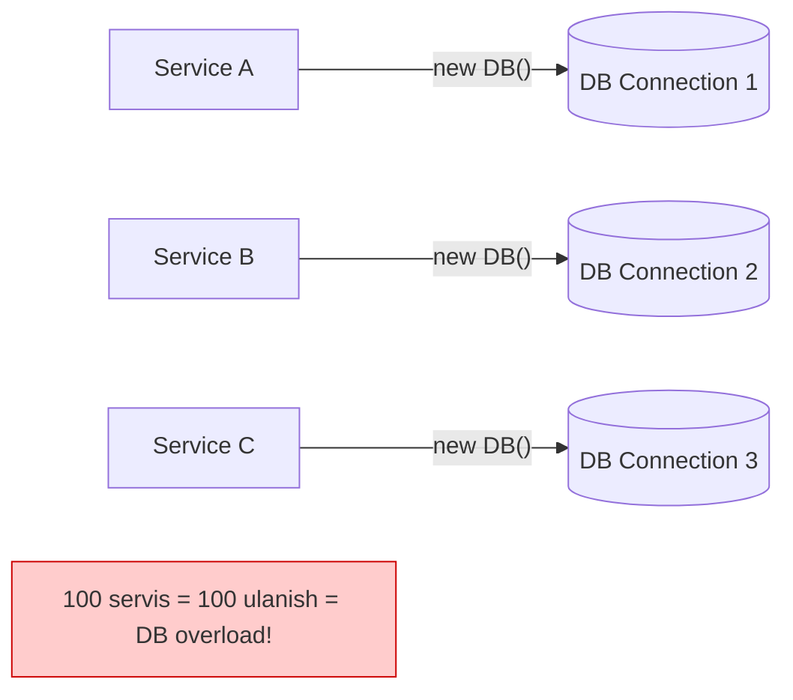
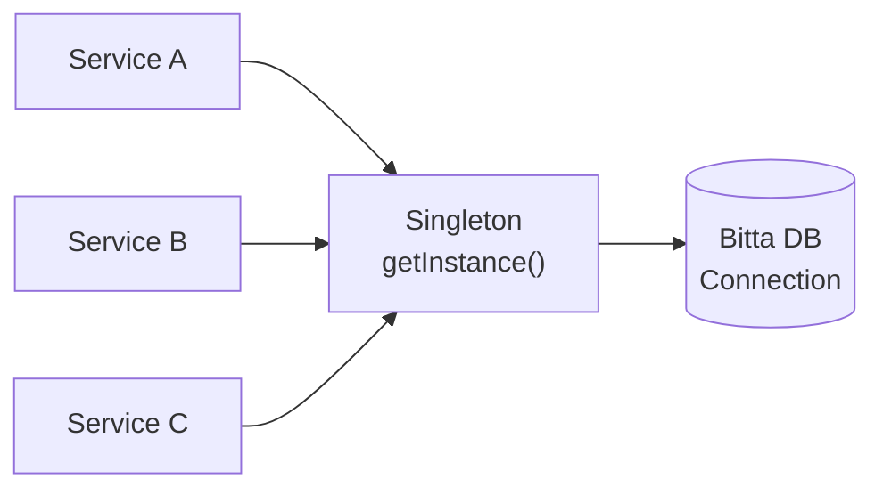
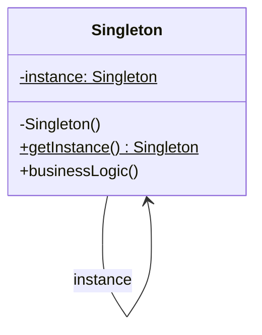

# Singleton Pattern

> Boshqa nomi: **Одиночка**

**Singleton** — creational (yaratuvchi) pattern. U class'dan **faqat bitta instance** mavjudligini kafolatlaydi va unga **global kirish nuqtasini** taqdim etadi.

---

## STEP 1 — Umumiy tushuncha

### Muammo nima edi?

Singleton bir vaqtning o'zida **ikkita** muammoni hal qiladi (shu bilan Single Responsibility printsipini buzadi):

**1. Class'dan faqat bitta instance bo'lishini kafolatlash.**

Bu ko'pincha umumiy resursga kirishda kerak: database, fayl, konfiguratsiya. Siz obyekt yaratdingiz, birozdan keyin yana yaratmoqchisiz — aslida **eski obyektni olish** kerak, yangisini emas. Oddiy constructor bilan buni qilib bo'lmaydi: constructor **har doim yangi obyekt** qaytaradi.

**2. Global kirish nuqtasi berish.**

Oddiy global o'zgaruvchi bilan farqi: global o'zgaruvchi yozishdan himoyalanmagan — istalgan kod uni bilib-bilmay almashtirib yuborishi mumkin. Singleton esa instance'ni almashtirib bo'lmasligini kafolatlaydi va №1 muammoni yechuvchi kodni ham bitta joyda jamlaydi.

Qiziq fakt: pattern shu qadar mashhurki, faqat bittasini yechadigan class'larni ham "singleton" deb atashadi.

### Pattern ishlatilmasa qanday muammolar bo'ladi?



| Muammo | Oqibat |
|--------|--------|
| Har chaqiruvda yangi connection/obyekt | Resurslar behuda sarflanadi, limitlar tugaydi |
| Global o'zgaruvchi ishlatilsa | Istalgan kod uni qayta yozib qo'yishi mumkin |
| Bir nechta parallel instance | Holatlar (cache, config) bir-biridan farq qilib ketadi |
| Multithreading nazorati yo'q | Race condition: bir vaqtda ikkita instance yaratiladi |

### Yechim nima?

Barcha Singleton implementatsiyalari ikki umumiy qadamga tayanadi:

1. **Default constructor'ni yashirish** (private qilish) — boshqa kod `new` bilan obyekt yarata olmasin.
2. Constructor'ni chaqiruvchi **static yaratuvchi metod** (`getInstance`) e'lon qilish. Bu metod birinchi chaqiriqda obyektni yaratib **static maydonga saqlaydi**, keyingi barcha chaqiriqlarda **o'sha obyektni** qaytaradi.

Singleton class'iga kirish bor joyda `getInstance`'ga ham kirish bor — istalgan nuqtadan chaqirilsa ham, natija bitta obyekt.



### Hayotiy analogiya

**Hukumat** — Singleton'ning yaxshi misoli. Davlatda faqat bitta rasmiy hukumat bo'ladi. Uning tarkibida kim o'tirishidan qat'i nazar, "N davlati hukumati" — barcha uchun yagona global kirish nuqtasi.

### Asosiy qoida

> **Constructor'ni yashir, obyektni static metod orqali ber: birinchi chaqiriqda yarat, qolganlarida — mavjudini qaytar.**

### Struktura



1. **Singleton** o'z class'ining yagona instance'ini qaytaruvchi static `getInstance` metodini aniqlaydi. Constructor client'lardan yashiriladi — `getInstance` obyekt olishning **yagona yo'li** bo'lishi kerak.

> ⚠️ **Multithreading:** bir nechta thread `getInstance`'ni bir vaqtda chaqirsa, ikkita instance yaratilib qolishi mumkin. Shuning uchun metod ichida lock + qayta tekshirish (double-checked locking) yoki tildagi maxsus mexanizm (Go'da `sync.Once`) ishlatiladi.

---

## STEP 2 — Python misoli

### ❌ Yomon misol (pattern'siz)

```python
class Database:
    def __init__(self):
        print("Yangi DB connection ochildi!")  # har safar!


# ❌ Har chaqiruvchi o'zi yaratadi:
db1 = Database()   # Yangi DB connection ochildi!
db2 = Database()   # Yangi DB connection ochildi! — IKKINCHI ulanish!
print(id(db1) == id(db2))  # False — ikki xil obyekt

# ❌ Global o'zgaruvchi bilan "yechim":
db = Database()
# ...boshqa modul bilmasdan almashtirib qo'yadi:
db = Database()  # hech kim to'sa olmaydi
```

### ✅ Singleton bilan (oddiy, metaclass orqali)

`t/Python/src/Singleton/Conceptual/NonThreadSafe` misoli (izohlar o'zbekchada):

```python
class SingletonMeta(type):
    """
    Python'da Singleton'ni turlicha qurish mumkin: bazaviy class,
    decorator, metaclass. Bu yerda metaclass ishlatilgan —
    bu maqsad uchun eng mos usul.
    """

    _instances = {}

    def __call__(cls, *args, **kwargs):
        # Bu implementatsiya __init__ argumentlari keyinchalik
        # o'zgarishi mumkinligini hisobga olmaydi.
        if cls not in cls._instances:
            instance = super().__call__(*args, **kwargs)
            cls._instances[cls] = instance
        return cls._instances[cls]


class Singleton(metaclass=SingletonMeta):
    def some_business_logic(self):
        # Har qanday singleton'da instance ustida bajariladigan
        # qandaydir biznes-logika bo'lishi kerak.
        ...


if __name__ == "__main__":
    s1 = Singleton()
    s2 = Singleton()

    if id(s1) == id(s2):
        print("Singleton works, both variables contain the same instance.")
    else:
        print("Singleton failed, variables contain different instances.")
```

**Output:**

```
Singleton works, both variables contain the same instance.
```

### ✅ Thread-safe Singleton (Lock bilan)

Yuqoridagi variant **thread-safe emas**: ikki thread `if cls not in cls._instances` shartidan bir vaqtda o'tib ketishi mumkin. `t/Python/src/Singleton/Conceptual/ThreadSafe` misoli (izohlar o'zbekchada):

```python
from threading import Lock, Thread


class SingletonMeta(type):
    """Singleton'ning thread-safe implementatsiyasi."""

    _instances = {}

    _lock: Lock = Lock()
    # Birinchi kirishda thread'larni sinxronlash uchun lock obyekti.

    def __call__(cls, *args, **kwargs):
        # Dastur endigina ishga tushdi deylik: singleton hali yaratilmagan,
        # bir nechta thread shu joyga bir vaqtda yetib kelishi mumkin.
        # Eng tezkori lock'ni oladi va ichkariga kiradi, qolganlari kutadi.
        with cls._lock:
            # Birinchi thread shu shartdan o'tib obyektni yaratadi.
            # U lock'ni bo'shatgach, navbatdagi thread kiradi — lekin
            # instance allaqachon mavjud, shart ishlamaydi va
            # yangi obyekt yaratilmaydi.
            if cls not in cls._instances:
                instance = super().__call__(*args, **kwargs)
                cls._instances[cls] = instance
        return cls._instances[cls]


class Singleton(metaclass=SingletonMeta):
    value: str = None
    # Singleton chindan ishlashini isbotlash uchun maydon.

    def __init__(self, value: str) -> None:
        self.value = value


def test_singleton(value: str) -> None:
    singleton = Singleton(value)
    print(singleton.value)


if __name__ == "__main__":
    print("If you see the same value, then singleton was reused (yay!)\n"
          "If you see different values, "
          "then 2 singletons were created (booo!!)\n\n"
          "RESULT:\n")

    process1 = Thread(target=test_singleton, args=("FOO",))
    process2 = Thread(target=test_singleton, args=("BAR",))
    process1.start()
    process2.start()
```

**Output:**

```
If you see the same value, then singleton was reused (yay!)
If you see different values, then 2 singletons were created (booo!!)

RESULT:

FOO
FOO
```

Ikkala thread ham `FOO` ko'rdi — ikkinchi thread (`BAR`) yangi obyekt yarata olmadi, mavjudini oldi.

---

## STEP 3 — Go misoli

### ❌ Yomon misol (pattern'siz)

```go
package main

type single struct {
}

var singleInstance *single

// ❌ Hech qanday himoya yo'q
func getInstance() *single {
	if singleInstance == nil {
		// 30 ta goroutine bu yerga BIR VAQTDA yetib kelsa,
		// bir nechtasi shartdan o'tib, HAR BIRI yangi instance
		// yaratadi — race condition!
		singleInstance = &single{}
	}
	return singleInstance
}
```

### ✅ 1-variant: Mutex + double-check

`t/Go/singleton/default` misoli (izohlar o'zbekchada):

```go
// single.go
package main

import (
	"fmt"
	"sync"
)

var lock = &sync.Mutex{}

type single struct {
}

var singleInstance *single

func getInstance() *single {
	if singleInstance == nil {
		// Lock faqat instance hali yo'q bo'lgandagina olinadi —
		// har chaqiruvda emas (tezlik uchun).
		lock.Lock()
		defer lock.Unlock()
		// DOUBLE-CHECK: biz lock kutib turganimizda boshqa goroutine
		// obyektni yaratib qo'ygan bo'lishi mumkin — qayta tekshiramiz.
		if singleInstance == nil {
			fmt.Println("Creating single instance now.")
			singleInstance = &single{}
		} else {
			fmt.Println("Single instance already created.")
		}
	} else {
		fmt.Println("Single instance already created.")
	}

	return singleInstance
}
```

```go
// main.go — 30 ta goroutine bir vaqtda chaqiradi
package main

import (
	"fmt"
)

func main() {

	for i := 0; i < 30; i++ {
		go getInstance()
	}

	// Scanln goroutine'lar tugashini kutish uchun
	fmt.Scanln()
}
```

**Output:**

```
Creating single instance now.
Single instance already created.
Single instance already created.
... (qolgan 27 marta ham "already created")
```

30 ta parallel goroutine'dan **faqat bittasi** instance yaratdi.

### ✅ 2-variant: sync.Once (Go'ning idiomatik usuli)

`t/Go/singleton/syncOnce` misoli (izohlar o'zbekchada):

```go
// syncOnce.go
package main

import (
	"fmt"
	"sync"
)

var once sync.Once

type single struct {
}

var singleInstance *single

func getInstance() *single {
	if singleInstance == nil {
		// sync.Once ichidagi funksiya butun dastur davomida
		// FAQAT BIR MARTA bajarilishini o'zi kafolatlaydi —
		// lock va double-check yozish shart emas.
		once.Do(
			func() {
				fmt.Println("Creating single instance now.")
				singleInstance = &single{}
			})
	} else {
		fmt.Println("Single instance already created.")
	}

	return singleInstance
}
```

**Output:**

```
Creating single instance now.
Single instance already created.
Single instance already created.
```

**Qaysi birini tanlash?** Go'da deyarli har doim **`sync.Once`** — qisqa, xatosiz va idiomatik. Mutex + double-check varianti pattern mexanikasini tushunish uchun foydali.

---

## Qachon ishlatish kerak?

**1. Dasturda biror class'dan barcha client'lar uchun yagona instance bo'lishi kerak bo'lsa** (masalan, dasturning turli qismlaridan bitta database'ga kirish).

Singleton maxsus metoddan boshqa barcha yaratish yo'llarini yopib qo'yadi: metod yo yangi obyekt yaratadi, yo mavjudini qaytaradi.

**2. Global o'zgaruvchilar ustidan qattiqroq nazorat kerak bo'lsa.**

Global o'zgaruvchidan farqli, Singleton yaratilgan instance'ni boshqa kod almashtira olmasligini kafolatlaydi. Kerak bo'lsa, keyinchalik bu cheklovni bitta joyda (`getInstance` ichida) o'zgartirib, bir nechta instance'ga ruxsat berish ham mumkin.

---

## Implementatsiya qadamlari

1. Class'ga yagona obyektni saqlaydigan **private static maydon** qo'shing.
2. Singleton'ni oluvchi **static yaratuvchi metod** (`getInstance`) e'lon qiling.
3. Metod ichida **lazy initialization** qiling: birinchi chaqiriqda obyekt yaratilsin, keyingilarida mavjudi qaytarilsin.
4. Class constructor'ini **private** qiling.
5. Client koddagi barcha constructor chaqiruvlarini `getInstance` chaqiruviga almashtiring.

---

## Afzalliklar va kamchiliklar

| ✅ Afzalliklar | ❌ Kamchiliklar |
|---------------|----------------|
| Yagona instance kafolati | **Single Responsibility buziladi** (2 ta vazifa: yaratish nazorati + biznes-logika) |
| Unga global kirish nuqtasi | **Yomon dizaynni niqoblaydi** — komponentlar bir-biri haqida ko'p bilib qoladi |
| Kechiktirilgan (lazy) initsializatsiya | **Multithreading muammolari** — maxsus himoya kerak |
| | **Unit-testni qiyinlashtiradi** — doim mock yaratishga majbur qiladi |

---

## Boshqa patternlar bilan aloqasi

- **Facade**'ni Singleton qilib qurish mumkin — odatda bitta facade obyekti yetarli.
- **Flyweight** Singleton'ga o'xshab ketishi mumkin (obyektlar soni bittagacha qisqargan holda), lekin ikki tub farq bor:
  1. Flyweight obyektlari **bir nechta** bo'lishi mumkin, Singleton — bitta;
  2. Flyweight obyektlari **immutable** (o'zgarmas), Singleton esa holatini o'zgartira oladi.
- **Abstract Factory**, **Builder** va **Prototype** — barchasini Singleton sifatida implementatsiya qilish mumkin.

---

## Go'da real-world misollar

### Konfiguratsiya Singleton

```go
package config

import (
    "encoding/json"
    "os"
    "sync"
)

type Config struct {
    DBUrl     string `json:"db_url"`
    RedisAddr string `json:"redis_addr"`
    Port      int    `json:"port"`
    Debug     bool   `json:"debug"`
}

var (
    cfg  *Config
    once sync.Once
)

func Get() *Config {
    once.Do(func() {
        f, err := os.Open("config.json")
        if err != nil {
            cfg = &Config{Port: 8080} // default
            return
        }
        defer f.Close()
        cfg = &Config{}
        json.NewDecoder(f).Decode(cfg)
    })
    return cfg
}

// Ishlatish:
// port := config.Get().Port
```

### Logger Singleton

```go
package logger

import (
    "log/slog"
    "os"
    "sync"
)

var (
    log  *slog.Logger
    once sync.Once
)

func Get() *slog.Logger {
    once.Do(func() {
        handler := slog.NewJSONHandler(os.Stdout, &slog.HandlerOptions{
            Level: slog.LevelInfo,
        })
        log = slog.New(handler)
    })
    return log
}

// Ishlatish:
// logger.Get().Info("server started", "port", 8080)
```

### Test muammosi va Dependency Injection yechimi

```go
// ❌ Test qilish qiyin:
func TestSomething(t *testing.T) {
    db := GetInstance() // real DB'ga ulanadi — test uchun yomon!
}

// ✅ Interface orqali inject qiling:
type DBInterface interface {
    Query(string, ...any) (*sql.Rows, error)
}

type UserService struct {
    db DBInterface // Singleton yoki Mock
}

// Production:
svc := &UserService{db: singleton.GetInstance()}

// Test:
svc := &UserService{db: &MockDB{}}
```

### Qachon Singleton, qachon yo'q?

| ✅ Ishlatish mumkin | ❌ Ishlatmaslik kerak |
|--------------------|----------------------|
| DB connection pool | Business logic |
| Logger | Servis obyektlari |
| Konfiguratsiya | Repository'lar |
| Cache client | Controller'lar |

---

## Xulosa

### Eslab qol

- Singleton = **yashirin constructor + static `getInstance`**: birinchi chaqiriqda yaratadi, keyin doim o'shani qaytaradi.
- Bu **ikki vazifani** birlashtiradi (yagona instance + global access) — shuning uchun SRP'ni buzadi va ehtiyotkorlik talab qiladi.
- Multithread muhitda **himoyasiz variant ishlamaydi**: Python'da `Lock`, Go'da `sync.Once` (yoki mutex + double-check).
- Go'da idiomatik yechim — **`sync.Once`**.
- Singleton'ni to'g'ridan-to'g'ri chaqirmasdan, **interface orqali inject** qilsangiz — testlar mock bilan ishlaydi.
- Ko'p Singleton — **yomon dizayn belgisi**: aslida komponentga dependency sifatida berilishi kerak bo'lgan narsani global qilib yuborgan bo'lishingiz mumkin.

### Amaliyot

1. `t/Go/singleton/default`'dagi double-check'ning **ichki** `if`'ini olib tashlab, `go run -race` bilan ishga tushiring — nima o'zgaradi?
2. Yomon misoldagi himoyasiz variantni 30 goroutine bilan `-race` flag'ida sinang va race detector xabarini o'qing.
3. Python'dagi NonThreadSafe metaclass variantini 2 ta thread bilan sindirishga urinib ko'ring (hint: `__init__`'ga `time.sleep` qo'ying).
4. Logger Singleton'ni `DBInterface` misolidagidek interface orqali inject qilinadigan qilib qayta yozing.

---

## Keyingi qadam

Creational patternlar tugadi! 🎉

→ [../3. Structural (tuzulmaviy)/0. README.md](../3.%20Structural%20(tuzulmaviy)/0.%20README.md) — endi obyektlarni **birlashtirish** patternlariga o'tamiz.
