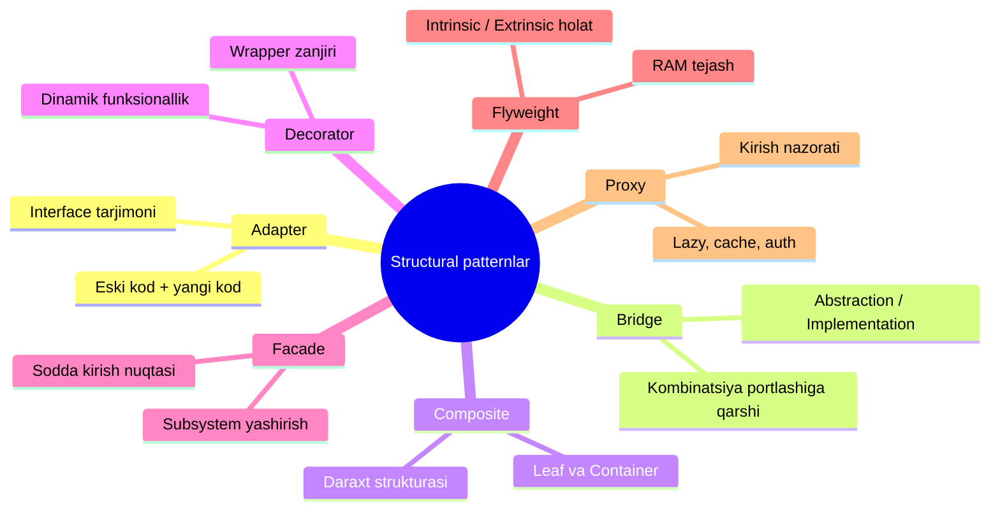

# Structural (Tuzilmaviy) Patternlar

**Structural patternlar** — class va obyektlardan **qulay qo'llab-quvvatlanadigan, kengaytiriladigan tuzilmalar (ierarxiyalar)** qurish uchun javob beradigan design patternlar guruhi.

Creational patternlar obyektlarni **yaratish**ga javob bersa, structural patternlar tayyor obyektlarni **bir-biriga bog'lash va birlashtirish**ga javob beradi.

## 7 ta pattern

| # | Pattern | Bir jumlada |
|---|---------|-------------|
| 1 | [Adapter](1.%20Adapter.md) | Mos kelmaydigan interface'li obyektlarning birga ishlashiga imkon beradi |
| 2 | [Bridge](2.%20Bridge.md) | Class'larni ikkita alohida ierarxiyaga — abstraction va implementation'ga ajratib, ularni mustaqil o'zgartirish imkonini beradi |
| 3 | [Composite](3.%20Composite.md) | Ko'plab obyektlarni daraxt strukturasiga guruhlab, u bilan yagona obyekt kabi ishlash imkonini beradi |
| 4 | [Decorator](4.%20Decorator.md) | Obyektlarga yangi funksionallikni dinamik qo'shadi — ularni foydali "o'ram"larga (wrapper) o'rab |
| 5 | [Facade](5.%20Facade.md) | Murakkab class'lar tizimi, library yoki framework'ka sodda interface beradi |
| 6 | [Flyweight](6.%20Flyweight.md) | Obyektlarning umumiy holatini ulashish orqali RAM'ga ko'proq obyekt sig'diradi |
| 7 | [Proxy](7.%20Proxy.md) | Real obyekt o'rniga uning "o'rinbosari"ni qo'yadi — chaqiruvlarni ushlab, originalgacha yoki undan keyin biror ish bajaradi |

## Wrapper'lar oilasini farqlash

To'rtta pattern obyektni "o'rash" g'oyasiga qurilgan — ularni adashtirmaslik muhim:

| Pattern | Interface | Nima qiladi |
|---------|-----------|-------------|
| **Adapter** | **Boshqa** interface beradi | Mos kelmagan interface'ni tarjima qiladi |
| **Decorator** | **Xuddi shu** (yoki kengaytirilgan) interface | Yangi xatti-harakat qo'shadi, rekursiv o'rash mumkin |
| **Proxy** | **Xuddi shu** interface | Kirishni nazorat qiladi, obyekt hayotini o'zi boshqaradi |
| **Facade** | **Yangi, soddalashgan** interface | Bitta class emas, butun subsystem'ni o'raydi |

## O'qish tartibi

1 → 7 tartibda o'qish tavsiya etiladi. Adapter — eng sodda "o'ram", Decorator/Proxy uning rivojlangan qarindoshlari, Flyweight esa alohida turadigan optimallashtirish pattern'i.

← [Creational patternlar](../2.%20Creational%20(yaratuvchi)/0.%20README.md)
