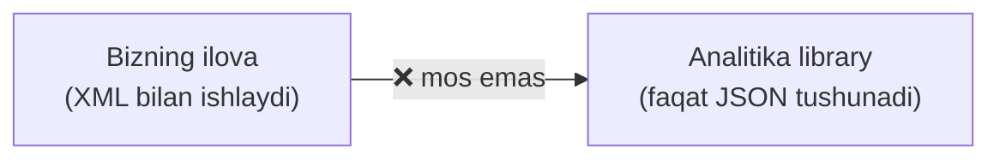
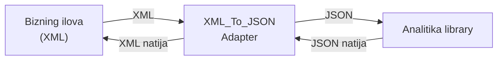
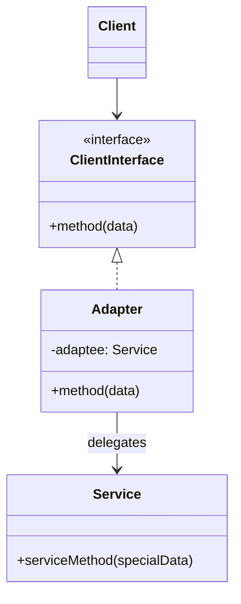

# Adapter Pattern

> Boshqa nomlari: **Wrapper**, **O'ram**, **Адаптер**

**Adapter** — structural (tuzilmaviy) pattern. U **mos kelmaydigan interface'larga ega obyektlarning birga ishlashiga** imkon beradi.

---

## STEP 1 — Umumiy tushuncha

### Muammo nima edi?

Tasavvur qiling: siz birja savdosi ilovasini yozyapsiz. Ilova bir nechta manbadan birja kotirovkalarini **XML** formatida yuklab olib, chiroyli grafiklar chizadi.

Bir kuni ilovani yaxshilash uchun tayyor **analitika library**sini ulamoqchi bo'lasiz. Lekin muammo: library faqat **JSON** formatida ishlaydi — sizning XML'ingizga mos kelmaydi.

Library'ni XML'ga moslab qayta yozsangiz bo'lardi, lekin:
- bu library'ga bog'liq boshqa mavjud kodni buzib qo'yishi mumkin;
- umuman, library'ning source kodiga kirish huquqingiz **bo'lmasligi** ham mumkin (closed-source).

### Pattern ishlatilmasa qanday muammolar bo'ladi?

| Muammo | Oqibat |
|--------|--------|
| Format/interface mos kelmagani uchun tayyor library ishlatilmaydi | G'ildirakni qayta ixtiro qilishga majbursiz |
| Konvertatsiya kodi client'ning har bir joyiga yoziladi | Takrorlanish, xatolar |
| Client konkret servis class'iga bog'lanadi | Servis almashsa — butun kod o'zgaradi |
| 3rd-party kodni o'zgartirishga urinish | Mavjud bog'liq kod sinadi yoki umuman imkonsiz |



### Yechim nima?

**Adapter** — interface yoki ma'lumotlarni bir obyektdan ikkinchisiga tushunarli ko'rinishga o'giradigan **"tarjimon" obyekt**.

Adapter obyektlardan birini **o'raydi (wrap)**, shunda ikkinchi obyekt birinchisining mavjudligini sezmaydi ham. Masalan, metrlarda ishlaydigan obyektni futlarga o'giradigan adapter bilan o'rash mumkin.

Adapter faqat ma'lumot formatini emas, **turli interface'li obyektlarning hamkorligini** ham ta'minlaydi. Bu shunday ishlaydi:

1. Adapter obyektlardan biriga **mos interface**'ga ega;
2. shuning uchun o'sha obyekt adapter metodlarini bemalol chaqira oladi;
3. adapter chaqiruvni qabul qilib, uni **ikkinchi obyekt tushunadigan format va tartibda** unga uzatadi.

Birja ilovasida `XML_To_JSON_Adapter` class'ini yaratasiz: kodingiz unga XML'da murojaat qiladi, adapter ma'lumotni JSON'ga o'girib, o'ralgan analitika obyektiga uzatadi. Ba'zan hatto **ikki tomonlama** adapter ham qurish mumkin.



### Hayotiy analogiya

Chet elga birinchi marta uchганingizda noutbukni quvvatlashda syurpriz kutadi: **rozetka standartlari** mamlakatlarda har xil. Yevropa zaryadkasi AQShda **adapter**siz ishlamaydi — adapter bir turdagi vilkani boshqa turdagi rozetkaga ulash imkonini beradi.

### Asosiy qoida

> **Mos kelmaydigan ikki interface'ni o'zgartirma — o'rtasiga tarjimon (adapter) qo'y. Client o'z interface'i bilan ishlayveradi, servis ham o'zgarishsiz qoladi.**

### Struktura (Object Adapter)

Bu implementatsiya **kompozitsiya**ga asoslanadi: adapter servis obyektini o'z ichiga oladi (havola saqlaydi). Barcha tillarda ishlaydi.



1. **Client** — dasturning mavjud biznes-logikasini o'z ichiga olgan class.
2. **Client Interface** — client boshqa class'lar bilan ishlashi uchun protokolni tavsiflaydi.
3. **Service** — foydali (odatda 3rd-party) class. Client uni to'g'ridan-to'g'ri ishlata olmaydi — interface'i notanish.
4. **Adapter** — ham client, ham servis bilan ishlay oladigan class: client interface'ini implementatsiya qiladi va servis obyektiga havola saqlaydi. Client'dan chaqiruvlarni olib, ularni servisga **to'g'ri formatda** uzatadi.
5. Client adapter bilan interface orqali ishlagani uchun **konkret adapter class'iga bog'lanmaydi** — servis interface'i o'zgarsa (masalan, library yangi versiyasi chiqsa), client kodni buzmasdan yangi adapter qo'shish mumkin.

> **Class Adapter** ham bor: unda adapter ikkala class'dan **meros oladi** (o'ralgan obyekt kerak emas). Bu faqat multiple inheritance'ni qo'llovchi tillarda (C++) mumkin — Python'da qisman, Go'da esa yo'q.

---

## STEP 2 — Python misoli

### ❌ Yomon misol (pattern'siz)

```python
class Adaptee:
    """3rd-party class — interface'i bizga notanish formatda."""
    def specific_request(self) -> str:
        return ".eetpadA eht fo roivaheb laicepS"


def client_code():
    adaptee = Adaptee()
    # ❌ Client servisning "g'alati" interface'ini bilishga majbur
    # va tarjima logikasi client ichiga yoziladi:
    raw = adaptee.specific_request()
    result = raw[::-1]  # teskari string'ni to'g'rilash
    print(result)

# Muammolar:
# 1) har bir client shu konvertatsiyani o'zi qilishi kerak (takror);
# 2) client Adaptee'ning konkret class'iga bog'landi;
# 3) yangi servis kelsa — hamma client kod o'zgaradi.
```

### ✅ Adapter bilan

`t/Python/src/Adapter/Conceptual/object` misoli (izohlar o'zbekchada):

```python
class Target:
    """
    Target — client kodi ishlay oladigan interface'ni e'lon qiladi.
    """

    def request(self) -> str:
        return "Target: The default target's behavior."


class Adaptee:
    """
    Adaptee (moslashtiriluvchi) class'da foydali xatti-harakat bor,
    lekin uning interface'i mavjud client kodga mos kelmaydi.
    Client uni ishlatishdan oldin "qayta ishlov" kerak.
    """

    def specific_request(self) -> str:
        return ".eetpadA eht fo roivaheb laicepS"


class Adapter(Target):
    """
    Adapter — Adaptee interface'ini Target interface'iga
    KOMPOZITSIYA orqali moslashtiradi.
    """

    def __init__(self, adaptee: Adaptee) -> None:
        self.adaptee = adaptee

    def request(self) -> str:
        # Tarjima logikasi BITTA joyda — adapter ichida
        return f"Adapter: (TRANSLATED) {self.adaptee.specific_request()[::-1]}"


def client_code(target: Target) -> None:
    # Client Target interface'ini ishlatadigan HAMMA class bilan ishlaydi
    print(target.request(), end="")


if __name__ == "__main__":
    print("Client: I can work just fine with the Target objects:")
    target = Target()
    client_code(target)
    print("\n")

    adaptee = Adaptee()
    print("Client: The Adaptee class has a weird interface. "
          "See, I don't understand it:")
    print(f"Adaptee: {adaptee.specific_request()}", end="\n\n")

    print("Client: But I can work with it via the Adapter:")
    adapter = Adapter(adaptee)
    client_code(adapter)
```

**Output:**

```
Client: I can work just fine with the Target objects:
Target: The default target's behavior.

Client: The Adaptee class has a weird interface. See, I don't understand it:
Adaptee: .eetpadA eht fo roivaheb laicepS

Client: But I can work with it via the Adapter:
Adapter: (TRANSLATED) Special behavior of the Adaptee.
```

**Nima yaxshilandi?** `client_code` faqat `Target`'ni biladi; tarjima logikasi bitta joyda; `Adaptee` umuman o'zgarmadi.

---

## STEP 3 — Go misoli

### ❌ Yomon misol (pattern'siz)

```go
package main

// ❌ Client har bir kompyuter turini alohida bilishga majbur
func (c *Client) InsertConnector(machine interface{}) {
	switch m := machine.(type) {
	case *Mac:
		m.InsertIntoLightningPort()
	case *Windows:
		// Windows'da Lightning port yo'q — client O'ZI
		// konvertatsiya bilan shug'ullanadi:
		fmt.Println("Converting lightning to USB...")
		m.insertIntoUSBPort()
	}
	// Yangi tur (Linux?) qo'shilsa — client kod YANA o'zgaradi,
	// type switch o'sib boraveradi
}
```

### ✅ Adapter bilan

`t/Go/adapter` misoli — client Lightning connector'ni kutadi, Windows mashinasida esa faqat USB port bor (izohlar o'zbekchada):

```go
// computer.go — Client Interface: client shu protokol bilan ishlaydi
package main

type Computer interface {
	InsertIntoLightningPort()
}
```

```go
// client.go — Client: faqat Computer interface'ini biladi
package main

import "fmt"

type Client struct {
}

func (c *Client) InsertLightningConnectorIntoComputer(com Computer) {
	fmt.Println("Client inserts Lightning connector into computer.")
	com.InsertIntoLightningPort()
}
```

```go
// mac.go — interface'ga tabiiy mos keladigan class (adapter kerak emas)
package main

import "fmt"

type Mac struct {
}

func (m *Mac) InsertIntoLightningPort() {
	fmt.Println("Lightning connector is plugged into mac machine.")
}
```

```go
// windows.go — Service (Adaptee): interface'i mos KELMAYDI —
// unda faqat USB port bor
package main

import "fmt"

type Windows struct{}

func (w *Windows) insertIntoUSBPort() {
	fmt.Println("USB connector is plugged into windows machine.")
}
```

```go
// windowsAdapter.go — Adapter: Computer interface'ini
// implementatsiya qiladi va ichida Windows'ni o'raydi
package main

import "fmt"

type WindowsAdapter struct {
	windowMachine *Windows
}

func (w *WindowsAdapter) InsertIntoLightningPort() {
	// Tarjima: Lightning signalni USB'ga o'girib, so'ng
	// o'ralgan obyektga delegatsiya qilamiz
	fmt.Println("Adapter converts Lightning signal to USB.")
	w.windowMachine.insertIntoUSBPort()
}
```

```go
// main.go
package main

func main() {

	client := &Client{}
	mac := &Mac{}

	client.InsertLightningConnectorIntoComputer(mac)

	windowsMachine := &Windows{}
	windowsMachineAdapter := &WindowsAdapter{
		windowMachine: windowsMachine,
	}

	// Client uchun farqi yo'q — u adapter bilan ham xuddi
	// Mac bilan ishlagandek ishlaydi
	client.InsertLightningConnectorIntoComputer(windowsMachineAdapter)
}
```

**Output:**

```
Client inserts Lightning connector into computer.
Lightning connector is plugged into mac machine.
Client inserts Lightning connector into computer.
Adapter converts Lightning signal to USB.
USB connector is plugged into windows machine.
```

**Nima yaxshilandi?**
- `Client` na `Windows`'ni, na konvertatsiyani biladi — faqat `Computer` interface'ini;
- `Windows` class'i **umuman o'zgarmadi** (3rd-party bo'lsa ham ishlaydi);
- yangi mos kelmaydigan tur = faqat yangi adapter.

---

## Qachon ishlatish kerak?

**1. 3rd-party class'ni ishlatmoqchisiz, lekin uning interface'i ilovangizning qolgan qismiga mos kelmasa.**

Adapter ilova chaqiruvlarini 3rd-party class tushunadigan formatga aylantirib beruvchi "qatlama" obyekt yaratadi.

**2. Bir nechta mavjud subclass'ni ishlatish kerak, lekin ularda qandaydir umumiy funksionallik yetishmasa (va superclass'ni kengaytirib bo'lmasa).**

Har bir subclass'ga yana bittadan subclass ochish mumkin edi — lekin bu kodni ikkala shoxda ham takrorlashga olib keladi. Elegantroq yechim: yetishmayotgan funksionallikni adapter'ga joylashtirib, uni superclass bilan ishlaydigan qilish — shunda u ierarxiyaning **barcha** subclass'lari bilan ishlaydi (bu yechim Decorator'ga juda o'xshab ketadi).

---

## Implementatsiya qadamlari

1. Interface'lari mos kelmaydigan kamida ikkita class borligiga ishonch hosil qiling: o'zgartirib bo'lmaydigan **servis** (3rd-party yoki unga boshqa kod bog'liq) va undan foydalanmoqchi bo'lgan **client**(lar).
2. **Client interface**'ini tavsiflang — ilova class'lari servis bilan qanday ishlashni xohlaydi.
3. Shu interface'ni implementatsiya qiluvchi **adapter class** yarating.
4. Adapter'ga servis obyektiga **havola saqlaydigan maydon** qo'shing (odatda constructor orqali beriladi; juda sodda holatlarda metod parametri orqali ham uzatsa bo'ladi).
5. Client interface'ining barcha metodlarini adapter'da implementatsiya qiling: adapter faqat **tarjima** bilan shug'ullansin, asosiy ishni servisga **delegatsiya** qilsin.
6. Ilova adapter'ni faqat **client interface orqali** ishlatsin — shunda kelajakda adapterlarni erkin almashtirish/qo'shish mumkin bo'ladi.

---

## Afzalliklar va kamchiliklar

| ✅ Afzalliklar | ❌ Kamchiliklar |
|---------------|----------------|
| Interface'larni o'zaro moslashtirish tafsilotlarini client'dan ajratadi va yashiradi (Single Responsibility) | Qo'shimcha class'lar hisobiga kod murakkablashadi |
| Client kodni o'zgartirmasdan yangi adapterlar qo'shish mumkin (Open/Closed) | Ba'zan servisni o'zini o'zgartirish soddaroq bo'lishi mumkin |

---

## Boshqa patternlar bilan aloqasi

- **Bridge** oldindan loyihalanadi — ilovaning katta qismlarini mustaqil rivojlantirish uchun. **Adapter** esa keyin (post-factum) qo'llanadi — mos kelmaydigan class'larni birga ishlatish uchun.
- **Adapter** mavjud obyektga **butunlay boshqa** interface beradi; **Proxy** interface'ni **o'zgartirmaydi**; **Decorator** interface'ni saqlaydi yoki **kengaytiradi** (va rekursiv o'rashni qo'llaydi, Adapter esa yo'q).
- **Facade** yangi interface belgilaydi, Adapter esa **eskisini qayta ishlatadi**. Adapter bitta class'ni, Facade butun subsystem'ni o'raydi.
- **Bridge, Strategy, State** (va qisman Adapter) — bir-biriga o'xshash strukturaga ega: hammasi kompozitsiya + delegatsiyaga qurilgan. Lekin ular **har xil muammolarni** yechadi — pattern bu faqat kod tuzilishi emas, balki uni keltirib chiqargan muammo tavsifi hamdir.

---

## Go'da real-world misollar

### Legacy payment tizimi (XML) → yangi interface (JSON)

```go
// Bizning interface (yangi)
type PaymentProcessor interface {
    ProcessPayment(amount float64, currency string) (string, error)
}

// Eski tizim (o'zgartirib bo'lmaydi) — faqat XML tushunadi
type LegacyPaymentSystem struct{}

func (l *LegacyPaymentSystem) ProcessXML(xmlData string) (string, error) { ... }

// Adapter: PaymentProcessor'ni implementatsiya qiladi
type LegacyPaymentAdapter struct {
    legacy *LegacyPaymentSystem
}

func (a *LegacyPaymentAdapter) ProcessPayment(amount float64, currency string) (string, error) {
    // 1. Yangi format → XML
    req := LegacyRequest{Amount: amount, Currency: currency}
    xmlBytes, err := xml.Marshal(req)
    if err != nil {
        return "", err
    }

    // 2. Eski tizimga delegatsiya
    xmlResp, err := a.legacy.ProcessXML(string(xmlBytes))
    if err != nil {
        return "", err
    }

    // 3. XML javob → JSON
    var resp LegacyResponse
    xml.Unmarshal([]byte(xmlResp), &resp)
    result, _ := json.Marshal(map[string]string{
        "tx_id":  resp.TxID,
        "status": resp.Status,
    })
    return string(result), nil
}
```

### Logger adapter (zap → umumiy Logger interface)

```go
type Logger interface {
    Info(msg string, args ...any)
    Error(msg string, args ...any)
}

// Adapter: zap.Logger'ni bizning Logger interface'ga moslashtiradi
type ZapAdapter struct {
    zap *zap.Logger
}

func (a *ZapAdapter) Info(msg string, args ...any) {
    a.zap.Info(msg, argsToZapFields(args...)...)
}

func (a *ZapAdapter) Error(msg string, args ...any) {
    a.zap.Error(msg, argsToZapFields(args...)...)
}
```

### Standart library'dagi adapterlar

Go standart library o'zi adapterlarga to'la: `http.HandlerFunc` (oddiy funksiyani `http.Handler` interface'iga moslashtiradi), `io.NopCloser` (`io.Reader` → `io.ReadCloser`), `strings.NewReader` (string → `io.Reader`).

---

## Xulosa

### Eslab qol

- Adapter = **interface tarjimoni**: client o'z interface'ida gapiradi, servis o'z interface'ida — adapter o'rtada o'giradi.
- **Hech kim o'zgarmaydi**: na client kodi, na servis kodi — faqat yangi adapter class qo'shiladi.
- Object adapter (kompozitsiya) — universal usul; class adapter (meros) faqat multiple inheritance bor tillarda.
- Adapter **post-factum** ishlatiladi (tizim allaqachon yozilgan), Bridge esa oldindan loyihalanadi.
- Belgisi: `XToYAdapter`, `Wrapper` nomli class'lar, yoki 3rd-party library atrofidagi konvertatsiya kodi.

### Amaliyot

1. `t/Go/adapter`'ga `Linux` mashinasini qo'shing (unda ham faqat USB bor) — nechta yangi fayl kerak bo'ldi, client o'zgardimi?
2. Yomon misoldagi `type switch` variantiga `Linux`'ni qo'shib, farqni solishtiring.
3. Python misolida `Adaptee2` (boshqa "g'alati" interface) yozib, unga ham adapter qiling — `client_code` o'zgarmasligiga ishonch hosil qiling.
4. O'z loyihangizda 3rd-party library to'g'ridan-to'g'ri chaqirilgan joyni toping va uni adapter ortiga yashiring.

---

## Keyingi qadam

→ [2. Bridge.md](2.%20Bridge.md)
