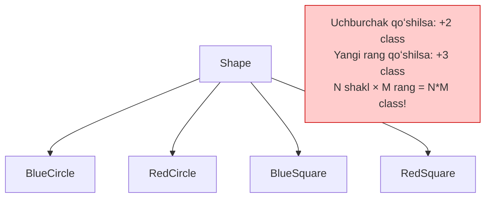
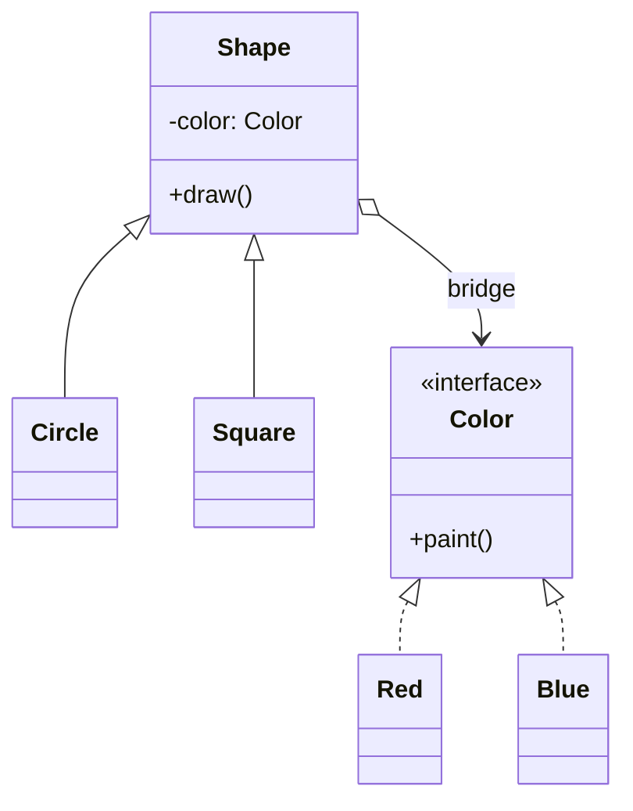
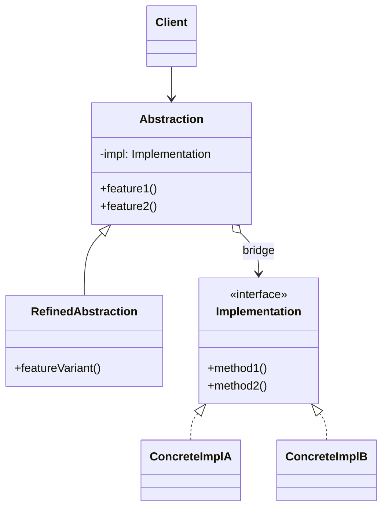

# Bridge Pattern

> Boshqa nomi: **Мост**

**Bridge** — structural (tuzilmaviy) pattern. U bir yoki bir nechta class'ni ikkita alohida ierarxiyaga — **abstraction** va **implementation**'ga ajratib, ularni **bir-biridan mustaqil o'zgartirish** imkonini beradi.

---

## STEP 1 — Umumiy tushuncha

### Muammo nima edi?

"Abstraction"? "Implementation"?! Qo'rqinchli eshitiladi. Keling, sodda misoldan boshlaymiz.

Sizda geometrik `Shape` class'i bor, uning `Circle` va `Square` subclass'lari mavjud. Endi ierarxiyani **rang** bo'yicha ham kengaytirmoqchisiz: `Red` va `Blue` shakllar kerak. Ikkalasini birlashtirish uchun 4 ta kombinatsiya-subclass ochishga to'g'ri keladi: `BlueCircle`, `RedSquare` va h.k.

Yangi shakl yoki rang qo'shilganda class'lar soni **geometrik progressiyada** o'sadi: uchburchak qo'shsangiz — har bir rang uchun bittadan, 2 ta yangi class. Undan keyin yangi rang — endi 3 ta class (har bir shakl uchun). Qanchalik uzoq — shunchalik yomon.

### Pattern ishlatilmasa qanday muammolar bo'ladi?

| Muammo | Oqibat |
|--------|--------|
| Bir class ikki mustaqil yo'nalishda (o'lchamda) kengaymoqda | Kombinatsiya-subclass'lar portlashi: N × M ta class |
| Monolit class bir nechta implementatsiya variantini ichida saqlaydi | Ulkan, tushunish qiyin kod |
| Bitta implementatsiyaga o'zgartirish | Butun class'ni tahrirlash — tasodifiy xato xavfi |
| Implementatsiya class ichiga "tikilgan" | Runtime'da almashtirib bo'lmaydi |



### Yechim nima?

Muammoning ildizi: biz shakl class'larini **bir vaqtning o'zida ikki mustaqil tekislikda** — tur bo'yicha va rang bo'yicha kengaytirmoqchimiz. Aynan shu class daraxtining o'sishiga sabab.

Bridge pattern'i **inheritance'ni kompozitsiya bilan almashtirishni** taklif qiladi: tekisliklardan birini **alohida ierarxiyaga** chiqarib, o'z holatini ichida saqlash o'rniga o'sha ierarxiya obyektiga **havola** saqlash.

Ya'ni: `Color`ni alohida class qilamiz (`Red`, `Blue` subclass'lari bilan). `Shape` class'i `Color` obyektiga havola oladi va kerak bo'lganda ishni unga delegatsiya qiladi. Shu havola — `Shape` va `Color` orasidagi **ko'prik (bridge)**. Yangi rang qo'shish uchun shakllarga tegish shart emas, va aksincha.



### Abstraction va Implementation

Bu atamalar GoF kitobida kiritilgan va haddan ortiq "akademik" — pattern aslida sodda:

- **Abstraction** — biror narsani boshqarishning **ustki qatlami**. U ishni o'zi bajarmaydi, **implementation** qatlamiga (ba'zan *platforma* deyiladi) delegatsiya qiladi.
- Bu atamalarni dasturlash tilidagi `interface` yoki `abstract class` bilan **adashtirmang** — bu boshqa narsa.

Real dasturda: abstraction — dastur GUI'si; implementation — GUI murojaat qiladigan past darajali OS API kodi. Bunday dasturni ikki mustaqil yo'nalishda rivojlantirish mumkin:

- bir nechta turdagi GUI (oddiy foydalanuvchi / admin uchun);
- bir nechta OS API'si (Windows / Linux / macOS).

Bridge'siz bunday kod GUI va API shartli operatorlari aralashgan bitta katta "kalava"ga aylanadi. Bridge esa uni ikkiga ajratadi: **abstraction** (GUI qatlami) va **implementation** (OS bilan ishlash qatlami). GUI'ni OS kodiga tegmasdan o'zgartirasiz, yangi OS qo'shishda GUI class'lariga tegmaysiz. Bitta shart: barcha implementatsiyalar **umumiy interface**'ga rioya qilishi kerak — shunda ularni almashtirsa bo'ladi.

### Asosiy qoida

> **Class ikki mustaqil yo'nalishda o'sayotgan bo'lsa — inheritance o'rniga kompozitsiya: bir yo'nalishni alohida ierarxiyaga chiqar va unga havola (ko'prik) saqla.**

### Struktura



1. **Abstraction** — boshqaruv logikasini saqlaydi; real ishni bog'langan implementation obyektiga delegatsiya qiladi.
2. **Implementation** — barcha implementatsiyalar uchun umumiy interface. Bu yerdagi metodlar abstraction'ga ochiq bo'ladi. Ikkala interface mos kelishi ham, butunlay farq qilishi ham mumkin; odatda implementation'da **primitiv operatsiyalar**, abstraction'da esa ular ustiga qurilgan **yuqori darajali operatsiyalar** yashaydi.
3. **Concrete Implementation'lar** — platformaga bog'liq kod.
4. **Refined (kengaytirilgan) Abstraction'lar** — boshqaruv logikasining variatsiyalari; ota class kabi implementatsiya bilan faqat umumiy interface orqali ishlaydi.
5. **Client** faqat abstraction bilan ishlaydi (boshlang'ich bog'lashdan tashqari — abstraction'ga qaysi implementatsiyani berish client zimmasida).

---

## STEP 2 — Python misoli

### ❌ Yomon misol (pattern'siz)

```python
# ❌ Har bir kombinatsiya uchun alohida class
class AbstractionWithImplA:
    def operation(self):
        return "Abstraction + platform A"

class AbstractionWithImplB:
    def operation(self):
        return "Abstraction + platform B"

class ExtendedAbstractionWithImplA:
    def operation(self):
        return "ExtendedAbstraction + platform A"

class ExtendedAbstractionWithImplB:
    def operation(self):
        return "ExtendedAbstraction + platform B"

# 2 abstraction × 2 platforma = 4 class.
# Uchinchi platforma qo'shilsa: +2 class. Uchinchi abstraction: +3 class.
# Kod deyarli to'liq takrorlanadi!
```

### ✅ Bridge bilan

`t/Python/src/Bridge/Conceptual` misoli (izohlar o'zbekchada):

```python
from __future__ import annotations
from abc import ABC, abstractmethod


class Abstraction:
    """
    Abstraction — ikki ierarxiyaning "boshqaruvchi" qismi uchun
    interface. U Implementation ierarxiyasidagi obyektga havola
    saqlaydi va butun real ishni unga delegatsiya qiladi.
    """

    def __init__(self, implementation: Implementation) -> None:
        self.implementation = implementation

    def operation(self) -> str:
        return (f"Abstraction: Base operation with:\n"
                f"{self.implementation.operation_implementation()}")


class ExtendedAbstraction(Abstraction):
    """
    Abstraction'ni Implementation class'lariga TEGMASDAN
    kengaytirish mumkin.
    """

    def operation(self) -> str:
        return (f"ExtendedAbstraction: Extended operation with:\n"
                f"{self.implementation.operation_implementation()}")


class Implementation(ABC):
    """
    Implementation — barcha implementatsiya class'lari uchun interface.
    U Abstraction interface'iga mos kelishi SHART EMAS — amalda ular
    butunlay boshqacha bo'lishi mumkin. Odatda Implementation faqat
    primitiv operatsiyalar beradi, Abstraction esa ular asosida
    yuqori darajali operatsiyalar quradi.
    """

    @abstractmethod
    def operation_implementation(self) -> str:
        pass


# Har bir Concrete Implementation ma'lum platformaga mos keladi
# va Implementation interface'ini shu platforma API'sida bajaradi.

class ConcreteImplementationA(Implementation):
    def operation_implementation(self) -> str:
        return "ConcreteImplementationA: Here's the result on the platform A."


class ConcreteImplementationB(Implementation):
    def operation_implementation(self) -> str:
        return "ConcreteImplementationB: Here's the result on the platform B."


def client_code(abstraction: Abstraction) -> None:
    # Client kod faqat Abstraction class'iga bog'liq bo'lishi kerak —
    # shunda u abstraction + implementation'ning ISTALGAN
    # kombinatsiyasini qo'llab-quvvatlaydi.
    print(abstraction.operation(), end="")


if __name__ == "__main__":
    implementation = ConcreteImplementationA()
    abstraction = Abstraction(implementation)
    client_code(abstraction)

    print("\n")

    implementation = ConcreteImplementationB()
    abstraction = ExtendedAbstraction(implementation)
    client_code(abstraction)
```

**Output:**

```
Abstraction: Base operation with:
ConcreteImplementationA: Here's the result on the platform A.

ExtendedAbstraction: Extended operation with:
ConcreteImplementationB: Here's the result on the platform B.
```

**Nima yaxshilandi?** 2 abstraction + 2 implementation = **4 ta mustaqil class** (4 ta kombinatsiya-class emas). Yangi platforma faqat bitta yangi `ConcreteImplementationC` talab qiladi.

---

## STEP 3 — Go misoli

### ❌ Yomon misol (pattern'siz)

```go
package main

// ❌ Har bir kompyuter × printer kombinatsiyasi uchun alohida struct
type MacWithHp struct{}

func (m *MacWithHp) Print() {
	fmt.Println("Print request for mac")
	fmt.Println("Printing by a HP Printer")
}

type MacWithEpson struct{}

func (m *MacWithEpson) Print() {
	fmt.Println("Print request for mac")
	fmt.Println("Printing by a EPSON Printer")
}

type WindowsWithHp struct{}
type WindowsWithEpson struct{}
// ...

// 2 kompyuter × 2 printer = 4 struct.
// Canon qo'shilsa: +2. Linux qo'shilsa: +3. Kod takror!
// Runtime'da printerni almashtirish esa UMUMAN imkonsiz.
```

### ✅ Bridge bilan

`t/Go/bridge` misoli — ikki ierarxiya: kompyuterlar (abstraction) va printerlar (implementation). Ikkalasi mustaqil kengayadi (izohlar o'zbekchada):

```go
// printer.go — Implementation interface: barcha printerlar
// uchun umumiy primitiv operatsiya
package main

type Printer interface {
	PrintFile()
}
```

```go
// hp.go — Concrete Implementation 1
package main

import "fmt"

type Hp struct {
}

func (p *Hp) PrintFile() {
	fmt.Println("Printing by a HP Printer")
}
```

```go
// epson.go — Concrete Implementation 2
package main

import "fmt"

type Epson struct {
}

func (p *Epson) PrintFile() {
	fmt.Println("Printing by a EPSON Printer")
}
```

```go
// computer.go — Abstraction interface: boshqaruv qatlami
package main

type Computer interface {
	Print()
	SetPrinter(Printer)
}
```

```go
// mac.go — Abstraction variatsiyasi 1: printer'ga HAVOLA saqlaydi
// (shu havola — "ko'prik") va ishni unga delegatsiya qiladi
package main

import "fmt"

type Mac struct {
	printer Printer
}

func (m *Mac) Print() {
	fmt.Println("Print request for mac")
	m.printer.PrintFile()
}

func (m *Mac) SetPrinter(p Printer) {
	m.printer = p
}
```

```go
// windows.go — Abstraction variatsiyasi 2
package main

import "fmt"

type Windows struct {
	printer Printer
}

func (w *Windows) Print() {
	fmt.Println("Print request for windows")
	w.printer.PrintFile()
}

func (w *Windows) SetPrinter(p Printer) {
	w.printer = p
}
```

```go
// main.go — Client: istalgan kompyuterni istalgan printer bilan
// RUNTIME'da bog'laydi
package main

import "fmt"

func main() {

	hpPrinter := &Hp{}
	epsonPrinter := &Epson{}

	macComputer := &Mac{}

	macComputer.SetPrinter(hpPrinter)
	macComputer.Print()
	fmt.Println()

	// Implementatsiyani ish vaqtida almashtirish mumkin!
	macComputer.SetPrinter(epsonPrinter)
	macComputer.Print()
	fmt.Println()

	winComputer := &Windows{}

	winComputer.SetPrinter(hpPrinter)
	winComputer.Print()
	fmt.Println()

	winComputer.SetPrinter(epsonPrinter)
	winComputer.Print()
	fmt.Println()
}
```

**Output:**

```
Print request for mac
Printing by a HP Printer

Print request for mac
Printing by a EPSON Printer

Print request for windows
Printing by a HP Printer

Print request for windows
Printing by a EPSON Printer
```

**Nima yaxshilandi?**
- 2 kompyuter + 2 printer = **4 ta mustaqil struct** (kombinatsiyalar emas);
- `Canon` printer qo'shish = bitta yangi struct, kompyuterlarga tegilmaydi;
- printer **runtime'da** almashtiriladi (`SetPrinter`).

---

## Qachon ishlatish kerak?

**1. Biror funksionallikning bir nechta variantini o'zida saqlagan monolit class'ni bo'lmoqchi bo'lsangiz** (masalan, class bir nechta database tizimi bilan ishlay olsa).

Class qancha katta bo'lsa, uni tushunish shuncha qiyin va o'zgartirish shuncha uzoq. Bitta implementatsiyaga qilingan o'zgarish butun class'ni tahrirlashga majbur qiladi — tasodifiy xato xavfi. Bridge monolitni alohida ierarxiyalarga ajratadi: kodni mustaqil o'zgartirasiz, xato ehtimoli kamayadi.

**2. Class'ni ikki mustaqil tekislikda kengaytirish kerak bo'lsa.**

Bridge tekisliklardan birini alohida ierarxiyaga chiqarib, asl class'da uning obyektiga havola saqlashni taklif qiladi.

**3. Implementatsiyani dastur ishlashi davomida (runtime'da) almashtirish kerak bo'lsa.**

Konkret implementatsiya abstraction ichiga "tikilmagan" — havolani istalgan payt almashtirish mumkin. Aynan shu bandi tufayli Bridge'ni **Strategy** bilan adashtirishadi. Esda tuting: Bridge uchun bu band **eng oxirgi o'rinda** — uning asosiy vazifasi **strukturaviy** (ikki ierarxiyani ajratish), Strategy'niki esa xatti-harakatni almashtirish.

---

## Implementatsiya qadamlari

1. Class'laringizda **ikki kesishmaydigan o'lchov** borligini aniqlang: funksionallik/platforma, domen/infratuzilma, front-end/back-end, interface/implementation.
2. Client'larga qanday operatsiyalar kerakligini o'ylab, ularni **bazaviy abstraction class**'ida tavsiflang.
3. Barcha platformalarda mavjud operatsiyalarni aniqlab, ulardan abstraction'ga keraklilarini **umumiy implementation interface**'ida e'lon qiling.
4. Har bir platforma uchun **concrete implementation** class yarating — barchasi umumiy interface'ga rioya qilsin.
5. Abstraction class'iga implementation obyektiga **havola maydoni** qo'shing; abstraction metodlari asosiy ishni shu obyektga delegatsiya qilsin.
6. Abstraction'ning bir nechta variatsiyasi bo'lsa — har biri uchun **refined abstraction** subclass yarating.
7. Client implementation obyektini abstraction constructor'iga berib ularni bog'lasin — keyin faqat abstraction bilan ishlayveradi.

---

## Afzalliklar va kamchiliklar

| ✅ Afzalliklar | ❌ Kamchiliklar |
|---------------|----------------|
| Platformadan mustaqil dasturlar qurish imkonini beradi | Qo'shimcha class'lar hisobiga kod murakkablashadi |
| Ortiqcha/xavfli implementatsiya tafsilotlarini client'dan yashiradi | Yaxshi bog'langan (kohezив) class uchun ortiqcha bo'lishi mumkin |
| Open/Closed printsipini amalga oshiradi (yangi abstraction va implementation'lar mustaqil qo'shiladi) | |

---

## Boshqa patternlar bilan aloqasi

- **Bridge** oldindan loyihalanadi (katta qismlarni mustaqil rivojlantirish uchun); **Adapter** post-factum, mos kelmaydigan class'larni birlashtirish uchun qo'llanadi.
- **Bridge, Strategy, State** (qisman Adapter ham) strukturasi o'xshash — hammasi kompozitsiya/delegatsiyaga qurilgan. Lekin **har xil muammolarni** yechadi.
- **Abstract Factory** Bridge bilan birga ishlay oladi: ba'zi abstraction'lar faqat ba'zi implementation'lar bilan mos kelsa, factory to'g'ri juftliklarni yaratadi.
- **Builder**'ni Bridge ko'rinishida qurish mumkin: director — abstraction, builder'lar — implementation.

---

## Go'da real-world misol: Repository + DB drayverlari

```go
// Implementation ierarxiyasi: DB drayverlari
type DBDriver interface {
    Execute(query string, args ...any) error
    Query(query string, args ...any) ([]map[string]any, error)
}

type PostgresDriver struct{ conn *sql.DB }
type MySQLDriver struct{ conn *sql.DB }
type SQLiteDriver struct{ conn *sql.DB }

// Abstraction ierarxiyasi: Repository'lar
type UserRepository struct {
    driver DBDriver // bridge!
    table  string
}

func (r *UserRepository) FindByID(id string) (map[string]any, error) {
    rows, err := r.driver.Query(
        fmt.Sprintf("SELECT * FROM %s WHERE id = $1", r.table), id,
    )
    if err != nil || len(rows) == 0 {
        return nil, err
    }
    return rows[0], nil
}

// Ikki tekislik mustaqil o'sadi:
// yangi repository (OrderRepository) — drayverlar o'zgarmaydi;
// yangi drayver (SQLite test uchun) — repository'lar o'zgarmaydi.
```

---

## Xulosa

### Eslab qol

- Bridge = **inheritance o'rniga kompozitsiya**: ikki mustaqil o'lchovni ikkita ierarxiyaga ajratib, havola (ko'prik) bilan bog'lash.
- Belgisi: `N × M` kombinatsiya-class'lar paydo bo'la boshlasa — Bridge vaqti kelgan.
- **Abstraction** boshqaradi, ishni **implementation**'ga delegatsiya qiladi; bu atamalar tildagi `interface`/`abstract` bilan bir narsa emas.
- Implementatsiyani **runtime'da** almashtirish mumkin — lekin Bridge'ning asosiy maqsadi strukturaviy, Strategy bilan adashtirmang.
- Bridge **oldindan** loyihalanadi; tizim allaqachon yozilgan bo'lsa va interface mos kelmasa — bu Adapter'ning ishi.

### Amaliyot

1. `t/Go/bridge`'ga `Canon` printer qo'shing — nechta fayl o'zgardi? Endi `Linux` kompyuter qo'shing — printerlar o'zgardimi?
2. Yomon misolda (kombinatsiya-struct'lar) xuddi shu ikkita qo'shimchani qilib, class sonini solishtiring.
3. Python misolida `ConcreteImplementationC` va `AdminAbstraction` (yangi refined abstraction) yozing — `client_code` o'zgarmasin.
4. O'z loyihangizda "notification yuborish" ni Bridge bilan loyihalang: abstraction — `Notification` (oddiy/shoshilinch), implementation — `Sender` (email/sms/telegram).

---

## Keyingi qadam

→ [3. Composite.md](3.%20Composite.md)
