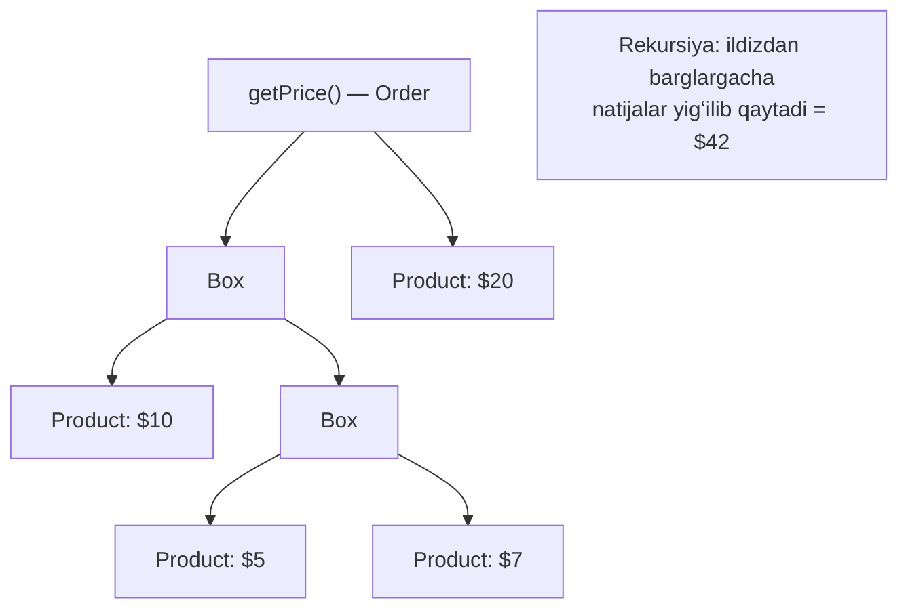
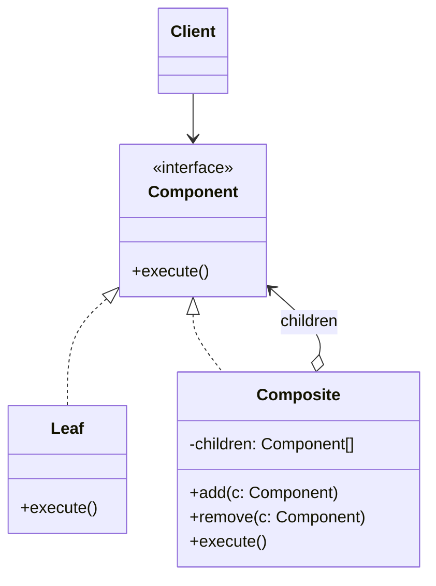

# Composite Pattern

> Boshqa nomlari: **Daraxt (Tree)**, **Компоновщик**

**Composite** — structural (tuzilmaviy) pattern. U ko'plab obyektlarni **daraxt strukturasiga** guruhlash va keyin u bilan xuddi **yagona obyekt** kabi ishlash imkonini beradi.

---

## STEP 1 — Umumiy tushuncha

### Muammo nima edi?

Composite pattern faqat dasturingizning asosiy modeli **daraxt ko'rinishida** ifodalanadigan bo'lsagina ma'noga ega.

Misol: ikkita obyekt bor — `Product` (mahsulot) va `Box` (quti). Quti ichida bir nechta mahsulot **va** boshqa kichikroq qutilar bo'lishi mumkin. Ular ham o'z navbatida mahsulot yoki qutilarni saqlaydi — va shu tarzda istalgan chuqurlikkacha.

Endi faraz qiling: buyurtma (order) ham oddiy o'ralmagan mahsulotlardan, ham ichi to'la qutilardan iborat bo'lishi mumkin. Vazifa: **butun buyurtmaning narxini** hisoblash.

To'g'ridan-to'g'ri yechim: hamma qutini ochib, barcha mahsulotlarni sanab, summani hisoblash. Lekin bu kodda oson emas:

- qutilarning turlari va ichidagilar sizga **oldindan noma'lum**;
- ichma-ich joylashuv **chuqurligi** ham noma'lum — oddiy sikl bilan aylanib chiqib bo'lmaydi.

### Pattern ishlatilmasa qanday muammolar bo'ladi?

| Muammo | Oqibat |
|--------|--------|
| Client `Product`mi yoki `Box`mi — har safar tekshirishga majbur | `if/type-switch`larga to'la kod |
| Ichma-ichlik chuqurligi noma'lum | Qo'lda yozilgan murakkab, sinuvchan rekursiya har bir client'da takrorlanadi |
| Yangi komponent turi qo'shilsa | Barcha tekshiruv joylarini yangilash kerak |
| Daraxt bilan ishlash kodi biznes-logikaga aralashadi | O'qish va test qilish qiyin |

### Yechim nima?

Composite `Product` va `Box` bilan **yagona umumiy interface** orqali ishlashni taklif qiladi — masalan, narxni qaytaruvchi umumiy metod bilan.

- **Product** shunchaki o'z narxini qaytaradi.
- **Box** ichidagi har bir element narxini so'raydi va yig'indini qaytaradi. Ichidagi element kichikroq quti bo'lsa — u ham o'z ichidagilarni so'raydi, va hokazo, **rekursiv** ravishda barcha qismlar hisoblanguncha.

Client uchun eng muhimi: endi buyurtma strukturasi haqida **hech narsa bilish shart emas**. Narx metodini chaqirasiz — raqam qaytadi; karton va skotch "tog'lariga ko'milib" o'tirmaysiz.



### Hayotiy analogiya

Ko'p davlatlar **armiyasi** — teskari daraxt: pastda askarlar, keyin vzvodlar, polklar, va nihoyat armiyalar. Buyruq yuqoridan beriladi va qo'mondonlik zanjiri bo'ylab pastga — konkret askargacha yetib boradi. Buyruq beruvchi har bir askarga alohida murojaat qilmaydi — strukturaning ildiziga gapiradi.

### Asosiy qoida

> **Oddiy (leaf) va murakkab (container) obyektlarga bitta interface ber — client daraxt bilan xuddi bitta obyekt bilan ishlagandek ishlasin, rekursiyani struktura o'zi bajarsin.**

### Struktura



1. **Component** — daraxtning oddiy va murakkab komponentlari uchun umumiy interface.
2. **Leaf (barg)** — shoxchasi yo'q oddiy komponent. Ishni boshqa hech kimga uzata olmagani uchun **asosiy foydali kod** odatda shu yerda yashaydi.
3. **Container (Composite)** — tarkibli komponent: ichida bolalar to'plami bor, lekin ularning **konkret turlarini bilmaydi** — bolalar oddiy leaf ham, boshqa container ham bo'lishi mumkin (hammasi umumiy interface'da bo'lgani uchun bu muammo emas). Container metodlari asosiy ishni bolalariga uzatadi, natijaga o'zidan biror narsa qo'shishi ham mumkin.
4. **Client** daraxt bilan umumiy interface orqali ishlaydi — oldida leaf turibdimi yoki butun daraxtmi, unga baribir.

---

## STEP 2 — Python misoli

### ❌ Yomon misol (pattern'siz)

```python
# ❌ Leaf va guruh har xil turda — client farqlashga majbur
def calculate(item):
    if isinstance(item, Leaf):
        return item.operation()
    elif isinstance(item, list):        # guruh oddiy list
        results = []
        for child in item:
            # Rekursiyani CLIENT o'zi yozadi — va har bir yangi
            # operatsiya (narx, og'irlik, chizish...) uchun
            # xuddi shu isinstance+rekursiya QAYTA yoziladi
            results.append(calculate(child))
        return f"Branch({'+'.join(results)})"
    else:
        raise TypeError("Noma'lum komponent turi!")
```

### ✅ Composite bilan

`t/Python/src/Composite/Conceptual` misoli (izohlar o'zbekchada):

```python
from __future__ import annotations
from abc import ABC, abstractmethod
from typing import List


class Component(ABC):
    """
    Bazaviy Component — strukturaning oddiy va murakkab obyektlari
    uchun umumiy operatsiyalarni e'lon qiladi.
    """

    @property
    def parent(self) -> Component:
        return self._parent

    @parent.setter
    def parent(self, parent: Component):
        # Kerak bo'lsa bazaviy Component daraxtda ota komponentni
        # olish/o'rnatish interface'ini ham berishi mumkin.
        self._parent = parent

    # Bola-komponentlarni boshqarish operatsiyalarini bazaviy class'da
    # e'lon qilish mumkin — shunda client daraxt yig'ishda ham konkret
    # class'larni bilmaydi. Kamchiligi: leaf'larda bu metodlar bo'sh
    # qoladi (Interface Segregation buziladi).

    def add(self, component: Component) -> None:
        pass

    def remove(self, component: Component) -> None:
        pass

    def is_composite(self) -> bool:
        # Client komponentda bola bo'lishi mumkinligini bilishi uchun.
        return False

    @abstractmethod
    def operation(self) -> str:
        pass


class Leaf(Component):
    """
    Leaf — strukturaning oxirgi (bolasiz) obyekti.
    Odatda haqiqiy ISHNI leaf'lar bajaradi, container'lar esa
    faqat bolalariga delegatsiya qiladi.
    """

    def operation(self) -> str:
        return "Leaf"


class Composite(Component):
    """
    Composite (container) — bolalari bor murakkab komponent.
    U ishni bolalariga uzatadi, so'ng natijalarni "jamlaydi".
    """

    def __init__(self) -> None:
        self._children: List[Component] = []

    def add(self, component: Component) -> None:
        self._children.append(component)
        component.parent = self

    def remove(self, component: Component) -> None:
        self._children.remove(component)
        component.parent = None

    def is_composite(self) -> bool:
        return True

    def operation(self) -> str:
        # Container barcha bolalari bo'ylab REKURSIV yuradi:
        # bolalar ham o'z bolalariga uzatadi — natijada butun
        # daraxt aylanib chiqiladi.
        results = []
        for child in self._children:
            results.append(child.operation())
        return f"Branch({'+'.join(results)})"


def client_code(component: Component) -> None:
    # Client BARCHA komponentlar bilan bazaviy interface orqali ishlaydi.
    print(f"RESULT: {component.operation()}", end="")


def client_code2(component1: Component, component2: Component) -> None:
    # add/remove bazaviy class'da e'lon qilingani uchun client daraxtni
    # boshqarayotganda ham konkret class'larni tekshirmaydi.
    if component1.is_composite():
        component1.add(component2)

    print(f"RESULT: {component1.operation()}", end="")


if __name__ == "__main__":
    # Client oddiy leaf bilan ham...
    simple = Leaf()
    print("Client: I've got a simple component:")
    client_code(simple)
    print("\n")

    # ...murakkab daraxt bilan ham BIR XIL ishlaydi.
    tree = Composite()

    branch1 = Composite()
    branch1.add(Leaf())
    branch1.add(Leaf())

    branch2 = Composite()
    branch2.add(Leaf())

    tree.add(branch1)
    tree.add(branch2)

    print("Client: Now I've got a composite tree:")
    client_code(tree)
    print("\n")

    print("Client: I don't need to check the components classes even when managing the tree:")
    client_code2(tree, simple)
```

**Output:**

```
Client: I've got a simple component:
RESULT: Leaf

Client: Now I've got a composite tree:
RESULT: Branch(Branch(Leaf+Leaf)+Branch(Leaf))

Client: I don't need to check the components classes even when managing the tree:
RESULT: Branch(Branch(Leaf+Leaf)+Branch(Leaf)+Leaf)
```

**Nima yaxshilandi?** `client_code` bitta — leaf uchun ham, istalgan chuqurlikdagi daraxt uchun ham; `isinstance` yo'q; rekursiya struktura ichida.

---

## STEP 3 — Go misoli

### ❌ Yomon misol (pattern'siz)

```go
package main

// ❌ File va Folder umumiy interface'siz — client type switch yozadi
func search(item interface{}, keyword string) {
	switch v := item.(type) {
	case *File:
		fmt.Printf("Searching for keyword %s in file %s\n", keyword, v.name)
	case *Folder:
		fmt.Printf("Searching in folder %s\n", v.name)
		for _, child := range v.components {
			search(child, keyword) // rekursiyani client o'zi boshqaradi
		}
	default:
		panic("noma'lum tur!") // yangi tur qo'shilsa — runtime panic
	}
}
// Har bir yangi operatsiya (delete, count, size...) uchun
// xuddi shu type switch + rekursiya QAYTA yoziladi.
```

### ✅ Composite bilan

`t/Go/composite` misoli — fayl tizimida qidiruv: `File` (leaf) va `Folder` (container) bitta interface'da (izohlar o'zbekchada):

```go
// component.go — Component interface: leaf va container uchun umumiy
package main

type Component interface {
	search(string)
}
```

```go
// file.go — Leaf: haqiqiy ish shu yerda bajariladi
package main

import "fmt"

type File struct {
	name string
}

func (f *File) search(keyword string) {
	fmt.Printf("Searching for keyword %s in file %s\n", keyword, f.name)
}

func (f *File) getName() string {
	return f.name
}
```

```go
// folder.go — Composite: ishni bolalariga REKURSIV delegatsiya qiladi
package main

import "fmt"

type Folder struct {
	components []Component
	name       string
}

func (f *Folder) search(keyword string) {
	fmt.Printf("Serching recursively for keyword %s in folder %s\n", keyword, f.name)
	for _, composite := range f.components {
		// Bola File'mi yoki Folder'mi — bizga baribir:
		// har biri O'ZINING search'ini bajaradi
		composite.search(keyword)
	}
}

func (f *Folder) add(c Component) {
	f.components = append(f.components, c)
}
```

```go
// main.go — Client: butun daraxtga BITTA chaqiruv
package main

func main() {
	file1 := &File{name: "File1"}
	file2 := &File{name: "File2"}
	file3 := &File{name: "File3"}

	folder1 := &Folder{
		name: "Folder1",
	}

	folder1.add(file1)

	folder2 := &Folder{
		name: "Folder2",
	}
	folder2.add(file2)
	folder2.add(file3)
	folder2.add(folder1) // folder ichida folder!

	folder2.search("rose")
}
```

**Output:**

```
Serching recursively for keyword rose in folder Folder2
Searching for keyword rose in file File2
Searching for keyword rose in file File3
Serching recursively for keyword rose in folder Folder1
Searching for keyword rose in file File1
```

**Nima yaxshilandi?**
- Client `folder2.search("rose")` deb chaqiradi — ichida nechta daraja borligini bilmaydi;
- type switch yo'q — polimorfizm ishlaydi;
- yangi komponent turi (masalan `Symlink`) qo'shilsa, client va `Folder` kodi o'zgarmaydi.

---

## Qachon ishlatish kerak?

**1. Obyektlarning daraxtsimon strukturasini ifodalash kerak bo'lsa.**

Composite tarkibli obyektlarda boshqa oddiy/tarkibli obyektlarga havolalar saqlashni taklif qiladi — ular ham o'z ichida shunday saqlaydi. Natijada faqat **ikki asosiy tur** bilan istalgan murakkablikdagi daraxt qurasiz.

**2. Client'lar oddiy va tarkibli obyektlarga bir xil munosabatda bo'lishi kerak bo'lsa.**

Ikkalasi umumiy interface'ni implementatsiya qilgani uchun client qaysi obyekt bilan ishlayotganini bilishi shart emas.

---

## Implementatsiya qadamlari

1. Biznes-logikangizni daraxt ko'rinishida ifodalash mumkinligiga ishonch hosil qiling: uni oddiy komponentlar va container'larga ajrating (container'lar ham komponent, ham boshqa container'larni saqlay olishini unutmang).
2. **Umumiy Component interface**'ini yarating — container va oddiy komponentlarning operatsiyalarini birlashtirsin. Interface muvaffaqiyatli deb hisoblanadi, agar u orqali oddiy va tarkibli komponentlarni ma'no yo'qotmasdan **almashtirish** mumkin bo'lsa.
3. **Leaf** class(lar)ini yarating — dasturda bir nechta har xil leaf bo'lishi mumkin.
4. **Container** class'ini yarating va unga bolalar **massivini** qo'shing — massiv turi albatta **Component interface** bo'lsin (oddiy ham, tarkibli ham sig'ishi uchun). Interface metodlarini implementatsiya qilishda container asosiy ishni **bolalariga delegatsiya** qilishini yodda tuting.
5. Container'ga bolalarni **qo'shish/o'chirish** operatsiyalarini qo'shing.

   > Bu metodlarni Component interface'iga ham qo'yish mumkin. Bu Interface Segregation printsipini buzadi (leaf'larda ular bo'sh qoladi), lekin evaziga client daraxtning **barcha** elementlariga chindan bir xil munosabatda bo'la oladi — hatto daraxt yig'ishda ham.

---

## Afzalliklar va kamchiliklar

| ✅ Afzalliklar | ❌ Kamchiliklar |
|---------------|----------------|
| Murakkab komponentlar daraxti bilan ishlashda client arxitekturasini soddalashtiradi | Haddan ortiq **umumiy** class dizayni yaratadi: funksionalligi keskin farq qiluvchi class'lar uchun umumiy interface topish qiyin, ba'zan interface'ni ortiqcha umumlashtirishga to'g'ri keladi |
| Yangi komponent turlarini qo'shishni osonlashtiradi (Open/Closed) | |
| Rekursiya + polimorfizm — client kodda emas, strukturaning ichida | |

---

## Boshqa patternlar bilan aloqasi

- **Builder** Composite daraxtini bosqichma-bosqich qurish uchun ishlatiladi.
- **Chain of Responsibility** ko'pincha Composite bilan birga qo'llanadi — so'rov bola komponentdan ota komponentlarga uzatiladi.
- Composite daraxti bo'ylab **Iterator** bilan yurish mumkin.
- Butun daraxt ustida biror amalni **Visitor** bilan bajarish mumkin.
- Daraxtning takrorlanuvchi shoxlarini **Flyweight** bilan ulashib, xotira tejash mumkin.
- **Composite va Decorator** strukturasi o'xshash — ikkalasi rekursiv kompozitsiyaga qurilgan. Farqi: Decorator **bitta** obyektni o'raydi, Composite tugunida **ko'p** bola bor; Decorator yangi funksionallik **qo'shadi**, Composite esa faqat bolalar natijasini **jamlaydi**. Ular hamkorlik ham qiladi: daraxtning ayrim qismlari funksiyasini Decorator bilan o'zgartirish mumkin.
- Composite va Decorator'larga qurilgan arxitekturaga ko'pincha **Prototype** foyda beradi — murakkab strukturani qaytadan yig'ish o'rniga clone qilasiz.

---

## Go'da real-world misollar

### Fayl tizimi: hajm hisoblash

```go
type FileNode interface {
    Name() string
    Size() int64
}

// Leaf
type File struct {
    name string
    size int64
}

func (f *File) Size() int64 { return f.size }

// Composite
type Directory struct {
    name     string
    children []FileNode
}

// Papka hajmi = bolalar hajmi yig'indisi (rekursiv)
func (d *Directory) Size() int64 {
    var total int64
    for _, child := range d.children {
        total += child.Size()
    }
    return total
}
```

### Arifmetik ifoda daraxti

```go
type Expr interface {
    Evaluate() float64
}

// Leaf — son
type Number struct{ value float64 }

func (n *Number) Evaluate() float64 { return n.value }

// Composite — binar amal
type BinaryOp struct {
    left, right Expr
    op          string
}

func (b *BinaryOp) Evaluate() float64 {
    l, r := b.left.Evaluate(), b.right.Evaluate()
    switch b.op {
    case "+":
        return l + r
    case "*":
        return l * r
    }
    return 0
}

// (2 + 3) * (4 - 1) — ifoda ham daraxt!
```

Boshqa klassik misollar: UI komponentlar daraxti (Page → Form → Field), tashkilot strukturasi, menyu/kategoriyalar, JSON/XML hujjatlar.

---

## Xulosa

### Eslab qol

- Composite faqat model **daraxt** bo'lsa ishlaydi — daraxt yo'q joyga uni tiqishtirmang.
- Ikki tur yetadi: **Leaf** (ish bajaradi) + **Container** (bolalariga delegatsiya qiladi va jamlaydi).
- Client **hech qachon** leaf/container farqini tekshirmasligi kerak — bu pattern'ning butun mohiyati.
- `add/remove`'ni umumiy interface'ga qo'yish — qulaylik va Interface Segregation orasidagi ongli savdolashuv.
- Rekursiya strukturada yashaydi: har bir yangi operatsiya uchun rekursiyani qayta yozmaysiz.

### Amaliyot

1. `t/Go/composite`'ga `getSize()` operatsiyasini qo'shing: `File` o'z hajmini qaytarsin, `Folder` bolalar yig'indisini. Client kodda rekursiya yozdingizmi?
2. Yomon misoldagi type switch variantiga xuddi shu `getSize`'ni qo'shib, kod hajmini solishtiring.
3. Python misolida `operation()` natijasiga container o'z "og'irligini" ham qo'shadigan qilib o'zgartiring (masalan har bir Branch +1).
4. O'z loyihangizdagi kategoriya/menyu strukturasini Composite bilan modellashtiring.

---

## Keyingi qadam

→ [4. Decorator.md](4.%20Decorator.md)
