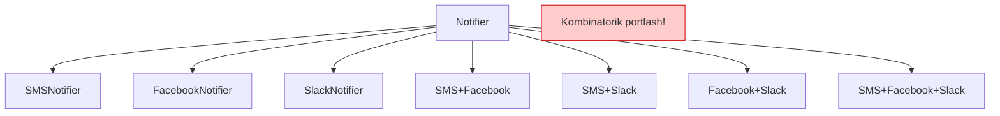
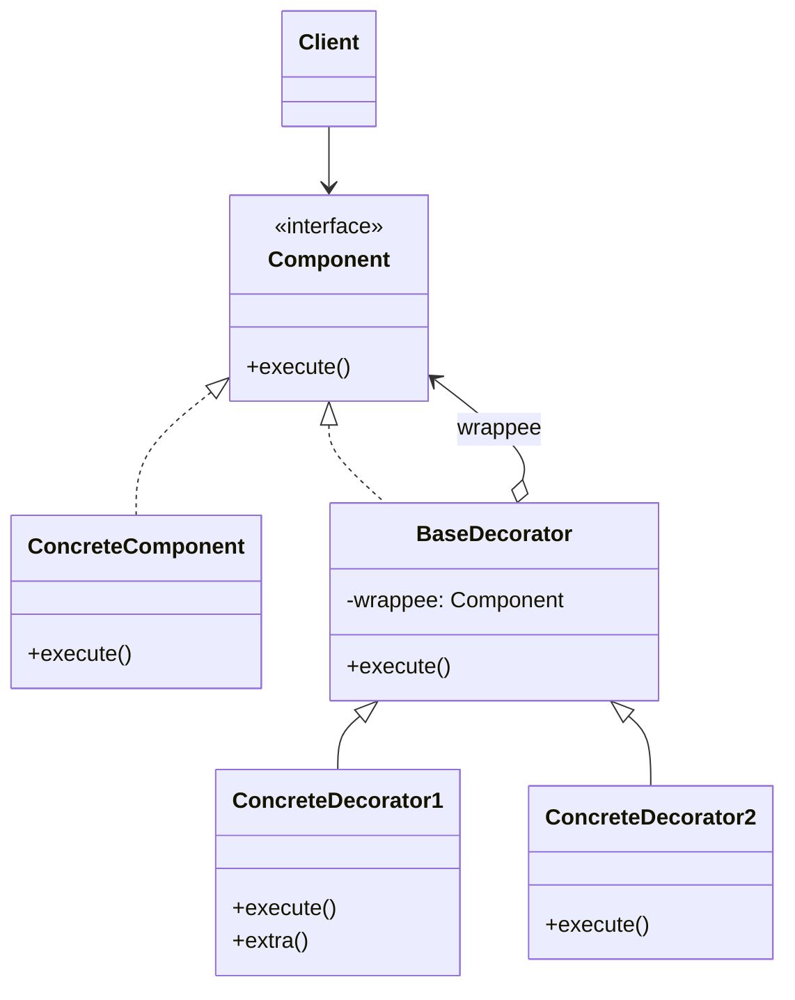

# Decorator Pattern

> Boshqa nomlari: **Wrapper**, **O'ram**, **Декоратор**

**Decorator** — structural (tuzilmaviy) pattern. U obyektlarga **yangi funksionallikni dinamik qo'shish** imkonini beradi — ularni foydali **"o'ram"larga (wrapper)** o'rab.

---

## STEP 1 — Umumiy tushuncha

### Muammo nima edi?

Siz turli dasturlarga ulanadigan **notification library** ustida ishlayapsiz. Uning asosi — `send` metodli `Notifier` class'i: xabar matnini olib, adminlarga **email** yuboradi.

Keyin ma'lum bo'ldi: foydalanuvchilarga faqat email kamlik qiladi. Kimdir kritik muammolar haqida **SMS** olmoqchi, kimdir **Facebook**, korporativ mijozlar **Slack** xabarlarini xohlaydi.

Avval har bir turni `Notifier`'dan meros olgan subclass qildingiz — foydalanuvchi bittasini tanlab ishlataveradi. Lekin keyin mantiqiy savol tug'ildi: nega **bir nechta turni birdaniga** tanlab bo'lmaydi? Uyingizda yong'in chiqsa, xabarni **hamma kanaldan** olishni xohlaysiz-ku!

Kombinatsiyalarni subclass'lar bilan yechishga urindingiz: `SMS+Slack`, `Email+Facebook`... Birinchi o'ntalik class'dan keyin ayon bo'ldi: bu yo'l kodni **aql bovar qilmas darajada shishiradi**.

### Pattern ishlatilmasa qanday muammolar bo'ladi?

Inheritance — xatti-harakatni kengaytirishda birinchi kelgan fikr, lekin uning jiddiy cheklovlari bor:

| Inheritance muammosi | Oqibat |
|--------|--------|
| **Statik** — mavjud obyekt xatti-harakatini runtime'da o'zgartirib bo'lmaydi | Boshqa xatti-harakat kerakmi — boshqa subclass'dan yangi obyekt yaratasiz |
| Bir vaqtda **bir nechta** class'dan meros olib bo'lmaydi (ko'p tillarda) | Har bir kombinatsiya uchun alohida subclass: 2ⁿ portlash |
| Kombinatsiya-subclass'larda kod takrorlanadi | Har o'zgarish o'nlab class'ga tegadi |



### Yechim nima?

Chiqish yo'li — inheritance'ni **kompozitsiya** bilan almashtirish: bir obyekt boshqasiga **havola** saqlab, ishni unga delegatsiya qiladi (xatti-harakatni meros qilib olish o'rniga). Decorator aynan shu printsipga qurilgan.

Decorator'ning ikkinchi nomi — **wrapper (o'ram)** — mohiyatini aniqroq aytadi: maqsad obyektni boshqa obyekt-o'ramga joylaysiz; o'ram obyektning bazaviy xatti-harakatini ishga tushiradi, so'ng natijaga **o'zinikini qo'shadi**.

Eng muhimi: ikkalasi **umumiy interface**'ga ega — client uchun "toza" yoki "o'ralgan" obyekt bilan ishlash farqsiz. Bir nechta o'ramni **birdaniga** ishlatish mumkin — natija barcha o'ramlarning jamlangan xatti-harakati bo'ladi.

Notification misolida: bazaviy class'da oddiy email qoladi, qolgan yuborish usullari **decorator** bo'ladi. Client dastlabki sozlashda notifier obyektini kerakli o'ramlarga o'raydi — oxirgi o'ram bilan ishlayveradi. Yong'in xabari hamma kanaldan ketadi:

```
stack = new Notifier()
stack = new SMSDecorator(stack)
stack = new SlackDecorator(stack)
stack.send("Yong'in!")   // email + SMS + Slack
```

### Hayotiy analogiya

**Kiyim** — decorator'ning jonli misoli. Sovuq bo'lsa sviter kiyasiz: siz o'zingiz bo'lib qolaverasiz, lekin yangi xususiyat — sovuqdan himoya qo'shiladi. Yomg'ir boshlansa ustidan plash — yana bir decorator. Kerak bo'lmasa yechib tashlaysiz — obyekt "toza" holiga qaytadi. Asl class o'zgarmadi, subclass ham yaratilmadi.

### Asosiy qoida

> **Xatti-harakatni meros bilan emas, o'rash bilan qo'sh: o'ram obyekt bilan bir xil interface'da bo'lsin, ishni ichidagi obyektga uzatib, oldidan yoki keyin o'zinikini bajarsin.**

### Struktura



1. **Component** — o'ramlar va o'raladigan obyektlarning umumiy interface'i.
2. **Concrete Component** — o'raladigan obyektlar class'i: keyinchalik decorator'lar o'zgartiradigan **bazaviy xatti-harakat** shu yerda.
3. **Base Decorator** — ichki komponent obyektiga havola saqlaydi (havola turi — Component interface, shunda ichida concrete component ham, boshqa decorator ham bo'la oladi). Barcha operatsiyalarni ichki obyektga delegatsiya qiladi.
4. **Concrete Decorator'lar** — qo'shimcha xatti-harakat variantlari; ular o'z ishini o'ralgan obyekt metodini chaqirishdan **oldin yoki keyin** bajaradi.
5. **Client** komponentlarni istalgan decorator'lar bilan istalgan tartibda o'raydi — hammasi bilan umumiy interface orqali ishlaydi.

---

## STEP 2 — Python misoli

### ❌ Yomon misol (pattern'siz)

```python
# ❌ Har bir kombinatsiya uchun subclass
class ConcreteComponent:
    def operation(self):
        return "ConcreteComponent"

class ComponentWithA(ConcreteComponent):
    def operation(self):
        return f"A({super().operation()})"

class ComponentWithB(ConcreteComponent):
    def operation(self):
        return f"B({super().operation()})"

class ComponentWithAB(ConcreteComponent):   # takror kod!
    def operation(self):
        return f"B(A({super().operation()}))"

class ComponentWithBA(ConcreteComponent):   # tartib boshqa — YANA class!
    def operation(self):
        return f"A(B({super().operation()}))"

# 2 ta qo'shimcha = 4 kombinatsiya. 3 ta = 15. Va bularning
# birortasini runtime'da yig'ib/buzib bo'lmaydi.
```

### ✅ Decorator bilan

`t/Python/src/Decorator/Conceptual` misoli (izohlar o'zbekchada):

```python
class Component():
    """
    Bazaviy Component interface — decorator'lar o'zgartiradigan
    xatti-harakatni e'lon qiladi.
    """

    def operation(self) -> str:
        pass


class ConcreteComponent(Component):
    """
    Concrete Component — default xatti-harakat implementatsiyasi.
    Bunday class'larning bir nechta variatsiyasi bo'lishi mumkin.
    """

    def operation(self) -> str:
        return "ConcreteComponent"


class Decorator(Component):
    """
    Bazaviy Decorator ham boshqa komponentlar bilan BIR XIL
    interface'ga ega. Asosiy vazifasi — barcha konkret decorator'lar
    uchun o'rash interface'ini aniqlash: o'ralgan komponentni
    saqlash maydoni va uni initsializatsiya qilish.
    """

    _component: Component = None

    def __init__(self, component: Component) -> None:
        self._component = component

    @property
    def component(self) -> Component:
        # Decorator butun ishni o'ralgan komponentga delegatsiya qiladi.
        return self._component

    def operation(self) -> str:
        return self._component.operation()


class ConcreteDecoratorA(Decorator):
    """
    Konkret Decorator'lar o'ralgan obyektni chaqirib,
    natijasini qandaydir tarzda o'zgartiradi.
    """

    def operation(self) -> str:
        # O'ralgan obyektni to'g'ridan-to'g'ri chaqirish o'rniga
        # ota implementatsiyani chaqirish mumkin — bu decorator
        # class'larini kengaytirishni soddalashtiradi.
        return f"ConcreteDecoratorA({self.component.operation()})"


class ConcreteDecoratorB(Decorator):
    """
    Decorator o'z ishini o'ralgan obyekt chaqiruvidan
    OLDIN yoki KEYIN bajarishi mumkin.
    """

    def operation(self) -> str:
        return f"ConcreteDecoratorB({self.component.operation()})"


def client_code(component: Component) -> None:
    # Client hamma obyekt bilan Component interface orqali ishlaydi —
    # konkret class'larga bog'lanmaydi.
    print(f"RESULT: {component.operation()}", end="")


if __name__ == "__main__":
    # Client oddiy komponent bilan ham ishlaydi...
    simple = ConcreteComponent()
    print("Client: I've got a simple component:")
    client_code(simple)
    print("\n")

    # ...dekoratsiyalangani bilan ham.
    # Decorator'lar oddiy komponentni ham, BOSHQA decorator'larni
    # ham o'rashi mumkin.
    decorator1 = ConcreteDecoratorA(simple)
    decorator2 = ConcreteDecoratorB(decorator1)
    print("Client: Now I've got a decorated component:")
    client_code(decorator2)
```

**Output:**

```
Client: I've got a simple component:
RESULT: ConcreteComponent

Client: Now I've got a decorated component:
RESULT: ConcreteDecoratorB(ConcreteDecoratorA(ConcreteComponent))
```

**Nima yaxshilandi?** Kombinatsiyalar **runtime'da** yig'iladi (`B(A(component))`); har bir qo'shimcha — bitta class; tartibni o'zgartirish = o'rash tartibini o'zgartirish, yangi class emas.

---

## STEP 3 — Go misoli

### ❌ Yomon misol (pattern'siz)

```go
package main

// ❌ Har bir pizza+topping kombinatsiyasi alohida struct
type VeggieMania struct{}

func (p *VeggieMania) getPrice() int { return 15 }

type VeggieManiaWithCheese struct{}

func (p *VeggieManiaWithCheese) getPrice() int { return 15 + 10 }

type VeggieManiaWithTomato struct{}

func (p *VeggieManiaWithTomato) getPrice() int { return 15 + 7 }

type VeggieManiaWithCheeseAndTomato struct{}

func (p *VeggieManiaWithCheeseAndTomato) getPrice() int { return 15 + 10 + 7 }

// Yangi pizza turi (Peperoni) kelsa: yana 4 ta struct.
// Yangi topping (Olive) kelsa: kombinatsiyalar 2 barobar!
// Narxlar (15, 10, 7) hamma joyda takrorlangan — birini
// o'zgartirsangiz, qolganlarini unutishingiz aniq.
```

### ✅ Decorator bilan

`t/Go/decorator` misoli — pizza (component) va topping'lar (decorator'lar) (izohlar o'zbekchada):

```go
// pizza.go — Component interface: pizza ham, topping ham shunga bo'ysunadi
package main

type IPizza interface {
	getPrice() int
}
```

```go
// veggieMania.go — Concrete Component: bazaviy pizza
package main

type VeggieMania struct {
}

func (p *VeggieMania) getPrice() int {
	return 15
}
```

```go
// cheeseTopping.go — Concrete Decorator 1: ichida IPizza saqlaydi,
// narxini so'rab, ustiga O'ZINIKINI qo'shadi
package main

type CheeseTopping struct {
	pizza IPizza
}

func (c *CheeseTopping) getPrice() int {
	pizzaPrice := c.pizza.getPrice()
	return pizzaPrice + 10
}
```

```go
// tomatoTopping.go — Concrete Decorator 2
package main

type TomatoTopping struct {
	pizza IPizza
}

func (c *TomatoTopping) getPrice() int {
	pizzaPrice := c.pizza.getPrice()
	return pizzaPrice + 7
}
```

```go
// main.go — Client: kombinatsiyani RUNTIME'da o'rab yig'adi
package main

import "fmt"

func main() {

	pizza := &VeggieMania{}

	// Cheese topping bilan o'raymiz
	pizzaWithCheese := &CheeseTopping{
		pizza: pizza,
	}

	// Ustidan tomato topping bilan o'raymiz —
	// decorator decorator'ni o'rayapti!
	pizzaWithCheeseAndTomato := &TomatoTopping{
		pizza: pizzaWithCheese,
	}

	// Zanjir: TomatoTopping(7) → CheeseTopping(10) → VeggieMania(15)
	fmt.Printf("Price of veggeMania with tomato and cheese topping is %d\n",
		pizzaWithCheeseAndTomato.getPrice())
}
```

**Output:**

```
Price of veggeMania with tomato and cheese topping is 32
```

**Nima yaxshilandi?**
- Har bir topping — **bitta** struct; kombinatsiyalar o'rash bilan yig'iladi (15 + 10 + 7 = 32);
- yangi topping = yangi struct, mavjud kod o'zgarmaydi;
- har bir narx **faqat bitta joyda** yozilgan.

---

## Qachon ishlatish kerak?

**1. Obyektlarga majburiyatlarni "yo'l-yo'lakay" (runtime'da), ularni ishlatuvchi kod sezmagan holda qo'shish kerak bo'lsa.**

Obyekt qo'shimcha xatti-harakatli o'ramlarga joylanadi; o'ram va obyekt interface'i bir xil bo'lgani uchun client'ga farqi yo'q.

**2. Inheritance orqali kengaytirib bo'lmasa yoki u noqulay bo'lsa.**

Ko'p tillarda `final` kalit so'zi class'dan meros olishni taqiqlaydi — bunday class'ni faqat Decorator bilan kengaytirish mumkin. Shuningdek, kombinatsiyalar ko'p bo'lganda inheritance amaliy emas.

---

## Implementatsiya qadamlari

1. Vazifangizda **bitta asosiy komponent va bir nechta ixtiyoriy qo'shimcha (надстройка)** borligiga ishonch hosil qiling.
2. Asosiy komponent va qo'shimchalar uchun umumiy metodlarni **Component interface**'ida tavsiflang.
3. **Concrete Component** class'ini yaratib, asosiy biznes-logikani unga joylang.
4. **Bazaviy Decorator** class'ini yarating: unda ichki obyektga havola maydoni bo'lsin (maydon turi — umumiy interface!); barcha metodlar ishni ichki obyektga delegatsiya qilsin.
5. Barcha class'lar **bitta interface**'ga rioya qilishini tekshiring.
6. **Konkret decorator'larni** bazaviy decorator'dan hosil qiling: har biri o'z qo'shimcha ishini o'ralgan obyekt chaqiruvidan **oldin yoki keyin** bajarsin.
7. O'ramlarni yig'ish konfiguratsiyasi va tartibi uchun **client javobgar**.

---

## Afzalliklar va kamchiliklar

| ✅ Afzalliklar | ❌ Kamchiliklar |
|---------------|----------------|
| Inheritance'dan ko'ra moslashuvchan | Ko'p qavat o'ralgan obyektni konfiguratsiya qilish qiyin |
| Majburiyatlarni runtime'da qo'shish imkoni | Mayda class'lar ko'payib ketadi |
| Bir vaqtda bir nechta majburiyat qo'shish mumkin | O'ramlardan birini zanjir o'rtasidan olib tashlash noqulay |
| "Hamma holatga bitta ulkan class" o'rniga bir nechta kichik obyekt | Xatti-harakat o'rash tartibiga bog'liq bo'lib qolishi mumkin |

---

## Boshqa patternlar bilan aloqasi

- **Adapter** obyektga **boshqa** interface beradi; **Proxy** — **xuddi shu** interface; **Decorator** — **kengaytirilgan** interface (va rekursiv o'rashni qo'llaydi, Adapter esa yo'q).
- **Chain of Responsibility va Decorator** strukturasi juda o'xshash (ikkalasi ham zanjir bo'ylab rekursiv ijro). Farqi: CoR handler'lari **istalgan** mustaqil amalni bajarishi va zanjirni **istalgan joyda uzishi** mumkin; decorator'lar esa aynan bitta amalni kengaytiradi va zanjirni uzmaydi.
- **Composite va Decorator** — ikkalasi rekursiv kompozitsiya. Decorator **bitta** bolani o'raydi va funksionallik **qo'shadi**; Composite ko'p bolani jamlaydi, yangi narsa qo'shmaydi. Birga ham ishlaydi: daraxt qismlarini decorator bilan o'zgartirish mumkin.
- Composite/Decorator strukturalarini **Prototype** bilan clone qilish qulay.
- **Strategy** obyekt xatti-harakatini **"ichidan"** almashtiradi, **Decorator** — **"tashqarisidan"** kengaytiradi.
- **Decorator va Proxy** strukturasi o'xshash (kompozitsiya + delegatsiya), maqsadi har xil: Proxy servis obyekti hayotini **o'zi boshqaradi**, decorator'larni o'rash esa **client nazoratida**.

---

## Go'da real-world misollar

### HTTP middleware — Go'dagi eng mashhur decorator

```go
// Logging decorator
func WithLogging(next http.Handler) http.Handler {
    return http.HandlerFunc(func(w http.ResponseWriter, r *http.Request) {
        start := time.Now()
        next.ServeHTTP(w, r) // o'ralgan handler'ga delegatsiya
        log.Printf("%s %s → %v", r.Method, r.URL.Path, time.Since(start))
    })
}

// Auth decorator
func WithAuth(next http.Handler) http.Handler {
    return http.HandlerFunc(func(w http.ResponseWriter, r *http.Request) {
        if r.Header.Get("Authorization") == "" {
            http.Error(w, "Unauthorized", http.StatusUnauthorized)
            return
        }
        next.ServeHTTP(w, r)
    })
}

// Zanjir yig'ish — xuddi pizza toppinglari kabi:
handler := WithLogging(WithAuth(WithCORS(realHandler)))
http.ListenAndServe(":8080", handler)
```

### Service decorator (logging + cache)

```go
type UserService interface {
    GetUser(ctx context.Context, id string) (*User, error)
}

// Logging decorator
type loggingUserService struct {
    next   UserService // wrappee
    logger *slog.Logger
}

func (s *loggingUserService) GetUser(ctx context.Context, id string) (*User, error) {
    s.logger.Info("GetUser chaqirildi", "id", id)
    return s.next.GetUser(ctx, id) // delegatsiya
}

// Cache decorator
type cachingUserService struct {
    next  UserService
    cache map[string]*User
    mu    sync.RWMutex
}

func (s *cachingUserService) GetUser(ctx context.Context, id string) (*User, error) {
    s.mu.RLock()
    if u, ok := s.cache[id]; ok {
        s.mu.RUnlock()
        return u, nil
    }
    s.mu.RUnlock()

    user, err := s.next.GetUser(ctx, id)
    if err == nil {
        s.mu.Lock()
        s.cache[id] = user
        s.mu.Unlock()
    }
    return user, err
}

// Yig'ish: ichkaridan tashqariga
var svc UserService
svc = &userServiceImpl{db: db}
svc = WithCache(svc)
svc = WithLogging(svc, slog.Default())
```

### Standart library'da

`io` paketi decorator'larga qurilgan: `bufio.NewReader(r)` (`io.Reader`'ni buferlash bilan o'raydi), `gzip.NewWriter(w)` (yozishni siqish bilan o'raydi) — hammasi bir xil `Reader`/`Writer` interface'ida, istalgancha ichma-ich o'rash mumkin.

---

## Xulosa

### Eslab qol

- Decorator = **inheritance o'rniga o'rash**: o'ram va obyekt **bir interface'da**, ish ichkariga delegatsiya qilinadi, qo'shimcha oldin/keyin bajariladi.
- Kombinatsiyalar **runtime'da** yig'iladi — subclass portlashi yo'qoladi (n ta qo'shimcha = n ta class, 2ⁿ emas).
- Decorator **decorator'ni o'rashi mumkin** — zanjir hosil bo'ladi; oxirgi o'ram client uchun "obyektning o'zi".
- Go'da bu pattern hamma joyda: **HTTP middleware**, `io.Reader`/`io.Writer` o'ramlari, service decorator'lar.
- Proxy'dan farqi: decorator'ni **client** yig'adi va u funksiya **qo'shadi**; proxy kirishni **nazorat qiladi** va ichki obyektni o'zi boshqaradi.

### Amaliyot

1. `t/Go/decorator`'ga `OliveTopping` (+5) qo'shing va `VeggieMania`'ni uch qavat o'rab narxini hisoblang — mavjud kod o'zgardimi?
2. Yomon misolda (kombinatsiya-struct'lar) xuddi shu olive'ni qo'shib, nechta yangi struct kerakligini sanang.
3. Python misolida `ConcreteDecoratorC` yozing — u natijani **oldin** o'zgartirib, keyin wrappee'ni chaqirsin; o'rash tartibi natijaga ta'sirini kuzating.
4. O'z HTTP servisingizga `WithRateLimit` middleware'ini decorator sifatida yozing.

---

## Keyingi qadam

→ [5. Facade.md](5.%20Facade.md)
