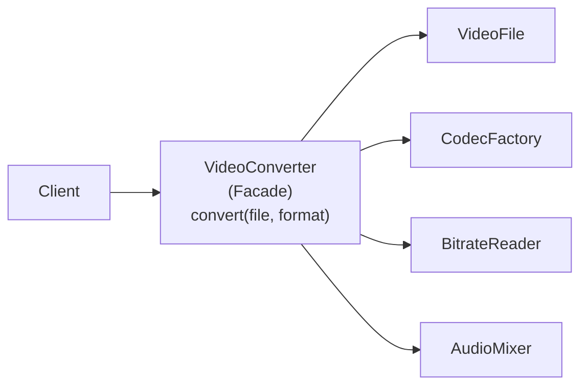
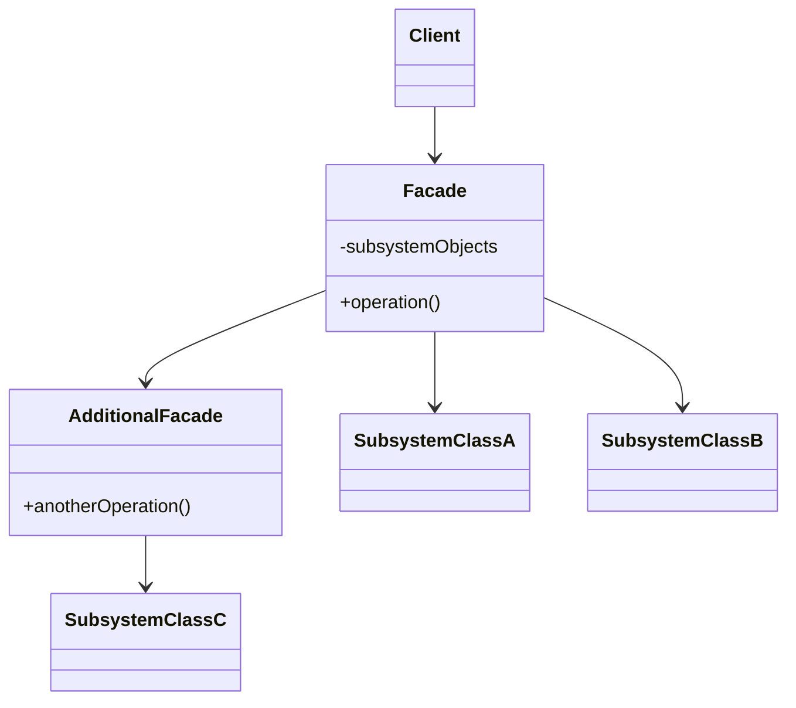

# Facade Pattern

> Boshqa nomi: **Фасад**

**Facade** — structural (tuzilmaviy) pattern. U murakkab class'lar tizimi, library yoki framework'ka **sodda interface** taqdim etadi.

---

## STEP 1 — Umumiy tushuncha

### Muammo nima edi?

Kodingiz murakkab library yoki framework'ning **ko'plab obyektlari** bilan ishlashga majbur: ularni o'zingiz initsializatsiya qilasiz, bog'liqliklarning to'g'ri tartibini kuzatasiz va hokazo.

Natijada class'laringizning biznes-logikasi 3rd-party class'larning implementatsiya tafsilotlari bilan **chirmashib ketadi** — bunday kodni tushunish ham, qo'llab-quvvatlash ham qiyin.

### Pattern ishlatilmasa qanday muammolar bo'ladi?

| Muammo | Oqibat |
|--------|--------|
| Client o'nlab subsystem obyektini o'zi yaratadi va sozlaydi | Biznes-logika + infratuzilma aralashmasi |
| Chaqiruvlarning to'g'ri tartibini har bir client bilishi kerak | Bir qadam unutilsa — bug; tartib hamma joyda takrorlanadi |
| Client subsystem'ning konkret class'lariga bog'lanadi | Library almashsa — butun kod qayta yoziladi |
| Subsystem'dagi o'zgarish | Barcha client'larga tarqaladi |

### Yechim nima?

**Facade** — ko'plab class'lardan iborat murakkab subsystem bilan ishlash uchun **sodda interface**. Facade'da subsystem'ning 100% imkoniyati bo'lmasligi mumkin — u aynan **client'ga kerakli** funksiyalarni ochib, qolganini yashiradi.

Facade "qaysi class'larga so'rovni uzatishni" va "buning uchun qanday ma'lumot kerakligini" **biladi**.

Misol: mushuklar videosini ijtimoiy tarmoqlarga yuklaydigan dastur professional video-siqish library'sidan foydalanadi. Client kodga esa bor-yo'g'i bitta `encode(filename, format)` metodi kerak. Shunday metodli class yaratdingizmi — birinchi facade'ingiz tayyor: ichida `VideoFile`, `CodecFactory`, `BitrateReader`, `AudioMixer`... to'g'ri tartibda ishlaydi, client esa buni ko'rmaydi.



### Hayotiy analogiya

Do'konga **telefon orqali buyurtma** berasiz: operator — do'konning barcha xizmat va bo'limlariga sizning **facade**'ingiz. U buyurtma tizimi, to'lov va yetkazib berish bo'limlariga soddalashtirilgan "ovozli interface" beradi — siz ular bilan alohida gaplashmaysiz.

### Asosiy qoida

> **Murakkab subsystem oldiga bitta sodda kirish nuqtasi qo'y: client faqat facade bilan gaplashsin, subsystem tafsilotlari uning ichida qolsin.**

### Struktura



1. **Facade** — subsystem'ning ma'lum funksionalligiga tez kirishni beradi: so'rovni qaysi class'larga yo'naltirishni va qanday ma'lumot kerakligini biladi.
2. **Qo'shimcha facade** — yagona facade'ni har xil turdagi funksiyalar bilan "ifloslantirmaslik" uchun kiritilishi mumkin; uni client ham, boshqa facade'lar ham ishlatadi.
3. **Murakkab subsystem** — o'nlab turli class'lar. Ularni ishlatish uchun subsystem'ning ichki tuzilishini, initsializatsiya tartibini bilish kerak. Muhim: subsystem class'lari **facade mavjudligini bilmaydi** va bir-biri bilan to'g'ridan-to'g'ri ishlayveradi.
4. **Client** murakkab subsystem obyektlari o'rniga facade'ni ishlatadi.

---

## STEP 2 — Python misoli

### ❌ Yomon misol (pattern'siz)

```python
# ❌ Client subsystem'ning har bir obyektini o'zi boshqaradi
def do_work():
    subsystem1 = Subsystem1()
    subsystem2 = Subsystem2()

    # To'g'ri TARTIBNI client bilishi shart:
    subsystem1.operation1()      # avval tayyorlash
    subsystem2.operation1()      # keyin ikkinchisini tayyorlash
    subsystem1.operation_n()     # keyin ishga tushirish
    subsystem2.operation_z()     # va oxirida...

# Bu ketma-ketlik dasturning 10 ta joyida kerak bo'lsa —
# 10 marta takrorlanadi. Subsystem o'zgarsa — 10 joy buziladi.
```

### ✅ Facade bilan

`t/Python/src/Facade/Conceptual` misoli (izohlar o'zbekchada):

```python
from __future__ import annotations


class Facade:
    """
    Facade — bir yoki bir nechta subsystem'ning murakkab logikasiga
    sodda interface beradi. U client so'rovlarini subsystem ichidagi
    tegishli obyektlarga delegatsiya qiladi, ularning hayotiy siklini
    ham boshqaradi. Bularning bari client'ni subsystem'ning
    keraksiz murakkabligidan himoya qiladi.
    """

    def __init__(self, subsystem1: Subsystem1, subsystem2: Subsystem2) -> None:
        # Ehtiyojga qarab: Facade'ga tayyor subsystem obyektlarini
        # berish yoki ularni Facade o'zi yaratishi mumkin.
        self._subsystem1 = subsystem1 or Subsystem1()
        self._subsystem2 = subsystem2 or Subsystem2()

    def operation(self) -> str:
        # Facade metodlari — subsystem'ning murakkab funksionalligiga
        # qulay "yorliq". Lekin client imkoniyatlarning faqat bir
        # qismini oladi.
        results = []
        results.append("Facade initializes subsystems:")
        results.append(self._subsystem1.operation1())
        results.append(self._subsystem2.operation1())
        results.append("Facade orders subsystems to perform the action:")
        results.append(self._subsystem1.operation_n())
        results.append(self._subsystem2.operation_z())
        return "\n".join(results)


class Subsystem1:
    """
    Subsystem so'rovlarni facade'dan ham, client'dan to'g'ridan-to'g'ri
    ham qabul qila oladi. Subsystem uchun Facade — shunchaki yana bir
    client, u subsystem'ning qismi EMAS.
    """

    def operation1(self) -> str:
        return "Subsystem1: Ready!"

    def operation_n(self) -> str:
        return "Subsystem1: Go!"


class Subsystem2:
    """
    Ba'zi facade'lar bir vaqtda bir nechta subsystem bilan ishlaydi.
    """

    def operation1(self) -> str:
        return "Subsystem2: Get ready!"

    def operation_z(self) -> str:
        return "Subsystem2: Fire!"


def client_code(facade: Facade) -> None:
    # Client murakkab subsystem'lar bilan facade'ning sodda
    # interface'i orqali ishlaydi. Facade subsystem hayotini
    # boshqarsa, client subsystem MAVJUDLIGINI ham bilmasligi mumkin.
    print(facade.operation(), end="")


if __name__ == "__main__":
    # Client kodda subsystem obyektlarining bir qismi allaqachon
    # yaratilgan bo'lishi mumkin — u holda ularni facade'ga berish
    # ma'qul (facade yangisini yaratmasin).
    subsystem1 = Subsystem1()
    subsystem2 = Subsystem2()
    facade = Facade(subsystem1, subsystem2)
    client_code(facade)
```

**Output:**

```
Facade initializes subsystems:
Subsystem1: Ready!
Subsystem2: Get ready!
Facade orders subsystems to perform the action:
Subsystem1: Go!
Subsystem2: Fire!
```

**Nima yaxshilandi?** Chaqiruv tartibi **bitta joyda** (facade ichida); client bitta `facade.operation()` ni biladi, xolos.

---

## STEP 3 — Go misoli

### ❌ Yomon misol (pattern'siz)

```go
package main

// ❌ Client hamyonga pul qo'shish uchun BUTUN jarayonni o'zi bajaradi
func main() {
	account := newAccount("abc")
	securityCode := newSecurityCode(1234)
	wallet := newWallet()
	notification := &Notification{}
	ledger := &Ledger{}

	// Tartib va tekshiruvlar CLIENT zimmasida:
	if err := account.checkAccount("abc"); err != nil {
		log.Fatal(err)
	}
	if err := securityCode.checkCode(1234); err != nil {
		log.Fatal(err)
	}
	wallet.creditBalance(10)
	notification.sendWalletCreditNotification()
	ledger.makeEntry("abc", "credit", 10)

	// Pul yechishda xuddi shu 5 qadam YANA takrorlanadi...
	// Dasturchi ledger yozuvini unutsa? Audit buziladi — hech kim sezmaydi.
}
```

### ✅ Facade bilan

`t/Go/facade` misoli — elektron hamyon: 5 ta subsystem (`Account`, `SecurityCode`, `Wallet`, `Notification`, `Ledger`) bitta facade ortida (izohlar o'zbekchada):

```go
// account.go — Subsystem 1: akkauntni tekshirish
package main

import "fmt"

type Account struct {
	name string
}

func newAccount(accountName string) *Account {
	return &Account{
		name: accountName,
	}
}

func (a *Account) checkAccount(accountName string) error {
	if a.name != accountName {
		return fmt.Errorf("Account Name is incorrect")
	}
	fmt.Println("Account Verified")
	return nil
}
```

```go
// securityCode.go — Subsystem 2: xavfsizlik kodi
package main

import "fmt"

type SecurityCode struct {
	code int
}

func newSecurityCode(code int) *SecurityCode {
	return &SecurityCode{
		code: code,
	}
}

func (s *SecurityCode) checkCode(incomingCode int) error {
	if s.code != incomingCode {
		return fmt.Errorf("Security Code is incorrect")
	}
	fmt.Println("SecurityCode Verified")
	return nil
}
```

```go
// wallet.go — Subsystem 3: balans
package main

import "fmt"

type Wallet struct {
	balance int
}

func newWallet() *Wallet {
	return &Wallet{
		balance: 0,
	}
}

func (w *Wallet) creditBalance(amount int) {
	w.balance += amount
	fmt.Println("Wallet balance added successfully")
	return
}

func (w *Wallet) debitBalance(amount int) error {
	if w.balance < amount {
		return fmt.Errorf("Balance is not sufficient")
	}
	fmt.Println("Wallet balance is Sufficient")
	w.balance = w.balance - amount
	return nil
}
```

```go
// notification.go — Subsystem 4: xabarnomalar
package main

import "fmt"

type Notification struct {
}

func (n *Notification) sendWalletCreditNotification() {
	fmt.Println("Sending wallet credit notification")
}

func (n *Notification) sendWalletDebitNotification() {
	fmt.Println("Sending wallet debit notification")
}
```

```go
// ledger.go — Subsystem 5: buxgalteriya yozuvi
package main

import "fmt"

type Ledger struct {
}

func (s *Ledger) makeEntry(accountID, txnType string, amount int) {
	fmt.Printf("Make ledger entry for accountId %s with txnType %s for amount %d\n", accountID, txnType, amount)
	return
}
```

```go
// walletFacade.go — FACADE: butun jarayonni bitta metodga jamlaydi
package main

import "fmt"

type WalletFacade struct {
	account      *Account
	wallet       *Wallet
	securityCode *SecurityCode
	notification *Notification
	ledger       *Ledger
}

// Facade subsystem obyektlarini O'ZI yaratadi va sozlaydi
func newWalletFacade(accountID string, code int) *WalletFacade {
	fmt.Println("Starting create account")
	walletFacacde := &WalletFacade{
		account:      newAccount(accountID),
		securityCode: newSecurityCode(code),
		wallet:       newWallet(),
		notification: &Notification{},
		ledger:       &Ledger{},
	}
	fmt.Println("Account created")
	return walletFacacde
}

// Bitta sodda metod — ichida 5 qadamli jarayon TO'G'RI TARTIBDA
func (w *WalletFacade) addMoneyToWallet(accountID string, securityCode int, amount int) error {
	fmt.Println("Starting add money to wallet")
	err := w.account.checkAccount(accountID)
	if err != nil {
		return err
	}
	err = w.securityCode.checkCode(securityCode)
	if err != nil {
		return err
	}
	w.wallet.creditBalance(amount)
	w.notification.sendWalletCreditNotification()
	w.ledger.makeEntry(accountID, "credit", amount)
	return nil
}

func (w *WalletFacade) deductMoneyFromWallet(accountID string, securityCode int, amount int) error {
	fmt.Println("Starting debit money from wallet")
	err := w.account.checkAccount(accountID)
	if err != nil {
		return err
	}

	err = w.securityCode.checkCode(securityCode)
	if err != nil {
		return err
	}
	err = w.wallet.debitBalance(amount)
	if err != nil {
		return err
	}
	w.notification.sendWalletDebitNotification()
	w.ledger.makeEntry(accountID, "debit", amount)
	return nil
}
```

```go
// main.go — Client: faqat facade'ni biladi
package main

import (
	"fmt"
	"log"
)

func main() {
	fmt.Println()
	walletFacade := newWalletFacade("abc", 1234)
	fmt.Println()

	err := walletFacade.addMoneyToWallet("abc", 1234, 10)
	if err != nil {
		log.Fatalf("Error: %s\n", err.Error())
	}

	fmt.Println()
	err = walletFacade.deductMoneyFromWallet("abc", 1234, 5)
	if err != nil {
		log.Fatalf("Error: %s\n", err.Error())
	}
}
```

**Output:**

```
Starting create account
Account created

Starting add money to wallet
Account Verified
SecurityCode Verified
Wallet balance added successfully
Sending wallet credit notification
Make ledger entry for accountId abc with txnType credit for amount 10

Starting debit money from wallet
Account Verified
SecurityCode Verified
Wallet balance is Sufficient
Sending wallet debit notification
Make ledger entry for accountId abc with txnType debit for amount 5
```

**Nima yaxshilandi?**
- Client 5 ta subsystem o'rniga **2 ta metod** biladi: `addMoneyToWallet`, `deductMoneyFromWallet`;
- tekshiruvlar tartibi va ledger yozuvi **kafolatlangan** — unutib bo'lmaydi;
- subsystem o'zgarsa faqat facade tuzatiladi, client kod tegilmaydi.

---

## Qachon ishlatish kerak?

**1. Murakkab subsystem'ga sodda yoki qisqartirilgan interface kerak bo'lsa.**

Dastur rivojlangani sari subsystem'lar murakkablashadi. Ko'p patternlarni qo'llash kichikroq, lekin **ko'proq** class'larga olib keladi — bunday subsystem'ni sozlab qayta ishlatish osonroq, lekin "sozlamasdan darrov ishlatish" qiyinlashadi. Facade ko'pchilik client'larni qanoatlantiradigan **default ko'rinish** beradi.

**2. Subsystem'ni qatlamlarga (layer) ajratmoqchi bo'lsangiz.**

Har bir qatlamning kirish nuqtasi sifatida facade yarating. Subsystem'lar bir-biriga bog'liq bo'lsa, ularga **faqat facade orqali** gaplashishga ruxsat berib, bog'liqlikni soddalashtiring. Masalan, video-konvertatsiya tizimini audio va video qatlamlarga bo'lib, har biriga facade qo'yish — qatlamlar bir-biri bilan faqat shu facade'lar orqali gaplashadi.

---

## Implementatsiya qadamlari

1. Subsystem beradiganidan **soddaroq interface** yaratish mumkinligini tekshiring. Bu interface client'ni subsystem tafsilotlarini bilishdan xalos qilsa — to'g'ri yo'ldasiz.
2. Shu interface'ni **facade class**'ida implementatsiya qiling: u chaqiruvlarni subsystem'ning kerakli obyektlariga yo'naltirsin va ularni to'g'ri **initsializatsiya qilish** g'amini yesin.
3. Maksimal foyda: client subsystem bilan **faqat facade orqali** ishlasin — shunda subsystem o'zgarishlari faqat facade kodiga ta'sir qiladi.
4. Facade'ning mas'uliyati "yoyilib" keta boshlasa — **qo'shimcha facade'lar** kiritishni o'ylang.

---

## Afzalliklar va kamchiliklar

| ✅ Afzalliklar | ❌ Kamchiliklar |
|---------------|----------------|
| Client'larni murakkab subsystem komponentlaridan izolatsiya qiladi | Facade dasturning barcha class'lariga bog'langan **"god object"ga** aylanib ketish xavfi bor |
| Chaqiruv tartibi va initsializatsiya bitta joyda | |
| Subsystem'ni almashtirish faqat facade'ni o'zgartiradi | |

---

## Boshqa patternlar bilan aloqasi

- **Facade** **yangi** interface belgilaydi, **Adapter** esa eskisini qayta ishlatadi. Adapter **bitta** class'ni, Facade **butun subsystem'ni** o'raydi.
- **Abstract Factory**'ni Facade o'rnida ishlatish mumkin — platformaga bog'liq class'larni yashirish uchun.
- **Flyweight** ko'p **mayda** obyekt yasashni ko'rsatadi; Facade butun subsystem'ni ifodalovchi **bitta** obyekt yasashni.
- **Mediator va Facade** ikkalasi ko'p class ishini tashkil qiladi, lekin: Facade subsystem'ga soddalashtirilgan interface beradi, yangi funksiya qo'shmaydi, subsystem facade'ni **bilmaydi**, ichki class'lar bir-biri bilan to'g'ridan-to'g'ri gaplashadi; Mediator esa kommunikatsiyani **markazlashtiradi** — komponentlar faqat mediator'ni biladi, bir-biri bilan to'g'ridan-to'g'ri gaplashmaydi.
- Facade'ni **Singleton** qilish mumkin — odatda bitta facade obyekt yetarli.
- **Facade Proxy'ga o'xshaydi**: ikkalasi murakkab narsani "almashtirib", uni o'zi initsializatsiya qila oladi. Farqi: Proxy o'z servis obyekti bilan **bir xil interface'da** — ularni almashtirish mumkin; Facade'da esa yangi interface.

---

## Go'da real-world misol: Order facade

```go
type OrderFacade struct {
    inventory    *InventoryService
    payment      *PaymentService
    shipping     *ShippingService
    notification *NotificationService
}

// Bitta sodda metod — ichida butun buyurtma jarayoni
func (f *OrderFacade) PlaceOrder(req OrderRequest) (*OrderResult, error) {
    if !f.inventory.CheckStock(req.ProductID, req.Quantity) {
        return nil, fmt.Errorf("mahsulot zaxirada yo'q")
    }

    result := f.payment.Charge(req.UserID, req.Amount)
    if !result.Success {
        return nil, fmt.Errorf("to'lov amalga oshmadi: %s", result.ErrorCode)
    }

    f.inventory.Reserve(req.ProductID, req.Quantity)
    trackingID := f.shipping.Schedule(req.UserID, req.ProductID)
    f.notification.Send(req.UserID, "Buyurtmangiz tasdiqlandi! Tracking: "+trackingID)

    return &OrderResult{OrderID: "ORD-001", TrackingID: trackingID, TxID: result.TxID}, nil
}
```

Boshqa tanish misollar: `database/sql` (drayverlar murakkabligini yashiradi), HTTP client'lardagi `Get/Post` yordamchilari, ORM'lar — bularning hammasi facade g'oyasi.

---

## Xulosa

### Eslab qol

- Facade = **sodda kirish nuqtasi**: client uchun keraklisini ochadi, qolgan murakkablikni yashiradi.
- Facade subsystem'ning **100% imkoniyatini bermaydi** — va bu ayni maqsad; to'liq nazorat kerak bo'lsa, client subsystem'ga to'g'ridan-to'g'ri kirishi ham mumkin.
- Subsystem class'lari facade'ni **bilmaydi** — ular o'zaro to'g'ridan-to'g'ri ishlayveradi.
- Katta xavf: hamma narsani biladigan **god object** — mas'uliyat yoyilsa, qo'shimcha facade'larga bo'ling.
- Adapter'dan farqi: Adapter **eski interface'ga** moslaydi (1 class), Facade **yangi sodda interface** yaratadi (butun subsystem).

### Amaliyot

1. `t/Go/facade`'ga `getBalance()` metodini qo'shing (account + security tekshiruvi bilan) — client uchun qancha soddaligini baholang.
2. Yomon misoldagi variantda "pul yechish"ni ham qo'lda yozib ko'ring — nechta qadamni takrorladingiz?
3. Python misolida `Subsystem3` qo'shib, `Facade.operation()`'ga ulang — `client_code` o'zgardimi?
4. O'z loyihangizda 3+ servisni ketma-ket chaqiradigan joyni toping va uni facade'ga jamlang.

---

## Keyingi qadam

→ [6. Flyweight.md](6.%20Flyweight.md)
