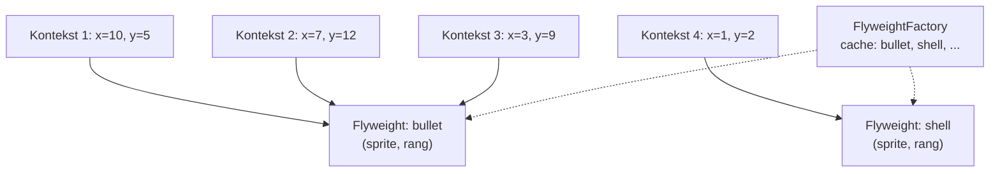
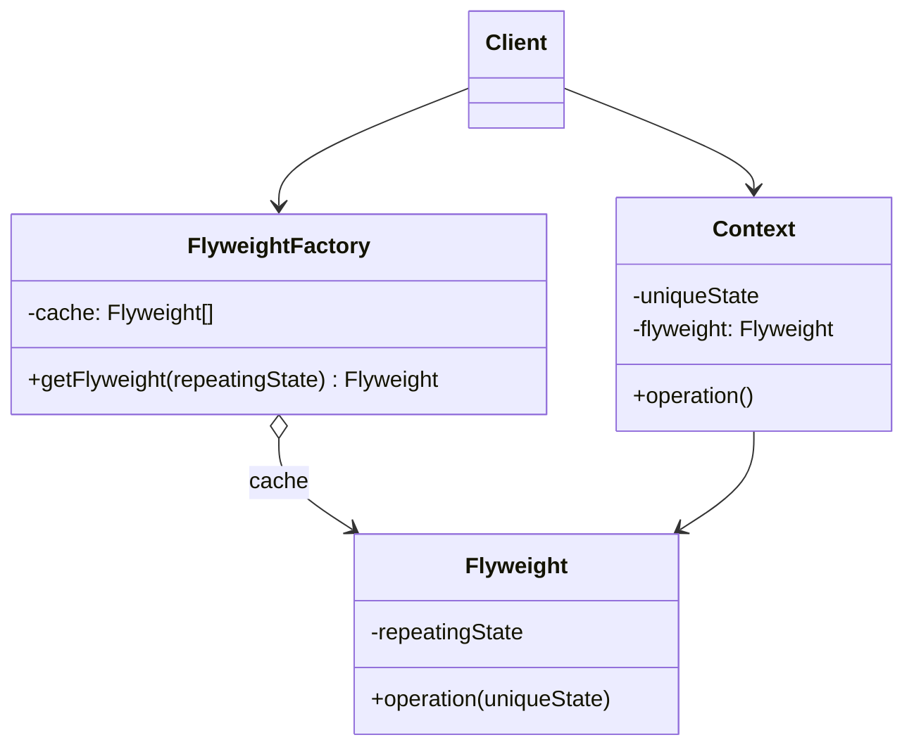

# Flyweight Pattern

> Boshqa nomlari: **Cache**, **Легковес** (nomi boksdan olingan — 50 kg gacha bo'lgan vazn toifasi)

**Flyweight** — structural (tuzilmaviy) pattern. U ajratilgan operativ xotiraga **ko'proq obyekt sig'dirish** imkonini beradi: bir xil ma'lumotni har bir obyektda saqlash o'rniga, obyektlarning **umumiy holatini o'zaro ulashadi**.

---

## STEP 1 — Umumiy tushuncha

### Muammo nima edi?

Bo'sh vaqtingizda o'yin yozdingiz: o'yinchilar xaritada yurib, bir-birini otadi. O'yinning "fishka"si — realistik **zarrachalar tizimi**: o'qlar, snaryadlar, portlash parchalari chiroyli uchib yuradi.

O'yin sizning kuchli kompyuteringizda zo'r ishladi. Lekin do'stingiz o'ynaganda o'yin bir necha daqiqadan keyin tormozlab, **qulab tushdi**. Loglarni kavlab bilib oldingiz: sabab — **operativ xotira yetishmasligi**. Do'stingizning kompyuteri kuchsizroq, shuning uchun muammo unda tez namoyon bo'ldi.

Haqiqiy sabab: har bir zarracha (o'q, snaryad, parcha) **alohida obyekt** bo'lib, ko'plab ma'lumot saqlaydi. Ekrandagi jang avjiga chiqqanda yangi zarracha obyektlari RAM'ga sig'may, dastur quladi.

### Pattern ishlatilmasa qanday muammolar bo'ladi?

| Muammo | Oqibat |
|--------|--------|
| Har bir obyekt o'zining to'liq nusxa-ma'lumotini saqlaydi | Million obyekt × og'ir maydonlar = RAM tugaydi |
| Bir xil ma'lumot (rang, sprite, tekstura) minglab marta takrorlanadi | Xotiraning katta qismi **duplikat**larga ketadi |
| Obyekt yaratish qimmatlashadi | GC bosimi, sekinlashuv, crash |

### Yechim nima?

Zarracha class'iga diqqat bilan qarasak: **rang** va **sprite** (rasm) eng ko'p xotira yeydi. Va eng muhimi — bu ikkala maydon **ko'pchilik zarrachalar uchun bir xil** (hamma o'q bir xil ko'rinadi), lekin har bir obyektda qayta-qayta saqlanadi.

Qolgan holat — **koordinatalar, harakat vektori, tezlik** — har bir zarrachada har xil, vaqt o'tishi bilan o'zgaradi. Bu obyekt ishlatiladigan **kontekst**.

Terminlar:

- **Intrinsic (ichki) holat** — obyekt ichida yashaydigan, **o'zgarmas**, ko'p obyektlarga umumiy ma'lumot (rang, sprite);
- **Extrinsic (tashqi) holat** — har obyekt uchun **unikal**, o'zgaruvchan kontekst (koordinata, tezlik).

Flyweight pattern'i **extrinsic holatni class'da saqlamaslikni** taklif qiladi — uni kerakli metodlarga **parametr orqali** uzatasiz. Class'da faqat intrinsic holat qoladi — bunday "yengillashgan" obyekt **flyweight** deyiladi. Endi bir xil flyweight'ni **turli kontekstlarda qayta ishlatish** mumkin. Zarracha misolida bor-yo'g'i **3 ta obyekt** yetadi: o'q, snaryad, parcha — koordinata, vektor, tezlik esa metodlarga parametr bo'lib keladi.

### Extrinsic holat qayerda saqlanadi?

Kimdir uni saqlashi kerak-ku! Odatda u pattern qo'llanishidan oldin obyektlarni saqlagan **container**'ga ko'chadi (bizda — asosiy o'yin obyekti). Eleganteroq usul: extrinsic holat + flyweight'ga havolani bog'laydigan alohida **kontekst class'i** yaratish.

"Shoshmang, obyektlar soni boshidagidek ko'p bo'lib qoladi-ku!" — deysiz va haqsiz. Lekin **kontekst obyektlari juda kichkina**: eng og'ir maydonlar (sprite, tekstura) flyweight'larda qoldi, kontekstda esa bir-ikki son + havola. Ming kontekst bitta og'ir flyweight'ni **ulashadi**.

### Flyweight o'zgarmasligi (immutability)

Bitta flyweight obyekti **turli kontekstlarda** ishlatilgani uchun uning holatini yaratilgandan keyin **o'zgartirib bo'lmasligi** kafolatlangan bo'lishi kerak: butun intrinsic holat constructor orqali beriladi, **setter va public maydonlar bo'lmaydi**. Aks holda bitta o'yinchining "rangini o'zgartirish" hammanikini o'zgartirib yuboradi.

### Flyweight Factory

Qulaylik uchun mavjud flyweight'larni boshqaradigan **factory metod** yaratiladi: u kerakli intrinsic holatni qabul qilib, unga mos flyweight'ni **qidiradi** — topilsa mavjudini qaytaradi, bo'lmasa yangisini yaratib ro'yxatga oladi. Bu metod flyweight container'ida, alohida factory class'da yoki flyweight class'ining static metodida bo'lishi mumkin.



### Asosiy qoida

> **Obyekt holatini ikkiga ajrat: o'zgarmas umumiy qismini (intrinsic) bitta ulashilgan obyektda sakla, unikal qismini (extrinsic) parametr sifatida uzat.**

### Struktura



1. Flyweight — **juda ko'p bir xil obyektli** dasturlarda qo'llanadi: obyektlar RAM'ga sig'may qolgandagina bu "hiyla" o'zini oqlaydi. Pattern ma'lumotni ikkiga bo'ladi: flyweight'lar va kontekstlar.
2. **Flyweight** — ko'plab asl obyektlarda takrorlangan (intrinsic) holatni saqlaydi; qolgan (extrinsic) holatni metod parametrlari orqali oladi. Bitta flyweight ko'plab kontekstlarda ishlatiladi.
3. **Context (kontekst)** — har obyekt uchun unikal extrinsic holatni va flyweight'ga havolani saqlaydi.
4. Asl obyektning **xatti-harakati** (metodlari) odatda flyweight'da qoladi (kontekst qiymatlari parametr bo'lib keladi); lekin uni kontekstga ham ko'chirish mumkin — u holda flyweight sof "ma'lumot obyekti" bo'ladi.
5. **Client** extrinsic holatni hisoblaydi yoki saqlaydi; flyweight'lar u uchun sozlanadigan "shablon obyektlar".
6. **Flyweight Factory** flyweight'larni yaratish va qayta ishlatishni boshqaradi: so'ralgan holatli flyweight bormi — qaytaradi, yo'qmi — yaratadi.

---

## STEP 2 — Python misoli

### ❌ Yomon misol (pattern'siz)

```python
# ❌ Politsiya bazasidagi har bir mashina TO'LIQ ma'lumotni o'zida saqlaydi
class Car:
    def __init__(self, plates, owner, brand, model, color):
        self.plates = plates    # unikal
        self.owner = owner      # unikal
        self.brand = brand      # ⚠️ minglab mashinada takror!
        self.model = model      # ⚠️ takror!
        self.color = color      # ⚠️ takror!

# Shahardagi 10 000 ta "BMW M5 red" uchun brand/model/color
# 10 000 marta xotirada saqlanadi. Real dasturda bu maydonlar
# katta obyektlar (rasm, spetsifikatsiya) bo'lsa — RAM portlaydi.
cars = [Car(f"PL{i}", f"Owner{i}", "BMW", "M5", "red") for i in range(10_000)]
```

### ✅ Flyweight bilan

`t/Python/src/Flyweight/Conceptual` misoli — politsiya bazasi: mashinaning brand/model/color'i (intrinsic) ulashiladi, raqam/egasi (extrinsic) alohida uzatiladi (izohlar o'zbekchada):

```python
import json
from typing import Dict


class Flyweight():
    """
    Flyweight — bir nechta real biznes-obyektga tegishli UMUMIY
    (intrinsic) holatni saqlaydi. Qolgan, har obyekt uchun unikal
    (extrinsic) holatni metod parametrlari orqali qabul qiladi.
    """

    def __init__(self, shared_state: str) -> None:
        self._shared_state = shared_state

    def operation(self, unique_state: str) -> None:
        s = json.dumps(self._shared_state)
        u = json.dumps(unique_state)
        print(f"Flyweight: Displaying shared ({s}) and unique ({u}) state.", end="")


class FlyweightFactory():
    """
    Flyweight Factory — flyweight obyektlarni yaratadi va boshqaradi,
    to'g'ri ulashilishini ta'minlaydi: client flyweight so'raganda
    mavjudini qaytaradi yoki (topilmasa) yangisini yaratadi.
    """

    _flyweights: Dict[str, Flyweight] = {}

    def __init__(self, initial_flyweights: Dict) -> None:
        for state in initial_flyweights:
            self._flyweights[self.get_key(state)] = Flyweight(state)

    def get_key(self, state: Dict) -> str:
        # Berilgan holat uchun kalit (hash) yasaydi.
        return "_".join(sorted(state))

    def get_flyweight(self, shared_state: Dict) -> Flyweight:
        # Mavjud flyweight'ni qaytaradi yoki yangisini yaratadi.
        key = self.get_key(shared_state)

        if not self._flyweights.get(key):
            print("FlyweightFactory: Can't find a flyweight, creating new one.")
            self._flyweights[key] = Flyweight(shared_state)
        else:
            print("FlyweightFactory: Reusing existing flyweight.")

        return self._flyweights[key]

    def list_flyweights(self) -> None:
        count = len(self._flyweights)
        print(f"FlyweightFactory: I have {count} flyweights:")
        print("\n".join(map(str, self._flyweights.keys())), end="")


def add_car_to_police_database(
    factory: FlyweightFactory, plates: str, owner: str,
    brand: str, model: str, color: str
) -> None:
    print("\n\nClient: Adding a car to database.")
    flyweight = factory.get_flyweight([brand, model, color])
    # Client extrinsic holatni saqlaydi yoki hisoblaydi va uni
    # flyweight metodlariga PARAMETR sifatida uzatadi.
    flyweight.operation([plates, owner])


if __name__ == "__main__":
    # Client odatda ilova ishga tushishida bir dasta oldindan
    # to'ldirilgan flyweight yaratadi.
    factory = FlyweightFactory([
        ["Chevrolet", "Camaro2018", "pink"],
        ["Mercedes Benz", "C300", "black"],
        ["Mercedes Benz", "C500", "red"],
        ["BMW", "M5", "red"],
        ["BMW", "X6", "white"],
    ])

    factory.list_flyweights()

    add_car_to_police_database(
        factory, "CL234IR", "James Doe", "BMW", "M5", "red")

    add_car_to_police_database(
        factory, "CL234IR", "James Doe", "BMW", "X1", "red")

    print("\n")

    factory.list_flyweights()
```

**Output:**

```
FlyweightFactory: I have 5 flyweights:
Camaro2018_Chevrolet_pink
C300_Mercedes Benz_black
C500_Mercedes Benz_red
BMW_M5_red
BMW_X6_white

Client: Adding a car to database.
FlyweightFactory: Reusing existing flyweight.
Flyweight: Displaying shared (["BMW", "M5", "red"]) and unique (["CL234IR", "James Doe"]) state.

Client: Adding a car to database.
FlyweightFactory: Can't find a flyweight, creating new one.
Flyweight: Displaying shared (["BMW", "X1", "red"]) and unique (["CL234IR", "James Doe"]) state.

FlyweightFactory: I have 6 flyweights:
Camaro2018_Chevrolet_pink
C300_Mercedes Benz_black
C500_Mercedes Benz_red
BMW_M5_red
BMW_X6_white
BMW_X1_red
```

**Nima yaxshilandi?** "BMW M5 red" nechta mashina bo'lishidan qat'i nazar xotirada **bitta**; factory mavjudini topsa qayta ishlatadi (`Reusing existing flyweight`), bo'lmasa yaratadi.

---

## STEP 3 — Go misoli

### ❌ Yomon misol (pattern'siz)

```go
package main

// ❌ Har bir o'yinchi o'z kiyimining TO'LIQ nusxasini saqlaydi
type Player struct {
	playerType string
	lat        int
	long       int
	dressColor string // ⚠️ har bir T uchun "red" QAYTA saqlanadi
	dressImage []byte // ⚠️ og'ir sprite har o'yinchida duplikat!
}

func newPlayer(playerType string) *Player {
	return &Player{
		playerType: playerType,
		dressColor: "red",
		dressImage: loadSprite("terrorist.png"), // har safar yuklanadi!
	}
}

// Counter-Strike'da 100 ta terrorist = 100 ta bir xil sprite
// xotirada. Sprite 1 MB bo'lsa — shunchaki 99 MB isrof.
```

### ✅ Flyweight bilan

`t/Go/flyweight` misoli — Counter-Strike: barcha terroristlar **bitta** qizil kiyim obyektini, barcha counter-terroristlar bitta yashil kiyimni ulashadi (izohlar o'zbekchada):

```go
// dress.go — Flyweight interface
package main

type Dress interface {
	getColor() string
}
```

```go
// terroristDress.go — Concrete Flyweight 1: intrinsic holat (rang).
// Setter yo'q — flyweight O'ZGARMAS bo'lishi shart!
package main

type TerroristDress struct {
	color string
}

func (t *TerroristDress) getColor() string {
	return t.color
}

func newTerroristDress() *TerroristDress {
	return &TerroristDress{color: "red"}
}
```

```go
// counterTerroristDress.go — Concrete Flyweight 2
package main

type CounterTerroristDress struct {
	color string
}

func (c *CounterTerroristDress) getColor() string {
	return c.color
}

func newCounterTerroristDress() *CounterTerroristDress {
	return &CounterTerroristDress{color: "green"}
}
```

```go
// dressFactory.go — Flyweight Factory: kiyimlarni cache'laydi.
// Bir tur kiyim faqat BIR MARTA yaratiladi.
package main

import "fmt"

const (
	//TerroristDressType terrorist dress type
	TerroristDressType = "tDress"
	//CounterTerrroristDressType terrorist dress type
	CounterTerrroristDressType = "ctDress"
)

var (
	dressFactorySingleInstance = &DressFactory{
		dressMap: make(map[string]Dress),
	}
)

type DressFactory struct {
	dressMap map[string]Dress
}

func (d *DressFactory) getDressByType(dressType string) (Dress, error) {
	// Cache'da bormi? Mavjudini qaytaramiz
	if d.dressMap[dressType] != nil {
		return d.dressMap[dressType], nil
	}

	// Yo'q — yaratamiz va cache'ga qo'shamiz
	if dressType == TerroristDressType {
		d.dressMap[dressType] = newTerroristDress()
		return d.dressMap[dressType], nil
	}
	if dressType == CounterTerrroristDressType {
		d.dressMap[dressType] = newCounterTerroristDress()
		return d.dressMap[dressType], nil
	}

	return nil, fmt.Errorf("Wrong dress type passed")
}

func getDressFactorySingleInstance() *DressFactory {
	return dressFactorySingleInstance
}
```

```go
// player.go — Context: unikal (extrinsic) holat — turi, koordinatalar.
// Kiyimga esa faqat HAVOLA saqlaydi (nusxa emas!)
package main

type Player struct {
	dress      Dress // flyweight'ga havola
	playerType string
	lat        int
	long       int
}

func newPlayer(playerType, dressType string) *Player {
	dress, _ := getDressFactorySingleInstance().getDressByType(dressType)
	return &Player{
		playerType: playerType,
		dress:      dress,
	}
}

func (p *Player) newLocation(lat, long int) {
	p.lat = lat
	p.long = long
}
```

```go
// game.go — Client: o'yinchilar ro'yxatini saqlaydi
package main

type game struct {
	terrorists        []*Player
	counterTerrorists []*Player
}

func newGame() *game {
	return &game{
		terrorists:        make([]*Player, 1),
		counterTerrorists: make([]*Player, 1),
	}
}

func (c *game) addTerrorist(dressType string) {
	player := newPlayer("T", dressType)
	c.terrorists = append(c.terrorists, player)
	return
}

func (c *game) addCounterTerrorist(dressType string) {
	player := newPlayer("CT", dressType)
	c.counterTerrorists = append(c.counterTerrorists, player)
	return
}
```

```go
// main.go — 7 ta o'yinchi, lekin kiyim obyektlari nechta?
package main

import "fmt"

func main() {
	game := newGame()

	//Add Terrorist
	game.addTerrorist(TerroristDressType)
	game.addTerrorist(TerroristDressType)
	game.addTerrorist(TerroristDressType)
	game.addTerrorist(TerroristDressType)

	//Add CounterTerrorist
	game.addCounterTerrorist(CounterTerrroristDressType)
	game.addCounterTerrorist(CounterTerrroristDressType)
	game.addCounterTerrorist(CounterTerrroristDressType)

	dressFactoryInstance := getDressFactorySingleInstance()

	for dressType, dress := range dressFactoryInstance.dressMap {
		fmt.Printf("DressColorType: %s\nDressColor: %s\n", dressType, dress.getColor())
	}
}
```

**Output:**

```
DressColorType: ctDress
DressColor: green
DressColorType: tDress
DressColor: red
```

**Nima yaxshilandi?**
- 7 ta o'yinchi (4 T + 3 CT) uchun kiyim obyekti **bor-yo'g'i 2 ta** — o'yinchi soni mingga chiqsa ham 2 taligicha qoladi;
- og'ir intrinsic ma'lumot (rang, real o'yinda — sprite/tekstura) **bir marta** saqlanadi;
- unikal holat (koordinatalar) yengil `Player` kontekstida.

---

## Qachon ishlatish kerak?

**Faqat bitta holat: kerakli obyektlarni saqlashga operativ xotira yetmayotganda.**

Pattern samarasi qanday va qayerda ishlatilishiga bog'liq. U quyidagi shartlar **hammasi** bajarilganda foydali:

- ilovada **juda ko'p** obyekt ishlatiladi;
- shu sabab **RAM sarfi yuqori**;
- obyektlar holatining **katta qismini tashqariga chiqarish** mumkin;
- extrinsic holat chiqarilgach, katta obyekt guruhlarini **nisbatan oz sonli ulashiluvchi obyektlar** bilan almashtirish mumkin.

---

## Implementatsiya qadamlari

1. Flyweight bo'ladigan class maydonlarini **ikkiga ajrating**:
   - **intrinsic holat** — ko'plab obyektlarda bir xil qiymatli maydonlar;
   - **extrinsic holat (kontekst)** — har obyektda unikal maydonlar.
2. Intrinsic holat maydonlarini class'da qoldiring, lekin ular **o'zgarmas** bo'lsin: qiymat faqat constructor orqali kelsin.
3. Extrinsic holat ishlatiladigan metodlarda uni **parametrlarga aylantiring**, so'ng maydonlarni class'dan o'chiring.
4. Mavjud flyweight'larni **cache'laydigan va qayta beradigan factory** yarating — client flyweight'ni to'g'ridan-to'g'ri emas, factory orqali, kerakli intrinsic holatni ko'rsatib so'rasin.
5. Client extrinsic holatni (kontekstni) **o'zi saqlashi yoki hisoblashi** va flyweight metodlariga uzatishi kerak — qulaylik uchun uni alohida kontekst class'iga chiqaring (flyweight'ga havola bilan birga).

---

## Afzalliklar va kamchiliklar

| ✅ Afzalliklar | ❌ Kamchiliklar |
|---------------|----------------|
| Operativ xotirani sezilarli tejaydi | Kontekstni qidirish/hisoblashga **CPU vaqti** sarflanadi (xotira ↔ protsessor almashuvi) |
| Bir xil ma'lumot duplikatlari yo'qoladi | Ko'plab qo'shimcha class'lar (factory, kontekst) hisobiga kod murakkablashadi |
| | Holat "bo'lingani" uchun kodni tushunish qiyinlashadi |

---

## Boshqa patternlar bilan aloqasi

- **Composite** daraxtining takrorlanuvchi (umumiy) shoxlarini Flyweight bilan ifodalab, xotira tejash mumkin.
- **Flyweight** ko'p **mayda** obyekt yasashni ko'rsatadi; **Facade** butun subsystem'ni ifodalovchi **bitta** obyekt yasashni.
- **Flyweight Singleton'ga o'xshab qolishi mumkin** (agar obyektlar soni bittagacha qisqartirilsa), lekin ikki tub farq bor:
  1. Singleton — **bitta** instance; flyweight'lar **bir nechta** bo'lishi mumkin (har xil intrinsic holat bilan);
  2. flyweight'lar **immutable**, singleton esa holatini o'zgartira oladi.

---

## Real hayotdagi misollar

- **Matn muharrirlari**: har bir harf uchun glyph (shakl, shrift) — flyweight; pozitsiya — kontekst. Million harfli kitob uchun ~100 ta glyph obyekt yetadi.
- **O'yinlar**: daraxt/o't teksturalari (o'rmonda million daraxt — 5-6 tur), zarracha tizimlari.
- **Go'da string interning**: bir xil string literallar bitta joyda saqlanishi — flyweight g'oyasi.
- **Java `Integer.valueOf(-128..127)`**, Python'dagi kichik int'lar cache'i — tildagi tayyor flyweight'lar.

---

## Xulosa

### Eslab qol

- Flyweight — **optimallashtirish** pattern'i: RAM muammosi **isbotlangandagina** qo'llang, oldindan emas.
- Holatni ajratish: **intrinsic** (umumiy, o'zgarmas → flyweight ichida) va **extrinsic** (unikal → parametr/kontekst).
- Flyweight **immutable bo'lishi shart** — setter yo'q, hamma narsa constructor'dan.
- **Factory + cache** — flyweight'larni yaratish/topishning yagona nuqtasi.
- Narxi bor: xotira tejaladi, lekin **CPU** (kontekst uzatish/qidirish) va **kod murakkabligi** ortadi.

### Amaliyot

1. `t/Go/flyweight`'da 1000 ta terrorist qo'shing va `dressMap` hajmi baribir 2 taligini tekshiring.
2. Yomon misol variantida (har o'yinchida `dressImage []byte` 1 MB) 1000 o'yinchi qancha xotira yeyishini hisoblang; flyweight bilan-chi?
3. Python misolida `FlyweightFactory`'ga hisoblagich qo'shing: nechta so'rovdan nechtasi "Reusing" bo'ldi?
4. `TerroristDress`'ga `setColor` qo'shilsa nima buzilishini tushuntirib bering (nega flyweight immutable bo'lishi kerak).

---

## Keyingi qadam

→ [7. Proxy.md](7.%20Proxy.md)
