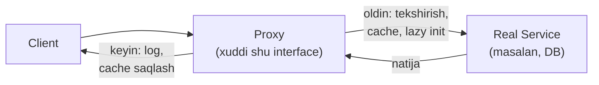
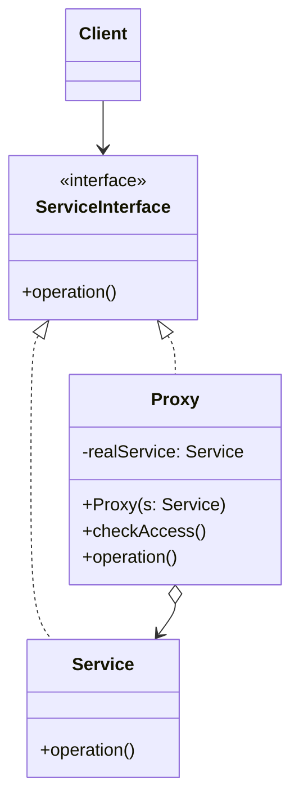

# Proxy Pattern

> Boshqa nomi: **Заместитель (o'rinbosar)**

**Proxy** — structural (tuzilmaviy) pattern. U real obyektlar o'rniga maxsus **o'rinbosar obyektlar** qo'yish imkonini beradi. O'rinbosar originalga qilingan chaqiruvlarni **ushlab qoladi** va chaqiruvni originalga uzatishdan **oldin yoki keyin** biror ish bajaradi.

---

## STEP 1 — Umumiy tushuncha

### Muammo nima edi?

Obyektga kirishni umuman nima uchun nazorat qilish kerak? Misol: sizda **resurstalab tashqi obyekt** bor — masalan, database bilan ishlaydigan obyekt. U doim emas, **vaqti-vaqti bilan** kerak, so'rovlari esa sekin.

Obyektni dastur boshida emas, **chindan kerak bo'lgandagina** yaratish (lazy initialization) mumkin edi. Lekin bu kodni har bir client o'zida takrorlashiga to'g'ri keladi — ko'p duplikat. Ideal holda bu kodni servis class'ining o'ziga joylash kerak edi, lekin bu **har doim ham mumkin emas**: class yopiq 3rd-party library'da bo'lishi mumkin.

### Pattern ishlatilmasa qanday muammolar bo'ladi?

| Muammo | Oqibat |
|--------|--------|
| Og'ir obyekt dastur boshidayoq yaratiladi | Resurslar behuda band, sekin start |
| Lazy init / cache / access nazorati har bir client'da | Kod duplikatlari, unutish xavfi |
| Bu logikani servisga joylab bo'lmaydi | Servis 3rd-party yoki unga boshqa kod bog'liq |
| Servisga kirish nazoratsiz | Xavfsizlik/loglar/limitlarsiz to'g'ridan-to'g'ri kirish |

### Yechim nima?

Proxy pattern'i original servis obyekt bilan **bir xil interface**'ga ega **yangi "dubler" class** yaratishni taklif qiladi. Client so'rov yuborganda proxy obyekt servis obyektini (kerak bo'lsa) **o'zi yaratadi** va butun real ishni unga **uzatadi**.

Foydasi nimada? Proxy'ga real obyekt metodlari chaqiruvidan **oldin yoki keyin** bajariladigan oraliq logika joylanadi: lazy yaratish, cache, ruxsat tekshirish, log... Va interface **bir xil** bo'lgani uchun proxy'ni servis obyektini kutayotgan **istalgan kodga** berish mumkin — client hech narsani sezmaydi.



### Hayotiy analogiya

**Bank kartasi** — bir dasta naqd pulning o'rinbosari (proxy). Karta ham, naqd pul ham **bitta interface**'ga ega: ikkalasi bilan to'lash mumkin. Xaridor xursand — pul qopini ko'tarib yurish shart emas; do'kon egasi xursand — tushumni bankka inkassatsiya qilish kerak emas, pul hisobiga to'g'ridan-to'g'ri tushadi.

### Asosiy qoida

> **Servis oldiga u bilan bir xil interface'dagi o'rinbosarni qo'y: client farqni sezmaydi, o'rinbosar esa chaqiruvdan oldin/keyin o'z ishini (lazy init, cache, himoya, log) bajaradi.**

### Struktura



1. **Service Interface** — servis va proxy uchun umumiy interface; shu tufayli proxy'ni servis kutilgan istalgan joyda ishlatish mumkin.
2. **Service** — foydali biznes-logikani o'z ichiga olgan class.
3. **Proxy** — servis obyektiga **havola** saqlaydi. O'z ishini (lazy init, log, himoya, cache...) bajarib bo'lgach, chaqiruvni ichki servisga uzatadi. Ko'pincha servis obyektining **butun hayotiy siklini** (yaratish/o'chirish) o'zi boshqaradi.
4. **Client** servislar bilan ham, proxy'lar bilan ham **bitta interface** orqali ishlaydi — uni "aldab", servis o'rniga proxy berish mumkin.

---

## STEP 2 — Python misoli

### ❌ Yomon misol (pattern'siz)

```python
class RealSubject:
    def request(self) -> None:
        print("RealSubject: Handling request.")


# ❌ Har bir client kirish nazorati va log'ni O'ZI yozadi
def client_a(subject: RealSubject):
    if check_access():          # takror
        subject.request()
        log_access()            # takror

def client_b(subject: RealSubject):
    # Bu dasturchi tekshirishni UNUTDI — himoyasiz kirish!
    subject.request()

# Nazorat logikasi servisga ham joylanmaydi (3rd-party bo'lsa),
# natijada u client'lar bo'ylab sochilib, unutilib qoladi.
```

### ✅ Proxy bilan

`t/Python/src/Proxy/Conceptual` misoli (izohlar o'zbekchada):

```python
from abc import ABC, abstractmethod


class Subject(ABC):
    """
    Subject interface — RealSubject uchun ham, Proxy uchun ham umumiy
    operatsiyalarni e'lon qiladi. Client shu interface orqali ishlasa,
    unga real obyekt o'rniga proxy'ni berish mumkin.
    """

    @abstractmethod
    def request(self) -> None:
        pass


class RealSubject(Subject):
    """
    RealSubject — asosiy biznes-logika. Odatda foydali, lekin sekin
    yoki nozik ish bajaradi. Proxy bu muammolarni RealSubject kodini
    O'ZGARTIRMASDAN hal qila oladi.
    """

    def request(self) -> None:
        print("RealSubject: Handling request.")


class Proxy(Subject):
    """
    Proxy interface'i RealSubject'niki bilan BIR XIL.
    """

    def __init__(self, real_subject: RealSubject) -> None:
        self._real_subject = real_subject

    def request(self) -> None:
        # Eng ko'p qo'llanadigan proxy turlari: lazy loading, caching,
        # kirish nazorati, logging. Proxy o'z ishini bajarib, natijaga
        # qarab chaqiruvni real obyektning shu nomdagi metodiga uzatadi.
        if self.check_access():
            self._real_subject.request()
            self.log_access()

    def check_access(self) -> bool:
        print("Proxy: Checking access prior to firing a real request.")
        return True

    def log_access(self) -> None:
        print("Proxy: Logging the time of request.", end="")


def client_code(subject: Subject) -> None:
    # Client kod real obyekt bilan ham, proxy bilan ham ishlashi uchun
    # Subject interface'iga tayanadi.
    subject.request()


if __name__ == "__main__":
    print("Client: Executing the client code with a real subject:")
    real_subject = RealSubject()
    client_code(real_subject)

    print("")

    print("Client: Executing the same client code with a proxy:")
    proxy = Proxy(real_subject)
    client_code(proxy)
```

**Output:**

```
Client: Executing the client code with a real subject:
RealSubject: Handling request.

Client: Executing the same client code with a proxy:
Proxy: Checking access prior to firing a real request.
RealSubject: Handling request.
Proxy: Logging the time of request.
```

**Nima yaxshilandi?** `client_code` **bir xil** — unga real obyekt bersangiz ham, proxy bersangiz ham ishlaydi; nazorat va log **bitta joyda**, unutib bo'lmaydi; `RealSubject` o'zgarmadi.

---

## STEP 3 — Go misoli

### ❌ Yomon misol (pattern'siz)

```go
package main

// ❌ Rate limiting YO'Q — application to'g'ridan-to'g'ri ochiq
func main() {
	app := &Application{}

	// Istalgancha so'rov — server himoyasiz:
	for i := 0; i < 1000000; i++ {
		app.handleRequest("/app/status", "GET") // DDoS!
	}

	// Yoki limitni har bir chaqiruv joyida qo'lda yozish kerak:
	// if requestCount["/app/status"] < 2 { app.handleRequest(...) }
	// — buni birov unutsa, himoya teshiladi.
}
```

### ✅ Proxy bilan

`t/Go/proxy` misoli — **Nginx** web-serverning klassik proxy'si: application serverga kirishni nazorat qiladi (rate limiting) (izohlar o'zbekchada):

```go
// server.go — Service Interface: proxy ham, real server ham
// shunga bo'ysunadi
package main

type server interface {
	handleRequest(string, string) (int, string)
}
```

```go
// application.go — Real Service: asosiy biznes-logika
package main

type Application struct {
}

func (a *Application) handleRequest(url, method string) (int, string) {
	if url == "/app/status" && method == "GET" {
		return 200, "Ok"
	}

	if url == "/create/user" && method == "POST" {
		return 201, "User Created"
	}
	return 404, "Not Ok"
}
```

```go
// nginx.go — Proxy: application'ga havola saqlaydi,
// har so'rovda OLDIN rate limit tekshiradi
package main

type Nginx struct {
	application       *Application
	maxAllowedRequest int
	rateLimiter       map[string]int
}

// Proxy real servis obyektini O'ZI yaratadi va boshqaradi
func newNginxServer() *Nginx {
	return &Nginx{
		application:       &Application{},
		maxAllowedRequest: 2,
		rateLimiter:       make(map[string]int),
	}
}

func (n *Nginx) handleRequest(url, method string) (int, string) {
	// OLDIN: kirish nazorati
	allowed := n.checkRateLimiting(url)
	if !allowed {
		return 403, "Not Allowed"
	}
	// KEYIN: real servisga delegatsiya
	return n.application.handleRequest(url, method)
}

func (n *Nginx) checkRateLimiting(url string) bool {
	if n.rateLimiter[url] == 0 {
		n.rateLimiter[url] = 1
	}
	if n.rateLimiter[url] > n.maxAllowedRequest {
		return false
	}
	n.rateLimiter[url] = n.rateLimiter[url] + 1
	return true
}
```

```go
// main.go — Client: Nginx bilan xuddi application bilan
// ishlagandek ishlaydi (interface bir xil!)
package main

import "fmt"

func main() {

	nginxServer := newNginxServer()
	appStatusURL := "/app/status"
	createuserURL := "/create/user"

	httpCode, body := nginxServer.handleRequest(appStatusURL, "GET")
	fmt.Printf("\nUrl: %s\nHttpCode: %d\nBody: %s\n", appStatusURL, httpCode, body)

	httpCode, body = nginxServer.handleRequest(appStatusURL, "GET")
	fmt.Printf("\nUrl: %s\nHttpCode: %d\nBody: %s\n", appStatusURL, httpCode, body)

	// Uchinchi so'rov — limit oshdi, proxy 403 qaytaradi,
	// application'ga so'rov UMUMAN yetib bormaydi
	httpCode, body = nginxServer.handleRequest(appStatusURL, "GET")
	fmt.Printf("\nUrl: %s\nHttpCode: %d\nBody: %s\n", appStatusURL, httpCode, body)

	httpCode, body = nginxServer.handleRequest(createuserURL, "POST")
	fmt.Printf("\nUrl: %s\nHttpCode: %d\nBody: %s\n", appStatusURL, httpCode, body)

	httpCode, body = nginxServer.handleRequest(createuserURL, "GET")
	fmt.Printf("\nUrl: %s\nHttpCode: %d\nBody: %s\n", appStatusURL, httpCode, body)
}
```

**Output:**

```
Url: /app/status
HttpCode: 200
Body: Ok

Url: /app/status
HttpCode: 200
Body: Ok

Url: /app/status
HttpCode: 403
Body: Not Allowed

Url: /app/status
HttpCode: 201
Body: User Created

Url: /app/status
HttpCode: 404
Body: Not Ok
```

**Nima yaxshilandi?**
- Rate limiting **bitta joyda** (proxy'da) — `Application` kodi bu haqda umuman bilmaydi;
- limit oshganda so'rov real servisga **yetib bormaydi** — resurs tejaladi;
- interface bir xil bo'lgani uchun client kodda **hech narsa o'zgarmaydi**.

---

## Qachon ishlatish kerak?

**1. Lazy initialization (virtual proxy)** — fayl tizimi yoki DB'dan ma'lumot yuklaydigan og'ir obyekt bo'lsa: uni dastur startida emas, **chindan kerak bo'lganda** yaratish.

**2. Kirishni himoyalash (protection proxy)** — dasturda har xil turdagi foydalanuvchilar bo'lib, obyektni ruxsatsiz kirishdan himoyalash kerak bo'lsa (masalan, obyektlaringiz — OS'ning muhim qismi, foydalanuvchilar — turli dasturlar). Proxy har chaqiruvda ruxsatni tekshiradi, ruxsat bo'lsagina servисga uzatadi.

**3. Uzoqdagi servis (remote proxy)** — real servis obyekti uzoq serverda bo'lsa: proxy client so'rovlarini tarmoq chaqiruvlariga (uzoq servis tushunadigan protokolda) aylantiradi.

**4. So'rovlarni loglash (logging proxy)** — servisga murojaatlar tarixini saqlash kerak bo'lsa.

**5. Natijalarni cache'lash ("aqlli" havola / smart reference)** — client so'rovlari natijasini cache'lash va hayotiy siklini boshqarish kerak bo'lsa. Proxy client'larga berilgan faol havolalarni sanashi ham mumkin: hammasi bo'shagach, servis obyektini o'chirish (masalan, DB ulanishini yopish) mumkin bo'ladi.

---

## Implementatsiya qadamlari

1. Proxy va original obyektni almashtiriladigan qiladigan **umumiy interface**'ni aniqlang.
2. **Proxy class** yarating: unda servis obyektiga havola bo'lsin. Ko'pincha servis obyektini proxy **o'zi yaratadi**; kamdan-kam hollarda tayyor obyekt constructor orqali beriladi.
3. Proxy metodlarini maqsadiga ko'ra implementatsiya qiling: odatda o'z ishini qilib bo'lgach, so'rovni **servis obyektiga uzatsin**.
4. Client'ga proxy berishmi yoki real servismi — buni hal qiluvchi **factory** kiritishni o'ylab ko'ring (yoki bu mantiqni proxy'ning yaratuvchi metodiga joylang).
5. Servis obyektini client birinchi murojaat qilganda yaratadigan **lazy initialization**'ni ham ko'rib chiqing.

---

## Afzalliklar va kamchiliklar

| ✅ Afzalliklar | ❌ Kamchiliklar |
|---------------|----------------|
| Servis obyektini client sezmagan holda nazorat qilish | Qo'shimcha class'lar hisobiga kod murakkablashadi |
| Servis obyekti hali yaratilmagan bo'lsa ham ishlay oladi | Servis javobi kechikishi mumkin (qo'shimcha qatlam) |
| Servis obyektining hayotiy siklini boshqara oladi | |

---

## Boshqa patternlar bilan aloqasi

- **Adapter** mavjud obyektga **boshqa** interface beradi; **Proxy** — **xuddi shu** interface; **Decorator** — **kengaytirilgan** interface.
- **Facade Proxy'ga o'xshaydi**: ikkalasi murakkab narsani almashtirib, o'zi initsializatsiya qila oladi. Farqi: Proxy o'z servis obyekti bilan **bir xil interface'da**, shuning uchun ularni **almashtirish** mumkin; Facade esa yangi soddalashtirilgan interface beradi.
- **Decorator va Proxy** strukturasi o'xshash (kompozitsiya + delegatsiya), maqsadi har xil: **Proxy servis obyektining hayotini o'zi boshqaradi**, Decorator'larni o'rash esa **client nazoratida**; Proxy kirishni nazorat qiladi, Decorator funksiya qo'shadi.

### Decorator vs Proxy (tezkor jadval)

| | Decorator | Proxy |
|--|-----------|-------|
| **Maqsad** | Funksionallik qo'shish | Kirishni nazorat qilish |
| **Ichki obyektni kim yaratadi** | Client (tashqaridan beradi) | Ko'pincha proxy'ning o'zi (lazy) |
| **Interface** | Bir xil yoki kengaytirilgan | Qat'iy bir xil |
| **Rekursiv o'rash** | Ha, zanjir tipik | Odatda bitta qatlam |

---

## Go'da real-world misollar

### Virtual proxy (lazy loading)

```go
type Image interface {
    Display()
}

// Og'ir obyekt: yaratish qimmat
type RealImage struct {
    filename string
    data     []byte
}

// Proxy: yaratishni birinchi ishlatishgacha KECHIKTIRADI
type LazyImageProxy struct {
    filename string
    real     *RealImage
    once     sync.Once
}

func (p *LazyImageProxy) Display() {
    p.once.Do(func() {
        p.real = NewRealImage(p.filename) // faqat shu yerda yuklanadi
    })
    p.real.Display()
}

// 100 ta rasm proxy'si yaratiladi — birortasi ham yuklanmaydi,
// faqat Display() chaqirilgani diskdan o'qiladi.
```

### Protection proxy (rol tekshirish)

```go
type SecureFileSystem struct {
    real     FileSystem
    userRole string
}

func (s *SecureFileSystem) Delete(path string) error {
    if s.userRole != "admin" {
        return fmt.Errorf("faqat admin o'chira oladi")
    }
    return s.real.Delete(path)
}
```

### Caching proxy

```go
type CachingProxy struct {
    real  DataService
    cache map[string]string
    mu    sync.RWMutex
}

func (p *CachingProxy) FetchData(id string) (string, error) {
    p.mu.RLock()
    if data, ok := p.cache[id]; ok {
        p.mu.RUnlock()
        return data, nil // tarmoqqa chiqmasdan cache'dan
    }
    p.mu.RUnlock()

    data, err := p.real.FetchData(id) // real servisga faqat cache miss'da
    if err != nil {
        return "", err
    }

    p.mu.Lock()
    p.cache[id] = data
    p.mu.Unlock()
    return data, nil
}
```

Tanish real misollar: **Nginx/Envoy** (reverse proxy), **DB connection pool**, ORM'lardagi lazy relations, gRPC client stub'lari (remote proxy).

---

## Xulosa

### Eslab qol

- Proxy = **bir xil interface'dagi o'rinbosar**: client farqni sezmaydi, proxy chaqiruvdan oldin/keyin o'z ishini bajaradi.
- 5 asosiy turi: **virtual** (lazy init), **protection** (ruxsat), **remote** (tarmoq), **logging** (tarix), **caching/smart reference** (cache + hayotiy sikl).
- Decorator'dan farqlash: proxy **nazorat qiladi** va ichki obyektni **o'zi boshqaradi**; decorator **funksiya qo'shadi** va uni **client yig'adi**.
- Facade'dan farqlash: proxy interface'ni **saqlaydi** (almashtirsa bo'ladi), facade **yangi sodda** interface yaratadi.
- Proxy servis kodiga **tegmasdan** ishlaydi — 3rd-party servislarga nazorat qo'shishning asosiy usuli.

### Amaliyot

1. `t/Go/proxy`'da `maxAllowedRequest`'ni 5 ga ko'taring va output qanday o'zgarishini oldindan aytib, keyin tekshiring.
2. `Nginx`'ga logging qo'shing: har so'rov URL + status'ini chop etsin — `Application` kodiga tegmasdan.
3. Python misolida `check_access` ba'zan `False` qaytaradigan qilib o'zgartiring — real obyekt chaqirilmasligiga ishonch hosil qiling.
4. Yomon misoldagi "har client o'zi tekshiradi" variantida bitta client tekshirishni unutsa nima bo'lishini kod bilan ko'rsating.

---

## Keyingi qadam

Structural patternlar tugadi! 🎉

→ [../4. Behavioral (xulq-atvoriy)/](../4.%20Behavioral%20(xulq-atvoriy)/) — endi obyektlarning **o'zaro muloqoti** patternlariga o'tamiz.
