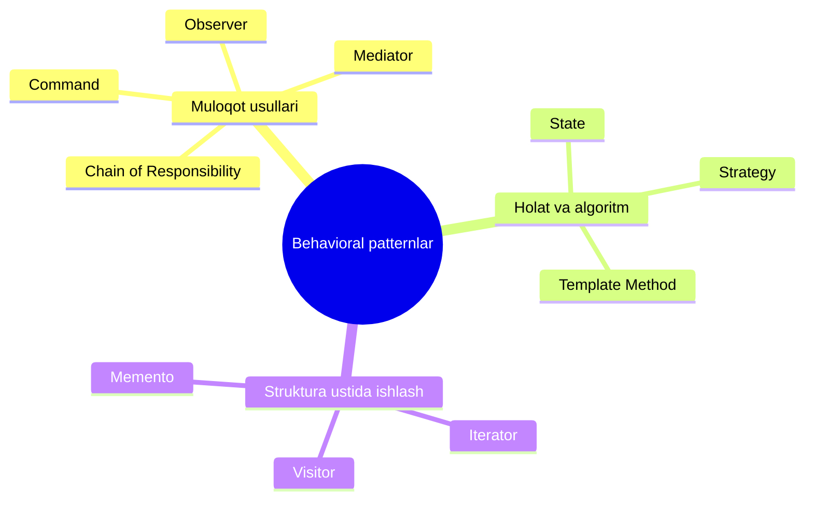

# Behavioral (Xulq-atvoriy) Patternlar

**Behavioral patternlar** — dastur obyektlari orasidagi **samarali va xavfsiz muloqot** masalalarini yechadigan design patternlar guruhi.

Creational patternlar obyekt **yaratish**ni, structural patternlar obyektlarni **birlashtirish**ni hal qilsa, behavioral patternlar obyektlarning **o'zaro gaplashishi va mas'uliyat taqsimoti**ni tartibga soladi.

## 10 ta pattern

| # | Pattern | Bir jumlada |
|---|---------|-------------|
| 1 | [Chain of Responsibility](1.%20Chain%20of%20Responsibility.md) | So'rovni handler'lar zanjiri bo'ylab uzatadi; har bir handler o'zi yechishni yoki keyingisiga berishni hal qiladi |
| 2 | [Command](2.%20Command.md) | So'rovlarni obyektga aylantiradi — argument qilib uzatish, navbatga qo'yish, loglash va undo uchun |
| 3 | [Iterator](3.%20Iterator.md) | Tarkibli obyektlar elementlarini ichki tuzilishini ochmasdan ketma-ket aylanib chiqish imkonini beradi |
| 4 | [Mediator](4.%20Mediator.md) | Ko'plab class'lar orasidagi bog'liqlikni bitta vositachi-class'ga ko'chirib kamaytiradi |
| 5 | [Memento](5.%20Memento.md) | Obyektning o'tgan holatlarini implementatsiya tafsilotlarini ochmasdan saqlash va tiklash imkonini beradi |
| 6 | [Observer](6.%20Observer.md) | Obuna mexanizmi: bir obyektlar boshqalaridagi hodisalarni kuzatib, reaksiya bildiradi |
| 7 | [State](7.%20State.md) | Obyekt o'z holatiga qarab xatti-harakatini o'zgartiradi — tashqaridan class almashganday ko'rinadi |
| 8 | [Strategy](8.%20Strategy.md) | O'xshash algoritmlar oilasini alohida class'larga chiqarib, ularni runtime'da almashtirish imkonini beradi |
| 9 | [Template Method](9.%20Template%20Method.md) | Algoritm skeletini belgilab, ayrim qadamlarini subclass'larga topshiradi |
| 10 | [Visitor](10.%20Visitor.md) | Obyektlar class'lariga tegmasdan, ular ustida yangi operatsiyalar qo'shish imkonini beradi |

## Yuboruvchi ↔ qabul qiluvchi: 4 usul

To'rt pattern so'rov yuboruvchilar va qabul qiluvchilar munosabatining har xil usullarini ko'rsatadi — ularni farqlash muhim:

| Pattern | Aloqa turi |
|---------|-----------|
| **Chain of Responsibility** | So'rov potensial qabul qiluvchilar **zanjiri bo'ylab ketma-ket** yuradi — kimdir ishlov berguncha |
| **Command** | Yuboruvchi va qabul qiluvchi orasida **bilvosita, bir tomonlama** aloqa o'rnatadi |
| **Mediator** | To'g'ridan-to'g'ri aloqani **yo'q qilib**, muloqotni o'zi orqali o'tkazadi |
| **Observer** | So'rovni **barcha qiziqqanlarga bir vaqtda** uzatadi; obuna/obunani bekor qilish dinamik |

## Oson adashtiriladigan juftliklar

- **Strategy vs State**: ikkalasi kompozitsiya; lekin Strategy'da algoritmlar bir-birini **bilmaydi**, State'da holatlar **o'zi kontekstni keyingi holatga o'tkaza oladi**.
- **Strategy vs Template Method**: Strategy — **delegatsiya** (runtime'da almashadi, obyekt darajasida), Template Method — **inheritance** (class darajasida).
- **Mediator vs Observer**: Mediator o'zaro bog'liqlikni **markazlashtiradi**, Observer **dinamik bir tomonlama** obuna beradi; Mediator ko'pincha Observer orqali quriladi.
- **Command vs Strategy**: Command **har xil amallarni** obyektga aylantiradi; Strategy **bitta amalning har xil usullarini** almashtiradi.

## O'qish tartibi

1 → 10 tartibda o'qish tavsiya etiladi: avval muloqot patternlari (CoR, Command), keyin struktura (Iterator, Mediator, Memento, Observer), so'ng algoritm/holat oilasi (State, Strategy, Template Method) va yakunda eng murakkabi — Visitor.

← [Structural patternlar](../3.%20Structural%20(tuzulmaviy)/0.%20README.md)
