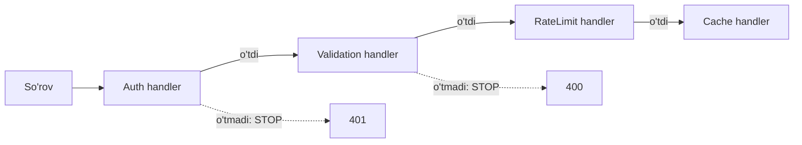
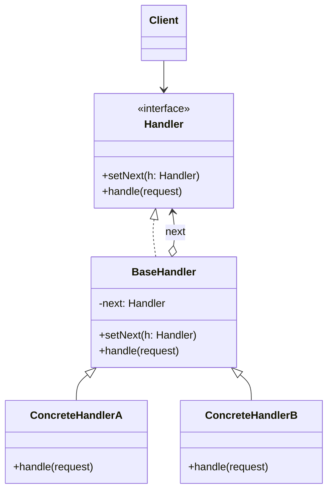

# Chain of Responsibility Pattern

> Boshqa nomlari: **CoR**, **Chain of Command**, **Цепочка обязанностей**

**Chain of Responsibility** — behavioral (xulq-atvoriy) pattern. U so'rovlarni **handler'lar zanjiri bo'ylab ketma-ket uzatish** imkonini beradi. Har bir handler so'rovni o'zi qayta ishlashni yoki zanjirdagi keyingisiga uzatishni o'zi hal qiladi.

---

## STEP 1 — Umumiy tushuncha

### Muammo nima edi?

Onlayn buyurtmalar tizimini yozyapsiz. Kirishni cheklamoqchisiz: faqat **avtorizatsiyadan o'tgan** foydalanuvchilar buyurtma yarata olsin, **admin**lar esa hamma buyurtmani ko'ra olsin.

Bu tekshiruvlar **ketma-ket** bajarilishi kerakligini tez angladingiz: login/parol noto'g'ri bo'lsa, admin huquqlarini tekshirishning ma'nosi yo'q. Keyingi oylarda yana bir nechta tekshiruv qo'shildi:

- so'rovdagi ma'lumotlarni **validatsiya** qilish (mavjud bo'lmagan mahsulot so'ralmayaptimi?);
- bitta logindan **mass so'rovlarni bloklash** (botlarning parol terishiga qarshi);
- forma allaqachon ko'rsatilgan bo'lsa, natijani **cache'dan** olish.

Har yangi "fича" bilan tekshiruvlar kodi — katta shartli operatorlar kalavasi — shishib boraverdi. Bitta qoida o'zgarsa, **hamma** tekshiruvlarga tegishga to'g'ri keldi. Tekshiruvlarni boshqa resurslarga qo'llash uchun esa kodni **nusxalashga** majbur bo'ldingiz. Bir kuni sizga refactoring topshirig'i keldi...

### Pattern ishlatilmasa qanday muammolar bo'ladi?

| Muammo | Oqibat |
|--------|--------|
| Barcha tekshiruvlar bitta funksiya/class ichida | Shishgan `if/else` kalavasi, tushunish qiyin |
| Bir qoida o'zgarsa | Hamma tekshiruvlar kodini qayta ko'rish kerak |
| Tekshiruvlar boshqa joyda ham kerak | Kod dublikatlari |
| Tekshiruvlar tartibini/tarkibini o'zgartirish | Kodni qayta yozish, runtime'da imkonsiz |

### Yechim nima?

Boshqa ko'p behavioral patternlar kabi, CoR ham **alohida xatti-harakatlarni obyektlarga aylantirish**ga asoslanadi: har bir tekshiruv yagona bajarish metodiga ega **alohida handler class**ga ko'chadi; so'rov ma'lumotlari metodga argument bo'lib keladi.

Asosiy g'oya: handler obyektlari **zanjirga bog'lanadi** — har birida keyingi handler'ga **havola** bor. Handler so'rovga o'zi ishlov berishi bilan birga uni zanjir bo'ylab keyingisiga uzata oladi. So'rovni zanjirning boshiga bersangiz — u kerakli handler'gacha o'zi yetib boradi; zanjir uzunligi ahamiyatsiz.

Va muhim shtrix: handler so'rovni **davom ettirmasligi ham mumkin**. Bu ikki xil ishlatiladi:

1. **Filtrlash zanjiri** (bizning misol): tekshiruv o'tmasa — zanjir uziladi, keyingi tekshiruvlarga resurs sarflanmaydi.
2. **"Kim ishlov bera oladi" zanjiri**: so'rov ishlov bera oladigan handler topilguncha yuradi va **o'sha yerda to'xtaydi**. GUI'dagi hodisalar shunday ishlaydi: tugma bosilsa, hodisa tugma → panel → oyna zanjiri bo'ylab, kim ishlov berolsa o'shanigacha ko'tariladi (zanjir odatda obyektlar daraxtidan ajratib olinadi).

Barcha zanjir obyektlari **umumiy interface**'ga ega bo'lishi shart — har handler faqat keyingisining `handle` metodi borligini bilsin. Shunda zanjirni turli obyektlardan, konkret class'larga bog'lanmasdan, **runtime'da** yig'ish mumkin.



### Hayotiy analogiya

Yangi videokarta Ubuntu'da ishlamayapti, **texnik yordamga** qo'ng'iroq qildingiz. Avval **avtojavobgich** — o'nta standart yechim, hech biri mos emas. Keyin **operator** — yodlangan iboralar, "kompyuterni o'chirib yoqing". Nihoyat sizni **muhandisga** ulashadi — u haqiqiy yechimni beradi. So'rovingiz zanjir bo'ylab yordam bera oladigan bo'g'ingacha yurdi.

### Asosiy qoida

> **Tekshiruv/ishlovlarni alohida handler'larga ajratib, zanjirga tiz: har biri "o'zim yechamanmi yoki keyingisiga beramanmi" ni o'zi hal qilsin.**

### Struktura



1. **Handler** — barcha konkret handler'lar uchun umumiy interface: odatda yagona `handle` metodi, ba'zan `setNext` ham shu yerda.
2. **Base Handler** — ixtiyoriy class: takrorlanuvchi kodni yig'adi (keyingi handler'ga havola maydoni + borligini tekshirib unga uzatuvchi bazaviy `handle`).
3. **Concrete Handler'lar** — ishlov kodi: har biri so'rovni o'zi qayta ishlash-qilmaslik va keyingisiga uzatish-uzatmaslikni hal qiladi. Odatda o'zgarmas — hamma kerakli narsani constructor orqali oladi.
4. **Client** zanjirni bir marta yoki dinamik yig'adi; so'rovni zanjirning **istalgan** bo'g'iniga yuborishi mumkin (birinchisiga emas).

---

## STEP 2 — Python misoli

### ❌ Yomon misol (pattern'siz)

```python
# ❌ Hamma ishlov bitta funksiyada
def give_food(food: str):
    if food == "Banana":
        print("Monkey: I'll eat the Banana")
    elif food == "Nut":
        print("Squirrel: I'll eat the Nut")
    elif food == "MeatBall":
        print("Dog: I'll eat the MeatBall")
    else:
        print(f"{food} was left untouched.")

# Muammolar:
# - yangi hayvon = shu funksiyani o'zgartirish (OCP buzildi);
# - zanjir tarkibini/tartibini runtime'da o'zgartirib bo'lmaydi
#   ("faqat Squirrel'dan boshlansin" deb bo'lmaydi);
# - har bir shart mustaqil test qilinmaydi.
```

### ✅ Chain of Responsibility bilan

`t/Python/src/ChainOfResponsibility/Conceptual` misoli (izohlar o'zbekchada):

```python
from __future__ import annotations
from abc import ABC, abstractmethod
from typing import Any, Optional


class Handler(ABC):
    """
    Handler interface'i zanjir qurish metodini va so'rovni
    bajarish metodini e'lon qiladi.
    """

    @abstractmethod
    def set_next(self, handler: Handler) -> Handler:
        pass

    @abstractmethod
    def handle(self, request) -> Optional[str]:
        pass


class AbstractHandler(Handler):
    """
    Zanjirning default xatti-harakati bazaviy handler
    class'ida implementatsiya qilinadi.
    """

    _next_handler: Handler = None

    def set_next(self, handler: Handler) -> Handler:
        self._next_handler = handler
        # Handler'ni qaytarish zanjirni qulay bog'lash imkonini beradi:
        # monkey.set_next(squirrel).set_next(dog)
        return handler

    @abstractmethod
    def handle(self, request: Any) -> str:
        # Default: keyingisi bo'lsa — unga uzatamiz
        if self._next_handler:
            return self._next_handler.handle(request)

        return None


# Konkret handler'lar so'rovni yo o'zi qayta ishlaydi,
# yo zanjirdagi keyingisiga uzatadi.

class MonkeyHandler(AbstractHandler):
    def handle(self, request: Any) -> str:
        if request == "Banana":
            return f"Monkey: I'll eat the {request}"
        else:
            return super().handle(request)


class SquirrelHandler(AbstractHandler):
    def handle(self, request: Any) -> str:
        if request == "Nut":
            return f"Squirrel: I'll eat the {request}"
        else:
            return super().handle(request)


class DogHandler(AbstractHandler):
    def handle(self, request: Any) -> str:
        if request == "MeatBall":
            return f"Dog: I'll eat the {request}"
        else:
            return super().handle(request)


def client_code(handler: Handler) -> None:
    # Client odatda BITTA handler bilan ishlashga moslashgan —
    # ko'p hollarda u handler zanjir qismi ekanini ham bilmaydi.
    for food in ["Nut", "Banana", "Cup of coffee"]:
        print(f"\nClient: Who wants a {food}?")
        result = handler.handle(food)
        if result:
            print(f"  {result}", end="")
        else:
            print(f"  {food} was left untouched.", end="")


if __name__ == "__main__":
    monkey = MonkeyHandler()
    squirrel = SquirrelHandler()
    dog = DogHandler()

    monkey.set_next(squirrel).set_next(dog)

    # Client so'rovni zanjirning ISTALGAN bo'g'iniga yuborishi mumkin,
    # birinchisiga emas.
    print("Chain: Monkey > Squirrel > Dog")
    client_code(monkey)
    print("\n")

    print("Subchain: Squirrel > Dog")
    client_code(squirrel)
```

**Output:**

```
Chain: Monkey > Squirrel > Dog

Client: Who wants a Nut?
  Squirrel: I'll eat the Nut
Client: Who wants a Banana?
  Monkey: I'll eat the Banana
Client: Who wants a Cup of coffee?
  Cup of coffee was left untouched.

Subchain: Squirrel > Dog

Client: Who wants a Nut?
  Squirrel: I'll eat the Nut
Client: Who wants a Banana?
  Banana was left untouched.
Client: Who wants a Cup of coffee?
  Cup of coffee was left untouched.
```

**Nima yaxshilandi?** Har bir handler alohida class; zanjir runtime'da yig'iladi; so'rovni zanjir o'rtasidan ham yuborsa bo'ladi; ishlanmagan so'rov (`Cup of coffee`) zanjir oxirigacha yetib, tegilmagan qaytadi — client bunga tayyor bo'lishi kerak.

---

## STEP 3 — Go misoli

### ❌ Yomon misol (pattern'siz)

```go
package main

// ❌ Kasalxona jarayoni bitta funksiyada, qattiq tartibda
func processPatient(p *Patient) {
	if !p.registrationDone {
		fmt.Println("Reception registering patient")
		p.registrationDone = true
	}
	if !p.doctorCheckUpDone {
		fmt.Println("Doctor checking patient")
		p.doctorCheckUpDone = true
	}
	if !p.medicineDone {
		fmt.Println("Medical giving medicine to patient")
		p.medicineDone = true
	}
	fmt.Println("Cashier getting money from patient")
	// Yangi bo'lim (rentgen?) = bu funksiyani o'zgartirish.
	// Tartibni almashtirish yoki bo'limni tashlab ketish = kod qayta yoziladi.
}
```

### ✅ Chain of Responsibility bilan

`t/Go/chainOfResponsibility` misoli — kasalxona: bemor Reception → Doctor → Medical → Cashier zanjiridan o'tadi (izohlar o'zbekchada):

```go
// department.go — Handler interface
package main

type Department interface {
	execute(*Patient)
	setNext(Department)
}
```

```go
// patient.go — so'rov obyekti: zanjir bo'ylab yuradigan ma'lumot
package main

type Patient struct {
	name              string
	registrationDone  bool
	doctorCheckUpDone bool
	medicineDone      bool
	paymentDone       bool
}
```

```go
// reception.go — Concrete Handler 1
package main

import "fmt"

type Reception struct {
	next Department
}

func (r *Reception) execute(p *Patient) {
	if p.registrationDone {
		fmt.Println("Patient registration already done")
		r.next.execute(p) // keyingisiga uzatish
		return
	}
	fmt.Println("Reception registering patient")
	p.registrationDone = true
	r.next.execute(p)
}

func (r *Reception) setNext(next Department) {
	r.next = next
}
```

```go
// doctor.go — Concrete Handler 2
package main

import "fmt"

type Doctor struct {
	next Department
}

func (d *Doctor) execute(p *Patient) {
	if p.doctorCheckUpDone {
		fmt.Println("Doctor checkup already done")
		d.next.execute(p)
		return
	}
	fmt.Println("Doctor checking patient")
	p.doctorCheckUpDone = true
	d.next.execute(p)
}

func (d *Doctor) setNext(next Department) {
	d.next = next
}
```

```go
// medical.go — Concrete Handler 3
package main

import "fmt"

type Medical struct {
	next Department
}

func (m *Medical) execute(p *Patient) {
	if p.medicineDone {
		fmt.Println("Medicine already given to patient")
		m.next.execute(p)
		return
	}
	fmt.Println("Medical giving medicine to patient")
	p.medicineDone = true
	m.next.execute(p)
}

func (m *Medical) setNext(next Department) {
	m.next = next
}
```

```go
// cashier.go — Concrete Handler 4: zanjirning oxiri
package main

import "fmt"

type Cashier struct {
	next Department
}

func (c *Cashier) execute(p *Patient) {
	if p.paymentDone {
		fmt.Println("Payment Done")
	}
	fmt.Println("Cashier getting money from patient patient")
}

func (c *Cashier) setNext(next Department) {
	c.next = next
}
```

```go
// main.go — Client: zanjirni OXIRIDAN BOSHIGA qarab yig'adi
package main

func main() {

	cashier := &Cashier{}

	//Set next for medical department
	medical := &Medical{}
	medical.setNext(cashier)

	//Set next for doctor department
	doctor := &Doctor{}
	doctor.setNext(medical)

	//Set next for reception department
	reception := &Reception{}
	reception.setNext(doctor)

	patient := &Patient{name: "abc"}
	//Patient visiting
	reception.execute(patient)
}
```

**Output:**

```
Reception registering patient
Doctor checking patient
Medical giving medicine to patient
Cashier getting money from patient patient
```

**Nima yaxshilandi?**
- Har bir bo'lim — mustaqil class; yangi bo'lim (masalan, rentgen) qo'shish = yangi struct + `setNext` bilan zanjirga qo'shish;
- zanjir tartibi **client kodda** belgilanadi — o'zgartirish uchun handler'larga tegilmaydi;
- bemor "allaqachon ko'rikdan o'tgan" bo'lsa, handler o'z qismini tashlab, so'rovni uzataveradi.

---

## Qachon ishlatish kerak?

**1. Dastur har xil so'rovlarga bir necha usulda ishlov berishi kerak, lekin qanday so'rovlar kelishi va qaysi handler kerakligi oldindan noma'lum bo'lsa.**

CoR potensial handler'larni zanjirga tizib, so'rov kelganda har biridan navbatma-navbat "ishlov berasanmi?" deb so'raydi.

**2. Handler'lar qat'iy tartibda, birin-ketin bajarilishi muhim bo'lsa.**

Zanjir handler'larni aynan zanjirdagi tartibida ishga tushiradi.

**3. Handler'lar to'plami dinamik belgilanishi kerak bo'lsa.**

Istalgan payt zanjirga aralashib, bo'g'in qo'shish yoki olib tashlash mumkin.

---

## Implementatsiya qadamlari

1. **Handler interface**'ini yarating, asosiy ishlov metodini tavsiflang. So'rov ma'lumotlarini uzatishning eng moslashuvchan usuli — so'rovni **obyektga** aylantirib, butunligicha metod parametri qilib berish.
2. Takrorlanishni yo'qotish uchun **abstract bazaviy handler** yaratganga arziydi: unda keyingi handler'ga havola maydoni bo'lsin (constructor orqali o'rnatilsa, handler'lar immutable bo'ladi; dinamik qayta qurish kerak bo'lsa — setter qo'shing). Bazaviy `handle` — keyingisi mavjudligini tekshirib, so'rovni unga uzatsin.
3. Birma-bir **konkret handler'lar**ni yozing: har biri so'rov kelganda ikki qaror qabul qiladi — *o'zim ishlov beramanmi?* va *keyingisiga uzatamanmi?*
4. Zanjirni **client o'zi yig'ishi** yoki tayyor zanjirlarni tashqaridan (config asosidagi factory'lardan) olishi mumkin.
5. Client so'rovni zanjirning istalgan handler'iga yuborishi mumkin — so'rov birov "uzatishdan bosh tortguncha" yoki zanjir oxirigacha yuradi.
6. Client zanjirning dinamikligiga tayyor bo'lsin: zanjir **bitta bo'g'indan** iborat bo'lishi, so'rov **oxiriga yetmasligi** yoki **ishlanmasdan oxiriga yetishi** mumkin.

---

## Afzalliklar va kamchiliklar

| ✅ Afzalliklar | ❌ Kamchiliklar |
|---------------|----------------|
| Client va handler'lar orasidagi bog'liqlikni kamaytiradi | So'rov **hech kim tomonidan ishlanmasdan** qolishi mumkin |
| Single Responsibility: har tekshiruv o'z class'ida | Uzun zanjirlarda xatoni kuzatish (debug) qiyinlashadi |
| Open/Closed: yangi handler mavjud kodga tegmaydi | |

---

## Boshqa patternlar bilan aloqasi

- **CoR, Command, Mediator va Observer** — yuboruvchi va qabul qiluvchilarni bog'lashning to'rt xil usuli: CoR so'rovni **zanjir bo'ylab ketma-ket**; Command **bilvosita bir tomonlama** aloqa; Mediator to'g'ri aloqani olib tashlab **o'zi orqali**; Observer **barcha obunachilarga bir vaqtda**.
- CoR ko'pincha **Composite** bilan ishlatiladi — so'rov bola komponentdan ota komponentlarga ko'tariladi.
- CoR handler'lari **Command** ko'rinishida bo'lishi mumkin (bitta so'rov-kontekst ustida ko'p amal); yoki so'rovning o'zi Command bo'lib zanjir bo'ylab yuboriladi.
- **CoR va Decorator** strukturasi juda o'xshash (rekursiv zanjir). Farqi: CoR handler'lari bir-biridan mustaqil **istalgan amalni** bajara oladi va zanjirni **istalgan joyda uza oladi**; decorator'lar esa bitta amalni kengaytiradi va zanjirni uzmaydi.

---

## Go'da real-world misollar

### HTTP middleware zanjiri

```go
type Middleware func(http.Handler) http.Handler

// Middleware'larni bitta zanjirga yig'ish
func Chain(middlewares ...Middleware) Middleware {
    return func(final http.Handler) http.Handler {
        for i := len(middlewares) - 1; i >= 0; i-- {
            final = middlewares[i](final)
        }
        return final
    }
}

func Authenticator(next http.Handler) http.Handler {
    return http.HandlerFunc(func(w http.ResponseWriter, r *http.Request) {
        if r.Header.Get("Authorization") == "" {
            http.Error(w, "Unauthorized", http.StatusUnauthorized)
            return // zanjir SHU YERDA uziladi
        }
        next.ServeHTTP(w, r)
    })
}

// wrapped := Chain(RecoverPanic, RequestLogger, Authenticator, RateLimiter)(handler)
```

### Validatsiya zanjiri

```go
type Validator interface {
    Validate(user *User) error
    SetNext(Validator)
}

// NameValidator → EmailValidator → AgeValidator
// Birinchi xato zanjirni uzadi va error qaytaradi
func BuildValidationChain() Validator {
    nameV := &NameValidator{}
    emailV := &EmailValidator{}
    ageV := &AgeValidator{}

    nameV.SetNext(emailV)
    emailV.SetNext(ageV)

    return nameV
}
```

Boshqa tanish misollar: tasdiqlash ierarxiyasi (menejer → direktor → CEO, summa limiti bo'yicha), log darajalari (Debug → Info → Error), GUI event bubbling.

---

## Xulosa

### Eslab qol

- CoR = **handler'lar zanjiri**: har biri "o'zim ishlov beramanmi, uzatamanmi, uzamanmi" ni o'zi hal qiladi.
- Ikki rejim: **filtrlash** (o'tmasa — uzilish) va **birinchi mos handler** (topilsa — to'xtash).
- Zanjir **runtime'da** yig'iladi/o'zgaradi; so'rovni istalgan bo'g'inga berish mumkin.
- Eng katta xavf: so'rov **ishlanmasdan** qolishi — client bunga tayyor bo'lsin.
- Go'da eng mashhur ko'rinishi — **HTTP middleware**.

### Amaliyot

1. `t/Go/chainOfResponsibility`'ga `Xray` bo'limini qo'shib, uni Doctor va Medical orasiga joylang — nechta fayl o'zgardi?
2. Yomon misolga (bitta funksiya) xuddi shu bo'limni qo'shib solishtiring.
3. Python misolida `CatHandler` yozing va uni zanjir boshiga qo'ying; `client_code`'ni o'zgartirmasdan test qiling.
4. O'z HTTP servisingizdagi middleware'lar ro'yxatini yozib chiqing — ularning har biri qanday holatda zanjirni uzadi?

---

## Keyingi qadam

→ [2. Command.md](2.%20Command.md)
