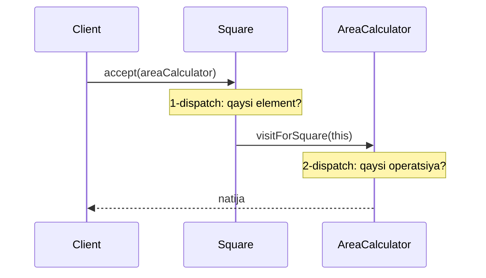
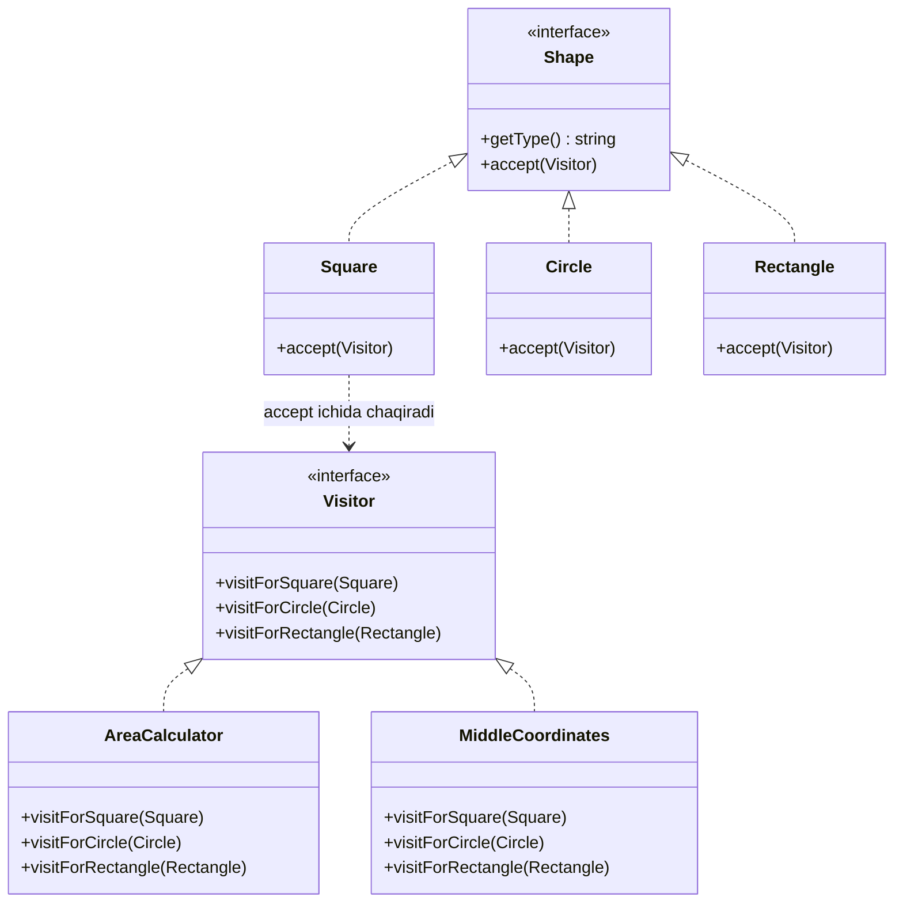

# Visitor Pattern

> Boshqa nomi: **Посетитель**, **Tashrif buyuruvchi**

**Visitor** — behavioral (xulq-atvoriy) pattern. U obyektlar ustida **yangi operatsiyalar** yaratish imkonini beradi — obyektlarning **class'larini o'zgartirmasdan**. Yangi xatti-harakat class ichiga emas, alohida **visitor** class'ga joylashtiriladi.

---

## STEP 1 — Umumiy tushuncha

### Muammo nima edi?

Katta geografik graf bilan ishlovchi dastur yozyapsiz. Grafning har bir tuguni (node) — shahar, sanoat obyekti, diqqatga sazovor joy va h.k. Har tugun turi o'z class'i bilan ifodalangan.

Bir kuni vazifa keldi: **grafni XML formatga export qilish** kerak. Birinchi fikr — har node class'iga `exportToXML()` metod qo'shish, keyin graf bo'ylab rekursiv aylanib chiqish. Oddiy va tabiiy tuyuladi.

Lekin **arxitektor rad etdi**:

- Node class'lari **allaqachon stabil**, production'da ishlab turibdi — ichini kovlash **mavjud kodni buzish** xavfini tug'diradi;
- XML export node'larning asosiy mas'uliyatiga (geo-ma'lumot saqlash) **umuman aloqasi yo'q** — bu kod u yerda **begona**;
- Ertaga **boshqa format** (JSON, CSV) so'ralsa, yana **hamma class'larni** ochib o'zgartirishga to'g'ri keladi.

### Pattern ishlatilmasa qanday muammolar bo'ladi?

| Muammo | Oqibat |
|--------|--------|
| Har yangi operatsiya → har element class'iga yangi metod | Stabil class'lar qayta-qayta ochiladi (OCP buziladi) |
| Export/hisobot kabi "begona" kod element ichida | Single Responsibility buziladi |
| Operatsiya bitta class'da emas, hierarchy bo'ylab sochilgan | Bitta amalning mantig'ini bir joydan o'qib bo'lmaydi |
| Client turini `type switch`/`isinstance` bilan aniqlaydi | Yangi tip qo'shilsa hamma switch'lar unutilishi mumkin |

### Yechim nima?

Visitor yangi xatti-harakatni element class'lariga emas, **alohida class'ga (visitor)** joylashtirishni taklif qiladi. Amal bajarilishi kerak bo'lgan obyekt visitor'ga **argument sifatida** beriladi.

Ammo amal har tip uchun har xil-ku? Shuning uchun visitor'da **har element tipiga alohida metod** bo'ladi:

```
class ExportVisitor is
    method doForCity(City c) ...
    method doForIndustry(Industry i) ...
    method doForSightSeeing(SightSeeing s) ...
```

Endi savol: graf bo'ylab aylanayotganda **qaysi metodni chaqirishni** qanday bilamiz? Client'da `if (node is City)...` deb tekshirish — yana o'sha xunuk shartlar. Method overloading ham yordam bermaydi: o'zgaruvchining statik tipi `Node` bo'lsa, til qaysi overload'ni tanlashni bilmaydi.

Visitor buni **double dispatch** hiylasi bilan hal qiladi: tanlovni client emas, **elementning o'zi** qiladi. Elementga bitta kichik `accept` metod qo'shiladi — u visitor'ning **aynan o'z class'iga mos** metodini chaqiradi:

```
// Client
foreach (node in graph)
    node.accept(exportVisitor)

// City class'i
method accept(Visitor v) is
    v.doForCity(this)      // "men City'man" — o'zi to'g'ri metodga yo'naltiradi
```

Ha, element class'larini **bir marta** ozgina o'zgartirishga to'g'ri keldi (`accept` qo'shildi). Lekin evaziga **bundan keyingi barcha** yangi operatsiyalar element'larga tegmasdan, faqat yangi visitor class yozish bilan qo'shiladi.



### Hayotiy analogiya

**Sug'urta agenti** uylarni aylanib, har bino turiga mos xizmat taklif qiladi:

- turar-joy binosi → **tibbiy sug'urta**;
- bank → **o'g'irlikdan sug'urta**;
- zavod → **yong'in va suv toshqinidan sug'urta**.

Agent (visitor) binolarni o'zgartirmaydi — har bino tipi uchun **o'zida** alohida "metod" bor.

### Asosiy qoida

> **Yangi operatsiya — element class'ida emas, alohida visitor class'da yashaydi. Element `accept(visitor)` orqali o'zini visitor'ning o'z tipiga mos metodiga topshiradi — bu double dispatch.**

### Struktura



- **Visitor** (interface) — har concrete element tipiga bitta "visit" metod;
- **Concrete Visitor** — **bitta operatsiyaning** barcha element tiplari uchun versiyalari (masalan `AreaCalculator` — yuza hisoblash);
- **Element** (interface) — `accept(visitor)` metodini e'lon qiladi;
- **Concrete Element** — `accept` ichida visitor'ning **o'z tipiga mos** metodini chaqiradi;
- **Client** — odatda collection yoki murakkab struktura (masalan Composite daraxti) bo'ylab aylanib, har elementga `accept(visitor)` deydi; concrete class'larni bilishi shart emas.

---

## STEP 2 — Python misoli

### ❌ Yomon misol (pattern'siz)

Har yangi operatsiya `isinstance` zanjiriga aylanadi va u har operatsiyada takrorlanadi:

```python
class ConcreteComponentA:
    def exclusive_method_of_concrete_component_a(self) -> str:
        return "A"

class ConcreteComponentB:
    def special_method_of_concrete_component_b(self) -> str:
        return "B"

# 1-operatsiya: type tekshiruv zanjiri
def operation_1(components):
    for c in components:
        if isinstance(c, ConcreteComponentA):
            print(f"{c.exclusive_method_of_concrete_component_a()} + Operation1")
        elif isinstance(c, ConcreteComponentB):
            print(f"{c.special_method_of_concrete_component_b()} + Operation1")
        # yangi tip qo'shilsa — bu yerga yana elif ...

# 2-operatsiya: XUDDI SHU zanjir yana takrorlanadi!
def operation_2(components):
    for c in components:
        if isinstance(c, ConcreteComponentA):
            print(f"{c.exclusive_method_of_concrete_component_a()} + Operation2")
        elif isinstance(c, ConcreteComponentB):
            print(f"{c.special_method_of_concrete_component_b()} + Operation2")
```

**Muammolar:**

- `isinstance` zanjiri **har operatsiyada** ko'chirib yoziladi;
- Yangi component tipi qo'shilsa **hamma** operatsiyalarni topib, `elif` qo'shish kerak — birontasini unutsangiz, u tip **jimgina o'tkazib yuboriladi**;
- Operatsiyalar component'larning **concrete** class'lariga qattiq bog'langan.

### ✅ Visitor bilan

Kod: `t/Python/src/Visitor/Conceptual/main.py`

```python
from __future__ import annotations
from abc import ABC, abstractmethod
from typing import List


class Component(ABC):
    """
    Component interface'i accept metodini e'lon qiladi — u argument
    sifatida visitor interface'ini implementatsiya qilgan istalgan
    obyektni qabul qila oladi.
    """

    @abstractmethod
    def accept(self, visitor: Visitor) -> None:
        pass


class ConcreteComponentA(Component):
    """
    Har Concrete Component accept'ni shunday yozishi kerakki, u
    visitor'ning aynan shu component class'iga mos metodini chaqirsin.
    """

    def accept(self, visitor: Visitor) -> None:
        # E'tibor bering: visit_concrete_component_a chaqirilyapti —
        # joriy class nomiga mos. Shu orqali visitor qaysi component
        # bilan ishlayotganini biladi (double dispatch).
        visitor.visit_concrete_component_a(self)

    def exclusive_method_of_concrete_component_a(self) -> str:
        # Concrete Component'larda bazaviy interface'da e'lon
        # qilinmagan maxsus metodlar bo'lishi mumkin. Visitor ularni
        # bemalol ishlata oladi — chunki u concrete class'ni biladi.
        return "A"


class ConcreteComponentB(Component):
    """
    Xuddi shu narsa: visit_concrete_component_b => ConcreteComponentB
    """

    def accept(self, visitor: Visitor):
        visitor.visit_concrete_component_b(self)

    def special_method_of_concrete_component_b(self) -> str:
        return "B"


class Visitor(ABC):
    """
    Visitor interface'i har component class'iga mos "visit" metodlar
    to'plamini e'lon qiladi. Metod signature'si visitor'ga qaysi
    concrete component bilan ishlayotganini aniqlash imkonini beradi.
    """

    @abstractmethod
    def visit_concrete_component_a(self, element: ConcreteComponentA) -> None:
        pass

    @abstractmethod
    def visit_concrete_component_b(self, element: ConcreteComponentB) -> None:
        pass


# Concrete Visitor'lar bitta algoritmning barcha concrete component
# class'lari bilan ishlay oladigan versiyalarini implementatsiya qiladi.
#
# Visitor'dan eng katta foyda — uni Composite daraxti kabi MURAKKAB
# obyekt strukturasi bilan ishlatganda. Bunda visitor metodlari turli
# obyektlar ustida bajarilar ekan, algoritmning oraliq holatini
# visitor'ning o'zida saqlab borish qulay bo'ladi.

class ConcreteVisitor1(Visitor):
    def visit_concrete_component_a(self, element) -> None:
        print(f"{element.exclusive_method_of_concrete_component_a()} + ConcreteVisitor1")

    def visit_concrete_component_b(self, element) -> None:
        print(f"{element.special_method_of_concrete_component_b()} + ConcreteVisitor1")


class ConcreteVisitor2(Visitor):
    def visit_concrete_component_a(self, element) -> None:
        print(f"{element.exclusive_method_of_concrete_component_a()} + ConcreteVisitor2")

    def visit_concrete_component_b(self, element) -> None:
        print(f"{element.special_method_of_concrete_component_b()} + ConcreteVisitor2")


def client_code(components: List[Component], visitor: Visitor) -> None:
    """
    Client kodi visitor operatsiyalarini istalgan elementlar to'plami
    ustida bajara oladi — ularning concrete class'larini aniqlamasdan.
    accept operatsiyasi chaqiruvni visitor'dagi mos metodga yo'naltiradi.
    """
    for component in components:
        component.accept(visitor)


if __name__ == "__main__":
    components = [ConcreteComponentA(), ConcreteComponentB()]

    print("The client code works with all visitors via the base Visitor interface:")
    visitor1 = ConcreteVisitor1()
    client_code(components, visitor1)

    print("It allows the same client code to work with different types of visitors:")
    visitor2 = ConcreteVisitor2()
    client_code(components, visitor2)
```

**Output:**

```
The client code works with all visitors via the base Visitor interface:
A + ConcreteVisitor1
B + ConcreteVisitor1
It allows the same client code to work with different types of visitors:
A + ConcreteVisitor2
B + ConcreteVisitor2
```

**Nima yaxshilandi?**

- `isinstance` zanjiri yo'qoldi — to'g'ri metodga yo'naltirishni **elementning o'zi** qiladi (`accept` ichida);
- Yangi operatsiya = **bitta yangi visitor class** (`ConcreteVisitor3`) — component'larga **tegilmaydi**;
- Yangi component tipi qo'shilsa, `Visitor` interface yangi abstract metod talab qiladi — **compiler/runtime o'zi eslatadi**, unutib bo'lmaydi;
- Client kodi (`client_code`) concrete class'larni umuman bilmaydi — ikkala interface bilan ishlaydi.

---

## STEP 3 — Go misoli

> ⚠️ **Go eslatmasi:** Go'da method overloading yo'q — `visit(Square)`, `visit(Circle)` deb bir nomli metodlar yozib bo'lmaydi. Shuning uchun har tipga **alohida nomli** metod ishlatiladi: `visitForSquare`, `visitForCircle`... Double dispatch g'oyasi esa aynan bir xil ishlaydi.

### ❌ Yomon misol (pattern'siz)

Shakllar ustida har yangi operatsiya — yangi `type switch`, va u har operatsiyada takrorlanadi:

```go
package main

import "fmt"

type Square struct{ side int }
type Circle struct{ radius int }
type Rectangle struct{ l, b int }

// 1-operatsiya: yuza hisoblash — type switch
func calculateArea(shapes []interface{}) {
	for _, shape := range shapes {
		switch shape.(type) {
		case *Square:
			fmt.Println("Calculating area for square")
		case *Circle:
			fmt.Println("Calculating area for circle")
		case *Rectangle:
			fmt.Println("Calculating area for rectangle")
			// yangi shakl qo'shilsa — bu yerga yana case...
		}
	}
}

// 2-operatsiya: o'rta nuqta — XUDDI SHU switch yana!
func calculateMiddleCoordinates(shapes []interface{}) {
	for _, shape := range shapes {
		switch shape.(type) {
		case *Square:
			fmt.Println("Calculating middle point coordinates for square")
		case *Circle:
			fmt.Println("Calculating middle point coordinates for circle")
		case *Rectangle:
			fmt.Println("Calculating middle point coordinates for rectangle")
		}
	}
}
```

**Muammolar:**

- Har operatsiya `type switch`ni **qayta yozadi**;
- Yangi shakl (`Triangle`) qo'shilsa, **hamma** switch'larni topib to'ldirish kerak — `switch`da `default` bo'lmasa, unutilgan tip **jimgina e'tibordan chetda qoladi**;
- Operatsiya qaysi tiplar bilan ishlashini hech qanday interface **kafolatlamaydi**.

### ✅ Visitor bilan

Kod: `t/Go/visitor/`

**visitor.go** — har shakl tipiga alohida metod:

```go
package main

type Visitor interface {
	visitForSquare(*Square)
	visitForCircle(*Circle)
	visitForrectangle(*Rectangle)
}
```

**shape.go** — element interface, `accept` bilan:

```go
package main

type Shape interface {
	getType() string
	accept(Visitor)
}
```

**square.go**, **circle.go**, **rectangle.go** — har element `accept` ichida visitor'ning **o'z tipiga mos** metodini chaqiradi:

```go
package main

type Square struct {
	side int
}

func (s *Square) accept(v Visitor) {
	v.visitForSquare(s) // "men Square'man" — double dispatch
}

func (s *Square) getType() string {
	return "Square"
}
```

```go
package main

type Circle struct {
	radius int
}

func (c *Circle) accept(v Visitor) {
	v.visitForCircle(c)
}

func (c *Circle) getType() string {
	return "Circle"
}
```

```go
package main

type Rectangle struct {
	l int
	b int
}

func (t *Rectangle) accept(v Visitor) {
	v.visitForrectangle(t)
}

func (t *Rectangle) getType() string {
	return "rectangle"
}
```

**areaCalculator.go** — birinchi operatsiya: bitta class'da barcha tiplar uchun yuza hisoblash:

```go
package main

import (
	"fmt"
)

type AreaCalculator struct {
	area int
}

func (a *AreaCalculator) visitForSquare(s *Square) {
	// Kvadrat yuzasini hisoblaymiz,
	// keyin natijani area maydoniga yozamiz.
	fmt.Println("Calculating area for square")
}

func (a *AreaCalculator) visitForCircle(s *Circle) {
	fmt.Println("Calculating area for circle")
}
func (a *AreaCalculator) visitForrectangle(s *Rectangle) {
	fmt.Println("Calculating area for rectangle")
}
```

**middleCoordinates.go** — **ikkinchi operatsiya**: shakl class'lariga **tegmasdan** qo'shildi!

```go
package main

import "fmt"

type MiddleCoordinates struct {
	x int
	y int
}

func (a *MiddleCoordinates) visitForSquare(s *Square) {
	// Kvadratning o'rta nuqtasini hisoblaymiz,
	// keyin natijani x va y maydonlariga yozamiz.
	fmt.Println("Calculating middle point coordinates for square")
}

func (a *MiddleCoordinates) visitForCircle(c *Circle) {
	fmt.Println("Calculating middle point coordinates for circle")
}
func (a *MiddleCoordinates) visitForrectangle(t *Rectangle) {
	fmt.Println("Calculating middle point coordinates for rectangle")
}
```

**main.go** — client bitta `accept` bilan istalgan visitor'ni ishlatadi:

```go
package main

import "fmt"

func main() {
	square := &Square{side: 2}
	circle := &Circle{radius: 3}
	rectangle := &Rectangle{l: 2, b: 3}

	areaCalculator := &AreaCalculator{}

	square.accept(areaCalculator)
	circle.accept(areaCalculator)
	rectangle.accept(areaCalculator)

	fmt.Println()
	middleCoordinates := &MiddleCoordinates{}
	square.accept(middleCoordinates)
	circle.accept(middleCoordinates)
	rectangle.accept(middleCoordinates)
}
```

**Output:**

```
Calculating area for square
Calculating area for circle
Calculating area for rectangle

Calculating middle point coordinates for square
Calculating middle point coordinates for circle
Calculating middle point coordinates for rectangle
```

**Nima yaxshilandi?**

- `MiddleCoordinates` (yangi operatsiya) `Square/Circle/Rectangle`ga **bir qator ham qo'shmasdan** kiritildi — faqat yangi visitor fayli;
- `type switch` yo'q: to'g'ri metodni **element o'zi** tanlaydi (`accept`);
- `Visitor` interface **kompilyatsiya darajasida kafolat** beradi: yangi visitor yozsangiz, uchala metodni ham yozishga **majbursiz** — birontasini unutib bo'lmaydi;
- Bitta operatsiyaning butun mantig'i (barcha shakllar uchun) **bitta faylda** turibdi;
- Visitor **holat yig'ib borishi** mumkin (`area`, `x`, `y` maydonlari) — struktura bo'ylab yurishda oraliq natijalarni saqlash uchun.

---

## Qachon ishlatish kerak?

1. **Murakkab struktura (masalan, Composite daraxti) barcha elementlari ustida operatsiya** bajarish kerak bo'lsa — Visitor har element class'iga mos metodlari orqali turli tipdagi obyektlar ustida ham bitta amalni bajara oladi.
2. **Asosiy class'larni "begona" operatsiyalar bilan ifloslamaslik** uchun — yordamchi/qo'shimcha amallar (export, hisobot, statistika) visitor'larga chiqariladi, element class'lari o'z asosiy ishiga fokuslanadi.
3. **Yangi xatti-harakat faqat ba'zi class'lar uchun ma'noli** bo'lsa — hamma class'ga metod tiqishning hojati yo'q: visitor'da faqat kerakli tiplar uchun ish qilinadi, qolganlariga bo'sh metod yoziladi.

---

## Implementatsiya qadamlari

1. **Visitor interface** yarating: strukturadagi **har concrete element class'iga bittadan** visit metod (`visitForSquare`, `visitForCircle`...).
2. **Element interface'iga** abstract `accept(Visitor)` metod qo'shing (hierarchy mavjud bo'lsa — bazaviy class'ga).
3. Har concrete element'da `accept`ni implementatsiya qiling: chaqiruvni visitor'ning **o'z class'iga mos** metodiga yo'naltirsin.
4. Element'lar visitor'lar bilan **faqat interface orqali** ishlasin; visitor'lar esa element'larning **concrete** class'larini biladi (visit metodlar parametr tiplarida ko'rinadi).
5. **Har yangi operatsiya** uchun yangi concrete visitor yozing. Agar visitor elementning **private maydonlariga** kirishi kerak bo'lsa: yo maydonlarni ochishga (encapsulation zaiflashadi), yo visitor'ni element class'i ichiga joylashtirishga to'g'ri keladi (nested class'larni qo'llovchi tillarda; Go'da odatda getter'lar yoki bir package ichida joylash ishlatiladi).
6. **Client** struktura bo'ylab aylanib, har elementda `accept(visitor)` chaqiradi.

---

## Afzalliklar va kamchiliklar

| ✅ Afzalliklar | ❌ Kamchiliklar |
|---------------|----------------|
| Murakkab struktura ustida **yangi operatsiya qo'shish oson** — element class'lariga tegilmaydi | Element **hierarchy'si tez-tez o'zgarsa** o'zini oqlamaydi: har yangi element tipi → **hamma** visitor'larga yangi metod |
| Bir turdagi (related) operatsiyalar **bitta class'da** jamlanadi | Elementlarning **private detallariga** kirish muammosi — encapsulation buzilishi mumkin |
| Struktura bo'ylab yurishda visitor **oraliq holat yig'ib** boradi (akkumulyator) | Qo'shimcha abstraksiya qatlami — oddiy holatlarda ortiqcha murakkablik |

---

## Boshqa patternlar bilan aloqasi

- **Command** — Visitor'ni **kuchaytirilgan Command** deb qarash mumkin: Command bitta receiver bilan bog'lansa, Visitor **turli class'dagi ko'plab obyektlar** ustida amal bajara oladi.
- **Composite** — Visitor'ning klassik juftligi: operatsiyani **butun Composite daraxti** bo'ylab bajarish uchun ishlatiladi.
- **Iterator** — birga ishlaydi: **Iterator aylanadi, Visitor amal bajaradi** — murakkab strukturani kezib, har elementiga (tipi har xil bo'lsa ham) operatsiya qo'llash.

---

## Go'da real-world misollar

Go standart library'sining o'zida Visitor bor — **`go/ast`** package (Go kodini parse qilib daraxt ko'rinishida beradi):

```go
// go/ast package'idan:
type Visitor interface {
	Visit(node Node) (w Visitor)
}

func Walk(v Visitor, node Node)
```

`ast.Walk` sintaksis daraxtini kezadi va har tugun uchun visitor'ning `Visit` metodini chaqiradi — linter'lar, kod generatorlar, `gofmt` kabi asboblar shu mexanizm ustida qurilgan. Soddalashtirilgan varianti — `ast.Inspect(node, func(n ast.Node) bool)`: visitor o'rniga funksiya beriladi.

E'tibor bering: `go/ast` klassik double dispatch o'rniga **bitta `Visit(Node)` metod + ichkarida type switch** ishlatadi — Go'da overloading yo'qligi sababli har tipga alohida metod yozish o'rniga shu pragmatik yo'l tanlangan. Bizning `t/Go/visitor` misolimiz esa klassik variantni (har tipga `visitFor...` metod) ko'rsatadi — bunda compiler hech bir tip unutilmasligini kafolatlaydi.

---

## Xulosa

### Eslab qol

- Visitor = **yangi operatsiya element class'ida emas, alohida visitor class'da**; elementga faqat bir marta `accept` qo'shiladi.
- Yuragi — **double dispatch**: `element.accept(visitor)` → `visitor.visitForElement(element)` — to'g'ri metodni **element o'zi** tanlaydi, `type switch` kerak emas.
- Qulay holat: **operatsiyalar tez-tez qo'shiladi, element tiplari esa stabil**. Teskarisi bo'lsa (tiplar tez o'zgarsa) — Visitor qimmat tushadi.
- Go'da overloading yo'q — har tipga **alohida nomli** metod: `visitForSquare`, `visitForCircle`...
- Visitor **holat yig'a oladi** — struktura bo'ylab yurib akkumulyator kabi ishlaydi.

### Amaliyot

1. `t/Go/visitor`ga uchinchi visitor — `PerimeterCalculator` qo'shing. `Square/Circle/Rectangle` fayllariga tegmadingizmi? Bu Visitor'ning asosiy va'dasi.
2. Endi teskarisini sinang: yangi shakl `Triangle` qo'shing — nechta fayl o'zgardi? (`Visitor` interface + ikkala visitor + yangi fayl). Bu pattern'ning asosiy kamchiligi.
3. Python misolida `ConcreteVisitor3` yozing — client kodi o'zgarmasligiga e'tibor bering.
4. `ast.Inspect` bilan kichik dastur yozing: biror `.go` fayldagi barcha funksiya nomlarini chiqarsin.

---

## Keyingi qadam

**Behavioral patternlar tugadi!** 🎉 Bu bilan 22 ta klassik GoF pattern'ning barchasi yopildi: 5 Creational + 7 Structural + 10 Behavioral.

- Takrorlash uchun: [0. README.md](0.%20README.md)
- Davomi: [x. Concurrency Patterns](../x.%20Concurrency%20Patterns/) — Go'ga xos concurrency pattern'lar
- Va: [Stability patterns](../Stability%20patterns%28%29/) — production'da barqarorlik pattern'lari
