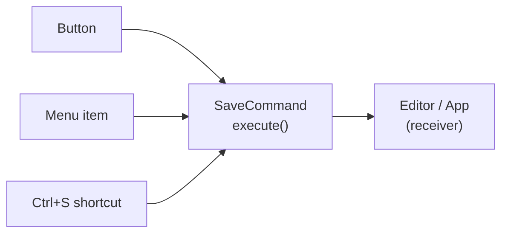
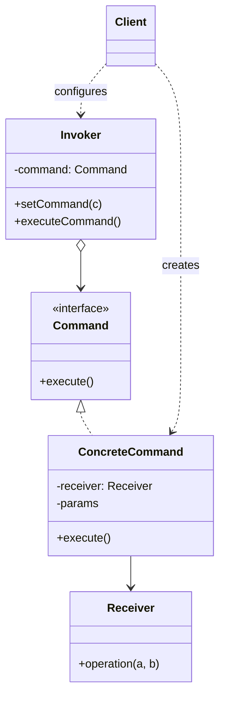

# Command Pattern

> Boshqa nomlari: **Action**, **Transaction**, **Команда**

**Command** — behavioral (xulq-atvoriy) pattern. U **so'rovlarni obyektlarga aylantiradi** — natijada ularni metod argumenti sifatida uzatish, navbatga qo'yish, loglash va **undo** (bekor qilish) qilish mumkin bo'ladi.

---

## STEP 1 — Umumiy tushuncha

### Muammo nima edi?

Matn muharriri ustida ishlayapsiz. Chiroyli `Button` class'ini yozdingiz va uni hamma joyda — asboblar panelida ham, dialoglarda ham ishlatmoqchisiz.

Tugmalar ko'rinishidan bir xil, lekin **har xil ish** qiladi. Ularning click-handler kodini qayerga yozamiz? Eng sodda yechim: har bir tugma uchun subclass ochib, action metodini override qilish. Lekin tez orada bu yaramasligi ayon bo'ldi:

- subclass'lar **juda ko'payib** ketdi;
- UI kodi tez-tez o'zgaruvchi **biznes-logika class'lariga bog'lanib** qoldi;
- eng alamlisi: "saqlash" kabi amallar **bir nechta joydan** chaqiriladi — panel tugmasi, kontekst menyusi, `Ctrl+S`. Endi saqlash kodini uch class'ga **nusxalash** kerak!

### Pattern ishlatilmasa qanday muammolar bo'ladi?

| Muammo | Oqibat |
|--------|--------|
| Har amal uchun UI subclass | Class portlashi |
| UI biznes-logikani to'g'ridan-to'g'ri chaqiradi | Qattiq bog'liqlik, logika o'zgarsa UI sinadi |
| Bitta amal bir nechta joydan chaqiriladi | Kod dublikatlari |
| Amal — shunchaki metod chaqiruvi | Undo, navbat, log, kechiktirilgan bajarish — imkonsiz |

### Yechim nima?

Yaxshi dasturlar **qatlamlarga** bo'linadi: UI qatlami chiroyli rasm chizadi, muhim ish kerak bo'lsa biznes-logika qatlamidan "iltimos qiladi". Odatda bu to'g'ridan-to'g'ri metod chaqiruvi bilan bo'ladi.

Command pattern'i bunday chaqiruvlarni to'g'ridan-to'g'ri yubormaslikni taklif qiladi: har bir o'ziga xos chaqiruvni **yagona bajarish metodli alohida class**ga o'rang — bu obyektlar **command** deyiladi.

- UI obyektiga command bog'lanadi: UI faqat command'ning metodini chaqiradi, "kimga va qanday so'rov yuborish"ni **command o'zi biladi**.
- Barcha command'lar **bitta interface**da (odatda parametrsiz yagona `execute` metodi) — shunda yuboruvchi konkret command class'lariga bog'lanmaydi va command'larni **almashtirib**, xatti-harakatni o'zgartirish mumkin.
- Qabul qiluvchi metodining **parametrlari command maydonlarida** oldindan saqlanadi (command'ni immutable qilib, hammasini constructor orqali berish mumkin) — yuboruvchi ma'lumot yig'ish tashvishidan qutuladi, hatto **qabul qiluvchi kimligini ham bilmaydi**.

Matn muharririda endi tugma subclass'lari kerak emas: bitta `Button` class'ida command saqlaydigan maydon yetadi. Panel tugmasi, kontekst menyu bandi va `Ctrl+S` — uchalasi **bitta** `SaveCommand` obyektiga bog'lanadi. Command'lar UI va biznes-logika orasidagi moslashuvchan qatlamga aylanadi.



### Hayotiy analogiya

Restoranda ofitsiant buyurtmangizni **blokknotga** yozib, oshxonaga eltib devorga iladi. Oshpaz varaqni o'qib, taomni tayyorlaydi. Siz — **yuboruvchi**, buyurtma varag'i — **command**, oshpaz — **qabul qiluvchi**. Siz oshpaz bilan to'g'ridan-to'g'ri gaplashmaysiz; oshpaz ham buyurtmani kim berganini bilmaydi — hamma kerakli ma'lumot varaqda.

### Asosiy qoida

> **Amalni obyekt qil: "nima qilish + kim uchun + qanday parametrlar bilan" — hammasi bitta command ichida. Yuboruvchi faqat `execute()`ni biladi.**

### Struktura



1. **Invoker (yuboruvchi)** — command obyektiga havola saqlaydi va amal kerak bo'lganda unga murojaat qiladi. Faqat umumiy interface orqali ishlaydi, konkret command'ni bilmaydi — tayyor command'ni client'dan oladi.
2. **Command** — umumiy interface, odatda yagona `execute` metodi.
3. **Concrete Command'lar** — turli so'rovlarni amalga oshiradi: odatda ishni o'zi qilmay, **receiver'ga uzatadi**. Receiver metodi parametrlari command maydonlarida saqlanadi (ko'pincha constructor orqali berilib, immutable qilinadi).
4. **Receiver (qabul qiluvchi)** — biznes-logika; deyarli istalgan obyekt shu rolda bo'la oladi. Ba'zan soddalik uchun receiver kodini command ichiga "singdirib" yuborish ham mumkin.
5. **Client** konkret command'larni yaratadi (receiver'lar va parametrlarni berib), so'ng yuboruvchilarni command'lar bilan bog'laydi. Initsializatsiya tartibi: receiver'lar → command'lar (receiver bilan) → yuboruvchilar (command bilan).

---

## STEP 2 — Python misoli

### ❌ Yomon misol (pattern'siz)

```python
class Receiver:
    def do_something(self, a): ...
    def do_something_else(self, b): ...


class Invoker:
    def __init__(self, receiver: Receiver):
        # ❌ Yuboruvchi qabul qiluvchiga QATTIQ bog'landi
        self._receiver = receiver

    def do_something_important(self):
        print("Invoker: boshlayapman...")
        # ❌ Chaqiruv + parametrlar shu yerga "qotirilgan":
        self._receiver.do_something("Send email")
        self._receiver.do_something_else("Save report")
        # Boshqa amal kerak bo'lsa — Invoker KODINI o'zgartiramiz.
        # Amalni navbatga qo'yish, loglash, undo — iloji yo'q.
```

### ✅ Command bilan

`t/Python/src/Command/Conceptual` misoli (izohlar o'zbekchada):

```python
from __future__ import annotations
from abc import ABC, abstractmethod


class Command(ABC):
    """Command interface'i — bajarish metodini e'lon qiladi."""

    @abstractmethod
    def execute(self) -> None:
        pass


class SimpleCommand(Command):
    """Ba'zi command'lar oddiy ishni O'ZI bajara oladi."""

    def __init__(self, payload: str) -> None:
        self._payload = payload

    def execute(self) -> None:
        print(f"SimpleCommand: See, I can do simple things like printing"
              f"({self._payload})")


class ComplexCommand(Command):
    """
    Murakkabroq ishlarni esa command "receiver" deb ataluvchi
    boshqa obyektlarga delegatsiya qiladi.
    """

    def __init__(self, receiver: Receiver, a: str, b: str) -> None:
        # Murakkab command'lar bir/bir nechta receiver'ni va kontekst
        # ma'lumotlarini constructor orqali qabul qiladi.
        self._receiver = receiver
        self._a = a
        self._b = b

    def execute(self) -> None:
        # Command receiver'ning istalgan metodlariga ish uzata oladi.
        print("ComplexCommand: Complex stuff should be done by a receiver object", end="")
        self._receiver.do_something(self._a)
        self._receiver.do_something_else(self._b)


class Receiver:
    """
    Receiver — muhim biznes-logika. Aslida ISTALGAN class
    receiver bo'la oladi.
    """

    def do_something(self, a: str) -> None:
        print(f"\nReceiver: Working on ({a}.)", end="")

    def do_something_else(self, b: str) -> None:
        print(f"\nReceiver: Also working on ({b}.)", end="")


class Invoker:
    """
    Invoker (yuboruvchi) bir yoki bir nechta command bilan bog'lanadi
    va so'rovni command'ga yuboradi.
    """

    _on_start = None
    _on_finish = None

    def set_on_start(self, command: Command):
        self._on_start = command

    def set_on_finish(self, command: Command):
        self._on_finish = command

    def do_something_important(self) -> None:
        # Invoker konkret command/receiver class'lariga BOG'LIQ EMAS.
        # So'rov receiver'ga bilvosita — command orqali boradi.
        print("Invoker: Does anybody want something done before I begin?")
        if isinstance(self._on_start, Command):
            self._on_start.execute()

        print("Invoker: ...doing something really important...")

        print("Invoker: Does anybody want something done after I finish?")
        if isinstance(self._on_finish, Command):
            self._on_finish.execute()


if __name__ == "__main__":
    # Client yuboruvchini ISTALGAN command bilan sozlay oladi.
    invoker = Invoker()
    invoker.set_on_start(SimpleCommand("Say Hi!"))
    receiver = Receiver()
    invoker.set_on_finish(ComplexCommand(
        receiver, "Send email", "Save report"))

    invoker.do_something_important()
```

**Output:**

```
Invoker: Does anybody want something done before I begin?
SimpleCommand: See, I can do simple things like printing (Say Hi!)
Invoker: ...doing something really important...
Invoker: Does anybody want something done after I finish?
ComplexCommand: Complex stuff should be done by a receiver object
Receiver: Working on (Send email.)
Receiver: Also working on (Save report.)
```

**Nima yaxshilandi?** `Invoker` endi **hech qanday konkret amalga bog'lanmagan** — unga istalgan command'ni berish mumkin; parametrlar command ichida saqlanadi; amallar obyekt bo'lgani uchun ularni saqlash/uzatish mumkin.

---

## STEP 3 — Go misoli

### ❌ Yomon misol (pattern'siz)

```go
package main

// ❌ Tugma TV'ga to'g'ridan-to'g'ri bog'langan
type Button struct {
	tv *Tv // faqat TV bilan ishlaydi!
}

func (b *Button) press() {
	b.tv.on() // amal ham qotirilgan: faqat yoqadi
}

// Endi "o'chirish" tugmasi kerakmi? Yangi ButtonOff class.
// Radio boshqarish kerakmi? ButtonRadioOn, ButtonRadioOff...
// Har (qurilma × amal) kombinatsiyasi uchun yangi tugma class'i!
```

### ✅ Command bilan

`t/Go/command` misoli — pult tugmasi TV'ni command orqali boshqaradi (izohlar o'zbekchada):

```go
// command.go — Command interface
package main

type Command interface {
	execute()
}
```

```go
// button.go — Invoker: qaysi command ekanini BILMAYDI
package main

type Button struct {
	command Command
}

func (b *Button) press() {
	b.command.execute()
}
```

```go
// device.go — Receiver interface: biznes-logika
package main

type Device interface {
	on()
	off()
}
```

```go
// onCommand.go — Concrete Command 1: ishni receiver'ga uzatadi
package main

type OnCommand struct {
	device Device
}

func (c *OnCommand) execute() {
	c.device.on()
}
```

```go
// offCommand.go — Concrete Command 2
package main

type OffCommand struct {
	device Device
}

func (c *OffCommand) execute() {
	c.device.off()
}
```

```go
// tv.go — Concrete Receiver
package main

import "fmt"

type Tv struct {
	isRunning bool
}

func (t *Tv) on() {
	t.isRunning = true
	fmt.Println("Turning tv on")
}

func (t *Tv) off() {
	t.isRunning = false
	fmt.Println("Turning tv off")
}
```

```go
// main.go — Client: receiver → command → invoker tartibida bog'laydi
package main

func main() {
	tv := &Tv{}

	onCommand := &OnCommand{
		device: tv,
	}

	offCommand := &OffCommand{
		device: tv,
	}

	onButton := &Button{
		command: onCommand,
	}
	onButton.press()

	offButton := &Button{
		command: offCommand,
	}
	offButton.press()
}
```

**Output:**

```
Turning tv on
Turning tv off
```

**Nima yaxshilandi?**
- `Button` universal: unga istalgan command beriladi — Radio uchun ham **o'sha** Button ishlaydi;
- amal (`OnCommand`) qurilmadan (`Tv`) ajratilgan: yangi qurilma = faqat yangi receiver;
- xuddi shu command'ni tugma ham, taymer ham, HTTP handler ham chaqira oladi.

---

## Qachon ishlatish kerak?

**1. Obyektlarni bajariladigan amal bilan parametrlashtirmoqchi bo'lsangiz.**

Command amalni obyektga aylantiradi — obyektni esa uzatish, saqlash, almashtirish mumkin. Masalan, menyu library'sini yozayotgan bo'lsangiz, foydalanuvchilar menyu class'laringizni o'zgartirmasdan, menyu bandlarini o'z command'lari bilan sozlaydi.

**2. Amallarni navbatga qo'yish, jadval bo'yicha yoki masofadan bajarish kerak bo'lsa.**

Command'ni **serialize** qilib (string'ga aylantirib) faylga/DB'ga saqlash, keyin qaytarib obyekt qilib bajarish mumkin. Xuddi shunday tarmoq orqali yuborish, loglash, uzoq serverda bajarish ham mumkin.

**3. Undo (bekor qilish) kerak bo'lsa.**

Undo uchun asosiy narsa — **amallar tarixi**: bajarilgan command'lar stack'i. Har command bajarilishidan oldin obyekt holatining nusxasini saqlaydi; undo'da tarixdan oxirgi command olinib, saqlangan holat tiklanadi. Nuanslari: private holatni saqlashda **Memento** yordam beradi; holat nusxalari ko'p xotira yesa, muqobil — command'ning **teskari amalini** bajarish (bu esa har doim ham oson emas).

---

## Implementatsiya qadamlari

1. Yagona bajarish metodli **command interface** yarating.
2. Birma-bir **konkret command'lar** yozing: har birida receiver obyekt(lar)iga havola maydoni + receiver metodlariga kerakli parametr maydonlari bo'lsin — barchasi constructor orqali to'ldirilsin; `execute` receiver metodlarini chaqirsin.
3. **Yuboruvchi** class'larga command saqlaydigan maydon qo'shing — ular tayyor command'ni tashqaridan (constructor/setter orqali) oladi.
4. Yuboruvchilar amalni to'g'ridan-to'g'ri emas, **command'ga delegatsiya** qilib bajarsin.
5. Initsializatsiya tartibi: avval **receiver'lar** → keyin ularga bog'langan **command'lar** → keyin ularga bog'langan **yuboruvchilar**.

---

## Afzalliklar va kamchiliklar

| ✅ Afzalliklar | ❌ Kamchiliklar |
|---------------|----------------|
| Amalni chaqiruvchi va bajaruvchi class'lar orasidagi to'g'ridan-to'g'ri bog'liqlikni olib tashlaydi (Single Responsibility) | Ko'plab qo'shimcha class'lar hisobiga kod murakkablashadi |
| Oddiy undo/redo implementatsiyasi | |
| Amallarni kechiktirib bajarish (queue, jadval) | |
| Oddiy command'lardan murakkablarini (macro) yig'ish | |
| Open/Closed: yangi command mavjud kodga tegmaydi | |

---

## Boshqa patternlar bilan aloqasi

- **CoR, Command, Mediator, Observer** — yuboruvchi-qabul qiluvchi aloqasining to'rt usuli (Command: bilvosita bir tomonlama aloqa).
- CoR handler'lari Command sifatida yozilishi mumkin; yoki so'rovning o'zi Command bo'lib zanjir bo'ylab yuboriladi.
- **Command + Memento** = undo: command amalni bajaradi, memento amaldan oldingi holatni saqlaydi.
- **Command va Strategy** o'xshash, lekin: Command **har xil, bir-biriga aloqasiz amallarni** obyektga aylantiradi (log, tarix, uzatish uchun); Strategy esa **bitta amalning har xil usullarini** tavsiflab, kontekstda almashtiradi.
- Command'ni tarixga qo'yishdan oldin nusxalash kerak bo'lsa — **Prototype**.
- **Visitor** — bir nechta turdagi receiver bilan birdan ishlay oladigan "kuchaytirilgan Command".

---

## Go'da real-world misollar

### Undo/Redo bilan matn muharriri

```go
type Command interface {
    Execute() error
    Undo() error
}

type InsertCommand struct {
    editor *TextEditor
    pos    int
    text   string
}

func (c *InsertCommand) Execute() error {
    c.editor.Insert(c.pos, c.text)
    return nil
}

func (c *InsertCommand) Undo() error {
    c.editor.Delete(c.pos, len(c.text)) // teskari amal
    return nil
}

// Invoker: tarix stack'i
type CommandHistory struct {
    history []Command
    future  []Command // redo uchun
}

func (h *CommandHistory) Execute(cmd Command) error {
    if err := cmd.Execute(); err != nil {
        return err
    }
    h.history = append(h.history, cmd)
    h.future = nil // yangi amal redo'ni tozalaydi
    return nil
}

func (h *CommandHistory) Undo() error {
    if len(h.history) == 0 {
        return nil
    }
    idx := len(h.history) - 1
    cmd := h.history[idx]
    h.history = h.history[:idx]
    h.future = append(h.future, cmd)
    return cmd.Undo()
}
```

### Transaction ichida command'lar (rollback bilan)

```go
type DBCommand interface {
    Execute(tx *sql.Tx) error
    Rollback(tx *sql.Tx) error
}

func ExecuteInTransaction(db *sql.DB, commands []DBCommand) error {
    tx, err := db.Begin()
    if err != nil {
        return err
    }

    executed := make([]DBCommand, 0)
    for _, cmd := range commands {
        if err := cmd.Execute(tx); err != nil {
            // Bajarilganlarni teskari tartibda qaytarish
            for i := len(executed) - 1; i >= 0; i-- {
                executed[i].Rollback(tx)
            }
            tx.Rollback()
            return err
        }
        executed = append(executed, cmd)
    }

    return tx.Commit()
}
```

Boshqa tanish misollar: task queue'lar (amal serialize qilinib worker'da bajariladi), job scheduler'lar, Kafka'ga yoziladigan event-command'lar.

---

## Xulosa

### Eslab qol

- Command = **amal + receiver + parametrlar = bitta obyekt**; yuboruvchi faqat `execute()`ni biladi.
- Uch tomonlama ajratish: **Invoker** (qachon) / **Command** (nima) / **Receiver** (qanday).
- Amal obyekt bo'lgach: **navbat, log, jadval, tarmoq, undo/redo** — hammasi ochiladi.
- Undo ikki usulda: **holat nusxasi** (Memento bilan; xotira yeydi) yoki **teskari amal** (har doim ham yozib bo'lmaydi).
- Initsializatsiya tartibi muhim: receiver → command → invoker.

### Amaliyot

1. `t/Go/command`'ga `Radio` receiver'ini qo'shing — `Button` va command class'lari o'zgardimi?
2. `OnCommand`/`OffCommand`'ga `undo()` metodini qo'shib, `CommandHistory` bilan sinang.
3. Python misolida `MacroCommand` yozing — u command'lar ro'yxatini olib, `execute()`da hammasini ketma-ket bajarsin.
4. O'z loyihangizda "amalni keyinroq bajarish" kerak bo'lgan joyni toping va uni command + queue bilan qayta loyihalang.

---

## Keyingi qadam

→ [3. Iterator.md](3.%20Iterator.md)
