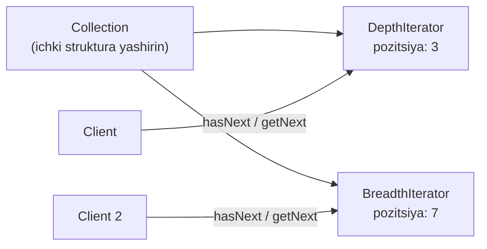
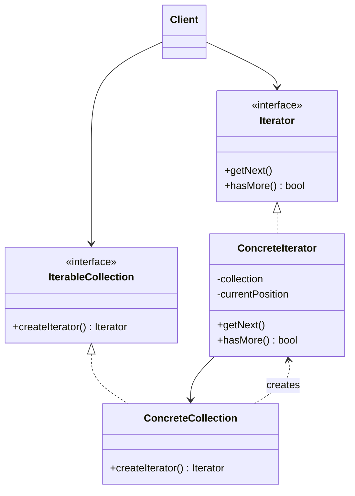

# Iterator Pattern

> Boshqa nomi: **Итератор**

**Iterator** — behavioral (xulq-atvoriy) pattern. U tarkibli obyektlarning elementlarini **ichki tuzilishini ochmasdan, ketma-ket aylanib chiqish** imkonini beradi.

---

## STEP 1 — Umumiy tushuncha

### Muammo nima edi?

Collection — dasturlashdagi eng keng tarqalgan ma'lumot strukturasi: qandaydir mezon bo'yicha bitta joyga yig'ilgan obyektlar to'plami. Ko'pchiligi oddiy ro'yxatga o'xshaydi, lekin daraxt, graf va boshqa murakkab strukturalar asosidagi "ekzotik" collection'lar ham bor.

Collection qanday tuzilgan bo'lmasin, foydalanuvchi uning elementlarini **ketma-ket aylanib chiqa olishi** kerak. Lekin murakkab strukturada qanday yurish kerak? Bugun daraxtni **chuqurlikka** (depth-first) aylanish yetarli, ertaga **kenglikka** (breadth-first) kerak bo'ladi, keyingi hafta — **tasodifiy tartibda**...

Aylanish algoritmlarini collection'ning o'ziga qo'shaversangiz, uning **asosiy vazifasi** — ma'lumotni samarali saqlash — xiralashib boradi. Ba'zi algoritmlar esa umuman bitta ilovaga "moslashtirilgan" bo'lib, umumiy collection class'ida g'alati ko'rinadi.

### Pattern ishlatilmasa qanday muammolar bo'ladi?

| Muammo | Oqibat |
|--------|--------|
| Aylanish kodi collection ichida | Collection class'i shishadi, vazifasi aralashadi |
| Client collection'ning ichki tuzilishiga kirib aylanadi | Ichki struktura ochilib qoladi, unga bog'lanish paydo bo'ladi |
| Har yangi aylanish usuli | Collection kodini o'zgartirish |
| Bir vaqtda ikki joydan aylanish | Pozitsiya bitta bo'lsa — to'qnashuv |

### Yechim nima?

G'oya: **aylanish xatti-harakatini collection'dan alohida class'ga** — iterator'ga chiqarish.

Iterator obyekti aylanish jarayonini o'zi kuzatadi: joriy pozitsiya, nechta element qolgani. Shu tufayli **bir collection'ni bir vaqtda bir nechta iterator** mustaqil aylanishi mumkin — collection buni bilmaydi ham. Yangi aylanish usuli kerakmi? Collection kodiga tegmasdan yangi iterator class'i yozasiz.

Barcha iterator'lar **umumiy interface**'da bo'lsa, client kod istalgan collection va istalgan aylanish usuli bilan bir xilda ishlaydi.



### Hayotiy analogiya

Rimga bordingiz va diqqatga sazovor joylarni ko'rmoqchisiz. **O'zingiz** tor ko'chalarda adashib yurishingiz mumkin — arzon, lekin samarasiz. Telefondagi **virtual gid** qiziqtirgan nuqtalarni filtrlab beradi. **Mahalliy gid** esa qimmat, lekin shaharni besh qo'lday biladi. Rim — collection; miyangiz, navigator yoki gid — bitta collection ustidagi **har xil iterator'lar**. Client sifatida vazifa va byudjetga qarab iterator tanlaysiz.

### Asosiy qoida

> **Aylanish logikasi va joriy pozitsiya — collection'da emas, alohida iterator obyektida yashasin. Client faqat `hasNext`/`getNext`ni bilsin.**

### Struktura



1. **Iterator** — elementlarga kirish va aylanish interface'i.
2. **Concrete Iterator** — konkret collection uchun aylanish algoritmi. Joriy pozitsiyani **o'zi** kuzatadi — shu tufayli bir nechta iterator bitta collection'ni mustaqil aylanadi.
3. **Collection interface** — iterator olish metodini e'lon qiladi. Collection har doim ro'yxat emas: DB, uzoq API, Composite daraxti ham bo'lishi mumkin — qaysi iterator mos kelishini collection o'zi biladi, shuning uchun iterator'ni **o'zi yaratadi**.
4. **Concrete Collection** — so'ralganda mos konkret iterator'ning yangi nusxasini qaytaradi (o'ziga bog'lab). Metod signaturasi **iterator interface**'ini qaytarsin — client konkret iterator class'lariga bog'lanmasin.
5. **Client** hamma narsa bilan interface'lar orqali ishlaydi. Odatda iterator'ni o'zi yaratmaydi — collection'dan oladi; maxsus iterator kerak bo'lsa, o'zi ham yaratishi mumkin.

---

## STEP 2 — Python misoli

> Python'da iterator tilga o'rnatilgan: `collections.abc` modulidagi `Iterable` (unda `__iter__`) va `Iterator` (unda `__next__`) abstract class'lari, `for` sikli esa ular bilan avtomatik ishlaydi.

### ❌ Yomon misol (pattern'siz)

```python
class WordsCollection:
    def __init__(self):
        self._collection = []  # ichki struktura

    def add_item(self, item):
        self._collection.append(item)


collection = WordsCollection()
collection.add_item("B")
collection.add_item("A")

# ❌ Client ichki strukturaga TO'G'RIDAN-TO'G'RI kiradi:
for item in sorted(collection._collection):
    print(item)

# ❌ Teskari aylanish ham client zimmasida — har joyda takror:
for item in reversed(sorted(collection._collection)):
    print(item)

# Collection ichki strukturasini (list → set) o'zgartirsa,
# BARCHA client kod sinadi.
```

### ✅ Iterator bilan

`t/Python/src/Iterator/Conceptual` misoli (izohlar o'zbekchada):

```python
from __future__ import annotations
from collections.abc import Iterable, Iterator
from typing import Any


class AlphabeticalOrderIterator(Iterator):
    """
    Concrete Iterator — muayyan aylanish algoritmini implementatsiya
    qiladi va joriy pozitsiyani DOIM O'ZIDA saqlaydi.
    """

    # _position joriy pozitsiyani saqlaydi.
    _position: int = None

    # Aylanish yo'nalishi.
    _reverse: bool = False

    def __init__(self, collection: WordsCollection, reverse: bool = False) -> None:
        self._collection = collection
        self._reverse = reverse
        self._sorted_items = None  # birinchi __next__ da to'ldiriladi
        self._position = 0

    def __next__(self) -> Any:
        # Optimallashtirish: saralash faqat birinchi element
        # so'ralganda bajariladi (lazy).
        if self._sorted_items is None:
            self._sorted_items = sorted(self._collection._collection)
            if self._reverse:
                self._sorted_items = list(reversed(self._sorted_items))

        # __next__ ketma-ketlikdagi keyingi elementni qaytarishi,
        # oxiriga yetganda StopIteration ko'tarishi kerak.
        if self._position >= len(self._sorted_items):
            raise StopIteration()
        value = self._sorted_items[self._position]
        self._position += 1
        return value


class WordsCollection(Iterable):
    """
    Concrete Collection — o'ziga mos iterator'lar olish uchun
    bir yoki bir nechta metod beradi.
    """

    def __init__(self, collection: list[Any] | None = None) -> None:
        self._collection = collection or []

    def __getitem__(self, index: int) -> Any:
        return self._collection[index]

    def __iter__(self) -> AlphabeticalOrderIterator:
        # Default: alifbo tartibida iterator.
        return AlphabeticalOrderIterator(self)

    def get_reverse_iterator(self) -> AlphabeticalOrderIterator:
        return AlphabeticalOrderIterator(self, True)

    def add_item(self, item: Any) -> None:
        self._collection.append(item)


if __name__ == "__main__":
    collection = WordsCollection()
    collection.add_item("B")
    collection.add_item("A")
    collection.add_item("C")

    print("Straight traversal:")
    print("\n".join(collection))
    print("")

    print("Reverse traversal:")
    print("\n".join(collection.get_reverse_iterator()), end="")
```

**Output:**

```
Straight traversal:
A
B
C

Reverse traversal:
C
B
A
```

**Nima yaxshilandi?** Aylanish tartibi (saralangan/teskari) iterator ichida; client `join`/`for` bilan ishlayveradi; yangi tartib = yangi iterator class, collection o'zgarmaydi.

---

## STEP 3 — Go misoli

### ❌ Yomon misol (pattern'siz)

```go
package main

// ❌ Client collection'ning ichki slice'iga to'g'ridan-to'g'ri kiradi
func main() {
	userCollection := &UserCollection{
		users: []*User{user1, user2},
	}

	// Ichki struktura ochilib qoldi — client unga bog'landi:
	for i := 0; i < len(userCollection.users); i++ {
		fmt.Printf("User is %+v\n", userCollection.users[i])
	}
	// UserCollection ichini map yoki daraxtga o'zgartirsa,
	// BUTUN client kod sinadi. Aylanish holatini (pozitsiyani)
	// saqlab, keyinroq davom ettirish ham imkonsiz.
}
```

### ✅ Iterator bilan

`t/Go/iterator` misoli (izohlar o'zbekchada):

```go
// iterator.go — Iterator interface
package main

type Iterator interface {
	hasNext() bool
	getNext() *User
}
```

```go
// collection.go — Collection interface: iterator'ni collection yaratadi
package main

type Collection interface {
	createIterator() Iterator
}
```

```go
// user.go — element
package main

type User struct {
	name string
	age  int
}
```

```go
// userCollection.go — Concrete Collection
package main

type UserCollection struct {
	users []*User
}

func (u *UserCollection) createIterator() Iterator {
	return &UserIterator{
		users: u.users,
	}
}
```

```go
// userIterator.go — Concrete Iterator: pozitsiyani O'ZIDA saqlaydi
package main

type UserIterator struct {
	index int
	users []*User
}

func (u *UserIterator) hasNext() bool {
	if u.index < len(u.users) {
		return true
	}
	return false

}
func (u *UserIterator) getNext() *User {
	if u.hasNext() {
		user := u.users[u.index]
		u.index++
		return user
	}
	return nil
}
```

```go
// main.go — Client: ichki strukturani bilmaydi
package main

import "fmt"

func main() {

	user1 := &User{
		name: "a",
		age:  30,
	}
	user2 := &User{
		name: "b",
		age:  20,
	}

	userCollection := &UserCollection{
		users: []*User{user1, user2},
	}

	iterator := userCollection.createIterator()

	for iterator.hasNext() {
		user := iterator.getNext()
		fmt.Printf("User is %+v\n", user)
	}
}
```

**Output:**

```
User is &{name:a age:30}
User is &{name:b age:20}
```

**Nima yaxshilandi?**
- Client faqat `hasNext`/`getNext`ni biladi — `UserCollection` ichini slice'dan daraxtga o'zgartirsak ham client kod ishlayveradi;
- pozitsiya iterator'da — bir collection'ni **ikki iterator** parallel aylanishi mumkin;
- yangi tartib (yoshga qarab, teskari...) = yangi iterator class.

---

## Qachon ishlatish kerak?

**1. Murakkab ma'lumot strukturangiz bor va uning tafsilotlarini client'dan yashirmoqchi bo'lsangiz** (murakkablik yoki xavfsizlik sababli).

Iterator client'ga bir nechta sodda aylanish metodinigina ochadi — bu kirishni soddalashtiribgina qolmay, ma'lumotni ehtiyotsiz/zararli harakatlardan himoya qiladi.

**2. Bitta strukturani bir necha usulda aylanish kerak bo'lsa.**

Notrivial aylanish algoritmlari kodi katta bo'ladi; u collection'da ham, biznes-logikada ham "axlat" bo'lib yotadi. Iterator bu kodni alohida class'ga chiqarib, qolgan kodni soddalashtiradi.

**3. Har xil strukturalarni bir xil interface bilan aylanish kerak bo'lsa.**

Iterator interface'i bir xil bo'lsa, client kod DB bilan ham, API bilan ham, daraxt bilan ham bir xilda ishlaydi — iterator obyektlarini almashtirish kifoya. Foydali taktika: client'ga collection o'rniga **iterator'ning o'zini** berish — shunda client collection'ga umuman kira olmaydi.

---

## Implementatsiya qadamlari

1. **Iterator interface**'ini yarating. Minimal — keyingi elementni olish; qulaylik uchun oldingi element, joriy pozitsiya, tugaganlik tekshiruvi kabi metodlar ham qo'shilishi mumkin.
2. **Collection interface**'ida iterator olish metodini tavsiflang — signatura **umumiy iterator interface**'ini qaytarsin.
3. Aylanmoqchi bo'lgan collection'lar uchun **konkret iterator'lar** yozing: iterator **bitta** collection obyektiga bog'lanadi (odatda constructor orqali).
4. Konkret collection'larda iterator olish metodlarini implementatsiya qiling: collection o'ziga havolani iterator constructor'iga bersin.
5. Client kodda va collection'larda **aylanish kodi qolmasin**: client har safar elementlarni sanamoqchi bo'lganda collection'dan **yangi iterator** olsin.

---

## Afzalliklar va kamchiliklar

| ✅ Afzalliklar | ❌ Kamchiliklar |
|---------------|----------------|
| Ma'lumot saqlovchi class'larni soddalashtiradi (Single Responsibility) | Oddiy sikl bilan yechiladigan joyda o'zini oqlamaydi |
| Bitta strukturaga har xil aylanish usullari (Open/Closed) | Ba'zi maxsus collection'larda iterator'dan ko'ra to'g'ridan-to'g'ri yurish samaraliroq |
| Bir strukturani bir vaqtda bir necha yo'nalishda aylanish | |

---

## Boshqa patternlar bilan aloqasi

- **Composite** daraxtini Iterator bilan aylanish mumkin.
- **Factory Method** + Iterator: collection subclass'lari o'ziga mos iterator'larni yaratadi.
- **Memento** + Iterator: aylanishning joriy holatini saqlab, keyin unga qaytish mumkin.
- **Visitor** + Iterator: Iterator strukturani aylanadi, Visitor har elementga amal qo'llaydi.

---

## Go'da real-world misollar

### Channel-based iterator (lazy streaming)

```go
// DB qatorlarini lazy oqim sifatida berish — hammasi
// bir vaqtda xotiraga yuklanmaydi
func StreamUsers(db *sql.DB) <-chan User {
    ch := make(chan User, 100)
    go func() {
        defer close(ch)
        rows, err := db.Query("SELECT id, name FROM users ORDER BY id")
        if err != nil {
            return
        }
        defer rows.Close()

        for rows.Next() {
            var u User
            rows.Scan(&u.ID, &u.Name)
            ch <- u
        }
    }()
    return ch
}

// for user := range StreamUsers(db) { ... }
```

### Go 1.23+ range-over-func iterator

```go
// Daraxtni in-order aylanuvchi iterator
func (t *TreeNode) InOrder() func(yield func(int) bool) {
    return func(yield func(int) bool) {
        var traverse func(*TreeNode) bool
        traverse = func(node *TreeNode) bool {
            if node == nil {
                return true
            }
            if !traverse(node.Left) {
                return false
            }
            if !yield(node.Value) {
                return false
            }
            return traverse(node.Right)
        }
        traverse(t)
    }
}

// for val := range tree.InOrder() { ... }
```

### Paginated iterator (API sahifalash)

```go
type PageIterator[T any] struct {
    fetchFn   func(page, size int) ([]T, error)
    page      int
    size      int
    buffer    []T
    bufferIdx int
    done      bool
}

// HasNext buffer tugaganda keyingi sahifani O'ZI yuklaydi —
// client million yozuvni ham xotira tejab aylanadi
```

### Go'da tayyor iterator'lar

`for range` — slice, map, channel, string ustida; `sql.Rows.Next()`, `bufio.Scanner.Scan()` — bularning bari iterator pattern'ning standart library'dagi ko'rinishlari.

---

## Xulosa

### Eslab qol

- Iterator = **aylanish logikasi + pozitsiya alohida obyektda**; collection faqat saqlaydi.
- Client'ga **collection o'rniga iterator berish** — ichki strukturani butunlay yashirishning kuchli usuli.
- Har chaqiriqda **yangi iterator** oling — eski pozitsiyalar aralashib ketmasin.
- Bir collection + bir nechta iterator = parallel, mustaqil aylanishlar.
- Oddiy slice'ni `for range` bilan aylansangiz bo'ladi — shunday joyga pattern tiqmang.

### Amaliyot

1. `t/Go/iterator`'ga `ReverseUserIterator` qo'shing va `UserCollection`'ga `createReverseIterator()` metodini yozing — client kod qanchalik o'zgardi?
2. Python misoliga uzunlik bo'yicha saralaydigan `LengthOrderIterator` qo'shing.
3. Bitta `UserCollection` ustida ikkita iterator'ni parallel yurgizib, pozitsiyalar mustaqilligini isbotlang.
4. O'z loyihangizdagi sahifalangan API'ni `PageIterator` bilan o'rab ko'ring.

---

## Keyingi qadam

→ [4. Mediator.md](4.%20Mediator.md)
