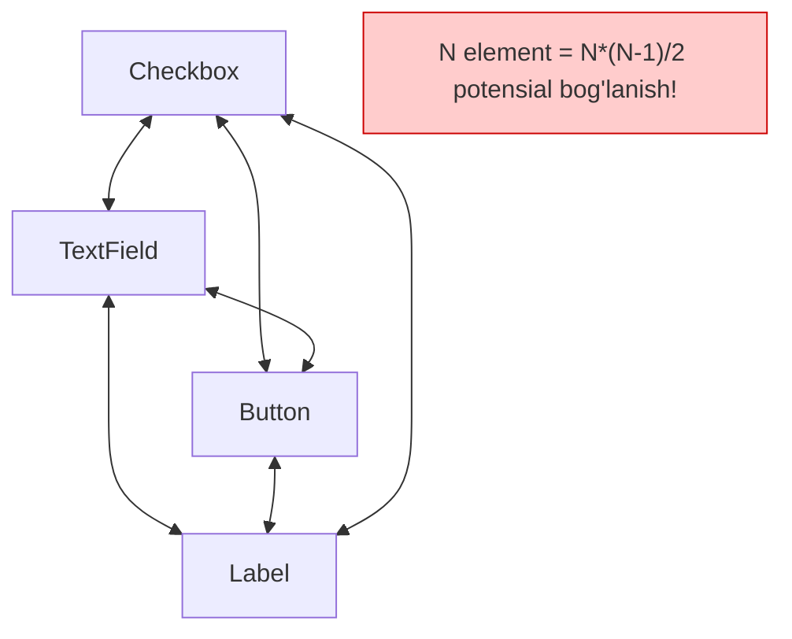
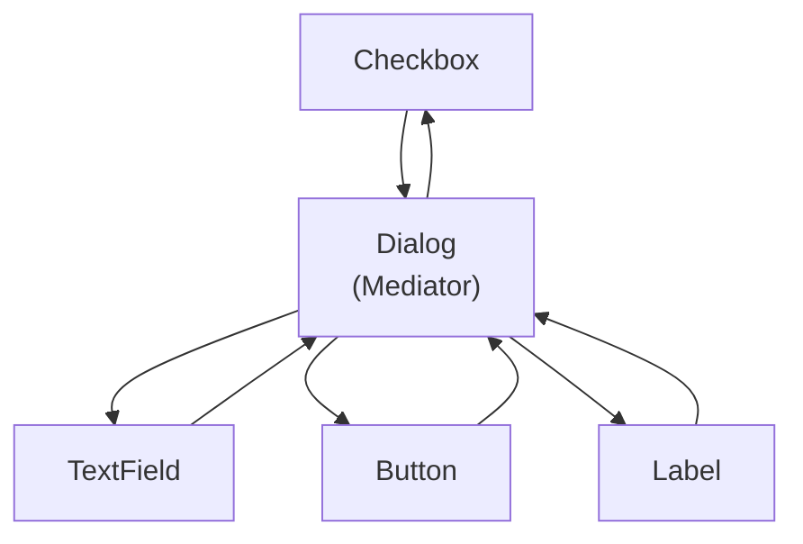
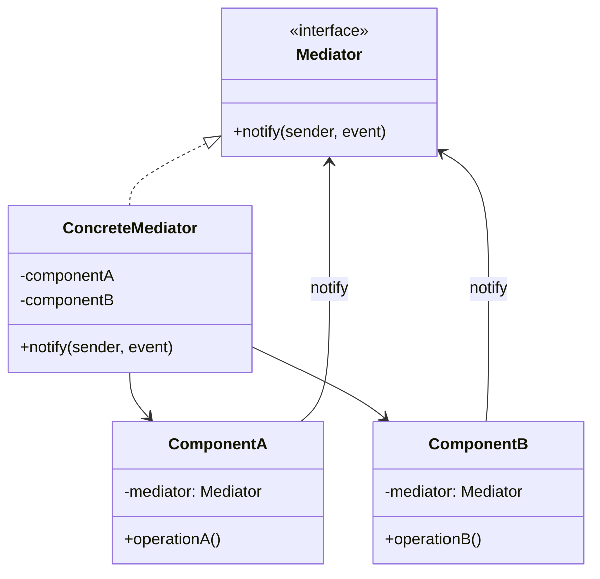

# Mediator Pattern

> Boshqa nomlari: **Intermediary**, **Controller**, **Посредник**

**Mediator** — behavioral (xulq-atvoriy) pattern. U ko'plab class'lar orasidagi **o'zaro bog'liqlikni kamaytiradi** — bu bog'lanishlarni bitta **vositachi-class'ga** ko'chirish orqali.

---

## STEP 1 — Umumiy tushuncha

### Muammo nima edi?

Foydalanuvchi profilini yaratish dialogi bor deylik: matn maydonlari, checkbox'lar, tugmalar. Bu elementlar **bir-biri bilan gaplashishi** kerak: "itim bor" checkbox'i belgilansa — it nomini kirituvchi yashirin maydon ochiladi; "yuborish" tugmasi bosilsa — barcha maydonlar tekshiriladi.

Bu logikani **elementlarning o'z kodiga** yozsangiz, ularni boshqa joyda qayta ishlatishga chek qo'yasiz: checkbox aynan shu dialogdagi maydonga bog'lanib qoladi. Boshqa formada u kerak bo'lsa — yo hammasini birga ko'chirasiz, yo hech narsani.

### Pattern ishlatilmasa qanday muammolar bo'ladi?

| Muammo | Oqibat |
|--------|--------|
| Elementlar bir-birini to'g'ridan-to'g'ri chaqiradi | Xaotik, "o'rgimchak to'ri" bog'lanishlar |
| Bitta element o'zgarsa | O'nlab boshqa elementlar kodiga tegish kerak |
| Element boshqa kontekstda kerak | Qayta ishlatib bo'lmaydi — bog'lanishlari birga keladi |
| Har kontekst uchun element subclass'lari | Class ko'payishi |



### Yechim nima?

Mediator obyektlarni **bir-biri bilan emas, alohida vositachi obyekt orqali** gaplashishga majbur qiladi. Vositachi so'rovni kimga yo'naltirishni **o'zi biladi**. Natijada komponentlar o'nlab hamkasblariga emas, **faqat mediator'ga** bog'liq bo'ladi.

Dialog misolida mediator — **dialogning o'zi** bo'la oladi: u qaysi elementlardan iboratligini baribir biladi, yangi bog'lanish qo'shish shart emas. Asosiy o'zgarish elementlarda: ilgari tugma bosilganda **o'zi** hamma maydonni tekshirardi; endi yagona vazifasi — dialogga "meni bosishdi" deb **xabar berish**. Tekshiruvni dialog bajaradi. Tugmaning o'nlab bog'lanishi o'rniga **bittagina** — dialogga — bog'lanishi qoladi.

Yanada moslashuvchan qilish uchun barcha mediator'lar (dasturdagi dialoglar) uchun **umumiy interface** ajratiladi — endi tugma konkret dialogga emas, abstrakt mediator'ga bog'lanadi va istalgan dialogda ishlaydi.

Shunday qilib mediator class'lar orasidagi murakkab bog'lanishlarni **o'z ichiga yashiradi**. Class qancha kam bog'lanishga ega bo'lsa, uni o'zgartirish, kengaytirish va qayta ishlatish shuncha oson.



### Hayotiy analogiya

Aeroportga qo'nayotgan/uchayotgan **uchoqlar uchuvchilari bir-biri bilan to'g'ridan-to'g'ri gaplashmaydi** — ular **dispetcher** bilan bog'lanadi. Dispetcher bir vaqtda bir nechta uchoq harakatini muvofiqlashtiradi. Dispetchersiz har uchuvchi atrofdagi hamma uchoqni o'zi kuzatishi kerak bo'lardi — bu havoda tez-tez falokatlarga olib kelardi. Muhim nuans: dispetcher **butun parvoz davomida** kerak emas — faqat aeroport zonasida, ko'p tomonlama muvofiqlashtirish zarur bo'lganda.

### Asosiy qoida

> **Komponentlar bir-birini bilmasin: hodisa yuz bersa faqat mediator'ga xabar bersin, kimni ishga solishni mediator o'zi hal qilsin.**

### Struktura



1. **Komponentlar** — biznes-logikali turli obyektlar. Har biri mediator'ga havola saqlaydi, lekin u bilan faqat **abstrakt mediator interface** orqali ishlaydi — shu tufayli komponentni boshqa dasturda boshqa mediator bilan qayta ishlatish mumkin.
2. **Mediator interface** — komponentlar bilan axborot almashish metodlari. Odatda komponentlarda yuz bergan hodisalar haqida xabar oluvchi **bitta `notify` metodi** yetadi (parametrlarida hodisa tafsilotlari: yuboruvchi komponent va boshqa ma'lumotlar).
3. **Concrete Mediator** — bir nechta komponentning o'zaro ishlash kodini saqlaydi. Ko'pincha barcha komponentlarga havola saqlabgina qolmay, ularni **o'zi yaratadi va hayotini boshqaradi**.
4. Komponentlar **bir-biri bilan to'g'ridan-to'g'ri gaplashmasligi** kerak: muhim hodisa bo'lsa — faqat mediator'ga xabar. Yuboruvchi kim ishlov berishini, qabul qiluvchi kim yuborganini bilmaydi.

---

## STEP 2 — Python misoli

### ❌ Yomon misol (pattern'siz)

```python
class Component1:
    def __init__(self, component2):
        # ❌ Komponent boshqa komponentga TO'G'RIDAN-TO'G'RI bog'landi
        self._component2 = component2

    def do_a(self):
        print("Component 1 does A.")
        # ❌ Kim reaksiya qilishini komponent O'ZI hal qilyapti:
        self._component2.do_c()


class Component2:
    def __init__(self):
        self._component1 = None  # ❌ o'zaro (siklik!) bog'liqlik

    def do_d(self):
        print("Component 2 does D.")
        self._component1.do_b()
        self.do_c()

# Component1'ni boshqa dasturda ishlatmoqchimisiz?
# Component2 ham birga "sudralib" keladi. Reaksiya qoidasi
# o'zgarsa — komponentlar KODINI o'zgartirasiz.
```

### ✅ Mediator bilan

`t/Python/src/Mediator/Conceptual` misoli (izohlar o'zbekchada):

```python
from __future__ import annotations
from abc import ABC


class Mediator(ABC):
    """
    Mediator interface'i — komponentlar turli hodisalar haqida
    mediator'ni xabardor qilish uchun ishlatadigan metod. Mediator bu
    hodisalarga reaksiya qilib, ijroni boshqa komponentlarga uzatadi.
    """

    def notify(self, sender: object, event: str) -> None:
        pass


class ConcreteMediator(Mediator):
    def __init__(self, component1: Component1, component2: Component2) -> None:
        self._component1 = component1
        self._component1.mediator = self
        self._component2 = component2
        self._component2.mediator = self

    def notify(self, sender: object, event: str) -> None:
        # Barcha "kim nimaga reaksiya qiladi" qoidalari BITTA joyda:
        if event == "A":
            print("Mediator reacts on A and triggers following operations:")
            self._component2.do_c()
        elif event == "D":
            print("Mediator reacts on D and triggers following operations:")
            self._component1.do_b()
            self._component2.do_c()


class BaseComponent:
    """
    Bazaviy komponent — mediator nusxasini saqlash funksiyasini beradi.
    """

    def __init__(self, mediator: Mediator = None) -> None:
        self._mediator = mediator

    @property
    def mediator(self) -> Mediator:
        return self._mediator

    @mediator.setter
    def mediator(self, mediator: Mediator) -> None:
        self._mediator = mediator


# Konkret komponentlar turli funksionallikni bajaradi. Ular boshqa
# komponentlarga HAM, konkret mediator class'iga HAM bog'liq emas.

class Component1(BaseComponent):
    def do_a(self) -> None:
        print("Component 1 does A.")
        self.mediator.notify(self, "A")  # faqat xabar beradi!

    def do_b(self) -> None:
        print("Component 1 does B.")
        self.mediator.notify(self, "B")


class Component2(BaseComponent):
    def do_c(self) -> None:
        print("Component 2 does C.")
        self.mediator.notify(self, "C")

    def do_d(self) -> None:
        print("Component 2 does D.")
        self.mediator.notify(self, "D")


if __name__ == "__main__":
    c1 = Component1()
    c2 = Component2()
    mediator = ConcreteMediator(c1, c2)

    print("Client triggers operation A.")
    c1.do_a()

    print("\n", end="")

    print("Client triggers operation D.")
    c2.do_d()
```

**Output:**

```
Client triggers operation A.
Component 1 does A.
Mediator reacts on A and triggers following operations:
Component 2 does C.

Client triggers operation D.
Component 2 does D.
Mediator reacts on D and triggers following operations:
Component 1 does B.
Component 2 does C.
```

**Nima yaxshilandi?** Komponentlar bir-birini **umuman bilmaydi**; "A bo'lsa C ishlasin" qoidalari bitta joyda (`ConcreteMediator.notify`); qoidani o'zgartirish uchun faqat mediator'ga tegiladi; komponentni boshqa mediator bilan boshqa dasturda ishlatish mumkin.

---

## STEP 3 — Go misoli

### ❌ Yomon misol (pattern'siz)

```go
package main

// ❌ Har bir poyezd BOSHQA poyezdlarni o'zi kuzatishi kerak
type PassengerTrain struct {
	otherTrains  []*FreightTrain // boshqa poyezdlarga bog'liq!
	platformBusy *bool
}

func (t *PassengerTrain) arrive() {
	// Platforma bandligini va boshqa poyezdlarni O'ZI tekshiradi:
	if *t.platformBusy {
		fmt.Println("PassengerTrain: waiting...")
		return
	}
	*t.platformBusy = true
	fmt.Println("PassengerTrain: Arrived")
	// Ketishda navbatdagi poyezdga O'ZI ruxsat berishi kerak —
	// buning uchun HAMMA poyezdlar ro'yxatini bilishi shart!
}
// Yangi poyezd turi qo'shilsa, hamma poyezd kodiga tegiladi.
```

### ✅ Mediator bilan

`t/Go/mediator` misoli — temir yo'l stansiyasi: poyezdlar bir-biri bilan emas, **stansiya menejeri** orqali kelishadi (izohlar o'zbekchada):

```go
// mediator.go — Mediator interface
package main

type Mediator interface {
	canArrive(Train) bool
	notifyAboutDeparture()
}
```

```go
// train.go — Komponent interface
package main

type Train interface {
	arrive()
	depart()
	permitArrival()
}
```

```go
// passengerTrain.go — Komponent 1: faqat mediator'ni biladi
package main

import "fmt"

type PassengerTrain struct {
	mediator Mediator
}

func (g *PassengerTrain) arrive() {
	// Kelish mumkinligini MEDIATOR hal qiladi
	if !g.mediator.canArrive(g) {
		fmt.Println("PassengerTrain: Arrival blocked, waiting")
		return
	}
	fmt.Println("PassengerTrain: Arrived")
}

func (g *PassengerTrain) depart() {
	fmt.Println("PassengerTrain: Leaving")
	g.mediator.notifyAboutDeparture() // faqat xabar beradi
}

func (g *PassengerTrain) permitArrival() {
	fmt.Println("PassengerTrain: Arrival permitted, arriving")
	g.arrive()
}
```

```go
// freightTrain.go — Komponent 2
package main

import "fmt"

type FreightTrain struct {
	mediator Mediator
}

func (g *FreightTrain) arrive() {
	if !g.mediator.canArrive(g) {
		fmt.Println("FreightTrain: Arrival blocked, waiting")
		return
	}
	fmt.Println("FreightTrain: Arrived")
}

func (g *FreightTrain) depart() {
	fmt.Println("FreightTrain: Leaving")
	g.mediator.notifyAboutDeparture()
}

func (g *FreightTrain) permitArrival() {
	fmt.Println("FreightTrain: Arrival permitted")
	g.arrive()
}
```

```go
// stationManager.go — Concrete Mediator: butun muvofiqlashtirish
// logikasi BITTA joyda
package main

type StationManager struct {
	isPlatformFree bool
	trainQueue     []Train
}

func newStationManger() *StationManager {
	return &StationManager{
		isPlatformFree: true,
	}
}

func (s *StationManager) canArrive(t Train) bool {
	if s.isPlatformFree {
		s.isPlatformFree = false
		return true
	}
	// Platforma band — poyezdni navbatga qo'yamiz
	s.trainQueue = append(s.trainQueue, t)
	return false
}

func (s *StationManager) notifyAboutDeparture() {
	if !s.isPlatformFree {
		s.isPlatformFree = true
	}
	// Navbatda poyezd bo'lsa, unga ruxsat beramiz
	if len(s.trainQueue) > 0 {
		firstTrainInQueue := s.trainQueue[0]
		s.trainQueue = s.trainQueue[1:]
		firstTrainInQueue.permitArrival()
	}
}
```

```go
// main.go
package main

func main() {
	stationManager := newStationManger()

	passengerTrain := &PassengerTrain{
		mediator: stationManager,
	}
	freightTrain := &FreightTrain{
		mediator: stationManager,
	}

	passengerTrain.arrive()
	freightTrain.arrive()   // platforma band — navbatga tushadi
	passengerTrain.depart() // ketdi — mediator navbatdagini chaqiradi
}
```

**Output:**

```
PassengerTrain: Arrived
FreightTrain: Arrival blocked, waiting
PassengerTrain: Leaving
FreightTrain: Arrival permitted
FreightTrain: Arrived
```

**Nima yaxshilandi?**
- Poyezdlar **bir-birining mavjudligini bilmaydi** — faqat `Mediator` interface'ini biladi;
- platforma/navbat logikasi **faqat** `StationManager`da — o'zgartirish oson;
- yangi poyezd turi = yangi struct, boshqa poyezdlar va mediator o'zgarmaydi.

---

## Qachon ishlatish kerak?

**1. Ba'zi class'larni o'zgartirish qiyin bo'lsa — chunki ular boshqa class'lar bilan xaotik bog'lanib ketgan.**

Mediator bu bog'lanishlarni bitta class'ga yig'adi — endi ularni refactor qilish, tushunarli va moslashuvchan qilish oson.

**2. Class'ni boshqa dasturda qayta ishlata olmasangiz — u juda ko'p boshqa class'larga bog'liq bo'lgani uchun.**

Pattern'dan keyin komponentlar hamkasblari bilan aloqani yo'qotadi — butun muloqot bilvosita, mediator orqali.

**3. Bir xil komponentlarni turli kontekstlarda ishlatish uchun ko'plab subclass ochishga majbur bo'lsangiz.**

Ilgari bitta komponentdagi munosabat o'zgarishi boshqalariga "o'zgarishlar ko'chkisi"ni keltirardi; endi yangi kontekst = yangi **mediator subclass'i**, komponentlar o'zgarmaydi.

---

## Implementatsiya qadamlari

1. Bir-biriga chirmashib ketgan, ajratilsa foyda beradigan (masalan, boshqa loyihada qayta ishlatiladigan) class'lar guruhini toping.
2. **Mediator interface**'ini yarating — odatda komponentlardan xabar qabul qiluvchi bitta metod yetarli. Bu interface komponentlarni boshqa vazifalarda qayta ishlatish uchun kerak — yangi vazifa uchun yangi konkret mediator yozasiz, xolos.
3. Interface'ni **konkret mediator**'da implementatsiya qiling: unga barcha komponentlarga havola maydonlarini joylang.
4. Yana bir qadam: komponentlarni **yaratishni ham mediator'ga** ko'chirish mumkin — shunda u factory yoki facade'ga o'xshab qoladi.
5. Komponentlar ham mediator'ga havola saqlasin — aloqani komponent constructor'i orqali o'rnatish qulay.
6. Komponentlar kodini o'zgartiring: boshqa komponent metodlari o'rniga **mediator'ning xabar metodini** chaqirsin. Qarama-qarshi tomondan: mediator xabar olganda kerakli komponent metodlarini o'zi chaqirsin.

---

## Afzalliklar va kamchiliklar

| ✅ Afzalliklar | ❌ Kamchiliklar |
|---------------|----------------|
| Komponentlar orasidagi bog'liqlikni yo'q qiladi — qayta ishlatish osonlashadi | Mediator **"god object"ga** aylanib, haddan ortiq shishib ketishi mumkin |
| Komponentlar muloqotini soddalashtiradi | |
| Boshqaruvni bir joyga markazlashtiradi | |

---

## Boshqa patternlar bilan aloqasi

- **CoR, Command, Mediator, Observer** — yuboruvchi-qabul qiluvchi aloqasining to'rt usuli (Mediator: to'g'ri aloqani olib tashlab, hammani o'zi orqali gaplashtiradi).
- **Mediator va Facade** o'xshash — ikkalasi ko'p class ishini tashkil qiladi. Farqi: Facade subsystem'ga **soddalashtirilgan interface** beradi, yangi funksiya qo'shmaydi, subsystem uni **bilmaydi**, ichki class'lar bir-biri bilan to'g'ridan-to'g'ri gaplashadi; Mediator esa muloqotni **markazlashtiradi** — komponentlar faqat mediator'ni biladi.
- **Mediator va Observer** farqi har doim ham ochiq emas — ko'pincha raqobatchi, ba'zan hamkor: Mediator'ning maqsadi komponentlarning **o'zaro** bog'liqligini yo'qotish; Observer'niki — **dinamik bir tomonlama** aloqa o'rnatish. Mediator'ni Observer orqali qurish mashhur (mediator — publisher, komponentlar — subscriber'lar). Lekin komponentlar mediator'ga qattiq bog'langan implementatsiyalar ham Mediator bo'lib qolaveradi; komponentlarning har biri publisher bo'lib, markaziy obyektsiz to'r hosil qilsa — bu endi sof Observer.

---

## Real hayotdagi misollar

- **UI dialoglari/formalar** — elementlar formani biladi, forma hammasini muvofiqlashtiradi (klassik misol).
- **Chat server** — foydalanuvchilar bir-biriga to'g'ridan-to'g'ri emas, server orqali yozadi; server kimga yetkazishni hal qiladi.
- **Message broker'lar** (Kafka, RabbitMQ) — servislar bir-birini bilmaydi, xabarlarni broker taqsimlaydi (Mediator + Observer aralashmasi).
- **Aviatsiya dispetcheri**, o'yin dvigatellaridagi event manager'lar, mikroservislardagi orchestrator (masalan, Saga orchestration).

---

## Xulosa

### Eslab qol

- Mediator = **"o'rgimchak to'ri"ni yulduzchaga aylantirish**: N×N bog'lanish o'rniga har komponent → mediator.
- Komponent hodisada faqat `notify(o'zi, hodisa)` deydi; **kim reaksiya qilishini mediator hal qiladi**.
- Komponentlar **abstrakt** mediator'ga bog'lansin — shunda ularni boshqa mediator bilan qayta ishlatish mumkin.
- Eng katta xavf: mediator **god object** bo'lib ketishi — logika juda ko'payib ketsa, bir nechta mediator'ga bo'ling.
- Observer bilan adashtirmang: Mediator **markazlashtiradi**, Observer **obuna** beradi; ular birga ham kelishi mumkin.

### Amaliyot

1. `t/Go/mediator`'ga `MaintenanceTrain` (ta'mirlash poyezdi) qo'shing — mavjud poyezdlar kodiga tegdingizmi?
2. `StationManager`'ga 2 ta platforma qo'shing — o'zgarish faqat mediator'da bo'lishiga e'tibor bering.
3. Python misolida `notify`'ga "B" hodisasi uchun reaksiya qo'shing (ehtiyot bo'ling — cheksiz sikl bo'lmasin!).
4. O'z loyihangizda bir-birini chaqirib chirmashgan 3+ servisni toping va ularni mediator orqali qayta loyihalashni chizib chiqing.

---

## Keyingi qadam

→ [5. Memento.md](5.%20Memento.md)
