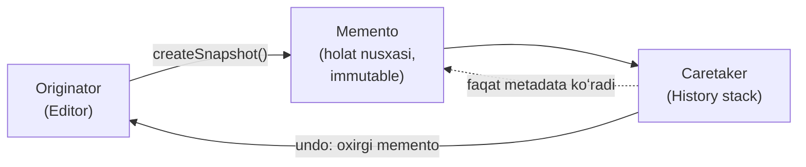
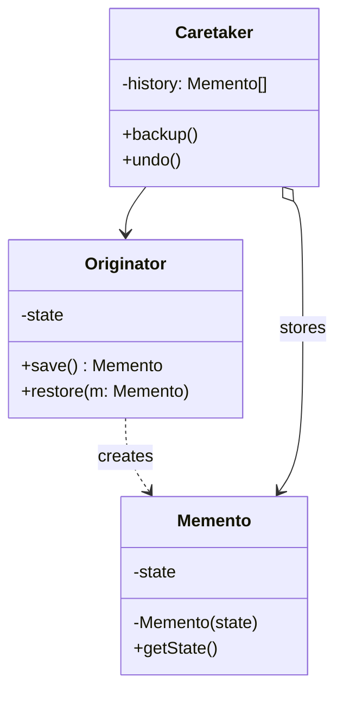

# Memento Pattern

> Boshqa nomlari: **Snapshot**, **Хранитель**, **Снимок**

**Memento** — behavioral (xulq-atvoriy) pattern. U obyektlarning **o'tgan holatlarini saqlash va tiklash** imkonini beradi — obyekt implementatsiyasi tafsilotlarini oshkor qilmasdan.

---

## STEP 1 — Umumiy tushuncha

### Muammo nima edi?

Matn muharriri yozyapsiz: oddiy tahrirdan tashqari formatlash, rasm qo'yish va boshqalar bor. Bir kuni bu amallarni **bekor qilinadigan (undo)** qilishga qaror qildingiz: har amaldan oldin muharrir holatining nusxasini saqlab, kerak bo'lsa tarixdan tiklaysiz.

Holat nusxasini olish uchun obyekt maydonlari qiymatini ko'chirish kerak. Muharrir class'ini "ochiq" qilsangiz, istalgan class uning ichiga kirib holatni nusxalay oladi. Lekin bu **sodda yechim keyin katta muammo bo'ladi**:

1. Muharrirni refactor qilsangiz (maydon qo'shsangiz/olsangiz) — holatni nusxalagan **hamma class'larni** o'zgartirishga to'g'ri keladi.
2. Holat nusxalarining o'zi-chi? Ular uchun "container" class kerak: ko'p maydonli, deyarli metodsiz. Boshqalar unga yozishi/o'qishi uchun maydonlarni **public** qilasiz — yana o'sha muammo: hamma shu container tafsilotlariga bog'lanadi.

Natijada tanlov: yo class'larni hammagacha ochib, qo'llab-quvvatlash azobini olasiz; yo yopiq qoldirib, undo'dan voz kechasiz. Boshqa yo'l yo'qmi?

### Pattern ishlatilmasa qanday muammolar bo'ladi?

| Muammo | Oqibat |
|--------|--------|
| Holatni "tashqaridan" nusxalash | Private maydonlarga kirib bo'lmaydi yoki inkapsulyatsiya buziladi |
| Nusxalovchi kod obyekt maydonlariga bog'lanadi | Refactoring hamma joyni sindiradi |
| Holat container'i public maydonli | Unga ham hamma bog'lanib qoladi |
| Holat tarixini obyekt o'zi saqlasa | Obyekt shishadi, vazifasi aralashadi |

### Yechim nima?

Yuqoridagi muammolarning ildizi — **inkapsulyatsiya buzilishi**: obyektlar boshqalar ishini qilishga urinib, ularning "shaxsiy zonasiga" kiryapti.

Memento holat nusxasini yaratishni **holat egasining o'ziga** topshiradi: muharrir o'z maydonlarini **o'zi** nusxalaydi — unga hamma maydon, hatto private'lari ham ochiq.

Holat nusxasi **memento** deb ataladigan maxsus obyektda saqlanadi. Uning ikki "yuzi" bor:

- **Cheklangan interface** — begonalar (opekun/caretaker'lar) uchun: faqat metadata (nomi, sanasi) ko'rinadi, ichki holat ko'rinmaydi;
- **To'liq kirish** — faqat memento'ni yaratgan obyekt (originator) uchun: u ichini o'qib, holatni tiklay oladi.

Bu sxema originator'larga memento'lar yasab, ularni saqlash uchun **caretaker**larga berish imkonini beradi. Caretaker memento ichiga ta'sir qila olmaydi; kerak paytda esa uni originator'ga qaytarib, holatni tiklashni so'raydi. Muharrir misolida caretaker — bajarilgan amallar tarixi class'i: cheklangan interface tufayli foydalanuvchiga amallar ro'yxatini (nomi + sanasi) chiroyli ko'rsata oladi, undo bosilganda esa oxirgi memento'ni muharrirga uzatadi.



### Asosiy qoida

> **Holat nusxasini obyekt o'zi yaratsin (unga private maydonlar ham ochiq); nusxa immutable memento'da saqlansin; saqlovchi (caretaker) esa memento ichiga qaray olmasin.**

### Struktura

**Klassik implementatsiya** ichki (nested) class mexanizmiga tayanadi (C++, C#, Java): `Memento` — `Originator`ning ichki class'i, shu tufayli uning private maydonlariga to'liq kiradi; caretaker esa faqat havola saqlaydi.



1. **Originator (yaratuvchi)** — o'z holatining memento'larini yaratadi va tayyor memento berilsa, o'tgan holatni tiklaydi.
2. **Memento** — originator holatini saqlovchi oddiy ma'lumot obyekti. Eng ishonchlisi — **immutable** qilish: holat faqat constructor orqali beriladi.
3. **Caretaker (opekun)** — **qachon** saqlash va **qachon** tiklashni biladi. Tarixni memento'lar stack'ida saqlaydi; undo kerak bo'lsa "eng ustki" memento'ni olib, originator'ga tiklash uchun beradi.

Boshqa variantlar: nested class bo'lmagan tillar (PHP, Go, Python) uchun — **bo'sh oraliq interface** (caretaker faqat shu cheklangan interface bilan ishlaydi, originator konkret memento class'i bilan); yoki **qattiqroq himoya** varianti — tiklash metodi memento'ning o'zida bo'lib, hech kim (caretaker ham) originator/memento holatini o'qiy olmaydi.

---

## STEP 2 — Python misoli

### ❌ Yomon misol (pattern'siz)

```python
class Originator:
    def __init__(self, state):
        self._state = state  # nazarda "private"


# ❌ Caretaker holatni TASHQARIDAN qo'lda nusxalaydi:
class BadCaretaker:
    def __init__(self, originator):
        self._originator = originator
        self._history = []

    def backup(self):
        # Inkapsulyatsiya buzildi: "_state" ga to'g'ridan-to'g'ri kirish
        self._history.append(self._originator._state)

    def undo(self):
        # Tiklash ham tashqaridan:
        self._originator._state = self._history.pop()

# Originator'ga yangi maydon (masalan _cursor) qo'shilsa,
# BadCaretaker uni bilmaydi — tiklash CHALA bo'ladi va hech
# qanday xato ham bermaydi. Bug'ni topish juda qiyin.
```

### ✅ Memento bilan

`t/Python/src/Memento/Conceptual` misoli (izohlar o'zbekchada):

```python
from __future__ import annotations
from abc import ABC, abstractmethod
from datetime import datetime
from random import sample
from string import ascii_letters


class Originator:
    """
    Originator — vaqt o'tishi bilan o'zgarishi mumkin bo'lgan muhim
    holat egasi. U holatni memento ichiga saqlash va undan tiklash
    metodlarini e'lon qiladi.
    """

    _state = None

    def __init__(self, state: str) -> None:
        self._state = state
        print(f"Originator: My initial state is: {self._state}")

    def do_something(self) -> None:
        # Biznes-logika holatga ta'sir qiladi — shuning uchun client
        # uni chaqirishdan OLDIN save() bilan backup qilishi kerak.
        print("Originator: I'm doing something important.")
        self._state = self._generate_random_string(30)
        print(f"Originator: and my state has changed to: {self._state}")

    @staticmethod
    def _generate_random_string(length: int = 10) -> str:
        return "".join(sample(ascii_letters, length))

    def save(self) -> Memento:
        # Joriy holatni memento ichiga O'ZI saqlaydi.
        return ConcreteMemento(self._state)

    def restore(self, memento: Memento) -> None:
        # Holatni memento'dan O'ZI tiklaydi.
        self._state = memento.get_state()
        print(f"Originator: My state has changed to: {self._state}")


class Memento(ABC):
    """
    Memento interface'i faqat METADATA (sana, nom) olish yo'lini
    beradi — originator holatini OSHKOR QILMAYDI.
    """

    @abstractmethod
    def get_name(self) -> str:
        pass

    @abstractmethod
    def get_date(self) -> str:
        pass


class ConcreteMemento(Memento):
    def __init__(self, state: str) -> None:
        self._state = state
        self._date = str(datetime.now())[:19]

    def get_state(self) -> str:
        # Bu metodni faqat ORIGINATOR ishlatadi (tiklashda).
        return self._state

    def get_name(self) -> str:
        # Qolgan metodlar caretaker'ga metadata ko'rsatish uchun.
        return f"{self._date} / ({self._state[0:9]}...)"

    def get_date(self) -> str:
        return self._date


class Caretaker:
    """
    Caretaker Concrete Memento'ga BOG'LIQ EMAS — demak memento
    ichidagi holatga kira olmaydi. U barcha memento'lar bilan
    bazaviy (cheklangan) interface orqali ishlaydi.
    """

    def __init__(self, originator: Originator) -> None:
        self._mementos = []
        self._originator = originator

    def backup(self) -> None:
        print("\nCaretaker: Saving Originator's state...")
        self._mementos.append(self._originator.save())

    def undo(self) -> None:
        if not len(self._mementos):
            return

        memento = self._mementos.pop()
        print(f"Caretaker: Restoring state to: {memento.get_name()}")
        try:
            self._originator.restore(memento)
        except Exception:
            self.undo()

    def show_history(self) -> None:
        print("Caretaker: Here's the list of mementos:")
        for memento in self._mementos:
            print(memento.get_name())


if __name__ == "__main__":
    originator = Originator("Super-duper-super-puper-super.")
    caretaker = Caretaker(originator)

    caretaker.backup()
    originator.do_something()

    caretaker.backup()
    originator.do_something()

    caretaker.backup()
    originator.do_something()

    print()
    caretaker.show_history()

    print("\nClient: Now, let's rollback!\n")
    caretaker.undo()

    print("\nClient: Once more!\n")
    caretaker.undo()
```

**Output (qisqartirilgan):**

```
Originator: My initial state is: Super-duper-super-puper-super.

Caretaker: Saving Originator's state...
Originator: I'm doing something important.
Originator: and my state has changed to: wQAehHYOqVSlpEXjyIcgobrxsZUnat
...
Caretaker: Here's the list of mementos:
2019-01-26 21:11:24 / (Super-dup...)
2019-01-26 21:11:24 / (wQAehHYOq...)
2019-01-26 21:11:24 / (lHxNORKcs...)

Client: Now, let's rollback!

Caretaker: Restoring state to: 2019-01-26 21:11:24 / (lHxNORKcs...)
Originator: My state has changed to: lHxNORKcsgMWYnJqoXjVCbQLEIeiSp
```

**Nima yaxshilandi?** Holatni **originator o'zi** saqlaydi/tiklaydi; caretaker faqat `get_name()` ko'radi (tarix ro'yxati uchun yetarli); originator'ga maydon qo'shilsa faqat `save`/`restore` va memento o'zgaradi — caretaker'ga tegilmaydi.

---

## STEP 3 — Go misoli

### ❌ Yomon misol (pattern'siz)

```go
package main

// ❌ Caretaker holatni tashqaridan o'qib, string sifatida saqlaydi
type BadCaretaker struct {
	history []string
}

func (c *BadCaretaker) backup(o *Originator) {
	c.history = append(c.history, o.state) // ichki maydonga kirish!
}

func (c *BadCaretaker) undo(o *Originator) {
	last := c.history[len(c.history)-1]
	c.history = c.history[:len(c.history)-1]
	o.state = last // tiklash ham tashqaridan
}

// Originator'ga ikkinchi maydon qo'shilsa — BadCaretaker'ni
// yangilashni unutish oson; holat CHALA saqlanadi/tiklanadi.
```

### ✅ Memento bilan

`t/Go/memento` misoli (izohlar o'zbekchada):

```go
// originator.go — Originator: holat egasi; memento'ni O'ZI
// yaratadi va undan O'ZI tiklaydi
package main

type Originator struct {
	state string
}

func (e *Originator) createMemento() *Memento {
	return &Memento{state: e.state}
}

func (e *Originator) restoreMemento(m *Memento) {
	e.state = m.getSavedState()
}

func (e *Originator) setState(state string) {
	e.state = state
}

func (e *Originator) getState() string {
	return e.state
}
```

```go
// memento.go — Memento: holat nusxasi. Setter yo'q — immutable!
package main

type Memento struct {
	state string
}

func (m *Memento) getSavedState() string {
	return m.state
}
```

```go
// caretaker.go — Caretaker: memento'larni saqlaydi,
// lekin ichiga QARAMAYDI
package main

type Caretaker struct {
	mementoArray []*Memento
}

func (c *Caretaker) addMemento(m *Memento) {
	c.mementoArray = append(c.mementoArray, m)
}

func (c *Caretaker) getMemento(index int) *Memento {
	return c.mementoArray[index]
}
```

```go
// main.go
package main

import "fmt"

func main() {

	caretaker := &Caretaker{
		mementoArray: make([]*Memento, 0),
	}

	originator := &Originator{
		state: "A",
	}

	fmt.Printf("Originator Current State: %s\n", originator.getState())
	caretaker.addMemento(originator.createMemento())

	originator.setState("B")
	fmt.Printf("Originator Current State: %s\n", originator.getState())
	caretaker.addMemento(originator.createMemento())

	originator.setState("C")
	fmt.Printf("Originator Current State: %s\n", originator.getState())
	caretaker.addMemento(originator.createMemento())

	// Istalgan saqlangan nuqtaga qaytish:
	originator.restoreMemento(caretaker.getMemento(1))
	fmt.Printf("Restored to State: %s\n", originator.getState())

	originator.restoreMemento(caretaker.getMemento(0))
	fmt.Printf("Restored to State: %s\n", originator.getState())

}
```

**Output:**

```
Originator Current State: A
Originator Current State: B
Originator Current State: C
Restored to State: B
Restored to State: A
```

**Nima yaxshilandi?**
- Saqlash/tiklash logikasi **originator'da** — maydon qo'shilsa faqat shu joy o'zgaradi;
- `Memento` immutable (setter yo'q) — saqlangan tarix buzilmaydi;
- `Caretaker` faqat "qachon saqlash/tiklash"ni biladi, "nimani"ni emas.

---

## Qachon ishlatish kerak?

**1. Obyekt (yoki uning qismi) holatining "oniy suratlarini" saqlab, keyinchalik shu holatga qaytarish kerak bo'lsa.**

Memento istalgancha snapshot yaratib, ularni obyektdan mustaqil saqlash imkonini beradi. Faqat undo emas — **tranzaksiyalar**da ham ishlatiladi: amal muvaffaqiyatsiz tugasa, holat "orqaga qaytariladi" (rollback).

**2. Holatni to'g'ridan-to'g'ri o'qish obyektning private tafsilotlarini oshkor qilib, inkapsulyatsiyani buzsa.**

Memento snapshot'ni **asl obyektning o'ziga** yasatadi — unga hamma maydon ochiq.

---

## Implementatsiya qadamlari

1. Holatining snapshot'lari kerak bo'ladigan **originator class**'ini aniqlang.
2. **Memento class**'ini yarating — originator'dagi maydonlarga mos maydonlar bilan.
3. Memento'ni **immutable** qiling: qiymatlar faqat bir marta, constructor orqali berilsin.
4. Til imkoni bo'lsa memento'ni originator ichiga **nested** qiling; bo'lmasa memento'dan **cheklangan interface** ajratib, boshqalarga faqat shu ochilsin (metadata metodlari qo'shish mumkin, lekin holatga to'g'ri kirish yopiq qolsin).
5. Originator'ga **snapshot olish metodini** qo'shing: u o'z maydonlari qiymatlarini constructor orqali berib yangi memento yaratsin. Metod signaturasi (cheklangan interface bo'lsa) shu interface'ni qaytarsin; ichkarida esa konkret memento bilan ishlasin.
6. Originator'ga **tiklash metodini** qo'shing (tur bog'lanishida 4-banddagi mantiq).
7. **Caretaker'lar** (amallar tarixi, command obyektlari va b.) qachon so'rash, qayerda saqlash, qachon tiklashni bilishi kerak.
8. Caretaker-originator aloqasini **memento ichiga** ko'chirish ham mumkin: har memento o'z originator'iga bog'lanib, holatni **o'zi tiklaydi** — lekin bu nested class'lar yoki originator'da mos setter'lar bo'lgandagina ishlaydi.

---

## Afzalliklar va kamchiliklar

| ✅ Afzalliklar | ❌ Kamchiliklar |
|---------------|----------------|
| Asl obyekt inkapsulyatsiyasini buzmaydi | Snapshot'lar tez-tez olinsa **ko'p xotira** ketadi |
| Asl obyekt strukturasini soddalashtiradi — holat tarixini o'zida saqlamaydi | Caretaker eski memento'larni tozalamasa — qo'shimcha xotira sarfi |
| | Dinamik tillarda (Python, JS, PHP) "faqat originator kiradi" kafolatini berish qiyin |

---

## Boshqa patternlar bilan aloqasi

- **Command + Memento** = undo: command amalni bajaradi, memento amaldan **oldingi** holatni saqlaydi.
- **Memento + Iterator**: aylanishning joriy holatini saqlab, keyin unga qaytish mumkin.
- Ba'zan Memento o'rnini **Prototype** bosa oladi — agar saqlanadigan obyekt sodda bo'lib, tashqi resurslarga faol havolalari bo'lmasa (holat nusxasi = obyekt clone'i).

---

## Real hayotdagi misollar

- **Undo/Redo** — matn/grafik muharrirlar, IDE'lar.
- **O'yin save'lari** — o'yin holatining snapshot'i, istalgan checkpoint'ga qaytish.
- **DB tranzaksiyalari** — rollback uchun oldingi holat saqlanadi.
- **Konfiguratsiya versiyalari** — "oxirgi ishlagan sozlamalarga qaytarish".
- Go'da amaliy misol: deploy oldidan config snapshot'i, migration'lardagi down-script mantig'i.

---

## Xulosa

### Eslab qol

- Memento = **"holatni o'zing sakla"**: snapshot'ni originator yaratadi (private'lariga o'zi kiradi), tashqaridan hech kim kirmaydi.
- Uch rol: **Originator** (nimani), **Memento** (nusxa, immutable), **Caretaker** (qachon; ichiga qaramaydi).
- Memento'ga **setter yozmang** — tarix o'zgarmas bo'lishi kerak.
- Xotira — asosiy narx: snapshot'lar hajmi va soni nazoratda bo'lsin; muqobil — Command'ning teskari amali.
- Undo'ning to'liq retsepti: **Command** (amal) + **Memento** (holat) + stack (tarix).

### Amaliyot

1. `t/Go/memento`'da `Originator`'ga ikkinchi maydon (`cursor int`) qo'shing — nechta joy o'zgardi? Yomon misolda-chi?
2. `Caretaker`'ga `undo()` metodini qo'shing: oxirgi memento'ni olib, ro'yxatdan o'chirsin.
3. Python misolida `show_history` chiqishini tekshiring: caretaker holatning faqat qisqartmasi (`Super-dup...`)ni ko'rishiga e'tibor bering — to'liq holatga kira oladimi?
4. O'z loyihangizdagi biror sozlanadigan obyekt uchun "oxirgi 5 ta holat"ni saqlaydigan mini-tarix yozing.

---

## Keyingi qadam

→ [6. Observer.md](6.%20Observer.md)
