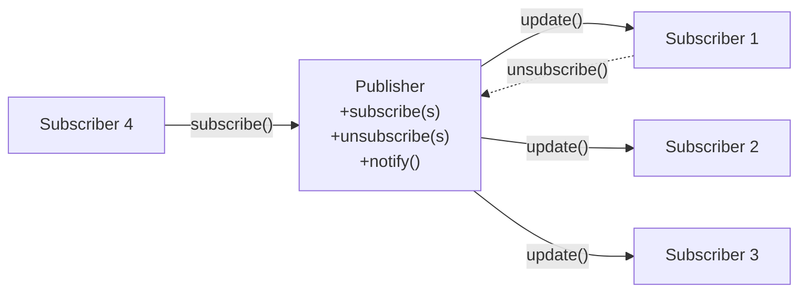
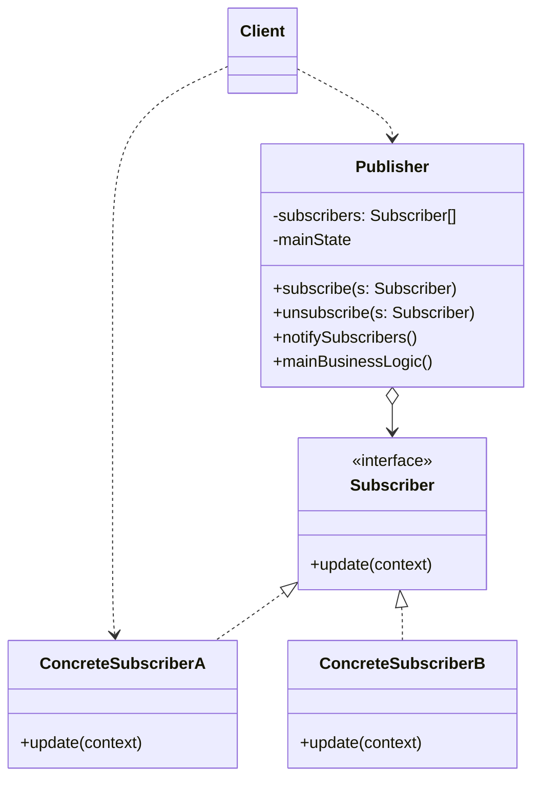

# Observer Pattern

> Boshqa nomlari: **Publisher-Subscriber (Pub/Sub)**, **Listener**, **Наблюдатель**

**Observer** — behavioral (xulq-atvoriy) pattern. U **obuna mexanizmini** yaratadi: bir obyektlar boshqa obyektlarda yuz berayotgan hodisalarni **kuzatib, reaksiya bildira oladi**.

---

## STEP 1 — Umumiy tushuncha

### Muammo nima edi?

Ikkita obyekt bor: `Customer` (xaridor) va `Store` (do'kon). Do'konga xaridorni qiziqtirgan yangi mahsulot kelmoqchi. Xaridor nima qilsin?

- **Har kuni do'konga borib tekshirsin?** Mahsulot kelguncha qatnovlarining ko'pi behuda — vaqt isrof.
- **Do'kon hammaga xabar (spam) yuborsin?** Mahsulot spetsifik — ko'pchilikka kerak emas, ular xafa bo'ladi.

Konflikt: yo xaridor tekshiruvlarga vaqt sarflaydi, yo do'kon keraksiz xabarlarga resurs.

### Pattern ishlatilmasa qanday muammolar bo'ladi?

| Muammo | Oqibat |
|--------|--------|
| Qiziquvchilar holatni **polling** qilib turadi | Resurs isrofi, kechikishlar |
| Yoki egasi **hammaga** xabar yuboradi | Keraksiz xabarlar, spam |
| Egasi qiziquvchilarning konkret class'larini chaqiradi | Qattiq bog'liqlik: yangi qiziquvchi = egasining kodi o'zgaradi |
| Qiziquvchilar ro'yxati kodga "qotirilgan" | Runtime'da obuna bo'lish/chiqish imkonsiz |

### Yechim nima?

Atamalar: boshqalarga qiziq holatga ega obyektni **Publisher (nashriyotchi)**, uning o'zgarishlarini kuzatmoqchi bo'lganlarni **Subscriber (obunachi)** deymiz.

Observer pattern'i publisher ichida **obunachilarga havolalar ro'yxatini** saqlashni taklif qiladi. Muhim: publisher ro'yxatni o'zi "boshqarib o'tirmaydi" — u obunachilarga **o'zini ro'yxatga qo'shish/o'chirish metodlarini** ochib beradi.

Endi asosiy qism: publisher'da muhim hodisa yuz berganda, u ro'yxat bo'ylab yurib har bir obunachining **xabar metodini** chaqiradi. Obunachi qaysi class'dan ekani publisher'ga baribir — hammasi **umumiy interface**'ga (yagona `update` metodiga) bo'ysunadi.

Yana bir qadam: publisher'lar uchun ham umumiy interface (obuna/chiqish metodlari) ajratsangiz, obunachilar **har xil turdagi publisher'lar** bilan bitta usulda ishlay oladi.



### Hayotiy analogiya

Gazeta yoki jurnalga **obuna** bo'lsangiz, yangi son chiqqanini tekshirish uchun supermarketga qatnamaysiz — nashriyot yangi sonlarni **o'zi uyingizga yuboradi**. Nashriyot obunachilar ro'yxatini yuritadi, kimga qaysi jurnal ketishini biladi. Istagan payt obunadan chiqasiz — jurnal kelishi to'xtaydi.

### Asosiy qoida

> **Kuzatuvchi so'rab yurmasin, egasi hammaga baqirmasin: qiziquvchilar obuna bo'lsin, hodisa yuz berganda publisher faqat obunachilarga `update` yuborsin.**

### Struktura



1. **Publisher** — obunachilarga qiziq bo'lgan ichki holat egasi; obuna mexanizmini (ro'yxat + subscribe/unsubscribe metodlari) o'z ichiga oladi.
2. Holat o'zgarganda publisher ro'yxat bo'ylab yurib, har obunachining umumiy interface'dagi **xabar metodini** chaqiradi.
3. **Subscriber interface** — publisher xabar yuborishda ishlatadigan interface; ko'p hollarda yagona `update` metodi yetadi.
4. **Concrete Subscriber'lar** — xabarga javoban biror ish bajaradi; publisher konkret class'larga bog'lanmasligi uchun hammasi umumiy interface'da.
5. Xabar bilan birga obunachiga **kontekst** kerak: publisher hodisa ma'lumotlarini `update` parametrlari orqali berishi mumkin; yoki (moslashuvchanroq) **o'zini** parametr qilib beradi — obunachi keraklisini o'zi o'qiydi; yoki obunachi publisher'ga constructor'da bog'lanib olishi ham mumkin.
6. **Client** publisher va obunachilarni yaratib, obunachilarni ro'yxatga qo'shadi.

---

## STEP 2 — Python misoli

### ❌ Yomon misol (pattern'siz)

```python
class ConcreteObserverA:
    def react(self): ...

class ConcreteObserverB:
    def react(self): ...


class Subject:
    def __init__(self):
        # ❌ Qiziquvchilar KODGA QOTIRILGAN — konkret class'lar!
        self._observer_a = ConcreteObserverA()
        self._observer_b = ConcreteObserverB()

    def some_business_logic(self):
        self._state = randrange(0, 10)
        # ❌ Har birini nomma-nom chaqiradi:
        self._observer_a.react()
        self._observer_b.react()
        # Yangi kuzatuvchi qo'shilsa — Subject KODI o'zgaradi.
        # Runtime'da obuna/chiqish yo'q. C kuzatuvchisi vaqtincha
        # kerak bo'lmasa ham chaqirilaveradi.
```

### ✅ Observer bilan

`t/Python/src/Observer/Conceptual` misoli (izohlar o'zbekchada):

```python
from __future__ import annotations
from abc import ABC, abstractmethod
from random import randrange
from typing import List


class Subject(ABC):
    """
    Subject (publisher) interface'i — obunachilarni boshqarish
    metodlari to'plami.
    """

    @abstractmethod
    def attach(self, observer: Observer) -> None:
        """Kuzatuvchini publisher'ga biriktiradi."""
        pass

    @abstractmethod
    def detach(self, observer: Observer) -> None:
        """Kuzatuvchini publisher'dan uzadi."""
        pass

    @abstractmethod
    def notify(self) -> None:
        """Barcha kuzatuvchilarni hodisa haqida xabardor qiladi."""
        pass


class ConcreteSubject(Subject):
    """
    Publisher muhim holatga ega va u o'zgarganda
    kuzatuvchilarni xabardor qiladi.
    """

    _state: int = None
    # Qulaylik uchun: barcha obunachilarga kerakli holat shu yerda.

    _observers: List[Observer] = []
    # Obunachilar ro'yxati. Real hayotda batafsilroq saqlanishi
    # mumkin (hodisa turi bo'yicha tasniflangan va h.k.)

    def attach(self, observer: Observer) -> None:
        print("Subject: Attached an observer.")
        self._observers.append(observer)

    def detach(self, observer: Observer) -> None:
        self._observers.remove(observer)

    def notify(self) -> None:
        # Har bir obunachida yangilanishni ishga tushirish.
        print("Subject: Notifying observers...")
        for observer in self._observers:
            observer.update(self)

    def some_business_logic(self) -> None:
        # Obuna logikasi — publisher ishining faqat bir qismi.
        # Muhim ish yuz berganda (yoki undan keyin) notify chaqiriladi.
        print("\nSubject: I'm doing something important.")
        self._state = randrange(0, 10)

        print(f"Subject: My state has just changed to: {self._state}")
        self.notify()


class Observer(ABC):
    """
    Observer interface'i — publisher'lar obunachilarni xabardor
    qilishda ishlatadigan yagona update metodi.
    """

    @abstractmethod
    def update(self, subject: Subject) -> None:
        pass


# Konkret kuzatuvchilar o'zi biriktirilgan publisher chiqargan
# yangilanishlarga reaksiya bildiradi.

class ConcreteObserverA(Observer):
    def update(self, subject: Subject) -> None:
        if subject._state < 3:
            print("ConcreteObserverA: Reacted to the event")


class ConcreteObserverB(Observer):
    def update(self, subject: Subject) -> None:
        if subject._state == 0 or subject._state >= 2:
            print("ConcreteObserverB: Reacted to the event")


if __name__ == "__main__":
    subject = ConcreteSubject()

    observer_a = ConcreteObserverA()
    subject.attach(observer_a)

    observer_b = ConcreteObserverB()
    subject.attach(observer_b)

    subject.some_business_logic()
    subject.some_business_logic()

    # Runtime'da obunadan chiqish:
    subject.detach(observer_a)

    subject.some_business_logic()
```

**Output:**

```
Subject: Attached an observer.
Subject: Attached an observer.

Subject: I'm doing something important.
Subject: My state has just changed to: 0
Subject: Notifying observers...
ConcreteObserverA: Reacted to the event
ConcreteObserverB: Reacted to the event

Subject: I'm doing something important.
Subject: My state has just changed to: 5
Subject: Notifying observers...
ConcreteObserverB: Reacted to the event

Subject: I'm doing something important.
Subject: My state has just changed to: 0
Subject: Notifying observers...
ConcreteObserverB: Reacted to the event
```

**Nima yaxshilandi?** Publisher konkret kuzatuvchi class'larini bilmaydi; obuna/chiqish **runtime'da** (`detach`dan keyin A xabar olmadi); `update(self)` orqali obunachi kerakli ma'lumotni publisher'dan o'zi oladi.

---

## STEP 3 — Go misoli

### ❌ Yomon misol (pattern'siz)

```go
package main

// ❌ Mijozlar mahsulotni O'ZLARI tekshirib turadi (polling)
func main() {
	shirtItem := newItem("Nike Shirt")

	for {
		// Har mijoz har daqiqada do'konni "bezovta qiladi":
		if shirtItem.inStock {
			fmt.Println("abc@gmail.com: bor ekan, sotib olaman!")
			break
		}
		time.Sleep(1 * time.Minute) // resurs isrofi
	}
	// Yoki teskarisi: do'kon HAMMA mijozga (qiziqmaganlarga ham)
	// xabar yuboradi — spam.
}
```

### ✅ Observer bilan

`t/Go/observer` misoli — mahsulot omborga kelganda faqat **obuna bo'lgan** mijozlarga email ketadi (izohlar o'zbekchada):

```go
// subject.go — Publisher interface
package main

type Subject interface {
	register(observer Observer)
	deregister(observer Observer)
	notifyAll()
}
```

```go
// observer.go — Subscriber interface
package main

type Observer interface {
	update(string)
	getID() string
}
```

```go
// item.go — Concrete Publisher: mahsulot
package main

import "fmt"

type Item struct {
	observerList []Observer
	name         string
	inStock      bool
}

func newItem(name string) *Item {
	return &Item{
		name: name,
	}
}

// Biznes-logika: mahsulot kelganda barcha obunachilarga xabar
func (i *Item) updateAvailability() {
	fmt.Printf("Item %s is now in stock\n", i.name)
	i.inStock = true
	i.notifyAll()
}

func (i *Item) register(o Observer) {
	i.observerList = append(i.observerList, o)
}

func (i *Item) deregister(o Observer) {
	i.observerList = removeFromslice(i.observerList, o)
}

func (i *Item) notifyAll() {
	for _, observer := range i.observerList {
		observer.update(i.name)
	}
}

func removeFromslice(observerList []Observer, observerToRemove Observer) []Observer {
	observerListLength := len(observerList)
	for i, observer := range observerList {
		if observerToRemove.getID() == observer.getID() {
			observerList[observerListLength-1], observerList[i] = observerList[i], observerList[observerListLength-1]
			return observerList[:observerListLength-1]
		}
	}
	return observerList
}
```

```go
// customer.go — Concrete Subscriber: mijoz
package main

import "fmt"

type Customer struct {
	id string
}

func (c *Customer) update(itemName string) {
	fmt.Printf("Sending email to customer %s for item %s\n", c.id, itemName)
}

func (c *Customer) getID() string {
	return c.id
}
```

```go
// main.go — Client: obunachilarni ro'yxatga qo'shadi
package main

func main() {

	shirtItem := newItem("Nike Shirt")

	observerFirst := &Customer{id: "abc@gmail.com"}
	observerSecond := &Customer{id: "xyz@gmail.com"}

	shirtItem.register(observerFirst)
	shirtItem.register(observerSecond)

	shirtItem.updateAvailability()
}
```

**Output:**

```
Item Nike Shirt is now in stock
Sending email to customer abc@gmail.com for item Nike Shirt
Sending email to customer xyz@gmail.com for item Nike Shirt
```

**Nima yaxshilandi?**
- Polling yo'q: mijozlar kutmaydi, do'kon **hodisa yuz berganda** o'zi xabar beradi;
- xabar **faqat obuna bo'lganlarga** ketadi — spam yo'q;
- `Item` mijoz class'ini bilmaydi — SMS-obunachi qo'shilsa ham `Item` o'zgarmaydi.

---

## Qachon ishlatish kerak?

**1. Bir obyekt holati o'zgarganda boshqalarda nimadir qilish kerak, lekin qaysi obyektlar reaksiya bildirishi oldindan noma'lum bo'lsa.**

Bu ko'pincha UI library'larda uchraydi: tugma bosilishiga 3rd-party class'lar reaksiya bildirishi kerak. Observer interface'iga ega istalgan obyekt hodisalarga ro'yxatdan o'ta oladi.

**2. Bir obyektlar boshqalarini kuzatishi kerak, lekin faqat **ma'lum vaziyatlarda** bo'lsa.**

Publisher ro'yxatlari dinamik: kuzatuvchilar dastur ishlashi davomida obuna bo'lib, chiqib ketaveradi.

---

## Implementatsiya qadamlari

1. Funksionallikni ikkiga bo'ling: **mustaqil yadro** (publisher bo'ladi) va **ixtiyoriy bog'liq qismlar** (subscriber'lar bo'ladi).
2. **Subscriber interface**'ini yarating — odatda yagona `update` metodi.
3. **Publisher interface**'ini yarating: obuna qo'shish/o'chirish operatsiyalari. Publisher obunachilar bilan faqat umumiy interface orqali ishlasin.
4. Obuna ro'yxatini yuritish kodini qayerga qo'yishni hal qiling: barcha publisher'lar uchun bir xil bo'lgani uchun uni **abstract bazaviy class**ga chiqarish tabiiy. Mavjud ierarxiyaga qo'shayotgan bo'lsangiz (yangi bazaviy class qiyin bo'lsa) — obuna logikasini **alohida helper obyektga** joylab, publisher'lar unga delegatsiya qilsin (kompozitsiya).
5. **Konkret publisher'lar** yozing: har muhim holat o'zgarishidan keyin obunachilarga xabar yuborsin.
6. Konkret subscriber'larda `update`ni implementatsiya qiling. Hodisa ma'lumotlarini parametr orqali berishni unutmang; muqobil — obunachi xabar kelgach publisher obyektidan keraklisini o'zi oladi (lekin bunda publisher class'iga bog'lanadi).
7. **Client** kerakli obunachilarni yaratib, publisher'larga ro'yxatdan o'tkazadi.

---

## Afzalliklar va kamchiliklar

| ✅ Afzalliklar | ❌ Kamchiliklar |
|---------------|----------------|
| Publisher obunachilarning konkret class'lariga bog'liq emas (va aksincha) | Obunachilar **tasodifiy tartibda** xabar oladi — tartibga tayanib bo'lmaydi |
| Obunachilarni runtime'da qo'shish/chiqarish | Ehtiyotsiz ishlatilsa xabar zanjirlari kuzatib bo'lmas bo'lib ketadi |
| Open/Closed: yangi obunachi publisher kodini o'zgartirmaydi | Obunadan chiqishni unutish — xotira sizib chiqishining klassik sababi |

---

## Boshqa patternlar bilan aloqasi

- **CoR, Command, Mediator, Observer** — yuboruvchi-qabul qiluvchi aloqasining to'rt usuli (Observer: so'rov **barcha qiziqqanlarga bir vaqtda**, obuna dinamik).
- **Mediator va Observer** farqi nozik: Mediator komponentlarning **o'zaro** bog'liqligini yo'qotadi (hamma mediator'ga bog'lanadi); Observer **bir tomonlama dinamik** aloqa beradi. Mediator ko'pincha Observer **orqali** quriladi (mediator — publisher, komponentlar — obunachilar); lekin hamma komponent publisher bo'lib, markazsiz to'r hosil qilsa — bu sof Observer.

---

## Go'da real-world misollar

### EventBus (hodisa turlari bo'yicha obuna)

```go
type EventType string

type Event struct {
    Type    EventType
    Payload any
}

type Observer interface {
    OnEvent(event Event)
}

type EventBus struct {
    listeners map[EventType][]Observer
}

func (eb *EventBus) Subscribe(eventType EventType, observer Observer) {
    eb.listeners[eventType] = append(eb.listeners[eventType], observer)
}

func (eb *EventBus) Publish(event Event) {
    for _, observer := range eb.listeners[event.Type] {
        observer.OnEvent(event)
    }
}

// user.created hodisasiga: email, audit, search indexer obuna;
// user.updated ga: cache invalidator, search, audit...
```

### Type-safe generic observer

```go
type Handler[T any] func(payload T)

type TypedEventBus[T any] struct {
    handlers []Handler[T]
}

func (b *TypedEventBus[T]) Subscribe(h Handler[T]) {
    b.handlers = append(b.handlers, h)
}

func (b *TypedEventBus[T]) Publish(payload T) {
    for _, h := range b.handlers {
        h(payload)
    }
}
```

### Async observer (channel bilan)

```go
type AsyncEventBus struct {
    listeners map[EventType][]Observer
    queue     chan Event
}

func (b *AsyncEventBus) Publish(event Event) {
    b.queue <- event // publisher obunachilarni KUTMAYDI
}
// Worker goroutine'lar queue'dan olib, obunachilarga tarqatadi.
```

Boshqa tanish misollar: YouTube obunasi, birja narxlari dashboardlari, Kafka/NATS topic'lari, DOM event listener'lar, Go'dagi `context.Done()` kanali.

---

## Xulosa

### Eslab qol

- Observer = **obuna mexanizmi**: polling ham, hammaga spam ham emas — hodisa bo'lganda faqat obunachilarga `update`.
- Publisher obunachilar **ro'yxatini** saqlaydi, lekin ularning class'larini **bilmaydi** — umumiy interface yetadi.
- Obuna/chiqish **runtime'da** — bu pattern'ning asosiy kuchi.
- Xabar tartibiga **tayanmang** — obunachilar ixtiyoriy tartibda chaqiriladi.
- **Unsubscribe'ni unutmang** — ro'yxatda qolib ketgan obunachi = xotira + kutilmagan reaksiyalar.

### Amaliyot

1. `t/Go/observer`'ga `SMSCustomer` obunachisini qo'shing (email o'rniga SMS chop etsin) — `Item` kodi o'zgardimi?
2. `main`da bitta mijozni `deregister` qilib, xabar faqat qolganiga borishini tekshiring.
3. Python misolida `ConcreteObserverC` yozing — u faqat `_state == 7` bo'lganda reaksiya qilsin.
4. O'z loyihangizda "X bo'lganda Y ham yangilanishi kerak" joylarni sanab chiqing — qaysilari EventBus'ga ko'chsa soddalashadi?

---

## Keyingi qadam

→ [7. State.md](7.%20State.md)
