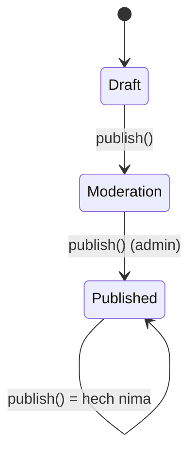
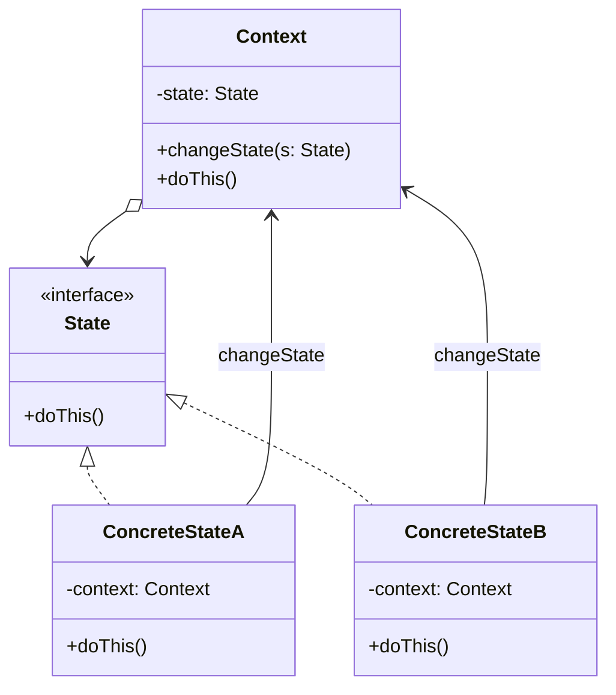

# State Pattern

> Boshqa nomi: **Состояние**

**State** — behavioral (xulq-atvoriy) pattern. U obyektlarga **o'z holatiga qarab xatti-harakatini o'zgartirish** imkonini beradi — tashqaridan xuddi obyektning class'i almashganday tuyuladi.

---

## STEP 1 — Umumiy tushuncha

### Muammo nima edi?

State pattern'ini **state machine (konechniy avtomat / FSM)** tushunchasidan ajratib bo'lmaydi. Asosiy g'oya: dastur (yoki obyekt) istalgan paytda **bir nechta holatdan bittasida** bo'ladi; holatlar to'plami va ular orasidagi **o'tishlar oldindan ma'lum va chekli**. Har holatda obyekt bir xil hodisaga **turlicha** javob beradi.

Masalan `Document` obyekti uch holatda bo'la oladi: `Draft`, `Moderation`, `Published`. `publish` metodi har holatda boshqacha ishlaydi: Draft'dan hujjatni moderatsiyaga yuboradi; Moderation'dan — nashr qiladi (lekin faqat chaqiruvchi admin bo'lsa); Published holatda — hech nima qilmaydi.

State machine odatda **shartli operatorlar** bilan yoziladi: joriy holat tekshiriladi, mos xatti-harakat bajariladi. Siz ham bilmagan holda kamida bitta shunday mashina yozgansiz:

```
switch (state):
  "draft":       state = "moderation"
  "moderation":  if admin: state = "published"
  "published":   // hech nima
```

Muammo `Document`ga yana o'nta holat qo'shilganda ko'rinadi: **har bir metod** holatlarni sanaydigan ulkan shartli operatorga aylanadi. O'tish logikasidagi kichik o'zgarish hamma metoddagi shartlarni qayta tekshirishga majbur qiladi. Holatlar loyiha rivojida asta qo'shilib borgani uchun, boshida sodda ko'ringan yechim keyin katta "makaron monstr"ga aylanadi.

### Pattern ishlatilmasa qanday muammolar bo'ladi?

| Muammo | Oqibat |
|--------|--------|
| Har metodda holatlar bo'yicha `switch/if` | Kod shishadi, o'qib bo'lmaydi |
| Bitta o'tish qoidasi o'zgarsa | Hamma metoddagi shartlarni qayta tekshirish |
| Bir holatga oid kod hamma metodga sochilgan | Holatni yaxlit ko'rib bo'lmaydi |
| Yangi holat qo'shish | Har metodga yangi shox — xato xavfi |

### Yechim nima?

State pattern'i **har bir holat uchun alohida class** yaratishni va holatga bog'liq xatti-harakatlarni o'sha class'larga ko'chirishni taklif qiladi.

Asl obyekt (**context** deyiladi) barcha holatlar kodini o'zida saqlamaydi — **joriy holat obyektiga havola** saqlab, holatga bog'liq ishni unga **delegatsiya qiladi**. Holat obyektlari umumiy interface'da bo'lgani uchun context konkret class'ga bog'lanmaydi; boshqa holat obyektini ulash bilan context xatti-harakati o'zgaradi.

Muhim nuans (Strategy'dan farqi): **context ham, konkret holatlar ham bir-birini bilishi va o'tishlarni boshlashi mumkin** — holat o'zi contextni keyingi holatga o'tkaza oladi.



### Hayotiy analogiya

Smartfoningiz **holatiga qarab** o'zini turlicha tutadi: qulfdan ochilgan bo'lsa — tugmalar amallarni bajaradi; qulflangan bo'lsa — istalgan tugma qulf ekraniga olib keladi; quvvat tugagan bo'lsa — faqat zaryad ekranini ko'rsatadi. Tugmalar o'sha-o'sha, xatti-harakat esa holatga bog'liq.

### Asosiy qoida

> **Har bir holat — alohida class: context joriy holat obyektiga ishni delegatsiya qiladi; holatning o'zi (yoki context) keyingi holatga o'tishni boshlaydi.**

### Struktura



1. **Context** — holat obyektiga havola saqlaydi va holatga bog'liq ishni unga delegatsiya qiladi; holatlar bilan umumiy interface orqali ishlaydi. Yangi holat o'rnatish metodi bo'lishi shart.
2. **State** — barcha konkret holatlar uchun umumiy interface.
3. **Concrete State'lar** — muayyan holatga bog'liq xatti-harakatlar. Ba'zan takror kodni umumlashtirish uchun holatlarning **o'z ierarxiyasi** ham quriladi. Holat context'ga **teskari havola** saqlashi mumkin — undan ma'lumot olish va **holatini almashtirish** uchun.
4. Keyingi holatni **kim tanlashini** context ham, konkret holatlar ham hal qilishi mumkin — o'tish uchun context'ga yangi holat obyekti beriladi.

---

## STEP 2 — Python misoli

### ❌ Yomon misol (pattern'siz)

```python
class Document:
    def __init__(self):
        self.state = "draft"

    def publish(self, user_role):
        # ❌ Har metodda shu switch takrorlanadi
        if self.state == "draft":
            self.state = "moderation"
        elif self.state == "moderation":
            if user_role == "admin":
                self.state = "published"
        elif self.state == "published":
            pass  # hech nima

    def render(self, user_role):
        # ❌ YANA o'sha holatlar ro'yxati...
        if self.state == "draft":
            ...
        elif self.state == "moderation":
            ...
        # 10 ta holat + 5 ta metod = 50 ta shox. Bitta o'tish
        # o'zgarsa — hammasini qayta tekshirasiz.
```

### ✅ State bilan

`t/Python/src/State/Conceptual` misoli (izohlar o'zbekchada):

```python
from __future__ import annotations
from abc import ABC, abstractmethod


class Context:
    """
    Context — client'larni qiziqtiruvchi interface'ni beradi hamda
    joriy holatni ifodalovchi State subclass nusxasiga havola saqlaydi.
    """

    _state = None

    def __init__(self, state: State) -> None:
        self.transition_to(state)

    def transition_to(self, state: State):
        # Context holat obyektini runtime'da almashtirish imkonini beradi.
        print(f"Context: Transition to {type(state).__name__}")
        self._state = state
        self._state.context = self

    # Context o'z xatti-harakatining bir qismini joriy
    # holat obyektiga delegatsiya qiladi.

    def request1(self):
        self._state.handle1()

    def request2(self):
        self._state.handle2()


class State(ABC):
    """
    Bazaviy State — barcha konkret holatlar bajarishi kerak bo'lgan
    metodlarni e'lon qiladi va context'ga TESKARI HAVOLA beradi.
    Holatlar bu havola orqali contextni BOSHQA holatga o'tkaza oladi.
    """

    @property
    def context(self) -> Context:
        return self._context

    @context.setter
    def context(self, context: Context) -> None:
        self._context = context

    @abstractmethod
    def handle1(self) -> None:
        pass

    @abstractmethod
    def handle2(self) -> None:
        pass


# Konkret holatlar context holatiga bog'liq xatti-harakatlarni
# har biri o'zicha implementatsiya qiladi.

class ConcreteStateA(State):
    def handle1(self) -> None:
        print("ConcreteStateA handles request1.")
        print("ConcreteStateA wants to change the state of the context.")
        # Holat O'ZI contextni keyingi holatga o'tkazyapti!
        self.context.transition_to(ConcreteStateB())

    def handle2(self) -> None:
        print("ConcreteStateA handles request2.")


class ConcreteStateB(State):
    def handle1(self) -> None:
        print("ConcreteStateB handles request1.")

    def handle2(self) -> None:
        print("ConcreteStateB handles request2.")
        print("ConcreteStateB wants to change the state of the context.")
        self.context.transition_to(ConcreteStateA())


if __name__ == "__main__":
    context = Context(ConcreteStateA())
    context.request1()
    context.request2()
```

**Output:**

```
Context: Transition to ConcreteStateA
ConcreteStateA handles request1.
ConcreteStateA wants to change the state of the context.
Context: Transition to ConcreteStateB
ConcreteStateB handles request2.
ConcreteStateB wants to change the state of the context.
Context: Transition to ConcreteStateA
```

**Nima yaxshilandi?** Har holat o'z class'ida — `switch`lar yo'qoldi; bir holatga oid butun xatti-harakat **bir joyda**; yangi holat = yangi class, mavjud metodlarga tegilmaydi; o'tishlarni holatning o'zi boshqaradi.

---

## STEP 3 — Go misoli

### ❌ Yomon misol (pattern'siz)

```go
package main

// ❌ Vending machine hamma amalda holatlarni switch bilan sanaydi
func (v *VendingMachine) requestItem() error {
	switch v.state {
	case "hasItem":
		if v.itemCount == 0 {
			v.state = "noItem"
			return fmt.Errorf("No item present")
		}
		v.state = "itemRequested"
	case "itemRequested":
		return fmt.Errorf("Item already requested")
	case "hasMoney":
		return fmt.Errorf("Item dispense in progress")
	case "noItem":
		return fmt.Errorf("Item out of stock")
	}
	return nil
}
// insertMoney, dispenseItem, addItem — HAR BIRIDA xuddi shunday
// switch. 4 amal × 4 holat = 16 shox bitta faylda!
```

### ✅ State bilan

`t/Go/state` misoli — savdo avtomati (vending machine): 4 holat, har biri alohida class (izohlar o'zbekchada):

```go
// state.go — State interface: har holat bajarishi kerak amallar
package main

type State interface {
	addItem(int) error
	requestItem() error
	insertMoney(money int) error
	dispenseItem() error
}
```

```go
// vendingMachine.go — Context: joriy holatga delegatsiya qiladi
package main

import "fmt"

type VendingMachine struct {
	// Barcha holat obyektlari oldindan yaratib qo'yiladi
	hasItem       State
	itemRequested State
	hasMoney      State
	noItem        State

	currentState State

	itemCount int
	itemPrice int
}

func newVendingMachine(itemCount, itemPrice int) *VendingMachine {
	v := &VendingMachine{
		itemCount: itemCount,
		itemPrice: itemPrice,
	}
	hasItemState := &HasItemState{
		vendingMachine: v,
	}
	itemRequestedState := &ItemRequestedState{
		vendingMachine: v,
	}
	hasMoneyState := &HasMoneyState{
		vendingMachine: v,
	}
	noItemState := &NoItemState{
		vendingMachine: v,
	}

	v.setState(hasItemState)
	v.hasItem = hasItemState
	v.itemRequested = itemRequestedState
	v.hasMoney = hasMoneyState
	v.noItem = noItemState
	return v
}

// Context amallarni JORIY HOLATGA delegatsiya qiladi — switch yo'q!
func (v *VendingMachine) requestItem() error {
	return v.currentState.requestItem()
}

func (v *VendingMachine) addItem(count int) error {
	return v.currentState.addItem(count)
}

func (v *VendingMachine) insertMoney(money int) error {
	return v.currentState.insertMoney(money)
}

func (v *VendingMachine) dispenseItem() error {
	return v.currentState.dispenseItem()
}

func (v *VendingMachine) setState(s State) {
	v.currentState = s
}

func (v *VendingMachine) incrementItemCount(count int) {
	fmt.Printf("Adding %d items\n", count)
	v.itemCount = v.itemCount + count
}
```

```go
// hasItemState.go — Holat 1: mahsulot bor
package main

import "fmt"

type HasItemState struct {
	vendingMachine *VendingMachine
}

func (i *HasItemState) requestItem() error {
	if i.vendingMachine.itemCount == 0 {
		// Holat O'ZI contextni boshqa holatga o'tkazadi
		i.vendingMachine.setState(i.vendingMachine.noItem)
		return fmt.Errorf("No item present")
	}
	fmt.Printf("Item requestd\n")
	i.vendingMachine.setState(i.vendingMachine.itemRequested)
	return nil
}

func (i *HasItemState) addItem(count int) error {
	fmt.Printf("%d items added\n", count)
	i.vendingMachine.incrementItemCount(count)
	return nil
}

func (i *HasItemState) insertMoney(money int) error {
	return fmt.Errorf("Please select item first")
}
func (i *HasItemState) dispenseItem() error {
	return fmt.Errorf("Please select item first")
}
```

```go
// itemRequestedState.go — Holat 2: mahsulot so'raldi
package main

import "fmt"

type ItemRequestedState struct {
	vendingMachine *VendingMachine
}

func (i *ItemRequestedState) requestItem() error {
	return fmt.Errorf("Item already requested")
}

func (i *ItemRequestedState) addItem(count int) error {
	return fmt.Errorf("Item Dispense in progress")
}

func (i *ItemRequestedState) insertMoney(money int) error {
	if money < i.vendingMachine.itemPrice {
		return fmt.Errorf("Inserted money is less. Please insert %d", i.vendingMachine.itemPrice)
	}
	fmt.Println("Money entered is ok")
	i.vendingMachine.setState(i.vendingMachine.hasMoney)
	return nil
}
func (i *ItemRequestedState) dispenseItem() error {
	return fmt.Errorf("Please insert money first")
}
```

```go
// hasMoneyState.go — Holat 3: pul kiritildi
package main

import "fmt"

type HasMoneyState struct {
	vendingMachine *VendingMachine
}

func (i *HasMoneyState) requestItem() error {
	return fmt.Errorf("Item dispense in progress")
}

func (i *HasMoneyState) addItem(count int) error {
	return fmt.Errorf("Item dispense in progress")
}

func (i *HasMoneyState) insertMoney(money int) error {
	return fmt.Errorf("Item out of stock")
}
func (i *HasMoneyState) dispenseItem() error {
	fmt.Println("Dispensing Item")
	i.vendingMachine.itemCount = i.vendingMachine.itemCount - 1
	if i.vendingMachine.itemCount == 0 {
		i.vendingMachine.setState(i.vendingMachine.noItem)
	} else {
		i.vendingMachine.setState(i.vendingMachine.hasItem)
	}
	return nil
}
```

```go
// noItemState.go — Holat 4: mahsulot tugagan
package main

import "fmt"

type NoItemState struct {
	vendingMachine *VendingMachine
}

func (i *NoItemState) requestItem() error {
	return fmt.Errorf("Item out of stock")
}

func (i *NoItemState) addItem(count int) error {
	i.vendingMachine.incrementItemCount(count)
	i.vendingMachine.setState(i.vendingMachine.hasItem)
	return nil
}

func (i *NoItemState) insertMoney(money int) error {
	return fmt.Errorf("Item out of stock")
}
func (i *NoItemState) dispenseItem() error {
	return fmt.Errorf("Item out of stock")
}
```

```go
// main.go — Client
package main

import (
	"fmt"
	"log"
)

func main() {
	vendingMachine := newVendingMachine(1, 10)

	err := vendingMachine.requestItem()
	if err != nil {
		log.Fatalf(err.Error())
	}

	err = vendingMachine.insertMoney(10)
	if err != nil {
		log.Fatalf(err.Error())
	}

	err = vendingMachine.dispenseItem()
	if err != nil {
		log.Fatalf(err.Error())
	}

	fmt.Println()

	err = vendingMachine.addItem(2)
	if err != nil {
		log.Fatalf(err.Error())
	}

	fmt.Println()

	err = vendingMachine.requestItem()
	if err != nil {
		log.Fatalf(err.Error())
	}

	err = vendingMachine.insertMoney(10)
	if err != nil {
		log.Fatalf(err.Error())
	}

	err = vendingMachine.dispenseItem()
	if err != nil {
		log.Fatalf(err.Error())
	}
}
```

**Output:**

```
Item requestd
Money entered is ok
Dispensing Item

Adding 2 items

Item requestd
Money entered is ok
Dispensing Item
```

**Nima yaxshilandi?**
- Har holat o'z faylida — "mahsulot so'ralganda nima bo'ladi" savoliga **bitta class** javob beradi;
- context (`VendingMachine`)da **bitta ham switch yo'q** — faqat delegatsiya;
- yangi holat (masalan, `MaintenanceState`) = yangi class, mavjudlar o'zgarmaydi;
- noto'g'ri amal (pulsiz mahsulot olish) har holatda tabiiy ravishda error qaytaradi.

---

## Qachon ishlatish kerak?

**1. Obyekt xatti-harakati ichki holatga qarab tubdan o'zgarsa, holat turlari ko'p bo'lsa va ularning kodi tez-tez o'zgarsa.**

Pattern muayyan holatlarga oid barcha maydon va metodlarni alohida class'larga chiqaradi: context holat obyektiga delegatsiya qiladi; holat almashtirish — boshqa obyektni ulash.

**2. Class kodida joriy maydon qiymatlariga qarab xatti-harakat tanlaydigan katta, o'xshash shartli operatorlar ko'p bo'lsa.**

Har shart shoxi → o'z class'i; shu class'ga holatga oid maydonlar ham ko'chadi.

**3. Shartli operatorlarga qurilgan jadval usulli state machine'ni ongli ishlatsangiz-u, o'xshash holatlar/o'tishlardagi kod takroriga chidashga majbur bo'lsangiz.**

State pattern'i **ierarxik state machine** qurish imkonini beradi: o'xshash holatlarni bitta ota-class'dan meros qilib, takror kodni o'sha yerga chiqarasiz.

---

## Implementatsiya qadamlari

1. **Context** rolini o'ynaydigan class'ni aniqlang: holatga bog'liq mavjud class yoki (holat kodi bir nechta class'ga sochilgan bo'lsa) yangi class.
2. **State interface**'ini yarating. Context'ning **hamma** metodini emas, faqat **holatga bog'liqlarini** ko'chiring.
3. Har faktik holat uchun interface'ni implementatsiya qiluvchi **class** yarating va holatga oid kodni ko'chiring. Ko'chirishda kod context'ning private a'zolariga bog'liq bo'lib chiqishi mumkin — chorasi: yo o'sha xatti-harakatni context'da qoldirib holatdan chaqirish, yo (til qo'llasa) holat class'larini context ichiga nested qilish.
4. Context'ga **holat obyekti maydoni** va uni o'zgartiruvchi **public metod** qo'shing.
5. Context metodlaridagi holatga bog'liq kodni **holat obyekti metodlari chaqiruviga** almashtiring.
6. Holatni almashtiruvchi kodni biznes-logikaga qarab **context ichida yoki konkret holatlar ichida** joylashtiring.

---

## Afzalliklar va kamchiliklar

| ✅ Afzalliklar | ❌ Kamchiliklar |
|---------------|----------------|
| State machine'ning katta shartli operatorlaridan qutqaradi | Holatlar kam va kamdan-kam o'zgarsa — kodni asossiz murakkablashtiradi |
| Bir holatga oid kodni bir joyga jamlaydi | |
| Context kodini soddalashtiradi | |

---

## Boshqa patternlar bilan aloqasi

- **Bridge, Strategy, State** (qisman Adapter) strukturasi o'xshash — hammasi kompozitsiya/delegatsiya. Lekin har biri **boshqa muammoni** yechadi.
- **State — Strategy'ning "kengaytmasi"** deb qarash mumkin: ikkalasi ham kompozitsiya orqali asosiy obyekt xatti-harakatini yordamchi obyektlarga delegatsiya qiladi. Farqi: **Strategy'da** obyektlar bir-birini **bilmaydi**; **State'da** konkret holatlar bir-birini bilib, **contextni o'zlari almashtira oladi**.

---

## Go'da real-world misollar

### Buyurtma hayotiy sikli (Order lifecycle)

```go
type OrderState interface {
    Pay() error
    Ship() error
    Cancel() error
}

// PendingState: Pay → Paid, Cancel → Cancelled, Ship → error
// PaidState:    Ship → Shipped, Cancel → Refunded
// ShippedState: Cancel → error ("jo'natilganini bekor qilib bo'lmaydi")

type Order struct {
    state OrderState
}

func (o *Order) Pay() error  { return o.state.Pay() }
func (o *Order) Ship() error { return o.state.Ship() }
// Noto'g'ri o'tishlar tabiiy ravishda error qaytaradi —
// biznes-qoidalar holat class'larida yashaydi.
```

### Svetofor

```go
type LightState interface {
    Next(*TrafficLight)
    Color() string
    Duration() time.Duration
}

// Red(30s) → Green(20s) → Yellow(5s) → Red...
// Har rang o'z class'ida, Next() keyingi holatni o'zi o'rnatadi.
```

Boshqa tanish misollar: TCP connection (LISTEN/ESTABLISHED/CLOSED), CI/CD pipeline bosqichlari, hujjat workflow'i (draft → review → approved), o'yin personaji (idle/running/jumping).

---

## Xulosa

### Eslab qol

- State = **holatlar bo'yicha switch'lar o'rniga holat-class'lar**; context faqat delegatsiya qiladi.
- Holatlar soni va o'tishlar **oldindan ma'lum va chekli** (FSM) bo'lgandagina qo'llang.
- Strategy'dan asosiy farqi: **holatlar bir-birini biladi** va o'tishlarni o'zi boshlaydi.
- Bir holatga oid hamma narsa (xatti-harakat + tegishli maydonlar) **bitta class'da** yashasin.
- 2-3 ta barqaror holat uchun pattern ortiqcha — oddiy `switch` yetadi.

### Amaliyot

1. `t/Go/state`'ga `MaintenanceState` qo'shing (texnik xizmatda hamma amal error qaytaradi) — nechta fayl o'zgardi? Yomon misolda-chi?
2. `main`da pulni kam kiriting (`insertMoney(5)`) — qaysi holat, qanday xabar qaytardi?
3. Python misolida `ConcreteStateC` qo'shib, B → C → A siklini qurib chiqing.
4. O'z loyihangizdagi "status" maydoni bo'yicha switch qilinadigan eng katta class'ni toping va uni holat diagrammasi (mermaid `stateDiagram`) bilan chizing.

---

## Keyingi qadam

→ [8. Strategy.md](8.%20Strategy.md)
