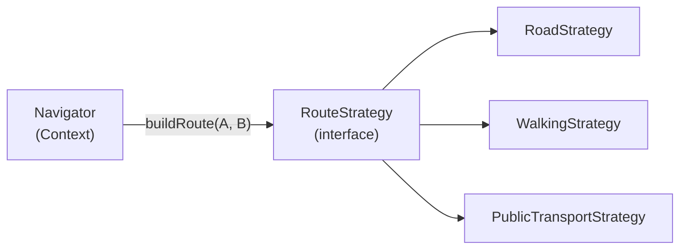
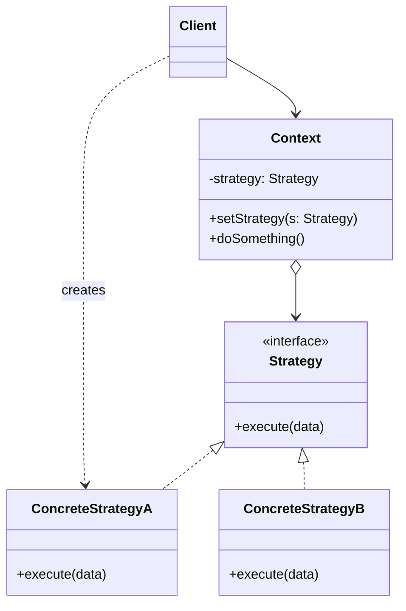

# Strategy Pattern

> Boshqa nomi: **Стратегия**

**Strategy** — behavioral (xulq-atvoriy) pattern. U **o'xshash algoritmlar oilasini** aniqlab, har birini **alohida class'ga** joylaydi — shundan so'ng algoritmlarni dastur ishlashi davomida (runtime'da) **almashtirish** mumkin bo'ladi.

---

## STEP 1 — Umumiy tushuncha

### Muammo nima edi?

Sayohatchilar uchun navigator ilovasini yozdingiz. Eng kerakli funksiya — **marshrut qurish**: foydalanuvchi boshlanish va tugash nuqtasini beradi, navigator optimal yo'lni chizadi.

- Birinchi versiya faqat **avtomobil** marshrutlarini qurardi.
- Keyin **piyoda** marshrutlar qo'shildi.
- Keyin **jamoat transporti**...
- Rejada esa **velosiped yo'laklari** va **diqqatga sazovor joylar** marshrutlari ham bor.

Ilova mashhur, lekin texnik tomoni bosh og'riq: har yangi algoritm bilan navigatorning **asosiy class'i ikki barobar** kattalashdi. Istalgan o'zgarish (bug fix ham, yangi algoritm ham) **butun class'ga** ta'sir qilib, ishlayotgan kodni sindirish xavfini tug'dirdi. Jamoada ishlash ham qiyinlashdi: yollangan dasturchilar bilan **bitta kod ustida to'qnashib**, merge konfliktlariga vaqt ketdi.

### Pattern ishlatilmasa qanday muammolar bo'ladi?

| Muammo | Oqibat |
|--------|--------|
| Barcha algoritm variantlari bitta class ichida | Ulkan class, navigatsiya qiyin |
| Bitta algoritmga o'zgarish | Butun class tahrirlanadi — xato xavfi |
| Jamoa bitta faylda ishlaydi | Doimiy merge konfliktlari |
| Algoritm `if/switch` bilan tanlanadi | Yangi algoritm = mavjud kodni o'zgartirish |

### Yechim nima?

Strategy pattern'i tez-tez o'zgaradigan yoki kengayadigan **o'xshash algoritmlarni alohida class'larga** — **strategy'larga** chiqarishni taklif qiladi.

Asl class endi algoritmni o'zi bajarmaydi — u **context** roliga o'tadi: strategy'lardan biriga havola saqlab, ish bajarishni **unga delegatsiya qiladi**. Algoritmni almashtirish = context'ga boshqa strategy obyektini berish.

Muhim shart: barcha strategy'lar **umumiy interface**'da bo'lsin. Shu interface orqali context konkret strategy class'laridan mustaqil bo'ladi; siz esa context'ga tegmasdan yangi algoritmlar qo'shasiz/o'zgartirasiz.

Navigator misolida: har bir yo'l qurish algoritmi o'z class'iga ko'chadi — hammasida bitta metod: *boshlanish + tugash nuqtasini oladi, marshrut nuqtalari massivini qaytaradi*. Navigator uchun qaysi algoritm tanlanganining farqi yo'q — uning ishi marshrutni **chizish**. UI'dagi tur almashtirgichlari uchun context'da strategy'ni almashtiruvchi metod bo'ladi.



### Hayotiy analogiya

Aeroportga yetib olishingiz kerak: **avtobus**, **taksi** yoki **velosiped** — bular strategiyalar. Qay birini tanlashingiz kontekstga bog'liq: pul qancha, parvozgacha vaqt qancha.

### Asosiy qoida

> **Bir ishning har xil bajarilish usullarini alohida class'larga chiqar; context faqat umumiy interface'ni bilsin — usul runtime'da almashtirilsin.**

### Struktura



1. **Context** — konkret strategy obyektiga havola saqlaydi, u bilan faqat umumiy interface orqali ishlaydi.
2. **Strategy** — algoritm variantlari uchun umumiy interface; context algoritmni shu orqali chaqiradi.
3. **Concrete Strategy'lar** — algoritmning turli variatsiyalari.
4. Context client'dan chaqiriq olib, ishni joriy strategy obyektiga **delegatsiya qiladi**; qaysi strategy ekanini bilmaydi.
5. **Client** konkret strategy'ni yaratib context'ga (constructor va keyin setter orqali) beradi — strategiya tanlash mas'uliyati client'da.

---

## STEP 2 — Python misoli

### ❌ Yomon misol (pattern'siz)

```python
class Context:
    def do_some_business_logic(self, data, mode):
        # ❌ Algoritm varianti shartli operator bilan tanlanadi
        if mode == "normal":
            result = sorted(data)
        elif mode == "reverse":
            result = reversed(sorted(data))
        elif mode == "shuffle":
            ...
        # Yangi usul = shu metodga yana bir shox (OCP buzildi).
        # Algoritm kodi, ma'lumotlari, bog'liqliklari — hammasi
        # Context ichiga qulflanib qoladi. Alohida test qilib bo'lmaydi.
        print(",".join(result))
```

### ✅ Strategy bilan

`t/Python/src/Strategy/Conceptual` misoli (izohlar o'zbekchada):

```python
from __future__ import annotations
from abc import ABC, abstractmethod
from typing import List


class Context():
    """
    Context — client'larni qiziqtiruvchi interface'ni beradi.
    """

    def __init__(self, strategy: Strategy) -> None:
        # Odatda Context strategy'ni constructor orqali oladi,
        # runtime'da almashtirish uchun esa setter ham beradi.
        self._strategy = strategy

    @property
    def strategy(self) -> Strategy:
        # Context Strategy obyektlaridan biriga havola saqlaydi va
        # uning KONKRET class'ini bilmaydi — hamma strategy bilan
        # umumiy interface orqali ishlaydi.
        return self._strategy

    @strategy.setter
    def strategy(self, strategy: Strategy) -> None:
        # Strategy'ni ish vaqtida almashtirish imkoni.
        self._strategy = strategy

    def do_some_business_logic(self) -> None:
        # Algoritmning ko'p versiyasini o'zi bajarish o'rniga,
        # Context ishni strategy obyektiga delegatsiya qiladi.
        print("Context: Sorting data using the strategy (not sure how it'll do it)")
        result = self._strategy.do_algorithm(["a", "b", "c", "d", "e"])
        print(",".join(result))


class Strategy(ABC):
    """
    Strategy interface'i — algoritmning barcha versiyalari uchun
    umumiy operatsiya. Context algoritmni shu orqali chaqiradi.
    """

    @abstractmethod
    def do_algorithm(self, data: List):
        pass


# Konkret strategy'lar algoritmni bazaviy interface'ga rioya qilgan
# holda implementatsiya qiladi — shu ularni Context'da
# almashtiriladigan qiladi.

class ConcreteStrategyA(Strategy):
    def do_algorithm(self, data: List) -> List:
        return sorted(data)


class ConcreteStrategyB(Strategy):
    def do_algorithm(self, data: List) -> List:
        return reversed(sorted(data))


if __name__ == "__main__":
    # Client konkret strategy'ni tanlab context'ga beradi. To'g'ri
    # tanlov qilish uchun client strategiyalar farqini bilishi kerak.

    context = Context(ConcreteStrategyA())
    print("Client: Strategy is set to normal sorting.")
    context.do_some_business_logic()
    print()

    print("Client: Strategy is set to reverse sorting.")
    context.strategy = ConcreteStrategyB()
    context.do_some_business_logic()
```

**Output:**

```
Client: Strategy is set to normal sorting.
Context: Sorting data using the strategy (not sure how it'll do it)
a,b,c,d,e

Client: Strategy is set to reverse sorting.
Context: Sorting data using the strategy (not sure how it'll do it)
e,d,c,b,a
```

**Nima yaxshilandi?** Algoritmlar mustaqil class'larda (alohida test qilinadi); context ularning ichini bilmaydi; almashtirish — **bitta satr** (`context.strategy = ...`); yangi algoritm mavjud kodga tegmaydi.

---

## STEP 3 — Go misoli

### ❌ Yomon misol (pattern'siz)

```go
package main

// ❌ Eviction algoritmi cache ichiga "tikilgan"
type Cache struct {
	storage     map[string]string
	evictionAlg string // "fifo" | "lru" | "lfu"
}

func (c *Cache) evict() {
	// Har yangi algoritm = shu switch'ga yangi shox
	switch c.evictionAlg {
	case "fifo":
		fmt.Println("Evicting by fifo strtegy")
	case "lru":
		fmt.Println("Evicting by lru strtegy")
	case "lfu":
		fmt.Println("Evicting by lfu strtegy")
	}
	// Algoritm kodi kattalashsa — Cache class'i "yutib yuboradi".
	// ARC algoritmini qo'shish uchun Cache KODINI o'zgartirasiz.
}
```

### ✅ Strategy bilan

`t/Go/strategy` misoli — in-memory cache: to'lib qolganda qaysi elementni chiqarish (evict) algoritmi almashtiriladi (izohlar o'zbekchada):

```go
// evictionAlgo.go — Strategy interface
package main

type EvictionAlgo interface {
	evict(c *Cache)
}
```

```go
// fifo.go — Concrete Strategy 1
package main

import "fmt"

type Fifo struct {
}

func (l *Fifo) evict(c *Cache) {
	fmt.Println("Evicting by fifo strtegy")
}
```

```go
// lru.go — Concrete Strategy 2
package main

import "fmt"

type Lru struct {
}

func (l *Lru) evict(c *Cache) {
	fmt.Println("Evicting by lru strtegy")
}
```

```go
// lfu.go — Concrete Strategy 3
package main

import "fmt"

type Lfu struct {
}

func (l *Lfu) evict(c *Cache) {
	fmt.Println("Evicting by lfu strtegy")
}
```

```go
// cache.go — Context: eviction'ni strategy'ga delegatsiya qiladi
package main

type Cache struct {
	storage      map[string]string
	evictionAlgo EvictionAlgo
	capacity     int
	maxCapacity  int
}

func initCache(e EvictionAlgo) *Cache {
	storage := make(map[string]string)
	return &Cache{
		storage:      storage,
		evictionAlgo: e,
		capacity:     0,
		maxCapacity:  2,
	}
}

// Strategy'ni runtime'da almashtirish
func (c *Cache) setEvictionAlgo(e EvictionAlgo) {
	c.evictionAlgo = e
}

func (c *Cache) add(key, value string) {
	if c.capacity == c.maxCapacity {
		c.evict()
	}
	c.capacity++
	c.storage[key] = value
}

func (c *Cache) get(key string) {
	delete(c.storage, key)
}

func (c *Cache) evict() {
	c.evictionAlgo.evict(c) // delegatsiya — switch yo'q!
	c.capacity--
}
```

```go
// main.go — Client: strategiyani tanlaydi va almashtiradi
package main

func main() {
	lfu := &Lfu{}
	cache := initCache(lfu)

	cache.add("a", "1")
	cache.add("b", "2")

	cache.add("c", "3") // to'ldi — LFU bo'yicha evict

	lru := &Lru{}
	cache.setEvictionAlgo(lru) // runtime'da almashtirish!

	cache.add("d", "4") // endi LRU bo'yicha evict

	fifo := &Fifo{}
	cache.setEvictionAlgo(fifo)

	cache.add("e", "5") // endi FIFO bo'yicha

}
```

**Output:**

```
Evicting by lfu strtegy
Evicting by lru strtegy
Evicting by fifo strtegy
```

**Nima yaxshilandi?**
- `Cache` eviction algoritmlarini **bilmaydi** — faqat `EvictionAlgo` interface'ini;
- algoritm **ish vaqtida** almashtirildi (lfu → lru → fifo) — cache qayta yaratilmadi;
- yangi algoritm (ARC, Random...) = yangi struct, `Cache` o'zgarmaydi.

---

## Qachon ishlatish kerak?

**1. Bitta obyekt ichida algoritmning turli variatsiyalarini ishlatish kerak bo'lsa.**

Strategy obyekt xatti-harakatini runtime'da turli xatti-harakat obyektlarini ulash orqali o'zgartiradi (masalan, tezlik/xotira balansi har xil algoritmlar).

**2. Faqat qaysidir xatti-harakati bilan farq qiluvchi o'xshash class'lar ko'p bo'lsa.**

Farq qiluvchi xatti-harakat alohida ierarxiyaga chiqariladi, asl class'lar esa **bittaga** birlashtirilib, sozlanadigan qilinadi.

**3. Algoritm implementatsiya tafsilotlarini boshqa class'lardan yashirmoqchi bo'lsangiz.**

Algoritm kodi, ma'lumotlari va bog'liqliklari strategy class'lari ichida izolyatsiya qilinadi.

**4. Algoritm variatsiyalari katta shartli operator shoxlarida yotgan bo'lsa.**

Har shox o'z strategy class'iga ko'chadi; context client bergan strategy'ga ishni delegatsiya qiladi.

---

## Implementatsiya qadamlari

1. Tez-tez o'zgaruvchi yoki runtime'da tanlanadigan **algoritmni** aniqlang.
2. Algoritmning barcha variantlari uchun umumiy bo'lgan **strategy interface**'ini yarating.
3. Variatsiyalarni shu interface'ni implementatsiya qiluvchi **o'z class'lariga** chiqaring.
4. Context'da joriy strategy'ga **havola maydoni** va uni **almashtirish metodi** bo'lsin; context strategy bilan faqat umumiy interface orqali ishlashiga ishonch hosil qiling.
5. **Client'lar** kerakli xatti-harakat uchun mos strategy obyektini context'ga bersin.

---

## Afzalliklar va kamchiliklar

| ✅ Afzalliklar | ❌ Kamchiliklar |
|---------------|----------------|
| Algoritmlarni **runtime'da** "issiq" almashtirish | Qo'shimcha class'lar hisobiga dastur murakkablashadi |
| Algoritm kodi/ma'lumotlarini boshqa class'lardan izolyatsiya qiladi | Client to'g'ri tanlash uchun **strategiyalar farqini bilishi** kerak |
| Inheritance o'rniga delegatsiya | Algoritmlar kam va barqaror bo'lsa — ortiqcha (Go'da oddiy funksiya-parametr ko'pincha yetadi) |
| Open/Closed: yangi strategy mavjud kodga tegmaydi | |

---

## Boshqa patternlar bilan aloqasi

- **Bridge, Strategy, State** (qisman Adapter) strukturasi o'xshash — kompozitsiya + delegatsiya; lekin **har xil muammo** yechadi.
- **Command va Strategy**: Command **har xil amallarni** obyektga aylantiradi (log, tarix, uzatish uchun); Strategy **bitta amalning har xil usullarini** almashtirish uchun.
- **Strategy** obyekt xatti-harakatini **"ichidan"** o'zgartiradi; **Decorator** — **"tashqaridan"** kengaytiradi.
- **Template Method** inheritance'ga qurilgan (class darajasida, statik); **Strategy** delegatsiyaga (obyekt darajasida, runtime'da almashadi).
- **State — Strategy'ning kengaytmasi**: Strategy'da strategiyalar bir-birini bilmaydi; State'da holatlar contextni o'zi almashtira oladi.

---

## Go'da real-world misollar

### To'lov usullari

```go
type PaymentStrategy interface {
    Pay(amount float64, currency string) (string, error)
}

// CreditCardPayment, PayPalPayment, CryptoPayment...

type ShoppingCart struct {
    items   []Item
    payment PaymentStrategy
}

func (sc *ShoppingCart) SetPayment(strategy PaymentStrategy) {
    sc.payment = strategy
}

func (sc *ShoppingCart) Checkout() (string, error) {
    total := sc.total()
    if sc.payment == nil {
        return "", fmt.Errorf("to'lov usuli tanlanmagan")
    }
    return sc.payment.Pay(total, "USD") // delegatsiya
}
```

### Go idiomasi: strategy = funksiya

Strategiya bitta metodli bo'lsa, Go'da ko'pincha class o'rniga **funksiya turi** yetadi:

```go
type CompressFunc func(data []byte) ([]byte, error)

func NewArchiver(compress CompressFunc) *Archiver { ... }

// standart library'da xuddi shu g'oya:
sort.Slice(users, func(i, j int) bool { // taqqoslash strategiyasi
    return users[i].Age < users[j].Age
})
```

Boshqa tanish misollar: siqish formatlari (gzip/zip/lz4), routing algoritmlari, load balancer strategiyalari (round-robin/least-conn), retry/backoff siyosatlari.

---

## Xulosa

### Eslab qol

- Strategy = **bir ish, ko'p usul**: usullar alohida class'larda, context faqat interface'ni biladi.
- Almashtirish **runtime'da**, bitta setter bilan — `switch` va qayta kompilyatsiya yo'q.
- **Client tanlaydi** — demak client strategiyalar farqini bilishi kerak (bu narx!).
- State bilan adashtirmang: strategiyalar **bir-biridan bexabar**, holatlar esa o'tishlarni o'zi qiladi.
- Go'da yagona metodli strategiyani ko'pincha **funksiya** sifatida berish idiomatikroq.

### Amaliyot

1. `t/Go/strategy`'ga `Arc` (Adaptive Replacement Cache) strategiyasini qo'shing — `Cache` kodi o'zgardimi?
2. Yomon misoldagi switch variantiga xuddi shu ARC'ni qo'shib, farqni ko'ring.
3. Python misolida `ConcreteStrategyC` (tasodifiy aralashtirish — `random.shuffle`) yozing.
4. `EvictionAlgo`'ni Go funksiya turi (`type EvictionFunc func(c *Cache)`) bilan qayta yozing — qaysi variant qachon qulay?

---

## Keyingi qadam

→ [9. Template Method.md](9.%20Template%20Method.md)
