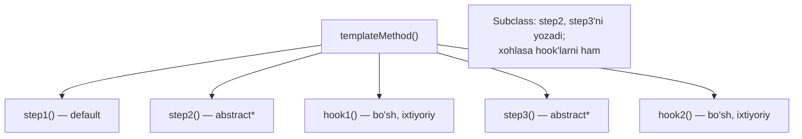
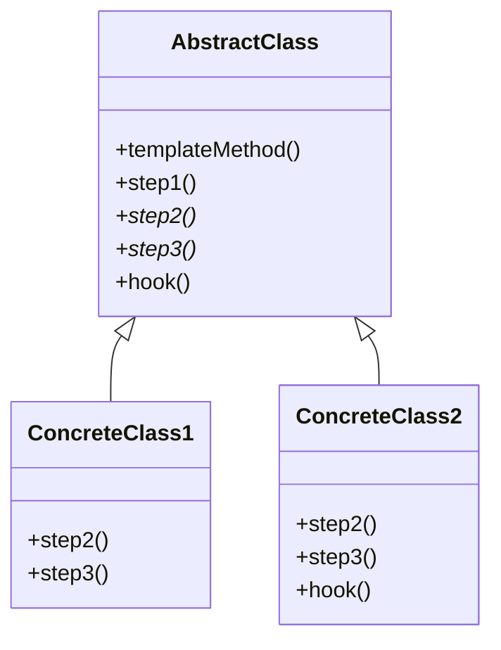

# Template Method Pattern

> Boshqa nomi: **Шаблонный метод**

**Template Method** — behavioral (xulq-atvoriy) pattern. U **algoritm skeletini** belgilab, ayrim qadamlar mas'uliyatini **subclass'larga** yuklaydi. Subclass'lar algoritm qadamlarini uning **umumiy strukturasini o'zgartirmasdan** qayta belgilashi mumkin.

---

## STEP 1 — Umumiy tushuncha

### Muammo nima edi?

Ofis hujjatlaridan ma'lumot qazib oluvchi (data mining) dastur yozyapsiz: foydalanuvchi turli formatdagi hujjatlar (PDF, DOC, CSV) yuklaydi, dastur ulardan foydali ma'lumot ajratadi.

- Birinchi versiya faqat **DOC** bilan ishladi.
- Keyingisida **CSV** qo'shildi.
- Bir oydan keyin **PDF**...

Bir kuni sezdingiz: uchala class fayl bilan ishlash qismida farq qilsa-da, **ma'lumot ajratish qismida juda ko'p umumiy kod** bor. Bu algoritmni har class'da qayta yozishdan qutulsa qanday yaxshi bo'lardi!

Bundan tashqari, bu obyektlarni ishlatuvchi qolgan kod ham ish boshlashdan oldin **handler turini tekshiruvchi shartlarga** to'la — uchala class umumiy interface'ga keltirilsa, bu kod ham soddalashadi.

### Pattern ishlatilmasa qanday muammolar bo'ladi?

| Muammo | Oqibat |
|--------|--------|
| Har format o'z class'ida to'liq algoritmni takrorlaydi | Umumiy qadamlar 3 joyda dublikat |
| Umumiy qadamga o'zgarish | 3 ta class'ni sinxron tahrirlash |
| Client handler turini tekshiradi | `if/switch`li kod |
| Algoritm tartibi har class'da o'zicha | Tartib buzilishi xavfi |

### Yechim nima?

Template Method algoritmni **qadamlar ketma-ketligiga** bo'lib, har qadamni alohida metodda tavsiflashni va ularni bitta **template method** ichida birin-ketin chaqirishni taklif qiladi. Subclass'lar ayrim qadamlarni override qiladi, lekin **skelet (template method'ning o'zi) daxlsiz** qoladi.

Data mining misolida: uchala algoritm uchun **umumiy bazaviy class** yaratamiz; unda hujjatni qayta ishlash qadamlarini ketma-ket chaqiruvchi template method bo'ladi. Avval qadamlarni `abstract` qilamiz — har subclass o'zicha bajaradi. Keyin **hamma uchun bir xil** kodni (ma'lumotni tahlil qilish qismi) superclass'ga ko'taramiz — fayl ochish/o'qish/yopish esa formatga qarab subclass'larda qoladi.

Natijada qadamlarning **uch turi** bor:

1. **abstract qadamlar** — har subclass **majburiy** implementatsiya qiladi;
2. **default implementatsiyali qadamlar** — xohlagan subclass override qiladi;
3. **hook'lar** — tanasi bo'sh, ixtiyoriy qadamlar: template method ularsiz ham ishlaydi, lekin subclass'larga algoritmning muhim nuqtalariga "qo'shimcha ulanish" imkonini beradi (odatda asosiy qadamlar orasiga, oldiga va keyiniga qo'yiladi).



### Hayotiy analogiya

**Tipovoy uy qurilishi**: asosiy arxitektura loyihasida qadamlar yozilgan — poydevor, devorlar, tom, oynalar. Har bosqich standartlashgan bo'lsa-da, quruvchilar mijoz xohishiga ko'ra **istalgan bosqichga kichik o'zgartirish** kiritib, uyni boshqalardan ozgina farqli qila oladi. Qadamlar tartibi esa o'zgarmaydi.

### Asosiy qoida

> **Algoritm skeleti (qadamlar tartibi) bazaviy class'da bir marta yozilsin; farq qiluvchi qadamlarnigina subclass'lar to'ldirsin — skelet daxlsiz.**

### Struktura



1. **Abstract Class** — algoritm qadamlarini va ularni chaqiruvchi **template method**'ni belgilaydi. Qadamlar abstract bo'lishi ham, default implementatsiyaga ega bo'lishi ham mumkin.
2. **Concrete Class** — ayrim (yoki barcha) qadamlarni override qiladi, lekin **template method'ning o'zini emas**.

---

## STEP 2 — Python misoli

### ❌ Yomon misol (pattern'siz)

```python
class CSVProcessor:
    def process(self):
        print("Umumiy ish: faylni tekshirish")   # ❌ dublikat
        print("CSV: parse qilish")               # farq qiluvchi qism
        print("Umumiy ish: natijani saqlash")    # ❌ dublikat


class JSONProcessor:
    def process(self):
        print("Umumiy ish: faylni tekshirish")   # ❌ YANA o'sha kod
        print("JSON: parse qilish")
        print("Umumiy ish: natijani saqlash")    # ❌ YANA o'sha kod
        # Dasturchi saqlashdan oldin log qadamini unutdi —
        # tartib har class'da qo'lda saqlanadi, kafolat yo'q!
```

### ✅ Template Method bilan

`t/Python/src/TemplateMethod/Conceptual` misoli (izohlar o'zbekchada):

```python
from abc import ABC, abstractmethod


class AbstractClass(ABC):
    """
    Abstract Class template method'ni — algoritm skeletini —
    belgilaydi. Skelet (odatda abstract) primitiv operatsiyalar
    chaqiruvlaridan iborat. Konkret subclass'lar operatsiyalarni
    implementatsiya qiladi, lekin template method'ning O'ZIGA tegmaydi.
    """

    def template_method(self) -> None:
        """Template method — algoritm skeletini belgilaydi."""

        self.base_operation1()
        self.required_operations1()
        self.base_operation2()
        self.hook1()
        self.required_operations2()
        self.base_operation3()
        self.hook2()

    # Bu operatsiyalar allaqachon implementatsiyaga ega.

    def base_operation1(self) -> None:
        print("AbstractClass says: I am doing the bulk of the work")

    def base_operation2(self) -> None:
        print("AbstractClass says: But I let subclasses override some operations")

    def base_operation3(self) -> None:
        print("AbstractClass says: But I am doing the bulk of the work anyway")

    # Bularni esa subclass'lar implementatsiya qilishi SHART.

    @abstractmethod
    def required_operations1(self) -> None:
        pass

    @abstractmethod
    def required_operations2(self) -> None:
        pass

    # Bular — "hook"lar. Subclass'lar override qilishi mumkin, lekin
    # majburiy emas: hook'larda standart (bo'sh) implementatsiya bor.
    # Hook'lar algoritmning muhim joylarida QO'SHIMCHA kengaytirish
    # nuqtalarini beradi.

    def hook1(self) -> None:
        pass

    def hook2(self) -> None:
        pass


class ConcreteClass1(AbstractClass):
    """
    Konkret class'lar bazaviy class'ning barcha abstract
    operatsiyalarini implementatsiya qilishi shart. Default
    implementatsiyali operatsiyalarni ham override qilishi mumkin.
    """

    def required_operations1(self) -> None:
        print("ConcreteClass1 says: Implemented Operation1")

    def required_operations2(self) -> None:
        print("ConcreteClass1 says: Implemented Operation2")


class ConcreteClass2(AbstractClass):
    """
    Odatda konkret class'lar operatsiyalarning faqat BIR QISMINI
    override qiladi.
    """

    def required_operations1(self) -> None:
        print("ConcreteClass2 says: Implemented Operation1")

    def required_operations2(self) -> None:
        print("ConcreteClass2 says: Implemented Operation2")

    def hook1(self) -> None:
        print("ConcreteClass2 says: Overridden Hook1")


def client_code(abstract_class: AbstractClass) -> None:
    # Client algoritmni ishga tushirish uchun template method'ni
    # chaqiradi — obyektning konkret class'ini bilishi shart emas.
    abstract_class.template_method()


if __name__ == "__main__":
    print("Same client code can work with different subclasses:")
    client_code(ConcreteClass1())
    print("")

    print("Same client code can work with different subclasses:")
    client_code(ConcreteClass2())
```

**Output:**

```
Same client code can work with different subclasses:
AbstractClass says: I am doing the bulk of the work
ConcreteClass1 says: Implemented Operation1
AbstractClass says: But I let subclasses override some operations
ConcreteClass1 says: Implemented Operation2
AbstractClass says: But I am doing the bulk of the work anyway

Same client code can work with different subclasses:
AbstractClass says: I am doing the bulk of the work
ConcreteClass2 says: Implemented Operation1
AbstractClass says: But I let subclasses override some operations
ConcreteClass2 says: Overridden Hook1
ConcreteClass2 says: Implemented Operation2
AbstractClass says: But I am doing the bulk of the work anyway
```

**Nima yaxshilandi?** Umumiy qadamlar **bir marta** (bazaviy class'da) yozilgan; tartib kafolatlangan; subclass faqat farq qiluvchi qadamlarni yozadi; `ConcreteClass2` hook orqali qo'shimcha nuqtaga "ulanib" oldi.

---

## STEP 3 — Go misoli

> ⚠️ **Go xususiyati:** Go'da inheritance yo'q — klassik "subclass override qiladi" ishlamaydi. Shuning uchun Go'da skelet-struct **qadamlar interface'iga** havola saqlaydi va template method qadamlarni shu interface orqali chaqiradi (kompozitsiya).

### ❌ Yomon misol (pattern'siz)

```go
package main

// ❌ Har OTP turi butun jarayonni O'ZI takrorlaydi
type SmsOtp struct{}

func (s *SmsOtp) genAndSend() {
	otp := "1234"
	fmt.Println("SMS: generating random otp", otp) // farqli qadam
	fmt.Println("SMS: saving otp to cache")        // farqli qadam
	msg := "SMS OTP for login is " + otp
	fmt.Println("SMS: sending sms:", msg)
}

type EmailOtp struct{}

func (e *EmailOtp) genAndSend() {
	// ❌ Jarayon skeleti QAYTA yozildi; dasturchi cache
	// qadamini unutib qoldirdi — hech kim sezmaydi:
	otp := "1234"
	fmt.Println("EMAIL: generating random otp", otp)
	msg := "EMAIL OTP for login is " + otp
	fmt.Println("EMAIL: sending email:", msg)
}
```

### ✅ Template Method bilan

`t/Go/template` misoli — OTP yuborish: jarayon skeleti (yaratish → cache'lash → xabar tuzish → yuborish) bitta joyda, qadamlar SMS/Email uchun har xil (izohlar o'zbekchada):

```go
// otp.go — qadamlar interface'i + skelet
package main

type IOtp interface {
	genRandomOTP(int) string
	saveOTPCache(string)
	getMessage(string) string
	sendNotification(string) error
}

type Otp struct {
	iOtp IOtp
}

// TEMPLATE METHOD: qadamlar tartibi SHU YERDA, bir marta.
// Qadamlarning o'zi esa iOtp implementatsiyasiga qarab farq qiladi.
func (o *Otp) genAndSendOTP(otpLength int) error {
	otp := o.iOtp.genRandomOTP(otpLength)
	o.iOtp.saveOTPCache(otp)
	message := o.iOtp.getMessage(otp)
	err := o.iOtp.sendNotification(message)
	if err != nil {
		return err
	}
	return nil
}
```

```go
// sms.go — qadamlarning SMS varianti
package main

import "fmt"

type Sms struct {
	Otp
}

func (s *Sms) genRandomOTP(len int) string {
	randomOTP := "1234"
	fmt.Printf("SMS: generating random otp %s\n", randomOTP)
	return randomOTP
}

func (s *Sms) saveOTPCache(otp string) {
	fmt.Printf("SMS: saving otp: %s to cache\n", otp)
}

func (s *Sms) getMessage(otp string) string {
	return "SMS OTP for login is " + otp
}

func (s *Sms) sendNotification(message string) error {
	fmt.Printf("SMS: sending sms: %s\n", message)
	return nil
}
```

```go
// email.go — qadamlarning Email varianti
package main

import "fmt"

type Email struct {
	Otp
}

func (s *Email) genRandomOTP(len int) string {
	randomOTP := "1234"
	fmt.Printf("EMAIL: generating random otp %s\n", randomOTP)
	return randomOTP
}

func (s *Email) saveOTPCache(otp string) {
	fmt.Printf("EMAIL: saving otp: %s to cache\n", otp)
}

func (s *Email) getMessage(otp string) string {
	return "EMAIL OTP for login is " + otp
}

func (s *Email) sendNotification(message string) error {
	fmt.Printf("EMAIL: sending email: %s\n", message)
	return nil
}
```

```go
// main.go — Client: skelet bitta, qadamlar to'plami almashadi
package main

import "fmt"

func main() {
	smsOTP := &Sms{}
	o := Otp{
		iOtp: smsOTP,
	}
	o.genAndSendOTP(4)

	fmt.Println("")
	emailOTP := &Email{}
	o = Otp{
		iOtp: emailOTP,
	}
	o.genAndSendOTP(4)

}
```

**Output:**

```
SMS: generating random otp 1234
SMS: saving otp: 1234 to cache
SMS: sending sms: SMS OTP for login is 1234

EMAIL: generating random otp 1234
EMAIL: saving otp: 1234 to cache
EMAIL: sending email: EMAIL OTP for login is 1234
```

**Nima yaxshilandi?**
- Jarayon tartibi **faqat** `genAndSendOTP`da — qadam unutish yoki tartib buzish imkonsiz;
- yangi kanal (Telegram) = faqat 4 qadamni implementatsiya qiluvchi yangi struct;
- skeletga qadam qo'shilsa (masalan, rate-limit tekshiruvi) — **bitta joy** o'zgaradi.

---

## Qachon ishlatish kerak?

**1. Subclass'lar bazaviy algoritmni uning strukturasini o'zgartirmasdan kengaytirishi kerak bo'lsa.**

Template Method algoritmning ma'lum qadamlarinigina inheritance orqali kengaytirish imkonini beradi — skelet bazaviy class'da qoladi.

**2. Deyarli bir xil ishni ozgina farq bilan qiladigan bir nechta class bo'lsa** (birini tahrirlasangiz, qolganini ham tahrirlashga majbursiz).

Ular uchun umumiy superclass yaratib, asosiy algoritmni qadamlar ko'rinishida rasmiylashtiring — farq qiluvchi qadamlar subclass'larda override qilinadi. Bu o'xshash class'lardagi kod dublikatini yo'qotadi.

---

## Implementatsiya qadamlari

1. Algoritmni o'rganib, **qadamlarga bo'lish** mumkinligini tekshiring: qaysi qadamlar barcha variatsiyalar uchun standart, qaysilari o'zgaruvchan?
2. **Abstract bazaviy class** yaratib, unda qadamlar chaqiruvlaridan iborat **template method**'ni belgilang. Til imkon bersa, uni `final` qiling — subclass'lar override qilolmasin.
3. Har qadam uchun metod qo'shing: **abstract** (hamma subclass yozishi shart) yoki **default implementatsiyali** (faqat farq qilsa override qilinadi).
4. **Hook'lar** kiritishni o'ylang — odatda asosiy qadamlar orasiga hamda hammasidan oldin/keyin.
5. **Konkret class'larni** bazaviy class'dan hosil qilib, yetishmayotgan qadamlar va hook'larni implementatsiya qiling.

---

## Afzalliklar va kamchiliklar

| ✅ Afzalliklar | ❌ Kamchiliklar |
|---------------|----------------|
| Kod qayta ishlatilishini osonlashtiradi (umumiy qadamlar bir joyda) | Mavjud algoritm skeleti bilan **qattiq cheklangansiz** |
| Qadamlar tartibi kafolatlangan | Qadamning bazaviy xatti-harakatini subclass'da o'zgartirib, **Liskov substitution** printsipini buzish mumkin |
| Client turli subclass'lar bilan bir xil ishlaydi | Qadamlar ko'paygani sari skeletni qo'llab-quvvatlash qiyinlashadi |

---

## Boshqa patternlar bilan aloqasi

- **Factory Method — Template Method'ning xususiy holati** deb qarash mumkin; ko'pincha katta Template Method'li class'ning bir qadami bo'lib keladi.
- **Template Method vs Strategy**: Template Method **inheritance** bilan algoritm qismlarini kengaytiradi va **class darajasida** (statik) ishlaydi; Strategy **delegatsiya** bilan butun algoritmni almashtirib, **obyekt darajasida** (runtime'da) ishlaydi.

---

## Go'da real-world misollar

### ETL pipeline (interface qadamlar bilan)

```go
type DataProcessor interface {
    Parse(data string) ([]map[string]string, error)
    Validate(record map[string]string) error
    Transform(record map[string]string) map[string]string
}

type ETLPipeline struct {
    processor DataProcessor
}

// Template method — o'zgarmas skelet
func (e *ETLPipeline) Process(data string) ([]map[string]string, error) {
    records, err := e.processor.Parse(data) // farqli qadam
    if err != nil {
        return nil, fmt.Errorf("parse xatosi: %w", err)
    }

    var results []map[string]string
    for _, record := range records {
        if err := e.processor.Validate(record); err != nil { // farqli qadam
            continue
        }
        results = append(results, e.processor.Transform(record)) // farqli qadam
    }
    return results, nil
}

// CSVProcessor, JSONProcessor — faqat 3 qadamni yozadi,
// sikl va xato boshqaruvi skeletda.
```

### Go idiomasi: qadam = funksiya-parametr

```go
type Report struct {
    title string
    data  []string
}

// Skelet: validatsiya + saralash umumiy, format o'zgaruvchan qadam
func (r *Report) Generate(format func(title string, data []string) string) string {
    r.validate()
    r.sort()
    return format(r.title, r.data)
}

// report.Generate(HTMLFormat)
// report.Generate(MarkdownFormat)
```

Boshqa tanish misollar: `sort.Interface` (`Len/Less/Swap` — qadamlar, saralash algoritmi — skelet), test framework'laridagi setup → test → teardown, HTTP handler'lardagi auth → authorize → handle ketma-ketligi.

---

## Xulosa

### Eslab qol

- Template Method = **skelet bazada, qadamlar subclass'larda**; skeletning o'zi override qilinmaydi.
- Qadamlarning 3 turi: **abstract** (majburiy), **default** (ixtiyoriy override), **hook** (bo'sh, qo'shimcha nuqta).
- Go'da inheritance yo'q — skelet-struct **qadamlar interface'ini** saqlaydi yoki qadam **funksiya-parametr** bo'ladi.
- Strategy bilan farqi: bu yerda **qismlar** almashadi (statik, class darajasida), Strategy'da **butun algoritm** (dinamik, obyekt darajasida).
- `sort.Interface` — Go standart library'sidagi eng yaxshi namuna.

### Amaliyot

1. `t/Go/template`'ga `Telegram` kanalini qo'shing — `Otp.genAndSendOTP` o'zgardimi?
2. Skeletga yangi qadam (`validateRecipient`) qo'shing — nechta fayl o'zgarganini yomon misol bilan solishtiring.
3. Python misolida `hook2`ni `ConcreteClass1`da override qilib, chaqirilish o'rnini kuzating.
4. O'z loyihangizda ikki+ joyda takrorlangan "jarayon"ni toping (masalan: tekshir → bajar → log) va uni skeletga chiqaring.

---

## Keyingi qadam

→ [10. Visitor.md](10.%20Visitor.md)
