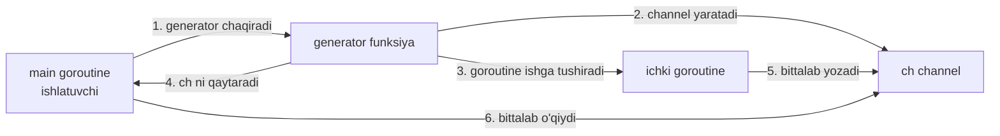
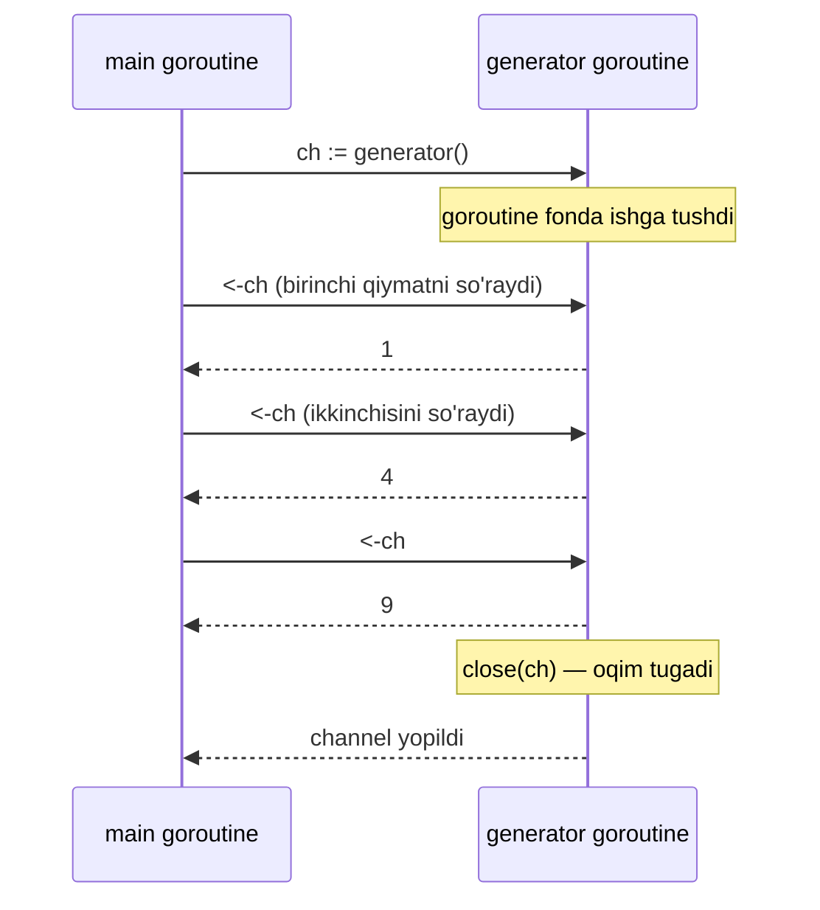
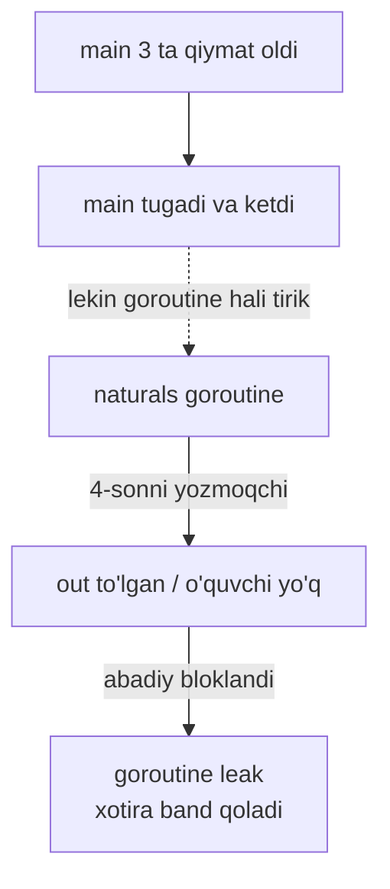

# 01 — Generator Pattern

## Kirish — nimani o'rganasiz

Bu darsda siz Go dagi eng birinchi va eng muhim concurrency pattern bilan tanishasiz — **generator**. Dars oxirida siz quyidagilarni bilib olasiz:

- Nima uchun funksiya ichida channel yaratib, uni qaytarish qulay
- **Lazy evaluation** (dangasa hisoblash) g'oyasi nima va nega kuchli
- Cheksiz ketma-ketlik (masalan, cheksiz sonlar oqimi) qanday yasaladi
- Generator'ni to'xtatish qanday muammo tug'diradi — bu **goroutine leak** ga birinchi ishora

Generator — bu keyingi barcha pattern'larning (pipeline, fan-out/fan-in, worker pool) qurilish g'ishti. Shuning uchun uni yaxshi tushunish juda muhim.

---

## Analogiya — suv idishidan chiqayotgan kran

Tasavvur qiling, sizga 1000 litr suv kerak. Ikki yo'l bor:

1. **Butun 1000 litrni bir vaqtda idishga quyib olish.** Buning uchun ulkan idish, ko'p joy va ko'p vaqt kerak. Suvning yarmini ishlatmasangiz ham, hammasi tayyor turadi.
2. **Kran o'rnatish.** Kranni ochasiz — kerak bo'lganda, kerakli miqdorda suv oqadi. Ishlatmasangiz — kran yopiq, hech narsa isrof bo'lmaydi.

**Generator — bu aynan kran.** U sizga ma'lumotni "hammasini birdan" bermaydi, balki **so'ralganda, bittalab** yetkazib beradi. Ma'lumot manbasi (kran) va uni ishlatuvchi (siz) bir-biridan ajratilgan.

> Analogiya chegarasi: krandan suv o'zi oqadi, lekin Go generator'ida ma'lumot faqat siz channel'dan **o'qiganingizda** ("stakanni tutganingizda") oldinga siljiydi. Ya'ni oqim iste'molchi tezligiga moslashadi.

---

## Muammo — bu pattern qaysi og'riqni davolaydi

Oddiy yondashuvda funksiya butun natijani **slice** (ro'yxat) qilib qaytaradi:

```go
// Muammoli yondashuv: hamma sonni birdan xotiraga to'playmiz
func firstNSquares(n int) []int {
    result := make([]int, 0, n)
    for i := 1; i <= n; i++ {
        result = append(result, i*i) // hamma natija xotirada saqlanadi
    }
    return result
}
```

Bu yerda uchta og'riq bor:

1. **Xotira isrofi.** `n` million bo'lsa, million son xotirada bir vaqtda yotadi — hattoki sizga faqat dastlabki 3 tasi kerak bo'lsa ham.
2. **Kutish.** Funksiya **hamma** ishni tugatmaguncha sizga birinchi natijani ham bermaydi. Butun ro'yxat tayyor bo'lishini kutasiz.
3. **Cheksizlik imkonsiz.** Cheksiz ketma-ketlikni (masalan, "har soniyada bitta timestamp") slice bilan umuman ifodalab bo'lmaydi — slice cheksiz bo'la olmaydi.

Generator ana shu uchala og'riqni bir vaqtda davolaydi.

---

## Yechim — channel qaytaruvchi funksiya

G'oya oddiy: funksiya **ichida** channel yaratadi, alohida **goroutine** (yengil oqim) ishga tushiradi va o'sha channel'ni **darhol** qaytaradi. Goroutine esa fon rejimida channel'ga qiymatlarni bittalab yozib boradi.



Diqqat qiling: 4-qadamda funksiya **darhol** qaytadi — hech qanday hisoblashni kutmaydi. Hisoblash 5-qadamda, faqat main o'qiy boshlaganda, fon rejimida boradi. Bu — **lazy evaluation**: ish faqat natija so'ralganda bajariladi.

### Ma'lumot va nazorat oqimi



Sequence diagramma bir muhim fikrni ko'rsatadi: generator goroutine har bir qiymatni **faqat main so'raganda** yuboradi. Agar main so'ramasa, generator kutib turadi. Bu — kran analogiyasining aynan o'zi.

---

## To'liq kod + PRIMM

Quyida to'liq, nusxalab ishga tushirsa bo'ladigan misol. Avval kod:

```go
package main

import "fmt"

// squares — generator funksiya: 1 dan n gacha sonlarning kvadratini
// bittalab channel orqali qaytaradi.
func squares(n int) <-chan int {
	out := make(chan int) // 1. ichki channel yaratamiz

	go func() { // 2. alohida goroutine ishga tushiramiz
		for i := 1; i <= n; i++ {
			out <- i * i // 3. natijani bittalab yozamiz
		}
		close(out) // 4. tugagach channel ni yopamiz
	}()

	return out // 5. channel ni darhol qaytaramiz
}

func main() {
	for v := range squares(4) { // 6. channel yopilguncha o'qiymiz
		fmt.Println(v)
	}
}
```

### Bashorat qiling

Kodni ishga tushirishdan oldin, o'zingizga savol bering:

> Ekranda qanday sonlar, qanday tartibda chiqadi? Va `squares(4)` chaqirilganda, `main` funksiya darhol davom etadimi yoki hamma kvadrat hisoblanishini kutadimi?

Javobni ochishdan oldin bir daqiqa o'ylab ko'ring.

<details>
<summary>Javobni ko'rish</summary>

Ekranda quyidagilar chiqadi:

```
1
4
9
16
```

`squares(4)` chaqirilganda `main` **darhol** davom etadi — u hisoblashni kutmaydi. Chunki `squares` funksiya faqat channel'ni qaytaradi, hisoblash esa ichki goroutine'da fonda boradi (lazy evaluation).

Sonlar aynan shu tartibda chiqadi, chunki bitta goroutine ularni ketma-ket (`1*1`, `2*2`, `3*3`, `4*4`) yozadi.
</details>

### Muhim qatorlarni tushuntirish

- **`out := make(chan int)`** — bu **unbuffered channel** (bufersiz channel). Yozuvchi va o'quvchi bir-birini kutadi: `out <- x` yozuv o'quvchi qiymatni olguncha bloklanadi.
- **`go func() { ... }()`** — hisoblashni alohida goroutine'ga ko'chirdik. Shuning uchun `return out` darhol ishlaydi.
- **`out <- i * i`** — har bir kvadrat channel'ga yoziladi. Agar main hali oldingi qiymatni o'qimagan bo'lsa, bu satr shu yerda kutib turadi.
- **`close(out)`** — MUHIM. Bu "boshqa ma'lumot yo'q" degan signal. `close` bo'lmasa, `for range` hech qachon tugamaydi va **deadlock** yuzaga keladi.
- **`return type <-chan int`** — qaytish turi `<-chan int` (faqat o'qish uchun channel). Bu shartnoma: "siz bu channel'dan faqat o'qiy olasiz, yoza olmaysiz." Kompilyator xatolardan himoya qiladi.
- **`for v := range squares(4)`** — channel ustidan `for range` channel yopilguncha o'qiydi, yopilganda avtomatik to'xtaydi.

### Notional machine — ichkarida aslida nima bo'ladi

`squares(4)` bajarilganda xotirada bitta channel struktura (navbat) va bitta goroutine paydo bo'ladi. Go **scheduler** ikkita goroutine'ni almashtirib ishlatadi: main o'qishga tayyor bo'lsa main ishlaydi, generator yozishga tayyor bo'lsa generator ishlaydi. Unbuffered channel'da ularning uchrashuvi ("rendezvous") sodir bo'lgandagina bitta qiymat qo'ldan-qo'lga o'tadi.

---

## Cheksiz generator

Generatorning eng kuchli tomoni — u **cheksiz** bo'la oladi. Slice buni hech qachon uddalay olmaydi.

```go
// naturals — 1, 2, 3, ... cheksiz sonlar oqimini qaytaradi
func naturals() <-chan int {
	out := make(chan int)
	go func() {
		for i := 1; ; i++ { // shart yo'q — cheksiz sikl
			out <- i
		}
	}()
	return out
}

func main() {
	ch := naturals()
	fmt.Println(<-ch) // 1
	fmt.Println(<-ch) // 2
	fmt.Println(<-ch) // 3
	// bizga faqat 3 tasi kerak edi — qolganini hisoblamadik ham
}
```

E'tibor bering: `naturals` cheksiz sonlarni "va'da qiladi", lekin biz faqat 3 tasini o'qidik — demak faqat 3 tasi hisoblandi. Qolgan sonlar hech qachon yaratilmaydi. Bu lazy evaluation kuchi.

Lekin bu yerda yashirin bir muammo bor...

---

## Keng tarqalgan xatolar

### Xato 1 — `close` ni unutish (deadlock)

```go
func squaresBad(n int) <-chan int {
	out := make(chan int)
	go func() {
		for i := 1; i <= n; i++ {
			out <- i * i
		}
		// close(out) UNUTILDI!
	}()
	return out
}

func main() {
	for v := range squaresBad(3) { // 1, 4, 9 chiqadi, keyin...
		fmt.Println(v)
	}
	// fatal error: all goroutines are asleep - deadlock!
}
```

`for range` channel yopilishini kutadi. Generator goroutine esa 3 ta sonni yozib bo'lgach tugab qoladi, lekin `close` chaqirmagani uchun channel ochiq qoladi. `main` navbatdagi qiymatni abadiy kutadi — bu **deadlock**. Go runtime buni aniqlaydi va dasturni "deadlock!" xatosi bilan to'xtatadi.

> Oltin qoida: generator'ni **kim yaratsa, o'sha yopadi**. `close` har doim yozuvchi goroutine ichida, hamma yozuv tugagandan keyin chaqiriladi.

### Xato 2 — yopilgan channel'ga yozish (panic)

```go
out := make(chan int)
close(out)
out <- 5 // panic: send on closed channel
```

Yopilgan channel'ga yozish — bu Go'da **panic** (dastur qulashi). Shuning uchun `close` doim eng oxirida, boshqa yozuv qolmaganda chaqiriladi.

### Xato 3 — generator'ni to'xtatmaslik (goroutine leak) — birinchi ishora

Endi eng nozik muammoga keldik. Cheksiz generator'dan atigi 3 ta qiymat oldik va ketdik:

```go
func main() {
	ch := naturals()
	fmt.Println(<-ch) // 1
	fmt.Println(<-ch) // 2
	fmt.Println(<-ch) // 3
	// main tugadi. Lekin naturals goroutine hali ham...?
}
```

`naturals` ichidagi goroutine hali ham `out <- i` satrida **abadiy kutib turadi** — u 4-sonni yozmoqchi, lekin hech kim o'qimaydi. Bu goroutine hech qachon tugamaydi, xotirani band qilib qolaveradi. Bunga **goroutine leak** deyiladi.



Kichik dasturda bu sezilmaydi (dastur tugaganda hamma goroutine yo'qoladi). Lekin uzoq ishlaydigan serverda har bir "tashlab ketilgan" generator xotirani yeydi va sekin-asta dastur qulaydi.

> Bu muammoning to'liq yechimi — **`done` channel** yoki **`context`** orqali generator'ga "to'xta" signalini yuborish. Buni **7-darsda** chuqur ochamiz. Hozircha shuni eslab qoling: **agar generator cheksiz bo'lsa yoki uni yarmida tashlab ketsangiz, uni to'xtatish yo'lini o'ylab qo'yishingiz shart.**

---

## Qachon ishlatiladi / qachon kerak emas

### Qachon juda mos keladi

- **Katta yoki cheksiz ketma-ketliklar** — fayldagi millionlab qatorlar, log oqimi, sensor ma'lumotlari.
- **Lazy o'qish** — natijaning faqat bir qismi kerak bo'lsa (masalan, "birinchi mos kelgan 10 tani top").
- **Pipeline qurish** — generator keyingi darsdagi pipeline'ning birinchi bosqichi (stage) bo'ladi.
- **Real production misol**: bazadan yozuvlarni **cursor** bilan sahifalab o'qish. Barcha million qatorni birdan tortib olmaysiz — generator ularni partiyalarga bo'lib, bittalab oqizib beradi.

### Qachon kerak emas

- **Kichik, ma'lum hajmli ma'lumot** — 5 ta element uchun channel va goroutine ortiqcha murakkablik. Oddiy slice yeting.
- **Bir marta va tez ishlatiladigan sanoq** — channel'ning qo'shimcha xarajati (overhead) foydadan ko'p bo'lib qoladi.
- **Tartib va tranzaksiya muhim bo'lganda** — bir necha manba aralashsa, generator qo'shimcha ehtiyotni talab qiladi.

> Sodda qoida: ma'lumot **oqim** (stream) bo'lsa — generator. Ma'lumot **to'plam** (collection) bo'lsa — slice.

---

## O'zingizni tekshiring

<details>
<summary>1. Nima uchun generator funksiya qaytish turini <code>chan int</code> emas, <code>&lt;-chan int</code> qilib e'lon qilamiz?</summary>

`<-chan int` — faqat o'qish uchun channel turi. Bu iste'molchiga "sen bu channel'dan faqat o'qiy olasan, yoza olmaysan" degan shartnomani kompilyator darajasida majburlaydi. Agar kimdir tasodifan generator channel'iga yozmoqchi bo'lsa, kod kompilyatsiya bo'lmaydi. Bu xatolardan himoya qiladi.
</details>

<details>
<summary>2. <code>close(out)</code> ni butunlay olib tashlasak, <code>for range</code> bilan o'qiyotgan kod nima bo'ladi?</summary>

`for range` channel yopilishini kutadi. `close` bo'lmasa, hamma qiymat o'qib bo'lingach ham `for range` navbatdagi qiymatni kutib bloklanadi. Boshqa hech qanday goroutine ishlamasa, Go runtime buni aniqlaydi va **deadlock** xatosi bilan dasturni to'xtatadi.
</details>

<details>
<summary>3. Cheksiz <code>naturals</code> generator'idan atigi 3 ta qiymat olib, main ni tugatsak, generator goroutine nima holatda qoladi?</summary>

U 4-sonni yozmoqchi bo'lib, `out <- i` satrida abadiy bloklangan holda qoladi — chunki uni o'qiydigan hech kim yo'q. Bu **goroutine leak**. Kichik dasturda dastur tugashi bilan yo'qoladi, lekin uzoq ishlaydigan serverda xotirani band qilib turadi.
</details>

<details>
<summary>4. Lazy evaluation nima degani va u xotirani qanday tejaydi?</summary>

Lazy evaluation — hisoblash faqat natija **so'ralganda** bajarilishi. Generator qiymatni faqat siz channel'dan o'qiganingizda hisoblaydi. Shuning uchun cheksiz ketma-ketlikdan faqat kerakli qismini olasiz va faqat o'sha qism xotirada bo'ladi — qolgani umuman yaratilmaydi.
</details>

<details>
<summary>5. Slice qaytaruvchi funksiya bilan generator o'rtasidagi asosiy farq nima?</summary>

Slice qaytaruvchi funksiya **hamma** natijani birdan hisoblab, xotiraga to'playdi va faqat shundan keyin qaytaradi — natija cheklangan hajmda bo'lishi shart. Generator esa channel'ni darhol qaytaradi, natijalarni bittalab, so'ralganda hisoblaydi (lazy) va **cheksiz** oqimni ham ifodalay oladi. Slice — to'plam uchun, generator — oqim uchun.
</details>

---

## Xulosa — eslab qoling

- **Generator** = channel yaratib, uni fon goroutine bilan to'ldirib qaytaruvchi funksiya.
- Funksiya **darhol** qaytadi; hisoblash **lazy** — faqat o'qilganda boradi.
- Yozuvchi goroutine hamma yozuvni tugatgach **`close`** qiladi. `close` — "ma'lumot tugadi" signali.
- **`close` ni unutish → deadlock. Yopilgan channel'ga yozish → panic. Cheksiz generator'ni tashlab ketish → goroutine leak.**
- Generator — pipeline, fan-out/fan-in va worker pool pattern'larining poydevori.

---

[Keyingi dars: 02 — Pipeline Pattern](02-pipeline.md) ➡️
