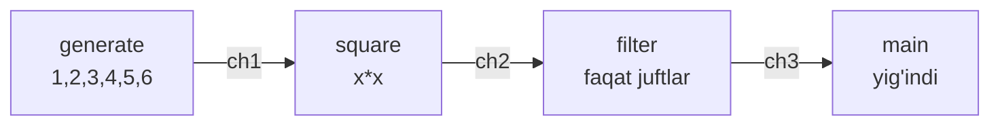
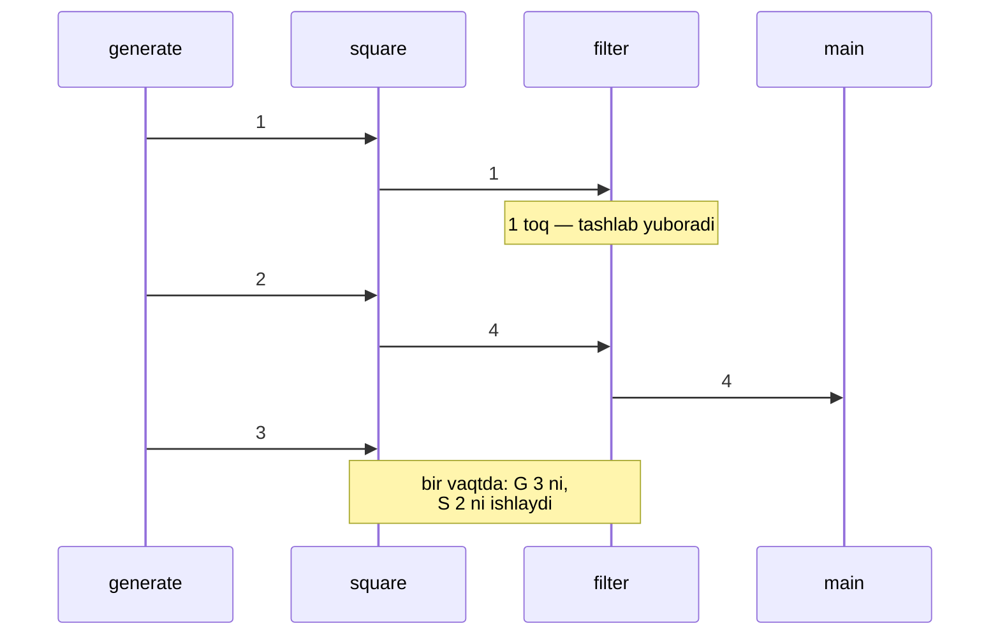
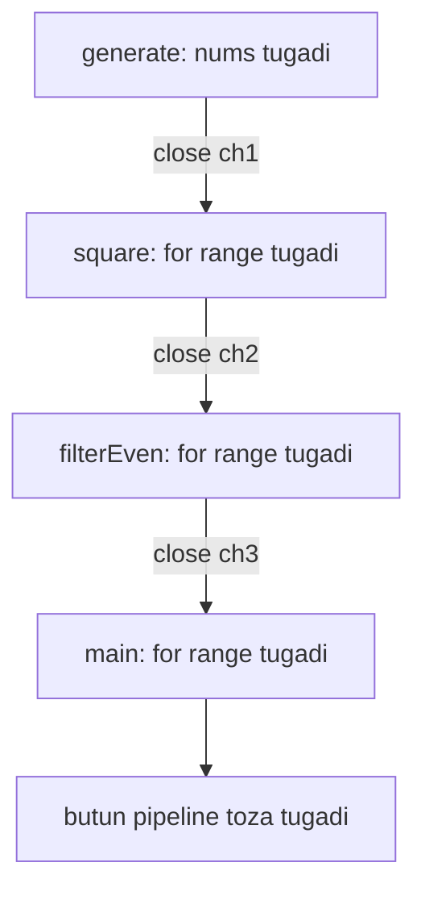
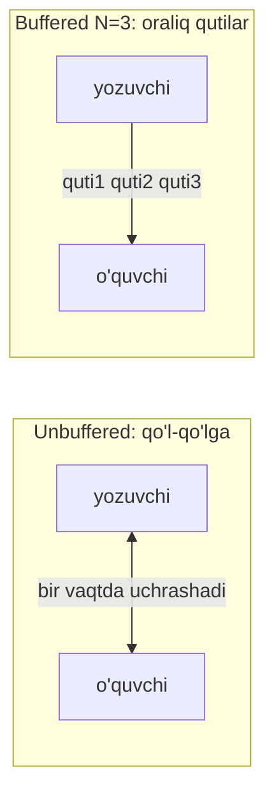

# 02 — Pipeline Pattern

## Kirish — nimani o'rganasiz

Oldingi darsda **generator** — channel qaytaruvchi funksiyani o'rgandik. Endi bir necha generatorni **zanjir** qilib ulaymiz va **pipeline** hosil qilamiz. Dars oxirida siz quyidagilarni bilib olasiz:

- **Pipeline** nima va u **stage** (bosqich) lardan qanday quriladi
- Har bir stage channel'dan qanday **o'qib**, boshqa channel'ga qanday **yozadi**
- `for range` channel ustida qanday ishlaydi
- **`close()`** signali zanjir bo'ylab qanday tarqaladi (kaskad)
- **Buffered** va **unbuffered channel** pipeline'da qanday farq qiladi
- To'liq real misol: sonlarni generatsiya → kvadratga ko'tarish → filtrlash → yig'ish

---

## Analogiya — zavod konveyer liniyasi

Avtomobil zavodini tasavvur qiling. Bitta ishchi butun mashinani boshidan oxirigacha yig'maydi. Aksincha, **konveyer liniyasi** bor:

1. Birinchi stansiya — kuzovni payvandlaydi.
2. Ikkinchi stansiya — bo'yaydi.
3. Uchinchi stansiya — g'ildiraklarni o'rnatadi.
4. To'rtinchi stansiya — tekshiradi.

Har bir stansiya **oldingisidan** detalni oladi, o'z ishini bajaradi va **keyingisiga** uzatadi. Hamma stansiyalar bir vaqtda, parallel ishlaydi — birinchi stansiya ikkinchi mashinani boshlaganda, ikkinchi stansiya hali birinchi mashinani bo'yayapti.

**Pipeline — aynan shu konveyer.** Har bir **stage** (stansiya) — bu bitta goroutine. Stansiyalar orasidagi **lenta** (transportyor) — bu **channel**. Ma'lumot lenta bo'ylab bir tomonga oqadi.

> Analogiya chegarasi: zavodda lenta doim harakatlanadi, Go pipeline'ida esa keyingi stage tayyor bo'lmasa, oldingisi kutib turadi (unbuffered channel'da). Ya'ni tezlik eng sekin stansiyaga moslashadi.

---

## Muammo — bu pattern qaysi og'riqni davolaydi

Barcha ishni bitta katta funksiyada, bitta siklda qilsak nima bo'ladi?

```go
// Muammoli yondashuv: hamma ish bitta siklda, ketma-ket
func process(n int) int {
	sum := 0
	for i := 1; i <= n; i++ {
		sq := i * i        // 1-ish: kvadrat
		if sq%2 == 0 {     // 2-ish: filtr
			sum += sq      // 3-ish: yig'indi
		}
	}
	return sum
}
```

Bu kodda uchta og'riq bor:

1. **Ketma-ketlik.** Uchala ish (kvadrat, filtr, yig'indi) bitta goroutine'da navbatma-navbat bajariladi. Ko'p yadroli protsessor bo'lsa ham, faqat bittasi ishlaydi — qolganlari bo'sh turadi.
2. **Bog'lanib qolish (coupling).** Kvadrat, filtr va yig'indi mantig'i bitta funksiyada chalkashib ketgan. Filtr shartini o'zgartirmoqchi bo'lsangiz, butun funksiyaga tegishingiz kerak.
3. **Qayta ishlatib bo'lmaslik.** "Faqat kvadratga ko'tarish" qismini boshqa joyda ishlatmoqchimisiz? Uni ajratib olib bo'lmaydi — hammasi bir joyda yopishib qolgan.

Pipeline har bir ishni alohida, mustaqil, qayta ishlatiladigan **stage** ga ajratadi.

---

## Yechim — stage'lar zanjiri

Har bir stage bitta oddiy shartnomaga bo'ysunadi: **kirish channel'idan o'qi → ishla → chiqish channel'iga yoz → tugagach chiqishni yop.**



Har bir strelka — bu alohida channel. Har bir quti — bu alohida goroutine. Ma'lumot faqat bir tomonga (chapdan o'ngga) oqadi. Bu — pipeline.

### Stage'lar bir vaqtda ishlaydi



Diqqat: generate 3-sonni ishlaganda, square hali 2-sonni ishlayapti. Stage'lar **parallel** ishlaydi — bu pipeline'ning asosiy foydasi. Har bir element zanjirdan "o'tib boradi", ular bir-birining ketidan quvib yuradi.

---

## To'liq kod + PRIMM

Quyida to'liq, nusxalab ishga tushirsa bo'ladigan pipeline. Uchta stage: `generate` → `square` → `filterEven`, natijani `main` yig'adi.

```go
package main

import "fmt"

// 1-stage: generate — sonlarni channel ga chiqaradi (generator)
func generate(nums ...int) <-chan int {
	out := make(chan int)
	go func() {
		for _, n := range nums {
			out <- n
		}
		close(out) // ma'lumot tugadi signali
	}()
	return out
}

// 2-stage: square — har bir sonni kvadratga ko'taradi
func square(in <-chan int) <-chan int {
	out := make(chan int)
	go func() {
		for n := range in { // in yopilguncha o'qiydi
			out <- n * n
		}
		close(out) // close kaskadi: in yopilgach out ni yopamiz
	}()
	return out
}

// 3-stage: filterEven — faqat juft sonlarni o'tkazadi
func filterEven(in <-chan int) <-chan int {
	out := make(chan int)
	go func() {
		for n := range in {
			if n%2 == 0 {
				out <- n
			}
		}
		close(out)
	}()
	return out
}

func main() {
	// stage larni zanjir qilib ulaymiz
	c := generate(1, 2, 3, 4, 5, 6)
	sq := square(c)
	even := filterEven(sq)

	sum := 0
	for n := range even { // oxirgi stage dan yig'amiz
		fmt.Println("qabul qilindi:", n)
		sum += n
	}
	fmt.Println("yig'indi:", sum)
}
```

### Bashorat qiling

Kodni ishga tushirishdan oldin o'ylab ko'ring:

> `generate(1, 2, 3, 4, 5, 6)` beradi. `square` ularni kvadratga ko'taradi. `filterEven` faqat juftlarni o'tkazadi. Ekranda qaysi sonlar "qabul qilindi" deb chiqadi va yakuniy yig'indi nechchi bo'ladi?

<details>
<summary>Javobni ko'rish</summary>

Kvadratlar: 1, 4, 9, 16, 25, 36. Ulardan juftlari: 4, 16, 36.

```
qabul qilindi: 4
qabul qilindi: 16
qabul qilindi: 36
yig'indi: 56
```

Yig'indi: 4 + 16 + 36 = **56**.

E'tibor bering: 1, 9, 25 (toq kvadratlar) `filterEven` da tashlab yuborildi — ular oxirgi stage'ga umuman yetib bormadi.
</details>

### Muhim qatorlarni tushuntirish

- **Har bir stage'ning imzosi bir xil**: `func stage(in <-chan int) <-chan int`. Kiruvchi channel — faqat o'qish uchun (`<-chan`), chiquvchi ham. Bu **bir xil shakl** stage'larni istalgan tartibda ulash imkonini beradi.
- **`for n := range in`** — stage kiruvchi channel yopilguncha o'qiydi. Yopilganda sikl avtomatik tugaydi.
- **`close(out)`** — har bir stage o'z chiqish channel'ini `for range` tugagach yopadi. Bu — **close kaskadi**.
- **`c := generate(...)` → `sq := square(c)` → `even := filterEven(sq)`** — bitta stage chiqishi keyingisining kirishiga ulanadi. Xuddi lego bo'laklaridek.

### `close()` zanjir bo'ylab qanday tarqaladi

Bu pattern'ning eng chiroyli jihati. Faqat **birinchi** stage `close` haqida qaror qabul qiladi (ma'lumot tugaganini biladi). Qolganlari uni "avtomatik ravishda ergashtirib" beradi:



`generate` `ch1` ni yopadi → `square` dagi `for range in` tugaydi → `square` `ch2` ni yopadi → `filterEven` dagi `for range` tugaydi → `ch3` yopiladi → `main` dagi `for range` tugaydi. **Bitta `close` signali butun zanjirni tozalab chiqadi.** Hech qanday goroutine leak yo'q, chunki har biri o'z manbasi yopilganda tabiiy ravishda tugaydi.

> Oltin qoida: har bir stage o'z **chiqish** channel'ini yopadi, o'z **kirish** channel'ini emas. Chunki channel'ni faqat unga **yozuvchi** yopishi kerak.

### Notional machine — ichkarida nima bo'ladi

Pipeline ishga tushganda xotirada 3 ta channel va (unbuffered bo'lsa) elementlar "qo'ldan-qo'lga" o'tadi. Go scheduler bir vaqtda bir necha goroutine'ni turli protsessor yadrolarida ishlata oladi. Unbuffered channel'da har bir uzatish "rendezvous" — yozuvchi va o'quvchi bir nuqtada uchrashadi, keyin ikkalasi ham davom etadi.

---

## Buffered vs unbuffered channel pipeline'da

Endi muhim savol: `make(chan int)` (unbuffered) o'rniga `make(chan int, 10)` (buffered) ishlatsak nima o'zgaradi?

**Unbuffered channel** — lentada joy yo'q. Yozuvchi qiymatni o'quvchi olguncha ushlab turadi (qo'l-qo'lga). **Buffered channel** — lentada N ta element sig'adigan qutilar bor. Yozuvchi qutilar to'lguncha o'quvchini kutmasdan yozaveradi.



Taqqoslash jadvali:

| Xususiyat | Unbuffered `make(chan int)` | Buffered `make(chan int, N)` |
|---|---|---|
| Yozuvchi bloklanadimi | Ha, o'quvchi olguncha | Yo'q, bufer to'lmaguncha |
| Sinxronizatsiya | Qattiq (har uzatish uchrashuv) | Bo'sh (bufer yumshatadi) |
| Tezlik farqi katta stage'larda | Sekin stage boshqasini to'xtatadi | Bufer tebranishlarni yumshatadi |
| Xotira | Kam | Ko'proq (bufer uchun) |
| Qachon foydali | Oddiy, tez stage'lar | Stage'lar tezligi turlicha bo'lganda |

**Muhim tushuncha**: buffered channel pipeline'ni tezlashtirishi mumkin, agar bir stage vaqti-vaqti bilan sekinlashsa. Bufer "zaxira" bo'lib, oldingi stage'ga to'xtamasdan ishlashda davom etish imkonini beradi. Lekin buffer pipeline mantig'ini **o'zgartirmaydi** — natija bir xil bo'ladi, faqat vaqt taqsimoti farq qiladi.

> Amaliy maslahat: pipeline'ni avval **unbuffered** bilan yozing (sodda va to'g'ri). Keyin, agar profiling bir stage boshqalarni to'xtatib turganini ko'rsatsa, o'sha joyga kichik bufer qo'shing. Buferni "shunchaki bo'lsin" deb qo'shmang.

---

## Keng tarqalgan xatolar

### Xato 1 — kirish channel'ini yopish (panic)

```go
func square(in <-chan int) <-chan int {
	out := make(chan int)
	go func() {
		for n := range in {
			out <- n * n
		}
		close(in) // XATO! kirishni yopmoqchi bo'lyapmiz
		close(out)
	}()
	return out
}
```

Birinchidan, `in` — bu `<-chan int` (faqat o'qish), uni `close` qilib bo'lmaydi — kompilyatsiya xatosi. Konseptual jihatdan ham: channel'ni faqat unga **yozuvchi** yopadi. `square` faqat o'qiydi, shuning uchun `in` ni yopishga haqqi yo'q. Har bir stage faqat **o'z chiqishini** yopadi.

### Xato 2 — stage ichida `close` ni unutish (deadlock kaskadi)

```go
func square(in <-chan int) <-chan int {
	out := make(chan int)
	go func() {
		for n := range in {
			out <- n * n
		}
		// close(out) UNUTILDI
	}()
	return out
}
```

`square` `out` ni yopmasa, keyingi stage (`filterEven`) dagi `for range` hech qachon tugamaydi. U navbatdagi qiymatni abadiy kutadi. Butun pipeline oxirida **deadlock**. Xato bitta stage'da bo'lsa ham, u zanjirning oxirigacha ta'sir qiladi.

### Xato 3 — yopilgan channel'ga yozish (panic)

```go
func generate(nums ...int) <-chan int {
	out := make(chan int)
	go func() {
		close(out)          // erta yopdik
		for _, n := range nums {
			out <- n        // panic: send on closed channel
		}
	}()
	return out
}
```

`close` ni yozuvdan **oldin** qo'yish — halokat. Yopilgan channel'ga birinchi yozuvda **panic**. Qoida: `close` doim eng oxirida, hamma yozuv tugagach chaqiriladi.

---

## Qachon ishlatiladi / qachon kerak emas

### Qachon juda mos keladi

- **Ma'lumotni bosqichma-bosqich o'zgartirish** — o'qish → tozalash → boyitish → saqlash kabi aniq bosqichlar bo'lsa.
- **Oqim (streaming) ishlov berish** — ma'lumot doimiy oqib kelsa (kafka, log, sensor), pipeline tabiiy tanlov.
- **Qayta ishlatiladigan bloklar** — har bir stage mustaqil, uni boshqa pipeline'da ham ishlatish mumkin.
- **Real production misol**: rasm yuklash servisi — `qabul qilish` → `hajmini o'zgartirish` → `siqish` → `bulutga saqlash`. Har biri alohida stage, har biri o'z tezligida ishlaydi.

### Qachon kerak emas

- **Bitta oddiy o'zgartirish** — faqat kvadratga ko'tarish kerak bo'lsa, butun pipeline qurish ortiqcha. Oddiy sikl yeting.
- **Stage'lar orasida kuchli bog'liqlik** — bir stage boshqasining butun natijasini talab qilsa (masalan, saralash), oqim modeli buziladi.
- **Juda kichik ma'lumot** — 5 ta element uchun 3 ta goroutine va channel qo'shimcha xarajati foydadan ko'p.

> Sodda qoida: ma'lumot **bir necha aniq bosqichdan ketma-ket o'tsa** — pipeline. Bitta qadam bo'lsa — oddiy funksiya.

---

## O'zingizni tekshiring

<details>
<summary>1. Nima uchun har bir stage o'z <b>chiqish</b> channel'ini yopadi, <b>kirish</b> channel'ini emas?</summary>

Channel'ni faqat unga **yozuvchi** yopishi kerak. Stage o'z chiqish channel'iga yozadi, shuning uchun uni yopish uning vazifasi. Kirish channel'iga esa oldingi stage yozadi — demak uni oldingi stage yopadi. Boshqaning channel'ini yopish yozilayotgan channel'da panic'ga olib kelishi mumkin.
</details>

<details>
<summary>2. <code>generate</code> stage'i <code>close(ch1)</code> qilganda, qolgan stage'lar bilan nima sodir bo'ladi?</summary>

Close kaskadi boshlanadi: `ch1` yopilishi `square` dagi `for range in` ni tugatadi → `square` `ch2` ni yopadi → bu `filterEven` dagi `for range` ni tugatadi → `ch3` yopiladi → `main` dagi `for range` tugaydi. Bitta `close` signali butun zanjirni tabiiy ravishda tozalab, hamma goroutine'ni tugatadi.
</details>

<details>
<summary>3. Unbuffered channel'ni buffered channel'ga o'zgartirsak, pipeline natijasi (chiqadigan sonlar) o'zgaradimi?</summary>

Yo'q, **natija o'zgarmaydi** — bir xil sonlar, bir xil yig'indi chiqadi. Faqat **vaqt taqsimoti** o'zgaradi: buffered channel'da yozuvchi bufer to'lmaguncha o'quvchini kutmasdan ishlaydi. Bufer stage'lar tezligidagi tebranishlarni yumshatadi, lekin mantiqni o'zgartirmaydi.
</details>

<details>
<summary>4. Bir stage'da <code>close(out)</code> ni unutsak, xato qayerda va qanday ko'rinadi?</summary>

Keyingi stage'ning `for range` i hech qachon tugamaydi — u navbatdagi qiymatni abadiy kutadi. Bu bloklanish zanjir bo'ylab tarqaladi va oxirida butun pipeline **deadlock** bo'ladi. Xato bitta stage'da bo'lsa ham, uning ta'siri butun zanjirga yetadi.
</details>

<details>
<summary>5. Nima uchun barcha stage'lar bir xil imzoga (<code>func(in &lt;-chan int) &lt;-chan int</code>) ega bo'lishi qulay?</summary>

Bir xil shakl (kirish channel → chiqish channel) tufayli stage'larni istalgan tartibda, lego bo'laklaridek ulash mumkin. Bir stage chiqishi keyingisining kirishiga to'g'ridan-to'g'ri bog'lanadi. Bu modullilik va qayta ishlatishni osonlashtiradi.
</details>

---

## Xulosa — eslab qoling

- **Pipeline** = stage'lar zanjiri; har biri **channel'dan o'qib, channel'ga yozadigan** goroutine.
- Barcha stage bir xil imzoga ega: `func(in <-chan int) <-chan int` — shuning uchun lego kabi ulanadi.
- Har bir stage faqat **o'z chiqishini** yopadi. Bitta `close` signali **kaskad** bo'lib zanjirni tozalaydi.
- Stage'lar **parallel** ishlaydi — bu asosiy foyda.
- **Unbuffered** channel natijani emas, faqat vaqt taqsimotini o'zgartiradi. Buferni faqat kerak bo'lganda qo'shing.
- Xatolar: kirishni yopish, `close` ni unutish (deadlock), erta `close` (panic).

---

⬅️ [Oldingi dars: 01 — Generator Pattern](01-generator.md) | [Keyingi dars: 03 — Fan-out / Fan-in Pattern](03-fan-out-fan-in.md) ➡️
