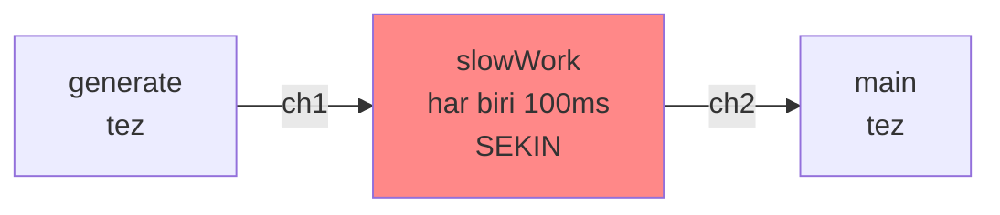
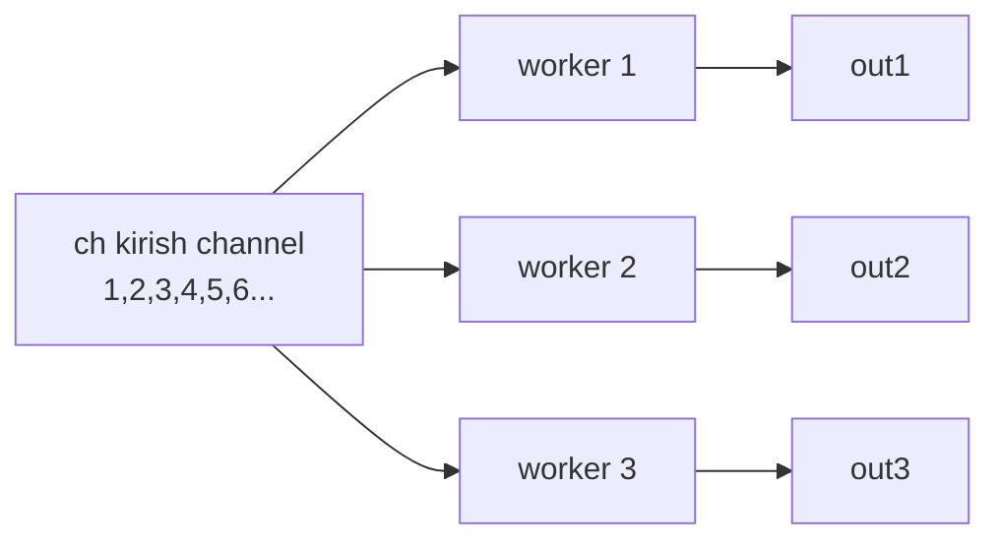
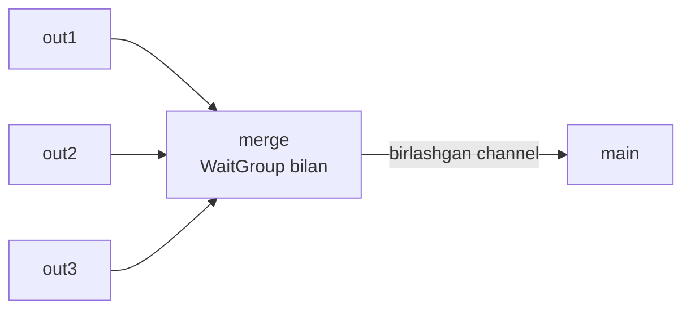
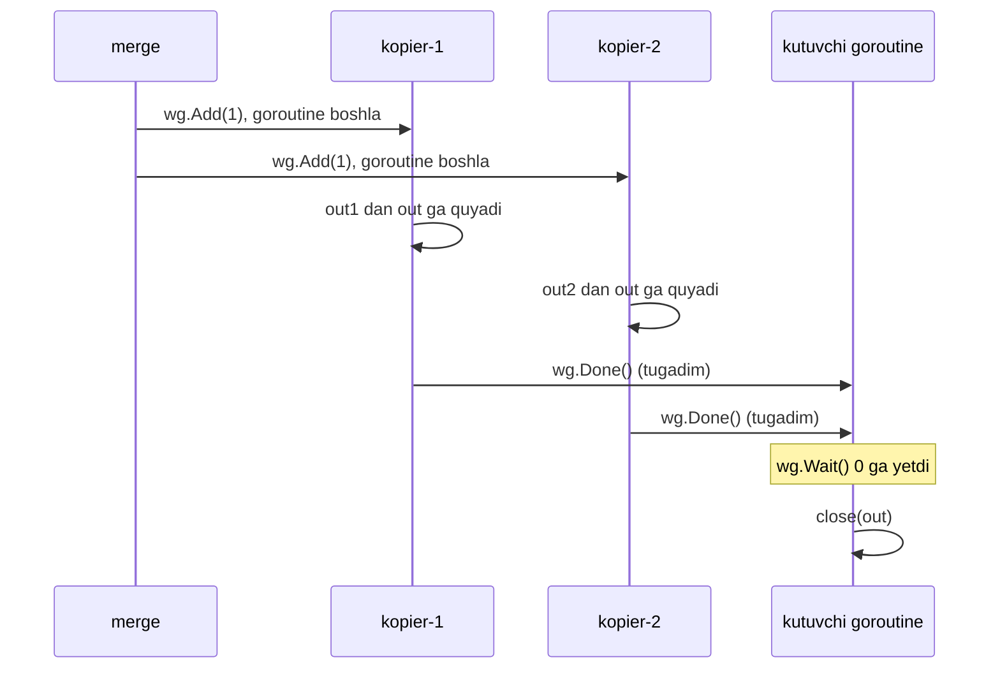
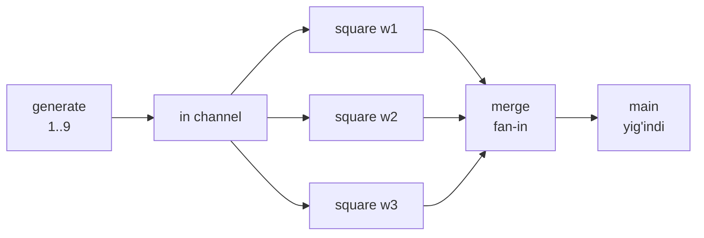
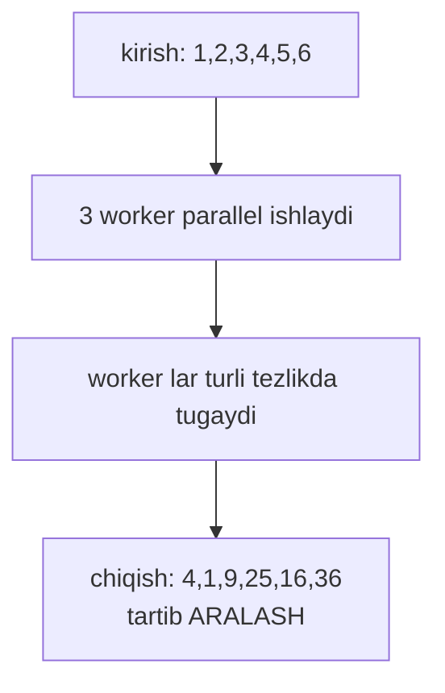

# 03 — Fan-out / Fan-in Pattern

## Kirish — nimani o'rganasiz

Oldingi darsda **pipeline** qurdik — stage'lar zanjiri. Lekin bir muammo bor edi: pipeline eng **sekin stage** tezligida ishlaydi. Agar bitta stage og'ir (masalan, tarmoq so'rovi yoki murakkab hisob) bo'lsa, u butun zanjirni sekinlashtiradi. Bu darsda ana shu muammoni **fan-out / fan-in** pattern bilan hal qilamiz.

Dars oxirida siz quyidagilarni bilib olasiz:

- **Fan-out**: bitta channel'dan **bir necha goroutine** bir vaqtda o'qishi
- **Fan-in**: bir necha channel'ni **bittaga birlashtirish** (`sync.WaitGroup` bilan `merge` funksiya)
- Pipeline'ning sekin stage'ini qanday **parallellashtirish**
- Nima uchun bu pattern **tartibni (ordering)** buzadi va bu bilan qanday yashash

---

## Analogiya — bankdagi kassalar

Bankka kirdingiz. Bitta uzun navbat bor, lekin **beshta kassa** ochiq. Qanday ishlaydi?

- **Fan-out (tarqatish)**: bitta navbatdan mijozlar beshta kassaga tarqaladi. Kassa bo'shashi bilan navbatdagi mijozni chaqiradi. Besh kassa **bir vaqtda** ishlaydi — xizmat 5 barobar tez.
- **Fan-in (yig'ish)**: har bir kassa ishini tugatgach, mijoz umumiy chiqish eshigidan chiqadi. Beshta kassadan chiqqan mijozlar bitta oqimga birlashadi.

**Fan-out / fan-in — aynan shu.** Bitta ish manbasidan (navbat = channel) bir necha ishchi (kassa = goroutine) parallel o'qiydi, keyin natijalar bitta chiqishga qayta birlashadi.

> Analogiya chegarasi: bankda mijozlar navbat tartibida chiqmaydi — tez xizmat ko'rsatilgan kassadan oldin chiqadi. Xuddi shu kabi fan-in **tartibni saqlamaydi** — natijalar tayyor bo'lish tartibida keladi, kirish tartibida emas. Buni pastda batafsil ko'ramiz.

---

## Muammo — sekin stage butun pipeline'ni to'xtatadi

Faraz qilaylik, pipeline'imizda bitta stage juda og'ir — har bir element uchun 100 millisekund ishlaydi (masalan, tashqi API ga so'rov):



Agar 100 ta element bo'lsa, `slowWork` ularni **ketma-ket** ishlaydi: 100 × 100ms = **10 soniya**. `generate` va `main` tez, lekin ular `slowWork` ni kutib bo'sh turadi. Butun pipeline eng sekin stage tezligiga "qamalib" qoladi.

Yechim aniq: `slowWork` bitta emas, **bir necha nusxada** parallel ishlasin. Agar 5 ta nusxa bo'lsa, ish taxminan 5 barobar tezlashadi — 10 soniya o'rniga ~2 soniya.

---

## Yechim 1-qism — Fan-out

**Fan-out** — bitta kirish channel'ini bir necha goroutine'ga berish. Ular hammasi **bir xil** channel'dan o'qiydi. Go channel'i buni tabiiy qo'llab-quvvatlaydi: bir channel'dan bir necha goroutine o'qisa, har bir element **faqat bittasiga** boradi (ular bir-biri bilan raqobatlashadi).



Uchala worker bitta `ch` dan o'qiydi. `ch` ga 6 ta element kelsa, ular uchta worker o'rtasida **taqsimlanadi** — masalan worker1 ga 1 va 4, worker2 ga 2 va 5, worker3 ga 3 va 6. Aniq taqsimot Go scheduler qaroriga bog'liq (oldindan aytib bo'lmaydi). Har bir worker o'z natijasini **alohida** chiqish channel'iga yozadi.

> Muhim: bir channel'dan bir necha goroutine o'qiganda, Go har bir qiymatni **faqat bitta** o'quvchiga beradi. Qiymat nusxalanmaydi — bu "raqobatli o'qish". Aynan shu bizga kerak: har bir ish faqat bir marta bajarilishi kerak.

---

## Yechim 2-qism — Fan-in (merge)

Endi uchta chiqish channel'i (`out1`, `out2`, `out3`) bor. Lekin `main` ga bitta channel qulay. **Fan-in** — bu bir necha channel'ni bittaga birlashtirish. Buni `merge` funksiya qiladi.



`merge` har bir kirish channel uchun bitta kichik goroutine ishga tushiradi. Har biri o'z channel'idan o'qib, hammasini **bitta umumiy** `out` ga quyadi. Muammo: `out` ni qachon yopish kerak? Faqat **hamma** kirish channel tugagach. Buni **`sync.WaitGroup`** hal qiladi.

**`sync.WaitGroup`** — bu sanagich (hisoblagich). "Nechta goroutine hali ishlayapti?" ni kuzatadi:

- `wg.Add(n)` — sanagichga `n` qo'shadi ("n ta goroutine boshlanmoqda")
- `wg.Done()` — sanagichni 1 ga kamaytiradi ("men tugadim")
- `wg.Wait()` — sanagich 0 bo'lguncha kutadi ("hamma tugashini kut")



---

## To'liq kod + PRIMM

Quyida to'liq, nusxalab ishga tushirsa bo'ladigan fan-out / fan-in misoli. `generate` → 3 ta parallel `square` worker (fan-out) → `merge` (fan-in) → `main`.

```go
package main

import (
	"fmt"
	"sync"
)

// generate — sonlarni channel ga chiqaradi (generator)
func generate(nums ...int) <-chan int {
	out := make(chan int)
	go func() {
		for _, n := range nums {
			out <- n
		}
		close(out)
	}()
	return out
}

// square — bitta worker: kirishdan o'qib, kvadratini chiqishga yozadi
func square(in <-chan int) <-chan int {
	out := make(chan int)
	go func() {
		for n := range in {
			out <- n * n
		}
		close(out)
	}()
	return out
}

// merge — bir necha channel ni bittaga birlashtiradi (fan-in)
func merge(cs ...<-chan int) <-chan int {
	var wg sync.WaitGroup
	out := make(chan int)

	// har bir kirish channel uchun bitta kopier goroutine
	output := func(c <-chan int) {
		for n := range c {
			out <- n
		}
		wg.Done() // bu channel tugadi
	}

	wg.Add(len(cs)) // nechta channel bor — shuncha kutamiz
	for _, c := range cs {
		go output(c)
	}

	// alohida goroutine: hammasi tugagach out ni yopadi
	go func() {
		wg.Wait()
		close(out)
	}()
	return out
}

func main() {
	in := generate(1, 2, 3, 4, 5, 6, 7, 8, 9)

	// FAN-OUT: bitta in dan 3 ta worker parallel o'qiydi
	w1 := square(in)
	w2 := square(in)
	w3 := square(in)

	// FAN-IN: 3 ta natijani bittaga birlashtiramiz
	sum := 0
	for n := range merge(w1, w2, w3) {
		fmt.Println("natija:", n)
		sum += n
	}
	fmt.Println("yig'indi:", sum)
}
```

### Bashorat qiling

Kodni ishga tushirishdan oldin o'ylab ko'ring:

> `generate` 1 dan 9 gacha sonlarni beradi. 3 ta `square` worker ularni kvadratga ko'taradi. Ekranda "natija:" sonlari **qanday tartibda** chiqadi — 1, 4, 9, 16... tartibidami? Yakuniy **yig'indi** har safar bir xil bo'ladimi?

<details>
<summary>Javobni ko'rish</summary>

Kvadratlar: 1, 4, 9, 16, 25, 36, 49, 64, 81. Ularning yig'indisi doim **285**.

Lekin ular chiqadigan **tartib har safar boshqacha** bo'lishi mumkin! Masalan bir ishga tushirishda:

```
natija: 1
natija: 9
natija: 4
natija: 25
natija: 16
...
yig'indi: 285
```

Boshqa ishga tushirishda tartib boshqacha bo'ladi. Sababi: 3 ta worker parallel ishlaydi va qaysi biri qachon tugashini Go scheduler hal qiladi — bu oldindan aniq emas. **Yig'indi doim 285** (hamma element ishlanadi), lekin **tartib kafolatlanmaydi**.
</details>

### Muhim qatorlarni tushuntirish

- **`w1 := square(in)`, `w2 := square(in)`, `w3 := square(in)`** — bu **fan-out**. Uchala worker **bir xil** `in` channel'ini oladi. Ular `in` dan raqobatlashib o'qiydi.
- **`wg.Add(len(cs))`** — nechta kirish channel bo'lsa, WaitGroup sanagichiga shuncha qo'shamiz.
- **`wg.Done()`** — har bir kopier goroutine o'z channel'i tugagach sanagichni kamaytiradi.
- **`go func() { wg.Wait(); close(out) }()`** — MUHIM naqsh. `close(out)` ni **alohida** goroutine'ga qo'yamiz, chunki `wg.Wait()` bloklaydi. Agar `wait` ni to'g'ridan-to'g'ri `merge` ichida chaqirsak, `merge` qaytmasdan qotib qoladi va `main` `out` dan o'qiy olmaydi — deadlock.
- **`for n := range merge(...)`** — birlashgan channel'dan o'qiymiz. U hamma worker tugagach (`close(out)`) tabiiy tugaydi.

### Notional machine — ichkarida nima bo'ladi

Ishga tushganda xotirada: 1 ta `in`, 3 ta worker chiqish channel'i, 1 ta merge `out`, va bir nechta goroutine (3 worker + 3 kopier + 1 yopuvchi + main). Go scheduler ularni protsessor yadrolariga taqsimlaydi. `in` channel'iga bir vaqtda 3 ta worker "qo'l cho'zadi" — scheduler ulardan birini tanlab, qiymatni beradi. Shuning uchun taqsimot va tartib har safar farq qilishi mumkin.

---

## Fan-out / Fan-in to'liq rasmi

Butun oqimni bir diagrammada ko'raylik:



Chapdan o'ngga: bitta manba **uchga bo'linadi** (fan-out), keyin **bittaga birlashadi** (fan-in). Bu — o'rtadagi sekin stage'ni parallellashtirishning standart usuli.

---

## Tartib (ordering) yo'qolishi muammosi

Bu pattern'ning eng muhim "yon ta'siri". Parallel worker'lar tufayli **natijalar kirish tartibida kelmaydi** — ular **tayyor bo'lish tartibida** keladi.



Bu muammomi? **Bog'liq:**

- **Tartib muhim EMAS bo'lsa** (masalan, yig'indi, o'rtacha, sanoq — ularga tartib farqi yo'q) — muammo yo'q, bemalol parallellashtiring.
- **Tartib MUHIM bo'lsa** (masalan, videoning kadrlari ketma-ketligi) — qo'shimcha yechim kerak. Odatda har bir elementga **indeks (tartib raqami)** biriktiriladi, natija oxirida shu indeks bo'yicha qayta saralanadi.

> Oltin qoida: fan-out / fan-in tezlik beradi, lekin tartibni "sotib oladi". Agar tartib kerak bo'lsa, har elementga indeks qo'shing va oxirida qayta tartiblang.

---

## Keng tarqalgan xatolar

### Xato 1 — `wg.Wait()` ni alohida goroutine'ga qo'ymaslik (deadlock)

```go
func mergeBad(cs ...<-chan int) <-chan int {
	var wg sync.WaitGroup
	out := make(chan int)
	wg.Add(len(cs))
	for _, c := range cs {
		go func(c <-chan int) {
			for n := range c {
				out <- n
			}
			wg.Done()
		}(c)
	}
	wg.Wait()   // XATO! shu yerda bloklanadi
	close(out)
	return out  // hech qachon bu yerga yetmaydi
}
```

`wg.Wait()` hamma kopier tugashini kutadi. Lekin kopier'lar `out <- n` da o'quvchini (main) kutadi. Main esa `mergeBad` qaytishini kutadi — u hali `wg.Wait()` da qotgan. Uchala tomon bir-birini kutadi — **deadlock**. Yechim: `wg.Wait(); close(out)` ni **alohida goroutine** ga joylang, `merge` esa `out` ni darhol qaytarsin.

### Xato 2 — sikl o'zgaruvchisini goroutine'ga noto'g'ri uzatish

```go
for _, c := range cs {
	go func() {
		for n := range c { // XATO (eski Go): hamma goroutine bir xil c ni ko'radi
			out <- n
		}
		wg.Done()
	}()
}
```

Go 1.22 dan oldingi versiyalarda sikl o'zgaruvchisi `c` hamma goroutine uchun **umumiy** edi — hammasi oxirgi channel'ni ishlagan. Yechim: `c` ni parametr qilib uzating: `go func(c <-chan int) { ... }(c)`. Go 1.22+ da bu tuzatilgan, lekin parametr sifatida uzatish — eng xavfsiz odat.

### Xato 3 — `wg.Add` ni goroutine ichida chaqirish (yopilishda poyga)

```go
for _, c := range cs {
	go func(c <-chan int) {
		wg.Add(1) // XATO! goroutine ichida, kech bo'lishi mumkin
		for n := range c {
			out <- n
		}
		wg.Done()
	}(c)
}
go func() {
	wg.Wait() // Add ishga tushishdan oldin Wait 0 ni ko'rib, out ni erta yopishi mumkin
	close(out)
}()
```

`wg.Add` goroutine **ichida** bo'lsa, `wg.Wait()` u ishga tushishdan oldin sanagichni 0 ko'rib, `out` ni erta yopib qo'yishi mumkin — keyin yopilgan channel'ga yozuv **panic** beradi. Qoida: `wg.Add` doim goroutine'larni **ishga tushirishdan oldin**, tashqarida chaqiriladi.

---

## Qachon ishlatiladi / qachon kerak emas

### Qachon juda mos keladi

- **Og'ir, mustaqil ishlar** — har bir element uchun uzoq hisob yoki tashqi so'rov (API, disk, tarmoq) bo'lsa.
- **CPU yadrolari to'liq ishlatilishi kerak** — parallel worker'lar bir necha yadroni band qiladi.
- **Tartib muhim bo'lmagan agregatsiya** — yig'indi, sanoq, filtrlash, statistika.
- **Real production misol**: 10000 ta rasmni parallel siqish. Bitta worker sekin — 20 ta worker fan-out qilib, natijalarni bitta "saqlash" channel'iga fan-in qilamiz.

### Qachon kerak emas

- **Ish yengil bo'lsa** — element ishlash worker yaratish xarajatidan arzon bo'lsa, parallellik foyda bermaydi, aksincha sekinlashtiradi.
- **Qat'iy tartib kerak bo'lsa** — va indekslash bilan murakkablashtirishni istamasangiz, oddiy ketma-ket pipeline qoldiring.
- **Umumiy resursga qattiq bog'liqlik** — hamma worker bitta qulf (mutex) uchun kurashsa, parallellik "seriyalashib" foydasi yo'qoladi.

> Sodda qoida: stage **og'ir va mustaqil** bo'lsa — fan-out. Tartib kerak bo'lsa — indeks qo'shing yoki parallellashtirmang.

---

## O'zingizni tekshiring

<details>
<summary>1. Bitta channel'dan 3 ta goroutine o'qiganda, bitta qiymat nechta goroutine'ga boradi?</summary>

Faqat **bittasiga**. Go channel'ida bir qiymat faqat bitta o'quvchiga beriladi — u nusxalanmaydi. Uchala goroutine raqobatlashadi, scheduler qiymatni ulardan biriga beradi. Aynan shu xususiyat fan-out'ni ishlatadi: har bir ish faqat bir marta bajariladi.
</details>

<details>
<summary>2. Nima uchun <code>merge</code> ichida <code>wg.Wait(); close(out)</code> ni alohida goroutine'ga qo'yamiz?</summary>

`wg.Wait()` bloklaydi — hamma kopier tugashini kutadi. Agar uni `merge` ichida to'g'ridan-to'g'ri chaqirsak, `merge` qaytmaydi va `main` `out` dan o'qiy olmaydi. Kopier'lar esa `out <- n` da main'ni kutadi. Hamma bir-birini kutadi — deadlock. Alohida goroutine'da `merge` `out` ni darhol qaytaradi, o'qish boshlanadi, hamma tugagach `out` yopiladi.
</details>

<details>
<summary>3. Fan-out / fan-in ishlatilganda natijalar kirish tartibida keladimi? Nima uchun?</summary>

Yo'q. Natijalar **tayyor bo'lish tartibida** keladi, kirish tartibida emas. Sababi: bir necha worker parallel ishlaydi va qaysi biri qachon tugashini Go scheduler hal qiladi — bu oldindan aniq emas. Tartib kerak bo'lsa, har elementga indeks qo'shib, oxirida qayta saralash kerak.
</details>

<details>
<summary>4. Yig'indi (sum) har safar bir xil bo'ladimi, tartib o'zgarsa ham?</summary>

Ha, **yig'indi doim bir xil**. Chunki qanday tartibda kelishidan qat'i nazar, **hamma** element ishlanadi va qo'shiladi. Faqat kelish tartibi o'zgaradi, elementlar to'plami emas. Yig'indi, sanoq, o'rtacha kabi tartibga bog'liq bo'lmagan amallar fan-in uchun ideal.
</details>

<details>
<summary>5. <code>wg.Add(len(cs))</code> ni goroutine'lar ichiga (<code>wg.Add(1)</code> qilib) ko'chirsak, qanday xato yuzaga keladi?</summary>

`wg.Wait()` goroutine'lar `Add(1)` ni bajarishdan oldin ishga tushib, sanagichni 0 ko'rishi va `out` ni **erta yopishi** mumkin. Keyin kopier'lar yopilgan channel'ga yozmoqchi bo'lib **panic** beradi. Shuning uchun `wg.Add` doim goroutine'larni ishga tushirishdan oldin, tashqarida chaqirilishi kerak.
</details>

---

## Xulosa — eslab qoling

- **Fan-out** = bitta channel'dan bir necha goroutine parallel o'qiydi; har qiymat faqat bittasiga boradi.
- **Fan-in** = bir necha channel'ni `merge` funksiya bilan bittaga birlashtirish.
- **`sync.WaitGroup`** hamma worker tugaganini kuzatadi: `Add` (tashqarida) → `Done` (har goroutine oxirida) → `Wait` (alohida goroutine'da, keyin `close`).
- Bu pattern pipeline'ning **sekin, og'ir stage'ini parallellashtiradi** — tezlik beradi.
- Narxi: **tartib yo'qoladi**. Tartib kerak bo'lsa — indeks qo'shing.
- Xatolar: `Wait` ni bloklovchi joyda chaqirish (deadlock), `Add` ni goroutine ichida chaqirish (panic).

---

⬅️ [Oldingi dars: 02 — Pipeline Pattern](02-pipeline.md) | [Keyingi dars: 04 — Worker Pool Pattern](04-worker-pool.md) ➡️
