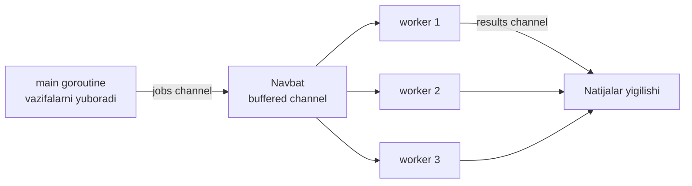
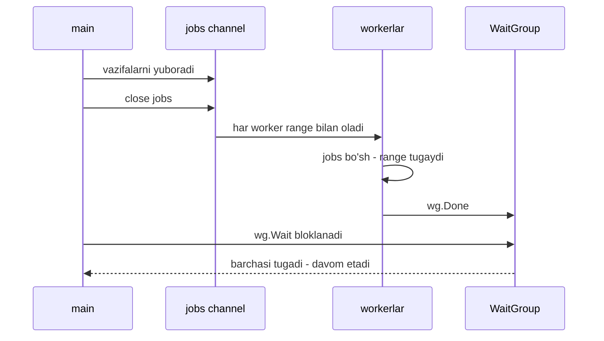

# Worker Pool pattern — cheklangan ishchilar jamoasi

> **Concurrency patterns — 4-dars**
> Maqsad: cheksiz goroutine ochish o'rniga, cheklangan sonli "ishchilar" jamoasini tuzib, resurslarni nazorat ostida ushlashni o'rganish.

---

## 1. Kirish — nimani o'rganasiz

Oldingi darslarda goroutine arzon ekanini ko'rdik: mingtasini ochsang ham hech narsa bo'lmaydi. Shu sababli tabiiy fikr paydo bo'ladi: "har vazifaga bitta goroutine ochsam bo'ldi-ku". Bu darsda nima uchun bu fikr **har doim ham to'g'ri emasligini** va uning o'rniga **worker pool** patternini qanday qurishni o'rganamiz.

Bu darsdan keyin siz quyidagilarni bilasiz:

- Nega har vazifaga yangi goroutine ochish xavfli bo'lishi mumkin.
- `jobs` channel + `results` channel + N ta worker klassik sxemasi.
- `sync.WaitGroup` yordamida barcha worker tugashini kutish.
- Worker sonini qanday tanlash: CPU-bound va IO-bound farqi, `runtime.NumCPU()`.
- Graceful shutdown: `jobs` channel'ni to'g'ri yopish.

---

## 2. Analogiya — oshxonadagi oshpazlar

Tasavvur qiling, restoranga bir kechada 500 ta buyurtma keladi.

**Yomon yechim:** har buyurtmaga bittadan yangi oshpaz yollash. 500 buyurtma — 500 oshpaz. Oshxona odamga sig'maydi, plita yetmaydi, hamma bir-biriga xalaqit beradi, mahsulot tugaydi. Xaos.

**Yaxshi yechim:** oshxonada **5 ta doimiy oshpaz** turadi. Buyurtmalar bitta **taxtaga** (navbatga) ilinadi. Har oshpaz bo'shashi bilan taxtadan keyingi buyurtmani oladi, tayyorlaydi, tayyor taomni **berish oynasiga** qo'yadi va yana keyingisini oladi.

Bu yerda:

- **Oshpazlar** = worker goroutine'lar (soni cheklangan).
- **Buyurtma taxtasi** = `jobs` channel.
- **Berish oynasi** = `results` channel.

> **Analogiya chegarasi:** Restoranda oshpazlar charchaydi, worker goroutine esa charchamaydi. Lekin cheklovchi resurs bir xil: plita (CPU), mahsulot (xotira), rozetka (tashqi API/DB). Worker pool aynan shu cheklangan resursni himoya qiladi.

---

## 3. Muammo — nega har vazifaga goroutine ochish yomon?

Keling, "har vazifaga goroutine" yondashuvini ko'ramiz:

```go
// YOMON: 1 million vazifa uchun 1 million goroutine
for _, task := range millionTasks {
    go process(task) // hech qanday chegara yo'q
}
```

Bir qarashda chiroyli. Lekin kod ortida aslida nima sodir bo'ladi?

1. **Xotira portlashi.** Har goroutine boshida ~2 KB stack oladi. 1 million goroutine ~2 GB xotira. Vazifalar ichida buffer, slice bo'lsa — bundan ham ko'p.
2. **Scheduler yuki.** Go scheduler millionta goroutine'ni CPU yadrolariga taqsimlashi kerak. Kontekst almashinuvi (context switch) ko'payadi, foydali ish kamayadi.
3. **Tashqi resursni cho'ktirish.** Agar har goroutine ma'lumotlar bazasiga ulanE, DB bir vaqtda 1 million ulanishni ko'tara olmaydi va yiqiladi. Bu eng ko'p uchraydigan real avariya.

> **Asosiy g'oya:** Goroutine arzon, lekin **u tegadigan resurs arzon emas**. CPU, xotira, DB ulanishlari, tashqi API rate limitlari — hammasi cheklangan. Worker pool goroutine'lar sonini **atayin** cheklab, shu resurslarni himoya qiladi.

---

## 4. Yechim — worker pool sxemasi

G'oya sodda: oldindan **N ta** worker goroutine ochamiz. Ular umumiy `jobs` channel'dan vazifa olib, natijani `results` channel'ga yozadi. Vazifalar tugaganda `jobs` channel'ni yopamiz — worker'lar buni sezib, tinch ishni tugatadi.

### Ma'lumot oqimi



Diqqat: bitta `jobs` channel'dan **uchala worker ham** o'qiydi. Go bir channel'ni ko'p o'quvchiga bemalol ruxsat beradi — har vazifani **faqat bitta** worker oladi (channel'da qiymat bir marta uzatiladi). Bu avtomatik ish taqsimoti.

### Worker'lar hayoti va WaitGroup



`sync.WaitGroup` — bu **sanagich** (counter). Har worker uchun `wg.Add(1)` bilan sanagichni oshiramiz, worker tugaganda `wg.Done()` bilan bittaga kamaytiramiz. `wg.Wait()` sanagich nolga tushguncha bloklanadi. Bu bizga "hamma worker tugadi" degan aniq signalni beradi.

---

## 5. To'liq kod + PRIMM

Quyida 10 ta URL'ni 3 ta worker bilan "tekshiradigan" to'liq dastur. Haqiqiy `http.Get` o'rniga `time.Sleep` bilan tarmoq kechikishini taqlid qilamiz — shunda kodni internetsiz ham ishga tushirasiz.

### Bashorat qiling

> 🤔 **Bashorat qiling:** Bu dastur nimani chiqaradi? Worker'lar qaysi tartibda ishlaydi? Oxirida jami nechta URL tekshirilgani chiqadimi?

```go
package main

import (
	"fmt"
	"sync"
	"time"
)

// checkURL — bitta URL ni "tekshiradi" (haqiqiy http.Get o'rniga simulyatsiya)
func checkURL(url string) string {
	time.Sleep(100 * time.Millisecond) // tarmoq kechikishini taqlid qilamiz
	return fmt.Sprintf("%s — OK", url)
}

// worker — jobs channel yopilguncha vazifa olib, natijani results ga yozadi
func worker(id int, jobs <-chan string, results chan<- string, wg *sync.WaitGroup) {
	defer wg.Done() // worker tugaganda WaitGroup sanagichini kamaytiramiz
	for url := range jobs { // jobs yopilmaguncha vazifa olib turamiz
		fmt.Printf("worker %d ishlayapti: %s\n", id, url)
		results <- checkURL(url) // natijani results channel ga yozamiz
	}
}

func main() {
	const numJobs = 10
	const numWorkers = 3

	jobs := make(chan string, numJobs)    // vazifalar navbati
	results := make(chan string, numJobs) // natijalar navbati
	var wg sync.WaitGroup

	// --- 1-qadam: N ta worker ishga tushiramiz ---
	for w := 1; w <= numWorkers; w++ {
		wg.Add(1) // har worker uchun sanagichni oshiramiz
		go worker(w, jobs, results, &wg)
	}

	// --- 2-qadam: jobs channel ga vazifalarni yuklaymiz ---
	for j := 1; j <= numJobs; j++ {
		jobs <- fmt.Sprintf("https://sayt-%d.uz", j)
	}
	close(jobs) // boshqa vazifa yo'q — channel ni yopamiz

	// --- 3-qadam: alohida goroutine barcha worker tugashini kutib, results ni yopadi ---
	go func() {
		wg.Wait()      // hamma worker tugashini kutamiz
		close(results) // endi results ni yopsak bo'ladi
	}()

	// --- 4-qadam: natijalarni o'qiymiz (results yopilguncha) ---
	count := 0
	for res := range results {
		count++
		fmt.Println("natija:", res)
	}
	fmt.Printf("Jami %d ta URL tekshirildi\n", count)
}
```

### Javob — nima chiqadi va nega

Chiqishning **aniq tartibi har safar farq qiladi**, chunki 3 ta worker parallel ishlaydi va qaysi biri qaysi URL'ni olishini scheduler hal qiladi. Taxminan bunday ko'rinadi:

```
worker 1 ishlayapti: https://sayt-1.uz
worker 3 ishlayapti: https://sayt-2.uz
worker 2 ishlayapti: https://sayt-3.uz
natija: https://sayt-1.uz — OK
worker 1 ishlayapti: https://sayt-4.uz
...
Jami 10 ta URL tekshirildi
```

Muhim jihatlar:

- **Tezlik.** Ketma-ket ishlasak 10 × 100ms = 1 soniya. 3 worker bilan taxminan 4 marta tez — ~350ms. Chunki bir vaqtda 3 ta URL tekshiriladi.
- **Oxirgi qator har doim `Jami 10`.** Chunki `for res := range results` faqat `results` yopilganda tugaydi, u esa faqat **hamma worker tugagach** yopiladi. Bironta natija yo'qolmaydi.

### Muhim qatorlar tahlili

- `jobs <-chan string` va `results chan<- string` — bu **yo'nalishli channel** turlari. `<-chan` faqat o'qish uchun, `chan<-` faqat yozish uchun. Bu worker faqat vazifa o'qib, faqat natija yozishini kompilyator darajasida kafolatlaydi — tasodifan xato yozib qo'ymaysiz.
- `for url := range jobs` — worker `jobs` **yopilguncha** aylanadi. Yopilgach va bo'shagach, `range` avtomatik tugaydi. Bu graceful shutdown'ning yuragi.
- `close(jobs)` — "boshqa vazifa yubormayman" degan signal. Yopilgan channel'dan qolgan qiymatlarni hali ham o'qish mumkin, lekin unga yozib bo'lmaydi.
- **Nega `close(results)` alohida goroutine'da?** Agar `main` avval `wg.Wait()` chaqirib, keyin natija o'qiganda edi — deadlock bo'lardi. Buni keyingi bo'limda ko'ramiz.

---

## 6. Worker sonini qanday tanlash?

Eng ko'p beriladigan savol: "N ni nechga qo'yay?". Javob vazifa turiga bog'liq.

| Vazifa turi | Nima cheklaydi | Optimal worker soni |
|-------------|----------------|---------------------|
| **CPU-bound** (hisob-kitob, shifrlash, rasm siqish) | CPU yadrolari soni | `runtime.NumCPU()` atrofida |
| **IO-bound** (HTTP so'rov, DB, fayl o'qish) | Tashqi resurs kutishi | Ancha ko'proq — o'nlab yoki yuzlab |

**CPU-bound** vazifada worker'lar doimo CPU'ni band qiladi. Yadrolardan ko'p worker ochsangiz — ular navbatga turadi, foyda yo'q, faqat context switch ko'payadi. Shuning uchun:

```go
numWorkers := runtime.NumCPU() // masalan 8 yadroli mashinada 8
```

**IO-bound** vazifada worker'lar ko'p vaqtni **kutib** o'tkazadi (tarmoq javobini). Kutayotgan worker CPU'ni band qilmaydi, shuning uchun ko'proq worker ochib, kutish vaqtidan foydalanish mumkin. Lekin bu yerda chegarani **tashqi resurs** belgilaydi: agar DB max 20 ulanish ko'tarsa — 20 dan ko'p worker ochish keraksiz.

> **Amaliy qoida:** CPU-bound — `runtime.NumCPU()` dan boshlab o'lchang. IO-bound — tashqi resurs limitidan (DB pool, API rate) kelib chiqib tanlang, ko'r-ko'rona kattalashtirmang.

---

## 7. Keng tarqalgan xatolar

### Xato 1 — `jobs` channel'ni yopmaslik (goroutine leak)

```go
// YOMON: close(jobs) yo'q
for j := 1; j <= numJobs; j++ {
    jobs <- fmt.Sprintf("sayt-%d", j)
}
// close(jobs) unutildi
```

**Nima bo'ladi?** Worker'lardagi `for range jobs` hech qachon tugamaydi — ular yangi vazifa kutib **abadiy uxlab qoladi**. Bu **goroutine leak**: goroutine'lar hech qachon o'lmaydi, xotira asta-sekin to'ladi. `wg.Wait()` ham hech qachon qaytmaydi (agar unga bog'liq bo'lsa — deadlock). **To'g'risi:** vazifalarni yuborib bo'lgach doimo `close(jobs)`.

### Xato 2 — natijani o'qishdan oldin `wg.Wait()` chaqirish (deadlock)

```go
// YOMON: avval kutamiz, keyin o'qiymiz
wg.Wait() // BU YERDA TIQILIB QOLADI
for res := range results {
    fmt.Println(res)
}
```

**Nima bo'ladi?** `results` channel'ning buffer'i to'lgach, worker `results <- ...` da bloklanadi (hech kim o'qimayapti). Worker bloklangani uchun tugamaydi, tugamagani uchun `wg.Done()` chaqirilmaydi, shuning uchun `wg.Wait()` hech qachon qaytmaydi. Klassik **deadlock**. **To'g'risi:** `close(results)`'ni alohida goroutine'ga chiqarib, natijalarni parallel o'qing (kodumizdagidek).

### Xato 3 — `close(jobs)` ni worker ichida chaqirish (panic)

```go
// YOMON: worker o'zi jobs ni yopmoqchi
func worker(jobs chan string) {
    for url := range jobs {
        // ...
    }
    close(jobs) // XATO: bir necha worker close chaqiradi
}
```

**Nima bo'ladi?** Bir nechta worker bir xil channel'ni yopmoqchi bo'ladi. Yopilgan channel'ni yana yopish — `panic: close of closed channel`. **Qoida:** channel'ni faqat **yozuvchi tomon** va faqat **bir marta** yopadi. Bu yerda yozuvchi — `main`, shuning uchun `close(jobs)` `main`da bo'lishi kerak.

---

## 8. Qachon ishlatiladi / qachon kerak emas

**Worker pool mos keladi:**

- Ko'p sonli **mustaqil, bir xil turdagi** vazifalar bor (ming URL, ming fayl, ming rasm).
- Tashqi resursni **himoya qilish** kerak: DB ulanishlari, tashqi API rate limit, disk IO.
- Parallellik darajasini **aniq nazorat** qilmoqchisiz.

Real production misollar: rasm/video transkoderlar (N ta worker faylni siqadi), web scraper (5-10 worker sahifalarni yuklaydi), email/notification yuboruvchilar (worker'lar navbatdan xabar oladi), ETL pipeline'lar.

**Worker pool kerak emas:**

- Vazifalar juda kam (masalan 3 ta) — pool qurish ortiqcha murakkablik, oddiygina `go` + `WaitGroup` yetadi.
- Vazifalar **bir-biriga bog'liq** va ketma-ket bajarilishi shart — parallellikning foydasi yo'q.
- Har bir vazifa allaqachon o'zining resurs limitiga ega bo'lsa (u holda **semaphore** — 6-dars — ko'proq mos kelishi mumkin).

---

## 9. O'zingizni tekshiring

<details>
<summary>1. Nima uchun 1 million vazifaga 1 million goroutine ochish yomon fikr?</summary>

Goroutine arzon bo'lsa ham, u tegadigan resurs arzon emas: har goroutine ~2 KB stack oladi (xotira portlaydi), scheduler yuki oshadi, va eng xavflisi — tashqi resurs (DB, API) millionlab bir vaqtdagi ulanishni ko'tara olmay yiqiladi.
</details>

<details>
<summary>2. Bitta jobs channel'dan 3 ta worker o'qiganda, bitta vazifani nechta worker oladi?</summary>

Faqat **bitta** worker. Channel'da har bir qiymat faqat bir marta uzatiladi — qaysidir bir worker uni "ilib" oladi, qolganlari ko'rmaydi. Shu tarzda ish avtomatik va teng taqsimlanadi.
</details>

<details>
<summary>3. Nima uchun close(results) alohida goroutine ichida wg.Wait()'dan keyin chaqiriladi?</summary>

Chunki `main` natijalarni parallel o'qishi kerak. Agar `main` avval `wg.Wait()` chaqirsa, worker'lar to'lgan `results` channel'ga yozolmay bloklanadi, `wg.Done()` chaqirilmaydi, `wg.Wait()` qaytmaydi — deadlock. Alohida goroutine kutish vazifasini bajaradi, `main` esa bir vaqtda o'qiydi.
</details>

<details>
<summary>4. CPU-bound va IO-bound vazifalar uchun worker sonini qanday tanlash farq qiladi?</summary>

CPU-bound: `runtime.NumCPU()` atrofida — ko'p worker faqat context switch'ni oshiradi. IO-bound: ancha ko'proq worker mumkin, chunki ular ko'p vaqt kutadi va CPU'ni band qilmaydi; lekin chegarani tashqi resurs limiti (DB pool, API rate) belgilaydi.
</details>

<details>
<summary>5. worker() funksiyasi channel'ni close qilsa nima bo'ladi va kim yopishi kerak?</summary>

Bir nechta worker bir channel'ni yopmoqchi bo'lib, `panic: close of closed channel` yuz beradi. Channel'ni faqat **yozuvchi tomon** va faqat **bir marta** yopishi kerak — bu yerda `main`.
</details>

---

⬅️ [Oldingi dars: Fan-out / Fan-in](03-fan-out-fan-in.md) | [Keyingi dars: Producer-Consumer pattern](05-producer-consumer.md) ➡️
