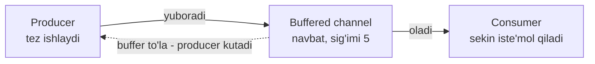
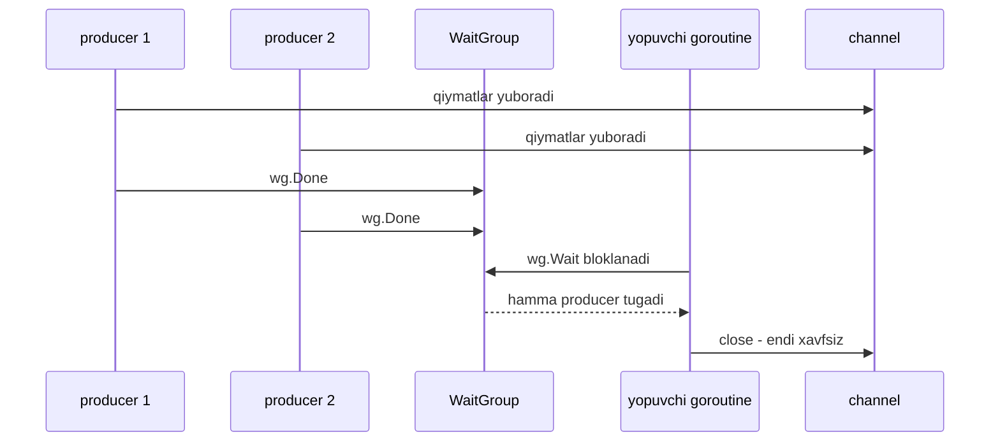

# Producer-Consumer pattern — ishlab chiqaruvchi va iste'molchi

> **Concurrency patterns — 5-dars**
> Maqsad: turli tezlikda ishlaydigan ishlab chiqaruvchi va iste'molchini buffered channel orqali bog'lash, backpressure tushunchasini his qilish.

---

## 1. Kirish — nimani o'rganasiz

Oldingi darsdagi worker pool'da bir tomon (main) vazifa yuborib, worker'lar bajarardi. Endi bu g'oyani umumlashtiramiz: **ma'lumot oqimini** ishlab chiqaruvchi (producer) va uni iste'mol qiluvchi (consumer) mavjud, va ular **turli tezlikda** ishlaydi.

Bu darsdan keyin siz quyidagilarni bilasiz:

- Producer va consumer tezligi farqi qanday muammo tug'diradi.
- **Buffered channel** — bu ikkalasi orasidagi **navbat** (queue).
- **Backpressure** nima va nega u xato emas, balki himoya mexanizmi.
- Bir nechta producer bo'lganda channel'ni **kim va qanday yopadi**.
- Producer-consumer va worker pool o'rtasidagi o'xshashlik va farq.

---

## 2. Analogiya — buyurtma taxtasi va oshpaz

Restoranga qaytamiz, lekin bu safar boshqa burchagiga qaraymiz.

**Ofitsiant** (producer) mijozlardan buyurtma oladi va har birini bir varaqqa yozib, oshxona derazasidagi **aylanma taxtaga** iladi. **Oshpaz** (consumer) taxtadan varaqni olib, taomni tayyorlaydi.

Endi diqqat: ofitsiant tez ishlaydi (30 soniyada buyurtma yozadi), oshpaz sekin (taom 5 daqiqada tayyor). Nima bo'ladi?

- **Taxta bo'lmasa:** ofitsiant har buyurtmani qo'lida ushlab, oshpaz olguncha kutib turadi. Ofitsiant bekor turadi — resurs isrofi.
- **Taxta bor:** ofitsiant varaqni ilib qo'yadi va keyingi mijozga o'tadi. Oshpaz o'z tezligida oladi. Ikkalasi **mustaqil** ishlaydi.

Va yana bir muhim jihat: taxtada faqat **10 ta ilgak** bor. To'lsa, ofitsiant yangi varaqni ilolmaydi — u **kutishga majbur**. Bu yomon narsa emas: bu oshxona bo'g'ilib qolmasligining kafolati. Aynan shu — **backpressure**.

> **Analogiya chegarasi:** Taxtadagi varaqlar tartibsiz osilishi mumkin, buffered channel esa qat'iy **FIFO** (birinchi kirgan birinchi chiqadi) tartibda ishlaydi.

---

## 3. Muammo — tezliklar farqi

Producer va consumer bir xil tezlikda ishlamaydi. Kod ortida bu qanday muammo?

**Unbuffered channel** (buffersiz) bilan ular **qattiq bog'lanadi** (tight coupling):

```go
ch := make(chan int) // buffer yo'q
ch <- 42             // consumer OLMAGUNCHA shu yerda bloklanadi
```

Har `ch <- val` da producer to'xtaydi va consumer aynan shu qiymatni olguncha kutadi. Producer 100ms'da ishlab chiqarsa, consumer 500ms'da iste'mol qilsa — producer har safar 400ms bekor kutadi. Ikkalasi bir-birining tezligiga qamalgan.

**Yechim g'oyasi:** ular orasiga **navbat** qo'yamiz. Producer navbatga tashlab, oldinga ketaveradi; consumer navbatdan o'z tezligida oladi. Navbat = **buffered channel**.



Punktir strelka — **backpressure**: buffer to'lganda producer avtomatik sekinlashadi.

---

## 4. Yechim — buffered channel navbat sifatida

**Buffered channel** — bu ichida **sig'imi** (capacity) bo'lgan channel. `make(chan int, 5)` — 5 tagacha qiymatni consumer olmasidan ham saqlab tura oladi.

| Xususiyat | Unbuffered `make(chan T)` | Buffered `make(chan T, N)` |
|-----------|---------------------------|----------------------------|
| Yuborish bloklanadimi? | Ha, har doim oluvchi kutiladi | Yo'q, buffer to'lmaguncha |
| Ishlashi | Qo'ldan qo'lga uzatish | Navbat orqali uzatish |
| Producer/consumer bog'liqligi | Qattiq (har qadamda) | Bo'sh (buffer hajmigacha) |
| Foydasi | Aniq sinxronizatsiya | Tezliklar farqini yumshatish |

### Backpressure — xato emas, feature!

Yangi o'rganuvchi ko'pincha o'ylaydi: "producer buffer to'lganda bloklandi — bu bug, buffer'ni kattaroq qilay". Bu **noto'g'ri**.

Backpressure — bu tizimning o'zini himoya qilishi. Agar producer consumer'dan doimiy tez bo'lsa va biz buffer'ni cheksiz kattalashtirsak, **butun ma'lumot xotiraga yig'iladi** va oxiri xotira tugab dastur o'ladi. Buffer to'lganda producer'ni bloklash — bu "sekinroq, men yetishmayapman" degan tabiiy signal.

> **Oltin qoida:** Backpressure — kasallik emas, sog'lomlik belgisi. Producer bloklanishi tizimning o'zini xotira portlashidan asrayotganini bildiradi. Buffer hajmi — bu "tezlik farqini yumshatuvchi zaxira", cheksiz omborxona emas.

### Bir nechta producer — channel'ni kim yopadi?

Bitta producer bo'lsa oson: u ishni tugatib `close(ch)` qiladi. Lekin **bir nechta** producer bo'lsa muammo: agar har biri o'zi yopsa — ikkinchisi yopilgan channel'ga yozib **panic** oladi, yoki channel ikki marta yopilib panic bo'ladi.

Yechim: hech bir producer channel'ni yopmaydi. Uning o'rniga `sync.WaitGroup` bilan **barchasi** tugashini kutamiz va **alohida goroutine**da bir marta yopamiz.



---

## 5. To'liq kod + PRIMM

2 ta producer raqam ishlab chiqaradi, 1 ta consumer ularni yig'indiga qo'shadi. Consumer atayin sekinroq — backpressure'ni ko'rasiz.

### Bashorat qiling

> 🤔 **Bashorat qiling:** Consumer producer'lardan sekinroq. Producer'lar to'xtab qoladimi? Oxirida qanday yig'indi chiqadi? Dastur to'g'ri tugaydimi yoki deadlock bo'ladimi?

```go
package main

import (
	"fmt"
	"sync"
	"time"
)

// producer — bir nechta raqam ishlab chiqarib channel ga yuboradi
func producer(id int, out chan<- int, wg *sync.WaitGroup) {
	defer wg.Done()
	for i := 0; i < 3; i++ {
		val := id*10 + i
		out <- val // buffer to'la bo'lsa SHU YERDA kutadi (backpressure)
		fmt.Printf("producer %d yubordi: %d\n", id, val)
		time.Sleep(50 * time.Millisecond) // producer tez ishlaydi
	}
}

// consumer — channel yopilguncha o'qib, yig'indini hisoblaydi
func consumer(in <-chan int, done chan<- int) {
	sum := 0
	for val := range in { // channel yopilmaguncha oladi
		sum += val
		time.Sleep(120 * time.Millisecond) // consumer sekin iste'mol qiladi
	}
	done <- sum // yakuniy natijani qaytaramiz
}

func main() {
	ch := make(chan int, 5) // buffer = 5, navbat sifatida
	done := make(chan int)
	var wg sync.WaitGroup

	// --- 1-qadam: consumer ni ishga tushiramiz ---
	go consumer(ch, done)

	// --- 2-qadam: bir nechta producer ni ishga tushiramiz ---
	for p := 1; p <= 2; p++ {
		wg.Add(1)
		go producer(p, ch, &wg)
	}

	// --- 3-qadam: barcha producer tugagach, alohida goroutine channel ni yopadi ---
	go func() {
		wg.Wait()
		close(ch) // faqat SHU YERDA va faqat BIR MARTA
	}()

	// --- 4-qadam: consumer natijasini kutamiz ---
	fmt.Println("Yakuniy yigindi:", <-done)
}
```

### Javob — nima chiqadi va nega

Producer'lar `10,11,12` va `20,21,22` raqamlarini yuboradi. Yig'indi: `10+11+12+20+21+22 = 96`. Chiqishning oxiri doimo:

```
Yakuniy yigindi: 96
```

Producer va consumer qatorlarining aralashuvi har safar farq qiladi. Muhim tushunchalar:

- **Dastur deadlock bo'lmaydi.** Buffer 5 bo'lgani uchun 2 ta producer jami 6 qiymatni yuboradi. Boshda 5 tasi buffer'ga sig'adi, oxirgisi consumer birortasini olguncha kutadi (qisqa backpressure) — keyin bemalol tugaydi.
- **Consumer sekinligi producer'ni to'xtatmaydi**, faqat buffer to'lganda qisqa kutadi. Buffer aynan shu farqni yumshatadi.
- **Yig'indi doimo 96** — bironta raqam yo'qolmaydi, chunki `range` channel to'liq bo'shaguncha ishlaydi.

### Muhim qatorlar tahlili

- `out <- val` — buffer to'lgan paytda producer aynan shu qatorda bloklanadi. Bu **backpressure**ning kod darajasidagi ko'rinishi: xatolik emas, kutish.
- `for val := range in` — consumer channel **yopilib va bo'shagach** tugaydi. Yopilmasa — abadiy kutadi.
- `close(ch)` faqat `wg.Wait()`dan **keyin** va **alohida** goroutine'da. Bu bir nechta producer muammosining yechimi.
- `done <- sum` va `<-done` — consumer tugaganini `main`ga bildiradi. Busiz `main` consumer natijasini kutmasdan tugab ketishi mumkin edi.

---

## 6. Keng tarqalgan xatolar

### Xato 1 — har producer o'zi `close(ch)` qiladi (panic)

```go
// YOMON: producer ichida close
func producer(out chan<- int, wg *sync.WaitGroup) {
    defer wg.Done()
    for i := 0; i < 3; i++ {
        out <- i
    }
    close(out) // XATO: 2-producer yopilgan channel ga yozadi
}
```

**Nima bo'ladi?** Birinchi producer channel'ni yopadi, ikkinchisi hali yozmoqchi — `panic: send on closed channel`. Yoki ikkinchi producer ham yopmoqchi bo'ladi — `panic: close of closed channel`. **To'g'risi:** producer'lar hech qachon yopmaydi; `WaitGroup` + alohida goroutine bir marta yopadi.

### Xato 2 — buffer'ni "muammo yechish" uchun cheksiz kattalashtirish

```go
// YOMON: backpressure ni "ochirish"
ch := make(chan int, 10000000) // 10 million
```

**Nima bo'ladi?** Producer consumer'dan doimiy tez bo'lsa, buffer asta-sekin to'ladi va **barcha ma'lumot xotiraga yig'iladi**. Oxiri: xotira tugaydi, dastur o'ladi (OOM). Katta buffer backpressure'ni **kechiktiradi**, yo'qotmaydi. **To'g'risi:** buffer'ni kichik va real tanlang; producer sekinlashishi kerak bo'lsa — sekinlashsin.

### Xato 3 — consumer'ni ishga tushirmasdan unbuffered channel'ga yozish (deadlock)

```go
// YOMON: consumer hali ishga tushmagan
ch := make(chan int) // unbuffered
ch <- 1              // hech kim olmayapti — MANGU bloklanadi
go consumer(ch)      // bu qatorga yetib bormaydi ham
```

**Nima bo'ladi?** `ch <- 1` oluvchini kutadi, lekin consumer keyingi qatorda va u hech qachon ishga tushmaydi. `fatal error: all goroutines are asleep - deadlock!`. **To'g'risi:** consumer'ni **yozishdan oldin** ishga tushiring, yoki buffered channel ishlating.

---

## 7. Qachon ishlatiladi / qachon kerak emas

**Producer-consumer mos keladi:**

- **Uzluksiz oqim** (stream) bor: loglar, hodisalar (event), metrikalar, sensor ma'lumotlari.
- Ishlab chiqaruvchi va iste'molchi **turli tezlikda** ishlaydi va ularni ajratmoqchisiz.
- **Pipeline** quryapsiz: bir bosqich chiqishi keyingi bosqich kirishi bo'ladi.

Real production misollar: log yig'uvchi (ilovalar log ishlab chiqaradi, yozuvchi diskka yozadi), Kafka/RabbitMQ uslubidagi navbatlar, video oqimni kadrlarga bo'lib qayta ishlash, real vaqtli analytics pipeline.

**Producer-consumer kerak emas:**

- Vazifa **so'rov-javob** (request-response) bo'lsa — oddiy funksiya chaqiruvi yetadi, channel ortiqcha.
- Ma'lumot **oz va bir martalik** bo'lsa — pipeline qurish keraksiz murakkablik.
- Producer va consumer **doimo bir xil tezlikda** bo'lsa — buffer foyda bermaydi.

### Worker pool bilan farqi va o'xshashligi

| Jihat | Worker Pool | Producer-Consumer |
|-------|-------------|-------------------|
| Asosiy maqsad | Ishni N ta ishchiga **taqsimlash** | Oqimni ishlab chiqarish va iste'mol **ajratish** |
| Odatiy tuzilma | 1 yuboruvchi, **N ta** worker | **M** producer, **K** consumer |
| E'tibor markazi | Parallellikni cheklash (resurs) | Tezliklar farqini yumshatish (buffer) |
| Umumiy narsa | Ikkalasi ham **channel** orqali bog'lanadi | Ikkalasi ham `WaitGroup` bilan yopadi |

Aslida ular bir oilaning a'zolari: worker pool — bu ko'p consumer'li producer-consumer'ning maxsus ko'rinishi, unda urg'u ishni taqsimlashda.

---

## 8. O'zingizni tekshiring

<details>
<summary>1. Unbuffered channel'da producer va consumer nega "qattiq bog'lanadi"?</summary>

Chunki `ch <- val` har safar consumer aynan shu qiymatni olguncha bloklanadi. Producer hech qachon consumer'dan oldinga o'tolmaydi — ikkalasi bir-birining tezligiga qamalgan. Buffer bu bog'liqlikni bo'shatadi.
</details>

<details>
<summary>2. Buffer to'lganda producer bloklandi. Bu bug'mi?</summary>

Yo'q, bu **backpressure** — feature. Producer bloklanishi tizimning "sekinroq, men yetishmayapman" degan tabiiy signali. Busiz buffer cheksiz to'lib, xotira tugab dastur o'lardi.
</details>

<details>
<summary>3. Bir nechta producer bo'lganda channel'ni kim yopishi kerak?</summary>

Hech bir producer o'zi yopmaydi. `sync.WaitGroup` bilan **barcha** producer tugashini kutib, **alohida goroutine**da bir marta `close(ch)` qilinadi. Aks holda panic: send/close on closed channel.
</details>

<details>
<summary>4. Buffer'ni juda katta qilib qo'ysak nima yutamiz va nima yo'qotamiz?</summary>

Yutamiz: producer kamroq bloklanadi. Yo'qotamiz: producer doimiy tez bo'lsa xotira asta-sekin to'lib OOM bo'ladi, va muammo (consumer sekinligi) yashiriladi. Katta buffer backpressure'ni yo'qotmaydi — faqat kechiktiradi.
</details>

<details>
<summary>5. Worker pool va producer-consumer o'rtasidagi asosiy farq nima?</summary>

Worker pool'da urg'u ishni N ta worker'ga **taqsimlash** va parallellikni cheklashda (resurs himoyasi). Producer-consumer'da urg'u ishlab chiqaruvchi va iste'molchini **ajratish** va tezliklar farqini buffer bilan yumshatishda. Ikkalasi ham channel va WaitGroup ishlatadi.
</details>

---

⬅️ [Oldingi dars: Worker Pool pattern](04-worker-pool.md) | [Keyingi dars: Semaphore pattern](06-semaphore.md) ➡️
