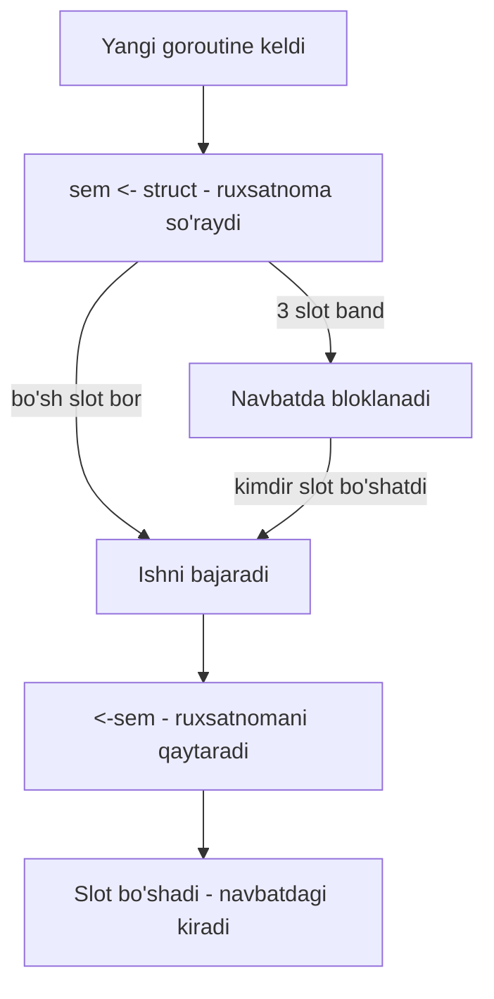
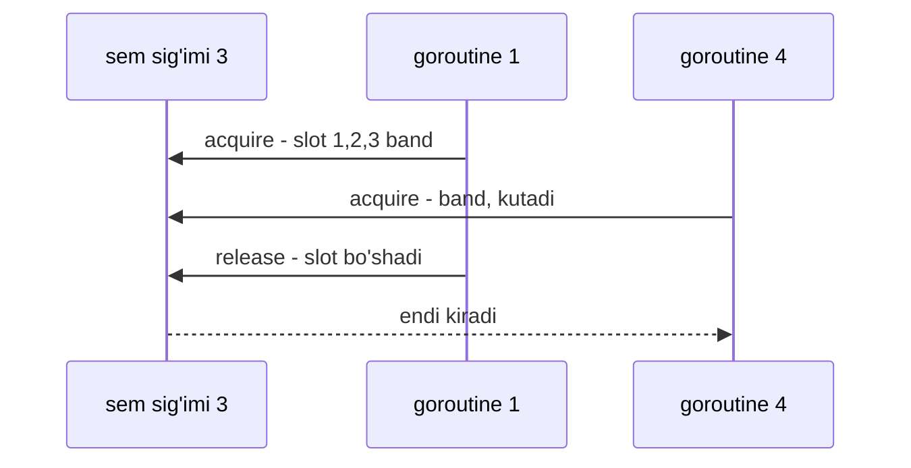

# Semaphore pattern — bir vaqtdagi kirishni cheklash

> **Concurrency patterns — 6-dars**
> Maqsad: cheklangan resursga bir vaqtda nechta goroutine kirishini nazorat qilishni buffered channel va `x/sync/semaphore` orqali o'rganish.

---

## 1. Kirish — nimani o'rganasiz

Worker pool'da goroutine sonini oldindan cheklab qo'ygandik. Endi boshqa vaziyat: goroutine'larni har vazifaga **yangidan** ochamiz (soni oldindan noma'lum), lekin ularning **bir vaqtdagi soni** N tadan oshmasligini xohlaymiz. Bu — **semaphore** patterni.

Bu darsdan keyin siz quyidagilarni bilasiz:

- Cheklangan resursga bir vaqtdagi kirishni nega va qanday cheklash kerak.
- **Buffered channel'ni semaphore sifatida** ishlatish: `sem <- struct{}{}` va `<-sem`.
- Nima uchun aynan `struct{}{}` (0 bayt) ishlatiladi.
- `golang.org/x/sync/semaphore` paketi — **weighted semaphore** (og'irlikli).
- Semaphore va worker pool o'rtasidagi aniq farq.

---

## 2. Analogiya — restorandagi stollar soni

Restoranda **3 ta stol** bor. Mijozlar oqimi cheksiz — kun bo'yi kelaveradi.

- Mijoz kelganda bo'sh stol bo'lsa — o'tiradi va ovqatlanadi.
- Bo'sh stol bo'lmasa — eshik oldida **navbatda kutadi**.
- Kimdir turib ketsa — stol bo'shaydi, navbatdagi mijoz o'tiradi.

Har doim ichkarida **ko'pi bilan 3 ta** mijoz ovqatlanadi, garchi kun bo'yi 300 ta mijoz kelib ketsa ham. Restoran hech qachon tirbandlikdan yiqilmaydi.

Bu yerda:

- **Stollar soni (3)** = semaphore sig'imi.
- **Stolga o'tirish** = `sem <- struct{}{}` (slot egallash).
- **Stoldan turish** = `<-sem` (slot bo'shatish).
- **Eshik oldida kutish** = channel to'lganda goroutine bloklanishi.

> **Analogiya chegarasi:** Restoranda har mijoz **bitta** stol egallaydi. Weighted semaphore'da esa bir "mijoz" bir vaqtda **bir necha** joyni egallashi mumkin (masalan katta kompaniya 4 kishilik stol so'raydi). Buni oxirida ko'ramiz.

---

## 3. Muammo — cheklangan resursga bosim

Tasavvur qiling, 100 ta so'rovni ma'lumotlar bazasiga yubormoqchisiz. Har so'rovga yangi goroutine:

```go
// YOMON: 100 goroutine bir vaqtda DB ga uriladi
for i := 0; i < 100; i++ {
    go queryDB(i) // DB bir vaqtda 100 ulanishni ko'tara olmaydi
}
```

Kod ortida nima bo'ladi? DB'ning ulanishlar pooli, masalan, 10 tagacha. 100 goroutine bir vaqtda urilganda: 90 tasi rad etiladi yoki navbatda qotadi, DB CPU'si oshadi, javob vaqti sekinlashadi, ba'zan butun DB javob bermay qoladi. Bir xil muammo: tashqi API rate limiti, fayl deskriptorlari, tarmoq ulanishlari.

Bizga kerak: goroutine'larni ochaveramiz (har so'rovga bittadan), lekin **bir vaqtda faqat N tasi** haqiqiy ishni bajarsin, qolganlari **navbatda** kutsin.

> **Asosiy g'oya:** Semaphore — bu "ruxsatnomalar to'plami". Ishni boshlashdan oldin ruxsatnoma olasan (bo'lmasa kutasan), tugagach qaytarasan. Ruxsatnomalar soni — bu bir vaqtdagi maksimal parallellik.

---

## 4. Yechim — buffered channel semaphore sifatida

Go'da alohida semaphore tipi yo'q, lekin **buffered channel** aynan shu vazifani bajaradi. Sig'imi N bo'lgan channel — bu N ta "ruxsatnoma".

```go
sem := make(chan struct{}, 3) // 3 ta ruxsatnoma

sem <- struct{}{}        // ruxsatnoma OLAMIZ (bo'sh joy bo'lmasa kutamiz)
// ... himoyalangan ish ...
<-sem                    // ruxsatnomani QAYTARAMIZ
```

- `sem <- struct{}{}` — channel'ga bitta element yozamiz. Buffer to'lgan bo'lsa (3 ta band) — bu qator **bloklanadi**, ya'ni goroutine navbatda kutadi.
- `<-sem` — channel'dan bitta element olamiz, ya'ni slotni bo'shatamiz. Endi navbatda kutgan goroutine kiradi.

### Nima uchun `struct{}{}`?

`struct{}` — bu **bo'sh struct**, hech qanday maydoni yo'q. U xotiradan **0 bayt** egallaydi. Bizga channel'dagi qiymatning o'zi kerak emas — bizga faqat "slot band yoki bo'sh" degan **signal** kerak. Shuning uchun eng arzon "hech narsa"ni yuboramiz.

| Element turi | Xotira | Ma'nosi |
|--------------|--------|---------|
| `chan bool` | har element 1 bayt | qiymat keraksiz, bekor xotira |
| `chan int` | har element 8 bayt | yanada ko'p bekor xotira |
| `chan struct{}` | **0 bayt** | faqat signal — eng to'g'risi |

> **Idioma:** `chan struct{}` — Go'da "faqat signal, qiymat kerak emas" degan channellarning standart usuli. `struct{}{}` — shu bo'sh struct'ning nusxasi (qiymati).

### Ish oqimi



### Bir vaqtdagi 3 goroutine cheklovi



---

## 5. To'liq kod + PRIMM

9 ta DB so'rovini **bir vaqtda ko'pi bilan 3 tasi** bajariladigan qilib cheklaymiz. Har so'rovga yangi goroutine, lekin semaphore ularni ushlab turadi.

### Bashorat qiling

> 🤔 **Bashorat qiling:** 9 ta goroutine ochilganda, chiqishda bir vaqtda nechta "so'rov boshlandi" ko'rinadi? Barcha 9 tasi darrov boshlanadimi yoki 3 tadan?

```go
package main

import (
	"fmt"
	"sync"
	"time"
)

// queryDB — DB so'rovini taqlid qiladi (haqiqiy DB o'rniga time.Sleep)
func queryDB(id int, sem chan struct{}, wg *sync.WaitGroup) {
	defer wg.Done()

	sem <- struct{}{}        // ruxsatnoma olamiz (3 ta band bo'lsa kutamiz)
	defer func() { <-sem }() // ish tugagach ruxsatnomani qaytaramiz

	fmt.Printf("so'rov %d BOSHLANDI\n", id)
	time.Sleep(500 * time.Millisecond) // DB ishini taqlid qilamiz
	fmt.Printf("so'rov %d tugadi\n", id)
}

func main() {
	const maxConcurrent = 3
	sem := make(chan struct{}, maxConcurrent) // 3 ta ruxsatnoma
	var wg sync.WaitGroup

	// --- Har so'rovga yangi goroutine, lekin sem bir vaqtda 3 tasini o'tkazadi ---
	for i := 1; i <= 9; i++ {
		wg.Add(1)
		go queryDB(i, sem, &wg)
	}

	wg.Wait() // barcha so'rovlar tugashini kutamiz
	fmt.Println("barcha so'rovlar tugadi")
}
```

### Javob — nima chiqadi va nega

Chiqish **to'lqin-to'lqin** bo'ladi: har safar 3 tadan "BOSHLANDI", keyin 3 tasi "tugadi", so'ng keyingi 3 tasi. Taxminan:

```
so'rov 1 BOSHLANDI
so'rov 2 BOSHLANDI
so'rov 3 BOSHLANDI
so'rov 1 tugadi
so'rov 4 BOSHLANDI
so'rov 3 tugadi
so'rov 2 tugadi
so'rov 5 BOSHLANDI
so'rov 6 BOSHLANDI
...
barcha so'rovlar tugadi
```

Muhim tushunchalar:

- **9 goroutine darrov ochiladi**, lekin faqat **3 tasi** `sem <- struct{}{}` dan o'tadi. Qolgan 6 tasi shu qatorda bloklanadi.
- Har `defer func(){ <-sem }()` slot bo'shatganda, navbatda kutgan goroutine ichkariga kiradi. Shuning uchun to'lqin-to'lqin.
- Umumiy vaqt ~1.5 soniya (9 so'rov / 3 parallel × 500ms), 4.5 soniya emas.

### Muhim qatorlar tahlili

- `sem <- struct{}{}` — bu **acquire** (egallash). Aynan shu joyda parallellik cheklanadi.
- `defer func() { <-sem }()` — bu **release** (qaytarish). `defer` juda muhim: agar `queryDB` ichida panic yoki erta `return` bo'lsa ham, `defer` slotni baribir bo'shatadi. Busiz slot mangu band qolib, sekin-asta hamma slot tugab, **deadlock** bo'ladi.
- Diqqat: `sem` — bu **worker pool'dagi `jobs` channel emas**. Bu yerda channel qiymat tashimaydi, faqat **slotni sanaydi**. Vazifani esa har goroutine o'zi olib yuradi (`id`).

---

## 6. `golang.org/x/sync/semaphore` — weighted semaphore

Channel usuli sodda holatda juda yaxshi. Lekin ba'zan har vazifa **turli miqdorda** resurs so'raydi. Masalan, kichik so'rov 1 birlik, katta so'rov 3 birlik xotira oladi. Buni **weighted semaphore** (og'irlikli) hal qiladi.

```go
import (
	"context"
	"golang.org/x/sync/semaphore"
)

sem := semaphore.NewWeighted(3) // umumiy sig'im 3 birlik
ctx := context.Background()

sem.Acquire(ctx, 2) // 2 birlik oladi (endi 1 birlik qoldi)
// ... ish ...
sem.Release(2)      // 2 birlikni qaytaradi
```

| Xususiyat | Channel semaphore | `x/sync/semaphore` |
|-----------|-------------------|--------------------|
| Har vazifa og'irligi | Doimo 1 | Turlicha bo'lishi mumkin |
| `context` bilan bekor qilish | Yo'q (qo'shimcha kod kerak) | Bor — `Acquire(ctx, n)` |
| Murakkablik | Juda oddiy | Biroz ko'proq |
| Qachon | Har vazifa teng "og'ir" | Vazifalar turli "og'ir" |

`Acquire(ctx, n)` yana bir foydali: agar `ctx` bekor qilinsa (masalan timeout), kutish to'xtaydi va xato qaytadi. Bu **cancellation** — keyingi darsning mavzusi. Sodda holatda channel usuli, murakkabda `x/sync/semaphore`.

---

## 7. Keng tarqalgan xatolar

### Xato 1 — slotni bo'shatmaslik (goroutine leak / deadlock)

```go
// YOMON: <-sem yo'q
func queryDB(sem chan struct{}) {
    sem <- struct{}{} // slot oldik
    doWork()
    // slotni qaytarishni unutdik!
}
```

**Nima bo'ladi?** Har goroutine slotni oladi, lekin qaytarmaydi. 3 ta so'rovdan keyin barcha slot band, 4-goroutine `sem <- struct{}{}` da mangu kutadi. Sekin-asta hamma goroutine tiqiladi — **deadlock** yoki **goroutine leak**. **To'g'risi:** doimo `defer func(){ <-sem }()` — panic bo'lsa ham bo'shaydi.

### Xato 2 — acquire va release tartibini adashtirish

```go
// YOMON: avval bosatib, keyin egallash
<-sem             // bo'sh channel dan o'qimoqchi — bloklanadi
doWork()
sem <- struct{}{}
```

**Nima bo'ladi?** Boshda channel bo'sh, `<-sem` o'qishga hech narsa yo'q — darrov bloklanadi (yoki mantiq butunlay buziladi). **Qoida:** doimo avval **acquire** (`sem <-`), keyin ish, keyin **release** (`<-sem`).

### Xato 3 — semaphore'ni unbuffered qilib qo'yish

```go
// YOMON: sig'im 0
sem := make(chan struct{}) // buffer yo'q — 0 ta ruxsatnoma
sem <- struct{}{}          // hech kim olmaydi — MANGU bloklanadi
```

**Nima bo'ladi?** Sig'imi 0 bo'lgan channel — bu "0 ta ruxsatnoma". Birinchi `sem <- struct{}{}` oluvchini kutadi, lekin oluvchi yo'q — **deadlock**. **To'g'risi:** `make(chan struct{}, N)` — N ni **aniq musbat** son qiling.

---

## 8. Qachon ishlatiladi / qachon kerak emas

**Semaphore mos keladi:**

- Vazifalar soni **oldindan noma'lum** yoki dinamik keladi (masalan HTTP handler'da har so'rov yangi goroutine).
- Tashqi resursning **bir vaqtdagi** limitini himoya qilish kerak: DB ulanishlar pooli, tashqi API concurrency limiti, disk/tarmoq IO.
- Har vazifa mustaqil va uni **o'z goroutine'sida** bajarmoqchisiz, lekin umumiy bosimni cheklamoqchisiz.

Real production misollar: HTTP server'da har so'rov uchun tashqi API'ga chaqiruvni 10 ta bilan cheklash, fayllarni parallel yuklab olishda bir vaqtda 5 ta ulanish, rasm qayta ishlashda xotirani weighted semaphore bilan chegaralash.

**Semaphore kerak emas:**

- Vazifalar **doimiy oqim** bo'lsa va siz **doimiy worker'lar** xohlasangiz — worker pool arzonroq (goroutine ochish overhead'i yo'q).
- Vazifa **juda ko'p** (millionlab) bo'lsa — har biriga goroutine ochish (semaphore ushlab tursa ham) baribir ko'p goroutine yaratadi; worker pool yaxshiroq.

### Semaphore va Worker Pool — aniq farq

| Jihat | Worker Pool | Semaphore |
|-------|-------------|-----------|
| Goroutine'lar | **N ta doimiy** worker, qayta ishlatiladi | Har vazifaga **yangi** goroutine ochiladi |
| Nimani cheklaydi | Worker soni (= parallellik) | Bir vaqtdagi aktiv goroutine soni |
| Channel roli | `jobs` — vazifani **tashiydi** | `sem` — faqat **slot sanaydi** |
| Overhead | Past (goroutine qayta ishlatiladi) | Ko'proq (har vazifaga goroutine) |
| Qulaylik | Ish soni oldindan ma'lum, ko'p | Ish dinamik keladi, kod sodda |

Qisqasi: worker pool "5 ta doimiy oshpaz navbatdan ish oladi", semaphore "har buyurtmaga yangi oshpaz keladi, lekin oshxonaga bir vaqtda faqat 3 tasi kiradi".

---

## 9. O'zingizni tekshiring

<details>
<summary>1. Nima uchun semaphore'da chan bool emas, chan struct{} ishlatiladi?</summary>

Chunki bizga channel'dagi qiymatning o'zi kerak emas — faqat "slot band yoki bo'sh" degan signal kerak. `struct{}` xotiradan **0 bayt** oladi, `bool` esa 1 bayt bekor sarflaydi. `chan struct{}` — Go'dagi "faqat signal" idiomasi.
</details>

<details>
<summary>2. sem <- struct{}{} qatori qachon bloklanadi?</summary>

Channel'ning buffer'i to'lgan paytda, ya'ni allaqachon N ta slot band bo'lsa. Goroutine shu qatorda kutadi, toki kimdir `<-sem` bilan slot bo'shatmaguncha. Bu — parallellikni cheklaydigan asosiy nuqta.
</details>

<details>
<summary>3. defer func(){ <-sem }() ni oddiy <-sem bilan almashtirsa nima xavf bor?</summary>

Agar ish ichida panic yoki erta `return` bo'lsa, oddiy `<-sem` bajarilmay qoladi va slot mangu band qoladi. Sekin-asta hamma slot tugab, boshqa goroutine'lar mangu kutadi — deadlock. `defer` esa har qanday holatda (panic bilan ham) slotni bo'shatadi.
</details>

<details>
<summary>4. Semaphore channel'ini make(chan struct{}) (buffersiz) qilib qo'ysa nima bo'ladi?</summary>

Sig'imi 0 bo'ladi — ya'ni "0 ta ruxsatnoma". Birinchi `sem <- struct{}{}` oluvchini kutadi, lekin oluvchi yo'q — darrov deadlock. Semaphore uchun buffer **musbat** (`make(chan struct{}, N)`) bo'lishi shart.
</details>

<details>
<summary>5. Worker pool o'rniga semaphore qachon tanlaysiz?</summary>

Vazifalar soni oldindan noma'lum va dinamik kelganda (masalan HTTP handler'da har so'rov yangi goroutine), va kodni sodda tutmoqchi bo'lganda. Doimiy oqim va ko'p ish bo'lsa — worker pool arzonroq, chunki goroutine'lar qayta ishlatiladi.
</details>

---

⬅️ [Oldingi dars: Producer-Consumer pattern](05-producer-consumer.md) | [Keyingi dars: Cancellation va Context](07-cancellation-context.md) ➡️
